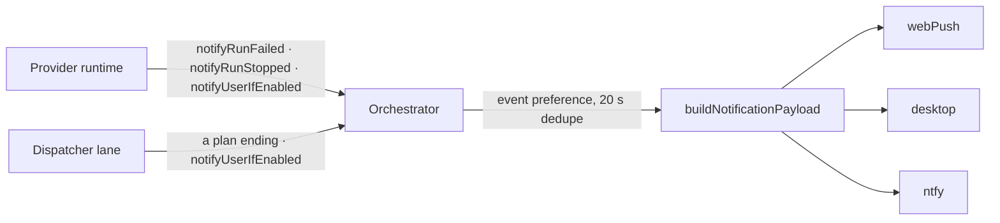

<!-- docstore export; edit rows with docstore write, never this file -->

## MAN-1359 — docs

One document per user-facing piece of the fork: the account, application and CLI-version switchers, chat contracts, the file, git, kanban, schedules, notifications and API panels, memory intake, hosting, the launcher-souls and dispatcher lanes, and the verification harness.

governs: /home/lyphe/.claude/claudecodeui_lyphe/docs/

## MAN-460 — The account switcher
section: accounts/000

The foot of the sidebar: which Claude account signs the next request, how much of its windows that
account has spent, what is left on the DeepSeek account this host's builds spend, and the two writes
that change the first of those. `src/modules/accounts/` is `AccountPopover` (with `UsageMeters`, its
own `AccountRow`, and `DeepseekBalanceReadout`) under the one `AccountFooterRow` its barrel exports,
with `hooks/useClaudeAccounts` holding the picture and the writes, `hooks/useClaudeUsage` holding
the readings, `hooks/useDeepseekBalance` holding the balance, and `utils/accountInitials` drawing the
two letters on the avatar. Everything but the balance comes from this app's own server, in
`server/modules/accounts/`: `accounts.routes.ts` holds the four routes and the calm 200,
`usage.service.ts` the reading and its cache, `account-store.service.ts` the slots (under
`CLOUDCLI_ACCOUNTS_ROOT`, default `~/.cloudcli/accounts`). `server/index.ts` mounts them at `/api`
behind `authenticateToken`, applied by PREFIX — the comment at the mount says why a list of paths is
not enough. What the client must do with what they answer is §"The rules that bite" below. The
balance does not come from there, and its own server half is MAN-511.

**Two origins, one panel.** The balance is not a third usage window and not a second reading of the
same account — it is a different account, at a different vendor, reached by a route of its own. So
the panel draws it OUTSIDE the branch that replaces the meters when the accounts lane cannot answer,
and a meter that fails cannot take the money down with it. The two also fail differently: the
accounts picture is read off local files and the usage figures from Anthropic through a cache, while
this route goes out to api.deepseek.com for every reading the server takes.

**One row, one poller.** `SidebarFooter` renders `AccountFooterRow` above Settings and
`SidebarCollapsed` renders the same component as the rail's avatar, and never both at once. That
mutual exclusion is the whole design: all three hooks live inside the row, so the app holds exactly
one poller per reading no matter how often the panel is opened or the sidebar collapsed. The row hands its ONE balance reading to both registers it draws, so the line under the
account name and the block in the panel cannot disagree.

governs: /home/lyphe/.claude/claudecodeui_lyphe/server/index.ts

## MAN-461 — The nine rules the server half keeps
section: accounts/001 The nine rules the server half keeps

These are the lane's own rules — what the server may answer and what it may never claim. They came
over with the routes when the lane moved in-house, and they are kept because the CLIENT is built on
them: the panel's branches on `reachable`, on `unreadable` and on a window's `percent` were not
touched, so the answers may not change underneath it. What each answer looks like on screen is
§"The rules that bite" below; the two sets are about different halves and neither restates the other.

1. **A read never fails.** The `{ reachable }` envelope is kept: `true` with the picture, or `false`
   with a ONE-WORD reason — never a 5xx, never a 503. An outage used to be a remote that stopped
   answering; there is no remote now, so a read that cannot be computed still answers 200 and says
   so, and the panel draws its calm unknown rather than an error wall. A picture is whole or it is
   none: `stateSummary()` answering `null` is the *unreadable* branch (`slots: []`, every label
   `null`, `unreadable: true`), which is a different answer from `{ reachable: false }`.
2. **A write's verdict is its own body.** A refusal answers `{ error: "<words>" }` with the store's
   422, carrying the store's own plain English — the most useful thing an operator can be handed —
   and never the global handler's nested shape. A genuine fault on a WRITE goes to `next`: unlike
   the reads, a write that did not happen must not read as one that did.
3. **Unknown is `null`, never `0`.** `percent`, `expiresAt`, `liveExpiresAt`, `staleSince` and
   `resetsAt` stay null when there is none; a `0` is a reading and says so. Units differ and are not
   converted: `expiresAt`/`liveExpiresAt` are epoch MILLISECONDS, `checkedAt`/`staleSince` epoch
   SECONDS, `resetsAt` an ISO-8601 string.
4. **`rolled: true` is not zero.** The percent is real but historical, its window since ended, and it
   survives intact — `markRolled` (`usage-windows.ts`) decides it from the window's own stamp, taking
   an offset-less stamp as UTC, the same rule the client's countdown applies.
5. **`severity` is present only when the vendor flagged that window.** Its mere PRESENCE is the
   signal, and it may ESCALATE a meter's tone, never soften it.
6. **Three answers are neither a picture nor a failure**, all arriving `reachable: true` with nobody's
   word but the reading's: `unreadable: true` (the store would not read), `windows: []` with
   `reason: 'pending'` (a poll in flight — reading, not broken), and `windows: []` with
   `degraded: true` (no figures under this account, but an older reading survives). `reason` is ours
   when `reachable` is false, and never a vendor's claim when it is true.
7. **The token seam, and its five bounds.** `usage.service.ts` is the ONE place in this server that
   holds a credential, because the vendor's endpoint wants a Bearer header: one reader
   (`readCredentials`, the only token read server-side), never logged, never persisted, never on an
   error path (every failure collapses to a fixed reason vocabulary and a status int), and never
   following a redirect (`redirect: 'manual'`, so a 3xx is read and never chased — a
   redirect-following fetch copies its headers onto the next hop). An expired token, a 401 or a dead
   network keeps the last good number on screen with `degraded: true` and `staleSince`, and
   SURRENDERS it the moment the credential stamp moves. The account store beside it takes the
   opposite stance — the credential BYTES are copies, never readings.
8. **The store's three rules, all load-bearing.** CAPTURE-FIRST: `install()` files the live pair
   under the slug of the live file's OWN identity before a byte moves, so the login being replaced is
   saved first. DRIFT IS A FULL-EMAIL COMPARE against the ACTIVE SLOT's stored identity and never one
   re-derived from a slug, and unprovable drift reads FALSE — an alarm that fires on every poll is
   worse than a missed one. THE CREDENTIAL BYTES ARE COPIES, NEVER READINGS: the pair is copied
   file-to-file, and the one value ever read out of a credentials file is `claudeAiOauth.expiresAt`,
   a freshness clock and not a secret. Every write is temp-file-then-rename (the server is one JS
   thread, so the staging order is the lock), slots are `0700` and files `0600`, and
   `CLOUDCLI_ACCOUNTS_ROOT` is read at CALL time so a probe gets the scratch root it set — while the
   live pair is deliberately NOT redirectable, since a variable that moved it could swap a login
   nobody named.
9. **Nothing in this lane is callable by an agent.** The four routes sit behind `authenticateToken`
   on the app's own mount, and no MCP verb, no dispatch path and no board tool reaches them: a
   switch or a capture is a person pressing a row. The same fence over the memory lane's own two
   verbs is MAN-606.

## MAN-462 — What the footer row says
section: accounts/002 What the footer row says

The avatar's initials come from the local part of the active label and nothing else — everyone here
shares a domain, so a domain letter hides identity rather than carrying it. The label sits beside
it, truncated, with the full address in a `title`. Under the label are the two windows worth a
glance, as inline `Meter`s: the `five_hour` and `seven_day` windows, each labelled with its reset
countdown where the reading gives one and with `5h`/`7d` where it does not, and `usage —` on the line
instead when neither window is in the reading. A window absent from the reading draws no bar at all;
a window present with `percent: null` draws an empty track and an em-dash, which is the one honest
picture of "nobody has this number".

Under those, in the same column, is the DeepSeek balance — `DeepSeek $12.34`, or `DeepSeek —` where
there is no reading. It draws while the meters are unknown too, because the two sources fail
independently. The `▼` is decoration; the row itself is the button, and it carries
`aria-haspopup="dialog"` with `aria-controls` pointed at the panel while it is open.

With no picture the label is `—` and the avatar is muted. Collapsed, the same component draws the
avatar alone under an `Account <label>` label, and a click opens the sidebar rather than a panel
there is no room for.

## MAN-463 — What the panel says
section: accounts/003 What the panel says

A `Card` with `role="dialog"`, anchored `bottom-full` above the row, capped at `70vh` and scrolling
from a top edge the reader can see. Usage first, the DeepSeek balance under it, the switcher below
both.

| The server answered | The panel draws |
|---|---|
| a picture with slots | the meters, `Switch account · N`, the date line, one row per slot, `+ Add another account` |
| `unreadable: true` | the count reads `0` and no rows follow, under *The saved accounts could not be read — none can be listed.* — said in words, because an empty switcher otherwise reads as "you have no accounts" |
| `reachable: false` | *The server could not read accounts or usage — both are unknown.* in place of the meters, the count as an em-dash, no rows and no add button |
| nothing yet | the meters draw an em-dash and the count reads `—`; the first reading normally lands before anyone opens the panel |

The balance block renders in EVERY one of those rows, including `reachable: false` — it is drawn
from a different origin, so it stands where the meters cannot. It is
`DeepseekBalanceReadout` in its `stacked` register: *DeepSeek balance* on the left, the figure on the
right in the same type the `Meter`'s value uses, and one faint line under it — the reason, where
there is one: *Balance unknown — no DeepSeek API key is set on this server.*, *…DeepSeek refused the
API key this server holds*, *…DeepSeek did not answer in time*, *…DeepSeek could not be reached*,
*…DeepSeek answered with something this app could not read*. With nothing to explain the line is
*Read at 13:43*: a healthy figure still owes its age, because the panel is where someone checks the
money after something stopped, and a frozen tab would otherwise hold an old number that looks fresh.

It is deliberately NOT a `Meter`. Every other reading on this surface is a share of a limit, and the
`Meter`'s whole business is the bar that share is drawn on — a balance has no limit to be a share OF,
so a bar over money would have to invent the ceiling it is measured against. It is a component of its
own for exactly that reason: `UsageMeters` draws windows, and this is not one.

Every non-active slot is one button carrying its slug — the whole row, since there is no second
control on it to nest. The account in use is not a button at all: it carries a `✓` glyph, its own
tint, and `in use now · N sessions running` (or `· none proven running`, which is a fact the row
states and never a gate). The route always states `0` sessions — this server has no session registry
to count (`LIVE_SESSIONS_UNKNOWN` in `accounts.routes.ts`) — so today the row always reads `none
proven running`. Under every other row is `Saved copy expires`/`expired <local date>`, and `—` where
the store never read one.

Under that, every row — active or not — carries its own weekly-quota reset line when one is
configured: `Weekly · Fri 2:00 PM · 2d 21h 14m`. It is not read from anywhere — a docked slot's
credentials are a snapshot whose access token has already expired, so there is no live quota to
poll — it is computed from the operator's own `VITE_ACCOUNT_WEEKLY_RESETS`, comma-separated
`<slot slug>=<Weekday>@<HH:MM>` entries (`work=Friday@14:00,home=Tuesday@00:00`), anchored as
wall-clock time in `VITE_ACCOUNT_RESET_ZONE` (an IANA name; unset defaults to the reader's own
zone). A slug with no entry draws no line at all (`src/modules/accounts/utils/weeklyReset.ts`).

Two closing lines render only where there is something to switch between: the date line above the
rows, and the reassurance below them — *Switching changes only which account signs the requests.
Your projects, conversations and running work stay exactly as they are — open conversations keep
their history and resume on the new account.* Codex is deliberately absent; these are the Claude
slots the store holds, and Codex stays in Settings → Agents.

governs: /home/lyphe/.claude/claudecodeui_lyphe/src/modules/accounts/utils/weeklyReset.ts

## MAN-464 — The usage meters
section: accounts/004 The usage meters

`five_hour` reads *Current 5-hour window* and `seven_day` reads *This week*. Everything else keeps
the provider's own label, which is the only place a `weekly_scoped:*` plan is ever named.

| The window said | The meter draws |
|---|---|
| `percent: 42` | "42% used" over a bar at 42 |
| `percent: 0` | "0% used" over an empty track — a real reading, not an absence |
| `percent: null` | "—", no fill at all, and no `aria-valuenow` |
| `percent ≥ 80` | amber, the library's `▲`, and *Running heavy* in words under the bar |
| `severity` present | amber at any percent — a flagged window can read a comfortable 12 % and still mean an account lock |
| `rolled: true` | the real percent, dimmed, as "was 36% used" — draining it would draw a full tank nobody measured |
| `degraded: true` | the last figures at 60 % opacity under *As of \<local time\> — \<why\>.* |
| `windows: []` + `reason: 'pending'` | *A fresh reading is on its way.* — reading, not broken |
| `windows: []` + `reason: 'shape'` | *The provider answered in a shape this app did not recognise.* — the meter KNOWS why it is empty, so it says so instead of the generic line below |
| `windows: []` + `degraded` | *No figures are available under this account.* |
| `reachable: false` | *Usage is unknown — \<the reason, in English\>* |

A window with a `resetsAt` also says when it turns over, counted in hours inside a day and in
weekdays past one. The instant is read by `resetInstant` (`utils/usageWindows.ts`), which takes a
stamp carrying no offset as UTC — the rule `server/modules/accounts/usage-windows.ts` applies when it
decides `rolled` — so the countdown and the *was 36% used* dimming describe one moment. The block
closes with the sentence that makes a blank bar readable: *Figures come from the provider and can lag
a few minutes. A blank reading means unknown, never zero.* There is no flexible-spend bar — the
provider reports no such window, and a third bar reading "—" would invent a limit nobody set.

governs: /home/lyphe/.claude/claudecodeui_lyphe/server/modules/accounts/usage-windows.ts

## MAN-465 — The two writes
section: accounts/005 The two writes

**Switching.** A row press sends its slug and, on the server's yes, raises a positive toast: title
`Switched to <label>`, message *Running conversations finish on the account they started with. New
messages use \<label\>.* That is the honest sentence rather than the comfortable one — the swap is
whole-box, and a session already running keeps the tokens it holds in memory. On the server's no,
the panel shows a warn `Banner` carrying **the store's own words** whenever it sent any; only a
`{reachable:false, reason}` is translated here (*The server did not answer in time.*, *The server
answered with something this app could not read.*, *The server is not reachable.*).

**Capturing.** `+ Add another account` saves the login that is live now *before* the CLI can replace
it, then opens `ProviderLoginModal`, which runs the provider's own `/login` in an embedded terminal.
Closing the modal captures a second time — and only when the login command exited cleanly. Either
capture raises `Saved <label>` (or *Saved the login that is live now* when the reply named no slug)
with the message *It is now the account in use.*: the capture is not a snapshot only, it also
re-points the active account at whatever it just saved (`accounts.routes.ts`).

**Drift.** When the picture reports the live login differs from its saved copy, a warn `Banner` names
both — the one in use and the one *Save it* would adopt — and `Save it` is the same capture.

## MAN-466 — The rules that bite
section: accounts/006 The rules that bite

1. **The date on a row is the age of a saved copy, and never an alarm.** The account store calls
   `expiresAt` "a freshness clock, not a secret" (`account-store.service.ts`, rule 3 of its header)
   — the provider's expiry inside the COPY it holds, read from that slot's own file — and nothing in
   the switcher raises a warning from it. A docked slot's stamp is normally in the past, and is in the FUTURE for
   hours after a switch, because `install()` snapshots the OUTGOING login into its own slot before
   copying the target over live. So there is no "sign in again" line and no inline sign-in button
   here: an alarm that is always on is not an alarm. The panel states what the date IS, once, above
   the rows — where it has to be, since every row below carries the phrase it disarms.

2. **Unknown is an em-dash, never zero.** `percent: null`, a missing `expiresAt`, an absent picture,
   a balance the server could not read: each draws `—`. A `0` is a reading and says so. A bar at
   zero, a footer reading `0%`, or a `$0.00` where nothing was measured, would claim something the
   app does not know — and on the money line it would claim the account is empty.

3. **Warn is a floor, never a ceiling.** `severity` is present only when the vendor flagged that
   window, so its presence alone forces amber; the 80 % threshold can only add to it. The percent is
   rounded ONCE, and the figure, the tone, the fill and `aria-valuenow` all read that one integer —
   a raw 79.6 used to print "80% used" over a calm green bar.

4. **Escape marks the event; it does not stop it.** The panel closes on a window-level CAPTURE
   listener that calls `preventDefault()` and nothing else. `ChatInterface` aborts a running turn
   from a document-level capture listener gated on `defaultPrevented`, and window-capture runs
   first — so closing this panel mid-run no longer kills the run. `stopPropagation()` is
   deliberately absent: this panel is not modal, an overlay opened over it sits in front, and
   stopping the key at the earliest point took it away from the very thing the reader was looking
   at. The shared `Dialog` does stop it, because a modal has nothing in front of it.

5. **A switch is unguarded by a dialog; a second write is not.** The soft gate is the fact on the
   row — *in use now · none proven running*, the only count the server can state — rather than a
   modal. What is refused is a write while
   one is in flight, read from a ref rather than from `busy`, since a render value lands too late to
   stop a second press in the same tick.

6. **A capture is never free at the far end.** It rewrites both slot files and moves the active
   mark, so the second capture is gated on the login command's exit code
   rather than on the bare fact that it exited. A modal opened and closed without signing in, and a
   login the operator cancelled, both leave the store untouched.

7. **A refusal describes one attempt.** The inline banner clears when the next write starts and when
   the panel closes; one left standing would greet the next person who opens it.

8. **The floors are 60 s, 180 s and five, and opening the panel is worth two readings.** The picture
   is re-read every minute, and usage and the balance every three, because both move slowly — usage
   comes through the server's own three-minute cache (`HEALTHY_TTL_MS` in `usage.service.ts`), and
   money moves on the scale of a build. `togglePanel` forces
   a fresh reading of BOTH on open — on open only, so a close costs nothing — so what a person looks
   at is current without paying for it every minute. The balance is the one a person would otherwise
   check twice by hand: a figure that only moves on a timer reads as stale the moment it is the
   number you opened the panel for. It also carries a five-second floor of its own
   (`useDeepseekBalance`), because the row is a button pressed while thinking and each press would
   otherwise spend a vendor call; a skipped read is not invisible, since the age line under the
   figure says when the figure was taken.

## MAN-467 — What is left standing
section: accounts/007 What is left standing

- **The balance under the account name is not that account's.** It is the HOST's DeepSeek account —
  one key in this box's `.env`, one figure — and the route is scoped to `authenticateToken` and no
  further, so a second person signing in reads the same number under THEIR name and nothing on
  screen says whose it is. Correct for a single-operator box, worth knowing on a shared one; the
  server half is MAN-518.
- **`ProviderLoginModal` has no Escape handler.** It is a plain fixed overlay rather than the
  library `Dialog`: this panel's own dismissals stand down while it is up, and nothing takes their
  place, so an Escape there reaches `ChatInterface`'s abort gate unmarked and would end a turn
  running behind it. It neither traps focus nor hands it back on close either. Pre-existing and
  shared with that modal's other callers — a follow-up outside this module.
- **One Escape dismisses the frontmost overlay AND this panel behind it.** Marking rather than
  stopping is what lets the overlay have its key; the panel's own handler still fires on the same
  event. Measured, and the lesser of the two costs.
- **The exit-code gate is pinned as source text.** Driving it needs a real failed login against the
  operator's own account, which no run may spend, so `phase-13.mjs` asserts the shape of the
  `onComplete` handler instead of its behaviour.
- **Capture-on-success rides the terminal's exit-line scrape.** `useShellConnection` matches
  `Process exited with code (\d+)` in the shell's own output; a login whose exit line never prints
  captures nothing. It self-heals rather than losing anything — the picture then reports `drift`, and
  the banner's *Save it* adopts the live login.
- **The avatar hue is positional.** The footer always draws hue 0 and the panel indexes by row, so
  the same account can carry one colour in the footer and another in the list.
- **The panel scrolls to its actions.** Usage renders above the switcher by the plan's own step
  order, and the panel grows upward into the space above the row, so at the harness's 1440 × 900 the
  rows are all on screen and `+ Add another account` is reached by scrolling — recorded as a
  `[NOTE]` rather than gated, since it is an ordering question this phase neither created nor
  settles. No run measures a shorter viewport, and none measures the mobile drawer width.
- **Two live addresses draw the same `SD`.** A property of the addresses, not of the rule; the
  mitigations are the per-row hue and the full address in a `title` on every label.
- **Nothing marks the panel inert while the login modal covers it.** Both dismissals stand down so
  the write's banner survives, but the panel keeps its own focus order behind the overlay.
- **Two library gaps, left in the library.** `Banner` carries no `role` or `aria-live`, so a refusal
  is not announced; `Meter` emits `role="meter"` with no `aria-valuenow` on a null percent, which is
  correct-by-omission but reads as an incomplete widget to a strict validator.
- **Lint reads one of this class, on the sibling.** `useClaudeUsage.ts:44` carries a
  `react(set-state-in-effect)` on its mount fetch — the shape this repo's other pollers already
  have, and the module's only finding. The balance hook beside it, of the same shape, reads clean.
  The repo reads 129 warnings and 0 errors, one fewer than before this pass, and nothing here added
  a class.

## MAN-468 — Proving it
section: accounts/008 Proving it

`node .verify/phase-13.mjs`, headless Chromium against the running dev server. **It no longer runs
green:** it was written against the proxy this lane has since replaced, and its live reads, its two
`page.route` replays and its capture counter all still name that proxy's retired URL prefix — the
strings live in the probe's own source, and they must be re-pointed at `/api/accounts`, `/api/usage`
and `/api/accounts/capture` before any gate means anything. What it measures once they are: the dark
pass reads the screen against the live picture
and stops there; the light one carries the rest. It never presses the Switch of another slot and
never presses *Save it* — either would swap the operator's whole live login mid-run — and it never
logs in: the login modal is opened by its own title and closed without typing. Everything the
accounts lane can answer is read live through the server; everything it is not doing today —
`percent: 0`, a null, a rolled window, a flagged one, a degraded reading, four shapes of expiry,
drift, and a lane that cannot answer — is replayed into the two READS in the browser, touching no
server and no account. Shots are
`13-footer`, `13-popover`, `13-popover-unreachable` and `13-rail`. See
MAN-670.

**The balance line is on those shots and in none of those gates.** `phase-13.mjs` predates it and
asserts nothing about it, so the standing gate would stay green if the figure vanished from both
registers. Its own procedure — the route with a real token, the unknown exercised by BOOTING from a
keyless `.env`, and the vendor-body table against a local fake — is
MAN-522, and it is written out there rather than
pinned as a script. Note also that opening this panel is now an outbound vendor call from the
server: a probe that needs the figure to be a known value answers `/api/deepseek/balance` with
`page.route`, never api.deepseek.com, which no browser-context stub can reach.

governs: /home/lyphe/.claude/claudecodeui_lyphe/.verify/phase-13.mjs

## MAN-469 — The API tab
section: api-tab/000

The workspace tab that answers what the house spends on the third-party services it asks — a Jev
view and a DeepSeek view, one sub-tab each. The tab id moved from `jev` to `api` on 2026-09-22: no
surface carries a `jev` tab id any more.

## MAN-470 — What the tab holds
section: api-tab/001 What the tab holds

| Piece | Home |
| --- | --- |
| Tab entry | `WorkspaceTabs.tsx` — `API_TAB: BuiltInTab = { id: 'api', labelKey: 'tabs.api', icon: Coins }`, in `houseTabs` |
| Panel | `src/modules/api-tab/ApiPanel.tsx`, re-exported lazily by `src/modules/api-tab/index.ts`; rendered for `activeTab === 'api'` in `WorkspaceMain.tsx` |
| Views | `JevPanel` (`@/modules/jev`) and `DeepseekUsagePanel` (`@/modules/deepseek-spend`), each imported through its module's `index.ts` |
| Command palette | `CommandPalette.tsx` `{ id: 'api', label: 'Go to API', … }`; `ProjectCommandPalette.tsx` lists `'api'` among its `tabs` |

- Sub-tab ids are `jev` and `deepseek`; their labels come from the `api.subtabs` map in
  `src/modules/i18n/locales/en/common.json` — `jev` reads "Jev", `deepseek` reads "DeepSeek".
- `ApiPanel` mounts ONLY the chosen view. Roots: `data-api-panel` on the panel, `data-api-subtab="<id>"`
  on the body.
- The choice persists in `localStorage['apiSubTab']`, read through `isApiSubTab` — which accepts
  exactly `jev` and `deepseek`, and answers `jev` for anything else (including a failed read).
- **The stored-`jev` migration.** `useProjectsState.ts` `readPersistedTab` maps a stored
  `activeTab === 'jev'` to `'api'` before `isValidTab`; `VALID_TABS` holds `'api'` and not `'jev'`.
  This is the ONE alias kept — a browser's old tab id, turned into the new one at read.

governs: /home/lyphe/.claude/claudecodeui_lyphe/src/modules/api-tab/ApiPanel.tsx, /home/lyphe/.claude/claudecodeui_lyphe/src/modules/api-tab/index.ts, /home/lyphe/.claude/claudecodeui_lyphe/src/modules/i18n/locales/en/common.json

## MAN-471 — Where each DeepSeek number comes from
section: api-tab/002 Where each DeepSeek number comes from

One chain; no TypeScript file reads a transcript, the ledger or a state record:

```
hooks/deepseek_usage.summarize(range, feed, now)   →   scripts/deepseek-usage stats --json   →   GET /api/deepseek/usage   →   useDeepseekUsage
```

- `hooks/deepseek_usage.summarize` (`reader.py`) is the whole payload; `deepseek-usage stats --json`
  prints it verbatim, so the CLI screen, the JSON door and the panel cannot disagree about a number.
- `GET /api/deepseek/usage?range=&feed=` (`server/modules/deepseek/deepseek.routes.ts`) validates
  `range` ∈ `today|7d|30d|all` and `feed` an integer 0..500, else 400. The service
  (`deepseek-usage.service.ts`) runs `scripts/deepseek-usage` through `execFile` — an argument array,
  never a shell — and relays the JSON; `unreachable` → 503, `unreadable` → 502.
- `useDeepseekUsage.ts` calls `api.deepseek.usage(range, 50)` every `DEEPSEEK_USAGE_POLL_MS` (10 s)
  while the tab is visible, and at once on a range change; a failed poll keeps the last good reading.

The DeepSeek view is six sections in this order, each a `JevSection` and each root carrying
`data-deepseek-section="<key>"`, under `data-deepseek-usage`:

| Section | Draws |
| --- | --- |
| `burn` | the vendor's balance reading, spend at `today`/`7d`/`all` (per-row `usd` leading, peak-list beside each), the 14-day bars, the pricing line, any unpriced model |
| `consumers` | the top consumer's headline (`data-deepseek-top`), the range pills, the kinds strip, the `(kind, name)` table |
| `where` | roles, models, souls, per-column tokens, the endpoint, the range's outings |
| `feed` | the newest outings, newest `last_at` first |
| `switches` | the three read-only mirrors |
| `recon` | the ledger against the vendor's balance |

governs: /home/lyphe/.claude/claudecodeui_lyphe/server/modules/deepseek/deepseek.routes.ts

## MAN-472 — The ledger — what a number is
section: api-tab/003 The ledger — what a number is

- Ledger file `~/.claude/state/deepseek_usage/ledger.sqlite` (override `DEEPSEEK_USAGE_DIR`, read at
  call time). Transcript root `~/.claude/projects` (override
  `DEEPSEEK_USAGE_ROOTS`), walked recursively for `*.jsonl`; one `flock` on `sync.lock` serializes a sync.
- **No column holds a dollar figure.** A message row stores its five token columns and `peak` —
  whether its `ts` landed in a peak window (`deepseek.peak_until`). Dollars are computed at READ, so a
  corrected `costs.PRICES` tuple reprices the whole history on the next read instead of disagreeing
  with a stored figure.
- One feeder records balance readings: CloudCLI's own server, through `deepseek-usage balance-record`.

## MAN-473 — Outings and attribution — the rules live in `hooks/deepseek_usage/attribute.py`
section: api-tab/004 Outings and attribution — the rules live in `hooks/deepseek_usage/attribute.py`

- An OUTING is one stretch of one session file between real prompts: `outing = f"{session_id}#{segment}"`,
  `segment` 0-based. No two transcript files ever share an outing key.
- **A subagent transcript is its own outing.** A file under `/subagents/`, or rows carrying
  `"isSidechain": true`, gets `session_id = "agent-" + agentId` and `parent_session = the row's
  sessionId`, and its `soul` is the `agentType` of the sibling `agent-<agentId>.meta.json`. It is
  resolved BEFORE the four rules and never against its own id: it inherits `kind`, `name` and `run_id`
  from what its PARENT session belonged to, and keeps its own soul and `role = "subagent"`. A parent
  session that spent no DeepSeek has no outing to inherit, so the rules run against the parent's id,
  then the subagent's own cwd.
- Four rules name an outing, and the FIRST that answers wins — `dispatch` (a
  `state/dispatch-souls/*/result.json` naming the session), `runner` (the brief's own `label` and
  `RUN: <run id>`, read off the prompt text the ledger stored), `wave` (a scout wave the session id is booked against), `session`
  (the cwd slug; `probe` when the cwd is under `/tmp/`, else `chat`).
- Rules 1–3 freeze the row at once; rule 4 waits 48 h of idle, so a dispatcher's `result.json` —
  written when its child ends — still claims its outing.
- Scout waves are named from `state/scout-waves/*/wave.json` alone. The wave id is its `id`; the
  reader is `hooks/deepseek_usage/records.py`.

## MAN-474 — Pricing — per window, computed at read
section: api-tab/005 Pricing — per window, computed at read

- Rates come from `costs.PRICES`, the off-peak factor from `deepseek.OFF_PEAK_FACTOR`, the peak test
  from `deepseek.peak_until`, the usage columns from `costs.usage_columns`. No second rate table, no
  second peak table, no literal `0.5` outside `deepseek.py`.
- `price.row_price(model, cols, peak) -> (usd, usd_list)`: `usd_list` is the PEAK list price
  (`costs.price`); `usd` is `usd_list` at peak and `usd_list * OFF_PEAK_FACTOR` off-peak.
- Chinese public holidays are NOT modelled (`hooks/plan_runner/deepseek.py`): a holiday weekday prices
  as peak.
- **A receipt prices a DeepSeek child HERE too, since 2026-09-23.** `costs.result_cost` sends a child
  through `row_price` at the window it ran in (`vendor_price`, `hooks/plan_runner/costs.py`), so a run
  receipt, a chain stage and a heal row carry this ledger's own figure for the same tokens — not the
  peak list rate, and never the CLI's `modelUsage` row, which is cumulative session arithmetic rather
  than the billed delta. Measured over the eighteen DeepSeek outings of 2026-09-23's six heal chains:
  the old recipe read $4.149158 where the ledger bills $1.201426596. `usd_list` is what `usd` would
  have been had every hour of the row been peak; the panel leads with `usd` and shows the list figure
  small beside it, as the reference rate the window's own dollars were halved from.

## MAN-475 — The reconciliation — and the two parts of its gap
section: api-tab/006 The reconciliation — and the two parts of its gap

`recon.py` walks the USD balance readings in order and reads their consecutive pairs:

- a pair at most **900 s** apart whose balance FELL is spend, credited to the later reading's hour —
  that hour is COVERED; the same pair RISING is a top-up, never negative spend;
- a pair farther apart than 900 s says nothing about one hour, so its fall is `unassigned_usd` — a gap
  the readings cannot close, not a drop to hide.
- `ledger_usd` sums the per-row `usd` of covered hours only; `gap_usd = balance_usd - ledger_usd` over
  covered hours; an uncovered hour's `balance_usd` is null. A non-USD currency nulls every balance figure.

Two KNOWN parts of the gap:

| Part | Cause |
| --- | --- |
| Tool-side calls | A transcript carries the assistant model's messages only, so an outing's internal Haiku spend is invisible to the ledger (the measured ~0.5% note in `hooks/plan_runner/costs.py`). |
| Readings > 900 s apart | Balance that moved between two readings more than 900 s apart is `unassigned_usd`, not spend the ledger can compare against a stamped hour. |

## MAN-476 — The switch mirrors — read-only
section: api-tab/007 The switch mirrors — read-only

`DeepseekSwitches.tsx` reads the three existing hooks and nothing else: no setter of any of them is
referenced anywhere in `src/modules/deepseek-spend/`, so no press here can flip a switch. An
unreadable switch is its own amber word, never a guess at `off`.

| Row | Hook | Where it IS changed |
| --- | --- | --- |
| chat | `useDeepSeekFlashSwitch()` — `enabled`/`unreadable` | Settings → Agents → Claude (and the composer chip) |
| heal | `useHealModelSwitch()` — `position`/`unreadable` | the Heal tab |
| swarm | `useSwarmSwitch()` — `enabled`/`lanes`/`unreadable` | Settings → Agents → Claude |

The caption states the same split: *Settings changes the chat and swarm switches; Heal changes the
heal model.*

## MAN-477 — Proving it
section: api-tab/008 Proving it

The harness is `.verify/lib/console.mjs` — headless Chromium against APP `:5183`, API `:3011`,
`DEV_USER verve` (`openConsole`, `openTab`). The probe
(`/tmp/api-tab-probe/shot.mjs`) drives it:

1. `openTab(page, 'API')` — the tab opens.
2. `openTab(page, 'Jev')`, then wait for `[data-jev-panel]` — the Jev view is live inside it.
3. `openTab(page, 'DeepSeek')`, then wait for `[data-deepseek-section="recon"]`; count
   `[data-deepseek-section]` → **6** (burn, consumers, where, feed, switches, recon);
   `getByText('Sample numbers')` → **0** — the sample notice is gone.
4. `[data-deepseek-top]` carries the top consumer's name.

The runner's verify drives exactly this as `node /tmp/api-tab-probe/shot.mjs goal`, expecting the tail
`api=ok jev=ok deepseek=6 sample=0`.

governs: /home/lyphe/.claude/claudecodeui_lyphe/.verify/lib/console.mjs

## MAN-478 — The application switcher
section: applications/000

Three routes under `/api/apps`, behind `authenticateToken` on the MOUNT (`server/index.ts:207` — no
route file imports the guard), wired in `createAppsModule()`. What they carry is a list of the
operator's own applications; what the client draws from it is a small round button in the sidebar's
logo row, a drawer of rows, and one or two framed panes over the main region. The client's half is
one group in `src/shared/api.ts` (`api.apps`, built on the same `get`/`post`/`del` helpers the rest
of that file uses, with the bearer token attached by `authenticatedFetch` — no caller passes one).

**It replaced the Applications Hub**, the page the operator's own applications used to be opened
from as links off a sheet of their own (`~/.claude/hub`). That page and its directory are deleted,
and nothing here reads it. Where the hub left the
workspace, the switcher frames an application INSIDE it: the sidebar, the project list and a chat
streaming its answer all keep running while an application is up, because the panes are a layer
over the main region rather than a route away from it.

governs: /home/lyphe/.claude/claudecodeui_lyphe/server/index.ts, /home/lyphe/.claude/claudecodeui_lyphe/src/shared/api.ts

## MAN-479 — The server module
section: applications/001 The server module

`server/modules/apps/` follows the house shape — a composition root, a router factory, a service
and its store — with nothing else in it:

| File | What it holds |
|---|---|
| `apps.seed.ts` | `DEFAULT_APPS`: the one row the registry file is created from — this app itself — and nothing that reads them. |
| `apps.store.ts` | The file itself: `resolveAppsFile`, `ensureAppsFile`, `readEntries`, `writeEntries`, `isDividerEntry`. |
| `apps.service.ts` | `listApps` · `addApp` · `updateDescription` · `removeApp`, and EVERY judgement about what a caller may send. |
| `apps.dividers.ts` | `addDivider` · `renameDivider` · `removeDivider` · `moveRow`: where rows sit (§"Dividers and order"). |
| `apps.icons.ts` | `appIcons`: each app's own tab icon, found on the app and remembered in `apps.icons.local.json` (§"App icons"). |
| `apps.routes.ts` | `createAppsRouter()` — thin routes that call one verb and hand anything thrown to `next`. |
| `apps.module.ts` · `index.ts` | `createAppsModule()` and the barrel the server entrypoint imports. |

`server/shared/app-types.ts` carries the two shapes that go on the wire — `AppEntry` (`{ id, name,
url, description? }`), `DividerEntry` (`{ id, divider }`), `RegistryRow` and `AppRegistryResponse`
(`{ apps, rows, selfPorts, icons }`) — as a sibling of `server/shared/types.ts`
rather than an addition to it, which is the pattern `kanban-types.ts` established beside the other
ten. `src/shared/app-types.ts` is a field-for-field mirror of that file, and the two are edited
together, always: a change on one side alone is a response the drawer cannot read.

**Validation is the service's, never the route's.** An `id` a caller sends must match
`^[a-z0-9][a-z0-9-]{0,63}$`; an `id` left out is minted from the name (lower-cased, runs of
non-alphanumerics folded to `-`, trimmed, and stepped around the ids already in the file with a
`-2` suffix rather than refused as a duplicate). A `name` is 1–64 characters after trimming. A
`url` must parse as an absolute `http:`/`https:` URL **after `{host}` is replaced by `localhost`**,
so `http://{host}:8003` is a valid row and a bare word carrying no scheme is not. A duplicate `id` on create is a 409; an
unknown `id` on delete is a 404; both are `AppError`s with an explicit `statusCode`, rendered by the
global handler as `{ success: false, error: { code, message } }`.

**`selfPorts` is how the client recognizes this app's own row**, and it is the same two expressions
the server already uses to describe itself: `SERVER_PORT || 3001` and `VITE_PORT || 5173`. On this
box that answers `[3011, 5183]` — the API on its loopback port and Vite on the port the browser
actually opened.

governs: /home/lyphe/.claude/claudecodeui_lyphe/server/shared/app-types.ts, /home/lyphe/.claude/claudecodeui_lyphe/server/shared/types.ts, /home/lyphe/.claude/claudecodeui_lyphe/src/shared/app-types.ts

## MAN-480 — The registry file
section: applications/002 The registry file

The list is a FILE, not a table. There is no migration, no schema and no second copy:

- **It lives at `apps.local.json` in the application root** — beside `package.json` on a checkout —
  and at `process.env.APPS_FILE` when that is set. The path is resolved from the module's own
  location (`findApplicationRoot(getModuleDirectory(import.meta.url))`), never from
  `process.cwd()`, because the dev supervisor and systemd do not agree on a working directory. It
  is resolved on every call rather than captured once, so a server booted with `APPS_FILE` set
  honors it on every read.
- **It is git-ignored.** `.gitignore` carries `apps.local.json` and its `.tmp` scratch, and the
  entry says why: the file is created on first boot and is private to the machine that made it.
- **It is created when absent, never repaired.** `ensureAppsFile()` runs at module creation — so
  the file exists from the first boot rather than from the first request — and again at the top of
  every read, so deleting it mid-run re-seeds it. It writes `DEFAULT_APPS` and NOTHING else.
- **Creating it can never take the server down.** The call at module creation sits in a `try/catch`
  that logs and continues: a read-only application root must not cost chat, files and git for the
  sake of a list of links. The one request that needs the registry still answers 500 if it cannot
  be read, which is where a broken setup belongs.
- **A file that exists belongs to the operator.** No read rewrites it, whatever is in it. A file
  that is not valid JSON, or holds a row that is not three non-empty strings, is a 500 naming which
  of the two happened (`apps registry is not valid JSON` / `apps registry holds an invalid entry:
  <id or index>`) and the file is left alone — trading the operator's rows for a clean boot is the
  one thing this module must never do.
- **Writes are atomic**: JSON to `<path>.tmp` in the same directory, then `fs.renameSync` onto the
  real name, the discipline `server/modules/settings/deepseek-flash-switch.ts` already uses. A
  half-written registry is never observable.
- **Order is file order.** No sorting, no favourites, no reorder verb. The drawer lists the rows
  top to bottom exactly as the file holds them.

The seed, and the file the first boot writes, is:

```json
[
  {"id": "cloudcli", "name": "CloudCLI", "url": "http://{host}:5183"}
]
```

This app alone — every other row is the operator's own, added through the drawer or the
registry file by hand. A row may carry a path, not just a bare origin, when an app's root is
not the page worth opening (`{"id": "dashboard", "name": "Dashboard", "url":
"http://{host}:9001/dashboard"}`).

**Adding an application is a POST, a curl, or one line in that file**, and the three are the same
act. Nothing is cached on the server and nothing is cached for long on the client: the drawer
re-reads the registry on every open, so a row appended by hand or by curl a second ago is in the
list the next time the drawer is looked at — no restart, no watcher, no polling. A row appended
while the drawer stood closed is in the list the next time it is opened.

governs: /home/lyphe/.claude/claudecodeui_lyphe/server/modules/settings/deepseek-flash-switch.ts

## MAN-481 — The routes
section: applications/003 The routes

```
GET    /api/apps              -> { apps: AppEntry[], rows: RegistryRow[], selfPorts: number[], icons: { [id]: dataUrl } }
POST   /api/apps              { name, url, description?, id? }   -> { app: AppEntry }
PATCH  /api/apps/:id          { description }   -> { app: AppEntry }   (blank clears it)
DELETE /api/apps/:id          -> { ok: true }
POST   /api/apps/:id/move     { direction: 'up' | 'down' }   -> { ok: true }   (any row, app or divider)
POST   /api/apps/dividers     { title? }   -> { divider: DividerEntry }   (appended at the end)
PATCH  /api/apps/dividers/:id { title }    -> { divider: DividerEntry }   (blank = a plain line)
DELETE /api/apps/dividers/:id              -> { ok: true }
```

The one `PATCH` sets a row's description (at most 160 characters), the only field the drawer edits
in place; renaming or readdressing a row is a DELETE plus a POST, or one line in the file. The mount
carries the guard (`app.use('/api/apps', authenticateToken, createAppsModule())`), so a route added
to the file later cannot be the one that forgot it, and `express.json()` is already global — no
body parser is added here.

Worked, against the API on this box. The token is any bearer token the server accepts; the harness
in §"Proving it" mints a real one from the live database's own secret:

```bash
TOKEN=$(bash -c '. scripts/apps-probe-env.sh; mint_token')

curl -s -H "Authorization: Bearer $TOKEN" http://127.0.0.1:3011/api/apps
# {"apps":[{"id":"cloudcli","name":"CloudCLI","url":"http://{host}:5183"}, …],"selfPorts":[3011,5183]}

curl -s -H "Authorization: Bearer $TOKEN" -H 'Content-Type: application/json' \
  -d '{"name":"CloudCLI","url":"http://{host}:9001/dashboard"}' http://127.0.0.1:3011/api/apps
# {"app":{"id":"cloudcli-2","name":"CloudCLI","url":"http://{host}:9001/dashboard"}}   <- the id was taken, so one was minted

curl -s -X DELETE -H "Authorization: Bearer $TOKEN" http://127.0.0.1:3011/api/apps/cloudcli-2
# {"ok":true}
```

Without a token the same GET answers 401 — the guard is on the mount, and it is the whole reason
these routes are three lines each.

governs: /home/lyphe/.claude/claudecodeui_lyphe/scripts/apps-probe-env.sh

## MAN-482 — Dividers and order
section: applications/004 Dividers and order

A divider is a row of the registry file like an app is — `{ "id": "divider-x1y2", "divider": "Work" }`,
with no `url` — so its place is its position in the file, and a hand-edit can add one. The title
may be blank, which draws a plain line. `readEntries` returns apps and dividers in file order;
`GET /api/apps` answers the apps alone in `apps` (what the panes read) and the whole list in `rows`
(what the drawer draws). Dividers share the app id space, so `/:id/move` names either kind: it swaps
the row with its neighbour, and a row already at that end stays put. A new divider is appended at
the end and opens straight into its title field; the kebab moves it into place.

## MAN-483 — App icons
section: applications/005 App icons

Each row's tile shows the app's own tab icon when the app publishes one. The browser cannot read
another origin's page, so the server finds it (`apps.icons.ts`): it fetches the app's page with
`{host}` resolved to `127.0.0.1`, takes the `<link rel="icon">` / `apple-touch-icon` hrefs (an SVG
first), then `/favicon.ico`, and keeps the first answer whose content type is `image/*` and whose
size is at most 256 KB. The type check matters: an SPA answers `/favicon.ico` with its index page at 200.

Icons are REMEMBERED in `apps.icons.local.json` beside the registry (git-ignored), by app id and
url: a found icon is re-checked after a week, a missing one after an hour, and a changed url
fetches afresh. `GET /api/apps` carries them as data URLs in `icons`, and waits only for the probes
that are due, each bounded by a 3-second timeout. An app with no icon keeps its letter tile.

## MAN-484 — `{host}`, resolved in the browser
section: applications/006 `{host}`, resolved in the browser

A row's url may carry the literal `{host}`, and **the substitution happens in the reader's browser,
never on the server**. `resolveAppUrl(url, host)` in
`src/modules/app-switcher/utils/resolveAppUrl.ts` is the whole rule: a case-insensitive, GLOBAL
replace of `{host}` with `window.location.hostname`, made at the moment a row is opened.

That is what lets ONE registry file serve every address this host answers to. Opened on the LAN or
over the VPN the row resolves to `http://10.0.0.5:8004` — this host's own address on either
network — and on the box itself it is `http://localhost:8004`, every one of them from the same
rows and the same file. A
url with a host baked in would pin every reader to whichever address it was written from. The
server checks the shape of a `{host}` url by substituting `localhost` (`apps.service.ts`), because
that is the one address it can resolve on its own; the stored row keeps the placeholder.

The file imports NOTHING, and that is load-bearing rather than tidy: both of its functions are pure
and take the host, the page origin and the port set as arguments, so they can be run for real under
`tsx`, outside a browser, with no test file in the repo.

governs: /home/lyphe/.claude/claudecodeui_lyphe/src/modules/app-switcher/utils/resolveAppUrl.ts

## MAN-485 — The self-origin rule
section: applications/007 The self-origin rule

**A row that IS this application opens in a new tab and is never framed.** `isSelfOrigin(resolved,
window.location.origin, selfPorts)` is true when the resolved url has the identical origin, or the
same hostname as the page on a port this app answers on itself — its API port or its Vite port.
That is why `selfPorts` exists at all: on this box the API answers on `127.0.0.1:3011` while the
browser sits on `127.0.0.1:5183`, one hostname and two origins, so an origin-only test would frame
the app whenever the tab was opened on its other port.

The row it would frame is the `cloudcli` row, and CloudCLI inside CloudCLI is not a second
application: it is a mirror, and worse than a mirror, because the inner copy shares this page's
`localStorage['auth-token']` and would show its reader the session they are already in. So that row
— and any row naming this app — renders with its body click opening a new tab, an external-link
glyph saying so before it is pressed, and a menu cut down to that one item.

`resolveAppUrl.ts` carries a comment naming its deliberate twin, `isForeignOrigin` in
`src/modules/widgets/docspaceOrigin.ts`. The two are not merged: that file is a chat-domain module,
so reaching into it would be both a wrong-way coupling and a boundary error, and the questions
differ — widgets asks origin-only, where being conservative is right because the answer gates
`allow-same-origin`, while the switcher needs the app's own port set.

governs: /home/lyphe/.claude/claudecodeui_lyphe/src/modules/widgets/docspaceOrigin.ts

## MAN-486 — The FAB
section: applications/008 The FAB

One control, and it is the reader's way in and out of every pane.

- **It is 28px drawn, docked or floating, inside a 44px round catch** — the size measured off the
  retired hub's own design reference. Its face is the app's logo (`/logo-64.png`), filling the
  circle inside a 1px accent rim. The catch is a transparent `::before` on `.vv-fab`,
  so a press up to 22px from the centre starts a drag while `getBoundingClientRect()` still answers
  28px, and every rect the drag, the clamp and the dock snap read is the circle the reader sees.
- **It sits docked to the left of the wordmark**, in the sidebar's logo row. The rail holds 30px
  icon buttons beside a 26px serif wordmark in 328px of width, so the button stays the smallest
  thing in the row, its catch reaches exactly the `gap-2` before the wordmark, and the wordmark
  still renders untruncated at a 320px viewport, which the probe checks.
- **The dock is a slot, not an import.** `ProjectSidebarRegion.tsx` passes `leading={<AppSwitcherDock />}`
  to `Sidebar` at both of its call sites (the desktop branch and the mobile drawer branch), and
  `SidebarHeader` renders it as the FIRST child of the logo row — a sibling of the anchor and the
  `LogoBlock`, never inside them, because two of `LogoBlock`'s call sites sit inside an `<a>` and a
  button inside an anchor is invalid HTML that navigates away instead of opening the drawer. The
  sidebar module never imports the switcher, exactly as it never imports the tabs.
- **Exactly one dock is on the page**, gated the way `tabs` is (`{leading && !isCompact}` in the
  desktop header, `{leading && isCompact}` in the mobile one). The header draws both blocks and
  hides one with CSS; a slot placed in both would leave two docks reporting one rect.
- **It drags.** Past a 4px threshold the press becomes a drag; below it, the release is a click
  that opens the drawer, and Enter or Space does the same from the keyboard. Clamped to the
  viewport with 8px of padding on every side, so it can never be thrown off screen and lost.
- **Released within 64px of the dock's centre it snaps back into the dock**; anywhere else it
  floats where it was let go. A dock that is not on screen means the button floats at its clamped
  default rather than at a remembered point that no longer exists.
- **`z-index: 60`**, a measured number with its five neighbours in the comment beside it in
  `src/shared/ui/verve/surfaces.css`: it beats the mobile sidebar drawer (`z-50`, in the same
  stacking context) because a FAB under that backdrop is dimmed and unclickable exactly when the
  reader is trying to leave a pane, and loses to the portalled drawer it opens and the menus inside
  it.

**What is remembered is furniture, and only furniture** — one `localStorage` key, `app-switcher`,
per browser, never the server:

```ts
export type AppSwitcherRecord = {
  fab: { docked: boolean; x: number; y: number };
  dual: boolean;
  ratio: number;
};
```

The FAB's position, whether dual screen is on, and where the divider stands. **Which applications
are open is deliberately not in it.** A window that reopens onto somebody else's application
instead of onto the workspace is a surprise — this app opens to the workspace, every time — and
every pane restored would be an iframe loading on the first paint. Only furniture is remembered;
the room is always the workspace.

The first position, for a reader who has never touched it: docked from 768px of viewport width up,
floating near the bottom-right below that. Once the reader moves it, the record wins at every
width.

On a phone that corner is over the chat composer's first line: the 44px catch covers the right end
of it, so a press there opens the sheet rather than placing the caret, and text under the catch
cannot be reached. Left as it stands — no fixed pair of insets clears a composer whose height
follows the text in it and the keyboard, and lifting the button past the composer puts the catch in
the middle of the conversation, where a press meant for the text moves the button.

governs: /home/lyphe/.claude/claudecodeui_lyphe/src/shared/ui/verve/surfaces.css

## MAN-487 — The drawer
section: applications/009 The drawer

The retired hub's drawer, on the kit. Its design reference and a captured screenshot of its layout
are this screen's visual spec — every measurement below (the sheet's width, the 22px slide, the
row height, the tile size) is read off one of the two rather than guessed. A sheet down the LEFT,
`min(88vw, 364px)` on the canvas
ground, sliding in 22px from the edge the FAB docks on. Top to bottom in the order a reader's
questions are asked — what is this and how do I leave, how will what I pick be shown, what can I
pick, how do I add one:

- **"Your *apps*"** in the display serif, a count line (**3 apps · single screen** / **dual screen
  on**), and a round **✕** that closes the sheet and leaves the panes standing, as Escape and the
  backdrop do. While anything is up, **Close all** sits on the count line: it takes every pane down
  and returns to the workspace, and says "all" because it is not the same act as the ✕. Drawn by
  `AppDrawerHeader.tsx`, extracted out of the drawer at the 300-line ceiling — the count line's two
  readings of the registry (has the first read landed; did it fail) are its own, the list below only
  asks whether that first read happened at all.
- While dual screen is on, a card with a pill bar reading **Opens in — Left / Right**, naming which
  half the next choice fills. There is no on/off switch: a row's **Open in dual screen** turns it
  on and **Close dual screen** turns it off.
- A scrolling list of cards in file order: the app's icon (or its letter), the name, and its
  description — the resolved host when it has none — which reads **… · on screen** while the app is up (the tile turns accent then). Pressing a card puts
  it in its half, or takes it down again. Until `registryRead` (the context flag `useAppRegistry.ts`
  sets once the FIRST read has answered, with rows or with a refusal) turns true, the list draws
  three skeleton rows instead — never the empty state, because an unmeasured registry is not an
  empty one.
- **Dividers** among the cards (`AppDrawerDivider.tsx`): a hairline with its title, or a plain line.
  Pressing the title, or **Rename** in its kebab, edits it in place; the kebab also moves and
  removes it. **Add divider** sits beside **Add application** in the footer.
- A **kebab menu** per card: **Reload** (live only while that app is up), **Open in a new tab**,
  **Open in dual screen** — or **Close dual screen** on the app holding the second half —
  **Edit description**, which turns the second line into a field in place (Enter or leaving it
  saves, Escape puts it back, blank clears it), **Move up** / **Move down** (greyed at the list's
  ends), and **Remove**, which calls `removeRegistryApp` (`utils/registryRequests.ts`) — `DELETE
  /api/apps/:id` — and then `refresh()`. **Open in dual screen** turns dual screen on with THIS
  app in the second half in one update — the context's own `openInDualScreen` — because it cannot
  be composed from `toggleDual(true)` followed by `open(...)`: `open` reads `dual` and the "opens
  in" side from the render it runs in, and with dual still off that fills the LEFT half again — an
  app beside itself is not what "Open in dual screen" says. A kebab left open takes the next Escape itself, and the sheet
  goes on the press after it — the shared overlay-Escape contract every portalled `ActionMenu`
  carries (`src/shared/ui/overlayEscape.ts`, documented in
  [`src/shared/ui/verve/MANUAL.md (README)`](../src/shared/ui/verve/MANUAL.md) §"The overlay half"). Removing an app that
  is UP takes its pane down first, in the render the press was made in, so a refusal then names it
  in the banner: the reader's screen changed for a removal that did not happen, and the notice has
  to say so. A row naming this app (§"The self-origin rule") carries only Open in a new tab and
  Remove.
- Pinned below the list, a wide **Add application** button opening an inline **New application**
  form (name, web address, **Add it**) in the list's place, which calls `addRegistryApp`
  (`utils/registryRequests.ts`) — `POST /api/apps` — and then `refresh()`, so the row the list
  draws always comes back from the registry rather than from the draft that was typed. The form
  checks both fields under themselves before sending — `http://` is added to an address with no
  scheme, and `{host}` is accepted — and prints the server's own sentence when the server refuses.
- Under it, a **Light appearance / Dark appearance** switch writing CloudCLI's own `ThemeContext`.
- An **empty state** ("No applications yet", with **Add your first application**) when the registry
  holds no rows, and a **banner** carrying the server's own message when the registry could not be
  read. The two are never shown together: a failed read with a list behind it keeps the last good
  list and raises the banner beside it, because "no applications yet" would be a claim nobody
  measured.

Favourites, reordering and Edit — all in the hub's drawer — are not here: the registry API has no
verb for any of them (`GET`, `POST` and `DELETE /api/apps` are the whole surface).

Every word the switcher draws comes from the `applications` block of
`src/modules/i18n/locales/<lang>/common.json`, in all eleven locales. There is no namespace file
of its own — the block is where these keys belong — and a key missing from a non-English locale
falls back to English without a word, which is what makes a skipped translation easy to miss.

governs: /home/lyphe/.claude/claudecodeui_lyphe/src/shared/ui/overlayEscape.ts

## MAN-488 — The panes, and the layer
section: applications/010 The panes, and the layer

`AppSwitcherLayer` renders `null` when nothing is open, and the workspace is untouched in every
other state too: it is `absolute inset-0` at `z-40` over the MAIN REGION only. The sidebar is how
the reader gets back to a project, so it is never covered, and a chat streaming underneath keeps
streaming — this is a layer over the workspace, not a route away from it.

One application open fills the layer. Dual screen on with two chosen composes `SplitPane` with the
divider between them; the divider is a `role="separator"` announcing its position as a percentage,
moved by drag and by the Left and Right arrows, and clamped to 15–85% of the row wherever a ratio
is written as well as where it is drawn — so a stored value can never put a pane where the reader
cannot reach its edge. The left pane is the same element whether or not a right one exists, so
opening or closing the second pane never remounts what the first is showing.

**A pane is an iframe and nothing else** — no title bar, no close button, no watchdog:

```tsx
<iframe src={resolved} title={app.name} referrerPolicy="no-referrer" allow="geolocation"
        className="h-full w-full border-0" />
```

- **`allow="geolocation"`** is there for a measured reason: the hub's frames carried no `allow`
  attribute at all, so a framed app asking for the operator's location was refused it outright.
- **There is deliberately no `sandbox` attribute**, and `AppPane.tsx` says so in a comment, because
  an unexplained absence beside the house's other two cross-origin frames reads as an oversight. A
  sandbox without `allow-same-origin` would cut the framed app's `SameSite=Lax` session cookie,
  which is the whole premise of the framing grant below. These are the operator's own applications
  on the operator's own host, not untrusted embeds.
- **Reload** bumps a per-pane counter used in the frame's React key, which remounts the element.
  **Open in a new tab** is `window.open(resolved, '_blank', 'noopener')`.
- **The way out is the FAB**, which floats above every pane and is never covered.

## MAN-489 — What can be framed, and what cannot
section: applications/011 What can be framed, and what cannot

Framing is the framed application's decision, not this one's, so it is a fact per row rather than a
setting here:

- **An application can be framed, by grant.** An env var in that application's own backend config
  (its equivalent of `<APP>_FRAME_ANCESTORS`) names CloudCLI's origins — the port the browser
  actually uses under every name this host answers to, plus both loopback forms of the API port —
  and a backend that reads such a variable at import writes `frame-ancestors <origins>` into its
  CSP and deletes its `X-Frame-Options` when the list is non-empty, naming CloudCLI as the
  embedder it grants.
- **Some applications can never be framed.** An application that answers `X-Frame-Options: DENY`
  and a `frame-ancestors 'none'` CSP stays that way; nothing about it is changed here. Its row
  opens in a new tab, which is an accepted property of that application rather than a defect to
  route around.
- **Any other row** opens in a pane and shows whatever its own headers allow. An application that
  refuses framing paints a blank pane; that is its answer, and the row's menu still offers Open in a
  new tab.

## MAN-490 — The kit the switcher is built on
section: applications/012 The kit the switcher is built on

Three files joined `src/shared/ui/` for this lane, plus a stylesheet, because each is mechanism
rather than appearance — pointer capture, viewport clamping, a dock hit-test, a clamped divider —
which is what earns a component in this house. Every screen composes them; none re-implements them.

- **`DockableFab.tsx`** — one `position: fixed` node for its whole life, docked or floating; docked
  it takes its `left`/`top` from the dock's rect, floating from its own `x`/`y`. It is never
  unmounted and re-mounted into the header, because a node that unmounts mid-drag loses its pointer
  capture and the drag dies in the reader's hand. 28px drawn everywhere, with a 44px catch. Its
  drag threshold is 4px, its snap radius 64px, its edge padding 8px. It presses on the CLICK, never
  on the pointer release: a phone dispatches a tap's click after the release, at the finger's point,
  into whatever is on screen by then — and the drawer it opens covers it, so a drawer opened on the
  release caught its own tap on the backdrop and shut again (or pressed a row inside the sheet). The
  click that ends a drag is swallowed; Enter and Space carry `detail === 0` and always press.
- **`SplitPane.tsx`** — two panes and a draggable seam, or one pane filling the row. The seam is
  its own narrow gutter BESIDE the panes rather than over them: a grab area laid over a pane would
  steal the clicks of whatever that application draws flush against its edge. It carries
  `SPLIT_MIN_RATIO` and `SPLIT_MAX_RATIO` (0.15 and 0.85, the clamp the hub measured) and moves by
  0.02 per arrow key.
- **`usePointerDrag.ts`** — the one drag mechanism both of them run on. It lives with the kit rather
  than in `src/shared/hooks/`, and is not exported from the barrel: the frontend standard sends a
  hook used by multiple FEATURE modules to `src/shared/hooks/`, and this one has none — what binds
  it here is direction, since it writes class names whose only meaning is in the kit's own
  stylesheet and its `PointerDragKind` names the two kit components.

**The body class is the reason the drag exists in this shape.** A pane is a cross-origin iframe, and
an iframe is its own browsing context: the moment a drag crosses into one, the frame swallows the
pointer stream and the gesture dies mid-flight. So for the length of a drag `document.body` carries
`vv-dragging` and `vv-drag-<kind>`, and `body.vv-dragging iframe { pointer-events: none }` returns
hit-testing to the page until the release. It is a class on the body and never an inline style on
the frames, which React owns and would undo on its next render. The release is bound to `pointerup`
and `pointercancel` in the CAPTURE phase, so the frames are clickable again before any of their own
handlers run, and the same release runs on unmount so a component torn down mid-drag cannot leave
the whole application unclickable.

`src/shared/ui/verve/surfaces.css` is the fourth Verve paint file, holding `.vv-fab`, `.vv-split`,
the divider rules and the four body classes. Colours come from tokens and nowhere else. Its import
in `src/shared/ui/index.ts` is load-bearing: after `controls.css` and `feedback.css`, before
`board.css`, which keeps the last word.

governs: /home/lyphe/.claude/claudecodeui_lyphe/src/shared/ui/index.ts, /home/lyphe/.claude/claudecodeui_lyphe/src/shared/ui/verve/surfaces.css

## MAN-491 — The switcher's own files
section: applications/013 The switcher's own files

`src/modules/app-switcher/`, whose barrel exports exactly four mounts — the provider, the dock, the
FAB and the layer — and nothing else:

| File | What |
|---|---|
| `context/AppSwitcherContext.tsx` | The one state home: the registry, the two panes, dual, the ratio, the FAB position, the dock rect, the drawer's open flag, `openInDualScreen` (dual-on-and-filled in one update) — and `refresh()` on every drawer open. |
| `AppSwitcherDock.tsx` | The empty 28px box in the logo row. It paints nothing; it holds the space open and reports its rect. |
| `AppSwitcherFab.tsx` · `AppDrawer.tsx` | The kit's FAB wearing the app logo, wired to the drawer it opens. |
| `AppDrawerHeader.tsx` | The sheet's "Your apps" heading, the count line and Close all — extracted out of `AppDrawer.tsx` at the 300-line ceiling. |
| `AppDrawerDivider.tsx` · `hooks/useDrawerLayout.ts` · `utils/moveItems.ts` | One divider row with its in-place title; the drawer's layout acts (add/rename/remove a divider, move a row) with their one refusal banner; the kebab's shared Move up / Move down pair. |
| `AppDrawerRow.tsx` · `NewApplicationForm.tsx` | One application's card, kebab and in-place description edit; the inline New application form (name, address, optional description) and its field checks. |
| `AppPane.tsx` · `AppSwitcherLayer.tsx` | One framed application; the panes composed over the main region. |
| `hooks/useAppRegistry.ts` | `GET /api/apps` on mount and on every drawer open — no polling, no websocket. A failed read keeps the last good list and raises an error beside it; `registryRead` is set once, after the first read settles either way. |
| `utils/registryRequests.ts` | The registry's WRITE verbs — `addRegistryApp`, `describeRegistryApp`, `removeRegistryApp`, `moveRegistryRow` and the three divider verbs — and `refusalInWords`, the one reader of a refusal's sentence every registry request in this module shares. |
| `utils/resolveAppUrl.ts` · `utils/appSwitcherStorage.ts` · `utils/dockRect.ts` | The pure functions of §"`{host}`…", the `localStorage` record, and the two rules (`dockableRect`, `sameRect`) a measured dock rect passes before the provider believes it. |

The context lives in `context/` and no file here ends in `Provider.tsx`, which is what the frontend
standard asks for and what the ten contexts already in this repo do. The mounts are made by
`src/modules/project-workspace/ProjectWorkspaceShell.tsx`: it wraps its tree in the provider, gives
its main-region wrapper the `relative` the layer needs, renders the layer as that wrapper's last
child and the FAB as the last sibling of the command palette — outside the main region, so the
button floats over an open application instead of being covered by it.

governs: /home/lyphe/.claude/claudecodeui_lyphe/src/modules/project-workspace/ProjectWorkspaceShell.tsx

## MAN-492 — Proving it
section: applications/014 Proving it

One tracked helper and one probe, both run against a REAL server and REAL applications. Neither is
a test runner, and neither writes anything back into the repo.

**`scripts/apps-probe-env.sh`** is sourced by every verify in the build, never executed as a
program, and imported by no application code. It is a library of three functions: `mint_token`
builds an HS256 JWT for the first user from the live database's own `jwt_secret`, so the token is
one the running `authenticateToken` accepts; `boot_probe_server` boots a SECOND server on
`$PROBE_PORT` (`7893` by default) and reuses one only when this script started it, because a phase
that changed server code must not be verified against a process another phase left running;
`stop_probe_server` kills that server. The probe writes its marker to a scratch path
(`CLOUDCLI_LOCAL_SERVER_MARKER`) and keeps its chat hosts in a scratch sessions directory
(`CLOUDCLI_SESSIONS_DIR`), so neither the operator's marker nor the operator's running chats are
ever touched. It still runs against the live database; neither redirect isolates that.

**`scripts/apps-ui-probe.mjs`** walks the switcher in a real browser over the DevTools protocol —
no playwright runner, no test framework — because everything it checks (a FAB paints, a drawer opens
with rows, a click frames an application, a dragged seam stays where it is put) exists only after
React has run, and a curl of the endpoint would answer none of them:

```
node scripts/apps-ui-probe.mjs <app-url> <token> <fab-label> [row-a] [row-b]  |  --selftest <app-url> <token>
```

It prints one `KEY=value` line per reading and then exactly one verdict line, `PROBE OK` or `PROBE
FAILED`; everything that explains a failure goes to stderr. `--selftest` runs the plumbing alone —
launch, seed the token, load the app, assert the wordmark renders — so the driver can be proven
without the feature. The two rows the split is built from are ARGUMENTS rather than constants,
because the registry is a file the operator edits by hand — pass the two rows a run is about.

Two things about it are contracts rather than conveniences. **The window is set to 1280×900 before
any reading is taken** — below 768px the desktop header is `display: none`, the FAB defaults to
floating and a dock reading would pass by there being no dock on the page at all — and the narrow
320×900 pass at the end exists to check that the wordmark is not truncated beside the FAB. And
**every drag is a real press, path and release over the protocol**: `element.click()` carries
`detail: 0`, so it takes the keyboard path and never touches the drag.

`CHROME_HEADLESS_SHELL` points the probe at a different browser; it defaults to playwright's own
download, already on this box. A full invocation is the whole recipe: mint a token with the
helper, boot a server against the real database, open the app in the browser, probe, stop.

governs: /home/lyphe/.claude/claudecodeui_lyphe/scripts/apps-probe-env.sh, /home/lyphe/.claude/claudecodeui_lyphe/scripts/apps-ui-probe.mjs

## MAN-493 — The chat contracts
section: chat-contracts/000

Six agreements the transcript, the composer and Settings all lean on. Break one and a screen says
something untrue about who did what — which model answered, or who let a tool run. Each rule names
the file that enforces it; that file's header carries the reasoning and this note does not repeat it.
Proving any of it on the running app is [docs/MANUAL.md (verification)](MANUAL.md).

## MAN-494 — 1. The model is recorded per turn, on every part of it
section: chat-contracts/001 1. The model is recorded per turn, on every part of it

`claude-sessions.provider.ts` reads `message.model` off the stored row and stamps it on EVERY normalized
part of that turn — the text, each `tool_use`, the thinking. A turn reaches the transcript as a run of
rows captioned from whichever comes first, so stamping the reply alone captions every turn that thought
or used a tool with the provider's name. Read it from the row, never from the session's current
selection: a conversation can change model mid-way. The field is `model?: string` on `NormalizedMessage`
in both `server/shared/types.ts` and `src/shared/types.ts`, and on `ChatMessage` beside it.

**The live stream is the known gap.** No socket path carries a model, so a fresh reply reads
"Claude" until the session is re-read from disk. Closing it is one line in `claude-runtime.provider.js`.

governs: /home/lyphe/.claude/claudecodeui_lyphe/server/shared/types.ts, /home/lyphe/.claude/claudecodeui_lyphe/src/shared/types.ts

## MAN-495 — 2. A raw model id never reaches the transcript
section: chat-contracts/002 2. A raw model id never reaches the transcript

`modelLabels.ts::resolveModelLabel` answers with the catalog's own label or with null, matching an id
to a short alias by whole dash-segments; the rule and its traps are in that file's header. A null
falls back to the provider's name, so a model the catalog never carried reads "Claude" rather than
`claude-haiku-4-5-20251001`. The composer's chip is the one place an id shows — there it was typed.

## MAN-496 — 3. The tool badge ranks what it knows
section: chat-contracts/003 3. The tool badge ranks what it knows

`toolOutcome.ts::deriveToolOutcome` ranks three outcomes: `waiting` over `approved` over `finished`.
A row blocked on a person, or one that person allowed by hand, has not plainly "finished", and
saying so is the one wrong thing this badge can say.
Null is a real answer — a call still running, or one that failed, is named by `ToolStatusBadge`
already. A row finds its own prompt through `permissionKey(toolName, input)`, the permission event
carrying no tool-use id to line the two sides up by.

**Its stated limit.** A transcript records that a tool ran, never that anyone was asked, so a RELOADED
conversation shows a hand-approved call as "Finished". Never infer approval from a stored row.

## MAN-497 — 4. The permission prompt has three actions
section: chat-contracts/004 4. The permission prompt has three actions

"Allow this time", "Allow and remember", "Leave it as it is" — allow once, allow with a stored rule,
refuse. `PermissionRequestsBanner.tsx` sends all three through one `handlePermissionDecision`: the
remembering one carries a `rememberEntry`, the refusal a message back. Send nothing and the run
waits on an answer nobody gave.

## MAN-498 — 5. Edit mode lives in ONE store, written by merge
section: chat-contracts/005 5. Edit mode lives in ONE store, written by merge

`<provider>Permissions.permissionMode`, in the server-synced preferences.
`useProviderPermissionMode.ts` subscribes rather than reading once, so the composer chip and
Settings → Agents show one value with no reload between them. Write it MERGED into that blob —
Settings owns the other fields under the same key, and a replaced object drops them. The
per-session `permissionMode-<sessionId>` keys are retired, and swept once per load.

## MAN-499 — 6. An auto-saved field must survive the dialog closing
section: chat-contracts/006 6. An auto-saved field must survive the dialog closing

`useSettingsController.ts` debounces its save by 500 ms. A debounce whose only cleanup cancels the
timer is a DATA-LOSS bug: changing a setting and closing within half a second is the ordinary way
to use that screen, and the write was lost while the control looked inert. The timer nulls its own
ref when it fires — so a non-null ref means exactly "a change is still waiting" — and an
unmount-only effect declared AFTER it flushes that write through `saveSettingsRef`.

## MAN-500 — 7. A widget fence is the opt-in, and only on this surface
section: chat-contracts/007 7. A widget fence is the opt-in, and only on this surface

A turn knows it is running inside CloudCLI's chat, rather than a terminal, from two things
`claude-runtime.provider.js` sets on `sdkOptions` inside `mapCliOptionsToSDK`, per turn: the SDK
child's env carries `CLAUDE_SURFACE=cloudcli`, and its system prompt gains `SURFACE_PROMPT_APPEND`
— one sentence naming the fence and the bus (`WIDGET_SIGNAL`), one naming the embed body and the
fullscreen switch (`EMBED_SIGNAL`), then a short paragraph naming the
four markdown conventions this surface draws as components (`MARKDOWN_SIGNAL`; what it names, and
why only four, is [docs/architecture/MANUAL.md (08-rendered-shapes)](architecture/MANUAL.md)
§"The triggers"). Both come from `surface-signal.ts` and nowhere else — never `.env`,
never a systemd unit, never `process.env` read at module load. A terminal launch of `claude` reads
neither, so their absence is what tells a turn it is not talking to CloudCLI's chat; the runner's
own souls (Heph, Athena, Prometheus, …) run a different path entirely and never pass through this
provider, so they never see the appended text either.

The opt-in itself is narrow: a fenced code block whose info string is exactly `widget` renders as
a live widget instead of highlighted source — the WHOLE word, so a hyphenated extension of it such
as `widget-config` stays an ordinary documentation label and runs nothing. Nothing else opts in: a
plain `html` fence, or any other language tag, stays a code block, because that fence does not
exist anywhere `CLAUDE_SURFACE` is not `cloudcli`.

What a widget is allowed to do is narrower still, and it is the BODY that decides — the tag admits,
it never widens. Raw HTML is the default and is what it has always been: its sandbox is
`allow-scripts` and nothing else — no `allow-same-origin`, no network of any kind — and it reaches
the rest of the app only by naming a TOPIC through `live.subscribe`, never a URL. The two other
shapes are REFERENCES, and each is a DIFFERENT frame rather than a loosened one. A body naming a
DocSpace block (`{ "kind": "docspace", "pageId": …, "blockId": … }`) navigates to ArchPulse's own
origin so the block can save what the reader edits. A body naming an address
(`{ "kind": "embed", "url": … }`, with optional `title` and `height`) navigates to whatever page
that is — an absolute `http:`/`https:` address, checked by parsing, so no `javascript:` or `data:`
URL can reach a frame. Both subscribe to no topics at all, and for both the origin they land on
must differ from this app's before any iframe is rendered. Everything else — a body that fails to
parse, one whose `kind` is a word the classifier does not know, one that merely contains the word —
is HTML, so nothing that renders today can change shape. The full shape of the fence, all three
sandboxes, the origin invariant and the bus it talks to is
[docs/architecture/MANUAL.md (07-live-widgets)](architecture/MANUAL.md) §"The DocSpace kind" and
§"The embed kind".

That second body shape — a fence whose content is the JSON naming a DocSpace block — renders
through `DocSpaceFrame`, an iframe pointed at ArchPulse's own origin and never at this app's:
`isForeignOrigin` refuses to mount it at all when the two origins are equal, which is what makes
the ORIGIN itself the invariant rather than any flag read off the fence. That is also why this is
the one frame whose sandbox carries `allow-same-origin` — a real origin with its own document and
a login-free API, so a grant the HTML widget's `srcDoc` sandbox never may hold is safe here
precisely because the origin differs. The widget sentence (`WIDGET_SIGNAL` in `surface-signal.ts`)
carries this in its own clause: anything that should persist, be edited by the reader, or be read back on a
later turn is steered toward a DocSpace block instead of a one-off HTML fence. The full protocol
both frames speak is still [docs/architecture/MANUAL.md (07-live-widgets)](architecture/MANUAL.md)
§"The DocSpace kind".

A LIVE embed of any kind wears the same card header every other shape in the transcript wears:
the chat hands `WidgetFrame` an `EmbedFrame`, which draws one `ShapeFrame` — `Widget` for an HTML
fence, `DocSpace block` for a DocSpace one, the model's own title (or `Embed`) for an address — a
way out where there is one (`Open in ArchPulse` for a block's studio deep link, `Open page` for an
embedded address, and nothing at all for an HTML widget, which is output this app composed), and a
fullscreen switch on all three. Fullscreen is a class change on that card and never a move in the
React tree, because reparenting an iframe reloads it; `Escape` leaves. It stops short of the two cases where there
is no live element to dress: a fence still being streamed and a fence in an exported document both
keep the raw source they have always had, with no header and no card over it. That is why the frame
is a FUNCTION passed in rather than a wrapper drawn around `WidgetFrame` — it is applied from
behind that component's mount and streaming gates, which is the only place that knows whether a
live frame exists at all.

## MAN-501 — The CLI version report
section: cli-version/000

One route, `GET /api/cli-version`, mounted behind `authenticateToken` in `server/index.ts`, wired in
`cli-version.module.ts`. It carries two facts of the same shape and never lets one stand for the other:
what the binary a run WOULD spawn answers to `--version` now, and what each live run's own process
announced at init. It answers 200 always — an unreadable binary is a fact in words, never an error wall.

The same two facts decide a retirement, and they are read from ONE cache to do it: the installed
reading is `cli-version.service.ts`'s `readInstalledCliVersion`, which the route serves and the chat
runtime asks at send time. A conversation whose CLI process is older than the binary on disk is
replaced at its next message (§"The version is a launch argument" below), so the route's "restart
this" and the runtime's "I already did" can never be two answers. "Older" is meant literally: the
comparison orders the two versions rather than noticing that they differ, and the reading stops
standing as soon as the binary behind it changes — see rules 6 and 8.

```json
{ "installed": "2.1.261", "reason": null, "binaryPath": "/home/you/.npm-global/bin/claude",
  "running": [{ "sessionId": "…", "startedAt": 1788621023058, "cliVersion": "2.1.261" }] }
```

`CliVersionReport` and `CliVersionRun` are declared under `CLI VERSION CONTRACTS` in
`server/shared/types.ts`, documented where declared. Read them there, not a copy here. The client
mirrors them in `src/shared/types.ts` under `CLI VERSION`, because three screens and one composer
read the same body.

The rules that follow are the server's. The client half — one hook, three surfaces, one restart —
starts below them.

governs: /home/lyphe/.claude/claudecodeui_lyphe/server/index.ts, /home/lyphe/.claude/claudecodeui_lyphe/server/shared/types.ts, /home/lyphe/.claude/claudecodeui_lyphe/src/shared/types.ts

## MAN-502 — The rules that bite
section: cli-version/001 The rules that bite

1. **The binary probed is the one a run spawns.** `resolveSpawnedClaudeBinaryPath` in
   `claude-cli-path.ts` answers it by wrapping the resolver the spawn hands the SDK: `CLAUDE_CLI_PATH`
   when set, else the SDK's own (whose bundled binary is reached on Windows alone). A second resolution
   rule here would drift, and a real version for a binary nothing runs is worse than none at all.

2. **Null is "we don't know", never `0.0.0` and never a fault.** A bare or relative path — `claude` on
   PATH, the default — is looked up on the spawn's PATH or against the run's own cwd, and only when
   the run starts, so `binaryPath` and `installed` are null and `reason` says so in plain words: chosen
   when a run starts · did not answer `--version` · answered something unreadable. No errno, no stack,
   no path echoed back; an invented version would compare equal to nothing and stale to everything.

3. **A run's `cliVersion` comes from that run, never from the probe.** `claude-runtime.provider.js`
   stamps it at the top of the `for await` message loop from `message.claude_code_version`, through
   `ChatSessionWriter.setCliVersion` into the registry's `ChatRun`. Top of the loop on purpose: the
   session-id branch below is pre-closed on every resumed turn, so a stamp inside it would miss them.
   The SAME line records it on the live process's launch profile (`profile.cliVersion`), which is what
   the next message compares — one fact, written twice, never one taken for the other. A host that
   outlived its API re-adopts from the run's own journal instead (`lastReportedCliVersion`), because
   the journal is that process's record of what it said and the meta is only what the API launched it
   with; a process that has not spoken carries `null`, which is "not heard", never "different".

4. **A run is listed before its process has spoken.** The registry admits it at send time, a beat ahead
   of the init message, so `cliVersion: null` is a real state of a healthy run, as it is for a provider
   whose adapter never stamps. Filling it from `installed` would report every run current — the state
   this route exists to detect. Stale = a `cliVersion` differing from `installed`; a null is unknown.
   That is the DISPLAY's sentence, and it stays an inequality: a run ahead of a reading it has already
   moved past is shown stale for as long as the reading stands, which is now the install's own instant
   (rule 6) and is the conservative direction — the person is told about a difference a restart settles
   by hand. The runtime, which ACTS, is stricter and orders the two (rule 8).
   A re-adopted run is stamped from its host's journal the moment it is adopted, so the retirement
   decision reads what that process actually announced rather than a blank. That stamp is not what
   puts a stale host in the report: `running[]` holds a run while a turn is in flight, and a host
   adopted between turns is completed as it is registered (`readopt.ts`, the `turnCompleteSent`
   branch), so an IDLE stale host is listed by no report at all — it is retired by the server
   instead, on a version change or at boot (rule 9), and its next message spawns on the new build.

5. **The parse is a ladder, and a tie is null.** `--version` is read line-wise, since an nvm or npm
   shim prints its own line first; the CLI is identified rather than positioned — the `(Claude Code)`
   signature it signs with, then any line naming Claude, then any version-shaped line. A rung answers
   only when exactly one line holds it: two are a guess, so it falls to null rather than name a shim's.

6. **One spawn per window, shared, and the window ends when the BINARY changes.** A read version
   stands 60 s; a failure stands 10 s, because the operator repairing a broken CLI is the person
   watching this route. The exec carries a 10 s ceiling, and the in-flight promise is shared and
   cleared in a `finally` — clear it on the fulfilled path alone and a probe that once rejected is
   handed back, still rejected, for the life of the process. The cache is the process's ONE reading
   (`readInstalledCliVersion`), shared by this route and by the runtime's retirement decision, so
   those two cannot hold different answers for a window.
   The window is a claim about a file, so it is dropped when the file changes: every ask fingerprints
   the file the reading came from — that path, plus its mtime (`fingerprintOf`) — and probes again the
   moment it differs, so an upgrade is seen on the first ask after the install rather than on the first
   ask after the minute. That path comes off the reading itself, so the fingerprint costs two syscalls
   and NO resolver call (a resolver is asked once per probe and no more, which is what phase-14's
   rejection gate counts). A path that is no longer a file still gets a stable fingerprint of its own,
   so a binary that appears, disappears or moves re-probes rather than standing on a clock; a reading
   with no path at all (the CLI is chosen when a run starts) has no file to watch and the windows above
   decide alone, exactly as before.

7. **Nothing is persisted.** No column, no migration, no session field: a version is true only while
   its run is alive. `running[]` is the registry's own `listRunningRuns()`, which already keeps
   `status === 'running'` — three fields are copied off it, and this service joins and filters nothing.
   `startedAt` is epoch MILLISECONDS.

8. **The installed version is a LAUNCH argument.** A CLI process runs the build it was started with, so
   a message that would reuse a host older than the binary retires it and spawns afresh — at the moment
   of the message, not after a manual restart. The decision is `planLiveChanges` in `chat-process.ts`
   (the reason reads `cli 2.1.278 → 2.1.280`); the bounded read behind it is `installed-cli-version.ts`
   (`installedCliVersionForLaunch`, 1.5 s — a null is "not heard" and joins the process as it is), and
   the profile field is `LaunchProfile.cliVersion`. Three guards keep it from firing on a healthy
   process: BOTH sides must be strings; a process that has not announced itself is unknown, not stale;
   and the read is asked only when the running process has a version of its own, so an adapter that
   never speaks never spends a probe. A turn IN FLIGHT is never retired for a version — that is the
   banner's case, below.
   The comparison is ORDERED, not an inequality (`isBehindInstalled`): only a process BEHIND the
   binary is replaced. The live side is what a process announced at its own init and is never stale;
   the installed side is a reading, and a reading older than the process is no reason to replace it —
   on "differs" alone, a current process would be retired and respawned as the same build once per
   message until the reading turned over, each time paying a cold start and a full resume replay. Two
   versions that cannot be ordered fall back to the plain difference: a build nobody can compare is
   not a reason to leave a conversation on an old binary for good.

9. **An IDLE host is retired when the reading MOVES, and at every boot — that is what makes the
   restart automatic.** Rule 8 acts on a message; a host between turns had no message to act on it,
   so it sat on the old build for up to the idle closer's two hours and no surface said so (rule 4:
   an idle host is in no report). `idle-version-sweep.ts` runs the SAME test — both sides a version
   string, the ordered comparison, and no work in flight — on two triggers, and it reuses
   `planLiveChanges`'s `isBehindInstalled` rather than restating it: the probe's cache moving from one
   version string to a different one (`cli-version-change.ts`, whose observer the keepalive's owning
   process subscribes to at boot), and boot re-adoption, where the keepers are put through it after
   `retireOlderHosts`. "In flight" is asked in two places because the two triggers cannot ask it in
   the same one: at a boot the run registry is EMPTY — it is per-process memory and nothing has run
   yet — so `chatRunRegistry.isProcessing` answers *no* for every session on the machine, and the
   host's own meta is the only surviving witness: `turnCompleteSent` false (a turn was accepted and
   has not reported) or `heldForBackgroundWork` / a non-empty `deferredTools` (work the result did
   not wait for) keeps it. The log line is `[keepalive] retiring idle host <hostId>: cli 2.1.278 →
   2.1.280`, a kept host says so in one line of its own, and the retirement is the same
   wind-down as a supersede (`end_input`, then SIGTERM over the host's own socket), so the
   conversation is untouched and its next message spawns fresh and resumes. There is no timer: the
   change trigger rides the probe the client already polls and the send path already asks, and a
   machine with no client open is covered at the next boot. `null` on either side retires nothing,
   and a turn in flight is never touched — that case is the banner's, below.

## MAN-503 — The client's one reading
section: cli-version/002 The client's one reading

`src/shared/hooks/useCliVersion.ts` is the only place in the app that reads the route, and the only
place the comparison is made — three screens making three comparisons is three chances to disagree
about one fact. The report is held at MODULE scope behind a single 60 s poller and published through
`useSyncExternalStore`. Not a per-component `useState`: the sidebar mounts this hook once per session
row, so a hook that fetched on its own would put one request per conversation on the wire every
minute for the same picture. The poller starts with the first subscriber and stops with the last, and
module scope is per DOCUMENT — a reload or a second tab starts with nothing and asks again, which is
correct for a reading of right now.

It hands back `installed`, the route's own `reason`, `staleSessionIds`, `staleVersionOf(sessionId)`
and `refresh()`.

**Stale is one sentence.** A run in `running[]` whose `cliVersion` is a *string* and differs from
`installed`. A null `cliVersion` is "not heard yet" — never stale. The server's replacement is the
stricter rule (it orders the two and replaces only a process behind the binary — rule 8), so this
client test can name a run stale in the moment after an upgrade in which no retirement would happen;
it is a display, and its answer is the conservative one. `installed: null` makes NOTHING
stale, which is why rule 2 above answers null rather than a stand-in version. A finished conversation
is not stale either: it is not in `running[]` at all.

**And stale no longer means "somebody must press something" for an idle conversation.** A run is listed
while a turn is in flight, and a process between turns the server replaces ITSELF — on a version
change or at boot (rule 9), which is the same reading being polled here; what is left for a person is
the turn that is running NOW, which is the banner's own case. The three surfaces still read one hook
and one comparison — the client is told the same fact it always was, and the server has stopped
waiting for it.

**A read publishes only when the body CHANGED, and only in TOKEN order.** The last body is kept
verbatim, so a poll that answers the same JSON republishes nothing and an idle app does not re-render
every session row once a minute. Each read takes a token, and one whose answer lands after a newer
one has already answered is dropped rather than published: two requests can be open at once, and the
older finishing last would otherwise put back the picture it replaced. A read that throws publishes
nothing and logs nothing — the route answers 200 even when it has no version to give, so a throw here
is this app's own network, and keeping the last picture is the honest reading of "we could not ask".

**`refresh()` is a FORCED read, and its answer is the point.** It opens its own request instead of
joining the poll already in flight — that one was taken before whatever the caller just did — and
resolves `true` when a reading arrived, `false` when none did. A caller acting on the answer must be
able to tell "the route says nothing is stale" from "we could not ask". The token is claimed only
once the body is known to be a report, so a 200 carrying something else (a proxy interstitial, a
truncated body) cannot take the token, publish nothing, and still tell the waiting caller that a
reading landed.

governs: /home/lyphe/.claude/claudecodeui_lyphe/src/shared/hooks/useCliVersion.ts

## MAN-504 — The three surfaces
section: cli-version/003 The three surfaces

| Where | What it says | What it does |
| --- | --- | --- |
| Sidebar session row (`SidebarSessionItem`) | a warn `Badge` reading `↻ On CLI 2.1.240`, titled *Open the conversation to restart it on Claude CLI 2.1.261* | nothing — inert on purpose |
| Sidebar footer (`SidebarFooter`) | one fact line, `cliVersionFactLine()` | nothing |
| Above the transcript (`ChatInterface`) | a warn `Banner` | *Restart and resume* · *Stay on 2.1.240* |

The chip is inert because the restart lives in that conversation's own banner, beside the sentence
that explains what it does. Its title says where to go rather than being a second door.

The footer states the fact and stops there — a button in a footer would be one click ending work the
person cannot see. Its line joins what is installed to what is still running, and the difference
between the two not-knowns at the bottom is the whole point:

```
Claude CLI 2.1.261 is installed
Claude CLI 2.1.261 is installed · 1 conversation still runs 2.1.240
Claude CLI 2.1.261 is installed · 2 conversations still run other versions
Claude CLI version — the Claude CLI is chosen when a run starts, so its version is not known in advance
Claude CLI version —
```

Two stale runs that agree are named (`2 conversations still run 2.1.240`); two that disagree are only
counted, because naming one would be false about the other. The fourth line is `installed: null` with
the route's OWN words — never a stand-in `0.0.0`, and never one not-known standing in for another.
The fifth is the state every cold mount passes through: `installed` and `reason` are both null, so
nothing has been read and nothing may be explained.

The banner is the one place the fact carries an action, and it stands for the case the automatic
retirement cannot cover — a turn already running, which keeps the version it started on. It stands
above the transcript because it describes the turn being read, and it leaves on its own when that run
ends (the stale set empties and the banner goes with it, dismissed or not). Its copy names the
automatic half as the automatic half — an idle conversation restarts itself (rule 9) — so the press
below it is offered for the turn it is describing, not as the only way off an old build:

> This conversation is running Claude CLI 2.1.240. Version 2.1.261 is installed on your machine — an
> idle conversation restarts on its own and picks it up, and one that is answering keeps the version
> its turn started on. Restarting stops this turn and resumes the same conversation on 2.1.261 —
> every message is kept.

*Stay on 2.1.240* hides it for that run only. What is stored is `sessionId:version` in component
state — a new version is a different fact and asks again, and nothing is persisted, so a reload asks
again too.

The banner is also the ONLY thing that stands there. By operator ruling 2026-09-09 nothing else renders
above the transcript — the reasoning is with the Runner tab, MAN-642. This banner is not an exception to it: it earns the height because it describes the very turn being read and
leaves when that run ends.

governs: /home/lyphe/.claude/claudecodeui_lyphe/.verify/phase-25.mjs

## MAN-505 — Stop and resume
section: cli-version/004 Stop and resume

`src/modules/chat/hooks/useRestartOnInstalledCli.ts`, consumed by `useChatComposerState` in 17 lines.
It lives in the chat module because it needs the composer's abort, the composer's submit and the
per-session processing map, and it takes all three BY ARGUMENT along with `useWebSocket()`'s socket:
a shared hook would have to re-derive every one of them, and would then own a send it cannot see the
result of.

A state machine of four phases — `idle → stopping → resuming → resumed` — carrying the conversation
it belongs to, the `staleVersion` the report gave at the press, and `since`, the moment that phase
began. Every deadline is anchored to its own phase's clock rather than to when its effect last ran:
an unrelated conversation's `complete`, or a poll landing, re-runs these effects, and a timer re-armed
there would push its own deadline out indefinitely and leave the ending it exists to speak
unreachable. The intent is state rather than a ref because setting it must schedule the effect that
carries it forward; a ref beside it refuses a second press in the SAME tick, before any render could
disable the button.

Two witnesses decide the two hard questions:

1. **The stop ends on the terminal `complete` for THIS conversation, no older than the press**, read
   off the wire. The processing map is not that evidence — the server rewrites it every 5 s from its
   own list, so a sweep that merely stops listing the session would read as "the run I aborted
   ended", and the resume would go out for a stop that never happened.
2. **The resume is ATTEMPTED only on an open socket and CLAIMED only when the composer reached its
   send.** Neither alone is enough: `sendMessage` writes the frame if and only if the socket is OPEN
   and otherwise says so to the console and nowhere else, and the processing map is marked live a few
   statements BEFORE that frame is written, so on a dropped socket it would report a turn that never
   left the browser. The prompt is `Continue from where you stopped.` and carries no context on
   purpose — the SDK's `resume`, which every send already uses, hands the new process the transcript.

governs: /home/lyphe/.claude/claudecodeui_lyphe/src/modules/chat/hooks/useRestartOnInstalledCli.ts

## MAN-506 — The five endings
section: cli-version/004 Stop and resume/005 The five endings

| Ending | What the person sees | What was sent |
| --- | --- | --- |
| resumed | positive toast *Resumed on Claude CLI 2.1.261* — "The conversation was stopped and resumed — every message is still here." | `chat.abort`, then one `chat.send` carrying the resume prompt |
| stopped, but abandoned | warn *Stopped, but not resumed* — "You opened another conversation while this one was stopping. Open it again and press Restart to continue." | `chat.abort` only |
| could not stop | warn *Could not stop the conversation* — "It never confirmed that it stopped, so nothing was resumed." | `chat.abort` only; no `complete` came back inside 15 s |
| could not resume | warn *Could not resume* — "The connection dropped, so nothing was sent. The conversation is still here." | `chat.abort` only; the socket was not OPEN when the stop landed |
| could not resume | warn *Could not resume* — "The conversation is still here." | `chat.abort`, and `handleSubmit` was called but nothing was observed running within 5 s |
| nothing to restart | warn *Nothing to restart* — "This conversation has already finished, so nothing was stopped." | nothing at all; a forced `refresh()` is fired instead |

Six rows, five endings: *could not resume* is reached two ways and says which. The last row is the
press the report itself invites — it is up to 60 s old, so the banner can still be on screen for a run
that has already finished, and an abort for a finished run sends nothing. That press arms nothing.

## MAN-507 — One at a time
section: cli-version/004 Stop and resume/006 One at a time

`restartPending` covers EVERY conversation while a restart is genuinely in flight (`stopping` or
`resuming`), so a stale conversation elsewhere has its button disabled and titled *Another
conversation is being restarted. Wait for it to finish.* — refused with the reason rather than
enabled and inert. A restart that has already reached `resumed` is NOT in flight: it is only holding
its own banner down, and up to twenty more seconds of "another conversation is being restarted" after
that conversation resumed is a sentence that has stopped being true.

## MAN-508 — Hold and release
section: cli-version/004 Stop and resume/007 Hold and release

From the send until the report catches up, the banner for that conversation is held down —
`restartedSessionId`. Leaving it up would keep offering to stop the turn the press just started: one
more click and the resume is aborted and re-sent. It is released by the first reading that ARRIVES
after the send (that is what `refresh()` resolving `true` means), whatever that reading says; failing
that, by the report no longer saying what it said at the press; and failing both, by a 20 s
backstop. A read that FAILED releases nothing — released on the clock or on a request that merely
settled, the hold would end on the picture taken before the abort, and the banner would come back
describing the run this restart replaced. The chip and the footer count clear on that same reading,
because all three read one hook.

## MAN-509 — What is left standing
section: cli-version/008 What is left standing

- **"Stay on" is keyed to `sessionId:version`, not to a run.** A NEW run of the same conversation on
  the same old version is still dismissed. Deliberate — the person answered about that version — but
  it is not run identity.
- **The accent-filled button is the interrupting one.** *Restart and resume* takes `Button`'s default
  variant (`--accent`) and *Stay on 2.1.240* is the outline, so the eye lands on the one that stops a
  running turn.
- **A gateway-refused abort leaves a `NO_ACTIVE_RUN` row.** The server answers `protocol_error`, the
  client appends an error row to the transcript and idles the session, and no `complete` follows — so
  the machine says nothing for 15 s and then ends on the cap, beside an error row already on screen.
- **The positive claim is a fence, not a wire observation.** The composer marks the session live
  before `sendMessage` writes the frame, so a send the SERVER then refuses still raises *Resumed on
  Claude CLI …* next to the refusal's own error row.
- **`ws` is a memo, `sendMessage` reads `wsRef.current`.** The context's value memo captures the
  socket as of its last render (`[sendMessage, subscribe, isConnected]`), so during a token-refresh
  reconnect the gate can read a socket that is already replaced and refuse conservatively. Nothing is
  sent and the person is told so — a refusal, never a silent drop.
- **No abandon in `resuming` or `resumed`.** Only `stopping` watches the conversation on screen, so
  the positive toast can appear while the person is looking at a different conversation.
- **An unmount mid-restart speaks no ending.** The intent and its timers are component state; if the
  chat unmounts between the press and the ending, the abort has already gone out and no toast comes.
- **The 15 s cap's LENGTH is unmeasured.** `phase-15.mjs` R6 waits 16.5 s and reads the toast, so any
  cap shorter than that reads the same. What is proven is that the cap speaks, not when.
- **`installed` is cached, `running` is not.** The route serves `installed` from its own ≤60 s window
  while listing runs live, so a run that reached a new binary inside that window is reported stale
  until the window or the fingerprint ends it. The window no longer outlives the binary: an install
  changes the file the reading is about, and the next ask probes (`fingerprintOf`, rule 6), so
  the blind stretch is the install's own instant rather than the whole minute.
  The runtime reads that same cache — deliberately, one cache, one answer — and its decision is
  ORDERED (rule 8), so the two states this window used to confuse are now told apart: a reading older
  than the process replaces nothing (the process is ahead of a stale measurement, and retiring it
  would spawn the same build again per message), while a process older than the reading is retired at
  its next message, which is the point of the rule. What is left is small and named: a binary that is
  swapped in the instant between one ask's fingerprint and its probe answers with the version it had,
  and a binary whose content changes while its path and mtime do not (an in-place edit that preserves
  the timestamp) is invisible to the fingerprint and stands out its window like any reading.
- **The retirement wait is bounded at 1.5 s, and its length is measured against a cold cache only.**
  A warm reading answers in microseconds; the bound exists for a cache that goes cold against a binary
  that will not answer `--version`, and it is short of the probe's own 10 s ceiling so a message is
  never held for a binary nobody is watching. Nothing breaks if it elapses: a null joins the process,
  and the NEXT message retries — the probe's in-flight promise is shared, so the retry is cheap.
- **The idle sweep fires on a TRANSITION and at a boot — never on a clock.** An idle host is retired
  when the reading moves (`cli-version-change.ts`) or when the server boots (rule 9); nothing sweeps
  in between. So a stale idle host whose turn is in flight exactly at boot, on a machine where the
  version then stops moving, stays on the old build until its next message — the rule the sweep was
  built on, not a hole in it. A boot cannot ask the run registry that question (it is empty until
  something runs), so it asks the host's meta instead, and it keeps a host that was mid-turn or
  holding background work for the same reason the runtime's idle closer refuses to close one; a
  sweep that skipped such a host says so in one line, so the near-miss is visible rather than
  inferred. A second API process sweeps nothing: the subscription is registered
  after the keepalive claim (`readopt.ts`), so the process that does not own this machine's hosts
  touches none of them — the same reason it adopts none. And the walk is deferred a turn of the event
  loop, so neither the version poll nor a message send ever waits on tmux for it.
- **A sweep the reading provokes can retire the host that provoked it.** The message path's own
  bounded read is the same shared probe, so a message that finds an install also fires the sweep —
  and the sweep skips that host, because `dispatchRun` registered its run before the read was asked
  (`chatRunRegistry.isProcessing`). Any OTHER idle host behind the binary is retired in that same
  moment, which is the feature, not a side effect.
- **The disabled-with-reason state is near-unreachable.** Switching conversations during `stopping`
  abandons the restart, which clears `restartPending`; the only window where another conversation's
  button is disabled is the `resuming` phase — at most five seconds, usually one tick.
- **A wall-clock millisecond is the `resumed` intent's identity.** The hold is released only if
  `since` still matches the moment it settled, so two restarts of the same conversation settling
  inside one millisecond would collide.
- **A zero-length 200 would claim the token.** `lastBody` starts as `''`, so an empty body compares
  equal, takes the token and resolves `refresh()` `true` with nothing read. Unreachable from this
  route, which always answers a JSON report.
- **Lint reads 122 where it would read 119.** Three `react(set-state-in-effect)` on the machine's
  three transitions — the shape most of this repo's hooks already have, and well under the 130 the
  baseline ratchets against.

## MAN-510 — Proving it
section: cli-version/009 Proving it

`node .verify/phase-14.mjs`, mostly `fetch` and `tsx` against the running dev server; see
MAN-670. It spends one real Haiku turn — a `sleep 20`, wide enough to ask the
route mid-run — and spends it ONCE: the observation lands in `.verify/artifacts/phase-14-live-run.json`
and later runs read it back. Deleting that file re-measures, at the cost of a turn. The resumed-turn
stamp is settled by where the stamp line sits and what seeds the guard below it, never by a second turn.
Its snapshot of `claude-runtime.provider.js` is bounded rather than counted to a phase's own diff: the
gate now asserts what that bound stood for — the file is still JavaScript, its cliVersion footprint is
one call, and the DECISION is in `chat-process.ts` while the probe is in `installed-cli-version.ts`.

`node .verify/phase-15.mjs` proves the client, in headless Chromium and with ZERO real turns: the run's
six-turn budget was already spent, so both halves of the disagreement are REPLAYED. `/api/cli-version`
is answered inside the page, so `installed` and a run's `cliVersion` can be made to differ without
touching a binary, `.env` or the server — the stamping those numbers come from is Phase 14's, and is
not re-proven here. The websocket is sealed and the seal re-proven two-sided immediately before every
press, so what is measured is which frames the PAGE put on the wire, for which conversation, in what
order and how long after the `complete`. The live route is still read once with the page's own token,
and the footer asserted against the version the binary answers NOW rather than a literal that would
pass while stale. Shots are `15-baseline-footer-light`, `15-stale-chip-light`, `15-banner-light`,
`15-banner-dark` and `15-resumed-light`. See MAN-670.

The idle sweep was proven LIVE, on a conversation the probe made itself, by MOVING THE READING
rather than installing anything. Six steps, and no message is sent between the move and the
observation, which is the whole point: (1) create a conversation through the API and send one real
turn, so its host is born on the installed build; (2) read that host's `cliVersion` off its own
journal; (3) forge the journal's init line to an older string — `2.1.278` — which is the state an
install leaves behind (the version sits JSON-ESCAPED inside the journal's own `line` field, as
`claude_code_version\":\"2.1.280\"`, so a plain-string match finds nothing and the forge silently
does nothing); (4) ask `/api/cli-version` and assert no run is in flight for that
conversation, the registry's own answer being one of the sweep's two witnesses (`busyReason` in
`idle-version-sweep.ts` is the other); (5) point `CLAUDE_CLI_PATH` at
a one-line stub that answers `--version` and move the reading in two asks — the first caches
`2.1.279`, editing the stub's answer to `2.1.280` and asking again is the transition that fires it;
(6) read the log, `listLiveHosts`, `tmux` and the host's three files. The stub lives only in the
probe's own environment: the real `claude` on `PATH` is never pointed at, and every other live host
was first MEASURED to be on the reading the stub would serve, so the sweep could not reach one.

Observed, with nothing sent in between: `[keepalive] retiring idle host
239cca8a-b5cf-405e-8710-9430b934985e-mucz1zjr: cli 2.1.278 → 2.1.280`; the host gone from
`listLiveHosts`, from `tmux` and from disk (all three files); the three other live hosts still
listed on the SAME pids (`3541241`, `3622011`, `3582704`); and then ONE message, which spawned a new
host for that conversation whose own init line reports `2.1.280`, while the reply still knew the word
the first turn had written into the conversation.

The BOOT trigger was then proven on a real turn in flight, with no stub at all: a conversation made
through the API, a real turn started by a scheduled message and held open (`sleep 50`), its journal
forged to `2.1.278` as above, and an ordinary dev handover — a real boot of the running server. That
boot logged `[keepalive] keeping host …-muczst10 on cli 2.1.278: a turn was in flight — it is
retired at its next message, not now`, re-adopted the host, and left its journal, socket and tmux
session intact; when the turn landed and the boot was repeated, the SAME host on the SAME forged
version logged `[keepalive] retiring idle host …-muczst10: cli 2.1.278 → 2.1.280` and took its files
with it. The forged record is OVERWRITTEN by the first re-adoption — the CLI re-announces the build
it actually runs — so the second boot forge again first. A genuinely old process re-announces the OLD
build, which is exactly why the boot test stands for the case it exists for. The trigger also proved
itself unprompted the moment the code landed: the next boot logged `[keepalive] retiring idle host
639a1d96-…: cli 2.1.276 → 2.1.280` and the same for `66071067-…`, then `re-adopted 3 host(s), swept 0
dead host file(s)`. No timer exists behind either trigger: the change rides the client's own ~1 min
poll of the route it already polls, and a machine nobody polls is covered by the next boot and the
next message.

governs: /home/lyphe/.claude/claudecodeui_lyphe/.verify/artifacts/phase-14-live-run.json, /home/lyphe/.claude/claudecodeui_lyphe/.verify/phase-14.mjs, /home/lyphe/.claude/claudecodeui_lyphe/.verify/phase-15.mjs

## MAN-511 — The DeepSeek balance report
section: deepseek-balance/000

One route, `GET /api/deepseek/balance`, mounted behind `authenticateToken` in `server/index.ts` and
wired in `server/modules/deepseek/deepseek.module.ts`. It answers the money left on the DeepSeek
account this host's `deepseek-flash` builds spend — a different account from the Claude slots
MAN-460 describes, at a different vendor, reached by a route of its own. It answers 200 always: a key
this host does not hold, a key the vendor refused, a timeout and an unreadable body are five facts in
words, never an error wall.

It is the SECOND surface on this box built around one credential, and the other is not a route:
`DEEPSEEK_API_KEY` is declared once in `.env.example`, and what puts builds on `deepseek-flash` in
the first place is the switch under **Settings → Agents → Claude**
(MAN-628). The switch writes a file the plan runner
polls and never touches the vendor; this route touches the vendor and knows nothing about the
switch. A balance that reads unknown says nothing about whether builds are riding DeepSeek, and the
switch says nothing about whether there is money left to ride it with.

There is now a THIRD place a reader meets DeepSeek here, and it spends no key at all: a soul a
session launched by hand draws a pin among the chat's pinned rows — in the strip above the composer when
the desktop chat gutters are not showing, in the gutter's Subagents widget while they are — wearing
the whale when that soul ran on this account (MAN-523). It reads a finished launch's own receipt, so it
answers a question neither of the other two can — *did this particular build actually get billed
here* — and it says nothing about the balance or the switch's current position. When DeepSeek
refuses or never answers a soul, it ends having done no work — nothing is re-run on Claude — and the
pin says so on its own line.

The key is the server's alone. The browser never sees it, the response body never carries it, and
nothing on this path logs it — the vendor's own 401 body echoes part of the key back
(`Your api key: ****0000 is invalid`), which is why no vendor error text is ever returned or written
down. What crosses the wire is the figure, and only the figure:

```json
{ "reachable": true, "available": true, "currency": "USD", "total": "12.34", "checkedAt": 1789332005901 }
{ "reachable": false, "reason": "unconfigured" }
```

`DeepseekBalance` is declared under `DEEPSEEK CONTRACTS` in `server/shared/types.ts`, documented
where declared. Read it there, not a copy here. The client mirrors it in `src/shared/types.ts` under
`DEEPSEEK BALANCE`, because two registers on the account surface draw the same body.

governs: /home/lyphe/.claude/claudecodeui_lyphe/server/index.ts, /home/lyphe/.claude/claudecodeui_lyphe/server/modules/deepseek/deepseek.module.ts, /home/lyphe/.claude/claudecodeui_lyphe/server/shared/types.ts, /home/lyphe/.claude/claudecodeui_lyphe/src/shared/types.ts

## MAN-512 — The rules that bite
section: deepseek-balance/001 The rules that bite

1. **The key is read on EVERY call, from the environment first and `.env` second — and BOTH halves
   are unquoted at the point of use.** Both are load-bearing, and the mechanism is
   `server/load-env.ts`: it copies every `.env` line into `process.env` once, at process START, so
   the environment carries this key only on a process that booted after it was pasted. The process
   serving this route booted before that, which is the whole reason the file half exists. The
   environment still wins where it is set, so an operator who exports the key over the unit is
   obeyed rather than overruled. **`/proc/<pid>/environ` is not evidence either way**: that file is
   the environment as `exec` saw it, and `load-env.ts` mutates `process.env` after exec, where
   nothing on disk records it.

   The unquoting is not tidiness. `load-env.ts` copies a value **verbatim, quotes included**, and
   it is the thing that fills the half that wins — so `DEEPSEEK_API_KEY="sk-…"`, which is how a
   great many people write dotenv values, would otherwise reach the vendor as `Bearer "sk-…"`, come
   back 401, and be drawn as *DeepSeek refused the API key this server holds*. That sentence is
   false and its only remedy — get a new key — is the wrong one, while the key itself is fine.
   `systemd`'s `EnvironmentFile` strips quotes and `load-env.ts` does not: two parsers, one
   precedence, and normalising at the point of use is what keeps the losing parser's convention
   from deciding what "the key" is.

   **One divergence is known and left standing:** `load-env.ts` keeps the FIRST assignment of a
   name, while this module's file half keeps the LAST (systemd's rule, and the plan runner's), so a
   `.env` carrying two live assignments hands each half a different key and the environment half
   decides. One parser behind both halves is the cure, and it lives in shared bootstrap code every
   module reads — recorded under *What is left standing*, not patched from here.

2. **A `.env` edited while the server runs is seen by the file half and NOT by the environment
   half.** This is the trap that makes the unknown state hard to test: commenting the key out of
   `.env` under a running server changes nothing, because `process.env.DEEPSEEK_API_KEY` was
   populated at boot and the environment is consulted first. To see `unconfigured` for real, a
   process has to BOOT from a keyless `.env` — see *Proving it*. Nothing is cached on this side for
   the same reason: the per-call read is what makes a key pasted into `.env` visible to the file
   half without a restart, and the answer to "why does it still say unknown" must never be a restart
   nobody asked for.

3. **Unknown is never zero, and never an error the reader can act on.** Five words, and each is an
   absence rather than a fault: `unconfigured` (no key in the environment or in `.env`), `auth` (the
   vendor refused the key — the one unknown a person can fix, and *not* `bad-response`, since the
   vendor answered perfectly and said no), `timeout`, `unreachable` (DNS, a refused connection, TLS),
   `bad-response` (a non-2xx that is not a refusal, or a 200 this app cannot read). The client draws
   all five as one em-dash with the words underneath. A `$0.00` where nothing was measured would
   claim the account is empty, which is the one lie a screen about money must not tell. The lock is
   on both sides of the wire: the server calls a **blank** `total_balance` — or a blank `currency` —
   `bad-response` rather than a reading (`isReadableEntry`), because `Number("")` is `0` and an empty
   amount would otherwise reach the screen as a confident `$0.00`; and the client's `moneyInWords`
   answers one that somehow arrives with `null`, which draws the em-dash under the server's own
   `bad-response` sentence — *DeepSeek answered with something this app could not read*. It is the
   same word the server would have used, because a blank amount is exactly that: an answer this app
   cannot read. The two halves differ only in who catches it, and the client's is the one that
   cannot be forgotten by a caller, since it is the TYPE of the figure rather than a string to test.

4. **`available: false` is a READING, not an unknown.** `is_available` is carried through as the
   vendor's own fact about a balance that came back, and the client draws the figure while saying so.
   Folding it into `reachable: false` would hide a number the vendor did give.

5. **Money never goes through a float on this side — server or client.** `total` is the vendor's own
   decimal string, carried through unconverted; the client formats it only when it is a plain decimal
   AND short enough that a `Number` holds it exactly (fifteen integer digits), and draws it verbatim
   otherwise — `1e3`, `0x10` and `12345678901234567890.99` all arrive on screen as they left the
   vendor, because `Number` would print the last of them as `$12,345,678,901,234,567,000.00`. A
   currency this app has no symbol for keeps its code beside the figure (`1,234.50 SEK`) rather than
   a guessed symbol.

6. **`balance_infos` is read strictly, as a whole.** Every entry must carry a non-blank `currency`
   and a non-blank `total_balance`, or the answer is `bad-response` — filtering a malformed row out
   could leave a CNY figure standing in for the USD one. USD is preferred where the account holds
   more than one currency, the first entry otherwise, and an EMPTY list is `null`: with no entry
   there is no currency and no amount, so there is no reading at all.

7. **Five seconds, and one abandoned request.** `AbortSignal.timeout` rejects with a `TimeoutError`
   that maps to `timeout`; every other rejection is `unreachable`. The ceiling is far longer than the
   endpoint takes when it answers (measured ~0.3 s end to end through this route) and far shorter
   than the client's own request ceiling, so a hung vendor degrades to the calm unknown before the
   screen gives up on the whole request.

8. **Every REACHABLE reading is booked in a ledger; nothing on this route is cached.** No column
   and no migration on this side: once a reading is built, and before the route answers, it is
   handed to `record` (`server/modules/deepseek/deepseek-usage.service.ts`), which shells to
   `scripts/deepseek-usage balance-record` — the ledger's own validator and ONE writer of
   `state/deepseek_usage/ledger.sqlite`. A refusal there is swallowed and never turns this route's
   own answer into a 5xx, and the five UNKNOWN words above are never handed to it — only a reading
   that came back `reachable: true` is. The server also takes its OWN reading, on no browser's
   behalf — see §"The balance log". `checkedAt` is epoch MILLISECONDS (`Date.now()`), unlike
   `ClaudeUsage.checkedAt`, which is seconds.

governs: /home/lyphe/.claude/claudecodeui_lyphe/server/load-env.ts, /home/lyphe/.claude/claudecodeui_lyphe/server/modules/deepseek/deepseek-usage.service.ts

## MAN-513 — The client's one reading
section: deepseek-balance/002 The client's one reading

`src/modules/accounts/hooks/useDeepseekBalance.ts` is the only place in the app that reads the route.
It polls every 180 s — the usage cadence, deliberately, since both are slow provider-owned facts —
and `AccountFooterRow.togglePanel` forces a fresh reading on open (on OPEN only: closing the panel
reads nothing), because the balance is the figure a person opens the panel for and a number that only
moves on a timer reads as stale at exactly that moment.

Two bounds make that trigger safe to press. A read that finds a request already on the wire JOINS it
rather than starting a second, so a vendor sitting on its five-second ceiling never has them stacking
in flight; and a read that lands within **five seconds** of the last one is refused outright, so the
panel's own habit — toggling it while thinking — is free rather than one vendor call per press
(measured: ten open/close cycles used to spend ten calls and now spend none, while a press six
seconds later still reads and still draws a newer figure). Five seconds sits far below the time it
takes to close a panel and reconsider and far above the vendor's own ~0.3 s answer. The floor bounds
ATTEMPTS rather than successes: a read that failed counts as one, so a route answering nothing costs
a press no more than a route answering everything. The age line under the figure is what makes the
skipped read honest — it says when the figure on screen was taken, which is the difference between a
fresh number and one that merely looks fresh.

Nothing the route can answer is stored unexamined: a non-200 is never a reading, and a 200 whose body
is not the contract is thrown away rather than kept (`isBalanceReport`). A throw from the request
becomes `{ reachable: false, reason: 'unreachable' }`, which is the same "no reading" the server's
own body would have carried. All three paths exist because of what sits in front of the route:
`authenticateToken` answers an expired session with a JSON error, and a proxy answers a bad gateway
in JSON too.

The row owns the ONE instance and hands the same reading to both registers it draws, so they can
never disagree and opening the panel starts no second poller:

| Where | Register |
| --- | --- |
| `AccountFooterRow`, under the account name beside the usage meters | `inline` — `DeepSeek $12.34`, or `DeepSeek —` |
| `AccountPopover`, between the meters and the switcher | `stacked` — label, figure, and the line under it |

Both carry the full sentence as their accessible name and their `title`, so the row can abbreviate
without the meaning being lost — including *read at 13:43*, which only that sentence can carry where
the row has no room for a second line. The panel draws the same age as its own faint line where the
figure has nothing else to explain: the panel is where someone checks the money after something
stopped, and a frozen tab would otherwise hold a five-minute-old number that looks fresh.
`DeepseekBalanceReadout` is deliberately not a `Meter` — a balance has no limit to be a share of —
and it is the one component this feature added rather than composed from what was there.

governs: /home/lyphe/.claude/claudecodeui_lyphe/src/modules/accounts/hooks/useDeepseekBalance.ts

## MAN-514 — The balance log
section: deepseek-balance/003 The balance log

The ledger has a second writer beside the footer's reading, and it belongs to the server.

- The server takes its OWN reading, on no browser's behalf: a first `balance()` 15 s after
  `createDeepseekModule()` runs, then one every 180 s (`DEEPSEEK_BALANCE_RECORD_MS`,
  `server/modules/deepseek/deepseek.module.ts`), both timers unref'd — so the series holds even while
  no tab is open. It is the same figure the footer reads, taken on the server's clock.
- Every reachable reading — the timer's, the footer's, anyone's — is handed to the balance service's
  `onReading` and on to `record` (`deepseek-usage.service.ts`), which shells to
  `scripts/deepseek-usage balance-record`. The four values go over as `--flag=value` arguments and
  nothing else; no argument carries the key, and the child starts with a copy of `userFacingEnv()`
  with `DEEPSEEK_API_KEY` DELETED (`childEnv`), because the argv rule is worth nothing if the
  environment hands the same secret over instead.
- Rows land in `~/.claude/state/deepseek_usage/ledger.sqlite`, table `balance`
  (`hooks/deepseek_usage/store.py`): `ts`, `total`, `currency`, `available`, one row per reading.
  `balance-record` is that table's ONE validator and writer — a `total` outside
  `^[0-9]+(\.[0-9]+)?$`, a `currency` outside `^[A-Z]{3}$`, or a `checked-at` that is not a positive
  integer exits 2 with one line naming the ARGUMENT and writes nothing.
- Exit 2 is logged by the service as one `console.warn('deepseek-usage record: invalid-reading')`; any
  other failure is logged by fault class alone. A refused reading is dropped and never turns this
  route's answer into a 5xx; the five UNKNOWN words are never handed to it at all — only a reading
  that came back `reachable: true` is.

governs: /home/lyphe/.claude/claudecodeui_lyphe/server/modules/deepseek/deepseek.module.ts

## MAN-515 — The usage door
section: deepseek-balance/004 The usage door

- `GET /api/deepseek/usage?range=&feed=`, mounted beside `GET /balance` in the same router
  (`server/modules/deepseek/deepseek.routes.ts`), behind `authenticateToken`.
- Validation happens in the route, before the reader is asked: `range` must match
  `^(today|7d|30d|all)$` (default `today`) and `feed` must be an integer 0..500 (default `50`);
  anything else is 400 `{ error }`, so a crafted query can never reach argv.
- The reader is `scripts/deepseek-usage stats --json --range <range> --feed <feed>`, run through
  `execFile` — an argument array, never a shell — with a 30 s ceiling. Fault mapping: `unreachable` →
  503 (the reader never answered), `unreadable` → 502 (it answered, and not with the one JSON object
  its contract promises). A fault's message is the child's own fault line, or the fixed string
  `deepseek-usage failed`.
- The API tab is its reader: `useDeepseekUsage` polls `api.deepseek.usage` and `DeepseekUsagePanel`
  draws the payload — the whole usage surface is MAN-471.

governs: /home/lyphe/.claude/claudecodeui_lyphe/server/modules/deepseek/deepseek.routes.ts

## MAN-516 — The rate beside the balance
section: deepseek-balance/005 The rate beside the balance

DeepSeek bills two rates. Peak is 01:00–04:00 and 06:00–10:00 UTC, Monday through Friday; every
other hour, and the whole weekend, is off-peak and costs HALF as much, for every model and token
type. The rule lives once, in UTC, in `src/shared/deepseekPeakHours.ts` —
`deepseekPeakStatus(now)` answers whether the peak rate is on and the instant that changes — and is
turned into the reader's own clock only where it is drawn, so daylight saving moves the words and
nobody edits them (Pacific reads `Sun to Thu, 6 PM to 9 PM` and `Sun to Thu, 11 PM to 3 AM` in
summer, an hour earlier in winter).

Two surfaces wear it, off that one rule. `DeepseekPeakHours` sits directly under the balance in the
account panel: a badge — green `Off-peak — half price`, amber `Peak — full price` — then a line saying
until when, and the full-price hours one per line, re-read on the panel's minute tick. And the
composer's Flash chip (`ComposerDeepSeekSwitch`) takes the same tone as its outline while the switch
is on, with the rate as the first sentence of its tooltip: the warning is on the control that is
spending the money. Off, the chip wears Claude's mark and the plain border, with no rate, because
nothing DeepSeek bills is being spent. The chip re-renders through `useRateChangeTick`, one timer set
to the next boundary, not a minute tick — the colour changes four times a day. When DeepSeek moves
its hours, `PEAK_WINDOWS_UTC` is the one line to change.

governs: /home/lyphe/.claude/claudecodeui_lyphe/src/shared/deepseekPeakHours.ts

## MAN-518 — What is left standing
section: deepseek-balance/006 What is left standing

- **No `.verify/` phase script covers this route.** The repo's other modules are proven by
  `phase-NN.mjs`; this one was proven by the run that built it, and the procedure is written out
  below instead of being pinned as a script. Nothing re-measures it on a later pass.
- **Two parsers, one key: the duplicate-assignment divergence.** `server/load-env.ts` keeps the FIRST
  assignment of a name, this module's file half keeps the LAST (systemd's rule, and the plan
  runner's), and the environment half wins — so a `.env` carrying two live `DEEPSEEK_API_KEY` lines
  hands the route whichever one that bootstrap saw and the plan runner the other. One parser behind
  both halves is the cure; it lives in shared bootstrap code every module reads, which is a change
  of a different size to this module's.
- **The balance is the HOST's, and every signed-in user sees it.** The key lives in the host's
  `.env`, the route is scoped to `authenticateToken` and no further, and nothing on screen says the
  figure is the host's rather than the account named directly above it. Correct for a single-operator
  box and worth knowing on a multi-user one.
- **The client's copy of the reason words is a second list.** The five server words are spelled again
  in `DeepseekBalanceReadout.UNKNOWN_REASONS`; a sixth added on the server draws the quoted fallback
  — *the balance could not be read (…)* — which is visible and honest, but it is a list that can
  drift.
- **Only one currency is ever shown.** An account holding USD and CNY shows the USD figure and says
  nothing about the other; there is no total and no picker.
- **`available: false` has never been seen live.** The vendor only says it for an account it will no
  longer serve, which no run may arrange on the operator's own account, so that sentence is proven by
  its shape and not by a reading. The same goes for a multi-currency account: this one holds USD
  alone, so the preference for USD over the first entry is unexercised.
- **The route is authenticated but not rate-limited.** Any signed-in caller can hit it as often as
  it likes, and each call spends one vendor request. The floor lives in the client, not on the route
  — this app bounds itself to one read in flight and one per five seconds, and a second tab, a curl
  or any other caller is answered as fast as the vendor answers.
- **A vendor that answers 200 with a body it cannot read is indistinguishable from one that answers
  500.** Both are `bad-response`, and neither is logged anywhere — deliberate, since the vendor's
  refusal text carries part of the key, but it means a real shape change is a silently calm em-dash.
- **The balance is not in the collapsed rail.** The rail draws the avatar alone; the figure is one
  click away, in the expanded row and the panel.
- **The type register is composed by VALUE, not by class, so it can drift silently.** The stacked
  form restates Verve's meter register in Tailwind — `text-[13px] font-medium text-foreground`,
  `text-[12.5px] tabular-nums text-muted-foreground`, `text-xs text-ink-faint` — against
  `.vv-meter__label` / `__value` / `__sub` in `src/shared/ui/verve/controls.css` §Meter. Both sides
  agree today — the sizes are the same three numbers, and `foreground` / `muted-foreground` /
  `ink-faint` resolve to the same `--ink` / `--ink-muted` / `--ink-faint` those rules name
  (`tailwind.config.js`), confirmed in the live DOM in both themes. They are two copies of one
  decision:
  re-size the meter's label there and this line stays where it was, with nothing failing and
  nothing to read but the two surfaces side by side. The cohesive cure is a track-less register in
  the library that both compose.

governs: /home/lyphe/.claude/claudecodeui_lyphe/server/load-env.ts, /home/lyphe/.claude/claudecodeui_lyphe/src/shared/ui/verve/controls.css

## MAN-522 — Proving it
section: deepseek-balance/007 Proving it

1. **The route, with a real login token.** `curl -s http://127.0.0.1:3011/api/deepseek/balance -H
   "Authorization: Bearer <token>"` against the running dev server, with a token minted from the real
   `auth.db`. Answers 200 with the five fields and nothing else; the same URL without the header
   answers 401.
2. **The screen, in the live client.** Headless Chromium on `http://127.0.0.1:5183/` with the token
   in `localStorage['auth-token']`, reading `[data-account-row]` and `#account-panel` — the figure
   appears under the account name beside the meters, and again in the panel.
3. **The unknown, exercised for real — and it must be exercised this way.** Comment the key out of
   `.env`, then let the process BOOT from that file (the dev supervisor reboots the child on any
   write under `server/`; `touch server/index.ts` is enough). Only then does the route answer
   `{"reachable":false,"reason":"unconfigured"}`, and only then does the screen draw `—` with
   *no DeepSeek API key is set on this server* under it. Editing `.env` under a running server
   proves nothing — rule 2 above is exactly why.
   **Never let the file reach a terminal.** `grep`, `cat`, `sed -n` and a diff of `.env` all print the
   credential into whatever is recording the session, and a masking regex is one commented line away
   from missing the line it was written to hide — which is exactly how this key ended up at rest in a
   run log. Count what you need instead of printing it (`grep -c '^DEEPSEEK_API_KEY='`), edit with
   `sed -i` (silent), and verify the restoration with a checksum, which is what step 4 does.
   **If it happens anyway, the cure is rotation and not deletion.** The copy in a run log can be
   overwritten in place at its exact byte offsets (same length, same inode, so an appending writer
   keeps its offset), and the copy a live session directory holds can be treated the same way — but
   a session transcript under `~/.claude/projects/` is the operator's own record of their own work,
   no run may rewrite it, and every copy of a value that has been read is still the live credential
   until it is rotated at the vendor. Purge what the run wrote; name the rest.
4. **Restore, and re-read.** The key goes back, the process reboots from the restored file, and the
   route answers the real balance again. The restored `.env` is byte-identical to the one the run
   found: `md5sum -c` against the checksum taken before the first edit.
5. **The vendor-body table, against a local fake.** Point `createDeepseekService` at a port this run
   owns — the module takes its URL as a dependency for exactly this — and answer one shape per
   request: a blank `total_balance`, a blank `currency`, an amount that is a number rather than a
   string, an empty `balance_infos`, one good entry beside one bad, `is_available: false`, nineteen
   integer digits, 401, 500, and a 200 that is not JSON. Every one of them must come back as the
   reading or the word the table above promises, and none of them touches the operator's account or
   the key. This is the seed for the `.verify/` script this route does not yet have.
6. **The quoted-key case, without touching the vendor's account.** Boot a throwaway process that
   mounts `createDeepseekModule()` on a spare port with `DEEPSEEK_API_KEY` set to the QUOTED form of
   the real key — precisely what `load-env.ts` produces from `DEEPSEEK_API_KEY="sk-…"` — and read the
   route: it must answer the real balance. It answered `{"reachable":false,"reason":"auth"}` before
   the unquote went in on the environment half, and no restart of the dev server is needed to prove
   it, since nothing here touches the unit's own key.

governs: /home/lyphe/.claude/claudecodeui_lyphe/server/index.ts

## MAN-1361 — The Claude Design authorization row
section: design-login/000

**Settings → Agents → Claude → Account** draws a second row directly under the sign-in row. Its
`Authenticate` button opens the embedded terminal on Claude Design's own claude.ai grant, which
DesignSync requires (`design/README.md`).

governs: /home/lyphe/.claude/claudecodeui_lyphe/design/README.md

## MAN-1362 — The two rows
section: design-login/001 The two rows

| | sign-in row | design row |
| --- | --- | --- |
| Modal title | `Claude CLI Login` | `Claude Design Login` |
| Command | `claude --dangerously-skip-permissions /login` | `claude --dangerously-skip-permissions /design-login` |
| `loginFlow` | `'account'` | `'design'` |
| Grants | the CLI's own credential | `user:design:read` + `user:design:write` on claude.ai/design projects |
| After the terminal exits | `handleLoginComplete` re-reads auth status, raises the save banner | nothing |

`/design-login` is the slash command DesignSync tells the user to run in the interactive TUI.
`claude design-login --json` is the VS Code extension's machine interface and answers in JSON lines;
it is not used here.

## MAN-1363 — Where each part lives
section: design-login/002 Where each part lives

| File | Owns |
| --- | --- |
| `src/modules/settings/tabs/agents-settings/sections/content/AccountContent.tsx` | The row: drawn only when `agent === 'claude' && onDesignLogin`. No other gate — an `api_key` account sees it |
| `src/modules/settings/tabs/agents-settings/AgentsSettingsTab.tsx` | `onDesignLogin` set on `agentContextById.claude` only |
| `src/shared/types.ts` | `AgentContext.onDesignLogin?` |
| `src/modules/settings/hooks/useSettingsController.ts` | `loginFlow`, `openDesignLogin`, `openLoginForProvider` (sets `'account'`), `closeLoginModal`, the early return in `handleLoginComplete` |
| `src/modules/settings/Settings.tsx` | The modal's `customCommand` and `title`, read off `loginFlow`; `key={`${loginProvider \|\| 'claude'}:${loginFlow}`}` |
| `src/modules/provider-auth/ProviderLoginModal.tsx` | Optional `title`: `titleOverride ?? getProviderTitle(provider)` |
| `src/modules/i18n/locales/en/settings.json` | `agents.designLogin.{title,description,button}` — `en` only, the other locales fall back |

`AccountFooterRow` and `Onboarding` mount the modal without `title` or `customCommand`; their
titles and commands are unchanged.

governs: /home/lyphe/.claude/claudecodeui_lyphe/src/modules/i18n/locales/en/settings.json, /home/lyphe/.claude/claudecodeui_lyphe/src/modules/provider-auth/ProviderLoginModal.tsx, /home/lyphe/.claude/claudecodeui_lyphe/src/modules/settings/hooks/useSettingsController.ts, /home/lyphe/.claude/claudecodeui_lyphe/src/modules/settings/Settings.tsx, /home/lyphe/.claude/claudecodeui_lyphe/src/modules/settings/tabs/agents-settings/AgentsSettingsTab.tsx, /home/lyphe/.claude/claudecodeui_lyphe/src/modules/settings/tabs/agents-settings/sections/content/AccountContent.tsx, /home/lyphe/.claude/claudecodeui_lyphe/src/shared/types.ts

## MAN-1364 — Rules
section: design-login/003 Rules

1. `loginFlow` is held state, never derived from `loginProvider`: both flows run on `claude`. A
   third flow adds a value to `LoginFlow`, not a provider id.
2. `closeLoginModal` is the only path that closes the modal and the only place the flow resets.
3. `handleLoginComplete` ends the design flow silently. A design grant changes no credential this
   pane reports; a re-check would relabel a healthy account.
4. The modal's `key` carries the flow, so a change of flow remounts the terminal instead of handing a
   new command to a pty already running the old one.
5. The description says read AND write: the CLI's own panel and the minted URL both carry both scopes.
6. The pty slot is keyed by a digest of the whole command
   ([docs/architecture/MANUAL.md (01-websocket-transport)](architecture/MANUAL.md) §"The `/shell`
   socket"), so each row reattaches only to a pty running its own command.
7. A parked design pty lives `PTY_SESSION_TIMEOUT` (30 min). Another `Authenticate` press reattaches
   to the pending authorization; it does not mint a second.

## MAN-1365 — Proving it
section: design-login/004 Proving it

```
node scripts/design-login-probe.mjs <app-url>
```

| Fact | Value |
| --- | --- |
| Token | minted by `scripts/universe-token.mjs`; the only argument is the app URL |
| Output | one `KEY=value` per reading, then `PROBE OK` (exit 0) or `PROBE FAILED` (exit 1); causes on stderr; missing argument exits 2 |
| Screenshots | `$DESIGN_LOGIN_PROBE_SHOTS`, default `/tmp/design-login-probe/` |
| Browser | playwright's `chrome-headless-shell`; `CHROME_HEADLESS_SHELL` overrides the path |
| Sign-in | never completed; the operator finishes the grant |
| Theme | flipped by the `dark` class on `<html>`, never the real toggle (it persists to `auth.db`) |
| Leaves behind | one parked pty per flow for `PTY_SESSION_TIMEOUT`; the next press of that row reattaches |
| Measured | 2026-09-23: `PROBE OK` on `:5183`, CLI v2.1.280, `CONSOLE_ERRORS=0` |

What it asserts, in order:

1. The design row sits directly under the sign-in row; title, description and button copy render.
2. The design modal titles `Claude Design Login`, mounts `.xterm`, and its terminal draws the
   `Design login` panel and an OAuth URL whose scope is `user:design:read+user:design:write`.
3. No `CLAUDECODE` session refusal, no non-interactive refusal, no unknown-command answer.
4. The sign-in modal titles `Claude CLI Login` and draws its own `Select login method` menu, never
   the design panel; the design modal never draws the sign-in menu.

A reading is believed only when it meets all three:

- It comes from `/shell` frames that arrive after `window.__shellMark`, set immediately before the
  press. xterm renders to canvas, so terminal text is never in the DOM.
- `[Reconnected to existing session]` is absent from those frames.
- `ps -eo args=` shows exactly one more process whose argv equals that flow's command, and no change
  for the other flow's. This is the only reading taken outside the browser.

governs: /home/lyphe/.claude/claudecodeui_lyphe/scripts/design-login-probe.mjs, /home/lyphe/.claude/claudecodeui_lyphe/scripts/universe-token.mjs

## MAN-523 — The launcher-souls lane
section: dispatch-souls/000

Two routes under `/api/dispatch-souls`, behind `authenticateToken` in `server/index.ts`, wired in
`dispatch-souls.module.ts`, plus one websocket frame — `kind: 'soul_launch_state'` — pushed to every
open `/ws` socket whenever the picture changes. The seed route (`/launches`) and the frame carry the
lane's own liveness picture; the second route (`/launches/:launchId/transcript`) is a sibling read
with nothing to do with polling — see §"The routes and the frame" below.

What it feeds is a PIN: one row among the chat's pinned subagent rows — drawn in the strip above the
composer when the desktop chat gutters are not showing, and in the gutter's Subagents widget while
they are — for a soul a session started by hand or `/inline`'s chain launched, drawn beside the `Agent`-tool agents already there. The
row itself belongs to the chat module — derived by
`src/modules/chat/hooks/usePinnedSubagentRows.ts` and drawn by
`src/modules/chat/transcript/PinnedSubagents.tsx` (the same row, in the gutter, by
`src/modules/chat/subagents/SubagentWidgetBody.tsx`),
[docs/architecture/MANUAL.md (06-tool-view)](architecture/MANUAL.md) §Subagents; this lane is the half of
the row that knows whether the soul is still alive.

The launcher is a separate program — `~/.claude/hooks/plan_runner/solo/`, reached as
`plan-runner soul` — and it may be forking a child right now. This lane only ever READS
`~/.claude/state/dispatch-souls/`. Nothing here starts a soul, resumes one, signals one, or writes a
byte under that root: a launch needs a brief, a shim and a role gate, which is a conductor's act and
not a button's.

governs: /home/lyphe/.claude/claudecodeui_lyphe/server/index.ts, /home/lyphe/.claude/claudecodeui_lyphe/src/modules/chat/hooks/usePinnedSubagentRows.ts, /home/lyphe/.claude/claudecodeui_lyphe/src/modules/chat/subagents/SubagentWidgetBody.tsx, /home/lyphe/.claude/claudecodeui_lyphe/src/modules/chat/transcript/PinnedSubagents.tsx

## MAN-524 — What a pin is, and why it takes two halves
section: dispatch-souls/001 What a pin is, and why it takes two halves

An `Agent`-tool subagent is a ROW in the transcript, so the pinned rows can read everything about it —
what it was asked, what it has done, what it has spent — from the conversation it is already
rendering. A launcher soul is a DETACHED CHILD. It streams nothing into this transcript, and it
outlives the turn that started it.

So a soul's pin is a JOIN, and neither half can draw it alone:

| Half | Source | Answers |
|---|---|---|
| **Ownership** | the transcript's own tool results | *did THIS conversation start that soul?* |
| **Liveness** | this lane, polling the launch root | *is it still out, and what did it cost?* |

They meet client-side by launch id, in the row hook (`usePinnedSubagentRows.ts`): for every id the transcript anchored, ask
the lane's map (`useSoulLaunches`) whether it carries that launch. **An id the lane does not answer
for draws nothing at all** — which is also what ages a pin out for good, since the lane drops a
launch six hours after it ends while the receipt stays in the transcript forever.

## MAN-525 — The ownership test, and why it is a test rather than a search
section: dispatch-souls/001 What a pin is, and why it takes two halves/002 The ownership test, and why it is a test rather than a search

The receipt is one line the launcher prints, captured as the result of the `Bash` call that started
it:

```
SOUL LAUNCHED launch=<lid> agent=<aid> role=… shim=… provider=… pid=…
```

**RULE: a receipt counts only when the command that produced its result IS the launcher.** A launch
id is a string like any other, and a tool result that dumped another conversation carries that
conversation's receipts — which is exactly what a handoff, a review and a `/resume` do. Measured
2026-09-13: one session anchored seven ids it had never launched, every one traced to a
`python3 - <<'PY'` heredoc printing a sibling session's transcript.

So the test is on the COMMAND, not on the text:

- the row is a `Bash` call, and its result contains the marker;
- the command is split on `&&`, `||`, `;` and newlines, and at least one segment must OPEN with the
  launcher — leading env assignments and a leading path are read as part of the segment they prefix
  (`LAUNCH_SEGMENT`);
- `plan-runner soul ` requires the space: `plan-runner soul-run <id>` is the internal detached half
  and prints no receipt.

Prose, a pasted transcript fence, and a `grep` for the marker all fail that test — and failing it is
safe: an id that is not anchored is merely not pinned, where an id anchored wrongly is a confident
lie on someone else's wall.

**The rule is written twice and must agree**, because the two trees cannot import each other:
`src/modules/chat/utils/soulLaunchAnchors.ts` (the client scan) and
`server/modules/providers/services/session-soul-launches.service.ts` (the server collector). One
regex, one marker constant, one segment rule, in both files. Change one and change the other.

governs: /home/lyphe/.claude/claudecodeui_lyphe/server/modules/providers/services/session-soul-launches.service.ts, /home/lyphe/.claude/claudecodeui_lyphe/src/modules/chat/utils/soulLaunchAnchors.ts

## MAN-526 — The stamp: ownership recorded at the door, for a launch the receipt scan cannot see
section: dispatch-souls/001 What a pin is, and why it takes two halves/003 The stamp: ownership recorded at the door, for a launch the receipt scan cannot see

A launch is now ALSO pinned when its `spec.json`'s `launched_by` equals the chat's own provider
session id, stamped by the launcher itself (`hooks/plan_runner/solo/launch.py`, from
`CLAUDE_CODE_SESSION_ID`) at the moment it mints the launch — never read back from the transcript.
`collectStampedSoulLaunches` (`server/modules/providers/services/session-soul-launches.service.ts`)
walks the newest `dispatch-*` dirs under the launch root, reads each `spec.json`, and keeps the ids
whose `launched_by` matches the session asking; `sessions.service.ts` merges its result into
`soulLaunches` beside `collectSessionSoulLaunches`'s transcript scan on every LATEST page.

This is what makes a **wrapper-script launch** visible: the ownership test above requires a `Bash`
command segment that OPENS with the launcher, so a launch made through a wrapper's own name (the
Bash result carries the wrapper's command, not `plan-runner soul …`) fails that test and is never
anchored by the receipt scan alone — however plainly the receipt itself printed inside the wrapper's
output. The stamp does not read the command at all: it is written by the process that minted the id,
so it holds regardless of how the launcher was invoked, and a transcript that merely quotes an id
cannot forge it.

governs: /home/lyphe/.claude/claudecodeui_lyphe/server/modules/providers/services/session-soul-launches.service.ts

## MAN-527 — Whole history, not the loaded page
section: dispatch-souls/001 What a pin is, and why it takes two halves/004 Whole history, not the loaded page

A page loads history from the TAIL, twenty rows at a time, and a soul runs for minutes after the row
that started it has scrolled out of the window — which is exactly when it most needs pinning.
Measured 2026-09-13: at the client's real first page, a session with seven live launches anchored
none of them.

Every LATEST page (offset 0) therefore carries `soulLaunches`, collected from the full cached history
by `collectSessionSoulLaunches`, capped at the newest 40 and held per slot by `useSessionStore`
(`getSoulLaunchIds`). `useChatSessionState` merges it with the live scan of the loaded rows
(`mergeSoulLaunchIds`), so a launch appears the second it happens and survives the reload that
follows.

**On `FetchHistoryResult`, `undefined` and `[]` are different facts.** Absent means "not on this
page" — a non-latest page never carries the key — and an empty array means "this history started no
soul". Collapsing them would let an older page wipe the ids a latest page had already established.

## MAN-528 — What the lane reads — the launcher's layout is a read contract
section: dispatch-souls/005 What the lane reads — the launcher's layout is a read contract

One directory per launch under `~/.claude/state/dispatch-souls/<launch id>/`, the launcher's own
shape (`hooks/plan_runner/solo/`). `soul-launch.transport.ts` owns the bytes; nothing in it decides
what a launch MEANS.

| File | What this lane takes from it |
|---|---|
| `spec.json` | `started_at`, `role`, `agent`, `brief_path`, and `provider` — the switch's reading at launch time. **No spec, or no `started_at`, and the directory is not a launch**: it draws nothing rather than a phantom. |
| `result.json` | Its ABSENCE is how "still out" is spelled. Present: `status`, `ended_at`, `duration_s`, `cost_usd` (PAID dollars — read as 0 where `provider` names Claude, `receiptCostUsd`, INV-4299), `tokens`, `tokens_in`, `tokens_out` (A SPEND FIGURE IS DOLLARS **OR** TOKENS, BY WHO WAS USED: ALL THREE are `null` where a vendor billed the soul — DeepSeek's tokens are its own business — and `null` for one written before the split, which the pin reads as the total alone; `receiptTokens`), `cause`, `provider`, `provider_blocked` — and `session_id`, the Claude session the transcript read follows, once the soul has ended. |
| `child.log` | The transcript read ONLY: its first `session_id`, when `result.json` has none yet, is handed to the providers module (`readClaudeTranscriptBySessionId`), which `GET /api/dispatch-souls/launches/:launchId/transcript` serves to the chat's Subagents widget. Nothing else in it is parsed. |
| `launcher.pid` / `child.pid` | Liveness, proved through `/proc/<pid>/cmdline` against a needle (`soul-run`, `claude`) — a pid is reused, so the number alone proves nothing. |
| `brief.md` (via `spec.json`'s `brief_path`) | ONE line: the task, for the pin's second row. |

**RULE: these are a contract the launcher does not know it has.** The receipt's wording, `result.json`'s
`provider` and `status`, `spec.json`'s `provider`, and the directory layout are all read from here,
by a program in another repository, on a two-second poll. Reword the receipt line and every soul
unpins; rename a field and the pin paints the wrong vendor. The estate carries the same rule from
its own side: INV-36, surfaced in MAN-838.

**Every timestamp in a launch directory is epoch SECONDS**, because the launcher's Python wrote them
with `time.time()`. Only the frame's own `at` is milliseconds. Read one as the other and every launch
on the host renders as having started in 1970.

Reads are best-effort and never throw: a directory being written while it is read is a normal event
on a live state root, and one torn read must never cost the lane its other launches. A launch that
cannot be read at all is reported once per distinct message and omitted — never silently dropped,
since a launch missing from both the list and the frame is indistinguishable from one that never
existed.

## MAN-529 — The brief's first line is not its first line
section: dispatch-souls/005 What the lane reads — the launcher's layout is a read contract/006 The brief's first line is not its first line

A conductor's brief opens with a STACK of banner blocks — the estate's constraints, then the repo's
guidance, then the project's context — each a line ending in a colon with bulleted items under it.
`readBriefLine` walks past every such block and takes the first line that is not one, or the
document's own first heading when the brief is nothing but banners. Without the walk the pin reads
`CloudCLI repository guidance (…, verbatim)` where the task should be.

Four kilobytes is read for that one line. When those four kilobytes are ALL preamble the head is
re-read at sixteen — the only path here that reads twice, and it exists because one of four real
briefs put its task line 232 bytes past the smaller cap.

## MAN-530 — How a launch is classified
section: dispatch-souls/007 How a launch is classified

`soul-launch.service.ts`, given the bytes and a clock. It touches no socket, no request and no
process, which is what lets the whole classification be proven against a fixture tree with no soul
in existence.

| `state` | When |
|---|---|
| `running` | no receipt, and either the wrapper or the child is still alive in `/proc` |
| `completed` | receipt with `status: done` |
| `stopped` | receipt with `idle`, `timeout` or `orphan` — a CAP, not a fault, painted the same amber the pinned agents give the reader's own Stop |
| `failed` | every other receipt word (`crash`, `api_error`, `incomplete`, **or one this lane does not recognise**), and the no-receipt case where both processes are gone |

An unrecognised status reads as `failed` deliberately: it is not `done`, and saying "finished" about
a launch nobody can classify is the one answer that could mislead. The no-receipt-both-dead case is
short-lived by design — the launcher's next sweep writes a stub receipt — but it must not read as
`running` in the meantime: a pinned row that never finishes is worse than one that says it died.

## MAN-531 — Which provider the pin paints
section: dispatch-souls/007 How a launch is classified/008 Which provider the pin paints

**The receipt outranks the launch-time pin wherever it speaks.** `spec.json` records what the switch
settled at launch; `result.json` records the endpoint the child actually ran on. The two disagree
exactly when a DeepSeek key is refused mid-flight and the launcher sends the soul back to Claude so
the run finishes.

*Wherever it speaks* is the load-bearing half. `result.json` is written by paths that never ran a
child to an endpoint — the crash stub the launcher leaves when a wrapper is killed, and the reaper's
stub — and both carry `status` and no `provider` at all. Reading those as Claude painted six real
crashes with the Claude mark while their own `launch.out` said `provider=deepseek` and their
`child.log` was full of `deepseek-flash` models (measured 2026-09-13, 7 of 49 launch directories). So
a stub with no provider says nothing, and the row falls back to the launch-time pin, which the
launcher always wrote before the fork.

`blocked` — the row's `DeepSeek refused this soul — it finished on Claude` note — takes EITHER
witness: `result.json`'s `provider_blocked` once there is a receipt, or the fallback child's own log
file while the soul is still out. Neither is sufficient alone; without the log a live fallback paints
a healthy DeepSeek pin for hours.

This is the third surface on this box where a reader meets DeepSeek, and the only one that spends no
key: the switch's controls write the flag ([docs/MANUAL.md (plan-runner)](MANUAL.md) §"The DeepSeek switch"),
the account readout asks the vendor ([docs/MANUAL.md (deepseek-balance)](MANUAL.md)), and the pin simply
paints the mark of the endpoint that was billed.

## MAN-532 — The windows
section: dispatch-souls/009 The windows

Four, and they are not the same clock:

| Window | Where | What it bounds |
|---|---|---|
| **6 h** | `LAUNCH_KEEP_S` (`dispatch-souls.module.ts`) | how long an ENDED launch stays on the lane after its receipt — measured from its own end, or from its start when it died without one |
| **2 h** | `FINISHED_SHOWN_FOR_MS` (`usePinnedSubagentRows.ts`) | how long a finished row stays offered for dismissal |
| **4 h** | `RUNNING_BELIEVED_FOR_MS` | how long an AGENT's stored `running` flag is believed. **Not a soul's**: a soul's `running` is a `/proc` reading the server took two seconds ago, so a soul that is out is simply out |
| **14 d** | the launcher's `KEEP_DAYS` | how long the launch DIRECTORY survives. The lane is a pin list, not an archive — it deliberately shows a fraction of what is on disk |

**RULE: the launcher's per-child kill cap must stay BELOW the 6 h lane window.** The cap is one hour
(`solo/record.py`, `HOUR_S`); the window is six. `listLaunchDirs` ages a directory out by its own
`mtime` BEFORE opening a file in it, and that stamp is frozen at the launch's start for as long as it
runs — writing a file does not touch its parent's mtime, only creating or renaming one there does.
Raise the cap past the window and a soul still out is dropped from the lane mid-run, taking its pin
with it.

Dismissals are the reader's own act and outlive all of it: one `localStorage` list for BOTH kinds of
pin, capped at 500 ids (`src/modules/chat/utils/pinnedDismissals.ts`). A pin's id is unique on its
own — an `Agent` tool id or a launch id — and the reader's act is the same either way, so a second
store would only be a second thing to remember to write. The list is read through a module-scope
store (`useDismissedPins()`, `dismissPin()`) rather than a per-component `useState`, so a dismissal
made in one copy of the rows reaches every other copy — the strip and, once it claims them, the
gutter's Subagents widget — in the same frame; a `storage` listener folds in another tab's
dismissal too.

governs: /home/lyphe/.claude/claudecodeui_lyphe/src/modules/chat/utils/pinnedDismissals.ts

## MAN-533 — The routes and the frame
section: dispatch-souls/010 The routes and the frame

| Route | Answers |
|---|---|
| `GET /api/dispatch-souls/launches` | 200 `{launches, at}` — the lane's LAST reading, never a fresh scan. The poll already owns the disk. |
| `GET /api/dispatch-souls/launches/:launchId/transcript` | 200 `SubagentTranscriptResult` raw, for the Subagents widget's transcript view. Same shape and same never-an-error rule as the providers transcript route; the launch id is validated in the route before the service joins it under the module's fixed state directory. A launch id that is not a plain name is 400. |

The frame is `{ kind: 'soul_launch_state', launches, at }`, declared in `server/shared/types.ts`
(`SoulLaunchSnapshot`, `SoulLaunchStateEvent`) and documented field by field where it is declared —
read it there, not a copy here. `launches` is ordered by `started_at` ascending; the directory
listing is sorted by name underneath, and the launcher mints `<stem>-<YYYYmmdd-HHMMSS>-<hex>`, so two
launches of the same second keep a stable order rather than swapping places between ticks and
announcing a change that is not one.

It goes out over `connectedClients` — every open `/ws` socket — and not the raw `wss.clients` set,
which would also deliver it to `/shell`, `/plugin-ws` and `/desktop-notifications`, where it would be
parsed and dropped, and on `/plugin-ws` handed to third-party plugin frontends that have no business
seeing it. `useChatRealtimeHandlers` carries `case 'soul_launch_state': return;` in the shared box-wide `case` group beside `universe_map` and `universe_activity`
(MAN-315), and it must RETURN
rather than break: without the case the frame falls through the switch's `default`, inherits the
viewed session's id, and is appended to the open transcript as a message row.

governs: /home/lyphe/.claude/claudecodeui_lyphe/server/shared/types.ts

## MAN-534 — The mechanism it shares with the other state lanes
section: dispatch-souls/011 The mechanism it shares with the plan runner, the arc deck and a board's Metis

The poll itself is not this lane's. `server/shared/polled-lane.service.ts` (`createPolledLane`) is
the read-picture / compare / broadcast-on-change loop that every state lane on this server runs:
this one, a board's own Metis sessions (`kanban-metis/kanban-metis.module.ts`, the `kanban_metis_state` frame), and the dispatcher's (`dispatcher/dispatcher-watcher.service.ts`,
the `dispatcher_state` frame — the one lane here whose reading is a SUBPROCESS, and the reason the
mechanism takes a snapshot that may answer a PROMISE: a tick that finds a previous read still out
is SKIPPED rather than queued, `current()` answers the `initial` picture its caller passed until the
first reading lands, and such a lane is refused at construction without one). That dispatcher lane
is also the one that supplies the mechanism's `serialize` — how a picture becomes the string a lane
compares for change, the whole picture `JSON.stringify`ed by default: its document is stamped
`generated_at` from the dispatcher's own clock at SECOND resolution on a poll of two seconds, so
compared whole it would differ from itself on every tick and the lane would put its 28 KB frame on
every open socket every two seconds on a host where nothing moved. The read's clock is left out of
the comparison and out of nothing else — every frame still carries it, since a client is owed the
reading's own time beside the frame's arrival one. Why it polls rather than watches, when it speaks, why the dedup records
a picture as sent only AFTER the send returns, and why a failing tick never takes the interval down
with it are documented once, there.

What is THIS lane's and not the mechanism's: the launch root (`DISPATCH_SOULS_STATE_DIR`, defaulting
to `~/.claude/state/dispatch-souls`), the two-second cadence, the six-hour window, and the frame.
The env var is a seam for pointing a probe at a hermetic tree — **it moves this READER only**. A
dispatch still writes to the real root, because that is the launcher's and not something a server
env var may reach. It is read once, at composition, so moving it means restarting the server.

governs: /home/lyphe/.claude/claudecodeui_lyphe/server/shared/polled-lane.service.ts

## MAN-535 — The client
section: dispatch-souls/012 The client

| Piece | What it is |
|---|---|
| `src/modules/dispatch-souls/SoulLaunchFeed.tsx` | The lane's one door into the live bus, and the ONLY place in the client that names the `soul_launch_state` frame. Headless: it renders its children unchanged. `App` mounts it inside `LiveBusProvider`, inside the auth gate, below `WebSocketProvider` — nested inside `DispatcherFeed`, because a feed is a wrapper and not a sibling. |
| `hooks/useSoulLaunches.ts` | The read side: the retained `souls:*` topic as a `Map` keyed by launch id. A map rather than the array because the reader asks one lookup per anchored id. `undefined` (nothing retained) and `[]` (the lane is empty) collapse to an empty map — to a screen they are the same instruction. |
| `src/modules/chat/transcript/SoulLaunchPinRow.tsx` | One soul's row, drawn to be indistinguishable in SHAPE from the agent rows beside it. Its mark is `LLMProviderLogo` on the launch's provider — the DeepSeek whale, or Claude's mascot — centred beside its two lines, as an `Agent` subagent's row carries its own provider's mark. The row is also a button: an `onOpen` prop, given by both the strip (in a dialog) and the gutter's Subagents widget (in place), opens this soul's transcript live through the second route above ([docs/architecture/MANUAL.md (06-tool-view)](architecture/MANUAL.md) §Subagents). |

The row lives in the CHAT module, not in `dispatch-souls/`: the pinned rows it lands among are the chat's, and
a lane must not reach back into it.

`useElapsed` is shared, at `src/shared/hooks/useElapsed.ts` — the dispatcher's plan card and this pin both read it. It holds NO interval
for a `null` start, so a strip of a dozen ended souls costs nothing per second.

The `souls:*` topic is declared in `src/modules/live-bus/topics.ts` (`SOULS_ALL_TOPIC`). There is no
per-launch topic: the only reader wants the whole picture, and a topic nothing subscribes to has no
way to tell it has gone stale.

The seed exists for the gap the push cannot cover. The frame is sent only on a CHANGE, so a state
root nothing is moving in would leave a fresh page blank until the next dispatch started; the REST
read fills it, and re-fills it on `websocket_reconnected`, since frames missed during an outage are
never re-sent. A seed never overwrites a reading NEWER than itself — a request in flight while a
frame arrives would otherwise land after it and put the older picture back on screen.

governs: /home/lyphe/.claude/claudecodeui_lyphe/src/modules/chat/transcript/SoulLaunchPinRow.tsx, /home/lyphe/.claude/claudecodeui_lyphe/src/modules/dispatch-souls/SoulLaunchFeed.tsx, /home/lyphe/.claude/claudecodeui_lyphe/src/modules/live-bus/topics.ts, /home/lyphe/.claude/claudecodeui_lyphe/src/shared/hooks/useElapsed.ts

## MAN-536 — Known residuals
section: dispatch-souls/013 Known residuals

- **A transcript can still anchor a soul it did not start**, if one chain segment of a `Bash` command
  opens with the launcher AND that same call's result carries someone else's receipt. The test is on
  the command, and a command can both launch and print. The proper cure is on the launcher's side: a
  session field in `spec.json`, so ownership is a fact the launch RECORDS rather than one the reader
  infers.
- **The pinned rows' expiry timer only runs while the tab is awake.** One `setTimeout` is armed for the
  moment the next row crosses its own window; a backgrounded tab is throttled, so a row can outstay
  its two hours until the tab is looked at again. Without the timer at all a finished row sat there
  until an unrelated repaint, up to four hours past its window — this is the smaller of the two.
- **Nothing in `all.mjs` measures the pin.** See [docs/MANUAL.md (verification)](MANUAL.md) §"What bites
  people".

## MAN-537 — Proving it
section: dispatch-souls/014 Proving it

The lane reads a real state root and the pin is a join, so proving it means launching a real soul and
looking at the real client — not asserting the shapes:

1. `cat ~/.claude/state/deepseek_flash.flag` — the whale only appears when the switch sent that soul
   to DeepSeek.
2. From a chat, launch one: `~/.claude/scripts/plan-runner soul --role builder --agent hephaestus
   --brief <file> --cwd <dir>`. It prints the receipt and returns at once.
3. `curl -s -H "Authorization: Bearer <token>" localhost:3011/api/dispatch-souls/launches | jq` —
   the launch must be in `launches` with `state: running` within one poll (2 s).
4. In the app, the chat's pinned rows draw the row — the strip above the composer on a region too
   narrow for the gutters, the gutter's Subagents widget on a wide one: the provider mark,
   `<Soul> / <role>`, `running · <elapsed>` ticking, the brief's task line.
   `data-testid="pinned-soul-row"` carries `data-status`, `data-provider` and `data-launch-id`.
5. Reload the tab. The row must still be there — that is the server-side collector, not the scan.
6. When the soul returns, the row flips to `finished <time>` with its cost, and `X` dismisses it for
   good in this browser.

`ls ~/.claude/state/dispatch-souls/<lid>/` is the ground truth behind every one of those readings.

governs: /home/lyphe/.claude/state/deepseek_flash.flag

## MAN-538 — Cross-references
section: dispatch-souls/015 Cross-references

- [docs/architecture/MANUAL.md (06-tool-view)](architecture/MANUAL.md) §Subagents — the pinned rows themselves,
  and the `Agent`-tool pin this one sits beside.
- [docs/architecture/MANUAL.md (01-websocket-transport)](architecture/MANUAL.md) — the frame tables
  and the broadcaster set.
- [docs/MANUAL.md (dispatcher)](MANUAL.md) — the sibling lane and the shared feed pattern.
- [docs/MANUAL.md (plan-runner)](MANUAL.md) §"The DeepSeek switch" — the switch this lane paints the result of.
- [docs/MANUAL.md (deepseek-balance)](MANUAL.md) — the account those souls spend.
- MAN-838(`soul`) and INV-35, INV-36 — the
  launcher's own side, and the contract this lane binds it to.
- `~/.claude/skills/heal/sections/deepseek.md` (the DeepSeek-door procedure, attached to
  `/heal`'s own `Skill` call by `~/.claude/hooks/skill_router.py` when the switch reads
  `on`) — the door for ONE hand-launched soul.

governs: /home/lyphe/.claude/hooks/skill_router.py, /home/lyphe/.claude/skills/heal/sections/deepseek.md

## MAN-1498 — The dispatcher lane
section: dispatcher/000

A polled lane on this server: thirteen routes under `/api/dispatcher`, behind `authenticateToken` in `server/index.ts` (`createDispatcherModule()`, the mount, and its `start()`/`stop()` after `listen` and on shutdown), wired in `dispatcher.module.ts`, plus one websocket frame pushed to every open `/ws` socket whenever the picture changes — `kind:
'dispatcher_state'` — and one notification for each plan ending. A path under `/api` that no lane names answers 404 JSON (MAN-5437).

The dispatcher is a separate program. It owns a SQLite store under `~/.claude/state/dispatcher`
(`hooks/dispatcher/`), a daemon that walks one phase at a time, and a command whose `status --json`
prints one document whole. **This lane writes none of it**: it reads that document and relays the
dispatcher's own verbs. No route here can put this server's words into the store (INV-170), and no
file of the lane holds anything but a reading.

**The poll.** `dispatcher-watcher.service.ts` wraps `createPolledLane`
(`server/shared/polled-lane.service.ts`) with `POLL_MS` 2000 and the frame above. It is the one lane
here whose reading is a SUBPROCESS, which is what the mechanism's promise support was added for: a
tick that arrives while the previous read is still out is SKIPPED rather than queued, and `current()`
answers the `initial` picture — the shape's own empties, in the watcher — until the first reading
lands. A read of the live store is ~170 ms for a 27 KB document, under a tenth of the interval, and a
read that throws leaves the LAST good picture on the tab with one line in the journal per distinct
message.

The one key of that picture this lane treats as a clock rather than as content is `generated_at`: the
dispatcher derives it at second resolution on every read, so the watcher supplies the mechanism's
`serialize` (its own `changeOf`) and that key alone is left out of the comparison. Compared whole,
the picture would differ from itself on every tick and the lane would put ~28 KB on every open socket
every two seconds on a host where nothing moved. Every frame still carries the key whole: a client is
owed the reading's own time next to the frame's arrival time. On the live host, 120 s of listening
over 59 reads — 59 distinct readings of that clock and no other movement — puts one frame on the
wire, and that one is the first tick after a restart.

**The read.** `readDispatcherState({ bin, timeoutMs, env })` runs `dispatcher status --json` by argv,
`cwd` the home directory, `maxBuffer` 4 MiB (`dispatcher-state.transport.ts` — the document carries
every plan's `goal` whole, so a verb's 1 MiB is not headroom enough). The body is validated
FIELD BY FIELD into the F1 types — `dispatcher-plan.reader.ts` reads one plan with its phases, stages
and events, and `launched`, the one fact its own card words its button off (Resume at 3:00 AM for a
plan that has walked, Start at 3:00 AM for one that has not); `dispatcher-arc.reader.ts` reads one arc
(its own words and status, its model word, the NAMES of its plans — never resolved into plan rows, the
store's report already made that join and a second one would be a second answer — and the three
readings the arc's header is drawn by: `walking`, `stopped`, `schedule`); `dispatcher-planner.reader.ts`
reads one planner OUTING — the row the card's and the deck header's badge is drawn from, `plannerOf`, and
the two TOLERANT reads `plannerSince` / `plannersOf` for `planner` and `planners`, because those are keys
a dispatcher build older than them never wrote; the transport file holds the
vocabulary — and a field this build cannot read is refused BY NAME. AN ABSENT KEY IS NOT A MALFORMED
ONE: the values read through the transport's `…Since` readers (a count, a text, a flag) take the
shape's own empty when the key is missing, so a frame from a dispatcher build that predates a field
still loads and the control that field would draw is simply not offered. That strictness is measured, not stylistic: the document is
printed whole by a process that has already exited, so a body that does not match is a DIFFERENT BUILD
of the dispatcher, never a torn write. This server's three acts on it, and the only three: each plan's
`session` is resolved to an app session id (`sessionsDb.resolveAppSessionId`; `null` when the plan names none, and the document's own `session`
travels beside it), a plan whose `completed_at` is older than 24 h (`ENDED_KEEP_S`) is dropped, and an ARC with no plan left on the lane after that filter is dropped
with it (`arcsOnLane`): a header standing over nothing is the one shape no later frame would ever
clear. An arc's plans live on the same urgency-ordered list as every other plan (the header is not a
grouping), so the drop is asked against the names the LANE kept, and the client joins `plan.arc`
against the same list from the other side.

**`planners` IS THE ONE LIST NONE OF THE THREE ACTS TOUCHES.** The document's planner outings travel
whole, read straight off `document.planners` into the picture, because the row a reader most needs is the
one the rest of the frame CANNOT explain: `dispatcher design <arc> --arc` writes an outing for a name
the store holds no arc for yet, so an arc being designed is a row naming a plan and an arc no card and no
deck on the lane answers to — and filtering it here would hide the only thing that says a soul is out on
the arc the operator has just asked for. The outings a card and a deck DO answer to are the store's own
pick, `report_planners.of_plan` / `of_arc`, read into `plan.planner` and `arc.planner`, so the badge and
the store's text face can never name two different outings.

**The verbs.** `POST /plans/:name/stop|resume|park|unpark` (no body), `POST /plans/:name/model
{ model }` and `POST /plans/:name/schedule { when }`, where `when` is checked by `readDispatcherScheduleWhen` (`server/shared/utils.ts`: the `offpeak|<iso with a zone>|none` grammar) and `model` by `readDispatcherModelChoice` (the closed three: `deepseek`, `claude`, `auto`), so the argv word is always one this server wrote down. `runDispatcherVerb` relays them as argv (`dispatcher
<verb> <name> [arg]`, `cwd` the home) and NEVER throws: a numeric exit is a verdict carried whole
(`ok` is exit 0). **The dispatcher refuses on STDOUT** — `REFUSED <verb> <name>: <reason>` exit 2, a not-found line exit 1 — `no plan <name>`, or `no plan or arc <name>` from any of the four verbs an arc's own name also reaches — so `stdout` is the field a reader reads first, and `stdout` is also where
this lane's own sentence goes when the command never answered (`reason` is `timeout` or
`spawn-failed`). Status: 200 the verb's own answer, 409 a refusal with the result whole (never a
paraphrase of it), 504 `timeout`, 503 `spawn-failed`; 400 for a name that cannot be one, refused BEFORE any process starts. `PLAN_NAME` is the dispatcher's own name rule (`store.py:NAME_RE`, `^[a-z0-9][a-z0-9-]{0,99}$` — bare, lowercase, hyphenated, no dot), and the name travels on exactly as the URL spelled it: this route refuses what cannot be a name and never rewrites one.

**A verb's outcome is told from the child's signal, measured (node v24.14.0).** Our own 20 s ceiling and a kill from outside both arrive WITH a signal and answer 504 `timeout`; a missing binary arrives as `ENOENT` and an output overflow as `ERR_CHILD_PROCESS_STDIO_MAXBUFFER`, neither with a signal, and both answer 503 `spawn-failed`. `killed` is the wrong test: it is false for the outside kill. The one residue: an overflow answers 503 though the command started — `VERB_MAX_BUFFER` (1 MiB, a thousand times the real output) is what keeps it unreachable rather than merely unlikely. The timeout sentence does NOT claim nothing happened: a verb may have moved the plan before a late ceiling landed.

**FOUR ROUTES NAME AN ARC**: `POST /arcs/:name/model { model }`, and `stop`, `resume` and
`schedule { when }` beside it. One handler factory (`arcRelay`) makes them, because they differ in
nothing but the verb they relay and how its argument is read — the three argument-free verbs take no
body at all, and `schedule`'s `when` goes through the same `readDispatcherScheduleWhen` grammar the plan's own route does, refused before any process starts. They have their own fence for a reason:
`ARC_NAME` is the plan name class with the arc's adornment (`store_arcs.ARC_SUFFIX` — `.arc`), and NEITHER FENCE ACCEPTS THE OTHER'S SPELLING, which is the dispatcher's own door rule and not something this lane normalizes. THE CLI IS WHAT APPLIES AN ARC'S VERB TO ITS PLANS, in one
transaction: this lane relays `<verb> <arc>` and never loops over the arc's plans itself — the arc's
name is the whole argument, the dispatcher resolves it plan-first-then-arc (`arc_verbs`), and the
terminal and the card therefore say the same thing because they say it with the same verb. An unknown
arc is refused by the VERB's own line, which names both doors (`no plan or arc <name>`), never
re-worded by these routes. `model` hands its word to EVERY plan of the arc (`store.set_arc_model`); `stop`, `resume` and `schedule` reach the sets the header's
own controls are drawn for (`report_arcs.walking` / `.stopped`), and the next frame redraws the header
and its plans together: nothing optimistic, and nothing copied by this server.

Reads: `GET /plans` → `{ ...current(), at }`; `GET /plans/offpeak` → `{ at }`, epoch seconds or null,
registered BEFORE `/plans/:name` and answered by `createOffpeakClock` (`dispatcher-offpeak.service.ts`): it runs `dispatcher offpeak`, whose one line is `OFFPEAK at=<epoch seconds> utc=<iso>`, and CACHES the answer until the moment it names has passed (it moves once a day and the tab asks on every mount); a failed ask caches nothing and answers `null` — a missing button time is not a fault. `GET /plans/:name` → `{ plan }` or 404 `{ error: 'no such plan' }`, the name compared as written.

**The endings.** `dispatcher-endings.service.ts` watches the store's `events` for three kinds —
`complete`, `paused`, `relaunched` — and pushes `dispatcher.finished` (kind `stop`, severity `info`),
`dispatcher.paused` (`stop`/`info`) and `dispatcher.relaunched` (`error`/`warning`). The watermark is
the EVENT ID, held in the `app_config` row `dispatcher_announced_through`: the store's ids come from
one global sequence, so a single number orders the endings of every plan, and no timestamp is trusted
to do it. First sight on a database with no mark writes the highest id the store already holds and
announces nothing; every later observation announces the events past the mark oldest-first, advancing
the mark after each push, so a throw leaves the rest due. `meta` carries the plan's name (`sessionName`), `phases`/`done`, `costUsd` with the token counts beside it, the event's phase KEY or `null` (INV-183) and the event's own
`detail`; `key` is `<name>:<event id>` and `dedupeKey` is `dispatcher:<userId>:<key>` — every active user is told, and one user's failure costs only that user's push. The wording of those three codes, and the two ntfy branches
they join, live in `notification-copy.service.ts` and `ntfy-channel.service.ts`.

governs: /home/lyphe/.claude/claudecodeui_lyphe/server/index.ts, /home/lyphe/.claude/claudecodeui_lyphe/server/modules/dispatcher/

## MAN-1557 — The plan card
section: dispatcher/010 The plan card

`PlanCard` draws one plan the dispatcher carries, over the dispatcher's document. It is drawn in the Runner tab and in the chat gutter's Runner widget, both in `src/modules/runner-tab` (MAN-642): INSIDE the card of its own arc
where the store gives it one (`DispatchArcDeck`, §"The arc's deck" below), and in the plain list — the
open chat's plans first, with `SessionPin` — where it belongs to no arc. Its phases are SHOWN in both, and in the gutter:
the card carries no `defaultOpen` at all, and the face below opens the list itself.

**The frame.** `Card` with `data-dispatcher-card`, `data-plan-name`, `data-plan-status` and `data-collapsed` on the ROOT (a
probe scopes every reading and every press to ONE plan — the live plan walking beside it must never be
pressed); `CardTitle` mono = `plan.name`; the goal's FIRST non-empty line, clamped to three lines; then `PlanStatusBadge`, `PlanClock`, and — where the document gives the plan an outing — `PlannerBadge` (§"Who is out on this
plan" below). Body `PlanFace`, footer `PlanControls`, both inside one `CardFoldBody`. Props `{ plan, waitsOn?, onDismiss? }` — NO `defaultOpen`.

NO CARD WEARS A VERSION WORD: the title is the bare name the store holds (`plan.name`), and no version word rides any card in either home — not in a pill, not in a name, not in a document key.

**The card folds** (MAN-5412): a `CardFoldToggle` at the header row's end, key `plan:<plan name>` — the plan's own name, not the ending `{run_id: <name>, ended_at}` the dismissal list keys on, so a plan cut and walked again is still folded. Folded, the header keeps the title, the goal, the status, the clock, the planner badge and `waits on`; the face and the controls go, out of the tab order with them.

**The status words.** `dispatcher.status.*` — `LIVE`, `PAUSED`, `QUEUED`, `SCHEDULED`, `PARKED`, `IDLE`,
`COMPLETE` — toned by `planStatusTone` (`live`, `complete` positive; the rest neutral: every other status
is one the operator chose or is waiting on). `PlanClock`: live → elapsed since the newest `launched` /
`relaunched` event; complete → `ended <elapsed> ago` off `completed_at`, re-read once a minute; scheduled
→ `starts <time>` (`runner.schedule.starts`, `scheduleClock` of the armed hour); queued, paused, parked
and idle → nothing.

**Elapsed ticks locally, in the app's own words.** `PlanClock` and `PlannerBadge` read `useElapsed` (`src/shared/hooks/useElapsed.ts`): one interval per hook instance and none for a `null` start. The words come from `claudeStatus.elapsed.seconds` / `minutesSeconds` / `hoursMinutes` in the `chat` namespace — the same keys the composer's own clock reads (`src/modules/chat/composer/ActivityIndicator.tsx`); there is no private formatter. why: two clocks in one app spell elapsed one way, from one key block, and can be translated.

**Who is out on this plan.** `PlannerBadge` (`PlannerBadge.tsx`) draws the plan's own outing — the
document's `plan.planner`, which is `report_planners.of_plan`'s pick, its own newest live row else its
arc's — as ONE line of the shared `Badge`, the shape `PlanStatusBadge` draws the plan's word in:
`<soul> · <work> · <model> · <elapsed>`. The soul is named from the locale by the store's own id (`eupalinos` → `Eupalinos`, `odysseus` → `Odysseus`) and falls back to the ID ITSELF for a soul this build has not heard of —
a soul nobody has translated is still a soul to name. The lookup is an
OWN-property one (`soulKeyOf`), read with the house's own `Object.prototype.hasOwnProperty.call` idiom,
so an id that collides with a member `Object.prototype` carries — `constructor`, `toString`,
`__proto__` — still falls back to itself instead of handing i18next an OBJECT to draw as
`[object Object]`. The work is the row's `verb` and `state`:
`queued` while it waits; while it is out, `designing` for a `design` AND a `tell` (a tell resumes the very
session a design opened — the same outing continued, so a reader sees the same work being done),
`judging` for a `judge`, `cutting` for a `cut`. The model is the row's own word (`opus`, `fable` — the
grant the door booked). The elapsed is `useElapsed` from the stamp that state BEGAN, the store's own:
`created_at` while queued, `launched_at` while out.

AN ENDED OUTING DRAWS NO CLOCK, and says what became of it instead: `ended short: <outcome>`
(`dispatcher.planner.endedShort`, `.endedShortCause` with the outcome), the store's OWN spelling of a
stall — `report_planners.line` prints those words on the text face, so the card and `dispatcher status`
say it once, the same way. Its tone is `plannerStatusTone`: `warn`, because an ending is the one state
nobody asked for; `info` for a soul at work; `neutral` for one still queued. Every `ended` entry the
document carries is one whose work is still SHORT of a plan (`report_planners`), so the word and the tone
are one reading of one row and nothing here asks the store a second question. Handles: `data-planner-badge`,
`data-planner-target`, `data-planner-soul`, `data-planner-state`.

THE ARC DECK'S HEADER DRAWS THE SAME BADGE off `arc.planner` (§"The arc's deck"), and the outings that
name NO plan and NO arc the lane draws — an arc's design before its arc file has loaded — are drawn by `LoosePlannerBadges` above the decks in both of this lane's homes (MAN-642). Strings: `dispatcher.planner.*` in `src/modules/i18n/locales/en/common.json`.

**The face.** A `Meter` (accent) of done phases over all (`phaseProgress`), its sub-line `<spend> ·
<rounds> rounds · <route.word>`, `<spend>` being `spendText` (`src/shared/spend.ts`, INV-4299), where A SPEND FIGURE IS DOLLARS **OR** TOKENS, BY WHO WAS USED: `$0.28 DeepSeek` for a plan a paying API billed and NO tokens, `1.2M in · 48k out` for one on the Claude subscription and no `$` at all (never `$0.00`), and both for an aggregate that used the two hands, its token half counting the plan's CLAUDE records ONLY; — the route is the BOX's posture (`deepseek route, swarm on — all at
once`), and it explains a plan sitting still under `one at a time`. A `Collapsible` that OPENS ITSELF (`defaultOpen`, stated here and not passed in, so no home can fold a
plan's phases) of `PlanPhaseRow`s: glyph (`PHASE_GLYPH` ✅ ▶ ·), position, title, a word — `running` (info) only while the
phase is `running` AND `busy`; `running` and not busy is a walk that ended and is not yet settled, drawn
`settling` in neutral; `done`; `not started` — then `n rounds · <spend>` (the phase's own, the same rule; a phase not yet walked has none and the field is dropped) and the assignee in mono; folded
beneath, one line per stage: launch time (`clockOf`), name, soul, verdict, the stage's `<spend>`; a phase
with no stage reads `dispatcher.noStages`. Handles: `data-dispatcher-clock` on the clock,
`data-dispatcher-phase=<key>` with `data-phase-status` on each phase row, `data-dispatcher-stage` on each
stage line.

**The event feed.** A second `Collapsible`, folded, headed `dispatcher.events` (`45 events`): the LAST 30
events newest first, one mono line each — the ISO's time part (`clockOf`, `18:28:17Z`: the `Z` stays, the
store's clock is UTC), `kind`, the phase key, `detail`. It is where a relaunch, a settle or a held take-up
is read in the dispatcher's own words. Handle: `data-dispatcher-events` on the group,
`data-dispatcher-event=<kind>` on each line.

**The controls by status.** `live` → Stop; `paused` → Resume AND `Resume at …`; `queued` → Start (it
IS `resume`) AND `Start at …`; `scheduled` → the same pair, reading the armed hour (`startAt =
epochOf(schedule.start_at)`); the hour itself is the card's own clock (`PlanClock`, `data-dispatcher-clock`)
and is not said a second time beside the buttons; `parked` → Unpark; `idle` in state `designed` or
`questions` → Park (the way out of the designed Stop hold); `complete` → Dismiss when the list offers
one; any other `idle` → nothing.

`paused` AND `scheduled` ARE BOTH THE STOPPED PLAN, and `launched` is what picks the WORD: a plan that
has WALKED and been stopped reads `paused` with no hour and `scheduled` with one, and its button says
**Resume**; a plan still waiting at the gate reads `queued` and its button says **Start**. The two
statuses are folded into one pair of branches (`stops` / `starts`, off `launched`) because the
dispatcher's verb is one — `resume` serves both presses — and only the word differs, which is the whole
point: the operator reading `Resume at 3:00 AM` is being told the walk he already started will pick
up, and one reading `Start at 3:00 AM` that nothing has begun. The word travels into the hook
as `resumeWord`, so a refusal names the verb the operator actually saw. `ScheduleControl` scope `plan`
carries the hour, with `verb` (`start` | `resume`) choosing the label and the title
(`dispatcher.scheduleTitle` / `dispatcher.resumeTitle`) and nothing else — the timer runs `resume`
either way.

Every verb goes through `useDispatcherVerbs(name, 'plan', resumeWord)` under one `busy`; a refusal
toasts the dispatcher's own first line, and a SUCCESS toasts the dispatcher's own sentence (the empty-
body fallback is `runner.toast.model` for a model press, never its refusal word). Handles:
`data-dispatcher-stop|resume|start|park|unpark|dismiss`, `data-dispatcher-schedule` (`-set`, `-cancel`,
and the armed hour as the group's own attribute VALUE — `''` while unarmed).
The button words Stop, Resume, Start, Dismiss are `runner.*`; Park and Unpark are
`dispatcher.park` / `dispatcher.unpark`.

**The word, and it is the plan's own.** `RunModelControl` scope `plan` rides the same footer, on
every plan a press could still move — `movable`, the rule that hides it on a `complete` plan, the one
status with no next phase for a word to reach — and it is NOT disabled by status, because
`dispatcher model` is never refused for the state a plan is in: the word is read when a chain is
LAUNCHED, so no status can be a reason to hide it. It draws the plan's EFFECTIVE word
(`effectiveModelWord(plan.model)` — the frame's reading, so a word merely inherited from the arc is
shown as the word this plan will really run on) and pressing one posts `/plans/:name/model` through
`useDispatcherVerbs`' own `setModel`, in the `ml-auto` slot beside the verbs. Handles: `data-plan-model` on the group,
`data-plan-model-choice` on each option; the visible label and the three sentences are
`dispatcher.model.planLabel` and `dispatcher.model.plan{Deepseek,Claude,Auto}Title`.

**`ScheduleControl` and `RunModelControl` take one of two scopes, `plan` or `dispatch-arc`.** Both live in `src/modules/dispatcher/`; the plan card's footer draws the `plan` scope and the arc deck's body row the `dispatch-arc` scope, and a scope decides three things: the handle prefix, the title and the button's word. `ScheduleControl`'s `verb` (`start` | `resume`, default `start`) picks the word on the `plan` scope only — `Start at …` against `Resume at …` (`runner.schedule.startAt` / `.resumeAt`), because it names WHICH PLAN VERB THE HOUR WILL SEND — while `dispatch-arc` ignores it and always reads `Schedule start` (`dispatcher.arcScheduleStart`): its one hour covers a plan at the gate and a plan stopped mid-walk alike. `verb` changes the label and nothing else: the timer runs `resume` either way, because that word IS "start walking again", which a plan still at the gate needs too; the timer is the plan's own one-shot systemd unit (INV-201). The time in the button is the dispatcher's `offpeak` clock — `useOffpeak` → `GET /api/dispatcher/plans/offpeak`, ONE ask shared by every card and deck, re-asked when the moment passes — rendered in the reader's clock by `scheduleClock` (`dispatcherState.ts`): `3:00 AM` today, `Sep 23, 3:00 AM` any other day, since 3 AM Pacific falls past the operator's midnight. The control never computes DeepSeek's windows; until the dispatcher answers, the button waits. Nothing is optimistic: the next `dispatcher_state` frame carries `schedule.start_at`, the button becomes Cancel (`when: 'none'`), and a refusal is the dispatcher's own sentence in a `warn` toast.

**The arc's deck.** A dispatch arc is drawn by `DispatchArcDeck` (`src/modules/dispatcher/ArcDeck.tsx`) through `DeckFrame` (`src/modules/dispatcher/DeckFrame.tsx`, MAN-643), which supplies the chrome, the fold, the arrows, the snap and the strip; `DispatchArcDeck` hands it this lane's word, its books and its cards.

The deck's HEADER is the arc's own top: `<name>.arc` (`data-arc-door`), the arc's derived status as a
`Badge` (`dispatcher.arcStatus.*`: `designing` and `live` info, `judged` neutral, `complete` positive,
`empty` warn, and the three waiting words — `queued`, `paused`, `scheduled` —
wearing the PLAN's own tone through `planStatusTone`, the very function the status badge on the card under them is toned by, so a header cannot argue with its own strip; the eight words are
`store.arc_word`'s and `dispatcher-arc.reader.ts` refuses any other BY
NAME, so no default is invented here; standing proof MAN-5419), the arc's own spend where it has one (`data-arc-spend`; the plan
card's own rule — dollars OR tokens by who was used, nothing at all for a lane that has not spent), the
ARC's own planner badge where the store gives it one (`arc.planner`, `report_planners.of_arc`; drawn by
the same `PlannerBadge` on `DeckFrame`'s SUBTITLE slot — the full-width line under the title row, because of
WIDTH and not because that row cannot wrap: the row WRAPS and its title is floored at its own longest
word (`min-w-fit`, the wrap and the floor landing together 2026-09-25), so nothing would be crushed,
but a planner badge is a LONG LINE among a row of marks and at 390px it would take a row the arc's
own name and books are read on), the goal, and the plan count the deck DREW (`data-arc-plans`; see the
count below). Beneath the header the
deck's BODY holds this lane's own first row — `DispatchArcControls`, the model switch and the verb row —
and then `ol[data-arc-strip]`, ONE HORIZONTAL STRIP in which each plan of the arc is ONE ITEM
(`li[data-dispatch-plan-row]` with `data-plan-name`, `data-pinned` and `data-arc-layer`, at `DeckItem`'s
fixed card width) holding that plan's own `PlanCard`, WHOLE: its word, its phases, its controls
and its Dismiss, exactly as a plan of no arc has them. The strip opens on the plan whose turn it is
(`deckFocusIndex`: the first member that has not finished, or the last once all of them have) and carries
the deck's two arrows and its `Card N of M` line. `data-dispatch-arc`,
`data-arc-name`, `data-arc-status` and `data-collapsed` sit on the DECK's root — `data-dispatch-arc` and `data-arc-name` are the deck's own handles, so a probe reads one arc's state and its plans' states from one
element.

**The caption counts what the deck HOLDS.** `arc.plans` is the arc file's names, and a plan whose ending
the operator has DISMISSED is off the strip while still being named there: a caption reading "14 plans" over
thirteen cards is the header lying about the deck under it, which is the one thing `RunnerPanel`'s own
count refuses to do. So the note counts the group's surviving members — exactly what the strip drew.

**The split is one pure function, and both homes read it.** `byArc(plans, arcs)` (`dispatcherState.ts`)
returns `{ groups, rest }` — every arc the lane carries with its plans in the arc's own order, and the
plans no arc holds. A member is ordered by the arc's list first and the lane's urgency second, so a plan
the arc's file does not name is still drawn rather than dropped, and a plan whose `arc` names an arc the
store no longer carries falls to `rest` with the arc-less ones. `RunnerPanel` and `RunnerWidgetBody` each
call it once and neither has a grouping of its own. `DispatchArcDecks` draws the list: `data-dispatch-arcs`
on the group, `home` (`tab`/`gutter`) written on it so a reading is always taken from ONE home, one deck
per arc (the tab's centred `max-w-2xl` column, the gutter's flush width with each card taking the strip's
whole width). An arc card is never empty — `useDispatcherPlans` drops an arc with no plan left on the lane — so
`byArc` never draws a deck standing over nothing.

**A plan's `waits_on` reads beside its name.** `waitsOnSiblings(plan, members)` keeps the store's entries
that name a plan of THIS arc (`dispatcher.waitsOn`, `data-plan-waits-on`) — bare names, the way the store holds them — and a plan's own name is dropped, so a plan never waits on itself.
`PlanCard` takes the answer as `waitsOn` rather than reading the lane: a card that reached for the lane
itself would be one bus subscription per card, and it cannot know which plans are its arc's without the
group it was handed. A plan of no arc passes none and draws no line.

**Its four controls are the plan card's own, applied to the whole arc.** Pause, Start and
`Schedule start` — the last two drawn where `arc.stopped`, Pause where `arc.walking`, and the whole row
only when one of the two holds, so the deck never offers a press the dispatcher would refuse — plus
`RunModelControl` scope `dispatch-arc` drawing the ARC'S OWN word (`arc.model`, never a plan's
effective one), handles `data-dispatch-arc-model` / `data-dispatch-arc-model-choice`. The words are the
plan card's own wherever the act is the same (`dispatcher.arcPause` for the pause, `runner.start` for
the Start, because an arc's Start unpauses its plans exactly as one plan's Start does) — and the hour's
word is the one that is NOT a clock: `dispatcher.arcScheduleStart`, `Schedule start`, because the hour
it arms is ONE hour over the plans of the arc that are not moving, so the press states what it does
rather than naming a time half of them are not waiting for. WHICH ARCS DRAW THE ROW IS THE WHOLE OF THE
OPERATOR'S QUESTION (2026-09-25: "Is it possible to inline a start button on the arc that controls all
the plans? So start should start all plans, unless it has dependencies. Pause, and schedule start
buttons please."): an arc whose plans were approved with Queue and never walked reads `stopped` — its
plans are APPROVED, PAUSED AND UNFINISHED — and draws Start and `Schedule start`. The three verbs
are `dispatcher stop|resume|schedule <arc>`, which the CLI resolves to the arc's own plans in ONE step
(`arc_verbs.targets`: the arc's `live` plans for Pause, its STOPPED ones — `queued` at the gate as
readily as `paused` mid-walk — for Start and for the hour; the very sets `arc.walking` / `arc.stopped`
report), so the header and a terminal cannot disagree
about what an arc's press reaches. STARTING THE ARC WHOLE IS SAFE BECAUSE THE WAITS KEEP THE ORDER:
`rule.eligible` takes up only a plan whose arc-mates it waits on are complete, so the arc's Start
unpauses every plan of it and the first one walks while the rest wait their turn — "start all plans,
unless it has dependencies", exactly as asked. THE CONTROLS NEVER LOOP OVER THE ARC'S PLANS THEMSELVES: they post the
arc's name and nothing else, and the arc's own hour reads back over the plans — `arc.schedule` is a stamp
only when every STOPPED plan of the arc carries the same one, which one press of this control always
makes true — so an hour the header names is an hour the Cancel beside it clears. All four go through `useDispatcherVerbs(arc.name, 'arc', t('runner.start'))` — ONE hook for both hands, the scope
deciding which door a press is relayed through; the third argument is the word a refused press of Start is headed
with (the drawn one, as `PlanControls` passes its own), while a refused Pause and a refused Schedule start are
headed with the hook's own `word()`: `runner.stop` (`Stop`) and `runner.schedule.refused` (`Schedule`). Handles: `data-dispatch-arc-stop`, `data-dispatch-arc-resume`,
`data-dispatcher-arc-schedule` (`-set`, `-cancel`, the armed hour as the group's value),
`data-dispatch-arc-schedule-note`.

**The fold takes the strip AND the verbs, and what it hides is inert.** The deck folds (`useCardFold`, key `darc:<arc name>` — the arc's own name):
what stays is the header — which arc this is, its word, its books, and how many plans it holds — and what
goes is the body row (`DispatchArcControls`: the model switch and Pause/Start) together with the strip and
its two arrows. The verbs ride `bodyTop`: they are VERBS, the same layer a plan card's own controls fold, and keeping them in the header made a folded deck 164px against 86px — a "collapsed" row that had not collapsed (measured 2026-09-25). The fold hides through the house's body slot (`CardFoldBody`, `inert` + `aria-hidden` while
closed) and never a raw clip: the hidden body of a dispatch arc is every plan of the arc with its own verbs
(188 focusable controls behind a 0px clip, measured 2026-09-25), and a fold is remembered per card, so it
would survive reloads. The two standing verb probes below scope their controls under
`[data-dispatch-arc][data-arc-name="…"]`, so they find them whatever fold the operator has stored for his
own arcs.

The model control IS THE ONE THAT OVERRIDES A PLAN'S OWN WORD: the dispatcher takes the word on the arc's
row and hands it to EVERY plan of the arc in the same transaction (`store.set_arc_model`), which is
what makes the header the operator's answer to "all of it, from here on" — a plan pressed afterwards
speaks for itself until the arc presses again. Nothing is optimistic on either side: the header and
its plans both redraw from the next `dispatcher_state` frame. A refusal toasts the dispatcher's own
first line, amber, exactly as a plan's does.

The arcs come from `useDispatcherPlans`, and the list is filtered there one step stricter than the lane's
own: the server drops an arc with no plan left on the lane (`arcsOnLane`), and this drops an arc whose
every remaining card the operator has DISMISSED — a deck standing over nothing is the one shape no later
frame would ever clear.

**The dismissal ids.** A complete plan is dismissed into a per-user list of ENDINGS (`dismissedEndings.ts`: `dismissedEndings` under the `dispatcher` preference key, MERGED into the blob — MAN-498 — and capped at 100): `{ run_id: <plan name>, ended_at: epochOf(completed_at) }`, where `run_id` keeps that field's name for the half of the pair that is an id. One id-space, one lane, one list: `dismissEnding(ending, carriedNames)` prunes the stored list WHOLE against the names the caller's lane still carries. `planDismissal(plan, carriedNames)` (`dispatcherState.ts`) is that rule written ONCE — `status === 'complete'` AND a dateable `completed_at`, the hook's own test — and both homes hand its answer down, so an arc's member and a plan of no arc are offered Dismiss by the same function. `carriedNames` is the UNFILTERED lane (dismissed plans included), or the prune would drop every earlier dismissal. A plan that completes again has a new `completed_at` and returns as a new card.

**The feed.** `DispatcherFeed` (mounted in `App` directly inside `LiveBusProvider`, outermost of the lane feeds) is the only client code that
names the `dispatcher_state` frame. Two ways in: the push (every frame, authoritative) and a seed from
`GET /api/dispatcher/plans` on mount and on each `websocket_reconnected`, which never overwrites a reading
newer than itself (`held.at >= at`). A frame or body missing `plans`, `route`, `daemon` or a string
`offpeak_at` is dropped, never half-published; `arcs` and `planners` are the TWO fields read rather than demanded,
because a frame from a server older than either key is still a whole picture of the plans — an absent
list draws no arc cards, or no planner badges, instead of blanking every card the frame did carry, while a key that IS
there and is not a list is refused like every other field. The bus topic is `dispatcher:all`
(`DISPATCHER_ALL_TOPIC`), one payload `{ plans, arcs, planners, route, daemon, offpeak_at }`
(`DispatcherLanePicture`) with the frame's `at` as its clock; no per-plan topic exists. `home` and `generated_at` are left out on purpose: `generated_at` is
restamped every poll, so republishing the frame whole wakes every reader twice a second (2026-09-24: the four
keys byte-identical across two reads 4 s apart, zero publishes). `useDispatcherPlans` reads that topic —
`{ plans, arcs, planners, loosePlanners, count, route, daemon, offpeakAt, carriedNames }` — and every piece of the card reads the
hook or `dispatcherState.ts`. The document's times are ISO-8601 UTC strings end to end: the server converts
nothing, and `epochOf` (`Date.parse / 1000`) is the ONE edge where a string becomes the card's seconds.

**The verbs' door.** `api.dispatcher` (`src/shared/api.ts`): `plans()`, `plan(name)`, `offpeak()`,
`stop|resume|park|unpark(name)`, `schedule(name, when)`, `model(name, choice)` over
`/api/dispatcher/plans…`, and `arcModel(name, choice)`, `arcStop(name)`, `arcResume(name)`,
`arcSchedule(name, when)` over `/api/dispatcher/arcs/:name/…` — four routes, one per verb an arc's own
name reaches (MAN-1498). The verbs return the
raw `Response`: a refusal is a RESULT on a 409 with the dispatcher's line on `stdout`, which
`useDispatcherVerbs` reads before `stderr`. `api.dispatcher` never throws on `!response.ok`.

Every string the card draws — a goal, a title, a verdict, an event detail, the dispatcher's stdout —
reaches the DOM as a text node. Proven on the live dev app 2026-09-24: `dispatcher-ready` drawn LIVE with its fourteen phases and 45 events; `card-probe` pressed Park, Unpark and Park again, and left parked.

**The word — the standing proof.** `node .verify/probe-dispatch-model-word.mjs [--url http://127.0.0.1:5183]` (tab at 1440 and 390, on the dev client).

- it loads its own arc `probe-dmw` with plans `probe-dmw--first` and `probe-dmw--second` into the LIVE store (`dispatcher load`), presses only those, and removes them after (`drop` for the plans, the store package for the arc row — no arc-drop verb exists); the operator's plans and arcs are counted and printed untouched.
- exit 0 = a plan press moves that plan alone; an arc press moves both plans, including the one just pressed to a word of its own; every step is confirmed from the next frame and from `GET /api/dispatcher/plans`.
- the house half of the same proof: `python3 ~/.claude/scripts/runner_fixtures/model_word.py` (MAN-5406).

**Resume, and Resume at 3:00 AM, on a stopped plan — Start and Schedule start on a stopped arc — the
standing proof.** `node .verify/probe-dispatch-resume-3am.mjs [--url http://127.0.0.1:5183]` (tab at
1440 and 390, on the dev client).

- it loads its own arc `probe-dr3` with plans `probe-dr3--first` and `probe-dr3--second` into the LIVE
  store (`dispatcher load`), designs and plants one phase on each and approves both PAUSED carrying a
  `launched` event — the store's own helpers, which is exactly what a real `dispatcher stop` leaves
  behind — so both cards read a STOPPED plan and the arc reads `stopped`; it removes all of it after.
- IT PRESSES ONLY THE SCHEDULE CONTROLS. The primary Resume/Start is READ and never pressed: that verb
  unpauses a plan and kicks a real daemon, and a probe does not start a walk. Arming an hour kicks
  nothing, and every arm it makes is cancelled before the pass ends and again in the cleanup.
- it asserts the stopped card draws Resume and `Resume at …` (and NO Start), presses the control,
  reads the armed hour back off the very next frame AND off the store (`schedule.start_at`), sees it
  in the card's own clock (`data-dispatcher-clock`) beside the Cancel, then presses Cancel and sees
  the hour leave the clock; then the same for the arc
  header, which reads Start and `Schedule start` rather than the plan's Resume and `Resume at …`, and
  whose press must arm BOTH plans to the arc's ONE stamp (`arcs[].schedule`) and whose Cancel
  clears both.
- exit 0 = a stopped plan offers Resume and Resume at 3:00 AM, a stopped arc offers Start and
  `Schedule start`, a press moves the store, and the store is left as it was found — no `probe-dr3` row
  and no hour armed.
- the house half, on a scratch store: `python3 ~/.claude/scripts/runner_fixtures/dispatch_resume.py`
  (MAN-5411), which also drives the timer's own press (`systemctl --user show … -p ExecStart`, then that
  argv) rather than waiting for the hour.

**An arc's own Start, Pause and Schedule start — the standing proof.**
`node .verify/probe-dispatch-arc-start.mjs [--url http://127.0.0.1:5183]` (tab at 1440 and 390, both
themes, on the dev client).

- it loads its own arc `probe-arcstart` with plans `probe-arcstart--fence`, `--first` and `--second`
  into the LIVE store, its two approved PAUSED with no `launched` event (the state Queue leaves) and
  each waiting on the one before it, so the arc reads `stopped` over plans reading `queued`; it removes
  all of it after (`drop` per plan, the store package for the arc row).
- IT FENCES ITSELF AGAINST A WALK: `--first` waits on the never-approved `--fence` and `--second` on
  `--first`, so `rule.eligible` answers False for every plan of the arc and the kick this probe's Start
  sends has nothing of the probe's to take up — asserted through `rule.eligible_plans` BEFORE the first
  press. The NOTE beside it prints how many plans the rule would take up anywhere in the store, so the
  operator's own walk is visible in the log rather than assumed.
- its first reading is taken with the frame's `arcs[].stopped` rewritten to `paused`-or-(`scheduled` and
  `launched`) plus the lane's socket push dropped for that one page: the row draws NOTHING there, over plans
  reading `queued`. That is the "before" picture — a rewritten document, not a reverted build.
- it then asserts the real row draws Start and `Schedule start` and NO Pause, presses Start through the
  row (the relay's own answer is recorded), reads BOTH plans' `paused` flags off the next frame and
  off the store — unpaused, with the second still waiting its turn — presses Pause and reads both back
  at the gate, presses `Schedule start` and reads one stamp on both plans, then Cancel.
- every reading and every press is scoped under `[data-dispatch-arc][data-arc-name="probe-arcstart"]`,
  the deck's own rule: the operator's arcs walk beside a probe's and are never pressed.
- exit 0 = a queued arc's row draws Start, Pause and `Schedule start`, a press of each moves the store,
  and the store is left as it was found.

**Phases shown — the standing proof.** `node .verify/probe-dispatch-card-phases.mjs` (tab at 1440 and 390, gutter at 1920, on 5184 and 5183).

- exit 0 = every `[data-dispatcher-card]` paints every `[data-dispatcher-phase]` row, over at least one card, both homes of a client drawing the same number of plan cards.
- a home with no plan card is a `[NOTE]`; no plan card in any home FAILS.
- it measures a clipped box, never `isVisible()` (INV-4354).
- before side: `--url http://127.0.0.1:5185` over the previous build (`vite preview --outDir .prod-client/builds/<previous> --port 5185`) writes `artifacts/dispatch-card-phases-before.json`; the prod build timer keeps the current and previous bundle only.
- 2026-09-25: before — tab 9/9 and 14/14 rows painted, gutter 0/9 and 0/14 (`closed`); after — 9/9 and 14/14 in both homes, exit 0.

**An arc's plans nested inside the arc's deck — the standing proof.** `node .verify/probe-arc-nest.mjs [--url http://127.0.0.1:5183]` (tab at 1440, gutter at 1920, on the dev client).

- it READS THE LIVE LANE AND NEVER WRITES TO IT: the expected split is computed in the probe from `GET /api/dispatcher/plans` and the operator's own preference blob (a dismissal is `{run_id: <name>, ended_at}`, the hook's rule), so the assertion is against the store rather than a fixture — every plan of the lane must be drawn exactly once, inside its arc's deck if the store gives it one and outside every deck if it does not.
- exit 0 = each arc deck holds exactly that arc's plans IN THE ARC'S OWN ORDER (urgency would put a `live` member first; the arc's file puts `restorly--kit` first whether anything walks or not), DRAWN AS THE DECK EVERY ARC IS DRAWN AS — the plans are the items of one horizontal strip (`ol[data-arc-strip]`: equal tops, left to right in the arc's own order), the header is the deck's own (`[data-arc-header]`, starting `<name>.arc`, carrying exactly one fold toggle) — each item holds a whole `[data-dispatcher-card]`, the caption counts the cards drawn, the `waits on …` line is drawn exactly where the store names a plan of the arc and nowhere else, Dismiss is offered exactly where the plan is complete and carries its ending, and the tab and the gutter return the SAME reading.
- ONE DECK IS FOLDED AND OPENED AGAIN, per arc and per home: folded, the body slot carries `inert` and `aria-hidden="true"`, the browser REFUSES focus to the first control inside it, one Tab from the deck's own toggle never lands inside, the header stays and the strip's arrows go; unfolded, the body is back in the tab order — so the pass leaves the fold store as it found it. A deck found folded at the start is opened first and a `[NOTE]` printed (a fold is the operator's own press, kept in his preference blob), because only an open deck can be read or photographed.
- shots: `shots/arc-nest-<port>-tab.png`, `-tab-tall.png` (one page sized to the lane, so a thirteen-plan deck is photographed whole), `-<arc>-card.png`, `-<arc>-head.png`, `-<arc>-tail.png`, and the gutter's own framed on the deck's top; reading in `artifacts/arc-nest.json`.
- 2026-09-25 on 5183: the `restorly` deck is one strip of thirteen plan cards in the arc's own order under its own header (1841px — one card's height, captioned “13 plans”), the three plans of no arc (`athena-scenarios`, `dispatcher-refit`, `dispatcher-ready`) stand below it from 3123px, 16 of 16 plans drawn once; folded the deck is 124px (header 86px) and its 188 hidden controls refuse focus; exit 0 in both homes.

**Who is out on this plan — the standing proof.** `node .verify/probe-planner-card.mjs [--url http://127.0.0.1:5183]` (the tab at 1440 and 390, on the dev client).

- THE FIXTURE IS WRITTEN BY ONE `python3` RUN AND NOT BY THE PROBE: `.verify/probe-planner-card-write.py` opens `probe-planner-card` in the store's opening state (`designing`), queues an `eupalinos` design for it and ends it — `probe: never launched` — inside ONE `with conn:`, so the daemon's planner sweep never observes the row reading `queued` and no Eupalinos child is ever launched to draw a badge. `report_planners` carries that ending because `planners.short_of` still names the plan, so the row rides `plan.planner` as a stalled one.
- THE REACH IS `probe-dispatch-resume-3am.mjs`'S: the dev account signs in over the client's own `/api/auth/login`, the token is seeded before any app script runs, the project is entered and the Runner tab selected at DESKTOP width (below 768px the tab bar folds and the sidebar is gone), and only then is the viewport narrowed. The capture machinery is `ArchPulse/scripts/cdp_lib.mjs`.
- exit 0 = the card's badge reads `Eupalinos · ended short: probe: never launched · <model>` in the warning tone at BOTH widths, and the dispatcher's own `dispatcher drop probe-planner-card` takes the card off the pane.
- every reading is scoped to `[data-dispatcher-card][data-plan-name="probe-planner-card"]`; the other cards on the pane are counted and reported untouched.
- shots: `shots/probe-planner-card-{desktop,mobile}-{before,after}.png`.

**No version word — the standing proof.** `node .verify/probe-dispatch-card-version-word.mjs [--url <client>]` (default the dev client on :5183; both homes — the Runner tab and the chat gutter's widget at 1920).

- it reads the TEXT each home paints, from the live DOM, with every plan's own name cut out first (a name is the operator's fact, not a word the card wears), and fails on a `\bv<digits>\b` word or on the raw locale key of the deleted pill string — what i18next paints when a string a card still asks for has been deleted.
- a pass demands evidence: a home is read only when it draws at least one `[data-dispatcher-card]`, and its text must contain that card's own name; a positive control injects the retired pill's own text into the page and the scan must catch it.
- exit 0 = no version word in either home, over at least one card.
- `--url` reads any client the same way: a bundle built before the pill went still draws it and FAILS.

governs: /home/lyphe/.claude/claudecodeui_lyphe/src/modules/dispatcher/, /home/lyphe/.claude/claudecodeui_lyphe/.verify/probe-arc-nest.mjs, /home/lyphe/.claude/claudecodeui_lyphe/.verify/probe-dispatch-arc-start.mjs, /home/lyphe/.claude/claudecodeui_lyphe/.verify/probe-dispatch-card-phases.mjs, /home/lyphe/.claude/claudecodeui_lyphe/.verify/probe-dispatch-card-version-word.mjs, /home/lyphe/.claude/claudecodeui_lyphe/.verify/probe-dispatch-model-word.mjs, /home/lyphe/.claude/claudecodeui_lyphe/.verify/probe-dispatch-resume-3am.mjs, /home/lyphe/.claude/claudecodeui_lyphe/.verify/probe-planner-card.mjs, /home/lyphe/.claude/claudecodeui_lyphe/.verify/probe-planner-card-write.py

## MAN-643 — The arc deck's frame
section: dispatcher/015 The arc deck's frame

`DeckFrame` (`src/modules/dispatcher/DeckFrame.tsx`) is the one arc deck on this screen. `DispatchArcDeck` (`ArcDeck.tsx`; MAN-1557 → "The arc's deck") hands it an arc's word, its books and its plan cards through slots, and `DispatchArcDecks` draws one deck per arc, one under another. Field detail lives with the types (MAN-1495) and the pure rules (`dispatcherState.ts`: `byArc`, `planLayer`, `deckFocusIndex`); read them there, not a copy here.

**What the frame owns.** The root (`data-arc-status`, `data-collapsed`, and the caller's own handles through `rootAttributes` — `data-dispatch-arc`, `data-arc-name`), the `Collapsible` whose trigger is the header's fold (`CardFoldToggle`, `data-card-fold`), the header (`data-arc-header`: the title row with the badge and the fold — a WRAPPING row whose title is floored at its own longest word, INV-4449 — an optional `subtitle`, then the nav row carrying `data-arc-prev` / `data-arc-next` / `data-arc-viewing`), the body slot (`CardFoldBody`, `data-arc-deck-body`) and the strip (`ol[data-arc-strip]`). `DeckItem` is the ONE width rule for a slot, so a deck cannot have items of two widths: 18rem (`w-72`, never wider than the strip) in the tab, and in the gutter (`cardFillsStrip`) the strip's whole width — the gutter column is 300px at its floor and 346px at 1920×1080 (a 294px strip, measured 2026-09-22), less than one 18rem card and its snap gutters, so one whole card is in view and the arrows page it.

**Two homes, one deck.** `DispatchArcDecks`' `home` prop is the only variance: the Runner tab (`'tab'`, a centred `max-w-2xl` column with its own inset) and the chat gutter's Runner widget (`'gutter'`, flush, since the widget card owns the inset). It is written on the DOM as `data-dispatch-arcs`, so a reading is always taken from ONE home. Nothing is drawn at zero arcs: no empty frame, no heading over nothing.

**The fold** hides through `CardFoldBody`, never a raw clip (MAN-5412): while a deck is closed, its body slot carries `inert` and `aria-hidden` and the browser REFUSES focus inside it — on a dispatch arc that is thirteen plans and 188 controls behind a 0px clip (measured 2026-09-25). A folded deck keeps its header — name, word, spend, count — and loses its whole body, verbs included: the lane's row of controls rides `bodyTop`, and the model switch and Start/Pause are VERBS, the same layer a plan card's own controls fold. Its memory is the card fold's: `useCardFold` key `darc:<arc name>`, so a fold survives a reload and is shared by the tab and the gutter.

**The strip** draws every plan in ONE horizontal row, in the arc's own order (`byArc`): finished on the left, the live one, then those still to come — past → present → future, the walk's own order. Each item carries `data-arc-layer` (`done|top|beneath`, `planLayer`; `top` is the live plan, nothing is stacked, the word is the harness's handle); a `done` item wears `opacity-60` — the tone still says `complete` and the dimness says "behind you", so no sixth colour is invented for it.

**Heights.** Every card is as tall as its OWN content, never as tall as its neighbour: the items stand at the top of the row (`items-start`) and the STRIP'S OWN HEIGHT is the card the reader is on, measured in `useDeckStrip` and written on the strip as an inline height, so the deck grows and shrinks as it is paged, swiped or keyed past. Nothing on a card is fixed (no `h-full`), and a card taller than the one shown is clipped by the strip's `overflow-y-hidden`: the page keeps its wheel, and `useDeckStrip` pins the strip's own vertical offset at 0 wherever it reads a scroll, so a focus move cannot shift it (measured 2026-09-25: before the pin, one Tab from the focused strip took `scrollTop` to 16 and cut the shown card's top by the same). THE PRICE IS MEASURED AND DELIBERATE: a card taller than the reader's that is fully in view beside it is cut at the strip's edge (2026-09-25, the dispatch deck at 1440 — a 1680px neighbour of a 1002px reader: its whole 288px width, cut by 678px). The alternative, the strip wearing the tallest card IN VIEW, was rejected: it puts that same 678px of nothing back under the card being read. Operator, 2026-09-25: "plan/arc cards should not have so much empty space, it should be dynamically adjusting" — measured on the docstore deck the same day: a three-line card painted 398px with 260px of nothing beneath it, 140px after.

**Moving.** Three ways: a swipe or a trackpad through CSS scroll snap (`snap-x snap-mandatory`, each item `snap-center`; the native scrollbar hidden by `scrollbar-hide`), the arrow buttons at both ends of the nav row (`data-arc-prev` / `data-arc-next`, one card each, disabled at their end), and Left/Right on the focused strip. The nav row reads `Card N of M · <note>` (`runner.arcViewing`) — N is the card whose centre is nearest the strip's centre, or the end card once the strip is scrolled to that end; the note is the deck's own line (`data-arc-plans`, the count of plans DRAWN). A one-card deck shows no arrows.

**The scroll-into-view rule** (`hooks/useDeckStrip.ts`): the focus card — `deckFocusIndex`, the first plan not complete, or the last once all are — is centred on mount (instant) and again whenever it changes (smooth, so a hand-over is seen to happen); a poll that changes nothing else never moves the strip; a strip mounted while its tab is hidden is centred the moment it gets a width; a width change keeps the card the reader was on centred. Centring scrolls the strip only, never the page. The same hook reads the deck's height off the item the reader is on (`stripHeight`), re-read on every scroll and whenever any card resizes, so a phase row landing is a deck that grows.

The copy lives under `runner.*` and `dispatcher.*` in `src/modules/i18n/locales/en/common.json`, English only; every other locale falls back.

governs: /home/lyphe/.claude/claudecodeui_lyphe/src/modules/dispatcher/ArcDeck.tsx, /home/lyphe/.claude/claudecodeui_lyphe/src/modules/dispatcher/DeckFrame.tsx, /home/lyphe/.claude/claudecodeui_lyphe/src/modules/dispatcher/hooks/useDeckStrip.ts

## MAN-642 — The Runner tab
section: dispatcher/020 The Runner tab

`RunnerPanel` is where every plan the dispatcher carries is drawn: a plan of an arc is nested INSIDE that arc's own deck (`DispatchArcDecks`, MAN-643), and a plan of no arc is a `PlanCard` (MAN-1557) in a list beneath the decks. `RunnerPanel` and `RunnerWidgetBody` (the chat gutter's Runner widget) live in `src/modules/runner-tab`, a host module that imports the dispatcher through its barrel (`@/modules/dispatcher`); nothing in the dispatcher module imports it back. They read `useDispatcherPlans` (`plans`, `arcs`, `loosePlanners`, `count`, `carriedNames`) and nothing else — no fetch on mount, no state of their own — so selecting the tab paints on the FIRST render with whatever the bus was already holding rather than blanking until the dispatcher next moves. Every card they draw folds (MAN-5412), and both hand the two lists they drew to `useLaneFoldPrune`, so a card that leaves the lane takes its remembered fold with it.

**Nothing renders over the transcript.** Operator ruling 2026-09-09: not a card, not a strip, not a chip, not a banner. The Runner widget sits BESIDE the transcript in the desktop gutter (`src/modules/chat-gutters`), the tab is its own pane, and the chat view keeps the whole height the composer and the CLI banner leave it. why: a card once pinned above the transcript took half a 390px screen and left one visible line with the keyboard open.

**The gate rule is the memory tab's, and the Runner tab is the second tab to take it.** `useWorkspaceTabGates` computes `shouldShowRunnerTab: runnerCount > 0 || activeTab === 'runner'`, where `runnerCount` is `useDispatcherPlans().count` — the plans on screen, dismissed ones excluded, an arc's own plans already among them — and that ONE reading is what the three call sites share: `WorkspaceMain`, `ProjectSidebarRegion` and `ProjectCommandPalette` each pass their own `activeTab` and none recomputes the rule. The tab therefore appears while the dispatcher carries a plan, and is STICKY: it holds while it is the selected tab even after the last plan is dismissed, so a plan finishing under someone reading its phases empties the panel instead of taking the tab out from under them. There is consequently **no snap-back effect** for it in `WorkspaceMain` — the three effects there belong to the PREFERENCE-gated tabs, whose gates really can turn off mid-act; a data-gated tab's gate is written never to. `VALID_TABS` names `runner`, so a restored `runner` tab lands on the panel rather than an empty pane; switching session returns to chat from it as from every tab (`handleSessionSelect`).

**The badge.** `runnerCount` travels to `WorkspaceTabs` as a prop — the strip never reads the lane itself, which would be a second source for a decision already made — and is drawn only above zero. The workspace tabs are icon-only, so the number does not reach a `.vv-tabs__count` pill at all: `Tabs` renders that pill for word tabs only, and marks an icon tab with a `.vv-tabs__dot` while carrying the count in words in the tab's `title` (`Runner (2)`). Anything reading this strip's count reads the title.

**The panel** (`data-runner-panel` on the root — a probe scopes every reading to THIS pane). A header carrying `runner.title` and the count, with no badge at zero. Then, in one scroll:

1. `LoosePlannerBadges` — the planner outings with no card and no deck to ride (`loosePlanners`: an arc's design, written before the arc's own file has loaded); nothing when there are none.
2. `DispatchArcDecks` — one deck per arc, all read off ONE split (`byArc(plans, arcs)`, `dispatcherState.ts`), each arc's plans in the ARC's own order.
3. One `PlanCard` per plan NO arc holds, in the list's urgency order (live, scheduled, queued, paused, parked, idle, complete; newest `updated_at` first inside each), in a centred `max-w-2xl` column. A card is passed no `defaultOpen`: a plan card's phases are shown in every home it has, so the tab and the gutter cannot disagree about what it shows.

Every Dismiss passes the lane's `carriedNames`, and its handler is built by `planDismissal(plan, carriedNames)` — the rule once, handed to the card at either depth. `EmptyState` (`runner.empty`) shows only when the count is zero AND `arcs` is empty AND no loose planner is out — a soul at work on the lane with no card of its own is still something on this screen, and "nothing here" over it would be the pane lying. It is reachable precisely because the tab is sticky.

**The gutter.** `RunnerWidgetBody` draws the same split in the gutter's flush width: its own `<LoosePlannerBadges home="gutter" />`, one `<DispatchArcDecks home="gutter" />` — the SAME component the tab calls, so the two homes can never group differently (each card takes the strip's whole width, its pins on the rows) — and then the plans NO arc holds, the open chat's first (`session_app_id === sessionId`, with `SessionPin`) and the rest behind. A plan of no arc keeps its row `li[data-testid=runner-widget-plan]` carrying `data-plan-name` and `data-pinned` (`true` for the open chat's); inside an arc, a plan's row is `li[data-dispatch-plan-row]` with the same two attributes and the pin on the ROW, so "this chat opened that plan" reads the same at either depth. The widget's `EmptyState` shows only when there is no plan, no arc and no loose planner. Its badge in `ChatGutterLayout` is `useDispatcherPlans().count`. Its cards fold on the same memory as the tab's: a fold pressed in one home is folded in the other.

**The palette.** `CommandPalette`'s `NAV_TABS` carries a `Go to Runner` row, and the Navigate group filters that static list through `visibleTabs` — which `ProjectCommandPalette` builds from the same gate. The row therefore appears exactly when the tab does, and never while the gate is off.

governs: /home/lyphe/.claude/claudecodeui_lyphe/src/modules/project-workspace/hooks/useWorkspaceTabGates.ts, /home/lyphe/.claude/claudecodeui_lyphe/src/modules/runner-tab/RunnerPanel.tsx, /home/lyphe/.claude/claudecodeui_lyphe/src/modules/runner-tab/RunnerWidgetBody.tsx

## MAN-5412 — The card fold
section: dispatcher/030 The card fold

The outer fold of a lane card: the header stays, the whole body goes. Two kinds fold: the plan card (`PlanCard`) and the arc deck (`DeckFrame`, drawn by `DispatchArcDeck`). Inner disclosures (a plan's phase list, its event log) are separate and untouched.

## the sign, the button, the slot — `src/shared/ui/CardFold.tsx`

| export | what it is |
| --- | --- |
| `FoldChevron` | the glyph alone; `aria-hidden`, sized in `em`, turns instead of swapping icons. `ShapeFrame` draws it too: one sign for every fold in the app |
| `CardFoldToggle` | the header's button: `data-card-fold`, label `runner.collapse` / `runner.expand`, `aria-expanded` from the `Collapsible` around it. 40px target below `sm`, 28px from `sm` up. Drawn INSIDE a `Collapsible` |
| `CardFoldBody` | the body slot: `CollapsibleContent` plus `inert` + `aria-hidden` while closed |

Wiring on every card: `Collapsible open={!collapsed} onOpenChange={toggle}` around the header and a `CardFoldBody`; `data-collapsed="true|false"` on the ROOT.

- `CardFoldBody`, never raw `CollapsibleContent`. why: a clip leaves folded verbs in the tab order and the a11y tree. 2026-09-25: 188 focusable controls in a 0px slot on a folded dispatch arc.
- `inert` rides a typed spread with the value `''`. why: React 18's JSX types lack it; presence is the signal, `inert="false"` is still inert.
- `CollapsibleContent` is a grid (`grid-rows-[0fr]` over `overflow-hidden`): spacing lives on a wrapper INSIDE the slot, never on the slot. why: a gap put on the slot silently goes.
- The body stays mounted and animates; read a fold as a painted height (INV-4354).
- The `runner.collapse` / `runner.expand` labels exist in all 11 locales.

## per card

| card | key | header keeps | body goes |
| --- | --- | --- | --- |
| `PlanCard` | `plan:<plan name>` | title, goal, status, clock, planner badge, `waits on` | face, controls |
| dispatch arc deck | `darc:<arc name>` | name, word, spend, plan count | the model switch and verbs, and the strip with its arrows (MAN-1557 → "The fold takes the strip AND the verbs") |

A dispatch arc's body holds its plan cards, so a fold can hold a fold.

## the store — `src/shared/hooks/useCardFold.ts`

- `useCardFold(key)` → `{ collapsed, toggle }` over `useSyncExternalStore` on the preference mirror: first paint is already folded, and the tab and the gutter widget read one memory.
- Storage: `dispatcher.collapsedCards`, a string list in the server-synced user preferences, MERGED into the blob so `dismissedEndings` survives (MAN-498).
- ABSENT MEANS EXPANDED. Nothing folds a card by itself; the list holds only folded cards.
- Key builders `planFoldKey`, `dispatchArcFoldKey` are the only spelling of the prefixes. why: a plan name and an arc name are free-form; a prefix cannot collide.
- A fold belongs to the CARD, never to one ending: a plan can be walked again, so the card returns still folded. This departs from `dismissedEndings.ts`, which keys on `{run_id: <plan name>, ended_at}`.
- Cap 200, oldest dropped; a dropped entry shows an open card.
- Prune: `useLaneFoldPrune(plans, dispatchArcs)` (`src/modules/runner-tab/hooks/useLaneFoldPrune.ts`) is called by `RunnerPanel` and `RunnerWidgetBody` with the two DRAWN lists (a dismissed plan is not in them). `pruneCardFolds(live)` keeps a key in `live` and any key whose space (`plan`, `darc`) the caller sees not at all, so an empty bus frame prunes nothing. It writes nothing when nothing drops.

governs: /home/lyphe/.claude/claudecodeui_lyphe/src/modules/runner-tab/hooks/useLaneFoldPrune.ts, /home/lyphe/.claude/claudecodeui_lyphe/src/shared/hooks/useCardFold.ts, /home/lyphe/.claude/claudecodeui_lyphe/src/shared/ui/CardFold.tsx, /home/lyphe/.claude/claudecodeui_lyphe/src/shared/ui/index.ts

## MAN-539 — The file manager
section: file-manager/000

The Files tab: the project tree, the directory in view, and one file beside it — its lines, a
document preview, or the editor. `src/modules/file-manager/` is `DirectoryListing`,
`FileBreadcrumb` and `PreviewPane` under the one `FileManager` its barrel exports, with
`useFileManagerState` holding where it is and `useEditGuard` settling what an open does to an
unsaved session. The server half — the routes, the refusal table, the no-overwrite rule — is
[docs/MANUAL.md (files-api)](MANUAL.md).

## MAN-540 — The rules that bite
section: file-manager/001 The rules that bite

1. **One handler opens a path, and it is retired the moment it is acted on.** `WorkspaceMain` owns
   `openRequest: { path; line?; nonce } | null`; `handleFileOpen` sets it and brings the Files tab
   forward, `openFileAt` does the same act WITH a line, `onRequestHandled` puts it back to `null`.
   Two functions rather than one with a second parameter, because `handleFileOpen` is a
   `FileOpenHandler` whose second parameter is already carrying a real `diffInfo` from
   `ToolRenderer` — a line threaded through there would arrive on every Edit/Write card in the chat.
   This pane is mounted only while that tab is showing, so a standing request replays on the next
   visit and drags the reader out of a folder they had since walked into — and a ref cannot hold the
   mark, because it resets with the unmount. The SAME path twice still opens: the wrapper is fresh
   each time, so identity is the signal at the workspace. The `nonce` rides ALONG that identity
   rather than instead of it — the wrapper is retired, but the file manager's own selection is not,
   so re-asking for the same path at the same line needs a value that CHANGES for the pane to
   notice and re-scroll (rule 6).

2. **Four caller families reach that one handler**: the chat's Edit/Write cards, links and file
   chips, the git panel's changed-file rows, the command palette's file rows, and the tree in this
   pane — which sends every file the same way out, images included. The git row hands over
   `onFileOpen(filePath)` and nothing else — one round trip, since the pane it opens reads no diff.
   The palette registers two ops: `openFile` carries a real path, `openFileReference` a bare chat
   reference that `useFileOpenResolver` matches against the tree first and forwards to `openFileAt`,
   so that one arm alone can carry a `:line`. The chat's markdown links and file chips are that
   arm's callers, and both hand over the line the reference names, as read by `parseFileRef` in
   `src/modules/chat/transcript/shapes/detect.ts` — whose grammar, and the two policies it is read
   under, is [docs/architecture/MANUAL.md (08-rendered-shapes)](architecture/MANUAL.md)
   §"The triggers".

3. **State is keyed by project AND directory, and both halves are load-bearing.** A read is shown
   only when it settled for the project and directory now being asked for, so a pane that survives
   a project switch never stands one project's rows under another's name. Refusals split two ways
   on the same principle — a read that did not come back moves nobody. A refused *directory* keeps
   the rows and breadcrumb of where the reader still is and says the refusal beside them; "Up one
   level" needs no listing, so the way out survives. A refused project *root* has nothing honest
   but the refusal — and no upload offer, over a server that CREATES the target it called missing.

4. **`—` is what "we don't know" looks like, and `0 B` is a fact.** Null size and null mtime reach
   the cells straight through: `formatBytes(null)` is `—` while `formatBytes(0)` is `0 B`, and
   `formatRelativeTime` answers `—` rather than "just now" for a row whose `lstat` failed. An
   image's `1440 × 900` is drawn only once `onLoad` reports a natural width. Both formatters live
   in `src/shared/utils.ts` under FORMATTING — `just now`, `4m ago`, `3h ago`, `yesterday`,
   `2 days ago`, then a plain locale date past thirty.

5. **The pane's body is decided in one place, and it has three.** `choosePreviewBody`
   (`src/modules/file-manager/utils/previewBody.ts`) answers with the body, whether Edit is offered
   and which view toggle is drawn; `PreviewPane` renders that answer and `PreviewHeader` draws its
   Edit button and its toggle from the same one, so a control and the thing under it cannot come
   apart. In the order the rules bite: the file open in the editor IS the body; nothing selected, or
   nothing read yet, is the arms and nothing else; an extension the document registry knows is drawn
   as that document BEFORE the server's own arm is consulted, so a PDF the sniffer would not call
   text still previews as a PDF; a Markdown or CSV file inside its cap gets the toggle and its rendered
   view; everything else is the arms, with Edit offered for text alone. The arms are three because
   `FilePreview` has three — text with its line numbers, an image the browser measures, a binary
   offered as a download. Bytes come through `api.readFileBlob` in both the image and download
   paths — the route wants the auth header, so an `` pointed at it would 401; the browser
   gets an object URL, revoked as soon as it has taken its own reference.

6. **A line reference lands ON its line, and says so when that line is gone.** The window is 200
   lines opening 40 above the target, the row carries `data-target-line`, and the footer names the
   range it actually holds rather than claiming the first 200 of a file it is showing the middle of.
   Revealing the row writes `scrollTop` on two NAMED nodes — this pane's row scroller, and the
   arranger holding both panes, handed down from `FileManager` and written only when it can really
   scroll. Never `scrollIntoView`: it walks every scrollable ancestor, and below `md` the panes wrap,
   so it takes the directory listing clean off the top of the screen. Two nodes rather than one
   because a row revealed inside a pane that is itself under the fold is revealed to nobody. A line
   past the end of the file is ORDINARY — a chat reference is parsed out of model prose, so a stale
   or invented number is the common case — so where the file's length is known the ask is clamped to
   the LAST line, that line is marked, and the footer names both numbers. The verdict is read off
   `totalLines` and never off a short window: the server also cuts a window on its character budget
   (see [docs/MANUAL.md (files-api)](MANUAL.md) §"The rules that bite", on a preview bounded in bytes), so
   "shorter than asked for" is not "past the end". Re-asking for a window already on screen
   re-scrolls to it without a second read.

7. **An upload lands in the folder in view, and the toasts say what actually happened.** The target
   is `currentDir`, the saved name is read off the record (`(renamed from …)` when the server
   renamed it), and a 200 is counted rather than trusted: fewer records than files sent raises a
   warning naming the shortfall. A dropped *folder* is counted and refused rather than sent, since
   `dataTransfer` reports it as a zero-byte file and uploading that writes a lie to disk.

8. **What is missing is deliberate.** No New folder, no Rename — the tree beside this pane already
   carries both. A folder's size is `—` and never `N files`, because no child count is on the wire
   and counting one is a read per row.

9. **One file is open for editing at a time, a window of lines at a time.** The header's Edit puts
   `FileEditor` in the pane for the selected text file. It reads a viewport plus two screens of
   buffer each way (`openWindowRequest`), and `nextWindowActions` — pure, in
   `src/modules/file-editor/utils/windowPolicy.ts`, reading nothing but numbers off the view —
   decides the prepends, appends and evictions. Lines more than two buffer screens behind or ahead
   of the view are dropped once they are clean, and the touched lines are never evicted at all, so a
   200,000-line file is a few hundred lines in memory and never the file. The gutter numbers the
   FILE's lines, not the document's. A save is the touched line range alone, addressed by the
   revision the window was read from ([docs/MANUAL.md (files-api)](MANUAL.md) §"The rules that bite", rules 9
   and 10); Mod-s and the toolbar's Save both send it, and a second press joins the write already in
   flight rather than repeating it. A write from anywhere else — or a window answered from a
   different revision while the document is dirty — stops the fetching and draws the conflict
   banner, whose whole offer is `Copy my changes` and `Reload from disk`. There is no overwrite,
   deliberately: a line range is true only of the revision it was read from, so writing those line
   numbers onto another revision would land the edits in the wrong place, and the only honest
   answers are to copy the text out or to take the file on disk. A line too long to edit stops that
   direction and the banner names it. The session is held in a store outside the component
   (`utils/editSessionStore.ts`), so leaving the Files tab and coming back restores the same text,
   cursor and scroll offset with no refetch — and a session left dirty in another project is kept
   rather than dropped, because this tab cannot even show it and replacing it would lose edits off a
   screen the reader cannot return to here. `useEditGuard.ts` asks before anything takes the
   session's place: `Save and open` / `Discard and open` / `Keep editing` when another file is opened
   over a dirty one, `Discard and edit` / `Keep editing` when another project's dirty session stands
   in the way of Edit, and `Discard` / `Keep editing` on Close. A dirty session also attaches the
   browser's own `beforeunload` guard, and detaches it the moment it is clean, so a clean session
   never draws the "leave site?" prompt.

10. **The document previews are their own capability, and this page does not restate their
    contract.** `src/modules/document-preview/` draws a PDF, a Word file, a sheet, a media clip and
    a rendered Markdown or CSV file; its own module doc comment,
    [src/modules/document-preview/index.ts](../src/modules/document-preview/index.ts), is the whole
    of that contract — the props, the loader, the cap checked before the load, the registry rows,
    the one chunk per library — and is where to read it. What the file manager does is ask that
    module's registry (`documentKindFor`, `textRenderingFor`, `documentCapFor`) what a file is, and
    render what `choosePreviewBody` answered (rule 5).

governs: /home/lyphe/.claude/claudecodeui_lyphe/src/modules/chat/transcript/shapes/detect.ts, /home/lyphe/.claude/claudecodeui_lyphe/src/modules/document-preview/index.ts, /home/lyphe/.claude/claudecodeui_lyphe/src/modules/file-editor/utils/windowPolicy.ts, /home/lyphe/.claude/claudecodeui_lyphe/src/modules/file-manager/utils/previewBody.ts, /home/lyphe/.claude/claudecodeui_lyphe/src/shared/utils.ts

## MAN-541 — Proving it
section: file-manager/002 Proving it

`node .verify/phase-8.mjs`, headless Chromium against the running dev server. It spends no Claude
turn — the chat card it opens comes from a conversation already on disk. Rule 6 is proven
separately by `node .verify/probe-shapes-lineopen.mjs`, which drives the app's own registered
`openFileReference` op. The chat's links and file chips reaching that op with their line (rule 2)
are proven by `node .verify/probe-shapes-inline.mjs`, which ends on the Files tab at the target
row. The editor (rule 9) is proven headlessly by `node .verify/probe-files-editor.mjs` (`EDITOR
OK`) — it opens a 200,000-line file, scrolls far enough to force loads and evictions, edits two
lines far apart, saves with Mod-s and reads the two edits back off disk, then walks the conflict
banner, the open-while-dirty dialog, a tab switch that keeps the unsaved session and a discard that
writes nothing. The document previews and the pane's routing (rules 5 and 10) are proven by
`node .verify/probe-files-previews.mjs` (`PREVIEWS OK`), which also holds the negative that matters
for the bundle: no preview library is fetched until a file of its kind opens. See
[docs/MANUAL.md (verification)](MANUAL.md).

governs: /home/lyphe/.claude/claudecodeui_lyphe/.verify/phase-8.mjs, /home/lyphe/.claude/claudecodeui_lyphe/.verify/probe-files-editor.mjs, /home/lyphe/.claude/claudecodeui_lyphe/.verify/probe-files-previews.mjs, /home/lyphe/.claude/claudecodeui_lyphe/.verify/probe-shapes-inline.mjs, /home/lyphe/.claude/claudecodeui_lyphe/.verify/probe-shapes-lineopen.mjs

## MAN-542 — The files API
section: files-api/000

Five routes live under `/api/file-tree`, mounted behind `authenticateToken` like everything else
in that namespace and wired in `file-tree.module.ts`. Three carry the
file manager (MAN-539) — the listing, the preview and the upload; two, `edit-window` and
`edit`, read and write a text file in line-numbered windows rather than whole, so a save never holds
the file it is writing into memory.

| Route | Query |
|---|---|
| `GET …/projects/:projectId/list` | `path` — relative to the project root. Absent, `.` or `./` means the root itself. Entries come back directories-first, then by name, so no client re-sorts. |
| `GET …/projects/:projectId/preview` | `path` — the file. `lines` — clamped to 1–400, defaulting to 200. `start` — the window's first line, clamped to at least 1 and deliberately given no upper clamp; absent, `0`, `-5` or `abc` all mean the top. |
| `POST …/projects/:projectId/files/upload` | multipart `files` (≤ 20) and `targetPath`. |
| `GET …/projects/:projectId/edit-window` | `path` — the file. `start` and `lines` — clamped exactly like `preview`'s, above. |
| `PATCH …/projects/:projectId/edit` | JSON body `FileLinePatch`: `path`, `baseRev` (the revision this patch was read against), `startLine` (1-based, `totalLines + 1` appends), `deleteCount` (original lines removed from `startLine`), `lines` (replacement text; no element may contain `\n` or `\r`). |

The bodies are `DirectoryListing`, `DirectoryEntry`, `FilePreview`, `UploadedFileRecord`,
`FileEditWindow`, `FileLinePatch` and `FilePatchResult` in `server/shared/types.ts`, documented
field by field where declared. Read them there — a second copy of a field list is a copy that
drifts.

governs: /home/lyphe/.claude/claudecodeui_lyphe/server/shared/types.ts

## MAN-543 — The rules that bite
section: files-api/001 The rules that bite

1. **`null` means unknown — never `0`, never an invented timestamp.** An entry whose `lstat`
   failed (a permission wall, a name that vanished mid-read) is still listed with both null. A
   symlink publishes no size at all: its own is the length of its target string. `totalLines`
   is null when the READ stopped early — not counted rather than guessed at, and never merely
   because the file is large (rule 4) — while `truncated` still says truthfully whether more
   exists.

2. **A file's own bytes decide text from binary, never its name.** Only an `image/*` MIME
   short-circuits to `kind: 'image'`; everything else is sniffed for a NUL byte in its first
   8 KB, because `mime-types` maps `.ts` to `video/mp2t` and gives `.tsx` nothing at all.

3. **A preview is bounded in bytes, not only in lines.** A line is not a bounded thing — one
   `.map` here is a single 8.2 M-character line — so each line is CLIPPED (never dropped) at
   2,000 characters and the whole body at 256 KB, `truncated` set when either bites. Chunked
   `StringDecoder` reads keep memory flat (60 MB one-liner → ~2 KB); a final line with no newline counts.

4. **A window can open mid-file, and `totalLines` answers for the READ rather than for the file.**
   `start` opens the window somewhere other than line 1 — the lines before it are counted and
   thrown away — which is what lets a `path:line` reference land on its line. Under the 2 MB
   counting cap the walk always runs to the end, so the count is real; above it the read may stop
   as soon as the window is full, and only a read that stopped early answers `null`. A window near
   the END of a large file never fills its budget, reaches EOF anyway, and reports the count it has
   already paid for — which is what lets a client tell a line past the end of a 28 MB log from one
   merely outside the window. A `start` past the end is an empty window rather than an error, and
   above the cap a `start` past what the bytes could possibly hold (`bytes + 1` lines) is answered
   without opening the file at all, since the keep-budget of an unreachable window never fills and
   the read would otherwise stream the whole file to return nothing.

5. **The cap is 100 MB and the configured limit reads 101 MB on purpose.** Busboy refuses AT
   its limit, so a file of exactly 100 MB would be turned away by a message naming 100 MB as
   the maximum; one byte higher makes the stated maximum genuinely allowed. Over it is a 400.

6. **An upload never overwrites.** A taken name becomes `report (1).pdf`, the response's `name`
   is the SAVED name, and `renamedFrom` carries the original — absent, not empty, when nothing
   was renamed, so its presence alone is the signal to say so. The free name is claimed with
   `COPYFILE_EXCL` after an `lstat` (not `access`, which follows a symlink and would 409 forever
   on a dangling one), so a racing upload loses with `EEXIST`, re-checks once, then 409s.

7. **No refusal hands the browser an absolute server path** — the message reaches a person.

| Outcome | Status | Message |
|---|---|---|
| The path climbs out of the project, or a symlink's real target lies outside it | 403 | `Path must be under project root` |
| An unreadable file or directory | 403 | `Permission denied` |
| A NUL byte in the path, or a name past `NAME_MAX` | 400 | `The path is not valid` |
| A FIFO, socket or device node — caught by `stat` in ~5 ms, since opening a FIFO holds a libuv thread until a writer appears | 400 | `Only regular files can be previewed` |
| Genuinely absent — only a real `ENOENT` may claim this | 404 | `File not found` / `Directory not found` |
| The file's revision moved between the read and the write, or between a patch's own two revision checks | 409 | `This file changed on disk since it was opened` |
| A NUL byte in the edited file's first 8 KB | 415 | `This file is not text` |
| A line inside the requested window is not valid UTF-8 | 415 | `This file is not UTF-8 text` |
| A kept line passes 256 KiB | 422 | `A line in this file is too long to edit here` |
| `startLine` past `totalLines + 1`, or `startLine + deleteCount - 1` past `totalLines` | 422 | `The edit reaches past the end of the file` |
| A patch shaped wrong — `startLine < 1`, a negative `deleteCount`, a non-integer, or a replacement line carrying `\n`/`\r` | 400 | `The edit is not valid` |
| Not a regular file, after following any link | 400 | `Only regular files can be edited` |

8. **The listing reaches through an in-project symlink, where the tree walker never did.** A
   link whose target lives elsewhere passes containment and `list` enumerates it, so anyone who
   can write a symlink in can browse out. Full note: `resolvePathInsideProject`, `server/shared/utils.ts`.

9. **A save is guarded by the revision it was opened against, and there is no "save anyway."**
   `rev` is `` `${size}:${mtimeNs}:${ino}` `` from `statExact`, computed once in
   `file-tree-edit.service.ts` and only ever compared elsewhere. Line numbers are the only address
   a partial write has, so once the file changed under it, the old numbers would land in the wrong
   place — a mismatched `baseRev` is refused before a byte moves, and the write is refused again if
   the revision moved between its own two checks.

10. **A save copies what it did not touch, byte for byte, and never re-encodes it.** The bytes
    before `startLine` and after the deleted range are streamed straight from the original file
    into a temp file created next to it (`fileSystem.openExclusive`, with the original's own mode
    bits, so a save cannot strip the group or world access a shared file had), which is renamed
    over the original only once a second revision check still agrees. A latin-1 byte or a CRLF
    outside the edited range travels unchanged; a symlink inside the project keeps being a link,
    because the rename lands on its real target; a hard link is broken by it, which is accepted
    rather than worked around. The one line a save may still write with no terminator is the
    file's own last line, and only when the file did not have one already — an append past an
    unterminated file gets its own newline first, so two lines are never glued into one. Full
    note: `file-line-patch.ts`.

11. **One line model serves both readers, and a probe holds them together.** Lines are split on the
    byte `0x0A` and nothing else: a final segment with no newline is still a line, `"a\n"` is one
    line, `"a"` is one line, and a 0-byte file has none. `file-line-index.ts` is the only code on
    the edit path that splits lines, and it splits BYTES — a line is never decoded there, and the
    service is the only layer that decides what the bytes mean. `.verify/probe-files-api.py` asserts
    that `preview` and `edit-window` answer the same `startLine` and the same lines for the same file
    and window — `big.txt` at lines 1, 4097 and 150000, a CRLF file and one with no final newline —
    so line N in the editor is line N in the read-only preview, and the two models cannot drift
    apart unnoticed.

12. **A deep window is cheap because the line index remembers where lines begin.** Every scan
    records the byte offset of each line numbered `1 + k · 4096` it crossed, in an in-memory LRU of
    at most sixteen revisions keyed by real path and revision, beside the line count, size, final
    terminator and EOL a scan establishes once it reaches the end. Those four are facts about one
    revision, pinned to it and dropped with it. A window at line 150,000 therefore starts 4,096
    lines early rather than at byte 0, and a resuming scan always starts from a checkpoint — never
    from an arbitrary offset, because a checkpoint is only true where the line number it was found
    at is known. It holds bytes for the lines it is collecting and no others, so a window it never
    asked for is never in memory. Full note: `file-line-index.ts`.

governs: /home/lyphe/.claude/claudecodeui_lyphe/server/shared/utils.ts, /home/lyphe/.claude/claudecodeui_lyphe/.verify/probe-files-api.py

## MAN-544 — Proving it
section: files-api/002 Proving it

`node .verify/phase-7.mjs`, fetch-driven against the running dev server — no browser. The
windowing half of rule 4 is driven by `node .verify/probe-shapes-lineopen.mjs`, which also carries
it through to the screen. `python3 .verify/probe-files-api.py` (prints `API OK`) drives the two edit
routes over HTTP — the windows and their clamps, the patches and the bytes they leave outside the
edited range, the refusals it can stage, an in-project symlink that writes its target and stays a
link, one pointing out of the project that changes nothing, the stale-revision guard, and the line
model of rule 11. See MAN-670.

governs: /home/lyphe/.claude/claudecodeui_lyphe/.verify/phase-7.mjs, /home/lyphe/.claude/claudecodeui_lyphe/.verify/probe-files-api.py, /home/lyphe/.claude/claudecodeui_lyphe/.verify/probe-shapes-lineopen.mjs

## MAN-545 — The git panel
section: git-panel/000

The Git tab: which branch this is, how it stands against its upstream, what is waiting to be
pushed, what each change looks like, and the one button that asks Claude to commit and push it.

**It is not tied to the session.** The tab sits in the workspace beside Chat and Files, but its
own strip of repositories decides what is on screen: the comma-separated `VITE_GIT_REPO_PATHS`
(`src/shared/constants.ts`), each matched by path to a registered project from the workspace's own
project list, since every git route reads a project by its database id. A path the app has not
registered is left off the strip; when the env is unset or empty, every registered project is on
the strip. The match is made once, in the workspace's state provider, and memoised on the three
fields the tab reads (`GitRepository`), so the background refreshes that rebuild the project list
do not re-render the tab.

Changing session or project leaves the tab on the repository it was showing. The choice lives at
module scope in `hooks/useSelectedGitRepository.ts` (the tab is unmounted whenever another tab is
showing) and in `localStorage` under `gitTab.selectedRepoPath`, so a reload lands on it too. The
palette's commit and branch rows call `selectGitRepository` with the selected project's path and
bring the tab forward; they are offered only for a project on the strip, since a row for any other
would bring forward a repository other than the one it named.

`src/modules/git-panel/` is `GitRepositoriesPanel` (the component its barrel exports, beside
`selectGitRepository`), the `GitPanel` it renders per repository, `GitStatusHeader`,
`changes/ChangesReadOnlyView`, `history/HistoryView`
(with `CommitHistoryItem` and `CommitGraphStrip`), `GitDiffViewer`, `GitFailureBanner`,
`GitRepositoryErrorState` and `GitDelegationCard` (with its `StartRefusalBanner`), with
`hooks/useGitReadController` holding everything the panel knows, `hooks/git-delegation/` holding
the run, and `utils/gitPanelUtils` deciding how each of those facts reads.

**It reads, and its one button performs no git write of its own.** Committing and pushing happen
in an agent run the panel delegates to: "Push my changes" opens a real Claude session and sends it
the literal `/git`, the operator's own command, whose rails are the estate's own push guard — the
integration plan's §3 D5. `GitDelegationCard` fills the named slot at the foot of `GitPanel`, and
the header says whose job this is in the one place a reader would look for a button: *Claude
handles commits and pushes for this project*. So the only way to start a git write here is a
conversation.

governs: /home/lyphe/.claude/claudecodeui_lyphe/src/shared/constants.ts

## MAN-546 — What the header can say
section: git-panel/001 What the header can say

One predicate decides it — `describeUpstreamPosition(remoteStatus, status)`, called ONCE in
`GitPanel` from the server's own `hasUpstream` / `hasCommits` flags, and handed to the header and
the Changes view together so the two cannot disagree. Three of its four answers are unknowns, and
none of them may render as good news:

| The read said | Badge | Changes tab |
|---|---|---|
| tracked, `ahead: 0` | no badge | on a clean tree, *Nothing waiting to be pushed*, naming the ref it was measured against |
| tracked, `ahead: N` | `N of yours are not pushed` (info) | a section headed **Already committed, not pushed · N** |
| `hasCommits: false` | `— No commits yet` (neutral) | on a clean tree, *No commits yet* — a known zero |
| `hasUpstream: false` | `— No upstream yet` (neutral) | a section headed **· —** saying the branch tracks no remote — the same sentence as an empty state when the tree is clean |
| the read failed | `— Couldn't read upstream` (warn) | the same **· —** section, amber, git's own words one hover away |

The em dash is load-bearing: "0 not pushed", "nothing committed", "no tracking ref" and "the read
failed" are four different facts, and a missing badge must only ever mean the first. A failed read
is the only one that is an error, so it alone is amber.

A tracked branch also draws a second, neutral badge — when this copy last pushed, or that it has not. It is separate from this table and never replaces the ahead badge. See MAN-1490.

governs: /home/lyphe/.claude/claudecodeui_lyphe/src/modules/git-panel/GitStatusHeader.tsx, /home/lyphe/.claude/claudecodeui_lyphe/src/modules/git-panel/utils/gitPanelUtils.ts

## MAN-1490 — The last-pushed line
section: git-panel/001 What the header can say/001 The last-pushed line

A second neutral badge in the header, beside the ahead badge: when this working copy last pushed the branch.

**Source.** `readLastPushedAt({ projectPath, trackingRef, runCommand })` in `server/modules/git/git-branch.service.ts` runs `git reflog show --date=unix --format=%gd%x09%gs <trackingRef>` and returns the newest entry whose subject is `update by push`, as an ISO string. No network.

| Situation | Reflog | `lastPushedAt` |
|---|---|---|
| push moved the ref | `update by push` entry | ISO of the newest such entry |
| fetch | `fetch <remote>: …` entry | not counted |
| push that moved nothing | no entry | not counted |
| clone never pushed from here, or entry expired | no push entry | `null` |
| reflog unreadable | — | `null`, `console.warn` |

**Wire.** `GET /api/git/remote-status` adds `lastPushedAt: string | null` to the tracked branch's body, beside `ahead` / `behind`. The key is absent when the branch has no upstream. The key means *pushed from this copy*, never *synced*: a clone that only fetches reads `null`.

**Ref qualification.** The route resolves `git rev-parse --symbolic-full-name <branch>@{upstream}` (`refs/remotes/origin/main`) into `upstreamRef` and gives that to both the `rev-list --count --left-right` counts and `readLastPushedAt`. The short name (`remoteBranch`, `remoteName`) is display only. why: git's dwim order reads `refs/heads/origin/main` before `refs/remotes/origin/main`. A read added to this route takes `upstreamRef`.

**Client.**
- `GitRemoteStatus.lastPushedAt?: string | null` in `src/shared/types.ts`: absent = no upstream; `null` = tracked, no push in the reflog.
- `describeUpstreamPosition` copies it into the `tracked` variant of `UpstreamPosition`, the only variant that carries it (`?? null`).
- `describeLastPush(upstream, t, language)` in `utils/gitPanelUtils.ts` returns `{ label, title? }` or `null`; `GitStatusHeader` draws it as `Badge tone="neutral"`.

| Upstream kind | Badge |
|---|---|
| `no-upstream`, `no-commits`, `unread` | none |
| `tracked`, `lastPushedAt: null` | `Not pushed from here yet` (`gitPanel.neverPushed`) |
| `tracked`, push under 24h old | `Last pushed 2h ago · Sep 24, 7:46 AM` |
| `tracked`, push 24h or older (`LAST_PUSH_AGE_LIMIT_SECONDS`) | `Last pushed Sep 24, 7:46 AM`, year added when not this year |

The badge `title` holds the full timestamp (`dateStyle: 'full'`, `timeStyle: 'short'`). Stamps format in the app's language (`i18n.language`), not the browser's. The age is read once per render and refreshes with the panel's next read.

**Strings.** `gitPanel.lastPushed`, `gitPanel.neverPushed`, `gitPanel.age.{justNow,minutesAgo,hoursAgo}` in all 11 locale `common.json` files. The age units carry no plural agreement (`{{count}}m ago`, `{{count}}h ago`).

**Proof.** `node .verify/git-last-pushed.mjs [repositoryName]` (default `claudecodeui_lyphe`), against the running dev server, no Claude turn. It reads the upstream's fully qualified ref and its newest push reflog entry from git, then checks that the header badge and its `title` name that moment and that the server's `lastPushedAt` equals the reflog epoch. It runs desktop and 390px, dark and light; the theme is set by answering the app's own `/api/user/preferences`, so the stored theme is never written. The never-pushed state is drawn by answering `/api/git/remote-status` with the real body and `lastPushedAt: null`, since no registered repository on this host is in it. Artifacts: `.verify/artifacts/git-last-pushed-*.png` and `git-last-pushed.json`. The app's release check to `api.github.com` (403 from this host) is counted apart from the panel's console errors.

governs: /home/lyphe/.claude/claudecodeui_lyphe/server/modules/git/git-branch.service.ts, /home/lyphe/.claude/claudecodeui_lyphe/server/modules/git/git.routes.ts, /home/lyphe/.claude/claudecodeui_lyphe/src/modules/git-panel/GitStatusHeader.tsx, /home/lyphe/.claude/claudecodeui_lyphe/src/modules/git-panel/utils/gitPanelUtils.ts, /home/lyphe/.claude/claudecodeui_lyphe/.verify/git-last-pushed.mjs

## MAN-547 — The rules that bite
section: git-panel/002 The rules that bite

1. **Three reads per project, and one more per Refresh — nothing on a timer.**
   `useGitReadController(project)` returns `{ status, remoteStatus, commits, loading, error,
   diffFor, refresh }` and fetches `/api/git/status`, `/api/git/remote-status` and
   `/api/git/commits?limit=50` together. Diffs are not part of that: `diffFor` is one call a row
   makes when it is opened, because this fork's own working tree carries three hundred-odd
   changed paths and a diff apiece would be that many requests for rows nobody clicked.

2. **Every answer is stamped with the project it belongs to, and stale ones are dropped.** One
   piece of state holds the last completed read plus its `projectId`, and a read whose stamp is
   not the project now selected renders as nothing at all — never as the previous project's rows
   under this one's name. A generation ref drops an older in-flight response, and a mount ref
   keeps StrictMode's double-invoke to a single read; `refresh()` deliberately bypasses it.

3. **`commits: null` is a read that failed; `[]` is a repository with no history.** They are
   drawn differently on purpose — History says *The commit history couldn't be read* in amber for
   the first and offers the *No commits yet* empty state for the second, and the Changes tab keeps
   its count while naming no commit rather than listing none.

4. **The unpushed list is anchored at HEAD, not at the top of the log.** `/api/git/commits` asks
   every ref for the History graph, so a foreign commit can sort above this branch's tip;
   `selectUnpushedCommits` finds the entry decorated `HEAD` and slices `ahead` from there. When
   HEAD is not in the 50-entry window at all, it returns null and the section keeps its count and
   says why — a slice from the top would be a list of *pushed* commits under a heading saying
   they are not. When `ahead` exceeds the rows it could name, the list says it is showing the
   most recent ones.

5. **A failure is drawn one way, at both sites.** `describeGitFailure` gives the wording and
   `GitFailureBanner` gives the rendering: amber, in English, the path in mono when the failure
   names one (it runs to the end of the line, so a path with spaces survives), and git's own text
   in `title`. A folder that is simply not a repository is a different thing — an EmptyState with
   no action, because initialising one is a write.

6. **`staged` comes down the wire and is deliberately not rendered.** It is a subset flag over the
   four path groups, not extra paths, so listing it would count the same file twice. The changed
   list walks `FILE_STATUS_GROUPS` (M, A, D, U) instead, and a commit's own file list walks the
   same tone map — one status never reads two ways inside the panel.

7. **An untracked folder is one entry, and it is not asked for a diff.** `git status --porcelain`
   collapses a wholly-untracked directory to a single `?? dir/`, so the trailing slash is all that
   tells a folder from a file. Those rows are labelled *New folder · never committed*, open onto
   designed copy rather than a round trip, and the list says underneath how many of its entries
   are folders — the headline counts entries and cannot count the files inside them.

8. **Opening a row shows a diff; the only way out is Files.** One row at a time, a second click
   closes it, and `Open in Files` hands the path to the workspace's file manager — see
   MAN-539. It is offered only while the repository on screen is the
   workspace's own project, because Files browses that project and no other. `GitDiffViewer`
   bounds what it paints at 200,000 characters and 1,500 lines and says so when it has cut
   something, so a huge diff cannot freeze the tab.

## MAN-548 — Push my changes
section: git-panel/003 Push my changes

The panel's one verb, in the slot at its foot. A press creates a Claude conversation in this
project's directory (`api.providers.createSession`) and sends it a single `chat.send` frame whose
whole content is `GIT_DELEGATION_COMMAND` — `/git` in production — on `sonnet`, with
`permissionMode: 'bypassPermissions'`, then puts this socket in the run's audience with a
`chat.subscribe`. That is the client's entire part in a git write: the provider, the working
directory and the project path are resolved server-side from the session row the press just
created. The literal has to *begin* with `/git` or the estate's push guard
(`~/.claude/hooks/enforce_push_via_git_command.py`) refuses the run the one thing it exists for,
so a trailing space, a newline, or the command's expanded text each cost it the push.

**What it starts is the operator's own checkpoint, not this repository's.** `/git` commits and
pushes whatever repositories the operator's own `/git` command lists — typically the same
repositories `VITE_GIT_REPO_PATHS` names, when the two are kept in sync. The card is headed by its
title alone, so the list above it keeps the room; the caption under the
button counts only what is here: *N files here · commits are grouped by intent, then pushed to
main*. Having nothing waiting in this repository is
therefore never a reason to disable the button, and the caption says so in its own words rather
than going quiet (*Nothing waiting here — the run still covers every other repository*).

**The outcome is read from git, never from what the agent said about itself.** On the run's
terminal frame the hook calls `controller.refresh()` — the panel's own three reads — and
`deriveFinishedState` computes the card from those payloads alone. The run's frames are read only
for what a *command* proves: `stageOfCommand` finds the git subcommand by position — past the
global options that take a value, which is what `git -C <repo>` is — and never reads a tool
result, because `git status --porcelain` prints the word "commit" often enough to tick a step that
never happened.

| The card says | What decided it |
|---|---|
| `● Claude is running /git`, over four step lines | a `tool_use` frame whose Bash command names `status`/`diff`, `add`, `commit` or `push`. Steps only move forward, and one is ✓ only once a command proved it |
| `✓ Pushed to main`, and the run's commits by short hash and subject | the tree read clean **and** `ahead === 0`. Five lines at most, and it says when the list was cut; a clean tree that was simply behind names what was already waiting instead |
| *Some changes are still not committed — read the conversation to see what stopped it.* | any of the four file groups still holds paths |
| one sentence per push failure — rejected · protected · no-upstream · conflict · credentials | git's own words in the **push's** result text, most specific first. A checkpoint spans several repositories, so the run's last word is rarely the push's, and the push's own result is kept for this |
| *N commits are still waiting to be pushed — read the conversation.* | commits exist, `ahead > 0`, and nothing named a cause. With no count at all it says the read failed rather than inventing a number |
| *Claude could not finish — read the conversation.* | the run sent an `error` frame, or the gateway refused the send (`protocol_error`) |
| *We stopped hearing from this run — read the conversation to see how it ended.* | 120 s of silence, then a `chat.subscribe` the gateway did not answer inside 10 s. It claims nothing about the push, in either direction |

Everything but the pushed receipt is a warn Banner — amber, never red — and every finished state
offers *Read the conversation*.

**The run lives outside React; the one-run guard lives on the server.** The workspace unmounts the
tab whenever another tab is selected, and the tab remounts its panel whenever another repository is,
so the run's identity, its subscription and its watchdog sit at module scope in
`hooks/git-delegation/runStore.ts`, and a mounted panel
binds to them through `useSyncExternalStore` — which is why leaving the tab and coming back shows
the run in flight rather than an armed button. Module scope is per document, though, so a reload, a second
window and an HMR update each get an empty one: `findLiveRun.ts` asks the SERVER instead, reading
`/api/providers/sessions/running` fresh at the press rather than trusting the 5-second poll behind
the sidebar's activity chip. A running session IS a delegation run when its `summary` is the
command or — every sidebar row can be renamed, including this one while it runs — when its first
user row is, read as two bounded head pages rather than as a transcript (the largest conversation
on this host is 86 MB). The question is asked host-wide, because `/git` is one checkpoint across
every repository it covers: a run in this project is adopted and narrated here, a run in another
project is named and refuses the press (*A checkpoint is already running in …*, with the way into
it beside the button), and a guard that cannot be read refuses too — *We couldn't check whether a
run is already going, so nothing was started.* Dismiss asks the same question before it lets go of
a run nobody heard end.

**The command is an operator knob.** `VITE_GIT_DELEGATION_COMMAND` (documented in
`.env.example`) replaces the literal, and pointing it at a read-only command is how the button is
exercised without moving a remote. ⚠ It is not a read-only *session*: the push guard's test is
`/git` followed by a word boundary and a hyphen is one, so a value like `/git-rehearsal` mints the
same 30-minute push grant inside a conversation this button starts with `bypassPermissions`. Keep
such a value only as long as the run that needs it.

governs: /home/lyphe/.claude/hooks/enforce_push_via_git_command.py

## MAN-549 — What is left standing
section: git-panel/004 What is left standing

- **A tab round trip discards an open diff.** `GitPanel` renders one view or the other, so
  switching to History and back unmounts the Changes view along with the diff it had open — and
  the History tab loses its own per-commit diff cache the same way.
- **A fast collapse-and-reopen re-fetches a commit diff.** The cache key is written when the read
  *lands*, so a row closed and reopened while its first read is still in flight sends a second
  `GET /api/git/commit-diff`. Both answers are for the same commit, so the row is right either way.
- **A merge row draws a zeroed stats card.** `git show` omits a merge's patch and still prints its
  header, so `parseCommitFiles` finds no file sections and the card above the header reads
  Files 0 / +0 / -0. Pre-existing, measured (`.verify/phase-10.mjs` §7c reads a real merge over
  HTTP), deliberately deferred.
- **"Unpushed" is inferred, not read.** What the HEAD-anchored slice cannot rule out is a foreign
  commit sorted *below* HEAD inside the first `ahead` entries. Only a server read of
  `git log @{u}..HEAD` would settle it, and `/commits` asks every ref because the graph needs it.
- **The server's git write routes are still there, and nothing calls them.**
  `server/modules/git/**` keeps its write surface; every `api.git.*` helper in `src/` is a GET
  (`status`, `diff`, `commitDiff`, `branches`, `remoteStatus`, `commits`), and the command palette
  is the only consumer outside this module. Retiring the unconsumed routes is a follow-up.

governs: /home/lyphe/.claude/claudecodeui_lyphe/.verify/phase-10.mjs

## MAN-550 — The delegation's own
section: git-panel/004 What is left standing/005 The delegation's own

- **`agent-error` outranks a clean read.** The plan's order is explicit, so a run that errored,
  recovered and pushed anyway would be called a failure while the lists above it read *Nothing
  waiting to be pushed*. Moving that test below `ahead === 0` is the whole fix; the combination has not turned up.
- **The tree is tested before the upstream.** A run that pushed what it committed and still left
  something uncommitted reads *not committed* — the more useful of the two true things, by plan order.
- **"Opens with the command" is the identity key, host-wide.** A conversation somebody starts by
  typing the command in chat is a delegation run to the guard; a run started while the knob held a
  different value is invisible to a page built with this one.
- **A deleted session row is the guard's only fail-open.** Deleting a conversation removes its row
  without stopping its run, so that id lingers in the running list with nothing behind it. It is
  skipped with a console warning rather than blocking the panel's only verb for the rest of that run.
- **The head read is two rows deep.** `HEAD_ROWS = 2` clears one leading non-user row; a
  conversation that opens with more than that hides the command from the fallback test.
- **The guard's cost scales with what is running.** Up to three small reads per running
  conversation, sequentially, on every press and every dismiss — bounded by how many runs the host
  has going, which is not something this panel controls.
- **Two presses inside ~10 ms are indistinguishable from here.** The window before the gateway
  registers the first run is the floor a client-side guard cannot reach; only the server could
  refuse that one.
- **A held dismiss's sentence lives in component state.** The notice and the refusal belong to the
  panel that pressed, deliberately not to the store, so leaving the tab drops the sentence while
  the run and its receipt survive.
- **A dismiss that is asking the server shows nothing.** The in-flight flag is a ref, so a second
  click is swallowed silently rather than answered on screen.
- **A conversation resumed with the command right after its receipt can be skipped.** "Already
  reported" is keyed on the session id and dropped only when the server stops listing it, so a new
  run sent into that same conversation inside the few seconds it lingers is invisible to the guard.
- **An adopted run re-subscribes at `lastSeq: 0`.** The gateway replays a running run's whole event
  backlog to the adopting document; steps only move forward, so it costs frames rather than
  correctness. That receipt also carries no "commits that were waiting" line — a document that
  missed the press cannot know how far ahead the branch was.
- **The receipt's commit list carries the same caveat as the unpushed list.** It is anchored at HEAD
  and walks down, so a foreign commit sorted *below* HEAD inside the run's own window would be
  claimed — see *"Unpushed" is inferred, not read* above. `git log @{u}..HEAD` is the server read
  neither of them has.
- **A press discards an un-drawn receipt for another project.** A run that ended while another
  repository was on screen waits for that panel to be looked at again; pressing here first
  supersedes it, and its receipt is never drawn.
- **A hidden tab reaches the silence deadline late.** Browsers clamp timers in a backgrounded page,
  so the 120 s is a floor rather than a bound — the safe direction for a verdict that ends a run's
  narration.
- **The guard's truth is one server process's memory.** `listRunningRuns` reads a `Map` held in the
  running server (`server/modules/websocket/services/chat-run-registry.service.ts`), so a restart
  empties it and a press after that has nothing left to be refused by.
- **"Read the conversation" keeps the Git tab.** It navigates the workspace to the session, and
  the workspace stays on the tab it was on — so arriving from Git lands on Git, on the same
  repository, and the conversation is one click away rather than on screen. Selecting the Chat tab
  on arrival is workspace state, and a follow-up.
- **The rehearsal minted a push grant it never used.** `/git-rehearsal` matches the push guard's
  `/git` + word-boundary pattern, so the one real verification run's own CLI session was granted a
  push it did not take. Measured and reported rather than worked around — the hook is the estate's,
  not this fork's — and expired on the guard's own TTL.
- **Neither silent refusal says which condition fired.** A running-sessions read that answers
  non-OK and a body whose `sessions` is not an array both return "I could not check" without a log
  line; only the thrown path is logged, and the operator's sentence is the same either way.
- **The malformed-body branch is unexercised.** `.verify/phase-11.mjs` drives the 401 and the
  deleted row; a 200 carrying a non-array `sessions` is reasoned about rather than replayed.

governs: /home/lyphe/.claude/claudecodeui_lyphe/server/modules/websocket/services/chat-run-registry.service.ts, /home/lyphe/.claude/claudecodeui_lyphe/.verify/phase-11.mjs

## MAN-551 — Proving it
section: git-panel/006 Proving it

The reading half is `node .verify/phase-10.mjs`, headless Chromium against the running dev server.
It spends no Claude turn and writes nothing — the states no repository on this host is in are
replayed from the server's own bodies. The button is `node .verify/phase-11.mjs`, which presses it
for real once — behind a websocket seal it re-proves before every press — and drives every other
finished state through the real hook and the real card.
The last-pushed line is `node .verify/git-last-pushed.mjs`, which checks the header badge and the server's `lastPushedAt` against git's own push reflog. See MAN-1490, MAN-670.

governs: /home/lyphe/.claude/claudecodeui_lyphe/.verify/git-last-pushed.mjs, /home/lyphe/.claude/claudecodeui_lyphe/.verify/phase-10.mjs, /home/lyphe/.claude/claudecodeui_lyphe/.verify/phase-11.mjs

## MAN-552 — Hosting — the dev server and the production client, as services
section: hosting/000

CloudCLI is hosted twice from one API. The **development** client on :5183 is where an edit lands
instantly, through HMR. The **production** client on :5184 is the built app, rebuilt in the
background, for fast everyday loads. Nothing here runs `npm run build`: the :5184 build goes into
`.prod-client/`, and the `dist/` path stays unused.

## MAN-553 — What runs
section: hosting/001 What runs

| Unit | What it is | Bind |
|---|---|---|
| `cloudcli-server-dev.service` | `/usr/bin/node deploy/dev-supervisor/supervisor.mjs` — the handover supervisor: it boots each edited server beside the running one and retires the old one only when the new one reports READY; the API and WebSocket gateway are its child | `127.0.0.1:3011` (loopback only) |
| `cloudcli-client-dev.service` | `node_modules/.bin/vite --host 0.0.0.0 --port 5183 --strictPort` — the client with HMR, its responses compressed by `vite-plugins/compressResponses.js` (see Rules) | `0.0.0.0:5183`, minus the Docker bridges (see below) |
| `cloudcli-client-prod.service` | `vite preview --host 0.0.0.0 --port 5184 --strictPort --outDir .prod-client/current` — the BUILT client: ~50 requests on a fresh load instead of ~700 unbundled modules, Brotli-precompressed at build time (the page document included), every `/assets/*` file cached for a year and everything else revalidated by ETag, by `vite-plugins/precompressedAssets.js`. Same `.env`, so it proxies `/api`, `/ws`, `/shell` and `/plugin-ws` to :3011 exactly as :5183 does. No HMR: an edit reaches it through the rebuild below | `0.0.0.0:5184`, minus the Docker bridges |
| `cloudcli-client-prod-build.timer` → `.service` | every 2 min, `scripts/prod-client-build.sh`: builds only when a build input (`src`, `public`, `shared`, `index.html`, `vite.config.js`, `vite-plugins`, `tailwind.config.js`, `postcss.config.js`, `tsconfig.json`, `.env`, `package.json`, `package-lock.json`) changed since the last build's START (~30 s, `Nice=10`; one build at a time under `flock`, a failed build leaves nothing behind), into `.prod-client/builds/<id>`, then re-points the `.prod-client/current` symlink in one rename. The previous build's hashed assets are carried forward for two days, so a tab opened before a swap can still load its lazy chunks. `--force` builds regardless | — |
| `cloudcli-dev-watchdog.timer` → `.service` | every 60 s, `/usr/local/bin/cloudcli-dev-watchdog.sh` re-asserts the bridge drops on :5183 and :5184, probes `/api/cli-version` on :3011 (any HTTP answer = alive; three misses 5 s apart = dead) `/src/main.tsx` on :5183 (200; two misses) and `/` on :5184 (200; two misses), and restarts the one unit whose canary failed — the supervisor survives a boot that never listened and never boots a replacement of its own, so a FIRST boot that fails leaves `:3011` unanswered with the supervisor still running (a later boot that fails is harmless: the previous server keeps serving), and Vite's transform can wedge, and in every case systemd still reads `active`. After three heals in a row it stops healing and leaves the unit `failed` with one distinct journal line | — |
| `cloudcli-sessions-tmux.service` | `/usr/bin/tmux -L cloudcli-sessions -f /dev/null new-session -d -s _keepalive sleep infinity` — a do-nothing session holding the tmux server that every chat CLI is spawned into, in a cgroup of its own so the API's restart cannot reach them. Each live turn adds a `<app session id>-<base36>` session beside `_keepalive`, with its socket, journal and meta under `~/.cloudcli/sessions` (mode 0700; `CLOUDCLI_SESSIONS_DIR` moves the directory). `sudo systemctl stop cloudcli-sessions-tmux` is the deliberate "end every live chat session" switch, and `CLOUDCLI_SESSION_KEEPALIVE=0` (or `off`/`false`) in the API's `.env` — unset here, so the feature is on — puts new turns back inside the API process | — (unix sockets under `~/.cloudcli/sessions`) |

The API and both client units read `.env` (`SERVER_PORT=3011`, `VITE_PORT=5183`, `HOST=127.0.0.1`,
`CLAUDE_CLI_PATH`, …), run as the host's own user with `NODE_ENV=development` (the production client: `production`), the interactive shell's full
`PATH` (the app's shell tab and every spawned Claude session inherit the API unit's environment —
a chat CLI sits in the keepalive's cgroup but is handed that same environment when it is spawned),
`Restart=always`, `StartLimitBurst=5` in a 120 s window (a crash loop latches `failed` instead of
restarting unseen forever; the watchdog resets and retries), and start at boot. The dev client and
the watchdog live in `/etc/systemd/system/` only — no copy of either is kept in this repo. Two
more units this repo ships (the three production-client units are covered above), each installed
with [`deploy/systemd/install.sh`](../deploy/systemd/install.sh) and each carrying its own exact
commands in its header comment:
[`deploy/systemd/cloudcli-server-dev.service`](../deploy/systemd/cloudcli-server-dev.service) —
the `ExecStart` that runs the supervisor, an *existing* unit, so `daemon-reload` + `restart`
rather than `enable --now` — and
[`deploy/systemd/cloudcli-sessions-tmux.service`](../deploy/systemd/cloudcli-sessions-tmux.service),
which is new to systemd and therefore `enable --now`. Both commands are in the Runbook below.

The three `cloudcli-client-prod*` units ship in `deploy/systemd/`, installed with `install.sh` and
the commands in the service's header. The dev client (:5183) is for watching an edit land live; the production
client (:5184) is the fast one for everyday use, at most one rebuild (≈2.5 min) behind the source.

The clients are the only ports the LAN needs: `vite.config.js` proxies `/api`, `/ws`, `/shell` and
`/plugin-ws` to the API on loopback, so the API never faces the LAN. The app is reachable at
`http://<this host>:5183` on the LAN and over Tailscale, and as the **CloudCLI** row of the
application drawer this app serves — `apps.local.json`, git-ignored; the drawer's one
documentation home is [`docs/MANUAL.md (applications)`](MANUAL.md).

governs: /home/lyphe/.claude/claudecodeui_lyphe/deploy/dev-supervisor/supervisor.mjs, /home/lyphe/.claude/claudecodeui_lyphe/deploy/systemd/install.sh, /home/lyphe/.claude/claudecodeui_lyphe/scripts/prod-client-build.sh, /home/lyphe/.claude/claudecodeui_lyphe/vite-plugins/compressResponses.js, /home/lyphe/.claude/claudecodeui_lyphe/vite-plugins/precompressedAssets.js

## MAN-555 — Rules that bite
section: hosting/002 Rules that bite

- **Vite 7 quits on end-of-file on stdin.** Its CLI treats EOF as "the parent went away";
  systemd hands services `/dev/null`, which is EOF at once, so a plain `ExecStart=npx vite …`
  exits 0 within half a second and restart-loops forever. The client unit therefore runs
  `bash -c 'exec node_modules/.bin/vite … < <(sleep infinity)'` — the bin itself, not `npx`, so
  the main PID is node running Vite and `Restart=` sees Vite die; the `sleep` is a sibling in the
  cgroup and dies with it on stop. A sibling app's dev unit on this host needs none of this
  because it runs Vite 5.
- **A dropped HMR socket does not reload the page unless it has to.** Vite's client reloads the
  whole page whenever its socket drops and the server answers again, and a phone drops that
  socket every time it puts a background tab to sleep. `vite-plugins/keepPageOnReconnect.js`
  gives the dev server a run id and a count of `src/` changes (`GET /__dev-state`) and rewrites
  that one reload in the served client: after the reconnect the page reloads only if the server
  restarted or code changed since the page last applied an update; otherwise it stays, and the
  app's own socket reconnect catches the data up. A kept page has no HMR socket, so it re-checks
  each time the reader returns to the tab and reloads then if code changed — never on a timer,
  where another session's edit would reload it mid-read. If a Vite upgrade changes the client
  text it rewrites, the plugin warns and Vite's own reload stands.
- **Every response Vite compiles or generates is compressed** — transformed modules, `index.html`,
  source maps, `@vite/client`. Vite frames nothing — no `Content-Encoding`, no `Vary` — so the
  transformed module graph went out raw, and on a phone's 120ms Tailscale link that is most of the
  load. Measured on one cold boot: 1,177 requests moving **19.5 MB**, 48.6s, of which ~39s was pure
  transfer. `vite-plugins/compressResponses.js` wraps `res.end` and brotli/gzips any compressible
  body ≥1 KB handed to `res.end` before its headers are written, resetting `Content-Length` and
  appending `Vary: Accept-Encoding` — to the 304 that revalidates such a module too (Vite's own
  `Vary: Origin` is preserved; a coding sent with `q=0`, or no `Accept-Encoding` at all, gets the
  raw body). Two kinds of response stream past it raw, by construction: files served off disk from
  `public/` (`api-docs.html`, `sw.js`, `manifest.json`, the icons), and everything proxied to the API
  (`/api`, `/ws`) — so no proxied or streamed response is ever buffered or framed twice. Measured after,
  same harness and profile: **5.9 MB, 29.2s**. This is not a build and does not touch the choice at
  the top of this file — the same transformed bytes go out in a smaller envelope, HMR is untouched,
  and a save still lands instantly. It does **not** help a warm load: a warm boot is 588 conditional
  revalidations carrying no body at all, 176 KB, and that cost is the request count, not the bytes.
- **A client edit is instant** (HMR over the page's own host); **a server edit hands the API
  over.** The supervisor boots the edited server *beside* the running one and retires the old one
  only once the new one reports READY, so `:3011` is never unanswered: the journal reads
  `[supervisor] change:` → `boot:` → `handover:` → `retired` → `handover complete — serving pid
  <n>`. A broken edit never reaches READY, so the previous server goes on serving and the whole
  event is one line — `[supervisor] boot failed — previous server kept: <first error line>` — with
  the next save booting again. The retired process still takes its WebSocket connections with it,
  so the browser drops and reconnects in about 3 s — onto a port that is already answering — and
  the git-delegation run store re-subscribes on `websocket_reconnected` (see `docs/MANUAL.md (git-panel)`). The
  state machine, every log line, the two environment bits and the failure table are in
  [`deploy/dev-supervisor/README.md`](../deploy/dev-supervisor/README.md), the mechanism's one
  home. What the same handover costs a Claude turn already in flight is its own rule below.
- **`--strictPort` is deliberate.** The `.verify/` harness and the application drawer's CloudCLI
  row are pinned to 5183; a drift to 5184 would pass silently and break both.
- **Vite 7 refuses any `Host` header that is not an IP or `localhost`.** The app is opened
  directly under those names on the LAN and the VPN, so `vite.config.js` allows the
  comma-separated `VITE_ALLOWED_HOSTS` — for example the host's plain name, `myhost`, and its
  VPN's MagicDNS name, `myhost.example.ts.net` (`server.allowedHosts`); any other name renders
  Vite's "Blocked request" page.
- **The wildcard bind reaches the Docker bridges too** (`172.17-20.0.1`, 19 containers, several
  third-party images, no host firewall). The client unit's root `ExecStartPre` inserts
  `iptables -I INPUT -p tcp --dport 5183 -s 172.16.0.0/12 -j DROP` idempotently before Vite
  binds, so a container cannot reach the login. What sits behind that login is a pty as the
  host's own user, a file browser rooted at `/`, the real `/git` push and the operator's Claude
  credentials, and the server has no login throttle — the LAN and the VPN are trusted; nothing
  else is. The
  rules are by INTERFACE (`-i docker0`, `-i br-+`), not by subnet: Docker's allocator walks
  `172.17-31.0.0/16` and then falls back to `192.168.0.0/16` — the LAN's own range — so a subnet
  rule could neither cover a 16th network nor be widened. The watchdog re-inserts the two rules
  every minute, so a `ufw enable`, an `iptables-restore` or a Docker daemon restart reopens the
  port for at most 60 s.
- **`.env` now carries a live credential, and the API unit hands its whole environment on.**
  `DEEPSEEK_API_KEY` is the only secret in that file — everything else in it is a port, a path or a
  window size — and the server unit loads the file with `EnvironmentFile=`, so the key is in the API
  process's environment and therefore in the environment of the app's shell tab and of every Claude
  session spawned from it: `userFacingEnv()` in `server/shared/child-env.ts` — the one funnel every
  such spawn goes through — removes exactly one variable, `TSX_TSCONFIG_PATH`, and hands the rest
  over, so anyone already past the login can read the key from a prompt. That is the same
  trust boundary as the pty itself rather than a new hole, but it is a new thing to lose behind it,
  so the file stays mode 600 and git-ignored, and a key that reaches a log or a transcript is
  rotated at the vendor rather than deleted from whatever recorded it. Who reads the key, and the
  boot-once mechanism that decides which copy of it wins, is
  [`.env.example`](../.env.example) and [docs/MANUAL.md (deepseek-balance)](MANUAL.md).
- **ArchPulse's port 8005 must never be proxied through this app.** The chat can embed a live
  DocSpace block, and that iframe is the one frame here that carries `allow-same-origin` — it has
  to, or the block cannot write the reader's edit back through ArchPulse's own API. What keeps
  that safe is only that the frame's origin is not this app's, because CloudCLI's login JWT sits
  in `localStorage['auth-token']` (`src/shared/authToken.ts`) and a same-origin frame reads it as
  easily as the page does. Adding an `/archpulse` entry beside the four proxies above — the
  obvious-looking way to "reach it from the phone" — is exactly what collapses the two origins
  into one and hands the frame the token. The phone reaches `http://<this host>:8005` directly,
  which is the default the embed resolves to on the LAN and over Tailscale alike; `.env.example`
  documents the `VITE_DOCSPACE_EMBED_ORIGIN` override for an ArchPulse on another host, and a
  value that resolves back onto this app's own origin draws an error card instead of a frame. The
  invariant and the gate that enforces it are at
  [docs/architecture/MANUAL.md (07-live-widgets)](architecture/MANUAL.md) §"The DocSpace kind".
- **A server heal no longer kills an in-flight Claude session, and the API that comes back
  re-adopts it.** A turn's CLI is now exec'd inside the `cloudcli-sessions` tmux server rather
  than as a child of the API, so `systemctl restart cloudcli-server-dev` tears down only the
  API's own cgroup and the CLI keeps running: the socket it loses is read as a detach, never as
  end-of-input. On the way back up — *before* `server.listen` on a plain boot, so a browser
  cannot subscribe into a registry that has not caught up and read a live session as idle; on a
  handover boot, held back until the retiring server has actually exited, because two APIs
  re-adopting the same host would end the first one's runs — the API sweeps every host whose tmux
  session is gone, keeps the newest host per app session, and hands each keeper a fresh run. One line per boot says what it did:
  `[keepalive] re-adopted N host(s), swept M`. Two kinds of host do not survive that pass and
  are wound down instead: one whose app session was deleted while the API was down (nothing left
  to re-adopt it into), and the older of two hosts racing for the same session. A turn that fell
  back to an in-process spawn — the gate closed, or the tmux server down — still dies with the
  API as every turn used to. Which of the two you get, and the `CLOUDCLI_SESSION_KEEPALIVE`
  gate that decides it — the same one variable also decides whether this boot pass re-adopts at
  all, though it sweeps dead files either way — is in
  [`server/modules/providers/list/claude/session-host/MANUAL.md (README)`](../server/modules/providers/list/claude/session-host/MANUAL.md),
  the mechanism's one home. Either way the API canary counts any HTTP status as alive and
  needs three misses ten seconds apart before it acts — a stall under load must never read as
  death.
- **A crash loop ends in `failed`, not in a thrash.** `StartLimitBurst=5` in 120 s latches the
  unit; the watchdog resets and retries at most three times in a row, then stands down and says
  so. `systemctl is-failed cloudcli-server-dev` is then a truthful signal; clear the cause and
  `systemctl reset-failed` + `restart` by hand (which also clears the watchdog's count on the
  next passing probe).
- **The `.verify/` probes drive this same instance** and mutate its state — theme, preferences,
  sessions, the sealed `/git` press, the login modal. Run them only when nobody is using the
  app, and always solo (`ps -eo cmd | grep '^node .verify/'` empty first). The app is
  single-operator; a second port pair for the harness was judged not worth two Vite optimizers.
  **One probe now reaches outside this app.** `phase-29.mjs` creates and deletes a real page in
  ArchPulse's DocSpace store on :8005, so the harness needs `archpulse.service` up and the state
  at risk is no longer only this app's — the check is in
  [docs/MANUAL.md (verification)](MANUAL.md) §"The dev server", the page's title fence and what an
  ArchPulse restart mid-run does are in its §"What bites people".
- **Never kill the client by pattern.** `pkill -f 'sleep infinity'` reaches every such process
  on the box, and this fork's chat-session server holds one on the private `-L cloudcli-sessions`
  socket, which nothing watches. Use
  `systemctl restart cloudcli-client-dev` instead.
- **A dead tmux keepalive still reads `active`.** The keepalive unit above sets
  `Restart=always` *and* `RemainAfterExit=yes`, and the second defeats the first: kill the
  `sleep` and the tmux server exits, but systemd parks the unit at `active (exited)` with
  `MainPID=0` and never restarts it. `systemctl is-active` then answers `active` with nothing
  behind it, and `systemctl start` is a no-op on a unit already reading `active` — exit 0,
  nothing revived. The truthful probe is `tmux -L <socket> ls` (`no server running on
  /tmp/tmux-1000/<socket>` when it is gone), and `systemctl restart` is the only cure. Measured
  on this host 2026-09-08. Nothing watches this fork's keepalive — `cloudcli-dev-watchdog.sh`
  does not know it — so it stays silently dead until a human restarts it.

governs: /home/lyphe/.claude/claudecodeui_lyphe/deploy/dev-supervisor/README.md, /home/lyphe/.claude/claudecodeui_lyphe/server/shared/child-env.ts, /home/lyphe/.claude/claudecodeui_lyphe/src/shared/authToken.ts, /home/lyphe/.claude/claudecodeui_lyphe/vite-plugins/compressResponses.js, /home/lyphe/.claude/claudecodeui_lyphe/vite-plugins/keepPageOnReconnect.js

## MAN-558 — Runbook
section: hosting/003 Runbook

```
systemctl status cloudcli-server-dev cloudcli-client-dev cloudcli-dev-watchdog.timer cloudcli-sessions-tmux
sudo iptables -S INPUT | grep -E '518[34]'   # the bridge drops (docker0, br-+) on both client ports
systemctl status cloudcli-client-prod cloudcli-client-prod-build.timer
scripts/prod-client-build.sh --force            # rebuild :5184 now instead of waiting for the timer
readlink .prod-client/current                   # the build :5184 is serving
cat /run/cloudcli-dev-watchdog/*.heals 2>/dev/null   # consecutive heals per unit, absent when healthy
tmux -L cloudcli-sessions ls                 # the truthful liveness probe (see "A dead tmux keepalive…"); `_keepalive` alone = no chat CLI running
                                             # one `<app session id>-<base36>` per live CONVERSATION (every message joins it; it closes two hours after the last one, never mid-task); a restart re-adopts or retires the rest, so a lingering one means the gate is off (see "A server heal…")
ls -A ~/.cloudcli/sessions                   # `.sock`/`.ndjson`/`.json` per host above, so empty only when that list is `_keepalive` alone
                                             # `probe-*` here = an interrupted `.verify/keepalive-host-case.mjs`
sudo systemctl restart cloudcli-server-dev      # API only; the client keeps HMR — KillMode=control-group, so this ends
                                                # the supervisor AND every child under it, unlike a handover
ps -o pid=,stat= --ppid $(systemctl show -p MainPID --value cloudcli-server-dev)   # one child at rest; two = the handover second
sudo systemctl restart cloudcli-client-dev      # Vite only
sudo journalctl -u cloudcli-client-dev -f       # HMR lines: "[vite] (client) hmr update …"
sudo journalctl -u cloudcli-server-dev -f       # the handover: `[supervisor] change:` → `boot:` → `handover:` → `retired` → `handover complete — serving pid <n>`
                                                # `boot failed — previous server kept:` = the edit did not compile and the old server still serves
curl -s -o /dev/null -w '%{http_code}\n' http://127.0.0.1:5183/            # 200
curl -s -o /dev/null -w '%{http_code}\n' http://127.0.0.1:5183/api/cli-version  # 401 = alive, auth-gated
sudo systemctl restart cloudcli-sessions-tmux   # the only cure for a silently dead keepalive — takes every live chat CLI with it
sudo systemctl stop cloudcli-sessions-tmux      # deliberate: end every live chat session at once
# installing the keepalive (new to systemd, so enable --now — install.sh renders the template and
# daemon-reloads on its own):
deploy/systemd/install.sh cloudcli-sessions-tmux.service
sudo systemctl enable --now cloudcli-sessions-tmux
tmux -L cloudcli-sessions ls                    # proves the install: `_keepalive` is there
# redeploying the API unit (already enabled, so restart — never enable):
deploy/systemd/install.sh cloudcli-server-dev.service
sudo systemctl restart cloudcli-server-dev
journalctl -u cloudcli-server-dev -n 5 --no-pager  # proves it: `[supervisor] serving pid <n>`
```

Two things put a turn back inside the API's own process, and each says so once per API process in
`journalctl -u cloudcli-server-dev`. The gate closed — `CLOUDCLI_SESSION_KEEPALIVE` set to `0`,
`off` or `false` in `.env` — logs `[keepalive] disabled by CLOUDCLI_SESSION_KEEPALIVE=0`. The
keepalive being down when a turn starts logs `[keepalive] unavailable (…) — spawning in-process`.
Either way that turn is a child of the API and dies with the next restart, so starting the unit
again does not rescue what is already running in-process: only turns spawned after it comes back
go to the tmux server.

Known and left: the API's fall-through redirect (`server/index.ts:255`) sends a LAN browser to
`http://localhost:5183` on an unmatched route (only reachable on routes the client never calls);
API responses carry `access-control-allow-origin: *` (bearer auth, so a foreign origin reads
nothing authed); the fork's source is readable unauthenticated on :5183 as on every Vite dev
server (`.env`, `.git` and `/@fs/` outside the root are 403); the stale `mission-control`
registration logs three git errors per poll and stays because two probes use it as their
"directory gone" fixture.

Proven 2026-09-06: both units active after boot-enable; `10.0.0.5:5183` answers 200 with the
API 401 through the proxy on both the LAN and the VPN; a `touch` on a client
file logged `[vite] (client) hmr update … GitStatusHeader.tsx` within 3 s; a `touch` on
`server/index.ts` restarted the API through `tsx watch` with the systemd MainPID unchanged and
`/api/cli-version` back at 401 within 2 s; the former `cloudcli-dev` tmux session is gone.

Proven 2026-09-08, restart survival: a turn holding a foreground shell command kept its CLI pid
across a `systemctl restart cloudcli-server-dev` that changed the API's pid, the new boot logged
`[keepalive] re-adopted 1 host(s)`, the probe client's reconnect was acked as still processing,
and the turn's own `complete` arrived once on the far side — then the host's tmux session and
its `~/.cloudcli/sessions` files were gone. Background work started before the restart also
delivered its notification and its second `result` afterwards, and a boot with two dead hosts
on disk swept both and left nothing behind. Driven by `.verify/keepalive-cases-p4.mjs`, whose
per-case contract is in [docs/MANUAL.md (verification)](MANUAL.md) §"The keepalive cases".

governs: /home/lyphe/.claude/claudecodeui_lyphe/deploy/systemd/install.sh, /home/lyphe/.claude/claudecodeui_lyphe/scripts/prod-client-build.sh, /home/lyphe/.claude/claudecodeui_lyphe/server/index.ts, /home/lyphe/.claude/claudecodeui_lyphe/.verify/keepalive-cases-p4.mjs, /home/lyphe/.claude/claudecodeui_lyphe/.verify/keepalive-host-case.mjs

## MAN-559 — The Kanban board
section: kanban/000

Forty-one routes under `/api/kanban`, behind `authenticateToken` on the MOUNT
(`server/index.ts:227` — no route file imports the guard), wired in `kanban.module.ts`, plus one
websocket frame — `kind: 'kanban_event'` — sent to every open `/ws` socket on every write and
never on a read.

The board is one tab of the project workspace: the first of the house row, the second of the two
rows under the sidebar's wordmark — the row of surfaces that read the same whichever project is
open, below the row of this project's own views (`WorkspaceTabs.tsx`) — and the pane mounts only
while that tab is active. Everything a
reader does here is one of those thirty-two calls; the client's half of them is one group in
`src/shared/api.ts` (`api.kanban`, beside `dispatcher`), built on the same `get`/`post`/`patch`/`del`
helpers the rest of that file uses, with the bearer token attached by `authenticatedFetch` — no
caller passes one.

governs: /home/lyphe/.claude/claudecodeui_lyphe/server/index.ts, /home/lyphe/.claude/claudecodeui_lyphe/src/shared/api.ts

## MAN-561 — What the board is
section: kanban/001 What the board is

Cards in lanes. Five statuses — `not_ready`, `todo`, `questions`, `active`, `done` — and a lane is
a SET of them, composed on the client (§"The panel"). A card carries a title, a priority, a
description, an optional plan and body, tags, questions and the decisions they produced, issues, a
checklist, attachments, approval, and two leases with their token ledgers.

**The model is this module's, under a `kanban_` prefix, and the machine that works it is not.** A
card carries the five statuses and the columns above; the daemon sits one module over: **the driver
in `server/modules/kanban-metis/` DOES schedule, build and resume — THIS module does none of the
three** (§"The driver"). The autonomy switch stays a UI gate and a governor column the driver
reads; the leases stay rows an external process takes and refreshes, and the only thing here that
reads one for a decision is `claimableCount`, which the driver asks before it spawns (§"The
services"). This module owns the data model and the verbs; the driver owns every decision taken over
them, and reads them through this module's barrel rather than through a second copy of anything.

## MAN-563 — The tables
section: kanban/002 The tables

Thirteen tables and ten indexes, all declared in ONE idempotent script,
`server/modules/database/kanban-schema.ts`'s `KANBAN_SCHEMA_SQL`, exec'd from `runMigrations` in
`migrations.ts:565` — after the projects rebuild, because `kanban_boards.project_id` references
`projects(project_id)`. There is no version counter: every statement is `IF NOT EXISTS`, and that
is what makes a re-run at every boot safe. The consequence is the trap, stated in that file's own
header — once a database has these tables, editing a column here changes nothing on it, and a
later change needs an explicit `ALTER TABLE` in `migrations.ts` beside the `sessions` columns — or,
once that file is already past the house's soft size cap, in its own sibling module with one
import line and one call line left in `migrations.ts` (`migrations-legacy-id.ts`, the provenance
column's rename to `legacy_id`, is that pattern's first instance).

| Table | What it holds |
|---|---|
| `kanban_boards` | A board: its name, the project it is ABOUT (`project_id` — never a lane filter, but no longer inert either: it resolves to the ONE `--add-dir` this board's Metis is given, and a board with a null `project_id` gives her none, so she works only inside her own session directory — §"A board's Metis, launched"), `autonomy` (the driver's governor — §"The driver"), `deepseek_flash` (the board's own switch — §"The two switches"), `concurrency` (the board's own Metis dial — §"The driver"), `sort_order`, `archived`, `legacy_id`. |
| `kanban_cards` | The card: title, `status` with a five-value CHECK, `priority` with a three-value CHECK, description, `closing_remarks`, `plan`, `body`, approval, `archived`, `sort_order`, the four token counters (`build_tokens_in`, `_out`, `_cache_read`, `_cache_create` — accumulated by the token watcher, §"The token watcher"), both leases (`build_lease_at`/`build_owner`, `plan_lease_at`/`plan_owner`), and the timestamps. |
| `kanban_card_tags` | The card/tag join. There is no tag entity: `(card_id, tag)` is the primary key and a tag exists only as a name attached to a card. |
| `kanban_questions` | A card's questions: `text`, `multi`, `options` and `selected` as JSON text arrays, the free-text `other`, and `answered`. |
| `kanban_issues` | Issues filed against a card, with `filed_at`, `resolved`, and who resolved it. |
| `kanban_decisions` | The record of an answer — what was asked, what was chosen, its tags. `card_id` and `question_id` are both nullable and both may name rows that are gone; a decision outlives what it decided. |
| `kanban_checklist_items` | `pending` / `active` / `done`, with a note and their own `sort_order`. |
| `kanban_attachments` | The row beside the bytes — filename, mime, size — never the bytes themselves. The file lives at a path DERIVED from the row's own id and mime, under `attachmentsRoot()` (§"The services", `kanban-attachments.service.ts`); a row whose file is missing answers 404 rather than a zero-length download. |
| `kanban_events` | The audit log: `ts`, `kind`, `board_id`, `card_id`, `actor`, `payload` as a JSON object. It is the table the write seam writes (§"The one write seam"), and one request reads it (`GET /events`). |
| `kanban_settings` | `key` / `value`. Exactly one key is live: `current_board`, the selected board — the reason boards are global (§"The panel"). |
| `kanban_id_seq` | `prefix` / `next`. The id minting arithmetic and nothing else. |
| `kanban_lessons` | The lesson STORE: what a build learned, staged for a person's review — `name`, `summary`, `body`, `trigger`, `kind` (`note` or `skill_draft`), `tags`, `status`, `source`, an optional `draft_path`. `card_id` is `ON DELETE SET NULL`, never CASCADE — a lesson OUTLIVES the card it was learned on. No CHECK on `status`, `kind` or `trigger`: the lesson vocabulary has grown a value before now, so the doors validate instead of a constraint. |
| `kanban_session_usage` | What one Metis session has spent, read from its transcript: the per-session ledger behind the card's rolled-up token chips. `session_id` is the primary key — one row per session, upserted as the transcript grows — and the four counters are the session's running TOTALS, never a delta: the watcher subtracts the row it stored last tick from what it counted now (§"The token watcher"). `byte_offset` records where the MAIN transcript's read cursor stood at that write; the watcher resumes from its own in-memory cursors and never reads the column back. `board_id` and `card_id` are provenance and may be NULL — `card_id` is the last card this session's spend was attributed to, and a tick that finds none leaves it alone. |

The ten indexes are all named `ix_kanban_*` so one query can count them:
`cards_board_status` and `cards_board_updated` on the two lane orderings, `card_tags_tag` for a
tag search, and one `*_card` index on each child table **except** `kanban_lessons` — its own read
is always "this status, newest first", so its index is `lessons_status` on `(status, created_at)`
instead. `events_board` is `(board_id, id)`, which is what makes the audit-log read a range scan.
`kanban_session_usage` carries no index of its own: every read of it is by its own primary key,
`session_id`.

**There is deliberately no index on `legacy_id`.** The column is `NULL UNIQUE` on every table that
has one, and a UNIQUE constraint already builds its own index — a second one would be dead weight
on every insert. That nullability is load-bearing rather than incidental: SQLite permits MANY NULL
rows under one UNIQUE constraint, which is exactly what lets a locally created row (`legacy_id`
null) sit in the same table as one carrying a provenance id.

`PRAGMA foreign_keys = ON` is set in the schema's own init script, so every `REFERENCES` above is
enforced — including the `ON DELETE CASCADE` from a card to its questions, issues, checklist items,
attachments and tags, the `ON DELETE SET NULL` that keeps a DECISION when the card or question it
names is deleted, and the same clause that unlabels a board when its project goes.

governs: /home/lyphe/.claude/claudecodeui_lyphe/server/modules/database/kanban-schema.ts

## MAN-570 — Ids, order and time
section: kanban/003 Ids, order and time

- **Ids are minted, never inlined.** `kanbanIdsDb.mintId(prefix)` bumps `kanban_id_seq` for that
  prefix inside the caller's transaction — an UPSERT, not a read-then-write, so two creates racing
  on one prefix cannot mint the same id — and returns `` `${prefix}-${next}` ``. The prefixes are
  `b` boards, `c` cards, `q` questions, `i` issues, `d` decisions, `k` checklist items and
  `a` attachments. A provenance id is never reused as a primary key; it lives in `legacy_id`
  and nowhere else.
- **Timestamps are ISO-8601 UTC seconds**, `new Date().toISOString()`, in every `*_at` column, and
  one spelling is the only one there is: the guards and the orderings below are TEXT comparisons,
  and two spellings of one instant would compare wrong.
- **`sort_order` is REAL and moves by midpoint.** A move takes `afterId` (the card that will sit
  directly above) and `beforeId` (directly below), either of which may be null: both null → `1000`
  (`KANBAN_SORT_ORDER_GAP`); one null → that end of the lane's bounds, ±1000; both present →
  `(above + below) / 2`. When the two neighbours are closer together than `1e-6`
  (`KANBAN_SORT_ORDER_MIN_GAP`), the lane is renormalised FIRST, inside the same transaction —
  every live card of the status set rewritten to `(index + 1) * 1000` in its current order — and the
  midpoint recomputed from the restacked rows. A closed gap is therefore never a failed move.
- **Lane order.** Every lane but `done` is `ORDER BY sort_order ASC, id ASC`. `done` is
  `ORDER BY updated_at DESC, id DESC` — newest first, because finished work is read from its end.
- **Paging is keyset, never OFFSET, and the keyset spans the whole status set** — one ordered page
  across `status IN (…)`, never one page per status stitched client-side. The cursor is the literal
  string `<key>|<id>`; `limit` defaults to 50 (`KANBAN_LANE_LIMIT_DEFAULT`) and the ROUTE clamps it
  to `[1, 200]`. A malformed cursor is a 400, not a silent first page — a client that wrote one is
  asking for something this board does not do. `nextCursor` is null when the page came back shorter
  than the limit.
- **`laneCounts` stays PER STATUS** — five rows from one grouped query, exactly as the schema
  stores them. The panel sums the rows its lane policy composes (§"The panel"). The server
  never learns that a board has lanes.
- **A lease is claimable when it is unclaimed, already the caller's, or STALE** — stale meaning the
  stamp is null, unparseable, or older than `KANBAN_LEASE_STALE_SECONDS` (**40**, written once in
  `server/shared/kanban-types.ts` and imported by every TypeScript consumer — the lease verbs, the card summaries and `claimableCount`). One reader outside this codebase MIRRORS the value
  rather than importing it: `~/.claude/hooks/concurrency_arbiter/presence_resolve.py`'s
  `KANBAN_LEASE_STALE_SECONDS`, which the arbiter's presence ladder reads against `kanban_cards`'
  own lease columns to derive a `/pm` session's held card — a second copy of the SAME number is
  the cost of a Python hook reading this table without a shared module, so a change here must be
  carried there by hand (`concurrency_arbiter/OPERATOR.md` §"How a session's intent is resolved
  (the ladder)"). A claim
  against a fresh foreign lease returns `{ granted: false }` with the current
  card — the ordinary answer, never an exception, and never an event: a refused claim writes
  nothing. Moving a card off `active` clears the build lease. The `leaseState` a `KanbanCardSummary`
  carries (`'none' | 'held' | 'stale'`) is computed SERVER-side by the one row-to-summary mapper;
  the client reads it and never re-derives it from `buildLeaseAt`.

governs: /home/lyphe/.claude/claudecodeui_lyphe/server/shared/kanban-types.ts, /home/lyphe/.claude/hooks/concurrency_arbiter/presence_resolve.py

## MAN-574 — The one write seam
section: kanban/004 The one write seam

**Every write in this module goes through `writeKanban`** (`kanban-write.service.ts`), and nothing
else in it ever opens a transaction, inserts a `kanban_events` row or sends a frame.

Twenty-nine verbs each hand-copying a transaction, an event and a fan-out is twenty-nine chances
to forget one — and the two failures that look alike are opposite bugs: an event written OUTSIDE
the transaction survives a rolled-back write, and a frame sent INSIDE it tells every client about a
write that then rolls back. One place to be right. The order is fixed:

1. Open ONE `db.transaction(...)`.
2. Run `mutate(db)` inside it and keep what it returned.
3. Append the `kanban_events` row inside the SAME transaction, so a rolled-back write leaves no
   event behind.
4. Run the spec's `afterEvent`, if it has one — still inside the transaction, so a side effect that
   cannot be rolled back on its own (a file written to disk) lands only once the audit row is in.
5. COMMIT.
6. **Outside** the transaction: read the affected card's FRESH summary and the board's lane counts
   AFTER the write, build the frame, and broadcast it. A throw here is caught and logged — the
   write has already committed, and a dead socket must not turn it into a 500.
7. Return `mutate`'s value to the verb.

A verb that needs two writes to be atomic does both inside ONE `mutate` callback — never two
`writeKanban` calls. That is what makes `approveCard` promote a `not_ready` card to `todo` AND
approve it as one event.

Two things the seam needs from the caller rather than the verb: `actor`, which defaults to
`'operator'` and rides straight into the event row — no route reads an identity off the request,
because there is none on this board today, and the parameter exists so that adding one later is a
caller change rather than a schema change — and `boardId`, which is a plain string for the
twenty-eight kinds whose board already exists, NULLABLE for the two lesson kinds that may belong to
no board at all (a staged lesson with no card behind it — §"The lessons lane"), and a FUNCTION for
the one kind that creates its board, because `board.created` mints that id inside the transaction and
it does not exist when the spec is written. `payload` takes the same plain-or-function shape for the
same reason: a staged lesson's payload names the id `mutate` just minted, so it too is resolved from
a function rather than written by hand.

The event kinds are exactly: `board.created`, `board.updated`, `board.selected`, `board.archived`,
`card.created`, `card.updated`, `card.moved`, `card.archived`, `card.restored`, `card.approved`,
`card.unapproved`, `tag.added`, `tag.removed`, `question.added`, `question.answered`, `issue.filed`,
`issue.resolved`, `checklist.added`, `checklist.updated`, `checklist.removed`, `attachment.added`,
`attachment.removed`, `lease.build_claimed`, `lease.build_refreshed`, `lease.build_released`, `lease.plan_claimed`,
`lease.plan_released`, `lesson.staged`, `lesson.reviewed`, `metis.nudged`.

## MAN-582 — The services
section: kanban/005 The services

Seven service files, cut by cohesion rather than one file growing to twenty-nine verbs. Every write
verb takes an optional trailing `context?: KanbanWriteContext` (`{ actor?: string }`); the routes
pass nothing. The lease verbs take an explicit `owner` instead — a lease owner is a different
concept from an event actor, and both ride on the summary.

`kanban-boards.service.ts`

```
createBoard(input: { name, projectId? }, context?) -> KanbanBoard
listBoards(options?: { includeArchived? }) -> { boards, currentBoardId }
getBoard(boardId) -> KanbanBoard | null
updateBoard(boardId, patch: { name?, autonomy?, deepseekFlash?, concurrency?, projectId?, archived? }, context?) -> KanbanBoard
selectBoard(boardId, context?) -> { currentBoardId }
boardForProject(projectId) -> KanbanBoard | null
laneCounts(boardId) -> KanbanLaneCount[]
claimableCount(boardId) -> number
listEvents(options: { boardId?, cardId?, limit? }) -> KanbanEventRow[]
```

`selectBoard` is a write to `kanban_settings.current_board` and takes the seam like any other.
`laneCounts`, `claimableCount` and `listEvents` are the only three reads the whole module exposes
at board level. `claimableCount` counts a board's live `todo` cards plus its `active` cards on a
stale build lease (the same staleness `KANBAN_LEASE_STALE_SECONDS` defines above) — the green
light an autonomous session reads before it spawns, over `GET /boards/:boardId/claimable`
(§"The routes"). Nothing in this module spawns that session or reads `deepseekFlash`; the driver
that does both lives beside it, in `server/modules/kanban-metis/` (§"The driver", §"The two
switches").

`kanban-cards.service.ts`

```
listLaneCards(boardId, statuses: KanbanStatus[], options: { limit?, cursor? }) -> { cards, nextCursor }
createCard(boardId, input: { title, priority?, status?, description? }, context?) -> KanbanCardSummary
getCard(cardId) -> KanbanCardDetail
updateCard(cardId, patch: { title?, priority?, description?, body?, plan?, closingRemarks? }, context?) -> KanbanCardSummary
moveCard(cardId, input: { status, afterId?, beforeId? }, context?) -> KanbanCardSummary
archiveCard(cardId, context?) / restoreCard(cardId, context?) -> KanbanCardSummary
addTag(cardId, tag, context?) / removeTag(cardId, tag, context?) -> KanbanCardSummary
addCardTokens(cardId, delta: { tokensIn, tokensOut, cacheRead, cacheCreate }, context?) -> KanbanCardSummary
```

`listLaneCards` is the ONLY place a status list reaches SQL, and it builds its placeholder list
from the array's length — never by interpolating a string. A one-element array is the ordinary
case, not a special one.

`addCardTokens` has ONE caller — the token watcher (§"The token watcher"), reaching it as
`kanbanCardsService.addCardTokens` with `actor: 'telemetry'`. It ACCUMULATES: one statement over the
four columns of the shape `build_tokens_in = build_tokens_in + ?`. Never a SET — two Metis sessions
can work one card over its life, and a SET to a session's own totals would erase the earlier one's
spend — and never a read-then-write, which drops an increment whenever a tick races a claim, a move
or another session's tick. It is an ordinary `card.updated` write and costs what any write costs:
one audit row whose payload is `{ tokens: delta }` and one `kanban_event` frame. It does NOT stamp
`updated_at`, because that column orders the Done lane and a token count is not a
card moving. A card deleted between the watcher's read and this write answers the same 404 every
card verb does, and the seam rolls the audit row back with it.

`kanban-questions.service.ts` — questions, the decisions they write, and the approve gate

```
addQuestion(cardId, input: { text, options?, multi?, otherOn? }, context?) -> KanbanQuestion
answerQuestion(questionId, input: { selected, other? }, context?) -> KanbanQuestion
approveCard(cardId, context?) / unapproveCard(cardId, context?) -> KanbanCardSummary
```

**The approve gate** refuses with 409s rather than 400s, because the request was well formed and
the card is not ready. A card is approvable when it has ZERO unanswered questions
(`KANBAN_CARD_QUESTIONS_OPEN`) and at least one of `plan`, `body`, `description` is non-empty
(`KANBAN_CARD_NEEDS_PLAN`). A `not_ready` card that passes is promoted to `todo` AND approved in
one `mutate`, one event. Un-approving clears approval and nothing else — a card approved
out of the backlog stays in To Do, because un-approving is not un-promoting.

`kanban-checklist.service.ts` — checklist items and issues

```
fileIssue(cardId, { text }, context?) -> KanbanIssue
resolveIssue(issueId, { resolvedBy? }, context?) -> KanbanIssue
addChecklistItem(cardId, { text, note? }, context?) -> KanbanChecklistItem
updateChecklistItem(itemId, { state?, text?, note? }, context?) -> KanbanChecklistItem
removeChecklistItem(itemId, context?) -> void
```

The two surfaces are one file because they are one drawer section's worth of state: an issue and a
checklist item are both small rows hanging off a card with no lifecycle beyond theirs. Attachments
are their own service (below), because a verb that has to place a file on disk beside its row is a
different subject from a list of text rows.

`kanban-attachments.service.ts` — a card's attachment BYTES, and the row that indexes them

```
attachmentsRoot() -> string                              // KANBAN_ATTACHMENTS_ROOT ?? ~/.cloudcli/kanban-attachments
addAttachment(cardId, { filename, mime, bytes: Buffer }, context?) -> KanbanAttachment
resolveAttachmentFile(cardId, attachmentId) -> { path, mime, filename } | null
removeAttachment(cardId, attachmentId, context?) -> boolean
```

The on-disk layout is `<root>/<cardId>/<attachmentId>.<ext>`, the extension taken from a CLOSED mime
allowlist (`png`, `jpg`, `gif`, `webp`, `pdf` — no SVG, unlike
the chat-assets route, because this route streams bytes back into the app's own origin) and never
from the client's filename, so nothing the caller names can choose where a byte lands. `addAttachment`
gates in this order — mime, then non-empty, then the size cap
(`ATTACHMENT_MAX_BYTES`, 8 MiB), then a magic-byte sniff against the claimed mime — and writes the
bytes to disk BEFORE it inserts the row, so a failed write never commits a row pointing at nothing.
`removeAttachment` deletes the row and its event inside `writeKanban`'s own transaction first, then
best-effort unlinks the file; an orphan blob left by a failed unlink is not reclaimed by anything in
this repository. `resolveAttachmentFile` and the on-disk path both resolve through
`resolveUnderRoot` (`server/shared/utils.ts`), the same
separator-and-resolve containment predicate the global chat-assets folder uses
(`server/modules/assets/services/image-assets.service.ts`) — moved there as a pure extraction so the
one check has one home instead of two copies that could drift apart.

`kanban-leases.service.ts`

```
claimBuildLease(cardId, owner) / refreshBuildLease(cardId, owner) / releaseBuildLease(cardId, owner) -> KanbanLeaseResult
claimPlanLease(cardId, owner) / releasePlanLease(cardId, owner) -> KanbanLeaseResult
```

Five verbs over two compare-and-set statements that live in `kanban-leases.db.ts`. Each is one
`writeKanban` call whose `mutate` returns `{ granted }`, and the payload carries the owner. A
refused claim records nothing.

`kanban-lessons.service.ts` — `stageLesson`, `listLessons`, `getLesson`, `reviewLesson`,
`approvedIndex`, §"The lessons lane".

governs: /home/lyphe/.claude/claudecodeui_lyphe/server/index.ts, /home/lyphe/.claude/claudecodeui_lyphe/server/modules/assets/services/image-assets.service.ts, /home/lyphe/.claude/claudecodeui_lyphe/server/modules/kanban/index.ts, /home/lyphe/.claude/claudecodeui_lyphe/server/shared/utils.ts

## MAN-587 — The routes
section: kanban/006 The routes

`server/modules/kanban/routes/` is a PACKAGE, not one file: `board.routes.ts` (9 routes),
`card.routes.ts` (9), `detail.routes.ts` (14), `learning.routes.ts` (5,
§"The lessons lane") and `attachment.routes.ts` (3, below), each exporting a
`create<X>Routes(services): Router` factory; and `kanban.routes.ts`, the FACTORY that builds one
`express.Router()` and `use`s the five onto it. The package is INTERNAL — nothing outside
`kanban.module.ts` imports it, and the module's barrel exports the services and the module
constructor, never a route.

`attachment.routes.ts` is the one file in the package that handles a multipart body and streams a
file rather than parsing JSON — the upload is `multer`, in MEMORY (the service owns where a byte
lands, so the transport never opens one), capped at `ATTACHMENT_MAX_BYTES` through multer's own
`fileSize` limit so an oversized body is cut off as it arrives rather than buffered in full and then
refused, with a `fileFilter` over the same closed mime allowlist the service enforces again on the
bytes it is handed. The download sets `Content-Type` from the STORED mime (never the caller's
filename) and `X-Content-Type-Options: nosniff` — the same pair `assets.routes.ts` already sets, for
the same reason: the browser renders what the row says the file is. This route **replaced** a
metadata-only JSON `POST` that used to live in `detail.routes.ts` (body `{ filename, mime, size }`);
healed means deleted, so that body shape is gone rather than kept beside the new one.

```
GET    /api/kanban/boards                       -> { boards, currentBoardId }
POST   /api/kanban/boards                       { name, projectId? }   -> { board }
PATCH  /api/kanban/boards/:boardId              { name?, autonomy?, deepseekFlash?, concurrency?, projectId?, archived? } -> { board }
POST   /api/kanban/boards/:boardId/select                              -> { currentBoardId }
GET    /api/kanban/boards/:boardId/lanes                               -> { lanes }
GET    /api/kanban/boards/:boardId/claimable                           -> { claimable }
GET    /api/kanban/boards/:boardId/vitals                              -> { vitals }
GET    /api/kanban/projects/:projectId/board                           -> { board }
GET    /api/kanban/events?boardId=&cardId=&limit=                      -> { events }
GET    /api/kanban/boards/:boardId/cards?status=todo,questions&limit=&cursor= -> { cards, nextCursor }
POST   /api/kanban/boards/:boardId/cards        { title, priority?, status?, description? } -> { card }
GET    /api/kanban/cards/:cardId                                       -> { card }
PATCH  /api/kanban/cards/:cardId                { title?, priority?, description?, body?, plan?, closingRemarks? } -> { card }
POST   /api/kanban/cards/:cardId/move           { status, afterId?, beforeId? } -> { card }
POST   /api/kanban/cards/:cardId/archive        -> { card }
POST   /api/kanban/cards/:cardId/restore        -> { card }
POST   /api/kanban/cards/:cardId/tags           { tag }                -> { card }
DELETE /api/kanban/cards/:cardId/tags/:tag                             -> { card }
POST   /api/kanban/cards/:cardId/questions      { text, options?, multi?, otherOn? } -> { question }
POST   /api/kanban/questions/:questionId/answer { selected, other? }   -> { question }
POST   /api/kanban/cards/:cardId/issues         { text }               -> { issue }
POST   /api/kanban/issues/:issueId/resolve      { resolvedBy? }        -> { issue }
POST   /api/kanban/cards/:cardId/checklist      { text, note? }        -> { item }
PATCH  /api/kanban/checklist/:itemId            { state?, text?, note? } -> { item }
DELETE /api/kanban/checklist/:itemId                                   -> { ok: true }
POST   /api/kanban/cards/:cardId/attachments    (multipart, field `file`) -> { attachment } | 413 | 422
GET    /api/kanban/cards/:cardId/attachments/:attachmentId             -> the bytes | 404
DELETE /api/kanban/cards/:cardId/attachments/:attachmentId             -> { ok: true } | 404   (403 on the kanban-pm mount)
POST   /api/kanban/cards/:cardId/approve                               -> { card }
POST   /api/kanban/cards/:cardId/unapprove                             -> { card }
POST   /api/kanban/cards/:cardId/build-lease/{claim,refresh,release}   { owner } -> { granted, card }
POST   /api/kanban/cards/:cardId/plan-lease/{claim,release}            { owner } -> { granted, card }
GET    /api/kanban/lessons?status=&limit=                              -> { lessons }
POST   /api/kanban/lessons     { name, summary, trigger, body?, tags?, cardId?, kind? } -> { lesson }
GET    /api/kanban/lessons/:lessonId                                   -> { lesson }
POST   /api/kanban/lessons/:lessonId/approve                           -> { lesson }
POST   /api/kanban/lessons/:lessonId/reject                            -> { lesson }
```

**`status` on the lane route is a COMMA-SEPARATED LIST**, parsed in the ROUTE into
`KanbanStatus[]`: split on `,`, trim, drop empties, reject the whole request with a 400 if any
member is not one of the five statuses, and reject an empty list too — silently ignoring a bad
member would answer a request for two statuses with one lane. `status=todo` and
`status=todo,questions` are both ordinary. The route — never the service — also clamps `limit` and
parses `cursor` as an opaque string.

`GET /events` clamps `limit` the same way, default 50, max 200. Without the clamp one request can
ask for the board's whole audit log, which on a long-lived board is twelve thousand rows.

`GET /lessons` narrows to one of `KANBAN_LESSON_STATUSES` and clamps `limit` to `[1, 500]`, refusing
rather than clamping a value outside it — the two reviews are refused on the `kanban-pm` mount, not
on this one (§"The lessons lane").

Success bodies are the bare JSON objects named above. Failures are
`res.status(n).json({ error: '…' })` for a parse failure in the route, and every service failure is
an `AppError` thrown to `next(error)` and rendered by the global handler as
`{ success: false, error: { code, message } }`. Both shapes already coexist elsewhere in this
server; the board adds no third one. `express.json()` is global, so no body parser is added here.

## MAN-588 — The frame
section: kanban/007 The frame

`GatewayEventKind` carries `'kanban_event'`, and `KanbanBoardEvent` is declared beside its siblings
in `server/shared/types.ts`, because a gateway kind and its frame belong together. It reads:

```ts
export type KanbanBoardEvent = {
  kind: 'kanban_event';
  boardId: string | null;
  event: { id: number; ts: string; kind: string; cardId: string | null; actor: string };
  card: KanbanCardSummary | null;   // the affected card, fresh, or null for a board-level write
  lanes: KanbanLaneCount[];         // the board's lane totals AFTER the write
  at: number;
};
```

**`boardId` is null for a write made against the ESTATE rather than a board** — a lesson staged
with no card behind it (§"The lessons lane") — and `lanes` is `[]` there, since a boardless write
has no lane totals to carry. Every consumer tests the board id before it trusts the rest of the
frame, so such a frame is inert where it does not apply and still a signal where it does.

**Only `writeKanban` builds and sends this frame.** No verb, route or repository constructs one,
and `broadcastKanbanEvent` has exactly one caller. The fan-out copies this server's other
broadcast: `JSON.stringify` once for the whole set rather than once per socket, then a walk of
`connectedClients` sending to each whose `readyState` is `WS_OPEN_STATE`. A socket that throws
mid-send is caught PER CLIENT — a dead socket must not cost every client after it their frame.
There is no per-user or per-project filtering, here or anywhere else in this server's broadcasts.

**Exactly one frame per write.** One card edit is one frame; one card moved is one frame; a lesson
staged with no card behind it is ONE frame carrying `card: null`. The frame is read after the
commit, so it carries what landed rather than what was intended, and it is built outside the
transaction so a client is never told about a write that then rolls back.

The client subscribes with `useWebSocket()` from `@/shared/context/WebSocketContext`; `subscribe`
returns its own unsubscribe closure and hands each listener the loose `ServerEvent`, so the lanes
hook filters on `event.kind === 'kanban_event'` itself and ignores every other frame. **The board
does not use the live-bus**: that bus retains a value for components mounted elsewhere and admits
only the run, soul and universe lanes; this panel is its own only consumer and exists only while its
tab is active.

governs: /home/lyphe/.claude/claudecodeui_lyphe/server/shared/types.ts

## MAN-589 — The panel
section: kanban/008 The panel

`src/modules/kanban/` composes the tab's pane, its header — which mounts `KanbanVitalsStrip`, the
board's six counts, its design carried in its own docstring, wired through `useBoardVitals` off a
publish/subscribe store the lane feed keeps rather than a prop the header would have to carry — the
card drawer under
`card-drawer/`, six hooks — `useKanbanMetis` is the newest, reading the board's own Metis fleet —
and four module-private utilities under `utils/`. The barrel exports
`KanbanPanel` and nothing else — a second export is how a policy that must be decided in one place
starts being read in two.

**A lane is a set of statuses.** Which statuses compose which lane is decided in exactly one file,
`src/modules/kanban/utils/lanePolicy.ts`'s `kanbanLanes(autonomy)`, and read by the panel, the
rail, the lanes hook, the lane feed, the board menus and the drag hook alike. With autonomy OFF it
returns four lanes and To Do carries TWO statuses; with autonomy ON it returns five:

| autonomy off | statuses | autonomy on | statuses |
|---|---|---|---|
| Backlog | `not_ready` | Backlog | `not_ready` |
| To Do | `todo`, `questions` | To Do | `todo` |
| In Progress | `active` | Open questions | `questions` |
| Done | `done` | In Progress | `active` |
| | | Done | `done` |

Backlog is the leftmost lane: work enters at the left edge and flows right.

**When autonomy is off, a card waiting on an answer shows in To Do.** Its status is never rewritten
to make the board simpler and the card is never hidden — it sits in To Do wearing its own chip. The
server stores five statuses and counts them five ways; the kit renders a title, a count and cards
and never hears the word `status` at all; everything between those two is that one file. A lane's
count is the SUM of its statuses' rows in `laneCounts`, computed there. The one ordering the file
also carries is which end new work arrives at — `done` pages newest-first, every other lane follows
`sort_order` — because a frame-arrived card has to be placed without refetching the lane, and the
wrong end is a card that jumps on reload.

**The autonomy switch gates the UI and nothing else.** It is a column on the board row, toggled
through `PATCH /api/kanban/boards/:boardId`, and the server reads it for no decision whatsoever —
it flips an integer, maps it back to a boolean on the way out, and stores it. What it gates is
what the reader sees: the `questions` lane (folded into To Do when off, with a banner saying why),
every signal on a card face (`toCardModel` returns no `signals` when autonomy is off — that single
early return is the whole mechanism, not a second render path), and in the drawer the questions,
the checklist, the issues, the token ledger, the closing remarks and the approve control. Turning
it off hides nothing on the server and skips no write: the same routes answer, the same rows are
there, and switching it back on shows the same data.

**A second board column, `deepseekFlash`, round-trips beside `autonomy`.** It reached
`kanban_boards` in the same phase as `claimableCount` (§"The services") — the board's own
DeepSeek Flash switch, mirroring the host-wide flag file the plan runner polls
([docs/MANUAL.md (plan-runner)](MANUAL.md) §"The DeepSeek switch") but scoped to one board. The header row
now draws it too, beside Autonomy: a second `Switch` wearing the DeepSeek mark
(`LLMProviderLogo`) rather than a colour of its own, with a `Tooltip` naming what the switch
moves. That composition is now WIRED, not a scaffold: `useKanbanBoards` reads `deepseekFlash`
off the current board the same way it reads `autonomy` (`?? false`, so a board that is gone or a
server too old to answer with the field reads as off), and `KanbanBoardHeader`'s two FILL markers
are gone — `checked` takes that value and `onChange` calls `onToggleDeepseekFlash`, which
`KanbanPanel` guards on `currentBoardId` before sending `updateBoard(currentBoardId,
{ deepseekFlash: next })`, the same `PATCH` and the same post-write re-read `autonomy`'s own
toggle takes. That value is read for a decision at every spawn now, by the driver in
`server/modules/kanban-metis/` — and by nothing in this module: it decides which endpoint and which
model that board's Metis opens on, and it reaches every plan-runner she starts (§"The two
switches").

**Boards are GLOBAL, not per project.** The selected board is the single `kanban_settings` row
`current_board`, so switching projects does NOT change the selected board, and no board is
unmounted or refetched when the active project changes. A board's `project_id` is a LABEL — which
project this board is about — never a lane filter: no lane, page, count or event read here is
scoped by it. It is not inert either, and it has not been since the driver landed: it resolves
through `projectsDb` to that project's path and becomes the ONE `--add-dir` this board's Metis is
given, so a board with a null `project_id` hands her no directory at all and she works only inside
her own session directory (§"A board's Metis, launched"). `projectId` reaches the panel for exactly
one purpose: **on FIRST mount only, when `currentBoardId` is null, the panel asks
`boardForProject(projectId)` and selects that board if one comes back.** That is a first-run
convenience and nothing more — it fires at most once per mount, it never fires when a board is
already selected, and it never fires on a project switch.

**Lazy loading.** On mount the panel fetches the board list, then the current board's lane counts
and its vitals together (`Promise.all`, `useKanbanLaneFeed.ts`). Each lane then fetches its OWN first
page of summaries for the status set its lane spec names. A card's DETAIL is fetched only when the
drawer opens on it. The one extra first-mount call is `boardForProject`, above. The vitals read
repeats after every lane-counts write that lands — coalesced behind one in-flight request rather than
a timer of its own — and reaches the strip through the small publish/subscribe store that file keeps,
never through this hook's own returned state; the shape is in the file's own docstring.

**The vitals strip's six registers, in ONE round trip.** `vitalsCounts`
(`kanban-vitals.service.ts`) answers the header's strip from five scalar sub-SELECTs in one
statement, every one of them excluding archived cards:

- `building` — cards in the Building lane (`status = 'active'`), where a build lease puts them and
  where they stay until the builder moves them on.
- `awaitingAnswer` — cards with at least one question nobody has answered: the operator's turn, and
  the panel's own `needsAnswer`.
- `awaitingApprove` — the SAFE approve subset: not yet approved, no
  open question, sitting in a claimable/staging lane (`todo`/`questions`/`not_ready`), and
  content-complete — a non-blank plan, body or description, because an intake card carries its intent
  in `description` with `body` empty.
- `claimable` — the same predicate and the same staleness window the driver's own green light uses
  (`kanbanBoardsDb.countClaimable`), so this register and the driver can never disagree.
- `lessonsPendingEstate` — STAGED lessons awaiting a person's review. It reads the board's own lesson
  table and is NOT board-scoped: a lesson belongs to the estate and its card is provenance, so there
  is no board filter here to get wrong.
- `memoryPendingEstate` — handed IN by the composition root rather than computed here, because the
  rows behind it are `memory_candidates` and this module never imports `memory-intake`: the board
  cannot see that lane's table, and a count it computed for itself would be the board reading a
  sibling's rows sideways (§[docs/MANUAL.md (memory-intake)](MANUAL.md)).

Every estate-wide key carries the word ESTATE in its name, so no caller can read a number taken across
the whole install as one board's own. The read is read-only — no transaction, no audit row, no frame —
and a missing board is the board's ordinary 404, never zeros: "no such board" and "a board with
nothing on it" are different answers. A fault is NOT caught, and that is the ruling rather than an
omission: the strip draws an unknown reading as an em-dash, and the wire shape has no null to say
"unknown" with, so a refusal is the only honest way this read can say "I could not count".

Every lane then pages through the same tail, which the kit owns: an 8px sentinel inside the lane
body, observed by an `IntersectionObserver` that fires ONE request per intersection and re-arms when
the sentinel scrolls back out of view, beside a "Load more" button that is ALWAYS rendered — the
sentinel is a scroll affordance and a keyboard cannot reach it. `done` pages from its newest slice;
every other lane follows `sort_order` from its oldest. A page already in flight is not re-entered,
and each lane holds its own cursor, so one lane's paging cannot spend another's. The board itself
never refetches a lane to place new work: a frame carrying a card the lane already has moves it in
place, which is what the lane spec's `newestFirst` end is for.

**Writes are optimistic and reverting.** `useKanbanMutations` paints the card the SERVER returns
through the board's `applyCard`, so a refused move puts the card back where the reader found it —
the revert is the applier, run backwards. A write outcome is a toast, except where the board's own
screen is the answer: a MOVE announces through the board's single `aria-live="polite"` region
instead, in the shape `<title> moved to <lane>, position <n> of <total>`. Only the board sees both
the lane the card left and the lane it landed in, and a toast leaves — and a thing that leaves
cannot announce.

governs: /home/lyphe/.claude/claudecodeui_lyphe/src/modules/kanban/utils/lanePolicy.ts

## MAN-590 — The lessons lane
section: kanban/009 The lessons lane

A lesson is a note worth carrying into a future session — staged by whoever learned it, reviewed by
a person, and read again only once approved. `kanban-lessons.service.ts`'s own docstring carries the
design in full; this is the map onto the routes and the fence around it.

**Five verbs, `ls-` ids.** `stageLesson` inserts a row at `status: 'staged'` (event `lesson.staged`)
after validating any `cardId` it names against a real card; `listLessons` and `getLesson` are the
lean index and the by-id read; `reviewLesson` moves a `staged` row to `approved` or `rejected`
(event `lesson.reviewed`) under a compare-and-set, so two reviewers racing one lesson cannot both
win; `approvedIndex` is `listLessons({ status: 'approved', limit: 50 })` under its own name — the
same call `GET /lessons?status=approved&limit=50` reaches, and the one `list_actionable`'s
`lessons` key now carries (§"The kanban-pm MCP surface"). `staged` and `rejected` rows reach a
session only through `list_lessons` / `get_lesson` / `search_history`, never through the orient
read.

**A lesson belongs to the ESTATE, not to a board.** `cardId` is nullable provenance: a lesson with
no card writes a `kanban_events` row whose `board_id` is `NULL`, which is why `KanbanWriteSpec`'s
`boardId` (§"The one write seam") is nullable now rather than only a plain string or a function. A
lesson that DOES name a card lands in that card's own board. A `kind: 'skill_draft'` lesson also
writes its body to a `.SKILL.md` file under `~/.cloudcli/pending-skills/`, through the write seam's
`afterEvent` step — after the audit row is in, so a failed append leaves no orphan file behind.

**The routes** — `GET`/`POST /api/kanban/lessons`, `GET /api/kanban/lessons/:lessonId`, and the two
reviews (§"The routes") — live in `learning.routes.ts`, mounted on BOTH kanban doors: the operator's
own `/api/kanban` and the child's `/api/kanban-pm`. The route file carries no mount-specific logic
and does not know which door served a given request.

**The review is the fence, and it is not enforced in the route.** Approving or rejecting a lesson is
a PERSON's act — a build stages, it never promotes its own note — so the refusal lives one layer
out, in `kanban-metis.routes.ts`'s `kanbanMetisSecretGuard`: a request whose decoded path matches
`REVIEW_PATH` (`/lessons/<id>/(approve|reject)`) is refused `403` before the router ever sees it,
ahead of the credential check, the way the guard's other refusals are (§"The kanban-pm MCP surface"
§"The second door, and the child's credential"). Staging and reading are ungated on that mount — filing a lesson
and reading the corpus are exactly what a build is for.

**Reviewed from the Memory tab, not from the board.** The two review routes' one caller in this app
is `LessonReviewList` ([docs/MANUAL.md (memory-intake)](MANUAL.md) §"Beneath the queue, the lessons") — a
section of the Memory tab rather than a control on the board itself, the same estate-not-board
placement above. It reads the staged list at the route's own ceiling through `useLessonReview` and
calls the two review verbs through the same hook.

**Reachable from a tool call, as of Phase 7.** The MCP surface's `stage_lesson`, `list_lessons` and
`get_lesson` are real tools now (§"The kanban-pm MCP surface") — `kanban-pm-tools-lessons.ts` is
the wiring from a Metis's own tool call to the store and HTTP doors this lane built.

## MAN-591 — The driver
section: kanban/010 The driver

`server/modules/kanban-metis/` is the machine that drives the verbs above: it launches one Metis
per board, keeps a registry of them, reaps what has died, and feeds the panel. It reaches the board
only through `server/modules/kanban/index.ts`'s barrel (`kanbanBoardsService`, `kanbanCardsService`)
— never a route, a repository or an internal service. `metis-driver.service.ts` runs the tick, and
`metis-liveness.ts` holds the `_reapable` / `stalled` pair — kept as pure arithmetic over four facts
the caller gathers — the session's age, `child.log`'s mtime, whether the child is still alive, and whether its
owner still holds a fresh lease. The decision that ends in a SIGTERM is readable without a running
server, which is the point of that split.

One `setInterval`, and inside every tick exactly ONE order — **reap, then spawn**:

1. **Reap.** Take the live set, mark the children that have exited, and retire every session a
   liveness proof names — `child-gone` first, then `stalled`, then `quiescent`. A session younger
   than `QUIESCE_MIN_AGE_MS`, or one whose lease-holder scan could not be completed, is left alone:
   doubt always resolves to "still working", because the other direction kills a live build.
2. **Spawn.** ONE live snapshot, taken after the reaper has closed what it closed, then per board:
   an archived or `autonomy = 0` board is skipped outright; a launch already in flight for that
   board blocks a second (two children in one cwd is what that guard exists to stop); then
   `live < concurrency`; then the board's churn cooldown has elapsed; then the API rate-limit hold
   (`rateLimitHold` — a cap that is live right now would kill the child on her first turn); then the
   board's relaunch ledger (`shouldRelaunch` — a board whose launches keep THROWING is retried on a
   doubling backoff and then not at all); and only then `claimableCount(boardId) > 0` — the one
   question that costs a query is asked last.

The order is not a style choice. Spawn first and a board overshoots its own dial every time a
session is dying: the tick would fill a slot the reaper is about to free, and the board would run
two Metises for one dial.

The dials — four liveness, beside the predicates that read them; three cadence, beside the tick:

| Constant | Home | Value | What it decides |
|---|---|---|---|
| `QUIESCE_MIN_AGE_MS` | `metis-liveness.ts` | 300 000 | nothing is reap-eligible before five minutes; a just-launched Metis is mid-orient |
| `QUIESCE_QUIET_MS` | `metis-liveness.ts` | 180 000 | a `child.log` silent this long is a turn that ENDED |
| `STALL_MS` | `metis-liveness.ts` | 2 700 000 | silent this long is a turn that WEDGED — the stronger proof, and the one reported first |
| `LEASE_STALE_SECONDS` | `server/shared/kanban-types.ts` (**40**), re-exported by `metis-liveness.ts` | 40 | the same staleness the lease verbs and the card summaries use; the reaper judges a board's PLAN lease with it too, so no second staleness rule exists |
| `TICK_MS` | `metis-driver.service.ts` | 15 000 | the loop's whole cadence, and the longest a click on Launch can wait |
| `kanban_boards.concurrency` | the board's own row, clamped by `clampKanbanConcurrency` in `server/shared/kanban-types.ts` | `KANBAN_CONCURRENCY_DEFAULT` 1, clamped `[0, KANBAN_CONCURRENCY_MAX]` (6), moved 1–6 by the pilot panel's stepper | how many sessions THIS board may run at once, read off the row at call time by the driver's `dialOf` and the spawner's `canSpawn` alike — never a driver-held constant; 0 is the dial switched off |
| `CHURN_COOLDOWN_MS` | `metis-driver.service.ts` | 60 000 | PER BOARD, never global — a global one lets one busy board's spawns starve every other board, and this window is what stops a board whose work cannot actually be claimed from being respawned every tick |
| `RELAUNCH_MAX_ATTEMPTS` | `metis-relaunch.service.ts` | 3 | launches for one board that THREW before the driver stops retrying it; a session of that board reaching a COMPLETED ending clears its row |
| `RELAUNCH_BACKOFF_BASE_MS` / `..._CAP_MS` | `metis-relaunch.service.ts` | 600 000, doubling, capped at 3 600 000 | how long a board waits after each recorded failed launch |
| `RATE_LIMIT_GRACE_MS` / `..._BLIND_HOLD_MS` / `..._RESET_BUFFER_MS` | `metis-relaunch.service.ts` | 120 000 / 1 800 000 / 30 000 | the hold armed by `notify_api_error.sh`'s signal: a short grace on a `reset_at` that has passed, the long window when the signal carries none, and the margin added to a future one |

`GET /api/kanban-metis/boards/:boardId/driver` answers the tick's own arithmetic for one board —
`{ autonomy, concurrency, concurrencyMax, claimable, live, lastSpawnAt, rateLimitUntil, relaunchAllowed }` — because
"nothing to do", "the driver is not running", "the cooldown is holding it", "the account is capped"
and "this board has spent its relaunch attempts" all look the same from outside, and each has a
different fix. The last two are the SAME predicates the spawn path asks, so the route cannot explain
a board differently from the way the tick treats it.

The eight routes, all behind `authenticateToken` on the mount (`server/index.ts:230`):

```
GET  /api/kanban-metis/sessions                          -> { sessions, at }
GET  /api/kanban-metis/boards/:boardId/driver            -> { autonomy, concurrency, concurrencyMax, claimable, live, lastSpawnAt, rateLimitUntil, relaunchAllowed }
POST /api/kanban-metis/boards/:boardId/launch            -> { session }
POST /api/kanban-metis/boards/:boardId/nudge             -> { nudged: true, at }
POST /api/kanban-metis/sessions/:sessionId/stop          -> { session }
POST /api/kanban-metis/sessions/:sessionId/resume        -> { session }
POST /api/kanban-metis/sessions/:sessionId/reply         { text } -> { session }
GET  /api/kanban-metis/sessions/:sessionId/transcript    -> SubagentTranscriptResult
```

**The reply route** answers a session whose child has already stopped with a person's own words as
the turn she wakes up to: a 422 when `text` is empty, a 409 naming the reason otherwise —
`she is mid-turn — stop her first, then reply` when her child is still running, or the board's own
dial in the words `canSpawn` (`metis-spawn.service.ts`) refuses with, when there is no room for the
child a reply spawns. It is `resume` with one difference — the turn — and both share the same dial
gate on the way in.

The transcript route has no service of its own. The board MINTS the session id, so the identity is
the whole mapping — there is no launch-to-session translation to perform. Knowing the id is the
authorization (the registry has to hold it) and the read itself belongs to `providers`:
`readClaudeTranscriptBySessionId` falls back to `scanProjectsRoot` when the sessions table holds no
row, and for a board session that fallback is not an edge case but the ONLY path (§"Seclusion").

**The nudge** plays "Nudge Metis" against a loop: it records a `metis.nudged` event on the board
(through `kanbanBoardsService`, so it lands in the audit log and
on the wire like every other act) and schedules `driver.tick()` on the NEXT MACROTASK, then answers
`{ nudged: true, at }` immediately — a reap plus a spawn can take seconds, and the caller pressed a
button. The **relaunch ledger** lives at `<KANBAN_METIS_STATE_ROOT>/relaunch-ledger.json`, one row
per board (`{ attempts, lastAt }`), written atomically; the **rate-limit signal** it is read beside
is `~/.cloudcli/rate_limit.json`, written by `~/.claude/hooks/notify_api_error.sh` and redirected
by `CLOUDCLI_RATE_LIMIT_PATH` (`{ last_rate_limit_at, reset_at }`, epoch seconds).

**The state frame.** `kanban_metis_state` (`{ kind, sessions: KanbanMetisSession[], at }`) is
broadcast to every open `/ws` socket on the shared polled-lane cadence (2 s, `createPolledLane`) —
the same loop the dispatcher and launcher-souls lanes run (MAN-534). The panel seeds from
`GET /sessions` for the case a frame cannot cover: a page mounting while nothing is moving. A
session record carries `sessionId`, `boardId`, `boardName`, `provider` (`'deepseek' | 'claude'`),
`model`, `owner`, `launchedBy` (`'operator' | 'driver'`), `state` (`'running' | 'completed' |
'stopped' | 'failed'`), `pid`, `startedAt`, `endedAt`, `lastActivityAt` (the `child.log` mtime) and
`exitCode`; the type lives in `server/shared/types.ts` beside `SoulLaunchSnapshot` and is mirrored
into `src/shared/types.ts`.

governs: /home/lyphe/.claude/claudecodeui_lyphe/server/index.ts, /home/lyphe/.claude/claudecodeui_lyphe/server/modules/kanban/index.ts, /home/lyphe/.claude/claudecodeui_lyphe/server/shared/kanban-types.ts, /home/lyphe/.claude/claudecodeui_lyphe/server/shared/types.ts, /home/lyphe/.claude/claudecodeui_lyphe/src/shared/types.ts, /home/lyphe/.claude/hooks/notify_api_error.sh

## MAN-592 — The token watcher
section: kanban/011 The token watcher

`metis-telemetry.service.ts` runs the module's second interval, started once beside the driver's —
`startTelemetryWatcher()`, called at construction in `kanban-metis.module.ts` after the registry and
the driver exist. It ticks at once,
so a build already in flight at boot starts accruing on the first pass, and then every
`TELEMETRY_TICK_MS` (30 000). The interval is unreferenced, like the driver's, and a second call is
a no-op rather than a second watcher over the same tallies. It has no route and no frame of its own;
what it leaves behind is the `kanban_session_usage` row and the card's four `build_tokens_*`
counters (§"The tables"), which the card face's token signal and the drawer's token ledger read
(§"The panel"). Its service header carries the design in full; this is the map, and the three rules
that must not move.

**What it reads.** Every session the registry holds in state `running` — and only those, so what a
session spends between its last tick and its exit is not counted: at most one tick's worth, and
never a double count. For each, the transcript `~/.claude/projects/<cwd slug>/<sessionId>.jsonl`
PLUS every subagent transcript beside it, `<cwd slug>/<sessionId>/subagents/agent-*.jsonl`:
subagents log separately, and a main-file-only tally undercounts badly. The directory is found by
scanning the projects root once per session, and for a board Metis that scan is the ONLY path — she
has no `sessions` row (§"Seclusion").

**How it counts.** `accumulateUsage(jsonlPath, fromOffset)` is the stateless one-shot reading —
`{ tokensIn, tokensOut, cacheRead, cacheCreate, seen, offset }` — and a tick reads through a
per-file tally it keeps in memory instead (a byte cursor, a `seen` set, the running counters),
because the one-shot holds no dedup state and a range read twice is counted twice.

- **Dedup on `message.id`, never on the line.** One assistant message spans several JSONL lines, one
  per content block, and every one repeats the message's whole `usage`; summing lines counts a
  message two or three times. The `seen` set persists across ticks, so a message split over a tick
  boundary still counts once. A usage-bearing line with no id is counted rather than dropped.
- **The cursor moves only past a newline.** What follows the last complete line is a half-flushed
  write: it is re-read whole next tick — never parsed as JSON, never dropped. A file that shrank
  restarts from zero.
- **The stored row is the truth, never memory.** The tallies reset on a restart and the next tick
  re-reads each transcript from byte 0, once, so the step is `delta = max(fresh, stored) − stored`
  per counter: zero after a restart, never negative, and only new spend is ever written.

**Where a delta lands.** The session row first — it is the baseline the next tick subtracts from —
through `kanbanLearningDb`, silently: no event, no frame. Then the card, best-effort, through
`addCardTokens` (§"The services"), the only half of this the board hears. A delta goes on a card
only when the session's derived lease owner (§"A board's Metis, launched") holds a FRESH build lease
on an `active` card of its own board (§"Ids, order and time"), found by paging that board's lanes
through the barrel, at most `LEASE_SCAN_PAGES` (25) pages. A session between cards — orienting, or
holding a lease that went stale — and a board too long for that scan both attribute nothing on that
tick, and the spend stays at the session level: a smaller loss than a number written onto a card
nobody is building. A tick whose four deltas are all zero writes nothing at all.

**It never raises.** The registry read has its own guard and so does each session, so one corrupt
transcript or a locked database ends neither the interval nor the sessions behind it. Each distinct
fault is written to the server log once, as `[KanbanMetis] telemetry: …`, not once per tick.

## MAN-593 — A board's Metis, launched
section: kanban/012 A board's Metis, launched

`metis-spawn.service.ts` starts her, and it is the only file in the module that starts a process.
There is no policy in it: WHEN to spawn is the driver's question, and this one answers HOW.

- **Identity is minted by the server**, never by the child: a uuid handed over as `--session-id`,
  and the same uuid again as `--resume` when a session is continued.
- **The lease owner is DERIVED, never minted** — `sha256(sessionId).hex().slice(0, 16)`, sixteen
  lowercase hex, handed to the MCP child as `KANBAN_PM_OWNER`. A minted token lives only in the
  process that minted it, so a resumed or re-adopted Metis would come back unable to refresh the
  leases she already holds and would be reaped by her own stall rule. A derived one is the same
  sixteen characters every time that session id is seen, by any process, after any restart.
- **Her cwd is `~/.claude/kanban-metis/<boardId>/`**, a directory the driver creates. That path is
  not decoration: it is exactly what the seclusion predicate keys on (§"Seclusion"), so a launch
  that put its child anywhere else would pollute the operator's session list with a row per build.
- **Her session home is `~/.claude/state/kanban-metis/<sessionId>/`**, in the layout
  `~/.claude/state/dispatch-souls/<launch id>/` uses, deliberately, so liveness reads the same shape
  it already knows: `spec.json`, written BEFORE the child exists and recording the composed brief's
  path and sha256 and the opening turn VERBATIM, so a reader months later knows what she was
  actually asked and a resume sends the same words; `result.json`, the ending, written by the
  parent's exit handler while the server is alive and by re-adoption when it is not — never by the
  child; `child.log`; `child.pid`.
- **The child owns its own log — the parent pipes nothing.** She is detached and outlives the
  server, so a piped stdout is a contradiction: the moment the server restarts, the read end is gone
  and a full 64 KB pipe buffer blocks her mid-build (or kills her on `EPIPE`), while `child.log`'s
  mtime freezes — which the quiescence rule would then read as a finished turn. So the log's file
  descriptor IS her stdout and stderr (`stdio: ['pipe', fd, fd]`), and the parent closes only its
  own handle.
- **Argv**, in `~/.claude/hooks/plan_runner/souls.py`'s shape:

```
claude -p --output-format stream-json --verbose --permission-mode bypassPermissions
       (--session-id <uuid> | --resume <uuid>)      # exactly one, never both
       --model <deepseek-flash | opus>
       --append-system-prompt <the brief>
       --mcp-config <one JSON string naming kanban-pm> --strict-mcp-config
       [--add-dir <the board's project path>]
```

  `--session-id` mints a conversation and `--resume` continues one; a child handed both is a child
  arguing with itself, so exactly one is present on any spawn. `--strict-mcp-config` is what makes
  `kanban-pm` the ONLY MCP she can see: no user-scope servers. `--add-dir` is
  DERIVED from the board rather than enumerated — `project_id` through
  `projectsDb.getProjectPathById` becomes ONE directory, and a board whose `project_id` is null gets
  NO `--add-dir` at all, so she works only inside her own cwd.
- **The opening turn.** The brief is the system prompt; it is not a turn, and `claude -p` with
  nothing written to stdin waits for input forever. One literal string goes in, then EOF:

```
Work board `<boardId>`. Call `list_actionable`, take the top claimable card, and end the turn
when nothing is claimable.
```

- **Her environment** is `userFacingEnv(extra)` from `server/shared/child-env.ts` — the server's own
  environment minus the variables that describe the server process. That subtraction is not
  cosmetic: measured 2026-09-11, a plan-runner launched from an app session inherited the server's
  `TSX_TSCONFIG_PATH`, ran a probe through `tsx`, and died with `ERR_MODULE_NOT_FOUND '@/modules'`
  because every `@/…` resolved against the SERVER's folder — and a Metis who starts plan-runners is
  exactly that path. `metis-env.service.ts` never spells `process.env`: what it needs arrives as
  parameters, and the extras it hands over are `MAIN_SHELVES_LOADER_DISABLE=1` (the shelves loader's
  own bypass: a Metis is a new session and the operator's shell shelves are not hers),
  `KANBAN_METIS_BOARD_ID`, `KANBAN_METIS_SESSION_ID`, `PLAN_RUNNER_DEEPSEEK_FLAG_PATH`, plus the
  DeepSeek pair when the board's switch is on (§"The two switches").
- **Stopping** is a SIGTERM with a 15 s deadline and an escalation after it: enough for the CLI to
  finish the tool call it is in and write its result, short enough that a Metis ignoring the signal
  cannot sit on a lease the driver believes is free.

governs: /home/lyphe/.claude/claudecodeui_lyphe/server/shared/child-env.ts, /home/lyphe/.claude/hooks/plan_runner/souls.py

## MAN-594 — The kanban-pm MCP surface
section: kanban/013 The kanban-pm MCP surface

A Metis works her board through `kanban-pm`: the server name is `kanban-pm`, the client-facing
prefix is `mcp__kanban-pm__<tool>`, and the twenty-five tool names are fixed — the brief's prose and
the hook matchers name them literally.

**It is a LEAF.** `kanban-pm-mcp.ts` is a `#!/usr/bin/env node` stdio program, with its tools under
`server/modules/kanban-metis/mcp/`, and it hand-rolls newline-delimited JSON-RPC 2.0 over
stdin/stdout — **no new dependency**. Everything under `mcp/` imports only from `mcp/`, from `node:` builtins and from `server/shared/`: never the
module's own barrel, never `@/modules/*`, never a service. It runs as a separate PROCESS with no
server in it, so an import reaching back into the module would drag a database handle, a router and
a websocket fan-out into a stdio child that must start in milliseconds. `cli.service.ts` starts it
under the verb `kanban-pm-mcp`, and the command is resolved through ONE shared resolver —
`server/shared/mcp-command.ts`'s `resolveMcpCommand` (`dist` `.js` first, then
`node_modules/.bin/tsx` + the `.ts` source, then the `cloudcli` bin) — with two callers and one copy.

**It reads four variables and nothing else:**

```
KANBAN_PM_API_URL     the running server's own origin     (required)
KANBAN_PM_TOKEN       a bearer, sent as Authorization     (required)
KANBAN_PM_BOARD_ID    e.g. b-90                           (required)
KANBAN_PM_OWNER       16 lowercase hex, the lease owner   (required)
```

`KANBAN_PM_API_URL` is resolved ONCE, in `kanban-metis.module.ts` at construction, from the port
this process is actually listening on (`SERVER_PORT` ‖ `PORT` ‖ `3001`) and never from a constant:
two servers share one database on this box, and a child sent to the other one would write the right
rows through the wrong process, so its frames would reach nobody. An explicit `KANBAN_PM_API_URL`
already in the server's environment is honoured as an override seam and nothing else. Every tool is
one or more calls to the board's own HTTP verbs: this program opens no database and imports nothing
from `server/modules/kanban/`.

**The twenty-five tools, and the board verb behind each.** Reads first:

| Tool | Board verb |
|---|---|
| `list_features` | `GET /boards/:b/cards?status=…` across the five statuses, `+ GET /cards/:id` for tags |
| `list_features_all` | the same, once per non-archived board from `GET /boards` |
| `get_feature_plan` | `GET /cards/:id` |
| `open_design_questions` | `GET /cards/:id`, its `questions` |
| `get_learned_selections` | `GET /cards/:id` decisions, filtered by `tags`/`q` |
| `list_actionable` | `GET /boards/:b/lanes` + the `todo` / `questions` / `active` pages; `lessons` is the approved index, `GET /lessons?status=approved&limit=50` |
| `list_active_builds` | `GET /boards/:b/cards?status=active`, `is_stale` from `leaseState`, `is_mine` from the owner |
| `search_history` | `GET /events?boardId=` + a substring pass over card titles, descriptions, bodies and closing remarks, and — when `lesson` is among the kinds asked for — `GET /lessons` then one `GET /lessons/:id` per hit, capped at the caller's own `limit` |
| `list_lessons` · `get_lesson` | `GET /lessons?status=&limit=` · `GET /lessons/:id` |

Writes:

| Tool | Board verb |
|---|---|
| `create_feature` | `POST /boards/:b/cards` then `POST /cards/:id/tags` per tag |
| `attach_plan` | `PATCH /cards/:id { plan, body }` |
| `post_design_questions` | `POST /cards/:id/questions` per question, then `POST /cards/:id/move { status: 'questions' }` |
| `answer_design_question` | `POST /questions/:qid/answer { selected, other }` |
| `set_status` | `POST /cards/:id/move { status }`, and on `active` also `POST /cards/:id/build-lease/claim { owner }` |
| `set_tags` | `GET /cards/:id`, then `DELETE`/`POST /cards/:id/tags` to reach the named set |
| `file_issue` | `POST /cards/:id/issues`, then `PATCH /cards/:id { plan: '' }` and `POST /cards/:id/move { status: 'todo' }` |
| `resolve_issue` | `POST /issues/:iid/resolve` |
| `archive_feature` | `POST /cards/:id/archive` |
| `set_checklist` | `DELETE /checklist/:k` for each existing item, then `POST /cards/:id/checklist` per text |
| `set_checklist_item` | `PATCH /checklist/:k { state, note }` |
| `set_closing_remarks` | `PATCH /cards/:id { closingRemarks }` |
| `approve_feature` | `POST /cards/:id/approve` |
| `claim_plan` | `POST /cards/:id/plan-lease/claim { owner }` |
| `stage_lesson` | `POST /lessons` |

**The one cross-board read — and what it does not grant.** `list_features_all` is the only tool whose
reach exceeds the board the child was launched on: it reads `GET /boards` and then every NON-ARCHIVED
board's lane pages, pushing each card with its own `board { id, name }`, so she can put her own board
first and see what else is moving. The widening is sight, never REACH — no tool takes a board id, and
every write (`create_feature`, `set_status`, `claim_plan` and the rest) addresses `client.boardId`, the
single board in `KANBAN_PM_BOARD_ID`. A card on another board can be read and is never claimed from
here, because her `cwd` and her one `--add-dir` are her board's (§"A board's Metis, launched"). The
descriptor says the rest: read-only, and it does not change which board is current.

**The lesson tools are real, as of Phase 7.** `stage_lesson`, `list_lessons`, `get_lesson` and
`search_history`'s `lesson` kind all reach the store this lane built (§"The lessons lane") — the
three straight reads/write live in `kanban-pm-tools-lessons.ts`, and the fourth is
`kanban-pm-recall.ts`'s `searchLessons`, which opens one lesson body per hit, capped at the
caller's own `limit` and reported back as `lessons_read` / `more_lessons`. The honest-stub
sentence (`lessons are not on this board yet…`) is gone from the code now that the wiring landed.
`get_learned_selections` was never a stub: the board has kept `kanban_decisions` since this lane,
and answers from them regardless.

**The lease heartbeat lives in the MCP process**, not in the driver, because the lease verbs are
compare-and-set on the owner and a refresh from a process that is not acting as that owner defeats
the CAS. A `setInterval` at **10 000 ms** refreshes the build and plan leases it holds. The in-memory list of claimed ids is an OPTIMISATION only: the owner is
derivable, so a process that lost that list can still re-read `list_active_builds` and refresh what
is its own.

**The second door, and the child's credential.** `app.use('/api/kanban-pm', kanbanMetisSecretGuard,
createKanbanModule(kanbanReadings))` at `server/index.ts:242` mounts the board's own router a second time, so the
child reaches the same services over the same verbs behind a different door, and NO verb is
duplicated for it. The credential is derived, never stored:

```
secret = HMAC-SHA256(<the app's jwt_secret>, sessionId)  ->  hex
```

The child carries `<sessionId>.<digest>`; the guard recomputes that HMAC for the session id the
bearer claims and accepts it only while the registry holds that session id in state `running`.
Nothing is kept in memory between restarts — a map in memory is a map that empties on restart, and
every live Metis's next tool call would then 401 against a server that had simply forgotten her,
mid-build, with no way back but to kill her. Revocation is the registry's `running` set: a session
that leaves it stops being accepted on its next call, and nothing has to be erased. **The same
guard refuses a lesson review** — any path matching `/lessons/<id>/(approve|reject)` — ahead of the
credential check, because reviewing is a person's act and whose credential arrived is not the
question (§"The lessons lane"). **And the same guard refuses one method, not a path** — a `DELETE`
whose decoded path matches `/cards/<id>/attachments/<id>` — because staging a lesson and adding an
attachment are both how a build records its work, but destroying an operator's uploaded bytes is not:
the row's deletion is an audit line, the file is simply gone, and no lease CAS undoes an `rm`. Reading
and uploading an attachment stay open on both mounts. The operator's own authenticated mount still
carries all three verbs.

governs: /home/lyphe/.claude/claudecodeui_lyphe/server/index.ts, /home/lyphe/.claude/claudecodeui_lyphe/server/shared/mcp-command.ts

## MAN-595 — The brief
section: kanban/014 The brief

A Metis's system prompt is assembled at spawn from
`server/modules/kanban-metis/brief/METIS.md` plus
`server/modules/kanban-metis/brief/chapters/{autonomy-cadence,learning,mcp-fallback,parallelism,recovery}.md`,
resolved at runtime through `findApplicationRoot(getModuleDirectory(import.meta.url))` — so it reads
from the source tree whether the server runs under `tsx` or from `dist-server`. The chapters are
concatenated under their own headings into ONE string and handed over as a single
`--append-system-prompt`; its path and sha256 are recorded in `spec.json`, and a resume re-reads the
brief from disk, so a resumed Metis runs the board as it stands now rather than as it stood when she
was first launched. The board has its own brief, its own chapters and its own home.

**The brief is the same for every board; what is true of ONE project is not in it.** A database
connection, the vendor systems a build must not write to, who receives a notification, which repos
a checkpoint covers — these reach a Metis as `CLAUDE.md` files, from two places. The board's
project arrives as `--add-dir`, and the child's environment carries
`CLAUDE_CODE_ADDITIONAL_DIRECTORIES_CLAUDE_MD=1` (`metis-env.service.ts`), which is what makes the
CLI read the `CLAUDE.md` of an added directory. And her cwd, `~/.claude/kanban-metis/<board id>/`,
is read the way any cwd is: a `CLAUDE.md` placed there is that board's own file, outside this
repository. A board with no project and no such file runs on the brief alone.

governs: /home/lyphe/.claude/claudecodeui_lyphe/server/modules/kanban-metis/brief/METIS.md

## MAN-596 — Seclusion
section: kanban/015 Seclusion

**The synchroniser refuses to ENROL a board session's transcript, so no row is ever created.** One
predicate, in one place — `claude-session-synchronizer.provider.ts`, in `processSessionFile`,
immediately after the transcript's own `cwd` has been parsed:

```ts
export const KANBAN_METIS_SESSION_ROOT = path.join(os.homedir(), '.claude', 'kanban-metis');
// inside processSessionFile, right after projectPath is read:
if (isUnder(projectPath, KANBAN_METIS_SESSION_ROOT)) return null;
```

It is keyed on the authoritative `cwd` and on nothing else — never on the file path, because a
path-shaped test would have to guess the CLI's dash-encoding of a directory name, an encoding this
repository does not own and has no forward encoder for. The `null` reaches both call sites BEFORE
`sessionsDb.createSession`, which is what keeps `projectsDb.createProjectPath` from minting a
`projects` row. This is not "created and then filtered out of a list": the session row never
exists, which is why the panel reads her transcript by the session id the board minted, through the
route above and the `scanProjectsRoot` fallback behind it. The providers module's own scan-roots
table records the same refusal from the read side:
[server/modules/providers/MANUAL.md (README)](../server/modules/providers/MANUAL.md).

**The hooks seam.** One module, `~/.claude/hooks/kanban_metis.py`, holds the predicate and never
raises: `SESSION_ROOT`, `board_id(payload_or_cwd)` (the leaf under that root, else `None`) and
`is_board_session(payload_or_cwd)`. One consumer, one early return, and the same predicate is
stated from the hooks' own side in MAN-753:

- `metis_session.maybe_stamp` gains a FOURTH create trigger: any event whose payload `cwd` is a
  board session stamps the Metis-presence marker, without a typed `/pm` — the board-issued identity
  replacing the typed one. It is the one create trigger with no `event` in its condition, and it
  deliberately falls THROUGH rather than claiming the event: a `return True` there would
  short-circuit the guard ladder for every event of a board session and silence exactly the guards
  that are meant to apply to her.

**What applies to a board Metis.** G5 and G10 are not board-coupled and do exactly what
they do for an operator's session: **G5** sends a decision to `post_design_questions` instead of a
terminal prompt nobody is watching, and **G10** blocks destructive SQL from an unattended session.

governs: /home/lyphe/.claude/hooks/kanban_metis.py

## MAN-597 — The pilot panel
section: kanban/016 The pilot panel

`KanbanMetisPanel.tsx` is the board's fleet surface: it mounts inside `KanbanPanel.tsx` beside the
card drawer while a board is selected, folds to its header bar, and lists every session the board
has running or has run recently — each row carrying its state badge, its provider mark and model,
the clock, its board name, and — while it runs or can be resumed — a Stop or Resume button. A PANEL,
not a dialog, because watching is the whole job and a dialog cannot be watched while the board moves.

It reads, and it moves one number. `useKanbanMetis` seeds once by REST (`api.kanbanMetis`, beside `api.kanban` in
`src/shared/api.ts`) and then listens for the `kanban_metis_state` frame; `launch`, `stop`, `resume`
and `reply` each answer with the session they moved so a row (or the open conversation) repaints
without waiting for the frame behind it, while `nudge` answers `{ nudged, at }` and moves no session
at all (§"The nudge"). The hook also reads this board's own dial off the driver's own reading
(§"The driver"'s `/driver` route) — once per board, again on that board's own `board.updated`
frame and after a reconnect, never on a plain fleet frame — and hands it back as `dial: number | null`
with its ceiling beside it (`dialMax`, the route's `concurrencyMax`), `null` standing for a reading
not yet taken or one the driver could not answer, which the header draws as the plain live count
rather than a false cap. `setDial` is the one write: the panel's stepper (1 to the ceiling; beside
the figure from `sm` up, the body's first row on a phone) PATCHes the board's `concurrency`, draws
the press at once after retiring any reading already in flight, is confirmed by the `board.updated`
frame the write broadcasts, and is put back by a fresh reading when the server refuses it.

**A row is the door to its conversation, not a line with a transcript button on it.**
`KanbanMetisRow`'s whole body — mark, state badge, model, clock, board name — is one button
(`onOpen`, renamed from `onOpenTranscript`); the dedicated ghost "Transcript" button is gone, and a
`ChevronRight` at the row's end is the only mark that it opens something. The row that IS open
carries a left bar, a wash and `aria-current`, and scrolls itself back into view when it becomes the
open one (`useEffect` + `scrollIntoView({ block: 'nearest' })`) — necessary because the list itself
folds down to make room for what the row opened.

**The list never leaves.** Opening a row no longer swaps the panel body for a transcript: the list
narrows and the opened row's conversation — a new `KanbanMetisConversation.tsx` — takes the rest,
beside the list on a desktop (`md:flex-row`, the list at `md:basis-2/5`) and beneath it on a phone,
where the list itself folds to a few rows (`max-h-32`). A session dying in a neighbouring row is
never hidden by the one just opened. `KanbanMetisConversation` draws no header of its own:
`SubagentTranscriptView`'s own sticky row (Back, a label built from the session's model and state off
the same four keys `KanbanMetisRow`'s state table holds, and a "Live" badge while it runs) is the
only one, reached the same way the old panel body reached it — `sessionId={null}`,
`target={{ kind: 'metis', id }}` ([docs/architecture/MANUAL.md (06-tool-view)](architecture/MANUAL.md) §"Click to read,
live"). An unlisted session — reaped, or dropped by a seed — is named by its session id alone, and
the composer is still offered; the server, not this record, is the gate on whether the child is in
fact still running. Beneath the transcript sits a composer built from `PromptInput`'s primitives
(`@/shared/ui`) rather than the 681-line `ChatComposer`: disabled with "She is mid-turn — stop her to
reply" while the session runs — a running child's stdin closed at spawn, so the server would answer a
live reply with 409 regardless, and the composer says so before the press — and a dismissible,
warn-toned `Banner` above it for a refusal the server does send back.

**Phase 18 wired the rest.** `KanbanMetisConversation`'s `onSend` calls `metis.reply(sessionId,
text)`: the draft clears only on a `landed` outcome; a `refused` one draws whatever the outcome
carries — the server's own sentence when its body sent one, the composer's own fallback text when it
did not — in the composer's own strip; and a `busy` one, the hook's own in-flight guard dropping a
second send because an earlier reply for this session is still out and not a refusal at all, draws
its own "still on its way" sentence, reachable because this `sending` state is local to the mount
while the guard is keyed on the session. That call passes `speak: false` — the one exception
`useKanbanMetis.ts`'s shared `verb` helper carries, because this composer already has a strip to draw
a refusal in and a second voice over the same send would be noise — so the sentence is handed back
rather than toasted over it. `onStop` calls the same `metis.stop` the row's own Stop button does and
toasts like every other row verb. The header's dial reading and its ⚡ Nudge button now read
`metis.dial` and call `metis.nudge()`, whose own refusal IS toasted — a bolt in a header has nowhere
of its own to draw a sentence. `SubagentTranscriptTarget` still carries the third kind, `'metis'`, so
`useSubagentTranscript` and `SubagentTranscriptView` stay reused rather than copied, and
`api.subagentTranscripts.metis` remains the one call behind it.

governs: /home/lyphe/.claude/claudecodeui_lyphe/src/shared/api.ts

## MAN-598 — The two switches
section: kanban/017 The two switches

**A board's own switch, and the host-wide one, are two different files.** `kanban_boards.deepseek_flash`
is a column on the board row, toggled through the board `PATCH` (§"The panel") and read at every
spawn by the driver: on, it sends that board's Metis to DeepSeek Flash (`--model deepseek-flash`,
`ANTHROPIC_BASE_URL=https://api.deepseek.com/anthropic`, the key as `ANTHROPIC_AUTH_TOKEN`); off,
she opens on Claude. It is written from the board row to
`~/.claude/state/kanban-deepseek/<boardId>.flag` at EVERY spawn, through the settings module's own
generalised `writeFlagFile` (the scratch-file-plus-rename writer, reached through
`server/modules/settings/index.ts`), and handed to the child as
`PLAN_RUNNER_DEEPSEEK_FLAG_PATH`.

**The precedence rule, in one sentence: a board-launched Metis and every plan-runner she starts read
that board's own flag file, and the host-wide `~/.claude/state/deepseek_flash.flag` is NEVER
consulted for them.** The seam is `flag_path()` in `~/.claude/hooks/plan_runner/deepseek.py`, which
reads `PLAN_RUNNER_DEEPSEEK_FLAG_PATH` **at call time** and falls back to the host-wide path only
when it is unset — so the two switches never mix, and a flip of the host-wide flag cannot move a
board's sessions. The host-wide file, its own reader and writer, and the client surfaces that draw
it are [docs/MANUAL.md (plan-runner)](MANUAL.md) §"The DeepSeek switch"; the board side of the rule is stated
here and nowhere else.

governs: /home/lyphe/.claude/claudecodeui_lyphe/server/modules/settings/index.ts, /home/lyphe/.claude/hooks/plan_runner/deepseek.py, /home/lyphe/.claude/state/deepseek_flash.flag

## MAN-599 — Proving it
section: kanban/018 Proving it

Two probe scripts, both run against a REAL server and a REAL board. Neither is a test runner, and
neither writes anything back into the repo.

**The websocket probe** proves a real write reaches a real client, end to end:

```
node scripts/kanban-ws-probe.mjs <app-url> <token> <board-id>
```

It opens the app's `/ws` socket the way the browser client does — the token riding as the same
`?token=` query parameter `WebSocketContext` builds — waits up to 20 s for a frame, and prints ONE
line: `FRAME kind=<event kind> card=<cardId> lanes=<n>` for the first `kanban_event` frame whose
`boardId` matches, or `NO-FRAME`. A frame of any other kind is not evidence, and neither is a
`kanban_event` for a different board — the server filters neither, so the probe does. Write a card
in another shell while it waits and the frame it prints is that write.

**The UI probe** opens the real app in a real browser, walks to the tab the way a reader does, and
reports whether the words a caller expects are on the screen:

```
node scripts/kanban-ui-probe.mjs <app-url> <token> <project-name> <tab-label> [expect...]
```

It drives headless Chrome over the DevTools protocol by hand — no playwright runner, no test
framework — because the things it checks (a tab renders, a lane paints its cards, a drawer opens)
exist only after React has run, and a curl of the endpoint would answer none of them. It prints ONE
line, `PROBE OK` or `PROBE FAILED`, and exits; everything that explains a failure goes to stderr.
The browser binary is playwright's own download, already on this box — point
`CHROME_HEADLESS_SHELL` somewhere else to use a different one. It is on a watchdog clock, so a page
that never answers still produces its one line rather than hanging a caller.

Both take the url and the token as ARGUMENTS and reach for nothing ambient, so a server booted on a
spare port against the real database is the whole invocation: mint a token for the first user from
that database's own `jwt_secret`, boot, probe, stop. Neither probe mints a token itself and neither
keeps state between runs, which is what makes each one re-runnable against the same board.

governs: /home/lyphe/.claude/claudecodeui_lyphe/scripts/kanban-ui-probe.mjs, /home/lyphe/.claude/claudecodeui_lyphe/scripts/kanban-ws-probe.mjs

## MAN-600 — Memory intake
section: memory-intake/000

The **Memory** tab in the workspace: every memory a session proposed and could not write itself,
read whole and then filed or discarded by a person. It is not scoped to the selected project —
the queue is the whole estate's, so the same list shows under whichever project is open.
`src/modules/memory-intake/` is one provider (`context/MemoryIntakeContext`), two bodies that read
it — the Memory tab's pane (`MemoryIntakePanel`) and the desktop chat gutter's own body
(`MemoryWidgetBody`; its sibling for the dispatcher's plans is `RunnerWidgetBody` in `src/modules/runner-tab`, MAN-642) — two rows (`MemoryCandidateRow` for a pending
candidate, the read-only `MemoryApprovedRow` for one already filed) and two hooks: `useMemoryReview`,
the write lifecycle both bodies share, and `useApprovedMemories`, which reads the filed list beside
the provider's own queue. The pane also mounts `LessonReviewList`, a section of its own beneath the
queue (§"What the panel says"); it is the pane's alone, so the barrel does not export it. The barrel
exports the provider, its hook, `MemoryIntakePanel` and `MemoryWidgetBody`. The server half — the four routes, the read/write contracts, the failure
vocabulary — is the native module this page describes in §"The native module"; nothing in `src/` is
served by a proxy any more. The accounts and usage reads are the sibling module's, documented at
MAN-460. The shapes on the wire are read from their declarations, not from a copy
here (see §"Where the shapes live").

**One provider, one poller.** `App.tsx` mounts `MemoryIntakeProvider` inside `ProtectedRoute`, so
the queue is never asked for against the login screen. The provider holds the READING alone: four
consumers read it — `useWorkspaceTabGates` three times over, once at each of its call sites (the
sidebar region that renders the strip, the main region, the command palette), and the panel — and
only the panel writes. The write lifecycle lives in `useMemoryReview` rather than in the context for
exactly that reason: a value carrying the in-flight id and the held refusals would change on every
button press and re-render all four.

## MAN-601 — Where the tab is, and when
section: memory-intake/001 Where the tab is, and when

The tab sits on the workspace's house row in the sidebar — the second of its two rows, the one for
surfaces that read the same whichever project is open — after the board, the sky and the schedules,
before the Runner and Heal tabs (MAN-642) and any plugin
tab, and it carries the pending count. The strip's built-in tabs are icon-only, so that count never reaches
Verve's `.vv-tabs__count` pill — `Tabs` draws that for word tabs only. The glyph wears a bare accent
dot instead, and the number is spelled out in the tab's `title` (`Memory (2)`), which is what
anything reading this strip's count reads. Both are absent below 1: a queue that has just been
emptied leaves a plain glyph rather than a zero nobody needs to read. That count is the memory
queue's alone (`pendingCount` in the provider): a staged lesson, though the pane now lists it,
neither adds to it nor keeps the tab on the strip.
`useWorkspaceTabGates(activeTab)` is the one place the rule lives; `ProjectSidebarRegion` (which
hands the strip its props), `WorkspaceMain` and `ProjectCommandPalette` all read it, so the strip,
the pane and the palette cannot disagree about whether the tab exists.

**The tab is sticky, and that is the whole design.** `shouldShowMemoryTab` is
`pendingCount > 0 || activeTab === 'memory'`: once it is the tab a person is standing in it stays on
the bar until they choose another one. Filing the last pending memory therefore empties the panel to
*All filed* instead of taking the tab out from under the person who just pressed the button.

That is also why there is no snap-back effect for it. `WorkspaceMain` has three, one each for the
tabs that vanish when a preference is switched off — tasks, shell, browser — because leaving the
workspace pointed at a tab no longer on the bar leaves an empty pane. The Memory tab is DATA-gated
rather than preference-gated, its gate is written to hold while it is selected, and a fourth effect
would fight that rule. The Runner tab is the second tab written this way and takes the rule whole,
snap-back and all — that is, none (MAN-642). Two kinds of
tab, two policies, each in the layer that owns the act: the gate rule in the hook that decides a tab
exists, the navigation where `setActiveTab` is.

One move does leave it: choosing a conversation. The sidebar (`handleSessionSelect` in
`hooks/useProjectsState.ts`) and the command palette send every tab back to `chat`, because picking
a session is asking to read that session. The tab then stays on the strip while anything is pending and drops
off it when nothing is.

`memory` is a valid persisted tab (`VALID_TABS`), so a reload restores it — and the sticky clause
holds it there through the first paint, before the first poll has answered.

**In the palette.** `Go to Memory` (keywords `memory intake pending`) is offered exactly
when the tab is on the bar, since the palette reads the same hook. It carries no count.

## MAN-602 — The reading, and when it is taken
section: memory-intake/002 The reading, and when it is taken

| Asked | Why |
|---|---|
| on the provider mounting | the first picture, so the tab can be right before anyone looks |
| every 60 s | the same floor the accounts poller keeps; nothing here moves except when a session proposes a memory or a person reviews one |
| the browser tab returning to the foreground | a backgrounded interval is throttled to near-nothing, so what a person reads on return is a reading of now |
| the Memory tab opening | `MemoryIntakePanel`'s own mount read — the same reason, one level down |
| the end of every review | in a `finally`, after every outcome, so the list a person is looking at is the list after the write |

Two reads can be open at once — the interval's and the one a review asked for — so each takes a
token and answers are published in TOKEN order, never arrival order. An older answer landing after a
newer one is dropped rather than published: a poll that left before a review must not land after it
and put the reviewed row back on screen for a minute. Each answer replaces the queue wholesale; a
row kept from a previous reading would be a card no longer waiting for anyone.

`pending` is `null` until the first answer lands. That is "not asked yet", and the screen has to
tell it apart from `{reachable: false}` ("asked, and there was no picture to be had") — the first is
a spinner, the second is words.

## MAN-603 — What the panel says
section: memory-intake/003 What the panel says

A header carrying *Memory intake* and, when there is a picture at all, a neutral `N pending` badge.
Below it, ONE `ScrollArea` for the whole tab, holding two sections: the memory queue, then the
lessons. The queue draws one of four things:

| The provider holds | The queue draws |
|---|---|
| `null` — nothing asked yet | a `Spinner` reading *reading…* |
| `reachable: false` | *The memory queue is not reachable right now.* — never *All filed* |
| a picture with no rows | *All filed* / *Nothing is waiting for review.* |
| a picture with rows | one `MemoryCandidateRow` each, in the server's own order |

The first three are blocks of their own height, not the pane's: a state that filled the pane would
push the lessons below the fold on the very visit where the queue has nothing to show.

The badge is drawn only on `reachable === true`. Stating "0 pending" above *The memory queue is not
reachable* would have the panel contradict itself in two adjacent lines.

**Beneath the queue, the lessons.** `LessonReviewList` is a SECTION of this tab — an `h3` under the
panel's `h2`, in the queue's own `max-w-2xl` column — and neither a third tab nor a second provider.
`MemoryIntakePanel` mounts it after the queue, inside the same scroll, whatever the queue holds, and
it draws its own four states: reading, could not be read, none staged, and the rows. The lifecycle —
the staged list, the one lesson opened whole, and the two reviews — is `useLessonReview`
(`hooks/useLessonReview.ts`), shaped like `useMemoryReview` one section over; it holds no interval of
its own, reading on mount and again after every write. Its badge reads `N staged` against the list it
read, or `N+ staged` when that read landed at the route's own ceiling (500 rows) — the most the client
can honestly claim without a total from the server. Its docstring carries the row and state design.
The lessons themselves — the store and its routes — belong to the board: MAN-590.

**Its two verbs are the review itself.** `useLessonReview` reads the staged list on mount and again
after every write, then drives one write per lesson through `api.kanban.approveLesson` /
`rejectLesson` — `POST /api/kanban/lessons/:id/approve` and `…/reject` — which is the whole of the
REVIEW surface: the store, the staging door and the three read tools are the board's, and only the
person's two verdicts are answered here. Approving is what puts a lesson in the index a Metis's
`list_actionable` reads; rejecting discards the proposal. Both are refused before the credential
check on the board's own narrow mount (`kanbanMetisSecretGuard`,
`server/modules/kanban-metis/kanban-metis.routes.ts`), because reviewing is a person's act and which
credential arrived is not the question.

governs: /home/lyphe/.claude/claudecodeui_lyphe/server/modules/kanban-metis/kanban-metis.routes.ts

## MAN-604 — One row
section: memory-intake/004 One row

The heading line is the memory's `name`, then where it wants to land in plain English, then the
project when the candidate names one. The whole heading is the expander — `role="button"`,
`tabIndex={0}`, `aria-expanded`, Enter and Space — and expanding fetches that ONE candidate by id.
The list is lean by design: it carries no body, so the full text is read for the card that was
opened rather than for all hundred.

| `target` | The row reads |
|---|---|
| `memory` | memory note + index pointer |
| `topic` | memory note |
| `rules` | your RULES.md shelf |
| `requirements` | your REQUIREMENTS.md shelf |
| `claude` | global CLAUDE.md, plus the amber **global** badge |

An unknown sixth target renders as its own raw word — untranslated beats blank. The **global**
badge is the blast mark and the only guard on the one target that reaches every session in every
project and takes no size cap; its `title` says so. There is no confirmation dialog anywhere here:
expanding to read IS the deliberate step.

**The five targets, and what each is capped at.** `memory-caps.ts::MEMORY_CAPS` is the one home for
the numbers, keyed by file:

| Target | Capped at | Why |
|---|---|---|
| `memory` (a project's `MEMORY.md`) | 200 lines, 250 chars per line | it is an INDEX of one-line router pointers, so both dimensions are real |
| `topic` (the note it points at) | nothing measured | the shed the index points AT — length there is the point |
| `rules` (the RULES.md shelf) | 60 lines, 2,000 total chars | `hooks/load_main_shelves.py` injects each shelf whole on every SessionStart, and 60 / 2,000 is the budget each shelf's own header states |
| `requirements` (the REQUIREMENTS.md shelf) | 60 lines, 2,000 total chars | the same, the two shelves split by subject rather than by size |
| `claude` (global `CLAUDE.md`) | nothing measured here | its fences are elsewhere and deliberate — the 4,000-character `body` bound every candidate passes at staging, and the panel's own **global** warning |

A per-line budget belongs to exactly one file because a memory is PROSE and markdown prose is one long
line per paragraph: a per-line budget on `topic` or `claude` would refuse this lane's own happy path.
An entry that measures nothing produces no refusal, and fail-CLOSED applies only where a budget exists
— which here is absolute, since this predicate is compiled into the module, so there is no load that
could fail and no path on which a budgeted file is written unmeasured. The numbers and the ratchet are
PORTED from `~/.claude/hooks/enforce_memory_limits.py` (the predicate that guards a session's own
`MEMORY.md` edits, under the same lockstep `MEMORY_MAX_LINES=200` / `MEMORY_MAX_LINE_CHARS=250`), so
change a number in one and change the other in the same diff — the rule `store_memory_caps.py` states
of itself. Only the wording is ours: each refusal names the real file, the real number and a remedy
that exists, because that text becomes the candidate's recorded refusal — the words a person reads to
decide what to trim.

Expanded, the row shows the body in a `<pre>` that wraps, then *Why* (`rationale`) and *Index line*
(`indexLine`) where the server sent them. Every one of those strings is operator-authored free text and
reaches the DOM as a text node — never as markdown and never as markup, however much like markdown
it looks.

Three answers are not a body, and each gets its own sentence: a read that could not be made says
*The memory queue is not reachable right now.* and is retried on the next expand; a `candidate: null` and a
full read whose `status` is no longer `pending` both say *This memory is no longer pending — it was
reviewed elsewhere.* Those last two are the same news, which is why they share the words. Collapsing
keeps whatever was read — a pending memory's text does not change while it waits, so re-opening is
instant rather than another request.

A refusal, when there is one, sits under the heading: this tab's freshest one if the person just hit
the cap guard, otherwise the copy the server recorded on the row (which is what every OTHER tab sees).

governs: /home/lyphe/.claude/hooks/enforce_memory_limits.py

## MAN-605 — The two verbs
section: memory-intake/005 The two verbs

**file it** writes the memory to disk. **discard** writes nothing. A `memory` or `topic` note does not
stay there: within a minute the house's docstore inbox (`~/.claude/docstore/ingest/inbox.py`, run by
a minute cron and by a PostToolUse hook; `docstore get MAN-92`) takes it in as one store row, deletes
the file and re-exports the project's `MEMORY.md` from the rows. This lane's write is the whole of
its part and never waits on that. Both verbs are on every row, both are
disabled while any write is in flight, and each raises one toast:

| The write answered | The toast |
|---|---|
| 2xx on approve | positive — *filed — the memory is on disk* |
| 2xx on reject | positive — *discarded — nothing was written* |
| 422 | warn — *couldn't file that memory*, with the server's OWN text under it |
| 404 | neutral — *already reviewed elsewhere* |
| 503, or a thrown fetch | warn — *The memory queue is not reachable.*, with the reason in words |

**A 422 is a verdict, not a fault.** It is the module's own cap guard refusing in plain English and naming
what to trim; the card stays PENDING, the text is held per id for this tab's next paint, and the
refresh that follows also picks up the copy the server recorded on the row for every other tab. A
generic sentence in its place would leave the person with a pending card and no reason. That text
reaches the screen untouched: a refusal is the module's own plain English, the same rule the account
switcher's writes follow (MAN-465).

Two presses are handled by identity, not by a flag. The in-flight guard is a ref, read
synchronously, because `busyId` is a render value and lands too late to stop a second press in the
same tick. A press for the same card and the same verb JOINS the write already going; any other
press takes its turn behind it. It is never handed that write's answer and it is never dropped — a
press that waits still happens, on the card it was aimed at.

Every row's buttons go quiet during one write, not only the row being written. `busyId` holds one id
because the design writes one at a time, so painting only that row would leave the other five
looking pressable and turn a refused press into a press that vanished.

governs: /home/lyphe/.claude/docstore/ingest/inbox.py

## MAN-606 — The fence
section: memory-intake/006 The fence

Approving a candidate writes into files every future session in a project reads. That is why the
whole intake lane is HTTP-only and carries no agent seam — no MCP verb, not even a staging one.
This tab does not widen it. The routes sit behind `authenticateToken` like every other app route,
and a soul proposes while only a signed-in person files. What this lane adds is one
bearer-authenticated HTTP path and a pair of buttons; nothing here is callable by an agent.

## MAN-607 — The native module
section: memory-intake/007 The native module

A second implementation of the same four contracts lives inside this server itself, at
`server/modules/memory-intake/` — `memory.service.ts` (the candidate lifecycle: stage, list, get,
approve, reject, over its own `memory_candidates` table, which is not a board table and carries no
`board_id`), `memory-assert.ts` (the disk half: every write path is DERIVED from a candidate's
`target`, `project` and `name` against the same five-entry allowlist named in the table under §"One
row" above — a row never carries a path of its own — and a `memory` candidate writes its topic note
before its `MEMORY.md` router line, so a mid-write fault leaves an orphan note rather than a
dangling index pointer), and `memory-caps.ts` (the size budgets, ported number-for-number from
`~/.claude/hooks/enforce_memory_limits.py` — the predicate that guards a session's own MEMORY.md
edits — so the two move together rather than drift apart). `index.ts` barrels the three for
`memory-intake.module.ts`, which the server entrypoint mounts at `/api/memory` behind
`authenticateToken` — and nowhere else: it is not on the board's router, so neither of that router's
two mounts (MAN-587, MAN-594) can reach it.

**The provenance column is `legacy_id`, and it is `NULL UNIQUE`.** A row that carries one carries a
provenance id minted elsewhere, so that id can appear at most once in this table and a row staged
here is never in conflict with it. `memory_candidates` carries no `board_id` and is not a board
satellite (MAN-563).

The four routes are `GET /`, `GET /:candidateId`, `POST /:candidateId/approve` and
`POST /:candidateId/reject` — the four contracts this page describes, and
a refusal answers the same shape a person reads: `{ error: "<words>" }`, a thrown `MemoryRefusal`
caught at the route rather than the app's `{ success: false, error: { code, message } }` envelope. A
malformed id (`/^[A-Za-z0-9_-]{1,64}$/`) is refused at the door on all four.

**The client points here, and only here.** `MemoryIntakeContext`, `useApprovedMemories`,
`useMemoryReview` and the row all read and write through `api.memory` in `src/shared/api.ts`, whose
five calls are the four routes below. Nothing in `src/` calls a proxy any more, for this lane or any
other: the accounts and usage reads are `server/modules/accounts/` (MAN-460).

governs: /home/lyphe/.claude/claudecodeui_lyphe/src/shared/api.ts, /home/lyphe/.claude/hooks/enforce_memory_limits.py

## MAN-608 — Where the shapes live
section: memory-intake/008 Where the shapes live

`MemoryCandidateLean`, `MemoryCandidateFull`, `MemoryPending`, `MemoryCandidateRead` and
`MemoryReviewOutcome` are declared in `src/shared/types.ts` § MEMORY INTAKE CONTRACTS, mirroring
`server/shared/types.ts` § MEMORY INTAKE CONTRACTS field for field. The server file is the source and
carries the per-field documentation; a change to either shape belongs in both files at once. The
native module (§"The native module") imports the server-side declarations too — `MemoryCandidateFull`
and `MemoryCandidateLean` are read from `server/shared/types.ts`, never re-declared beside
`memory.service.ts`. The client calls the four routes through `api.memory` in `src/shared/api.ts` —
the reads answer 200 with the `{ reachable }` envelope, so a caller reads the BODY rather than the
status, and the writes are taken from the raw response because they carry the server's own verdict
through.

The lean row carries `sessionId` — the row's unverified provenance column resolved server-side to the
app session id (`sessionsDb.resolveAppSessionId`, wired in `memory.service.ts`), display only, gates
nothing — so a list can mark the memories the open chat proposed. Both lists come from the service's
one `list(status)` verb: `GET /api/memory?status=approved` reads the filed list, and any other status
reads the pending queue.

Every string but the lessons section's is in `src/modules/i18n/locales/en/common.json` under
`memory.*`, with the tab's own label at `tabs.memory`. English only, deliberately: the other ten
locales fall back to `en` (`i18n/config.ts`), which is a readable English word rather than a missing
key. The lessons section's `memory.lessons.*` strings are in no locale file: `LessonReviewList`
carries each one's English as the `defaultValue` of its own `t(...)` call and looks up only
`memory.reading`, which it shares with the queue.

The desktop chat gutter's own strings are the opposite case. `gutters.memory.*` — which
`MemoryWidgetBody` draws — and the `gutters.pin.*` marker it shares with the Runner widget are
written in all eleven locales, per the operator's instruction for this plan.

governs: /home/lyphe/.claude/claudecodeui_lyphe/server/shared/types.ts, /home/lyphe/.claude/claudecodeui_lyphe/src/modules/i18n/locales/en/common.json, /home/lyphe/.claude/claudecodeui_lyphe/src/shared/api.ts, /home/lyphe/.claude/claudecodeui_lyphe/src/shared/types.ts

## MAN-609 — What is left standing
section: memory-intake/009 What is left standing

- **The count is never part of the tab's name.** `Tabs` keeps `aria-label={tab.label}` as the
  accessible name so the harness can select by the bare word `Memory` and the label never grows a
  number, and the accent dot beside the glyph is `aria-hidden` outright — it says THAT something
  waits, never how much. The number itself rides the tab's `title`, a hover affordance rather than
  the tab's name; the panel's own `N pending` badge is where the count is stated in the pane a
  person is actually reading.
- **No row is announced when it arrives.** The queue can grow under a person reading it — the panel
  has no live region, so a memory proposed while the tab is open appears silently at the next poll.
- **A read that failed is retried, a read that succeeded is not.** `readFailed` leaves the card
  counting as "never asked", so the next expand tries again; a body already read is kept for the
  panel's life, including across a refresh that re-renders the row.
- **The queue is one flat list, in the server's order.** No grouping by target or project, no filter,
  no search — a queue that outgrows one screen is scrolled. Nothing here paginates.
- **`useBrowserUseEnabled` is three copies of one boolean.** Not this tab's, but it shares the hook:
  it is a per-call-site `useState` + fetch rather than a context, so the three `useWorkspaceTabGates`
  callers can disagree for the frame between their fetches landing. Pre-existing, and the cure is a
  context for it — never a fourth private reading inside the gates hook.

## MAN-610 — Proving it
section: memory-intake/010 Proving it

Two probes, and neither reviews a card. `node .verify/phase-19.mjs` is the HTTP half — the four
route contracts, no browser. `node .verify/phase-20.mjs` is this surface in headless Chromium: the
tab on the strip with its count and its untouched accessible name, one row per candidate, the global
mark, a body read on expand, both verbs offered, and the sticky rule driven both ways — the tab held
at zero while it is selected, then dropped on the first tab change and brought back when something
waits again. The zero-count half is produced by answering the tab's own read (`GET /api/memory`, the
path `api.memory.pending` calls) inside the page and re-reading through the provider's own visibility
path, so the live queue is left exactly as it was found. Shots are `20-memory-light`, `20-memory-expanded-light`, `20-memory-empty-light`,
`20-memory-390-light` and `20-memory-dark`. See MAN-670.

governs: /home/lyphe/.claude/claudecodeui_lyphe/.verify/phase-19.mjs, /home/lyphe/.claude/claudecodeui_lyphe/.verify/phase-20.mjs

## MAN-611 — Notifications
section: notifications/000

*How CloudCLI tells you something happened while you are not looking — and how that reaches
your phone through ntfy.*

When a run needs you (a tool waits for approval, Claude asks a question), finishes, crashes, or
runs into something only you can clear — a rate limit, an expired sign-in, an API that kept
refusing — the server raises a **notification event** and fans it out to every channel you have
switched on:
browser web push, the desktop app, and **ntfy** — a phone push through an
[ntfy](https://ntfy.sh) server. ntfy needs no open browser tab and no CloudCLI app on the phone;
it needs the ntfy app subscribed to your topic.

This page is the one home for the notification system's documentation. How to prove a change to
it on this box is in [docs/MANUAL.md (verification)](MANUAL.md) §"The ntfy probes".

## MAN-612 — Quickstart: your phone, in five minutes
section: notifications/001 Quickstart: your phone, in five minutes

1. On the phone, install the ntfy app and subscribe to a topic name nobody will guess. On the
   public `ntfy.sh` server the topic name is the only thing protecting your pushes (see
   §"Gotchas").
2. Give CloudCLI the same topic in **Settings → Notifications → Phone push (ntfy)**: type the
   topic, check the CloudCLI URL the card prefills from the address you are on — it has to be
   the address the *phone* can reach, this host's Tailscale address on port 5183 (see
   [docs/MANUAL.md (hosting)](MANUAL.md) §"What runs"), not `localhost` — and press Save. Then press **Send
   test**; a "CloudCLI test" push on the phone means it works. The card shows the topic back
   only masked, and its token field is blank for "keep the stored one" — typing in it replaces
   the token, emptying it after typing clears it.
3. Or do the same over the API, with a CloudCLI login token:

   ```bash
   curl -s http://127.0.0.1:3011/api/auth/login -H 'content-type: application/json' \
     -d '{"username":"<you>","password":"<password>"}'      # answers {"token":"…"}
   TOKEN=<that token>

   curl -s -X PUT http://127.0.0.1:3011/api/notifications/ntfy \
     -H "Authorization: Bearer $TOKEN" -H 'content-type: application/json' \
     -d '{"topic":"<your-topic>","appUrl":"http://10.0.0.5:5183"}'
   ```

   `appUrl` is where a tapped push opens CloudCLI, and the test push is one more call:

   ```bash
   curl -s -X POST http://127.0.0.1:3011/api/notifications/ntfy/test -H "Authorization: Bearer $TOKEN"
   ```

   `{"ok":true,"status":200,"error":null}` and a "CloudCLI test" push on the phone mean it works.

## MAN-613 — How an event travels
section: notifications/002 How an event travels



`notifyUserIfEnabled` in `server/modules/notifications/services/notification-orchestrator.service.js`
owns the fan-out:

1. **Event preference.** The event's `kind` maps to one switch in the user's notification
   preferences (`KIND_TO_PREF_KEY`): `action_required` → `events.actionRequired`, `stop` →
   `events.stop`, `error` → `events.error`, `limit` → `events.limits`, `background` →
   `events.background`. A kind with no switch (`info`) always passes. The first four default to on;
   `background` (a wait or a subagent finishing after the turn ended) defaults to off, because one
   session's pipeline raises it on every return and it was 64 of 91 phone pushes in four hours, and `events.limits` counts as on unless it is
   stored as `false`, so a preferences save that omits it cannot turn it off.
2. **Dedupe.** The same event key inside 20 seconds is dropped (`isDuplicate`).
3. **Wording.** `buildNotificationPayload` resolves the session's display name and takes the title
   and body from `buildNotificationText` — see §"The wording". Every channel sends those same two
   strings.
4. **Fan-out.** Each channel is asked `isEnabled(preferences, userId)`, and each enabled channel's
   `send` is started without being awaited. A rejection is logged and the next channel is
   unaffected.

The events raised today:

| Code | Kind | Raised by |
| --- | --- | --- |
| `permission.required` | `action_required` | The Claude runtime, when a tool waits for approval. Its `meta` carries the `promptKey` (the ask's identity, which outlives the process that raised it), the `requestId` and the raw `toolInput`, which is what lets the push carry answer buttons (§"Answering from the phone") and what keeps a re-issue from pushing again (§"One question, one push") |
| `agent.notification` | `action_required` | The Claude runtime's Notification hook, for every type but `permission_prompt` — that type's dominant producer is the six-second pending-ask timer behind the prompt `permission.required` has already pushed, with the question and its answer buttons on it |
| `run.stopped` | `stop` | All four runtimes (Claude, Codex, Cursor, OpenCode) when a run ends |
| `run.background_completed` | `background` | The Claude runtime, when background work finishes after its turn |
| `run.failed` | `error` | All four runtimes, when a run crashes; and the Claude runtime again for a `result` message that carries an error |
| `run.limit` | `error` | The Claude runtime, when a run ends on its max-turns or max-budget ceiling |
| `api.error` | `error` | The Claude runtime, when the assistant reports a request it could not make — after the SDK has spent its retries |
| `login.expired` | `error` | The Claude runtime, when the credentials rather than the request are the problem |
| `session.stuck` | `error` | The stall watchdog, when a run still in flight has emitted nothing for the stall threshold — no runtime raises it |
| `dispatcher.finished` · `dispatcher.paused` | `stop` | The dispatcher lane, when a plan ends `complete` or is `paused` — see MAN-1498 |
| `dispatcher.relaunched` | `error` | The dispatcher lane, when a phase the walk had left standing is taken up again — see MAN-1498 |
| `limit.reached` · `limit.reset` · `limit.warning` · `limit.overage` · `limit.out_of_credits` | `limit` | The Claude runtime, reading the SDK's `rate_limit_event` |
| `push.enabled` | `info` | The settings service, when a browser saves a push subscription |

**A failed result raises one event, not two.** A `result` message with `is_error` goes out as
`run.failed` (or `run.limit`), and the Claude runtime suppresses the `run.stopped` /
`run.background_completed` it would otherwise have sent beside it: "finished" is not true of a
turn that crashed.

**A silent run is noticed from outside, because no runtime reports its own hang.**
`session.stuck` comes from the stall watchdog (`websocket/services/run-stall-watchdog.service.ts`),
started once after `listen`: every 15 seconds it reads the run registry and announces any run
still in flight whose last event is older than the threshold. The threshold is `run_stall_ms` in
`app_config` when that is a positive number, else the `CLOUDCLI_STALL_MS` environment variable,
else 15 minutes — read fresh on every sweep, so changing the row takes effect on the next tick
rather than at the next boot. The registry only records when each run last produced an event;
what has already been announced is the watchdog's own memory, which is what makes one stall one
push — a second push needs events to resume and then stop again. Two runs are never announced: a
run whose session has a tool approval still pending (that silence is the run waiting for you, and
the approval push already went out), and a run that has ended.

governs: /home/lyphe/.claude/claudecodeui_lyphe/server/modules/notifications/services/notification-orchestrator.service.js

## MAN-614 — Where the Claude runtime's error and limit signals come from
section: notifications/002 How an event travels/003 Where the Claude runtime's error and limit signals come from

`claude-runtime-signals.ts`, beside the provider. The runtime hands it every SDK message it
receives, and what comes back through one `emit` callback is a notification event's `kind`,
`code`, `meta`, `severity` and `dedupeKey` — the module never imports the orchestrator. What it
reads, and the rules that keep one piece of bad news to one push:

| The SDK says | It emits |
| --- | --- |
| `rate_limit_event`, `status: 'allowed_warning'` | `limit.warning`, carrying the window's true reading (`meta.pct`). Two steps per window, 80% and 95%: a reading inside a step already announced is silent, whichever session reads it — the steps are remembered against the window's own `resetsAt` — within a minute's slack, so a reset time that drifts a second is the same window — so a limit is one buzz for the account and not one per running chat. An event that names no `resetsAt` says nothing about which window it read, so it neither forgets the steps nor the window's name; only a warning older than an hour is forgotten that way |
| `rate_limit_event`, `status: 'rejected'` | `limit.reached`, once per rejection — a window that moves its `resetsAt` counts as a new one |
| `rate_limit_event`, `status: 'allowed'` after a rejection | `limit.reset`. The warning steps are NOT forgotten here: an ordinary reading from one session would otherwise let every other session re-announce the same threshold. A new `resetsAt` — a new window — is what forgets them |
| `isUsingOverage` / `overageDisabledReason: 'out_of_credits'` | `limit.overage` / `limit.out_of_credits`, once each until the field says it stopped. Out of credits is one flag for the whole account, shared by both roads — a `rate_limit_event`'s `overageDisabledReason` and an assistant `billing_error` — so one emptied wallet is one push however many sessions and window types hit it. Only overage actually being available again re-arms it (no disabled reason, or `isUsingOverage`): another reason does not, because `org_level_disabled` rides on every event this account sends, full wallet or empty |
| `system` / `api_retry` | nothing. The attempt is *recorded*, so the `api.error` that follows can say "overloaded after 3 retries" instead of one push per retry |
| `assistant` with an `error` | `api.error`; `authentication_failed` and `oauth_org_not_allowed` become `login.expired` instead, `billing_error` becomes `limit.out_of_credits`, and `max_output_tokens` is the model's business and says nothing |
| `auth_status` with an error, or mid-sign-in | `login.expired`, once per run |
| `result` that is not `success` | `run.limit` for a max-turns or max-budget ceiling, else `run.failed` — whose body is the cause, with the CLI's own `[ede_diagnostic]` instrumentation line stripped out |

Two memories, different in lifetime. **Per run**: the last retry, and whether this run has
already said "sign in again". **Per account, one record per rate-limit window, on disk**
(`claude-limit-memory.ts`, `~/.cloudcli/limit-memory.json`): limits are account-wide, so a second
session must not re-announce what the first one did. The record is keyed by the live login's email,
so a switched-to account warns for its own windows, and it lives on disk because the dev server
hands over to a new process on every save under `server/` — held in the heap, every handover
forgot what was sent and re-sent it (2026-09-17: "Weekly limit at 76%" three times in 17 minutes).
A reset needs a timer that outlives the run that armed it; timers are not stored, so a rejection
announced by a replaced process re-arms its timer on the next rejected reading. That timer is capped at a day out —
further than that, the reset is left to the next `allowed` event — and it fires through the
`emit` of whichever run armed it, hours after that run ended, which is why the runtime hands the
detector a user id captured at spawn instead of a live socket. A run the server itself ended
(a Stop makes the CLI answer with `error_during_execution`) is skipped whole: a crash alarm is
the last thing that turn deserves.

## MAN-615 — Settings, and where they live
section: notifications/004 The ntfy channel/005 Settings, and where they live

Each user has one row in `notification_channel_endpoints`, with channel `ntfy` and endpoint
`default`. The row's `enabled` column is the channel's one on/off switch. Its metadata holds the
server URL, topic, token and long-run threshold (`ntfy-config.service.ts`). The tap-through URL
is one per instance, not one per user: `app_config` key `public_app_url`. No environment
variable configures ntfy.

The screen for all of it is **Settings → Notifications → Phone push (ntfy)**
(`src/modules/settings/NtfySettingsCard.tsx` over `useNtfySettings.ts`). It saves a patch, not
the form: only fields the user actually changed are sent, which is what lets a card that can
never see the stored token leave it alone. Which *kinds* reach any channel is the same screen's
"Event Types" checkboxes — Action required, Run stopped, Run failed, Usage limits, Background agents
finished — which write `events.actionRequired`, `events.stop`, `events.error`, `events.limits` and
`events.background`.

| Field | Default | Accepted |
| --- | --- | --- |
| `serverUrl` | `https://ntfy.sh` | An http(s) URL; trailing slashes are stripped; `''` resets to the default |
| `topic` | none — the first save must carry one | Letters, digits, `-` and `_`, 1–64 characters |
| `token` | none | Printable ASCII without spaces, up to 512; sent as `Authorization: Bearer`; `''` or `null` clears it |
| `longRunMinutes` | `5` | A whole number from 0 to 1440 |
| `enabled` | `true` on the first save | A boolean |
| `appUrl` (instance-wide) | none | An http(s) URL; `''` or `null` forgets it |

governs: /home/lyphe/.claude/claudecodeui_lyphe/src/modules/settings/NtfySettingsCard.tsx

## MAN-616 — Routes
section: notifications/004 The ntfy channel/006 Routes

The four settings routes sit under `/api/notifications`, behind the normal login
(`authenticateToken`), in `server/modules/notifications/notifications.routes.ts`. One more
route, `POST /api/ntfy/act`, is public: the phone's answer buttons call it (§"Answering from the
phone").

| Route | What it does |
| --- | --- |
| `GET /ntfy` | Answers the masked view: `configured`, `enabled`, `serverUrl`, `topicMasked`, `hasToken`, `longRunMinutes`, `appUrl`. |
| `PUT /ntfy` | Merges the body over what is stored. An absent field keeps its value, so a form that never shows the token cannot erase it. A field of the wrong type or an invalid value is a 400, and nothing is written: the user's row and the app URL both validate before either one writes. Answers the masked view. |
| `DELETE /ntfy` | Forgets the user's ntfy row. The instance-wide app URL stays. |
| `POST /ntfy/test` | Sends "CloudCLI test" to the stored topic and answers the publisher's result, `{ ok, status, error }`, verbatim. 404 when no topic is stored. It ignores `enabled`. |

The generic `GET /endpoints?channel=ntfy` listing masks an ntfy row the same way.

governs: /home/lyphe/.claude/claudecodeui_lyphe/server/modules/notifications/notifications.routes.ts

## MAN-617 — What gets pushed, and how loud
section: notifications/004 The ntfy channel/007 What gets pushed, and how loud

| Event | ntfy priority | Tag (ntfy draws it as an emoji) |
| --- | --- | --- |
| `dispatcher.finished` | 3 | `white_check_mark` |
| `dispatcher.relaunched` | 4 | `warning` |
| `action_required` | 4 (high) | `question` |
| `error` | 4 | `rotating_light` |
| `limit.reached`, `limit.out_of_credits` | 4 | `no_entry` |
| `limit.reset` | 3 | `white_check_mark` |
| Any other `limit.*` | 3 | `warning` |
| `stop` | 2 (low) | `white_check_mark` |
| Anything else | 3 (default) | `bell` |

A tap opens `<appUrl>/session/<sessionId>`, or `<appUrl>/` when the event has no session. With
no app URL stored, the push carries no link.

**A finished run is pushed only when it ran long.** `run.stopped` goes to ntfy only when the
event's `meta.durationMs` is at least `longRunMinutes`; an event without a duration is never
pushed, because "it finished" without "how long" is noise. All four runtimes pass a duration:
Claude reports the SDK's own `duration_ms` for a turn that ended on a `result`, and Codex, Cursor
and OpenCode measure the wall clock from the moment they spawned the run. The one path that
passes none is a Claude run that ends without a `result`, so that finished run reaches web push
and the desktop app but not ntfy. `run.background_completed` is gated by `events.background`, off by default.

**Not while you are watching.** An event about a session one of your browser tabs has on screen
is not pushed. The channel asks `isSessionWatched(userId, sessionId)`
(`session-presence.service.ts`), which answers yes when a tab of the same user has reported that
session, visible, within the last 90 seconds. A tab reports over its chat websocket with a
`chat.presence` frame, which the gateway records against the connection it arrived on and
forgets when that socket closes. The chat sends it from `useSessionPresence.ts` — at mount, on
every session or connection change, on a socket swapped by a token refresh, on
`visibilitychange`, and every 30 s while the tab is visible, so a window left open on a session
keeps counting as watched. "On screen" means the chat tab itself: a session whose chat is hidden
behind the Files, Shell or Git tab reports nothing, so its approval prompt still reaches the
phone. Presence is per socket, not per account: a phone with the session closed still gets the
push a watching laptop does not.

The same store now answers a second, user-agnostic question too — is *any* tab watching this
session right now, whoever it belongs to — through the sibling `isSessionOnScreen(sessionId)`.
It is how the sidebar decides not to raise an unread dot for a run that finished while its own
chat was already open; see [server/modules/providers/MANUAL.md (README)](../server/modules/providers/MANUAL.md)
and [server/modules/websocket/MANUAL.md (README)](../server/modules/websocket/MANUAL.md).

**Bursts.** Eight codes can arrive in bursts: `api.error`, `run.failed`, `session.stuck`,
`limit.warning`, `limit.reached`, `limit.overage`, `agent.notification` and `run.stopped`. The
channel collapses them per user, provider, code and session — and, for a limit push, per window,
since its title names the window (`ntfy-flood-control.service.ts`). The first push of a burst goes out at once, never held back on a timer; repeats inside the next minute
are counted instead of sent. If the minute ends with repeats counted, one summary follows —
`<latest title> ×<total>` / `<repeats> more in the last minute` — at priority 3 with the `bell`
tag, whatever the originals' priority, and only if ntfy is still on. The windows live in server
memory, so a restart forgets an open one. `dispatcher.relaunched` is NOT among them: it is already once per episode by its lane's own key (the dispatcher's event id), and a window that swallowed a SECOND,
different episode inside the same minute would break that promise.

## MAN-618 — Answering from the phone
section: notifications/004 The ntfy channel/008 Answering from the phone

Questions and plan approvals raise `permission.required` in **every** permission mode, the
bypassing ones included — see
[docs/architecture/MANUAL.md (02-realtime-stream)](architecture/MANUAL.md) §"Permission requests"
for the two callers that ask. That is what makes an unattended run answerable from a phone rather
than silently auto-answered.

A permission request can be answered from the push itself. The push carries ntfy `http` buttons,
and a tap makes the phone send `POST <appUrl>/api/ntfy/act?t=<token>`:

| Request | Buttons | What a tap does |
| --- | --- | --- |
| `AskUserQuestion` with one single-select question of 1–3 options | One per option, labelled with it | Answers with that option, exactly as the in-app question panel does |
| `AskUserQuestion` of any other shape | None | Answer it in the app |
| `ExitPlanMode` | Approve · Revise | Approves the plan, or declines it with "User asked to revise the plan" |
| Any other tool | Approve · Deny | Allows the tool, or denies it with "User denied tool use" |

Buttons need a `meta.promptKey` (the ask's identity) and a `meta.toolInput` on the
`permission.required` event, and a stored app URL. They are built for every such event, whether
or not that event's own push goes out (§"One question, one push"). The Claude runtime puts both on the event — the
prompt key it is waiting on, and the tool's raw input — so on a configured instance a permission
push carries buttons; a producer that names only a `meta.requestId` still gets buttons, keyed that
one ask at a time. With no app URL stored there is nowhere for a button to POST, and the push goes
out with none. Which buttons a tool gets, and what each one means, is
`ntfy-action-decisions.service.ts`; the token service below knows nothing about tools.

**The token** (`ntfy-action-token.service.ts`) is
`<base64url JSON payload>.<base64url HMAC-SHA256 of that segment>`. The payload names the prompt,
the user, the one decision its button stands for, an expiry and a random nonce, so a Deny token
cannot be edited into Approve without breaking the signature. The key is
`app_config.ntfy_action_secret`, created on first use like `jwt_secret`. A token works once, and
spending it retires its sibling buttons: the prompt is forgotten as the token is spent — before
the runtime is told, so a failure there cannot leave a reusable token. A question's or plan's
buttons stay good for 4 hours, and the runtime waits for those indefinitely. Any other tool's
buttons stay good for 5 minutes, but the Claude runtime waits only 55 seconds for an approval
(`CLAUDE_TOOL_APPROVAL_TIMEOUT_MS`) and then denies the tool itself: a tap after that is too
late, and the route cannot tell (§"Gotchas"). Spent tokens live in server memory; a registered
prompt is re-registered by whichever successor re-issues it (§"One question, one push"), so a
restart (a dev handover included) no longer voids the buttons of a question that is still parked.
Rotating the signing secret does — every outstanding button dies with it.

**The route** (`ntfy-action.routes.ts`) answers in plain text:

| Status | Body | Meaning |
| --- | --- | --- |
| 200 | `Answered: <button label>` | The decision was handed to the runtime, which may no longer be waiting (§"Gotchas") |
| 400 | `missing token` · `malformed token` · `malformed payload` · `unknown option` | Not a token this server minted |
| 401 | `bad signature` · `expired` · `unknown decision` | Forged, altered or out of time |
| 410 | `already answered` · `no longer pending` | Spent, or its prompt is gone (answered by a sibling, timed out, or the session's approval was settled before this server took the question over) |
| 429 | `too many attempts` | 20 GUESSED tokens from one client inside a minute — a signed token is never refused this way |
| 500 | `could not answer` | The runtime threw while taking the decision; the token is spent anyway |

`server/index.ts` mounts it under its own public prefix, not beneath the login-protected
`/api/notifications`: the ntfy app has no CloudCLI login, so the token is the whole credential and
there is no JWT path. Each tap logs one `[ntfy] action <status> <detail>` line, never the token.

The 429 counts **guesses only** — tokens refused at or before the signature check, which is all
`consumeActionToken` reports as `forged`. A token the signature vouches for is answered on its
merits however much noise its client has made, spent and expired ones included, because twenty
guesses buy nothing against HMAC-SHA256 while a counter placed in front of the signature would let
any stranger on the tailnet refuse the phone's real button for a minute. Presenting a signed token
also *clears* that client's record: it has proved it holds one of ours, and it could earn uncounted
410s by replaying it all day regardless.

The client is the socket's address and nothing a caller can choose. `X-Forwarded-For` is not read:
the API binds loopback only, so every request — the phone's through the Vite proxy included —
arrives from `127.0.0.1`, and any finer answer could come only from a header the caller writes,
which would sell an unlimited budget for the price of rotating it. So all callers share one budget.
That is safe precisely because of the rule above, and it is why the checks in `.verify/ntfy` hand
the budget back (one signed token) instead of trying to claim an address of their own.

governs: /home/lyphe/.claude/claudecodeui_lyphe/server/index.ts

## MAN-619 — One question, one push
section: notifications/004 The ntfy channel/009 One question, one push

A question parks the CLI, and the process that pushed it does not survive to see the answer. The
dev server boots a fresh process behind the running one on every save under `server/`, and each
successor re-adopts the session hosts: the replayed `can_use_tool` request makes the runtime ask
again, so `promptForToolDecision` runs a second, third, twelfth time for the SAME question — new
request id, and, before this, a fresh push each time. Measured 2026-09-22: one AskUserQuestion at
17:51:32, 23 handovers in seven minutes while builders saved server files, and 12 identical pushes
on the phone, one per handover.

Two halves make one push:

- **The prompt key** (`promptKeyFor` in `claude-runtime.provider.js`) is the ask's own identity:
  the tool use id the CLI stamped on the call, which the replayed request carries unchanged. The
  re-issue keeps its own `requestId` — the in-app `permission_request` frame is a new ask for the
  panel — but carries the same key, and the notification's `dedupeKey` is built on the key.
- **The memory of the push** (`ntfy-pushed-prompts.service.ts`) is a record on disk at
  `~/.cloudcli/ntfy-pushed-prompts.json`, keyed by the prompt key and forgotten after the
  question's own window (4 hours — the same window its buttons live for). The channel checks it
  before publishing and writes it only once a publish has been ACCEPTED, so a predecessor killed
  between its question and its push leaves no record and the successor still pushes: a question
  that was never announced is always announced once. Two servers on one box share the file, so a
  write takes an exclusive lock and a lost read-modify-write is what that lock exists to stop.
  Failing to take the lock in a second abandons that one record rather than waiting — the cost of
  a missing record is one push too many, and the cost of blocking is a stalled fan-out.

The whole point of the ordering is the failure it rules out. A record written at emit time would
turn a predecessor's death mid-publish into a question nobody is ever told about. What it leaves
open is the mirror window — a predecessor killed after ntfy accepted the push but before the
record lands — and there the successor pushes a second time. At-least-once, chosen knowingly: a
rare double on a save storm beats a question that is never announced.

The buttons survive the relay too. The push a predecessor sent carries a token naming the
prompt key, and a successor re-registers that prompt on every re-issue — the registration happens
while the buttons are built, ahead of EVERY skip the channel can make (the already-pushed check,
the watched-session skip and the short-run one alike) — so a tap on the one push that went out
still finds the question, which the successor is asking under a request id of its own.
`resolveToolApproval` looks the key up when no request id matches.

That ordering is load-bearing, not incidental. The watched-session skip is the one that shows why:
a question pushed while the chat tab was hidden, then brought on screen, then handed over, would
have had its re-issue dropped by the presence check before anything re-registered it — and the tap
that came an hour later, on a phone that still showed the push, would answer nothing (410).

## MAN-620 — How a push is published
section: notifications/004 The ntfy channel/010 How a push is published

`publishNtfy` in `ntfy-publish.service.ts` is the only code that talks to an ntfy server:

- **The topic travels in the JSON body**, POSTed to the server's base URL — never as
  `<server>/<topic>`. A URL ends up in fetch errors, proxy logs and this server's own logs; a body
  does not.
- **It is bounded.** A five-second timeout; the title is cut at 200 characters, the message at
  2,000, and at most three action buttons are sent, each label cut at 30 (ntfy refuses a fourth).
- **It never throws.** It resolves with `{ ok, status, error }`. A failure logs one
  `[ntfy] publish failed <status> <error>` line in which the topic, the access token, and every
  action button's URL and act token have been scrubbed out — and any `act?t=…` shape that survived
  replaced by `[tap url redacted]`, a marker carrying no `act?t=` of its own so a scrubbed line can
  never read as a leak — before the text is cut to 200 characters, so a cut can never leave half a
  secret behind. An ntfy server that quotes a refused message back, whole or truncated, cannot put
  a live approval token in the journal.
- **Nothing upstream waits on it.** The channel's `send` never rejects and its `isEnabled` never
  throws — they log `[ntfy] send skipped` and `[ntfy] enablement check failed` instead — so a dead
  ntfy server costs the push and nothing else.

## MAN-621 — The topic and token are credentials
section: notifications/004 The ntfy channel/011 The topic and token are credentials

They are stored only in the endpoint row's metadata. A client sees `topicMasked` (the first two
and last two characters; four or fewer show as `••••`) and `hasToken`, never the values — through
`GET /ntfy` and through the generic `GET /endpoints?channel=ntfy` alike. A validation error never
quotes them, and the publisher scrubs them, and the act tokens beside them, from every error it
reports.

## MAN-622 — The wording
section: notifications/012 The wording

`buildNotificationText(event)` in
`server/modules/notifications/services/notification-copy.service.ts` words every notification
for every channel. To change what a code says, change it there and nowhere else; the function is
also exported from the module's `index.ts` for any caller that has to show an event's wording.

- The title is the code's headline followed by ` · <session name>` when a name is known. The
  `limit.*` codes are the exception: a limit belongs to the account, not the session that read it,
  so they carry no session name, and the ones that read a window name it in the title —
  `5-hour limit at 82%`, `Weekly limit reached`, `Fable limit reset`. The Fable weekly window
  arrives as `rateLimitType: 'seven_day_overage_included'` (the Claude CLI's own label table names
  it "Fable limit"); a window the table does not know reads "Usage". An
  unknown code reads "CloudCLI" / "You have a new notification".
- The dispatcher's three endings are worded off the `meta` its lane fills (MAN-1498), with progress counted over ALL of a plan's phases (`done`/`phases`) so the push agrees with the plan's card: `dispatcher.finished` reads `Plan finished`, body `<done>/<phases> phases · <spend>`; `dispatcher.paused` reads `Plan paused`, body `<done>/<phases> phases · Resume from the Runner tab`; `dispatcher.relaunched` reads `Phase relaunched`, body `Phase <key> was taken up again · <detail>`.
- `<spend>` is `spendText(meta)`, the SAME rule the Runner tab draws, and A SPEND FIGURE IS DOLLARS **OR** TOKENS, BY WHO WAS USED: `$0.28 DeepSeek` for a plan a paying API billed, with NO tokens (a vendor's tokens are its own business), and `1.2M in · 48k out` — the total alone, `1.2M tokens`, on a record written before the split — for one on the operator's Claude subscription, with no `$` at all, never `$0.00` (operator rule, 2026-09-24). A plan that used both hands states both, `$0.32 DeepSeek · 12.4M in · 80k out`, its token half counting its CLAUDE records ONLY. the lane fills `costUsd`/`tokensIn`/`tokensOut` in its ending `meta` (`dispatcher-endings.service.ts`) and a meta that recorded none drops the phrase entirely rather than printing a zero.
- The body is cut at 1,000 characters: web push refuses a payload over about 4 KB, and the
  orchestrator settles that refusal silently.
- A tool approval's body is the thing being approved: the Bash command, the path for a file tool,
  otherwise the tool input as JSON (cut at 300 characters). A question lists its options numbered
  from 1 in their own order. A plan ready for approval carries its first 600 characters.

## MAN-623 — Gotchas
section: notifications/013 Gotchas

- **On the public `ntfy.sh`, the topic is the password.** Anyone who knows it can read every push
  and send fake ones. Use a long random name, or a server of your own that enforces access tokens.
- **ntfy settings belong to the login that saved them.** A chat event is pushed with the user id of
  the socket that started the run (every keepalive host records it: `userId` in
  `~/.cloudcli/sessions/<session>-<host>.json`), and the channel reads only that user's row. This box
  has two accounts: `scott` (id 2), the one the operator's browser is signed in as, and `verve`
  (id 1), the dev account `.verify/lib/ntfy.mjs` signs in as. A topic saved through the probe CLI or
  a curl logged in as `verve` never hears the operator's chats. Measured 2026-09-12: the phone topic
  sat on `verve` for four hours and not one chat event reached it. Save it from Settings in the
  operator's own browser, or check `select user_id from notification_channel_endpoints where
  channel='ntfy'` against the hosts' `userId`.
- **The switch is the endpoint row, never `preferences.channels.ntfy`.** The generic endpoint
  routes write a `channels.<name>` copy into preferences, and the client's settings normalizer
  writes `false` back for a channel it does not know, so the channel reads the row instead. Turn
  ntfy off with the card's **Enabled** switch and Save (that is `PUT /ntfy` with
  `{"enabled": false}`), or the generic `PATCH /endpoints/ntfy/default`.
- **`POST /endpoints/current` does not validate ntfy settings.** It stores any metadata for any
  channel, skipping every check `PUT /ntfy` makes. Configure ntfy through `PUT /ntfy`. The read
  path does not trust it: `getNtfyConfig` and `maskNtfyMetadata` accept only a topic, server URL
  and access token of the shapes `PUT /ntfy` would have stored, so metadata written around it reads
  as an unconfigured channel (`configured: false`, `topicMasked: null`, `hasToken: false`, the
  default server) instead of publishing to a topic nobody validated.
- **Only the journal says a push failed.** Read it with
  `journalctl -u cloudcli-server-dev --no-pager | grep '\[ntfy\]'`. The test route is the one place
  a failure is answered to the caller.
- **The app URL is shared.** Every user's tap-through uses `public_app_url`, so one user's
  `PUT /ntfy` carrying `appUrl` changes it for all of them.
- **Setting `API_KEY` breaks answering from the phone.** `app.use('/api', validateApiKey)` covers
  `/api/ntfy/act` too, and the phone sends no `x-api-key`, so every tap gets a 401
  `Invalid API key`. `API_KEY` is unset on this box.
- **Behind Vite, every phone has the same address.** A tap on `http://10.0.0.5:5183` reaches
  the API through the Vite proxy, which adds no `X-Forwarded-For` (it is not configured with
  `xfwd`), and the API binds `127.0.0.1` only — so the route sees one address for every caller and
  they share one guess budget. That cannot cost a phone its answer (a signed token is never refused
  by the counter, and answering clears the record), and the header is deliberately ignored, so no
  caller can win a private budget by rotating one. Putting a real reverse proxy in front would be
  the only way to tell clients apart honestly, and would need `trust proxy` set to mean anything.
- **`200 Answered:` means the decision reached the runtime, not that the tool was allowed.**
  `resolveToolApproval` returns nothing — it offers the decision to every provider, and one no
  longer waiting ignores it. A prompt the runtime has stopped waiting on is retired as it settles
  (`forgetPendingAction`, called from `promptForToolDecision` for every outcome: answered, denied,
  aborted or timed out), so a late tap meets `410 no longer pending` rather than a button that
  reports success and changes nothing. What a 200 still cannot promise is what the tool then did
  with the decision — a `deny` is a `deny`, and the phone asked for it.

governs: /home/lyphe/.claude/claudecodeui_lyphe/.verify/lib/ntfy.mjs

## MAN-628 — The DeepSeek switch
section: plan-runner/004 The DeepSeek switch

`~/.claude/state/deepseek_flash.flag` is written by `server/modules/settings/deepseek-flash-switch.ts`,
reached through `GET`/`PUT /api/settings/deepseek-flash` (`{"enabled": boolean}`; anything else is
400, unauthenticated is 401 — the whole `/api/settings` mount is behind `authenticateToken`). Both
verbs answer with what was READ BACK off the file, never with the input: the file belongs to another
daemon, and the position the UI draws should be the one on disk.

**The reader and writer behind this switch are now generalised, and this file is no longer the
only one either is asked to touch.** `readFlagFile`/`writeFlagFile` in the same source file take a
path and answer the question above for ANY flag file; `readDeepseekFlashSwitch`/
`writeDeepseekFlashSwitch` are the two calls above them, fixed to this switch's own path. The
generalisation exists for a per-board flag a Kanban board carries as its own DeepSeek switch,
reached through the same barrel from `server/modules/settings/index.ts` ([docs/MANUAL.md (kanban)](MANUAL.md)
§"The panel") — a board writes its OWN file rather than this one, because two boards on one host
must run different models and a switch that is one file the whole box shares cannot say that.
`server/modules/kanban-metis/metis-env.service.ts`'s `writeBoardFlag` is that caller: it
calls the generalised writer with a board's own path, `~/.claude/state/kanban-deepseek/<boardId>.flag`,
at every Metis spawn — and the precedence a plan-runner launched from there then reads by is stated
in §"The DeepSeek switch" below.

Further callers of the same pair: `jev-switches.ts` (the Jev master and scope flags) and
`park-at-peak-switch.ts` (MAN-1497: `~/.claude/state/park_at_peak.flag`, the file the dispatcher reads
at both Accept doors). One mechanism, so the measured reasons above hold for every flag file it writes.

Every write of this switch ends with `void kickDispatcher()` (`server/modules/settings/dispatcher-kick.ts`),
as do the swarm and park-at-peak writes — MAN-1497 §"THE KICK".

Two client surfaces draw it, and neither holds a fetch of its own: **Settings → Agents → Claude** —
`RunnerModelContent.tsx`, a `SettingsRow` + `SettingsToggle` — and the chat composer's own footer,
immediately after the Plain chip — `ComposerDeepSeekSwitch.tsx`, a `Chip` wearing the DeepSeek whale
while on and Claude Code's pixel mascot (`ClaudeCodeMark`) while off, icon-only below `sm` and
mark-plus-word ("Flash" / "Claude") from `sm` up, standing down entirely on a row too narrow
to hold it beside the model pill at its widest label (the composer's own layout, measured rather
than guessed). Both compose `src/shared/hooks/useDeepSeekFlashSwitch.ts`, the one client reader and
writer of the switch: a MODULE-level coordinator rather than a store, because the file on disk is
the only truth and this carries nothing but the last answer from it. One epoch counts every
authoritative position established — a write issued, an answer published — so a read still crossing
the wire when a flip lands elsewhere is retired rather than drawn: a measured defect before this
existed, where the composer's own re-read landed after a flip made in Settings and put the chip back
on for seven straight samples while the file read `off`. At most one read is ever in flight for the
whole tab; a second ask arriving while one is out is folded into the run already under way rather
than firing a request of its own. A write is optimistic, then corrected by whatever the server read
back off the file — never inverted on failure, since the switch is host-wide and a failed write can
perfectly well have landed on a file another operator had already set to the same side. `enabled:
null` means no read has yet succeeded; `unreadable` marks a read that came back with nothing,
distinct from an on-disk OFF, so neither surface paints "unknown" as "off" — the Settings row says so
in words with a Retry button, the composer chip draws a dashed ring with `aria-pressed="mixed"`. A
window `focus` re-read covers the one gap the epoch cannot: a second tab, left open since before a
flip made elsewhere. It belongs to the settings module and the chat module.

**Host-wide, not per-user — with exactly one exception, and it is a board's own file.** The routes
read no `userId`, because the switch steers the souls of one box and there is only one of it. It
is a file rather than a row in `auth.db` because its readers — the dispatcher's daemon and every
soul it launches — are separate programs with no database and no HTTP. The exception is a matter of PRECEDENCE, not a second route: a plan-runner
LAUNCHED BY A BOARD'S METIS reads that board's own flag file,
`~/.claude/state/kanban-deepseek/<boardId>.flag`, because the board hands its child the variable
`PLAN_RUNNER_DEEPSEEK_FLAG_PATH`, and `flag_path()` in `~/.claude/hooks/plan_runner/deepseek.py`
reads that variable **at call time** — so every plan-runner that child starts, and every re-read
inside one of its runs, asks the board's file; this host-wide one is consulted only when the
variable is unset. The board side of that rule — what writes the per-board file, and what a board's
switch means for the sessions it launches — is stated once, in
[docs/MANUAL.md (kanban)](MANUAL.md) §"The two switches".

**The write is a rename, and each of its three parts answers a measured failure.** A plain
`writeFile` is a truncate followed by a write, and the runner reads this file from another process —
a reader landing between the two sees an empty file and reads OFF, a phantom flip in the log of a
chain nobody touched. So: write a scratch, then `rename` (atomic within one directory). The scratch name
carries a UUID and not just the pid, because `writeFile` yields and two concurrent PUTs in ONE node
process interleaved on a single per-process scratch path — measured, 4 of 20 concurrent PUTs returned
500 ENOENT; the rename was atomic with respect to its destination, and it was the SOURCE that had to
be unique. The destination is resolved through `realpath` first, because `rename` onto a symlink
replaces the link with a regular file and a flag the operator had symlinked elsewhere would silently
stop being shared after the first toggle. The `finally` unlinks the scratch, which only still exists
when the rename failed.

**Both readers must answer the same question.** `readDeepseekFlashSwitch` is the runner's own
predicate — present, at most 256 bytes (`state._FLAG_MAX_BYTES`; a longer file is OFF rather than
read as a prefix), trimmed content exactly `on`. `String.trim()` and Python's `str.strip()` are
different sets and were measured diverging in BOTH directions: `trim()` drops the UTF-8 BOM that
`strip()` keeps — the reachable half, since a flag saved by a Windows editor or PowerShell `Out-File`
carries one, and this reader then said ON while the runner went on spending Claude — and `strip()`
drops the C0 separators `\x1c`–`\x1f` that `trim()` keeps. Closed on both sides: an explicit trim
class here, `utf-8-sig` there. Change either and change the other.

**What the switch DOES is the runner's rule and lives there**, not in this repository. It is
re-read at every builder spawn, so a flip here reaches the next phase with nothing restarted on
either side; a phase already in flight keeps the provider its builder opened. The whole rule, its
fallbacks and its cost accounting: `~/.claude/hooks/plan_runner/deepseek.py`, surfaced in
MAN-838, with its invariants at INV-34.

The same switch also steers a hand-launched soul through `plan-runner soul`, and THAT is
where the operator sees it take effect: each such soul draws a pin in the chat it was launched from,
wearing the mark of the endpoint that was actually billed ([docs/MANUAL.md (dispatch-souls)](MANUAL.md)).
So the switch has three surfaces on this box, and only two of them touch DeepSeek — the switch's own
controls, which write the flag (here), the account readout that asks the vendor what is left
([docs/MANUAL.md (deepseek-balance)](MANUAL.md)), and the pin, which asks nobody and paints what a
finished soul's own receipt says it ran on.

**The switch's routes never talk to DeepSeek.** Nothing under `/api/settings`
loads `DEEPSEEK_API_KEY`, sends it or logs it. Two programs on this box spend that key: the plan
runner reads it straight out of `.env` at each soul spawn, so the dispatcher's daemon, which never
sourced it, still finds it; and ONE module on this server — `server/modules/deepseek/`, behind
`GET /api/deepseek/balance` — reads it per request to report the money left on that account under
the sidebar's account row ([docs/MANUAL.md (deepseek-balance)](MANUAL.md)). The two are siblings and
neither is a route into the other. Where the key lives and who reads it is declared once, in
`.env.example`.

governs: /home/lyphe/.claude/claudecodeui_lyphe/server/modules/kanban-metis/metis-env.service.ts, /home/lyphe/.claude/claudecodeui_lyphe/server/modules/settings/deepseek-flash-switch.ts, /home/lyphe/.claude/claudecodeui_lyphe/server/modules/settings/index.ts, /home/lyphe/.claude/claudecodeui_lyphe/src/shared/hooks/useDeepSeekFlashSwitch.ts, /home/lyphe/.claude/hooks/plan_runner/deepseek.py, /home/lyphe/.claude/state/deepseek_flash.flag

## MAN-629 — The swarm switch — the second
section: plan-runner/005 The swarm switch — the second

`~/.claude/state/swarm.flag` is written by `server/modules/settings/swarm-switch.ts`, reached through
`GET`/`PUT /api/settings/swarm` (`{enabled: boolean, lanes?: number | null}`; the ceiling is
OPTIONAL — an omitted or `null` `lanes` writes the bare `on`, which is no ceiling at all, and a
count is written as `on <N>` exactly as given; `enabled` not a boolean, or a present `lanes` that
is not a whole number of lanes inside the safe-integer range, is 400 `INVALID_SWARM_STATE` — that
range is the floor because past it this server's double and the runner's int stop agreeing about
the number, and `1e21` would be written as `1e+21`, a token neither grammar accepts). Host-wide,
no `userId` read, for the same reason as the DeepSeek switch above: it steers the one dispatcher daemon's width (`hooks/dispatcher/width.py`) and there is only one of it. Both verbs
answer with what was read back off the file, never the input — `null` reading back as `null` and a
count as the count, because neither side narrows one.

Every write ends with `void kickDispatcher()` — MAN-1497 §"THE KICK".

**A sibling of the DeepSeek switch's file, deliberately not built on its generaliser.**
`readFlagFile`/`writeFlagFile` (§"The DeepSeek switch" above) answer one question — is the file
exactly `on`? — and this flag carries a SECOND field, the lane count, so `swarm-switch.ts` is its own
module with its own `parse`, written to agree clause for clause with the runner's own grammar
(`~/.claude/hooks/plan_runner/swarm.py`'s `read()`) rather than stretching a helper neither module
alone should have to extend. The write is the same three-part shape as the DeepSeek switch's — a
scratch file, a `realpath`'d destination, an atomic `rename`, the scratch unlinked in a `finally` —
for the identical reason: another process reads this file while this one writes it.

**One client surface:** Settings → Agents → Claude, a second row in `RunnerModelContent.tsx` beneath
the DeepSeek one, wearing the swarm mark (the Lucide `Network` glyph) with a `Stepper` whose `Unlimited` is the TOP of its scale rather than
a dead state: `−` on it chooses the first ceiling (two lanes, `FIRST_CEILING` in the row, the
smallest count that runs phases beside each other), `+` on it is refused because nothing is wider,
`+` on any count raises it with no upper bound, `−` stops at one lane, and the `Unlimited` action
drawn beside the stepper whenever a ceiling is set clears it — with both presses live while the
switch is OFF as well as on, where the chosen count is held by the row and written by the next ON
press, because `off` is a file with no count in it.
It composes `src/shared/hooks/useSwarmSwitch.ts`, a module-level reader/writer shaped after
`useDeepSeekFlashSwitch.ts` (§"The DeepSeek switch" above) — the same epoch counter retiring a stale
read, the same one-read-at-a-time for the whole tab, the same optimistic write corrected by whatever
the server reads back off the file, the same `unreadable` kept distinct from an on-disk off, the same
`focus`/`visibilitychange` re-read — and DELIBERATELY its own module rather than the same one: two
switches sharing a coordinator move together the first time either is edited, and these two must
never.

**What the switch DOES is the dispatcher's rule and lives there, not in this repository.** The flag's whole grammar and its fail-closed parse are `~/.claude/hooks/plan_runner/swarm.py` (`max_lanes()`: `1` when the flag is off, `None` for a bare `on`); `hooks/dispatcher/width.py` reads it to set how many phases walk at once (INV-202).

governs: /home/lyphe/.claude/claudecodeui_lyphe/server/modules/settings/swarm-switch.ts, /home/lyphe/.claude/claudecodeui_lyphe/src/shared/hooks/useSwarmSwitch.ts, /home/lyphe/.claude/hooks/plan_runner/swarm.py, /home/lyphe/.claude/state/swarm.flag

## MAN-630 — The heal reflex's switches — the third, and the one that stops work
section: plan-runner/006 The heal reflex's switches — the third, and the one that stops work

Four flag files under `~/.claude/state/`, read and written by `server/modules/settings/heal-switch.ts`
(the model switch in its sibling `heal-model-switch.ts`, the cycle schedule in its sibling
`heal-cycle-switch.ts`, each through that file's own reader and writer) and parsed at every ending by
the reflex's worker (`scripts/heal_switches.py`, which also holds `read_cycle_switch` for the schedule,
read through `scripts/heal_reflex_decide.py` and its own sibling `scripts/heal_model_switch.py` for the
model) — so a flip here reaches the next ending with nothing restarted on either side, exactly like the
two switches above, and for the same reason they are not rows in `auth.db`: the worker runs detached
from a hook, with no database and no HTTP.

| file | what it carries | ABSENT means |
| --- | --- | --- |
| `heal.flag` | THE MASTER — may an ending ASK to launch a heal at all | **ON**, which is today's behaviour: it ships absent |
| `heal_daily_cap.flag` | the day's ceiling, a plain decimal dollar amount | **NO CEILING** |
| `heal_model.flag` | WHICH MODEL a heal's souls run on — `deepseek` or `claude`, one word; the HEAL's own choice, unrelated to the chat composer's `deepseek_flash.flag` | **`deepseek`**, the side it ships on |
| `heal_cycle.flag` | the UTC hour after which a tick opens the maintenance cycle — `off`, or `on <hour>`; no timer fires a tick, so only a press opens one today, and a pressed cycle (typed `/heal`) is the operator's own hand and is never gated by it | **ON at hour 10**, the side it ships on |
| `deepseek_flash.flag` | the CHAT COMPOSER's own switch — a fifth file, and the one this row is here to rule OUT: no heal door reads or writes it, for any reason, not even as a fallback | not applicable — never read by any of the four above |

`GET`/`PUT /api/settings/heal-master` (`{"enabled": boolean}`; anything else is 400
`INVALID_HEAL_MASTER_STATE`) is the master's door, beside the cap's `/api/settings/heal-cap`
(`{usd}`, `null` clears it), the model's `/api/settings/heal-model` (`{"model": "deepseek" |
"claude"}`, one of the two words and no third value; anything else is 400
`INVALID_HEAL_MODEL_STATE`), and the cycle's `/api/settings/heal-cycle` (`{"enabled": boolean, "hour":
0..23}`, `hour` required — a whole hour of the day; anything else is 400
`INVALID_HEAL_CYCLE_STATE`). All four are host-wide with no `userId` read, and every verb answers
with what was READ BACK off the file, never with the input.

**The master is the one of the three that does not fail closed, deliberately.** Only the exact word
`off` stops anything — `on`, `ON`, a typo, an oversized or unreadable file all read ON — because ON is
what the file shipping absent has always meant, and a flag that cannot be read must never be the thing
that disarms a reflex that is running. Its neighbour the model switch fails the other way (it names a
side in every state), which is why the parses in `heal-switch.ts` are written to agree clause for
clause with the Python rather than to be lenient in one direction: a reader that took `on3`, or a
writer that emitted it, would leave the operator pressing a switch the worker does not see move.

**THE DAILY CAP IS A DEEPSEEK FIGURE, and so is the peak park.** The worker sums the day's heals whose
row says they ran on DeepSeek — each booked at its chain's DeepSeek stages alone — plus a reserve for
the ones still walking (`spend_today` landed + `spend_reserved`: running heals × the mean of the last
five landed). Claude is the operator's own subscription, so it carries no cap, no dollar figure and no
warning anywhere, and neither park is weighed against a heal whose model is Claude. That is the whole reason the model switch exists: leftover Claude usage at the end of a week
can be spent on heals that would otherwise be parked behind a cap, without moving a single session's
builds, because `heal_model.flag` is the HEAL's own choice and never the chat's.

**Two shapes a HAND-TYPED cap file can hold read differently on the two sides, and the row answers the
safer side in both:** Python's `float()` takes digit-grouping underscores, so `1_000` is $1000 and
`1_0.5` is $10.50 to the worker while this server's cap reader answers NO CEILING; and a cap in
non-ASCII decimal digits (`on ٢`, `٢٥`) or past `Number.isSafeInteger` (twenty digits and up) is the
worker's own number — its `float()` takes every Unicode decimal digit and narrows nothing — while the
row answers NO CEILING, the line where a double and an arbitrary-precision float stop agreeing about
which number was written. Fail-closed is the deliberate half: a row that guessed a hand-typed cap
would raise it past the file's own word. Neither shape is reachable from the row's own writer, which
emits ASCII and a plain decimal alone.

**What `off` stops is the LAUNCH, and only the launch — for BOTH doors.** Every ending still indexes
the friction it saw, so nothing is lost while the switch is off, but the typed `/heal` door and every
tick are gated by it exactly alike: the master sits ABOVE the daily cap
in the ladder, so it gates every launch attempt before the cap is even consulted. NO WALK BARS A
LAUNCH — a heal starts beside any plan or chain alike (operator, 2026-09-23: "Heals shouldn't have
to wait for because a plan is in progress"); the cap is a spend guard, not a walk guard.

**One client surface for the master, two for the model.** Settings → Agents → Claude carries the
master as a third row in `RunnerModelContent.tsx` beneath the swarm one, wearing the heal panel's own
`HeartPulseIcon`, composed through `src/shared/hooks/useHealMasterSwitch.ts` — its own module-level
reader/writer, for the same reason the swarm hook is not the DeepSeek one. A row that could not be read
draws the unknown state and a Retry press, never an off, because a master drawn OFF while the reflex is
launching is a reader told to stop looking for the switch that would stop it.

The MODEL switch is drawn by ONE component on two surfaces — `src/modules/heal/HealModelSwitch.tsx`,
in the Heal tab's toolbar (`HealActions.tsx`, the row under the tab's header) beside the cycle's Start/Stop and as the fourth row of that same Settings block
(`sections/content/RunnerHealModelRow.tsx`, which owns the row's three descriptions and reads the
summary off the app's one heal poller) —
composed through `src/shared/hooks/useHealModelSwitch.ts`. Both read the position off the same
module-level reader, so a press on either moves the other, and both draw the side the worker reported
(`switches.model`) rather than a rule of their own: the chip wears DeepSeek's whale and price while
DeepSeek is the side and Claude Code's mascot and the word "Claude" while Claude is. There is no third
state and no caption: the file names a side in every state (absent is `deepseek`), and the chip's own
name says whose switch it is — the heal's souls, not the session chat's, whose composer chip writes a
different file and never moves with this one. A press writes the OTHER word explicitly. The
Heal tab's own Start/Stop (`HealStartStopButton.tsx`) is the CYCLE's door, never the master's: no open
cycle reads "Run a cycle now" (`POST /api/heal/cycle`, disabled while the master is off, captioned where
the master lives) and opens one — Chiron ranks the live friction, heals walk his list; an open cycle
reads "End cycle" (`POST /api/heal/cycle/stop`, pressable regardless of the master) and closes it,
running heals finishing on their own. Both doors ask the same gate every tick asks, so a
press fires at once and, refused, answers with the worker's own sentence (e.g.
"heal switch off") under the button. Which word the button shows is `cycle_open` off the
summary, never an optimistic flip — every press ends in a re-read.

governs: /home/lyphe/.claude/claudecodeui_lyphe/server/modules/settings/heal-switch.ts, /home/lyphe/.claude/claudecodeui_lyphe/src/modules/heal/HealModelSwitch.tsx, /home/lyphe/.claude/claudecodeui_lyphe/src/shared/hooks/useHealMasterSwitch.ts, /home/lyphe/.claude/claudecodeui_lyphe/src/shared/hooks/useHealModelSwitch.ts

## MAN-631 — The Jev switches — the flags this server reads and writes
section: plan-runner/007 The Jev switches — the flags this server reads and writes

Beside the DeepSeek row, **Settings → Agents → Claude** carries the switches for TypeSafe's Jev,
the house semantic-judgment primitive (`~/.claude/hooks/jev_client.py`): `JevContent.tsx`, mounted
directly under `RunnerModelContent`, drawn from `useJevSwitches.ts`, whose state is the one module
in `src/shared/hooks/jevSwitchesStore.ts` — the reader, the writer, the in-flight write guard and
the focus/visibility re-read all live there, because these rows are drawn in TWO places: this
Settings page and the API tab's Jev view. A flip on either reaches the other the moment the server confirms
it (the overlay means no focus event fires when Settings closes over the tab behind it).
`server/modules/settings/jev-switches.ts` reads and writes the same files the Python side reads
through `plan_runner.state.reads_on`: `~/.claude/state/jev.flag`, the MASTER (off, and nothing
leaves the box), plus one file per narrow opt-in — `jev_prompts.flag`, for the operator's own
prompt text (`route_artifact_word.py` is the one caller today), and `jev_tool_output.flag`, for a
command's output, which a post-tool hook may send to decide whether a clean exit really was one
(never from a no-send path). `GET`/`PUT /api/settings/jev` answer `{master, …scope, …scopeLive}`,
the live fields derived server-side once rather than by each reader (`promptsLive = master &&
prompts`); `PUT` validates every named field before writing any of them, so a malformed body
(`{"prompts":"on"}`) writes nothing, and a partial-write failure puts every file this request moved
back where it was rather than leaving a scope armed under a master that has gone on — the restore runs
whenever anything was written, including for a body that names scopes and no master, which with more
than one scope is no longer the same thing as nothing having been written.

**The scopes are a table, not a set of pairs.** `JEV_SCOPES` in `jev-switches.ts` is the one list
of them — key, live field and flag path — and `readJevSwitches`, `writeJevScopeSwitch`, `setJev`
and the panel's rows all walk it. A scope added there is one entry in that table, one in
`jevSwitchesStore.ts`'s matching list (re-exported by `useJevSwitches.ts`), and one row in each
panel's own table; nothing else branches on which scope it is holding.

**The gating rule the panel enforces is the one `jev_client.switch_on` enforces:** a scope row is
disabled (never hidden — its stored value still shows) while the master is off, so an operator can
arm an opt-in ahead of time without it taking effect until the master also reads on, and turning
the master off never silently discards a stored on. The master row warns, before the press that
would do it, when ANY stored opt-in is on below it. Every file is written the same way
`deepseek_flash.flag` is — a scratch file, realpath'd destination, atomic rename — through the
shared `readFlagFile`/`writeFlagFile` this module reuses rather than re-implementing.

**Settings draws no Jev reading; one line of copy points at the tab.** The rows above and that line
are the whole card: `JevContent.tsx` says the per-caller context Jev kept out is on the API tab,
under Jev, and draws nothing else off the ledger (D11). Every Jev number the app shows — the API
tab's Jev view, and the footer balance beside the DeepSeek one — comes from ONE reader, the Python package
`hooks/jev_stats/`, whose `summarize()` is the single home of each figure `jev stats` prints and of
the payload `/api/jev/summary` serves, so the command and the screen cannot drift. It opens
`~/.claude/state/jev_ledger.jsonl` read-only and consumes it only through its last complete line, so
an append in flight is never half-read. A `saved` line is a report about a call, so it counts towards
the net and not towards `calls`, exactly as the command counts it — and neither does a `cache_hit`
line, which records an ask the replay cache answered without sending anything (`hooks/jev_cache.py`),
nor a `budget` line, which records an ask a spent per-soul ceiling refused to send, since a request
that was never made is the opposite of a call. The reader only reads: the one mutation the panel
exposes, clearing the replay cache, rides the existing `jev cache clear` verb.

**The CLI and the screen are two doors onto the same files, not two switches.**
`~/.claude/scripts/jev switch on|off|status [--scope prompts|tool_output]` and the panel both read
and write `jev.flag` and the scope flags directly — flipping one is visible from the other on the
next read, with no daemon or lock between them. `jev switch status` prints every file's live state
and whether each scope is actually LIVE (master and that scope both on) or merely stored, the same
distinction the panel draws.

governs: /home/lyphe/.claude/claudecodeui_lyphe/server/modules/settings/jev-switches.ts, /home/lyphe/.claude/claudecodeui_lyphe/src/shared/hooks/jevSwitchesStore.ts, /home/lyphe/.claude/hooks/jev_client.py, /home/lyphe/.claude/state/jev.flag, /home/lyphe/.claude/state/jev_ledger.jsonl

## MAN-1497 — The park-at-peak switch — the dispatcher's flag, and the kick after a flip
section: plan-runner/021 The park-at-peak switch — the dispatcher's flag, and the kick after a flip

`~/.claude/state/park_at_peak.flag` is the operator's fourth switch file, written by
`server/modules/settings/park-at-peak-switch.ts` and read by the dispatcher at both Accept doors
(`~/.claude/hooks/dispatcher/schedule.py`, through `plan_runner.state.reads_on`). CloudCLI writes it
and no soul ever does: a flip is a press, and this server is the hand that turns it into the one line.

**The file.** One line, `on` or `off`, written through the scratch-file-and-rename the DeepSeek and
swarm flags use — `readFlagFile`/`writeFlagFile` from `deepseek-flash-switch.ts`, called with this
file's own path: one mechanism, a third path. The predicate is the family's, unchanged: present, at
most 256 bytes, trimmed content exactly `on`. Absent, `ON`, empty, or longer than the bound is OFF on
both sides of the language line, so the two readers cannot drift in what they call on.
`DISPATCHER_PEAK_FLAG_PATH` moves the path for a probe or for a scratch home, made absolute at every
call — the seam `PLAN_RUNNER_DEEPSEEK_FLAG_PATH` opens for the DeepSeek switch, honoured the same way.

**The route.** `GET`/`PUT /api/settings/park-at-peak` (`{"enabled": boolean}`; anything else is 400
`INVALID_PARK_AT_PEAK_STATE`, unauthenticated is 401 — the whole `/api/settings` mount is behind
`authenticateToken`). Host-wide, and no `userId` is read, for the reason every switch route beside it
gives: the file steers one daemon on this host, not a row anyone owns. Both verbs answer with what was
READ BACK off the file, never with the input.

**What the switch decides.** On, an Accept inside DeepSeek's peak window (`plan_runner.deepseek.PEAK_UTC`
read on the UTC clock — 01:00–04:00 and 06:00–10:00, weekdays only) does not walk the plan: it is
approved PAUSED and armed on a one-shot systemd calendar unit for the instant the current window ends.
Off — or for a plan whose route is Claude, where the peak has no price — Accept walks then and there.
THE ROUTE IS EACH PLAN'S OWN, read off its model word (`schedule.holds_for`, MAN-5406): one Accept naming a plan
pinned to `claude` and one pinned to `deepseek` walks the first and parks the second, whatever the chat's switch
reads; `auto` asks the box's switches. The switch answers only what an Accept does at the moment it is pressed;
it starts nothing by itself.

**The client.** `src/shared/hooks/useParkAtPeakSwitch.ts` is the one reader and writer in `src/`
(`enabled: boolean | null`, `unreadable`, `saving`, `setEnabled`, `refresh`) over
`api.settings.parkAtPeakSwitch()` / `saveParkAtPeakSwitch({ enabled })` (`src/shared/api.ts`), composed
by the settings row below. `enabled: null` means no read has succeeded yet and `unreadable` marks a
read that came back with nothing — neither is OFF, because a row drawing off for a switch that is on
would promise an Accept that walks inside the peak.

**The row.** `src/modules/settings/tabs/agents-settings/sections/content/RunnerParkAtPeakRow.tsx`, its own
file as `RunnerHealModelRow.tsx` is, drawn by `RunnerModelContent.tsx` directly below the swarm row
(Settings → Agents → Claude → Account, the plan-runner card). It wears lucide's `Moon` (`flex-none`, so it
keeps its 16px at 360px), a `SettingsToggle` over `useParkAtPeakSwitch`, and two sentences under
`agents.runnerParkAtPeak` in `settings.json` (`en`, and `fr` — the operator's language):
label "Park new plans at DeepSeek peak hours"; description "An Accept during DeepSeek's peak window
(01:00–04:00 and 06:00–10:00 UTC, weekdays) queues the plan and starts it when the window lifts. Off:
Accept walks now." With no position the row says so in words — Loading while the read is out, the
`unreadable` sentence the DeepSeek row carries once it failed — and the control slot holds Try again in
place of the toggle.

**THE KICK. Every switch write on this server ends with `dispatcher kick`.** `setDeepseekFlash`,
`setSwarm` and `setParkAtPeak` each hand the flip to the dispatcher once the file has settled
(`server/modules/settings/dispatcher-kick.ts`: `dispatcher kick` spawned with a ten-second bound and
never awaited). The flip IS the event — a daemon holding a phase for want of a lane, or an hour to arm,
acts on it now rather than at the next session event. The kick's own answer is one line in the server's
journal per flip (`dispatcher kick: woke daemon`); a kick that could not be run, or that hung past its
bound, is swallowed and said once per distinct message, because a toggle must answer with the position
on disk whatever the dispatcher is doing.

governs: /home/lyphe/.claude/claudecodeui_lyphe/server/modules/settings/dispatcher-kick.ts, /home/lyphe/.claude/claudecodeui_lyphe/server/modules/settings/park-at-peak-switch.ts, /home/lyphe/.claude/claudecodeui_lyphe/server/modules/settings/settings.routes.ts, /home/lyphe/.claude/claudecodeui_lyphe/server/modules/settings/settings.service.ts, /home/lyphe/.claude/claudecodeui_lyphe/src/modules/settings/tabs/agents-settings/sections/content/RunnerParkAtPeakRow.tsx, /home/lyphe/.claude/claudecodeui_lyphe/src/shared/api.ts, /home/lyphe/.claude/claudecodeui_lyphe/src/shared/hooks/useParkAtPeakSwitch.ts, /home/lyphe/.claude/state/park_at_peak.flag

## MAN-645 — The Schedules tab
section: schedules/000

Two routes under `/api/schedules` — `GET /` and `POST /sync` — behind `authenticateToken` on the
MOUNT (`server/index.ts`; the routes file imports no guard of its own), composed by
`schedules.module.ts`, and one tab of the project workspace's strip (`WorkspaceTabs.tsx`), mounted
while it is the active tab (`WorkspaceMain.tsx`).

The tab shows **the registry**: the tracked record of every scheduled job this box has, written by
one sync and served from a table. The registry is the source of truth. The box is a thing a sync
CHECKS that record against — never a thing the screen derives rows from.

governs: /home/lyphe/.claude/claudecodeui_lyphe/server/index.ts

## MAN-646 — What the tab is, and where it sits
section: schedules/001 What the tab is, and where it sits

Third of the house row (`HOUSE_BASE_TABS` in `src/modules/project-workspace/WorkspaceTabs.tsx`) —
the second of the workspace's two rows, the one for surfaces that do not depend on the open
project: after the board and the sky, before the data-gated Memory, Runner and Heal tabs — id
`'schedules'`, label from the i18n key
`tabs.schedules` (`"Schedules"`, `src/modules/i18n/locales/en/common.json`), glyph the lucide
`Clock`. Like the board and the sky it carries **no gate**: the registry describes the box itself,
so nothing on it depends on which project or session is open.

The pane mounts only while the tab is active, and the panel is **read-only**. Refresh is the one
control; there is no run-now and no pause, because a control the backend cannot serve is a promise
the app breaks (run-now and pause are a separate plan, not an omission here).

Rows sit under one heading, `Your jobs`, and a job that needs a look floats to the top. **The OS's
own cron is not on this screen** (operator ruling, 2026-09-21): logrotate, man-db, apt and the rest
of what Ubuntu's packages drop into `/etc/crontab`, `/etc/cron.d` and the run-parts directories are
nothing this house created, so the sync never reads them. Everything the house schedules goes
through the door, and the door only writes the user crontab. **The header leads with the
sync's age**, and that age carries its own tone: a stored registry is only as true as its last
sync, and that sync can die silently, so an old, failed or absent one reads `warn` with a sentence
under the header saying the rows may be stale (`scheduleReadings.ts` → `syncFreshness`). A dead
sync must never look like confident rows.

governs: /home/lyphe/.claude/claudecodeui_lyphe/src/modules/i18n/locales/en/common.json, /home/lyphe/.claude/claudecodeui_lyphe/src/modules/project-workspace/WorkspaceTabs.tsx

## MAN-647 — The registry is the source of truth, and opening the tab scans nothing
section: schedules/002 The registry is the source of truth, and opening the tab scans nothing

`GET /api/schedules` answers a `CronRegistrySnapshot` read from the store and nothing else.
`readRegistry` shells nothing and opens no file: the cron half is `cronJobsDb.listJobs()`, the last
sync `cronJobsDb.lastSync()`, and the scheduled-prompt half is read LIVE from
`scheduledMessagesDb.listPendingForUser(userId)` — which is why the route passes it the
authenticated `req.user.id` (a person's pending prompts are not another's to see, and that
repository has no `listAll`). A prompt that fires stops being pending, so the next read says so; it
is never a stale row in the registry.

On the client, `useSchedules` reads **once on mount, never on a timer**, and the panel's
minute tick is a render clock that fetches nothing — it only lets the sync's age cross the
one-hour stale line while the tab stays open. A `crontab -l` on the read path, to confirm a line
still exists, would be exactly the live derivation this feature exists to replace, and would put a
subprocess on every tab open. **The sync is the only thing that looks at the box.**

## MAN-648 — The two tables, and where they really live
section: schedules/003 The two tables, and where they really live

`cron_jobs` and `cron_sync_runs`, declared as SQL constants in
`server/modules/database/schema.ts` and applied by `server/modules/database/migrations.ts` exactly
the way `SCHEDULED_MESSAGES_TABLE_SCHEMA_SQL` is. They live in **the database CloudCLI already
owns** — the path `getDatabasePath()` resolves from `DATABASE_PATH`, today
`/home/lyphe/.cloudcli/auth.db`, alongside `scheduled_messages`. The repository is
`repositories/cron-jobs.db.ts` (`cronJobsDb`), taking `getConnection()` inside each method like its
neighbours.

**That file's journal mode is `delete`, not WAL.** The door is a SECOND writer, so it sets
`PRAGMA busy_timeout = 5000` before its first write and holds its own lock; without the pragma a
write arriving mid-transaction fails `SQLITE_BUSY` instead of waiting the five seconds that would
have seen it through.

governs: /home/lyphe/.claude/claudecodeui_lyphe/server/modules/database/migrations.ts, /home/lyphe/.claude/claudecodeui_lyphe/server/modules/database/schema.ts

## MAN-649 — The recovery story
section: schedules/003 The two tables, and where they really live/004 The recovery story

**If that file is ever lost or rebuilt, ONE sync repopulates every cron row from the box
automatically.** Every line the sync reads is, by definition, a row the registry no longer has, so
the next run adopts them all — each with its name derived from its command and the box's own words
in `note`. Nothing else has to be restored by hand, and no list of jobs needs keeping anywhere.

**The one column that does not come back is `purpose`.** It holds the operator's own words about
why a job exists, and those words exist nowhere else — the box has no such field, and no other
process writes one. Every other cron field is an answer the box itself gives. So `purpose` is the
one part of this record worth backing up.

A `scheduled-prompt` row is not in this table at all: it is read live from `scheduled_messages` on
every request, so there is nothing of it to rebuild.

## MAN-650 — What a CronJob row holds, field by field
section: schedules/005 What a CronJob row holds, field by field

One row is one crontab line or one scheduled prompt. The shape is declared once, in
`server/shared/types.ts` (`CRON REGISTRY`), and mirrored field-for-field into `src/shared/types.ts`
for the tab.

- `id` — stable identity, `${kind}:${origin}:${sha1(command).slice(0,12)}`. Only the COMMAND is
  hashed: a line moved between tables keeps its identity, a changed command is a different job.
- `kind` — `cron` (a line the box runs) or `scheduled-prompt` (a message this app will send).
- `name` — a handle, not a summary. On adoption it is derived from the command (basename of the
  first path-like token, Title Cased, plus the following argument word); otherwise whatever name
  the door was given. The whole command rides the name's `title` on screen for the cases this
  cannot read well.
- `purpose` — why it exists; `null` until someone says. Set by the door's `--purpose` and kept
  from the existing row when the flag is absent.
- `tags` — short lowercase words for what a job is FOR, read at a glance down the column
  (`cleanup`, `backup`, `recovery`, `sync`); `[]` when none. Stored as a JSON array in `cron_jobs.tags`
  (added to a live table by `migrateCronJobsColumns`). Set by the door's `--tags a,b` — trimmed,
  lowercased, repeats dropped; `--tags ''` clears them — and kept from the existing row when the flag
  is absent, exactly as `purpose` is; the sync carries them through. Drawn as grey chips after the
  row's badges: never a colour, because colour on a row already means state.
- `owner` — `lyphe` for a crontab line, and the asking user's id (as a string) for a prompt.
- `origin` — always `user`. It stays a field because every stored row and every id carries it.
- `expression` — the raw cron expression, verbatim: five fields, or one macro (`@daily`) that
  stands for all five.
- `scheduleText` — the same schedule in plain words (`describeCron`) — what the Schedule cell
  shows, the raw expression beside it.
- `command` — the command line as the box holds it, whitespace normalised. This is also the
  journal's key, by equality, so the normalisation is load-bearing.
- `logPath` — the absolute path from a `>>` redirection, else `null`. Shown with the owner's home
  as `~`; where it is null a cron row's Where cell reads `journal`.
- `state` — a cron row is one of `ok` / `failed` / `missing` / `unknown`; a prompt row carries its
  `scheduled_messages` status one-to-one (`pending` / `sent` / `cancelled`, plus `failed`).
- `drift` — `none`, `adopted`, `missing` or `changed`: how far the row has moved from what the box
  holds. **Sticky** — see §"What it decides".
- `driftDetail` — what moved, in one clause — *schedule was `0 * * * *`, now `30 * * * *`* — or
  `null` when drift is `none`. It gets a line of its own on the screen whenever it is set.
- `lastRunAt` / `lastResult` — the last invocation the journal saw for this exact command, as
  ISO-8601 with this box's own offset, and the word `invoked` beside it (`null` when nothing saw
  it).
- `nextRunAt` — a prompt's own `scheduled_for`; `null` for every cron row.
- `note` — anything the record must carry that no other field holds; kept from the existing row.
- `source` — where the row was read from: `crontab -l`, or `scheduled_messages` for a prompt. It is
  also what a row is matched against a source that would not answer.
- `trackedAt` / `updatedAt` — when the row entered the registry (written once, never again) and
  when the sync last touched it.

A run of the sync is its own row in `cron_sync_runs`: `ranAt`, `ok`, `error`, `seen`, `adopted`,
`missing`, `changed`, `ms` — the `CronSyncReport` the panel's header reads.

governs: /home/lyphe/.claude/claudecodeui_lyphe/server/shared/types.ts, /home/lyphe/.claude/claudecodeui_lyphe/src/shared/types.ts

## MAN-651 — The sync check
section: schedules/006 The sync check

One function, `runSync`, one sync at a time (a second caller joins the run in flight rather than
starting a second one, and gets that run's own report). It reads, decides, writes, and records.

## MAN-652 — What it reads
section: schedules/006 The sync check/007 What it reads

Every line of the operator's own crontab, through `crontab -l` — the `crontab` command, never a
file read directly (`schedules-cron-read.service.ts`). The system tables are deliberately not read;
see §"What the tab is, and where it sits".

Plus the journal, read ONCE per sync rather than once per row: `journalctl -u cron --since
-7 days` (`schedules-journal.service.ts`). A journal that cannot be read yields an empty map,
which downstream means "no invocation seen" — never "the job did not run".

A source that will not answer contributes no lines, a message to `error`, and its own identity to
`failedSources` — which is why that read returns three things and not one. A row whose source would
not answer is NOT the same as a row the box dropped, and only the second means the job is gone.

## MAN-653 — What it decides
section: schedules/006 The sync check/008 What it decides

`reconcile(stored, seen, invocations, now)` is PURE — no database, no subprocess, no clock of its
own — which is what lets the drift rules be exercised against a scratch table instead of the
operator's real crontab. A line the box showed is one of three things:

- no tracked row carries its id → **adopted**: the registry gains it, named from its command;
- a tracked row differs in `expression` or `command` → **changed**, with the move spelled out;
- a tracked row matches it → carried through **with its stored drift kept**.

That last rule is the one that is easy to get wrong. **Drift is sticky**: a job edited outside the
door keeps saying so until the door itself clears it, because the door is the only thing that knows
the edit was meant. Recomputing a match back to `drift: 'none'` would launder an outside edit
within one fifteen-minute cadence and put the adopted and changed badges permanently to sleep.

A row the box no longer shows is **marked, never deleted** — `state` and `drift` both become
`missing`, and the row keeps its place, because what left the box is exactly what the registry
exists to remember. (`removeJob` is the one delete in the repository, and only the door's explicit
`remove` calls it.) And a row whose SOURCE went unread takes state `failed` instead: an unreadable
crontab cannot mark the whole registry missing.

## MAN-654 — When it runs
section: schedules/006 The sync check/009 When it runs

Two ways, and neither decides anything itself — they start the same run:

- **its own cron line, every fifteen minutes**: `*/15 * * * * /home/lyphe/.claude/scripts/cron-registry-sync sync >> /home/lyphe/.claude/state/cron-registry.log 2>&1`;
- **the Refresh button** on the tab, which is `POST /api/schedules/sync` behind the same guard.

The sync is **itself a tracked job**. Nothing special-cases its own line: the first run adopts it
like any other, and afterwards it is a row like any other — which is why the header's counts
include the sync that wrote them.

A sync started from the server — the Refresh button — never goes through the door, so it cannot see
the door's lock, and a Refresh that read the registry before a hand-run `add` wrote its row can
still re-badge the row the door just curated. **Only a door visit clears that badge again** — drift
is sticky, so no sync will take it off — and until one comes, the row reads `Adopted`.

governs: /home/lyphe/.claude/state/cron-registry.log

## MAN-655 — The one door
section: schedules/010 The one door

**`/home/lyphe/.claude/scripts/cron-registry-sync <verb>`** — the only path anything outside this
repo ever names. One command edits the operator's crontab and records the change in the same act,
and this is it.

```
cron-registry-sync add --name <n> [--purpose <p>] [--tags <a,b>] --schedule <expr> --command <cmd> [--log <path>] [--tabfile <f>]
cron-registry-sync remove --command <cmd> [--tabfile <f>]
cron-registry-sync list
cron-registry-sync sync
```

Each verb prints one line on stdout whose **first token is the verb** — `add ok name='…'
schedule='…' command='…' table=live log=… crontab=written row=…`, `remove ok command='…'
table=live crontab=removed`, `list id=… kind=… state=… drift=… expression='…' command='…'`,
`sync ok=y seen=… adopted=… missing=… changed=… ms=… ranAt=…`. A failure says so in the same
shape (`add drift crontab=written registry=missing …`), never as a success line. Exit is `0` for work done, `1` for work that failed, `2` for a bad invocation (with
the usage on stderr) — so a caller can never read "something went wrong" where "you typed it
wrong" was meant. `list` prints the registry and nothing else; **the registry is the list**, and
this page deliberately carries no copy of it.

- `add` is idempotent on the command: one line and one row however many times it runs. `--log
  <path>` is composed into the line as `… >> <path> 2>&1`, cron's own idiom, because cron
  otherwise mails stdout; a command that already redirects is written as given, and pairing one
  with `--log` is refused rather than resolved.
- `remove` takes the line and the row away, and is the one act allowed to delete a row.
- **`add` and `remove` are the ONLY things that clear a drift flag.** Curating a job at the door
  is what says the line is meant.

## MAN-656 — Exercising it without touching the box
section: schedules/010 The one door/011 Exercising it without touching the box

`--tabfile <path>` makes `add` and `remove` read and write THAT file instead of the live crontab —
for the read and the write alike, never one without the other. `DATABASE_PATH` points the registry
at a scratch database. Together they are how the door is exercised end to end with nothing of the
operator's at risk. One caution: a `DATABASE_PATH` whose file does not exist yet is not
necessarily empty — `connection.ts` seeds it from the repo's legacy `database/auth.db` if that is
present. `sync` takes no `--tabfile`: it reads the live box, and only its registry is redirected by
`DATABASE_PATH`.

governs: /home/lyphe/.claude/claudecodeui_lyphe/database/auth.db

## MAN-657 — Why the crontab line names the wrapper, and never the CLI's path
section: schedules/010 The one door/012 Why the crontab line names the wrapper, and never the CLI's path

The wrapper is the whole of it:

```sh
#!/bin/sh
cd /home/lyphe/.claudecodeui_lyphe || exit 1
exec ./node_modules/.bin/tsx --tsconfig server/tsconfig.json server/modules/schedules/schedules-cli.ts "$@"
```

**A crontab line calls `/home/lyphe/.claude/scripts/cron-registry-sync sync` and never the repo's
internal `tsx` invocation.** A crontab line is the one thing on this box that nothing watches: a
line quoting an application repo's internal file path breaks the day that path moves — silently,
because a cron job that fails to start writes to a log nobody is reading, and the only symptom is a
registry that quietly stops changing. The stable path survives an edit to the import graph, and
there is one file to repair if the invocation itself ever has to change.

governs: /home/lyphe/.claude/claudecodeui_lyphe/server/modules/schedules/schedules-cli.ts, /home/lyphe/.claude/claudecodeui_lyphe/server/tsconfig.json

## MAN-658 — Why the crontab is written before the registry
section: schedules/010 The one door/013 Why the crontab is written before the registry

Both writes happen under **one lock**, in one act, and the crontab goes first. The failure that
order leaves is a box holding a line the record does not know about — which is exactly what a sync
is for: **the next run adopts it.** The opposite order would leave a tracked row for a line that
was never installed, and the box's own word for that is `missing` — an entry in the record for a
job that does not exist. A door that fails says so on stdout with the command's own text, names the
drift, and exits non-zero. A failure is never reported as success.

The lock is a sidecar (`~/.cloudcli/cron-door.lock`, or `<tabfile>.lock`), taken by every verb that
touches the registry — `sync` included, because the sync's own cron line runs this same command and
can land inside a hand-run `add`. It names its holder's pid, and is taken over only when that
process is gone.

## MAN-659 — What the record deliberately cannot say
section: schedules/014 What the record deliberately cannot say

Two things a reader will look for and not find, so nobody re-derives them:

1. **A cron line's exit status.** `journalctl -u cron` records the INVOCATION and never an exit
   code, so `lastResult` is `'invoked'` or `null` and never "succeeded" — a success this box could
   not substantiate is a success it does not claim.
2. **Any readable store of Claude Code's own scheduled prompt jobs.** A `scheduled-prompt` row
   comes from this app's own `scheduled_messages`. Anything the CLI schedules for itself has no
   readable store here, so it can never appear in the registry — the row would be an invention.

## MAN-660 — Cross-references
section: schedules/015 Cross-references

- MAN-559, MAN-1498 — the other two lanes documented in this register, and the same shape of page.
- The contract, declared once: `server/shared/types.ts` (`CRON REGISTRY`) — mirrored in
  `src/shared/types.ts`. The client's two endpoints live in `src/shared/api.ts` (`api.schedules`)
  and nowhere else.
- The door: `server/modules/schedules/schedules-cli.ts`, reached only through
  `/home/lyphe/.claude/scripts/cron-registry-sync`.

governs: /home/lyphe/.claude/claudecodeui_lyphe/server/modules/schedules/schedules-cli.ts, /home/lyphe/.claude/claudecodeui_lyphe/server/shared/types.ts, /home/lyphe/.claude/claudecodeui_lyphe/src/shared/api.ts, /home/lyphe/.claude/claudecodeui_lyphe/src/shared/types.ts

## MAN-661 — The simple chat list
section: simple-chat-list/000

An alternative sidebar for someone who does not think in projects: no tree, no search chips, and a
flat feed of the chats they started from this view — newest first — ending in a New chat row (a
`+` pill shaped like a chat, `SidebarNewChatButton.tsx`). The project a new chat starts in is picked
on the new-chat screen, beside the model, and saved as the list's project for new chats. `src/modules/sidebar/SidebarSimpleList.tsx` composes it from two module-private
hooks (`hooks/useSimpleChatList.ts`, `hooks/useSimpleChatRemove.ts`) and is rendered by
`Sidebar.tsx` in a slot `SidebarContent` never imports, so the tree's own code carries no
knowledge of this view. Settings stays reachable either way — this replaces the tree, not the
whole sidebar.

governs: /home/lyphe/.claude/claudecodeui_lyphe/src/modules/sidebar/SidebarSimpleList.tsx

## MAN-662 — The tag
section: simple-chat-list/001 The tag

A session is *in* the simple list because it was **created from** this view, not because some
later rule decided it belongs there. `sessions.simple_list_at` is `NULL` for every session made
from the project tree and a timestamp for one made here. The list's sort key is a separate column,
`sessions.simple_list_rank`, and the only thing that moves it is a drag — see §"Order" below. On
the client, [src/shared/types.ts](../src/shared/types.ts)'s `RecentConversationListItem` carries
`icon` and `unread` beside the row, and
[src/shared/api.ts](../src/shared/api.ts) reaches the two routes as `setSessionIcon` and
`moveSimpleListSession`. The client is the only thing that knows which composer a send came
from, so it is the client that asks to be tagged:
`useSimpleChatListPreferences().enabled` rides along as `simpleList` on the same
`POST /api/providers/sessions` every composer already makes. A conversation is never re-tagged
after creation — turning simple mode off does not detag a chat it made, and back on again does
not retroactively tag one it did not.

`GET /api/providers/sessions/recent?simpleList=true` is the same recents query the project tree's
own sidebar already calls, narrowed by one clause rather than answered by a second endpoint — the
route table, its exact query shape and its response contract live in
[server/modules/providers/MANUAL.md (README)](../server/modules/providers/MANUAL.md), not here.

governs: /home/lyphe/.claude/claudecodeui_lyphe/src/shared/api.ts, /home/lyphe/.claude/claudecodeui_lyphe/src/shared/types.ts

## MAN-663 — The preference keys
section: simple-chat-list/002 The preference keys

`simpleChatList` (on/off) and `simpleChatProjectId` (which project a New chat here lands in) are
two flat keys in the same per-user preference store every other setting lives in — theme, sort
order, the selected provider. They are not folded into `uiPreferences`: that blob is a typed
boolean reducer (`src/shared/uiPreferences.ts`), and a project id is a `string | null`, not a
flag. The store itself — how a write reaches the mirror before the server, the legacy-key seeding
rule, why a setting born after that migration seeds nothing — is documented once, in
[src/shared/userSettings.ts](../src/shared/userSettings.ts)'s own header.

governs: /home/lyphe/.claude/claudecodeui_lyphe/src/shared/uiPreferences.ts, /home/lyphe/.claude/claudecodeui_lyphe/src/shared/userSettings.ts

## MAN-664 — Removing a chat
section: simple-chat-list/003 Removing a chat

`useSimpleChatRemove` owns the whole flow so the list stays presentational. A chat nobody is
waiting on archives immediately (`DELETE /api/providers/sessions/:id`, no `force` — the row goes
to Archived, never off disk). A chat the busy set says is running asks first: confirming sends one
`chat.abort` frame and archives the moment that session id drops out of the busy set — the same
busy set the running spinner reads, fed by `chat_subscribed`/`complete` frames and a five-second
resync, never a poll this hook owns. An abort the gateway never confirms still ends: a 15 s
fallback archives anyway, so Remove is never a button that can hang forever.

## MAN-665 — Order
section: simple-chat-list/004 Order

A tagged chat's place is `sessions.simple_list_rank`, never its creation time: the column is
written when the chat is created, so a new chat always lands on top, and only a drag moves it
afterwards. A **mouse** press may start anywhere on the row; a **touch** press starts a drag only
from the leading icon (`data-drag-handle`), so a touch on the title still scrolls the list. What
travels is the id the row should sit *after* (`afterSessionId`, `null` for the top) — the browser
decides only which row and which side of it. The server does the arithmetic: it takes the midpoint
between the neighbours' ranks, and when no room is left between them it renumbers the whole tagged
list instead, so two rows never share a rank. The route is `PUT
/api/providers/sessions/:sessionId/simple-list-position`; its table and contract are at
[server/modules/providers/MANUAL.md (README)](../server/modules/providers/MANUAL.md).

## MAN-666 — Icons
section: simple-chat-list/005 Icons

`sessions.icon` holds one icon name per chat; `NULL` is the default. The picker offers 24 named
icons plus Default, and the row's leading glyph resolves the name through `SimpleChatIconGlyph`
(`src/modules/sidebar/SidebarSessionIcon.tsx`), which draws the default `MessageSquare` for `NULL`
**and** for any name it does not know — so a name whose glyph is gone degrades instead of failing.
`PUT /api/providers/sessions/:sessionId/icon` writes it.

governs: /home/lyphe/.claude/claudecodeui_lyphe/src/modules/sidebar/SidebarSessionIcon.tsx

## MAN-667 — Unread
section: simple-chat-list/006 Unread

Unread is a fact about the server's two timestamps, never a client flag. A run's end stamps
`sessions.last_completed_at` once, from the run registry's single `recordRunCompletion` — the one
place every provider's terminal `complete` passes — and stamps `last_read_at` in the same statement
when the chat was already on screen as the run ended, so a chat you were watching never goes
unread. A server restart re-adopts every chat whose process outlived it. A re-adopted chat whose turn
had already finished is closed without stamping when its host's journal shows no turn ending after
the session's `last_completed_at` (`lastTurnFinishedAt` in `session-host/hosts.ts`) — a re-stamp
there would make it unread again with no new activity — and stamped when one did, since a follow-up
turn a background task pushed ends without a completion of its own. Otherwise the read comes from the chat's own `chat.presence` report: the presence handler in
`chat-websocket.service.ts` marks the row read when a socket reports that chat `visible`, in either
sidebar mode, and writes only a row that is still unread. The rule is one SQL fragment —
`last_read_at IS NULL OR last_read_at < last_completed_at` — evaluated in the recents page query,
not in the browser. Every change broadcasts `session_upserted`, which is what reloads the list, and
the dot is suppressed on the selected row, so the chat you have open never shows it. See
[docs/MANUAL.md (notifications)](MANUAL.md) for the presence store and the freshness window it is read
through.

## MAN-668 — What this never touches
section: simple-chat-list/007 What this never touches

Tagging, filtering and archiving are all rows in `sessions` — none of it reaches the provider
transcript on disk. Archiving (the only thing Remove ever does) does not delete or rewrite the
`.jsonl` file; only a hard delete with `force=true` — a cleanup path, never a UI button — removes
it, and even that only removes the file, never edits its content. How a session's on-disk identity
is minted, mapped and merged with the filesystem watcher's own view is a separate mechanism this
feature does not change; see
[docs/architecture/MANUAL.md (03-conversation-handoff)](architecture/MANUAL.md).

## MAN-669 — Proving it
section: simple-chat-list/008 Proving it

`.verify/probe-simple-settings.mjs` and `.verify/probe-simple-view.mjs` are the cheap smokes — the
toggle exists in Settings, and the view mounts and un-mounts cleanly. `.verify/phase-17.mjs` is the
full proof: a real tagged chat created through the sealed composer, renamed, followed into Files by
project, idle-removed, and the tree restored on toggle-off. `.verify/phase-18.mjs` covers what
phase-17 leaves untested: a busy row's stop-and-remove path (the dialog, Cancel, Confirm, and the
15 s fallback described above) and the 390 px mobile width. `.verify/probe-simple-icons-unread.mjs`
covers the two fields those two leave untouched: the leading icon and its picker (25 options,
Default included, each pick a real `PUT …/icon`, each persisting through a reload), and the
unread dot — lit by a finished run's own `session_upserted` broadcast, never a reload or an
injected frame, and cleared the moment the chat is opened or was already on screen when it ended.
`.verify/probe-simple-reorder.mjs` covers the order itself, through the real event path —
`page.mouse` on desktop, CDP `Input.dispatchTouchEvent` on a 390 px phone, never a synthetic
`PointerEvent`. Each drop sends the server the exact `afterSessionId` the drop bar implied and
persists through a reload and the server's own order, including to the very top and downward past
a row already moved; a drop back onto its own position sends nothing, a plain click still opens
the chat, a new chat still lands on top after a drag, and the click a drag swallows never eats the
very next press on a row's "Chat options" trigger.
`.verify/probe-sidebar-state-api.mjs` is the server half underneath both, with no browser at all:
it reads the four state columns over HTTP and drives the read rule through a real `chat.presence`
frame on a chat socket. See [docs/MANUAL.md (verification)](MANUAL.md).

governs: /home/lyphe/.claude/claudecodeui_lyphe/.verify/phase-17.mjs, /home/lyphe/.claude/claudecodeui_lyphe/.verify/phase-18.mjs, /home/lyphe/.claude/claudecodeui_lyphe/.verify/probe-sidebar-state-api.mjs, /home/lyphe/.claude/claudecodeui_lyphe/.verify/probe-simple-icons-unread.mjs, /home/lyphe/.claude/claudecodeui_lyphe/.verify/probe-simple-reorder.mjs, /home/lyphe/.claude/claudecodeui_lyphe/.verify/probe-simple-settings.mjs, /home/lyphe/.claude/claudecodeui_lyphe/.verify/probe-simple-view.mjs

## MAN-670 — Verifying a change in this fork
section: verification/000

A change is proven here by running the real application: the dev server serves it, a
Playwright script drives the real user interface against it, and the mechanical checks come
back no worse than the recorded baseline. This fork does not verify by unit test.

## MAN-671 — The dev server
section: verification/001 The dev server

It runs as two systemd units, not in your shell — `cloudcli-server-dev.service` (the API under
the handover supervisor, :3011 loopback) and `cloudcli-client-dev.service` (Vite, :5183 on every
interface); see [docs/MANUAL.md (hosting)](MANUAL.md). Check before you touch anything:

```bash
curl -s -o /dev/null -w '%{http_code}' http://127.0.0.1:5183/   # 200 = healthy, leave it alone
systemctl is-active cloudcli-server-dev cloudcli-client-dev
journalctl -u cloudcli-server-dev -n 40 --no-pager                # the API's log — read this first
```

Start it only when a unit is not `active`:

```bash
sudo systemctl start cloudcli-server-dev cloudcli-client-dev
```

Both halves reload themselves — Vite for `src/`, the dev-supervisor for `server/` — so no
code change needs a restart. A `server/` edit hands over: the supervisor boots the edited
server beside the running one and retires the old one only when the new one reports READY.
A `server/` edit that fails to load never parks the API: the previous server keeps serving
and the journal carries one `[supervisor] boot failed — previous server kept:` line naming
the error; fix the edit and it hands over. Chat sessions ride the keepalive through both.

Ports live in `.env` and are deliberately not upstream's defaults: the backend is on
**3011** because a Caddy container for another local service already owns 3001, and Vite is
on **5183** rather than 5173. `.env` also pins `HOST=127.0.0.1`, `CLAUDE_CLI_PATH`, the
context-window values, and `DEEPSEEK_API_KEY`.

**An `.env` edit is NOT a code change: nothing above reloads for it.** `server/load-env.ts` copies
that file into `process.env` once, at process start, so a value edited under a running server is
invisible to every reader that consults the environment for the whole life of that process —
commenting a key out and re-reading a route proves nothing. Make the edit, then make the process
BOOT from it: any write under `server/` hands over (`touch server/index.ts` is enough), and only
the new child carries the new value. More than one parser reads this file and they do not agree:
`load-env.ts` keeps the FIRST assignment of a name and copies the value verbatim, quotes and all,
while the readers that go to the file directly — `server/modules/deepseek/deepseek-key.ts` and the
plan runner's own — keep the LAST and take the quotes off, as systemd's `EnvironmentFile=` does. So
a value that behaves differently in two places is a parser difference before it is a bug
([docs/MANUAL.md (deepseek-balance)](MANUAL.md) §"The rules that bite").

**And never print `.env` to a terminal.** It now holds a live credential — `DEEPSEEK_API_KEY`, the
only one in the file — and `cat`, `grep`, `sed -n` and a diff all write it into whatever is
recording the session, where a masking regex is one commented-out line away from missing the line it
was written to hide. Count instead of printing (`grep -c '^DEEPSEEK_API_KEY='`), edit with `sed -i`,
and prove the restore with `md5sum -c` against a checksum taken first. A key that has reached a
transcript is live until it is ROTATED at the vendor; deleting the file that recorded it is not the
cure.

**One phase needs a THIRD service, and it is not this repo's.** `phase-29.mjs` embeds a real
DocSpace block and then reads the same block back in ArchPulse's own studio, so it needs
`archpulse.service` answering on :8005 — the house's unit, at
`~/.claude/ArchPulse/archpulse.service`:

```bash
systemctl is-active archpulse                                    # active = phase 29 can run
curl -s -o /dev/null -w '%{http_code}' http://127.0.0.1:8005/    # 200 = it is answering
```

With it down `node .verify/all.mjs` still runs to the end and every other phase is unaffected —
phase 28 stays green because it deliberately requires nothing of ArchPulse — while phase 29 fails
on its first call with `[FAIL] the run reached its end (fetch failed)` and no gate after it runs.
That line means the service is down, not that the embed regressed. Its entry in §"The browser
harness" says what the gates are; §"What bites people" says what a restart *mid-run* looks like,
which is a different and less obvious failure.

governs: /home/lyphe/.claude/claudecodeui_lyphe/server/index.ts, /home/lyphe/.claude/claudecodeui_lyphe/server/load-env.ts, /home/lyphe/.claude/claudecodeui_lyphe/server/modules/deepseek/deepseek-key.ts, /home/lyphe/.claude/claudecodeui_lyphe/.verify/all.mjs

## MAN-672 — Mechanical checks
section: verification/002 Mechanical checks

```bash
npm run typecheck    # tsc over both tsconfigs — must exit 0
npm run lint         # oxlint over src/ and server/ — must exit 0
```

`.verify/baseline.txt` records what those produced before the
Verve integration began: typecheck clean, lint clean, and **128 pre-existing warnings**.
That count is a ratchet — a change may lower it, never raise it. It reads **130** from Phase 3
on: `ToastContext.tsx` exports `useToast` and `useToasts` beside `ToastProvider`, and each
export raises `react(only-export-components)` — the shape thirteen of this repo's own context
files already have, so the number was re-recorded rather than waived. The file says why in
full. `npm run build` is not part of verification and the dev server never needs it.

governs: /home/lyphe/.claude/claudecodeui_lyphe/.verify/baseline.txt

## MAN-673 — The sunset probe harness
section: verification/003 The sunset probe harness

```bash
set -e
source scripts/sunset-probe.sh
trap stop_probe_server EXIT
probe_db
boot_probe_server
TOK=$(mint_token)
# curl against http://127.0.0.1:7893 with "$TOK"
```

`scripts/sunset-probe.sh` is the harness the sunset work is proven with, and it is four SOURCEABLE
functions with no top-level side effects of their own — it sets no shell option and boots nothing on
source, so a probe sources it, calls what it needs and traps its own teardown.

- **`probe_db`** copies the live `~/.cloudcli/auth.db` to `/tmp/sunset-probe.db` and then DISARMS it
  (`update kanban_boards set autonomy=0`), so no board on the scratch copy can spawn a Metis while a
  probe drives it. It COPIES the live file; nothing here opens it.
- **`mint_token`** reads the JWT secret out of the SCRATCH database and prints a bearer for its first
  user, so the token is valid only against the probe server it was minted alongside.
- **`boot_probe_server`** boots a SECOND server on port **7893** against the scratch database and
  scratch roots — `KANBAN_METIS_STATE_ROOT`, `KANBAN_ATTACHMENTS_ROOT`, `CLOUDCLI_ACCOUNTS_ROOT`,
  `CLOUDCLI_SPILL_ROOT`, `CLOUDCLI_RATE_LIMIT_PATH`, `CLOUDCLI_SESSIONS_DIR` and
  `CLOUDCLI_LOCAL_SERVER_MARKER`, all under `/tmp` — and waits for
  `/api/auth/status` before returning. Every runtime root the server reads is redirected by an
  environment variable; the operator's own server on 3011 never sees the scratch copy, and the probe
  server is started with `tsx` directly rather than through `npm run dev`.
- **`stop_probe_server`** kills the probe server and deletes every scratch root. It runs on EVERY
  exit path, the aborted one included. Two of the redirects protect the operator's server rather than
  its data: `CLOUDCLI_SESSIONS_DIR`, because a server booted without a supervisor claims the keepalive
  whenever the operator's server is not holding it (`readopt.ts`'s `.owner` claim fails closed only
  while it is held, not across the restart every `server/` save causes) and then re-adopts every host
  in the directory — retiring each one whose session row its scratch database lacks, taking the
  socket of each one it finds; and
  `CLOUDCLI_LOCAL_SERVER_MARKER`, because a probe that writes the real `~/.cloudcli/local-server.json`
  deletes it again at shutdown (measured 2026-09-18).

**The rule is that no probe ever touches the live ones.** The live database, the live state root and
the live attachments root are never opened by a probe, and a probe's scratch database is disarmed
before anything runs against it; a probe's own boards are named `probe-sunset<N>` so nothing it
creates can be mistaken for the operator's. Nothing is left behind on a bad day: the teardown deletes
the scratch database, every scratch root and the scratch rate-limit file.

governs: /home/lyphe/.claude/claudecodeui_lyphe/scripts/sunset-probe.sh

## MAN-674 — The browser harness
section: verification/004 The browser harness

```bash
node .verify/all.mjs
```

`all.mjs` runs every `.verify/phase-<n>.mjs` in numeric order and fails the run if one exits
non-zero or prints a line beginning with `[FAIL]`. A `[NOTE]` line is an observation and
never fails a run. Each phase script opens with `openConsole()` from `.verify/lib/console.mjs`,
which launches headless Chromium, signs in through the real forms, lands on a selected
project, and hands back the page plus `shoot()`, `api()`, and the console errors it collected.
`openConsole({ appUrl })` drives another client than `:5183` — a pre-change `dist` served by
`vite preview` on a port of its own — and returns `appUrl` for the caller's own `goto`s; it exists for a before/after pair, one probe driving a pre-change build beside the current one.

The page runs with the service worker **blocked** and the app's two `api.github.com` calls
**answered locally** — browser-context settings that `src/` knows nothing about. A service
worker's fetches never reach Playwright's `page.route`, so with the worker allowed the stubs do
nothing and a cached bundle can be photographed in place of the change. The stubs return `{}`
to the star count and the update check, and each hook takes its own "we don't know" branch;
left to the network, GitHub's 60 anonymous requests an hour run out mid-run and the gate
measures GitHub's quota rather than this app. They match by exact endpoint: a **third** GitHub
endpoint, or any new third-party origin, goes to the network and reddens the gate — how a new
outbound call is meant to announce itself, not a fault to route around. `.verify/lib/color.mjs`
reads colour as Chromium reports it (`rgb()`, plus the `color(srgb …)` form every color-mix'd
Tailwind colour now resolves to) and measures WCAG contrast, returning `unmeasurable` rather
than a number for anything translucent.

`.verify/` is git-ignored on purpose: the screenshots are large binaries that churn on every
run, and the scripts describe one operator's machine. Nothing in the shipped application
imports from it. Playwright IS a dependency of this repo — `package.json` lists `playwright`
`^1.58.2`, under `optionalDependencies` because the app itself needs no browser stack — and
`console.mjs` is the one file that ignores that, importing another checkout's copy by absolute
path (`/opt/shadow-connector/node_modules/playwright/index.js`, 1.58.2, Chromium build 1208
already cached). The standalone files probes below import this repo's own copy.

Screenshots land in `.verify/shots/` as `<phase>-<screen>[-<width>]-<light|dark>.png`;
`0-git-390-dark.png` is the git panel at 390px wide in dark mode. The mode suffix
comes from the same flag that set the colour scheme, so it cannot disagree with the pixels.
View a shot before citing it.

Phase 2's script is the first to photograph something no one can navigate to. Nothing mounts the
new controls until Phase 4, so it imports the real modules from the running dev server
(`/src/shared/ui/index.ts`, Vite's own React), mounts a gallery of all twelve over the signed-in
page, drives it — the Switch flips, the Select takes Escape — then unmounts: `2-library-light.png`
and `2-library-dark.png` are that panel, not a screen. Its ratchets are mechanical rather than
colour (`controls.css` ≤ 300 lines, each new component ≤ 160, no colour utility in any of the
twelve), and its two colour readings print as `[NOTE]`: an OFF Switch's track and the Meter's
unknown-state role, both left as palette and ARIA calls in the integration plan's §13
(`~/.claude/plans/cloudcli-verve-integration.md`). The table below is still Phase 1's.

Phase 3 mounts a panel the same way — `3-library-light.png` and `3-library-dark.png` are its
nine, not a screen — but photographs its overlays on real ones: `3-dialog-open-*` is the
Command Palette, which is a `DialogContent` today, and `3-toast-over-settings-light` is a toast
standing above the open Settings modal, which is what the stack's z-index exists to do.

Phase 6 is the one probe that spends money, and it spends it once: it drives a real turn through the
composer only when no reply is on disk, and every later run reads the haiku answer already recorded
in that session. The integration is budgeted at **6 Claude turns**, and Phase 11's single press
spent the last of them: **all 6 are spent**, so a phase that wants another turn has to replay
instead. Its
badges are not read off that transcript — a stored conversation says a tool RAN, never that a person
was asked, so "Waiting for you" and "Allowed by you" can never appear in one. The phase drives
fixtures through the real `useToolPermissionState` and `deriveToolOutcome` instead (phase 2's
technique) and photographs those. Its contracts are at [docs/MANUAL.md (chat-contracts)](MANUAL.md).

Phase 7 opens no browser at all: the files server is a set of HTTP contracts, so `phase-7.mjs`
signs in through the real login route and drives them with `fetch`. It touches no page and no
dev-user preference — safe to run beside a browser probe. Its contract is at
[docs/MANUAL.md (files-api)](MANUAL.md).

Phase 8 is back in the browser, and its hardest reading is a negative: the file manager may not draw
an image's `1440 × 900` before the browser has measured it, so `phase-8.mjs` samples the pane every
few milliseconds from the click onward and fails if any frame carried a `×` too early. It reads
the DOM back against the API's own bodies — an entry the listing reports with `bytes: null` must
read `—` on screen, never `0 B` — and it writes: the same file uploaded twice lands as `x (1).txt`,
both removed through the tree's own menu, `git status` read after rather than assumed. It spends
no Claude turn — its chat card is on disk. Its contract is at [docs/MANUAL.md (file-manager)](MANUAL.md).

Phase 9 asks Vite what tsc cannot: `phase-9.mjs` imports `markdown-preview`'s barrel and
`PrdEditorBody.tsx` through the running dev server, so a specifier that typechecks against the
alias and then 404s is caught. The rest it reads on screen — a stored fenced `json` block still
rendering in the transcript, Appearance carrying no editor section, the four legacy `codeEditor*`
keys seeded and found untouched, and the palette's file row landing in the Files tab. It spends no
Claude turn, and one reading is out of reach: no stored conversation carries a mermaid fence, so
`MermaidDiagram` is proven as far as its module resolving and no further. A drawn diagram is
`probe-shapes-fences.mjs`'s reading, from a fixture rather than a stored conversation.

Phase 10 photographs a panel whose whole job is to report, so most of its gates read what is on
screen against what the server said over HTTP — the ahead count comes from
`/api/git/remote-status`, read with the page's own token, never off the panel's text. Its hardest
gate is a negative of a different kind than Phase 8's: it scans the Source Control landmark for a
control that WRITES, as controls rather than as text, with each changed file's path subtracted
from the label first. Both halves are load-bearing — the panel's own required copy says "Claude
handles commits and pushes for this project", and a changed path in this repository carries the
word `branches`, so a literal text scan would redden on the phase's own spec. Four shapes no
registered project on this host is in are replayed verbatim from `git.routes.ts` — a branch with
no tracking ref (**no `ahead` key at all**), a repository with no commits (`hasUpstream:false`
*with* `ahead:0`), a failed remote-status read and a failed commits read — because each must be
told apart from a branch with nothing to push and none of them can be produced here. So is an empty
commit diff, which the route cannot produce at all: §7c proves that by reading a real merge commit
over HTTP and finding a header with no patch, and notes in passing that a merge row still draws a
zeroed stats card above it. The shots are `10-git-pending-{light,dark}`, `-history`, `-390`,
`-no-upstream`, `-no-commits`, `-upstream-unread`, `-failure` and `-empty-commit-diff`. It spends
no Claude turn and writes nothing, but four of this host's own registrations are its fixtures:
this fork with its dirty working tree, `.claude` genuinely ahead of its upstream, `tmp` as a
directory holding no repository, and the stale `mission-control` whose directory is gone.
Committing or cleaning this tree changes what it measures. Run it solo like every browser phase —
it ends in a second, dark session and drives the app's own theme switch back before closing. Its
contract is at [docs/MANUAL.md (git-panel)](MANUAL.md).

Phase 11 presses a button wired to the operator's own `/git`, so its first job is making a press
free. Every press but one happens behind a socket seal — a patched `WebSocket` installed in the
page before the app loads, which swallows `chat.send` and `chat.subscribe` — and the seal is proven
two-sided immediately before each one: unsealed, a `chat.send` for a session id the server has never
heard of must come back `protocol_error SESSION_NOT_FOUND`; sealed, that same frame must get no
answer at all. Silence is only evidence once the frame is known to be answerable, and the seal is a
page global that any navigation resets, so the canary is fired at every press rather than once at
the top — a press the seal does not cover throws rather than proceeding. The exception is the one
real turn, which is spent once and kept. That press deliberately opened the seal, and what made it
safe was not the seal but what the button was pointed at: it is reachable only with no artifact on
disk AND the page built with a temporary `/git-rehearsal` command (three git reads and nothing that
writes) pointed at by `VITE_GIT_DELEGATION_COMMAND`. Its observations — the session row, the
`chat.send` frame byte for byte, the step marks, the banner and its tone, the trio of git reads that
fired on the finish, and the real frame shapes the gateway sent — live in
`.verify/artifacts/phase-11-press.json` and are read back on every later run. Deleting that file is
how you re-measure, and it costs a turn. The rig is down now, and both halves travel together: a
`.env` line without the command file it names, or the reverse, reddens a gate of its own. So the
suite runs in the configuration that actually ships — the card prints `/git` — and what makes that
safe is the seal rather than which command the page was built with. Every state the rehearsal could
not reach is produced by pressing the real button on the sealed socket and injecting the gateway's
own frame shapes over `git.routes.ts`'s own bodies (phase 10's technique, extended to the
websocket): the pushed receipt, the ahead banner, each of the five push-failure reasons, the agent
error, a reconnect that must re-subscribe from the last seq it saw, a run left in silence until the
watchdog ends it, a tab round trip, a reload and a second browser context both adopting the run, a
renamed conversation adopted off its first user row, a deleted session row skipped, a guard that
answers 401, and a checkpoint running in another project refusing the press here. Two of its
readings are estate-wide rather than in-app: the six edits to the operator's own `git.md` are
asserted as a diff, and the newest `/git` grant marker in `~/.claude/state` is recorded before and
after — `/git-rehearsal` matches the push guard's `/git` + word-boundary pattern, so the rehearsal's
own CLI session was granted a push it never took, and any grant for another session would mean a
real `/git` was said somewhere. The shots are `11-git-idle` (light and dark), `-running`,
`-running-read-done`, `-pushed`, `-banner-ahead`, `-banner-not-committed`,
`-banner-connection-lost`, `-adopted-second-window`, `-adopted-after-silence`,
`-dismiss-held-by-the-server` and `-refused-checkpoint-elsewhere`. Its contract is at
[docs/MANUAL.md (git-panel)](MANUAL.md).

Phase 12 opens no browser either, and it no longer runs green: it was written against the proxy this
lane has since replaced, so `phase-12.mjs` still names that proxy's retired URL prefix and imports the
server module it lived in, both deleted with it, and it needs re-pointing at the accounts lane's own routes (`/api/accounts`, `/api/usage`,
`/api/accounts/switch`, `/api/accounts/capture` — [docs/MANUAL.md (accounts)](MANUAL.md)) before it measures
anything. As written, the lane is four HTTP contracts, so it signs in through the real login route
and drives them with `fetch`. What the live
picture cannot show — the null discipline, a rolled percent, a vendor `severity`, a lane that cannot
answer — it measures under `tsx` against bodies copied from the lane's own handlers, a closed port and a
socket that stalls mid-body. It never calls `capture` nor sends `switch` a real slug, since either
moves the operator's live Claude login; the refused `__no_such_slug__` is how the store's own verdict
is shown to travel through intact. Its 40 gates are the accounts lane's alone, and stayed 40 when the
memory lane joined the router: what changed is the down path's snippet, which mounts the real
module — BOTH lanes — because a probe left constructing it one
argument short measures a server nobody ships. That snippet is also why its `tsx` runs name
`server/tsconfig.json` through `TSX_TSCONFIG_PATH`: the repo root maps `@/` to `src/`, so without it
the memory service's runtime import of `readObjectRecord` from `@/shared/utils.js` loads the frontend
file instead. Nothing under `runTsx` here reaches the memory mapper, so no assertion in this file
would catch that — deleting the env leaves all 40 green — which is the reason the line is commented
where it sits rather than left to look like decoration. Its contract is at
[docs/MANUAL.md (accounts)](MANUAL.md).

Phase 13 is back in the browser, and it splits its evidence in two rather than choosing between
them. It no longer runs green either: `phase-13.mjs` reads and replays that same retired prefix's
accounts and usage paths and counts captures at its capture path, none of them called since the proxy
went, so its live reads miss the lane and its replays never catch a request —
the three URLs must follow the routes to `/api/accounts`, `/api/usage` and `/api/accounts/capture`
before any gate means anything. Everything the accounts lane can answer for the live login — the
label on the footer row, the figure beside it, which row carries the tick, how many slots there are,
and which of them sit past their stamp — it reads live through the app's own server with the page's
own token and holds the screen against it. Everything the lane is not doing today it replays into
the two READS with `page.route`,
so a `percent: 0`, a null, a rolled window, a vendor `severity`, a degraded reading, a drifted login
and four shapes of expiry are all measured without a server, an environment or an account being
touched. It presses no Switch and no "Save it", and it does not log in: the provider's login modal
is opened by its own title and closed again, the one capture that crossed the wire counted at the
network layer rather than inferred, and the account picture read back afterwards to prove it is what
it was. Two of its gates measure a door rather than the room behind it — a probe pair registered
exactly as `ChatInterface`'s abort listener is, asked what it sees while the panel is open and
again while it is closed; and the unit trap driven both ways round, since a seconds-shaped expiry
must land in 1970 and a millisecond one must not land in the year 58,000. 88 gates over a dark pass
and a light one, and it spends no Claude turn. Its contract is at [docs/MANUAL.md (accounts)](MANUAL.md).

Phase 14 stays out of the browser too: the CLI-version report is one HTTP contract over a service
whose failure paths have to be injected, so `phase-14.mjs` drives the route with `fetch` and builds
the service under `tsx` around a binary that is not there, one that answers nonsense, and a clock it
moves by hand — the cache window's far edge is measured rather than assumed. It spends one real Haiku
turn, a `sleep 20` wide enough to ask the route mid-run, and spends it once: the observation is kept
in `.verify/artifacts/` and read back on every later run, so re-measuring means deleting that file
and paying a turn for it. Its contract is at [docs/MANUAL.md (cli-version)](MANUAL.md).

Phase 15 is the client half of that report, and it spends **zero** Claude turns — the plan's own
verification wanted two more plus a CLI shim, a `.env` edit and a server restart, and the six above
are all gone. So both sides of the disagreement are replayed instead. `/api/cli-version` is answered
inside the page, which is what lets `installed` and a run's `cliVersion` differ without a binary,
an `.env` line or the server moving: the server-side stamping those numbers come from was proven
live in Phase 14 and is not re-proven here. The websocket is sealed the way Phase 11 seals it —
`chat.send`, `chat.edit-send`, `chat.abort` and `chat.subscribe` swallowed inside the page — and the
seal is re-proven two-sided immediately before every press rather than once at the top, since it is
a page global any navigation resets; a press the canary cannot cover throws instead of proceeding.
The run being acted on is replayed too: `chat_subscribed {isProcessing:true}` puts the conversation
into the processing map the way the gateway's own ack does, and the abort's terminal `complete` is
injected in the shape `createCompleteMessage` builds. `POST /api/providers/sessions` is answered
in-page throughout, so a regression could not write a conversation to the operator's disk. What is
left genuinely measured is which frames the PAGE put on the wire, for which conversation, in what
order, how long after the `complete`, how many a double press produces, and what all three surfaces
render for each replayed report. Ten replays carry the endings: the conversation stopped and resumed
where it was pressed (R1), the person opening another conversation mid-stop (R2) or "New Session"
(R3), a press on a run that has already ended — which the report cannot know for up to 60 s (R4) —
a socket that drops between the stop and the resume (R5), a stop the gateway never confirms (R6), a
settled restart that must not refuse a *second* stale conversation (R7), a banner that must come
back on a reading rather than on a clock (R8, measured against a deliberately slowed route), a
post-send read that never arrives and falls through to the 20 s backstop (R9), and a 200 carrying
something that is not a report (R10). Nineteen of its gates open no browser at all and read the
source off disk — the forbidden shared-hook shape, the deadlines anchored to their own phase's clock,
the two line caps. The live baseline is not replayed: the real route is read with the page's own
token and the footer held against what the binary answers now, which is why the plan's `2.1.261` does
not appear as a literal — this host has since moved to 2.1.263. 119 gates over a dark pass and a
light one; the dark pass exists for the banner's paint and stops after it. It creates no shim, edits
no `.env`, touches no `server/` file, restarts no pane and starts no conversation — and the route is
re-read at the end to show the server saw no run start. Shots are `15-baseline-footer-light`,
`15-stale-chip-light`, `15-banner-light`, `15-banner-dark` and `15-resumed-light`. Its contract is
at [docs/MANUAL.md (cli-version)](MANUAL.md).

Phase 17 is the flat list's own proof, and it also spends **zero** Claude turns. Two real
conversations are created — a real `POST /api/providers/sessions`, a real row tagged
`simple_list_at` — but the websocket is sealed the way Phase 15 seals it, `chat.send`,
`chat.edit-send`, `chat.abort` and `chat.subscribe` swallowed inside the page and the seal
re-proven two-sided right after the reload that turns simple mode on, so a regression that let a
send slip through would be caught before anything is pressed. Because Phase 2 made the server
default `true`, `openConsole` itself now PATCHes `simpleChatList: false` right after sign-in and
reloads before it waits for `PROJECT_ROW`, so every earlier phase keeps opening on the project
tree it always has; `phase-17.mjs` is one of the harnesses that flips the preference to `true`
itself and back in its own `finally`. `probe-simple-settings.mjs` and `probe-simple-view.mjs` are
the cheap smokes underneath it — the toggle exists in Settings, and the view mounts and unmounts
cleanly — so `phase-17.mjs` does not re-prove either; what it proves instead is a New chat's POST
carrying `simpleList: true` for the saved project for new chats, the row that appears naming both the
chat and its project, the sealed send leaving nothing but the frame itself on the wire, a rename
round-tripping through a real `PUT`, opening two different rows and the Files tab reading each
row's own project, an idle Remove archiving without ever opening the stop dialog, and toggling off
handing the tree back. Its contract is at [docs/MANUAL.md (simple-chat-list)](MANUAL.md).

Phase 18 is the flat list's stop-and-remove path and its mobile width, and it too spends **zero**
Claude turns. Over the same sealed socket Phase 17 seals, two things are replayed rather than run
for real: a processing ack (`chat_subscribed { isProcessing: true }`, the gateway's own ack shape)
kept alive against `SessionProtectionContext`'s 5s running-sessions re-sync — a bare re-injection
cannot outrun that sync's 10s local grace window, so `phase-18.mjs` also splices the armed id into
`GET /sessions/running` itself, the way `phase-15.mjs` answers `/api/cli-version` inside the page —
and, once the row's abort is proven, a terminal `complete` in the shape `createCompleteMessage`
builds. What is measured: that Remove on a busy row opens the stop dialog rather than archiving on
the spot, that Cancel leaves it standing with nothing sent, that Confirm puts exactly one
`chat.abort` on the wire for that row's own id, that nothing archives in the 3s the run is still
live, that the archive follows the injected complete and not before it, and — on a second row
whose complete never arrives — that `useSimpleChatRemove`'s own 15s fallback timer is what
archives it, landing 14-20s after the confirm click. The mobile pass resizes to 390px, opens the
sidebar the way a thumb would, and reads the live DOM rather than the source: the New chat button
and the row's own link (not the row `div`, which the fix never had to touch) both measure at least
44px tall and stay inside the viewport, in both themes. Shots are `18-simple-stop-dialog-light`,
`18-simple-390-light` and `18-simple-390-dark`. Its contract is at
[docs/MANUAL.md (simple-chat-list)](MANUAL.md).

Three probes sit under phases 17 and 18 without being phases themselves, and all three spend
**zero** Claude turns for the same reason: the one run each starts is a CURSOR session, whose CLI
is absent on this box, so the runtime throws and the registry ends the run through the same
terminal `complete` every other run emits. `.verify/probe-sidebar-state-api.mjs` ends
`SIDEBAR-STATE-API PASS` over `[PASS] A1` … `[PASS] A8`, and it is the server half that opens no
browser — it reads the four session-state columns over HTTP and drives the read rule through a
real `chat.presence` frame on a chat socket, so unread is measured against the API rather than
against a dot. `.verify/probe-simple-icons-unread.mjs` ends `SIMPLE-ICONS-UNREAD PASS` over
`[PASS] B1` … `[PASS] B8`, reading the picker's 25 options and the dot each run's own
`session_upserted` broadcast lit. `.verify/probe-simple-reorder.mjs` ends `SIMPLE-REORDER PASS`
over `[PASS] C1` … `[PASS] C7`, dragging a row with `page.mouse` on desktop and with CDP
`Input.dispatchTouchEvent` on a 390 px phone rather than any synthetic `PointerEvent`. None of the
three is in `all.mjs`, which collects `phase-<n>.mjs` alone, so each is run by hand like every
other `probe-*.mjs`; their contract is at [docs/MANUAL.md (simple-chat-list)](MANUAL.md).

Phase 19 is the memory lane — memory intake — and it opens no browser either: four
more HTTP contracts with nothing visual about them, driven with `fetch` behind a token from the real
login route. It no longer runs green: written against the proxy, `phase-19.mjs` still names that
proxy's retired memory path and imports the server module it lived in, so it needs re-pointing at
`/api/memory`
and the native module before it measures anything. Its first duty is to decide no real card. Approving one writes into a file every future
session in a project reads, and rejecting one destroys a proposal, so the write path is proven
against ids that cannot move anything: one the module does not have, a malformed one refused at the
route, and one it already lists as approved, which it refuses before touching disk with its CAS
matching zero rows. Twelve gates, in this order: the lane sits behind the app's auth like its
accounts sibling (1); the live list's count matches the service's own and every row carries exactly the
lean key set (2-3) — a key-set inspection over the parsed rows, never a substring scan of the
response text, since an operator-authored `name` containing "body" would redden a correct answer; one candidate reads whole by id, body and all (4); an unknown id is a calm 200
`candidate:null` rather than a 404, because a read never fails (5); a write carries the SERVER's verdict
— its 404 and the cap guard's 422 arriving in its own words, with item 10 comparing the route's body
against the module's byte for byte, since a rewritten refusal is one the reviewer cannot act on (6-7,
10); a malformed id never travels, on approve AND on reject (8-9); and the lane stays calm when the
lane cannot answer, item 11 measuring the service and item 12 the MOUNTED router with both lanes wired —
200 on both reads, 503 only on the write (11-12). Items 3, 4 and 7 depend on what the board holds:
with an empty pending queue, or nothing approved, each prints a `[NOTE]` and no gate, so the PASS
count moves with the queue rather than staying pinned. Like phase 12, the down path is measured
against a closed port and never by stopping the operator's own server — which, with nothing pending ever
written to, is what makes this one safe to run while the operator is in the app: it toggles no
preference, moves no card and opens no browser. Its contract is at
[docs/MANUAL.md (memory-intake)](MANUAL.md).

Phase 20 is that lane's screen — the Memory tab — and it is back in Chromium, and like Phase 19 it
no longer runs green: its `page.route` globs and its whole-card read still name the retired proxy's
memory path, a path the client stopped calling, so they need re-pointing at `/api/memory`
first. Eleven gates, in
three movements: the tab is on the strip and carries the pending count while its `aria-label` stays
the bare word `Memory` (1-3), and it selects (4); the panel behind it draws one
row per waiting candidate, marks the global-blast one, reads a body whole on expand and offers both
verbs (5-8); and the sticky rule, which is this phase's own decision, is driven both ways — the tab
HELD on the strip and still selected at a count of zero, showing *All filed* with no count (9), gone
on the first tab change (10), back the moment something waits again (11). Gate 6 depends on what the
queue holds: with nothing targeting the global file it prints a `[NOTE]` and no gate. It reviews
nothing, and the run's whole shape is built around that — filing a card writes into a file every
future session reads and discarding one destroys a proposal — so the zero-count half is produced by
answering the memory read inside the page and re-reading through a dispatched
`visibilitychange`, the provider's own return-to-the-foreground path, rather than by emptying the
queue. When the board's own pending queue is empty, the UI half runs on a synthetic two-row
list injected the same way, since a probe that quietly passed on an empty queue would be measuring
an absence; a `[NOTE]` says which of the two it read. The 390 px pass MEASURES the one new thing on
the mobile strip rather than photographing it — choosing a tab closes the drawer, so the tab's
bounding box is read while the drawer is still up, a tab pushed out of its row by its own count
being indistinguishable in the picture. Unlike its HTTP-only sibling this one is **not**
safe to run while the operator is in the app, for a reason that has nothing to do with memory: it
opens two `openConsole` sessions and each ends in `ensureTheme`, so it leaves the dev account on
whichever mode ran last — every browser probe's cost here, see *Hosted instance* below. What is true
of it narrowly is that it reviews no card, toggles no preference of its own, and leaves the pending
queue exactly as it found it. Shots are `20-memory-light`, `20-memory-expanded-light`,
`20-memory-empty-light`, `20-memory-390-light` and `20-memory-dark`. Its contract is at
[docs/MANUAL.md (memory-intake)](MANUAL.md).

Phase 21 is the surface signal, and it is the one phase in this whole plan that spends a Claude
turn — once, on haiku, through the real composer a person uses. What `phase-21.mjs` proves is not
that `surface-signal.ts` and its three-line wiring into `claude-runtime.provider.js` exist as
source (the phase's own `check` commands already read that directly) but that they reach a LIVE
child process and a LIVE system prompt: the SDK child's own environment carries
`CLAUDE_SURFACE=cloudcli`, and the model, asked to name what its system prompt calls the surface
and whether it describes a widget fence, answers `SURFACE=cloudcli` and `WIDGET=yes` in its own
words. The env half is read out of `/proc/<pid>/environ` with a 50 ms `setInterval` sweep that
starts BEFORE the prompt is sent, never after. The CLI is now one process per conversation and
outlives the turn (it closes two hours after the last message), so a later scan would find the
environment too — but the sweep still starts first, so the pid it reports is provably the one
that answered THIS turn rather than one that happened to be alive afterwards. The turn is spent once: the pid it saw, the moment it saw it, the reply text and
the session it landed in are kept in `.verify/artifacts/21-surface.json`, and every later run reads
that back — replaying both the env gate and the reply gate, the latter re-fetched from the
session's own persisted row on disk — rather than asking the model the same question twice.

Phase 22 is the widget fence, and it is the gallery technique again for the oldest reason: nothing in
the app mounts a widget, because the fence only exists when a model writes one. So it mounts
`MarkdownBody` from the running dev server over the signed-in page and feeds it fences built in the
probe as strings — three module specifiers read back out of served source rather than typed, the `?t=`
rule, with `ThemeContext` taken from what `useWidgetHost` itself imports so the gallery's own
`ThemeProvider` and the component reading it are the same instance, and `LiveBusProvider` mounted
inside it because the frame's own hook chain now reaches `useLiveBus` (§"What bites people", *A
gallery over the app must carry the app's provider stack*). Fourteen gates, in order: a `widget`
fence yields exactly one iframe whose `sandbox` attribute is the string `allow-scripts`, with a
`srcdoc` and no `src` (1); inside that frame the origin reads `null` and both the parent document and
`localStorage` throw `SecurityError`, which is the invariant the whole feature rests on and the reason
`allow-same-origin` is never negotiable — the login JWT is in that storage (2); the frame wears the
page's theme, carrying the `dark` class in the dark session and not in the light one, with `--canvas`
resolving inside to exactly what it resolves to outside (3); the iframe follows the widget's height,
which is *sampled* every 25ms across the widget's own 500ms growth rather than read at two chosen
moments, so both the settled 160 and the grown 320 are observed instead of raced — and a second
widget SHRINKS from 320 back to 160, because a host that applied the reported height as a
`min-height` would satisfy every growth assertion ever written and still trap a shrinking widget at
its high-water mark (4); a widget that
reaches for the network is refused by the document's CSP and zero requests leave the browser, the
call carrying a `widget-probe=22` marker so the app's own polling of that path can neither redden the
gate nor quietly satisfy it (5); an unterminated fence in the pending half of a streaming reply
mounts no frame and renders its raw source (6); a plain `html` fence stays a code block AND so does a
`widget-config` one — the opt-in is the whole info-string word, since `\w+` stops at a hyphen and
would otherwise let an ordinary documentation label mount a scripted frame — each half carrying a
positive control, because "zero iframes" is also what a case that rendered nothing at all reports (7);
a frame claiming a million pixels is clamped to
exactly 2000 (8); `buildTranscriptExport` over a one-message transcript carrying a widget fence
gives markdown holding the fence and HTML holding a `<pre>` with no `<iframe>` anywhere in it, which
is what keeps a saved conversation a static file (9); a widget that NAVIGATES ITSELF AWAY is never
spoken to again (9b) — `contentWindow` identity survives a navigation, so without the revoke rule a
widget could subscribe, move the frame to a page it controls, and keep receiving whatever the host
pushes; the gate reads the answer from inside the navigated document, which forges the `ready` a real
widget sends and must hear silence, and it navigates to `about:blank` rather than to an app URL
precisely so the gate adds no console noise of its own to gate 11; a widget whose FENCE BODY CHANGES
is still talked to (9c), which is 9b's mirror and guards the same rule from the other side — the host
tells a navigation from a rebuild by counting `load` events on the element, and an in-place `srcDoc`
reassignment fires a second load exactly as a navigation does, so without the `key` on
`WidgetFrameLive` an ordinary body change would revoke a healthy widget permanently and in silence.
Its read is `live.theme` inside the new document, non-null only once the host has ANSWERED that
document's `ready`; the gate's sentinel half passes either way, because an in-place swap is also a
new document — which is exactly why the sentinel is not the assertion that counts. Both were
falsified: removing the key turns `live.theme` from `set` to `null` while the sentinel stays green
through it. And a theme flip on a MOUNTED widget arrives as
a `{type:'theme'}` message rather than a fresh document, proved by leaving a sentinel on the frame's
`window` and requiring it to survive the flip — a rebuilt `srcDoc` is a new window and the sentinel is
simply not in it (10). Gate 10 exists because gate 3 cannot see this: gate 3 compares two documents
built by two separate sessions, and both are correct whether the theme was posted or rebuilt. These
gates were falsified before being trusted — making the height monotonic reddens the shrink
assertion, and adding the theme to the `useMemo` key reddens the sentinel, while the flip's own
"did the frame go dark" assertion stays green through both, which is exactly why it is not enough on
its own.

One gate was DELETED here rather than fixed, and the reason generalises. An earlier revision asserted
that a live widget survives the streaming split boundary retracting back over it, and it passed — but
it drove the retraction by flipping the `streaming` prop on one `MarkdownBody` in a stable position,
which is not a transition `StreamingMarkdown` ever produces. The real component renders two fixed
sibling slots and MOVES a block between them, so a fence crossing the boundary changes parent and
React remounts it. Driving that against the real component leaves zero iframes and one `<pre>`: the
widget genuinely restarts, and the gate had been reporting PASS for a property the system does not
have. A probe that mounts a component in a shape its caller never uses can only test the shape it
invented. Gate 11 holds the signed-in stage to zero
console errors beyond two EXPECTED lines (see *What bites people*). The widget bodies deliberately
paint with the tokens they were handed — five tone chips in their soft/ink pairs — so the shots are
evidence of the theme crossing an opaque origin rather than pictures of grey rectangles; the dark
shots open on the widget cases themselves rather than the whole gallery — the `huge` case's iframe
is clamped to a full 2000px, so what sits below it depends on when the shutter falls, and the shots
are read as evidence of the theme and the frames, never as a census of the cases. The gates are what
count the cases. It sends no Claude turn and files no card; gate 10 writes the `theme`
preference and puts the previous value straight back, which is the same preference `openConsole`
already writes through the app's real Dark Mode switch, and no other preference is touched. Like
every browser probe here it ends in `ensureTheme` twice and leaves the dev account on
whichever mode ran last. Shots are `22-widget-light`, `22-widget-dark` and `22-widget-390-light`. Its
contract is at [docs/architecture/MANUAL.md (07-live-widgets)](architecture/MANUAL.md).

Phase 28 is the docspace widget kind, and it is phase 22's gallery technique copied rather than
re-invented — the same fixed div over the app, the same fences built by concatenation so the file
carries none of its own, the same two module specifiers read back out of served source under the
`?t=` rule. What it proves is the SEAM and not the embed: that the right kind is chosen, that the
two frames stay two frames, and that the raw path is untouched. It deliberately does not require
ArchPulse to answer — every gate reads CloudCLI's own DOM, modules and exports, and both ids it
names (`fixture-p`, `fixture-b`) are well-formed and intentionally name nothing. Ten gates, in
order: a docspace fence yields exactly one iframe whose `sandbox` is EXACTLY the three tokens —
compared with `===` and never `includes`, so a quietly added `allow-popups` reddens it — with the
embed URL as its `src`, no inline document and no referrer (1); that `src` is on a FOREIGN origin,
the invariant `allow-same-origin` rests on (2); a docspace body with unusable ids draws the error
card and NO frame (3); non-docspace JSON still takes the raw path — one frame, `allow-scripts`,
inline document (4); a plain HTML widget fence is untouched, the same (5); an unterminated docspace
fence in the streaming half is source rather than a frame (6); `buildTranscriptExport` renders the
fence as TEXT, so no iframe reaches a saved file (7); a theme flip leaves `src` byte-identical,
with the flip itself asserted so the gate cannot pass by not happening — a new `src` is a
navigation, and the reader's unsaved edit goes with it (8); `Markdown.tsx` knows nothing about
docspace, read from the served source, because the fork belongs behind `WidgetFrame`'s two gates
and not in the markdown pipeline (9) — read that gate narrowly, though: the fence dispatcher has
since moved to `shapes/code/index.tsx`, so gate 9 no longer reads the file a docspace fork would
actually be written into, and widening it is a change to `phase-28.mjs`; and the signed-in stage is clean apart from the named, measured
exceptions (10, see *What bites people*). It sends no Claude turn, creates no DocSpace page and
sweeps no fixture. What bites: `DocSpaceFrame` gives the embed 8 s to say `ready` and then replaces
the iframe with an error card, so every gate touching the iframe runs inside a fresh 8-second
window — which is why gate 8 remounts the gallery before it flips. Gate 8 also writes the `theme`
preference and puts it straight back; no other preference is touched. Shots are `28-docspace-light`,
`28-docspace-dark` and `28-docspace-390-light`. Its contract is at
[docs/architecture/MANUAL.md (07-live-widgets)](architecture/MANUAL.md) §"The DocSpace kind".

Phase 29 is the same block read from both ends at once, and it is the only probe here that writes
into the REAL DocSpace store. Where phase 28 required nothing of ArchPulse, this one stands a
page up through ArchPulse's stateless JSON-RPC door (`POST /api/mcp` — no `initialize` handshake,
the result a JSON string inside the envelope), embeds one of its blocks in a CloudCLI transcript
with phase 22's gallery technique, edits it from inside the frame, and watches that edit arrive
in a SECOND browser page showing the same block in ArchPulse's own studio. Two surfaces, one
store, one write, which is the whole claim the feature makes. Twelve readings across nine gates,
in order: a docspace fence naming a REAL block reaches `[data-embed-state="ready"]` inside its
frame with the block's own text painted in it (1); the frame wears the session's theme, read as
`body.vv-dark` INSIDE the frame in a light session and again in a dark one, never off the URL's
`?theme=`, which is what CloudCLI asked for rather than what the embed did — and the `--canvas`
each frame RESOLVES is carried between those two sessions and required to differ, because an
absent class is the default state of any document and an embed that applied no theme at all would
satisfy the light half on its own (2, read off `document.body`, where `verve-tokens.css` puts the
override); a mid-probe flip through `writeUserPreference('theme', …)` reaches the LIVING frame
and leaves `src` byte-identical, with the flip itself asserted so the gate cannot pass by not
happening (3); a click on a checklist item inside the frame lands on the server and moves the
page's `rev` (4); and ArchPulse's studio — opened on the fixture BEFORE that click, with its
unticked before-state asserted — adopts it within two poll cadences, read from
`TaskChecklistCard`'s own rendered row rather than from a request, with the untouched second item
read alongside it (5, measured at ~750 ms); at 390 the frame fits its column and the document
inside it does not scroll sideways (6); the height the host holds is the inside document's
`scrollHeight` to within 8 px, and not a floor or a ceiling that any bug would satisfy (7); a
well-formed block id naming nothing draws the embed's own *Not here* card at a readable height
rather than a blank frame (8); and the signed-in stage is clean apart from phase 28's named
exceptions (9). It sends no Claude turn. Its fixture page is titled
`fixture-docspace-embed-<ms>`, swept at the start if a crashed run left one, and deleted in an
OUTERMOST `finally` by the id the probe minted and no other — DocSpace holds the operator's real
pages, so the title prefix is the fence at both ends and a cleanup that fails reddens the run.
Shots are `29-docspace-light`, `29-docspace-dark` and `29-docspace-390-light`. Its two contracts
are [docs/architecture/MANUAL.md (07-live-widgets)](architecture/MANUAL.md) §"The DocSpace kind" for
this half and ArchPulse's own MAN-238 for the other.

Keepalive survival is the one proof here that is not a phase and is not in `all.mjs`, because what
is under test is the API's own death. `.verify/keepalive-turn.mjs` is the client every case
spawns — a driver whose socket keeps dying, which re-subscribes with the seq it remembers and
never re-sends the turn — and three runners drive the real systemd units around it:
`.verify/keepalive-host-case.mjs` takes one host process end to end with no API in the picture at
all; `.verify/keepalive-cases-p3.mjs` covers the spawn path and the gate (`turn`, `abort`,
`env-off`, `unit-down`); and `.verify/keepalive-cases-p4.mjs` covers survival itself (`A` through
`F`). `.verify/keepalive-lib.mjs` under them holds the measurement helpers and signs in as the
same dev account `.verify/lib/console.mjs` uses. Every case spends **one real Claude turn** on the
operator's own credentials and on the account's own default model — `claude-opus-5[1m]` in the
journals these were built against, not a cheap one — which is why the prompts are deliberately
trivial and why a sweep is not free. Three observables carry most of the weight, each measured
rather than asserted: the CLI's pid is the same before and after the API's pid changes, no
`claude` process is a child of the API while the keepalive is up, and the turn's own `complete`
arrives exactly once on the far side. What each case kills, and the four things to know before
running one, are at §"The keepalive cases".

Its neighbours under `.verify/handover/` prove a different thing — that a save under `server/`
replaces the API without an outage — and only one of them is free. `handover-cases.mjs` is the
matrix (`GOOD`, `BROKEN`, `COALESCE`, `READOPT`, `RESTART`) over the measurement helpers in
`handover-lib.mjs`, and it drives the LIVE unit by editing the real `server/index.ts`: that edit
IS the handover under test. What each case edits, what has to hold, and the four things to know
before running one are at §"The handover cases".

`seam-probe.mjs` beside it costs nothing: it measures the boot seam in
`server/supervised-boot.ts`. The unit now runs that seam for real on every `server/` edit, so the
healthy paths are visible on :3011 — but the modes worth fearing are exactly the ones a working
supervisor never produces, and those are what this probe makes runnable. It boots a
**second** instance of this same server on :3999 — no systemd unit is touched and no Claude turn
is spent — and reads every answer out of the world rather than out of the code: the kernel's
listener table for who holds the port, a real `SO_REUSEPORT` join for whether the child asked for
the option, the IPC channel for the READY message, and the child's own stdout for the ORDER of
its boot.

```bash
node .verify/handover/seam-probe.mjs <plain|nochannel|firstboot|handover|steal> --evidence <dir>
```

One `SEAM <mode> key=value …` line prints last, under the rule the CASE lines follow — every key
measured, none asserted. `plain` is the boot with no supervisor at all and `nochannel` the boot
with the environment bit exported but no channel behind it: the dangerous one made runnable, since
only the missing channel stands between it and a second server sharing the port. Neither may bind
with `reusePort` and neither may park waiting for a takeover nobody can send. `firstboot` is a
supervised boot with no predecessor, which still re-adopts before it reports ready; `handover`
holds the sole-server duties back until the supervisor's takeover message and runs them once, on
the far side of the ready banner; and `steal` is the most-feared failure made observable — the
supervisor dies having sent no takeover, and the child must go on serving the port without ever
running the duties, because re-adopting hosts the predecessor still holds ends those runs. Only
`steal` shortens the 30 s takeover warning, through `CLOUDCLI_TAKEOVER_WARN_MS`; nothing in
production sets it and it is no part of the supervisor's contract with its child.

Two things to know before running it. The second instance is **sealed off** from the live one — its
own database and an empty `CLOUDCLI_SESSIONS_DIR`, so `listLiveHosts()` returns nothing and it can
never re-adopt, which is to say steal, a host the live server is serving; never point it at the
real sessions directory to "see a real re-adoption". Every mode also reads the live API's own
`/api/cli-version` as a canary, so a run that disturbed :3011 says so rather than passing quietly.
And the two instances share no file: the child writes its local server marker into the scratch
directory (`CLOUDCLI_LOCAL_SERVER_MARKER`, set after the environment spread so a caller's export
cannot redirect it), and the probe's `marker_untouched` key measures that the operator's
`~/.cloudcli/local-server.json` came through byte-identical — or was rewritten by a live process that
is not the child, which a `server/` save mid-probe does.

**`probe-widget-theme.mjs` proves a live widget is REDRESSED by a theme flip, not merely told about
it.** `useWidgetHost` posts `{ dark, tokens }` from an ordinary effect keyed on `isDarkMode`, and
reads those token values off `<html>`; React runs a child's effects before its parent's, so a
ThemeProvider that wrote the `dark` class from an ordinary effect would have every widget post the
new flag with the old colours and keep them for the frame's life — invisible on a reload, because
the document is then built in the new theme. The probe mounts the app's own Markdown renderer over
the page, under its own ThemeProvider (the same module instance, read out of served source) with
one widget fence and one button calling `useTheme().toggleDarkMode`, so the flip goes through the
same commit ordering the app's switch does without touching the stored theme. It stamps a value
inside the frame's document, flips, and checks: the page flipped, the stamp survived (redressed,
not rebuilt), every compared token in the frame equals the page's own, and the tile's painted
colour moved. Then it flips back and checks again — with the defect present the second flip is the
one that fails, which is why both are measured. It unmounts the fixture and puts the `dark` class
back as found.

**`probe-pinned-agents.mjs` proves the strip above the chat box shows the conversation's agents,
not the loaded window's.** A page loads history from the tail, twenty rows at a time, so the rows a
page holds are the wrong source for a strip that must keep a running agent in view: an agent
launched early in a long turn drops out of the loaded window exactly while it is working. It reads
a latest history page over the API and checks that it carries `agents` while an older page does
not, that at least one listed agent is beyond the loaded rows (otherwise the run proves nothing and
says so), then opens the conversation and holds the strip against that list: every listed agent
inside the strip's own windows drawn, none drawn twice, each row's token chip equal to the figure
the server reported for that agent, a dismissal written before the page loads still gone after a
reload, and the rows painted by the dark theme in a dark session. It picks its subject from the
TRANSCRIPT, never from the list under test — the newest recent conversation holding an agent inside
the strip's windows, preferring one whose agent sits behind the rows a page loads first — so a list
that regressed to empty fails the first gate instead of reporting that there is nothing to measure
(verified by returning `[]` from `collectSessionAgents`: three gates go red). `PROBE_SESSION_ID`
overrides the pick; a host that has run no agent inside the windows is BLOCKED rather than passed.
The token gate allows a running agent's chip to sit ABOVE the list's snapshot, because the client
keeps the largest of the server's reading, its live fold and the finish total, and demands equality
only where the figure can no longer move. The theme gate compares the same rows' colours across a
light and a dark session and requires them to have moved, since every rendered element has some
colour. It sends no prompt and writes nothing but its own browser's dismissal key.

**`probe-workspace-tab-rows.mjs` proves the workspace tabs are two rows that each fit.** At 1440
and 390, dark and light, it reads both tablists under the wordmark — `This project`, then `The
house` — prints each row's tabs in order (the selected one bracketed, a count dot marked `•`), and
holds every tab's box inside its row's rect, the row inside the sidebar, and `scrollWidth` at
`clientWidth` for the tablist and its row alike. At the account's own gates it also requires that
no More trigger is drawn, that the house row sits below the project row, that exactly one tab and
one indicator exist across the two, and that no count dot is on the project row. At 390 it opens
the drawer first, since that is where the rows are. Four screenshots, `workspace-tab-rows-*`; zero
console errors once signed in. It selects nothing beyond what `openConsole` selects, and leaves the
dev account on whichever theme ran last.

**`probe-tabs-overflow.mjs` proves the kit's `Tabs` overflow alone.** It mounts `Tabs`
(`underline`, `overflowLabel`) over the running page — the module instance read out of
`WorkspaceTabs.tsx`'s served source — with fourteen icon tabs, one of the last three carrying a
count, inside a 304 px box: the workspace row's measured width. It asserts that the trailing tabs
collapsed behind ONE trigger that is a tab's height and wears the collapsed count's dot; that End
lands on the trigger without opening it, and ArrowLeft from there selects the last visible tab;
that the menu lists exactly the collapsed tabs in strip order, the counted one with its number,
announced apart from its name; that choosing a collapsed tab makes it selected AND puts it in the
row's last slot under the indicator, the slot's former tab collapsing instead and the trigger
dropping its dot; that widening the box to 700 px — a DOM resize, so the ResizeObserver is what
answers — removes the trigger with all fourteen tabs in order; and that narrowing again keeps the
selected tab in the row. Dark then light, four screenshots (`tabs-overflow-*`), and the fixture
unmounted in a `finally`.

**`probe-shapes-lineopen.mjs` proves a line number survives all the way to a row a reader can
actually see.** It drives the preview route with `fetch` first — a mid-file window, and `start=0`,
`-5`, `abc` and a start past the end all answered rather than refused — then goes through the app's
own registered `openFileReference` op, found by walking React's fiber tree from `#root`, so the
chain it measures is the one the chat's file chip reaches rather than a replica of it. Four of its
gates exist because the obvious version of each passed over a real defect. **The large-file count**:
a window near the END of a file over the 2 MB counting cap must report a true `totalLines`, while
the same file read from the top must still answer `null` — the second half is what proves the early
stop was not traded away for the first. It picks that subject off the FILESYSTEM rather than the
API's tree, which honours `.gitignore` and therefore hides exactly the big text files that exist
here (transcripts, logs, lockfiles, bundles); a machine holding none skips the gate with a `[NOTE]`
rather than passing quietly. **The past-the-end band**: a reference 1, 20 and 9,000 lines past the
end must EACH settle on the file's last line with the footer naming both numbers — the near cases
are the ordinary stale reference and the ones that broke, since a window opens 40 lines up and so
still lands inside the file. **The repeat ask**: a second open of a window already on screen must
issue ZERO preview reads, counted on the NETWORK through a `fetch` wrapper, because "the rows never
blanked" cannot see a redundant GET. **The viewport**: the target row must be inside the VIEWPORT at
1440, 768 and 390 — not merely inside its pane, since below `md` the panes stack and a row revealed
in a pane under the fold is revealed to nobody — and at 1440 the directory listing is gated to prove
it did NOT move. It spends no Claude turn and writes nothing on the account or the server. Its
contracts are [docs/MANUAL.md (files-api)](MANUAL.md) and [docs/MANUAL.md (file-manager)](MANUAL.md).

**`probe-shapes-detect.mjs` proves every markdown-shape trigger fires on what it is meant to fire
on and — the half that decides whether the feature is safe — refuses the near misses.** A shape
that MISSES its trigger renders as today's markdown and the reader loses nothing; a shape that
fires on prose takes the author's words and lays them out as something they never wrote. So every
parser in `src/modules/chat/transcript/shapes/detect.ts` carries POSITIVE and NEGATIVE cases, and
each negative is a near miss that would be a real regression on its own: an almost-decision-matrix,
a table whose second and third columns both happen to be numeric, a `stats` fence with a pasted
markdown row in it, a URL whose path half is a perfectly valid file reference, a clock time that
reads as `name:line`, and a sentence with a plus sign in it. It is the one script in `.verify/`
that opens neither a browser nor a socket — `detect.ts` is a barrel over `shapes/detect/`, whose
family modules import NOTHING, which is what lets the probe load it straight through `tsx`:

```bash
npx --no-install tsx --tsconfig tsconfig.json .verify/probe-shapes-detect.mjs
```

The `--tsconfig` flag is load-bearing. It pins the barrel's `@/` re-exports to `src/`; a shell that
carries the dev supervisor's `TSX_TSCONFIG_PATH` (see
[deploy/dev-supervisor/README.md](../deploy/dev-supervisor/README.md)) would otherwise resolve them
to `server/` and the barrel would fail to load before the first case.

97 cases in 0.3 s, no dev server, no Chromium, no Claude turn. It prints a `[PASS]`/`[FAIL]` line
per case and closes with `DETECT: all gates PASS`, exiting non-zero if any case failed — the same
contract `all.mjs` enforces, though `all.mjs` collects `phase-<n>.mjs` only, so this one is run by
hand like every other `probe-*.mjs`. It proves the triggers and nothing else: that a matching block
then paints as a shape is a browser question and belongs to a phase script.

**`probe-shapes-baseline.mjs` proves the other half: that a shape never SWALLOWS a block nobody
meant to convert.** A missed trigger costs a reader nothing — the block renders as today's markdown.
A trigger that fires on ordinary prose takes the author's words and lays them out as something they
never wrote, and the only way to see that is to render a document made entirely of NEAR MISSES and
compare its DOM byte for byte. It mounts `MarkdownBody` from the running dev server into a second
React root through the shared fixture `.verify/lib/shapes-fixture.mjs` — `ThemeProvider >
LiveBusProvider > [toggle, div#probe-shapes-body > MarkdownBody]` — and reads the BODY div, never
the host: the fixture's own theme toggle is chrome, and a ruler must stay out of what it measures.

**It makes two passes, and only the first is pinned.** Pass 1 serialises `BASELINE_DOCUMENT` and
compares it with `.verify/artifacts/shapes-elements-baseline.html`, with twenty gates beside the
comparison asserting that the document really rendered — both lists, the blockquote, two highlighted
fences, at least five anchors, both autolinks, inline code inside a link, the image, the rule,
inline and display KaTeX, a loose list item's paragraph wrapper, an escaped `a &lt; b &amp;&amp; c`,
GFM's `sr-only` footnote label, and no `data-shape` anywhere. Without them an empty render would
serialise to an empty string, and a capture of nothing compares as identical as a capture of
everything. Pass 2 mounts `STREAMING_DOCUMENT` with `streaming`, which selects the plain component
map, and ASSERTS rather than serialises, in ten gates: the widget fence rendered and stayed `<pre>`
with no iframe, no `data-shape` appeared, each of `h1`–`h6` came out as its own bare tag, and every
`PlainTable*` class string is quoted from the component that owns it — as the DOM serialises it, so
`PlainTableRow`'s arrives escaped (`[&amp;:last-child&gt;td]:border-b-0`) and the gate stays
falsifiable.

**Pass 1's admission rule is stricter than "looks plain": a block belongs there only if NO phase of
the plan converts it.** A plain GFM table is a trigger HIT rather than a near miss — the `table` row
of the precedence table ends in a plain sortable `DataTable`, so a table matching no matrix still
becomes one — and a single root-level heading would be swallowed whole, because the grouping plugin
wraps a heading plus every sibling after it in a section. Either would arm a gate a later phase must
then fail, in a file those phases are forbidden to edit, so both exclusions carry gates of their
own; the heading one reads the SOURCE text and not the render, since the footnote label is a
legitimate generated `<h2>` and a render-side check would have to exempt `h2` — which is exactly the
line a later hand adds "for coverage". The `h1`–`h6` property-forwarding regression that justified
the document in the first place is still covered, by the case that actually broke: GFM's footnote
label is built by `mdast-util-to-hast` after remark runs, so it is not a root child, the grouping
pass cannot reach it, and it still renders through `PlainHeading`.

**The artifact is never rewritten to make a comparison pass.** `--write` refuses to overwrite an
existing one without `--force`; an absent artifact with no flag prints `BASELINE: MISSING` and stops
rather than minting itself something to agree with; a failing gate writes nothing at all; and a
capture that disturbs pinned bytes records `DIVERGED at offset N` in the file, which is the whole
difference between a baseline legitimately widened and one quietly laundered. The `<!-- … -->`
provenance lines are APPENDED, never replaced — one per capture, carrying the timestamp, the HEAD,
the argv and any `--note=`. The first 13,248 characters are pinned to the PRE-MOVE renderer: the
old `Markdown.tsx` was read out of git with `git show`, swapped into the tree on its own and
captured, then the current file was restored and reproduced it exactly, so no part of that layer
compares the new DOM with itself. All 13,563 characters of today's artifact add one further,
deliberate widening on top: the rendered-markdown-verve plan's Phase 8 re-toned `MarkdownLink` and
`code/CodeFence.tsx`'s class strings, and the DIVERGED capture that produced is held to
`.verify/artifacts/verve-life-retone.sed` — one line per class or style string the phase touched,
each commented with the file:line it came from — which, applied to the pre-change copy
(`.verify/artifacts/verve-life-before/shapes-elements-baseline.html`), must reproduce today's
artifact byte for byte, provenance comments aside. Re-establish either layer the way it was made:
the pre-move layer with `git show` to a temp path, swap, capture or compare, swap back; a
class-string widening like Phase 8's with a sed script proving the same substitution both ways.
Never `git checkout`, and never re-capture the whole artifact from the current tree without one of
those two proofs behind it.

```bash
node .verify/probe-shapes-baseline.mjs                    # compare: the standing form
node .verify/probe-shapes-baseline.mjs --write --force    # deliberately re-capture
```

It prints a `[PASS]`/`[FAIL]` line per gate and closes with the one `BASELINE:` line a caller reads
with `tail -1`, exiting non-zero on any failure. Zero Claude turns; `openConsole` writes the dev
account's own preferences on the way in, and no other account (§"What bites people"). One screenshot
(`shots/probe-shapes-baseline-light.png`). `all.mjs` collects
`phase-<n>.mjs` only, so like every other `probe-*.mjs` it is run by hand, as a verify step after any change to the
shapes, expecting `BASELINE: DOM identical`.

**`probe-shapes-tables.mjs` proves the three table shapes — and the tables that must NOT become
them.** Twelve tables in one document, mounted once through the same `shapes-fixture.mjs`, answer
every question below. Eleven of them wear a `data-shape`, compared against a spelled-out
`EXPECTED_KINDS` list so a table wearing the *wrong* shape fails by name rather than as a count, and
the document's 24 body rows are asserted EXACTLY. `> 0` would be no gate at all here: `DataTable`
renders `null` for a row index its rendered children have no entry for, and a table that dropped one
row still leaves a document full of other tables' rows.

**The sort gates measure whole rows, not a column of cells.** The workhorse table carries inline
marks in its label column, a comma cell and a quote cell, and a numeric column whose values a text
sort gets wrong (9, 100, 20). One click has to return the same `(label, note, count, rank)` tuples in
numeric order with the author's `code` and `strong` still inside them — `DataTable` sorts the parsed
TEXT and then permutes the *rendered* `tr` elements, keyed by original index, so a row coming apart
from itself is the failure being looked for. A second click reverses it; a third gives the author's
order back. Stability is gated in BOTH directions on a separate table with a tie in it, because a
comparator that tiebreaks on the signed index looks stable ascending and flips descending. `aria-sort`
is read alongside every one of those: exactly one header may claim the sort.

**The expected CSV is written out as a literal rather than computed.** A gate that builds its
expectation with the same rule the code uses proves only that the rule is self-consistent, so both
strings — the author's order and the sorted order — are spelled in the file, quoting the comma cell
and doubling the inner quote per RFC 4180. Reading the clipboard back needs `clipboard-read` and
`clipboard-write` granted on the browser context, which the probe does before it mounts anything.

**The bars are gated on ratio, on sign, on zero and on travel.** `aria-valuenow` and the fill's own
`scaleX()` are both read, so a meter reporting a number it does not draw fails; a negative column
draws from magnitude; a zero row sits on the 1 % floor instead of vanishing; an all-zero column
divides by nothing at all. The travel gate is the one that catches this shape lying outright — a bar
is computed from its row's ORIGINAL index and drawn into the row that moves, so a sort must carry
each bar with its own number, and nothing else in the list would see one left behind at its old seat.

**Two of the twelve are there to DECLINE.** `Option | Pros | Cons | Notes` stays a plain table and
keeps all four columns, because a card grid has no slot for the column it was not built for; and a
real decision matrix carrying an inline `code` span declines at the branch in
`shapes/elements/table.tsx` and renders as today's bordered table, every cell still on screen. That
second one is where the feature's central law is measured: a shape may never render less than the
markdown it replaced. The same law is why the card shapes' gates read every `[data-shape-label]` as a
whole label instead of testing the shape's text for a substring — `Options` contains `Option`, and in
`ja` the frame's title is 選択肢 and contains nothing, so a substring test could never see a dropped
header word.

**The awkward header row is its own pair of gates.** A header that is itself a link keeps the link
and gets its sort control *beside* it rather than around it — a button inside a button fires both on
one click and gives a keyboard user a tab stop inside a tab stop — and a header the author left blank
is named from a translation key of its own, so `|  | 1 | 2 |` cannot give the blank column and the
column really called `1` the same accessible name in one header row.

**The last pass is the export.** It mounts the same document inside
`TranscriptRenderContext.Provider value={{ isExporting: true }}` — the state
`export/TranscriptExportDocument.tsx` renders the transcript in — and requires every shape, every
row, every header word and the bars to be present while ZERO copy, sort or toggle controls are drawn;
see [docs/architecture/MANUAL.md (06-tool-view)](architecture/MANUAL.md) §"Rendering into an exported document" for why a
control drawn there would look alive and do nothing. It renders live rather than through
`renderToStaticMarkup`, which is the honest measurement for what is being asked: the flag decides
whether a control is *drawn*, and one never drawn cannot be serialised either. That mount is spelled
out in the probe rather than in the shared fixture only because `mountShapes` takes no provider and
the fixture was outside the phase's manifest — it is three lines of tree over the same
`window.__mountReact` harness, and it collapses into a fixture call the first time the fixture grows
one. The fences and groups probes spell it again, so there are three copies, and all three collapse
together.

Light and dark are two SESSIONS rather than one session and a theme toggle, for the reason the
screenshot rule above gives: `shoot()` names its file from the flag that set the colour scheme, so
flipping the class underneath it would write `-light` over dark pixels.

```bash
node .verify/probe-shapes-tables.mjs
```

41 gates — 39 in the light session, 2 in the dark — a `[PASS]`/`[FAIL]` line each, closing with the
one `SHAPES TABLES:` line a caller reads with `tail -1` and exiting non-zero on any failure. Zero
Claude turns; `openConsole` writes the dev account's own preferences, and no other account
(§"What bites people"). It takes four screenshots:
`shots/probe-shapes-tables-{light,dark}.png`, and a `-bars` pair beside them because the document is
taller than the viewport and the bar column — the one thing here judged by eye — sits below the fold.
`all.mjs` collects `phase-<n>.mjs` only, so like every other `probe-*.mjs` it is run by hand.

**`probe-shapes-lists.mjs` proves the callout and the three list shapes — and the quotations and
lists that must NOT become them.** One document, mounted once through `shapes-fixture.mjs`, holds
thirteen shaped blocks and every near miss beside them. The shapes are compared against a spelled-out
`EXPECTED_KINDS` list, so a block wearing the wrong shape fails by name. The near misses are counted
exactly — four quotations, seventeen plain lists — and each is held class for class against today's
bordered blockquote or `PlainList` markup, so a declined block that changed its look still fails.

**The callouts are gated on paint, not on an attribute.** Each of the five `> [!KIND]` alerts must
carry its own translated word (`shapes.alert.<kind>` in `chat.json`). Its `data-tone` is checked
against tones written out in the probe rather than imported from `Callout.tsx`: `note` and
`important` are `info`, `tip` is `positive`, `warning` is `warn`, `caution` is `danger`. Each must be
one shared `Banner` (`.vv-banner`), and its computed fill and ink must both be real colours. The dark
session then takes the five light fills and requires every dark fill to differ from its light twin
and every ink to differ from its fill. A hard-coded colour fails exactly there, as ink on ink. Four
quotations must stay quotations: an ordinary one, one that opens with the bare word `NOTE:`,
`> [!NOTE] see the runbook…` with every trailing word still on screen, and a marker with no body at all.

**The list rungs are gated on what each one lifts out, and on what it leaves behind.**
- **Tasks.** Seven items with four done must read "4 of 7 done" over a 57 % bar. Every checkbox
  remark-gfm drew must still be an `input[type=checkbox]` in its own state — 24 are counted
  EXACTLY across the document, declined lists included.
- **Tasks versus checks.** A task list whose items also carry check glyphs stays a task list. That is
  the one rung order that cannot be got wrong without taking the reader's checkboxes away.
- **Nesting.** A real task list counts only its own items, never a sub-task, and its sub-list stays a
  plain indented list rather than a second frame. A plain bullet holding a task sub-list is not a
  task list at all.
- **Checks.** Failures and passes are two toned chips, failures first. Each row keeps the author's
  own glyph as its mark, and the glyph is lifted out of the row body so it is never printed twice.
  An ordered check list stays an `ol`. `✓ **built**` — a glyph running straight into a bold — is
  the case `checkGlyphLength` in `detect.ts` exists for.
- **Timeline.** It draws a rail and one dot per entry. Each entry's time is lifted out VERBATIM:
  `4:12 PM` and `Sep 11` must come back as written, never parsed into a `Date` and reformatted.
- **Label lists.** A list of `**Label:** value` bullets stays a bulleted list — plain bold labels,
  labels that are links or code spans, and a value carrying a code span alike — and no list in the
  document becomes a fact grid. Label-value LINES in a paragraph are the fact card's, gated in the
  prose probe.

Ten more declines are gated by name, each on a line of its own text: six boxes plus one plain bullet,
four glyphs plus one plain line, a single check line, one untimed line among five times, version
numbers (`1.2`), ratios (`3:2`), a leading count, a label list, a label list whose value holds code,
and a bolded lead-in followed by a sentence. A list of two empty items stays a list, and nothing
divides by zero.

**A second mount covers user messages.** A USER message renders through `<MarkdownBody breaks>`,
and with `remark-breaks` on, the newline after `[!NOTE]` arrives as a `<br>` AND a separate `"\n"`
text node. So the probe mounts that form too and requires the banner to open on the author's
words. This mount is written out in the probe for the same reason as the tables probe's export
mount: `mountShapes` passes no `breaks`. `probe-shapes-prose.mjs` spells the same mount again, which
makes three probe-local mounts over one `window.__mountReact` harness. When `mountShapes` gains a
props argument, all three collapse into fixture calls.

**The document switches its bullet marker between `-`, `*` and `+`, and it has to.** Two adjacent
lists with the same marker and a blank line between them are ONE loose list in CommonMark (§5.3).
The first draft used `-` throughout and merged every list into one fifteen-item plain list. That
reported "no list shape at all" instead of a fault in the document. Gates also find their block by
index into `EXPECTED_KINDS`. So if you insert a list, switch the markers around it, and if you insert
a shaped block, every index after it moves.

```bash
node .verify/probe-shapes-lists.mjs
```

67 gates — 63 in the light session, 4 in the dark — each printing a `[PASS]`/`[FAIL]` line. The run
closes with the one `SHAPES LISTS:` line a caller reads with `tail -1`, and exits non-zero on any
failure. Zero Claude turns; `openConsole` writes the dev account's own preferences, and no other
account (§"What bites people"). It takes six screenshots,
`shots/probe-shapes-lists{,-checks,-timeline}-{light,dark}.png`: the document is far
taller than the viewport, and the callouts, the checks and the timeline are each judged by eye. Like
every other `probe-*.mjs`, it is run by hand.

**`probe-shapes-prose.mjs` proves the paragraph ladder — the verdict banner and the fact card — and
the paragraphs that must NOT become either.** One document of twenty paragraphs, mounted once
through `shapes-fixture.mjs`, holds six shapes and fourteen near misses. The shapes are compared
against a spelled-out `EXPECTED_KINDS` list. Each near miss is held twice: word for word against the
text it must still show, and class for class against today's `PlainParagraph` (`mb-2 last:mb-0`,
written out in the probe rather than read from the component).

**The verdict gates read the banner, not an attribute.** `VERDICT: PASS` and `VERDICT: FAIL — B:n
H:n M:n L:n` must each be one shared `Banner` (`.vv-banner`), toned `positive` or `danger`, showing
the author's own word. Chips that survive while the word does not is the failure being looked for.
The banner's `::before` mark must be ✓ or ✕, so the tone is never carried by colour alone. The
counts are four shared `Chip`s held against a literal expectation: each shows its label and its
number, and a zero is `neutral` and unfilled, so `M:0` never reads as a finding. A finding's ring and
fill must really differ from a zero's, and the dark session requires every banner to repaint rather
than keep its light fill. A verdict wrapped in bold, `**VERDICT: FAIL**`, does become a banner: the
banner is itself the emphasis, so nothing is lost.

**The declines are the half that decides whether the feature is safe.** Each is gated by name:
- one `**Label:** value` pair — two is the floor;
- a bold label mid-sentence;
- a line that opens with a label and carries a second one, `**Root cause:** … **Fix:** …`.
  `readFactPairs` alone accepts it; `labelsOpenLines` in `elements/paragraph.tsx` refuses it,
  because a newline is what separates pairs;
- pairs carrying a code span or a link, which must keep the span and the `href`;
- a lowercase `verdict: pass`, a sentence that mentions a verdict, and a verdict with half its counts;
- a verdict whose word is a link;
- the reviewer's own `VERDICT: BLOCKING 0 · HIGH 0 · MED 0 · LOW 0` contract line.

**Two more mounts reach what a default mount cannot.** A `streaming` mount of the same document must
draw no paragraph shape at all. That proves the ladder replaced the `ShapeParagraph` alias rather
than growing inside `PlainParagraph`, which the plain map shares. A `<MarkdownBody breaks>` mount —
the form of every user-typed message — must still draw a fact grid when `remark-breaks` turns the
newline between two pairs into a real `<br>`, and still draw a verdict as a banner. It is the lists
probe's `breaks` mount spelled once more, for the reason given there.

**On a 390 px phone, nothing may overlap.** The verdict word and all four chips must stay inside the
banner, and no box may overlap another. "Inside the banner" alone passed a first layout that drew
the chips straight over the word.

```bash
node .verify/probe-shapes-prose.mjs
```

51 gates — 36 in the light session, 15 in the dark — each printing a `[PASS]`/`[FAIL]` line. The run
closes with the one `SHAPES PROSE:` line a caller reads with `tail -1`, and exits non-zero on any
failure. Zero Claude turns; `openConsole` writes the dev account's own preferences, and no other
account (§"What bites people"). It takes five screenshots: `shots/probe-shapes-prose{,-verdicts}-{light,dark}.png` and
`shots/probe-shapes-prose-narrow-light.png`. Like every other `probe-*.mjs`, it is run by hand.

**`probe-shapes-fences.mjs` proves the fence shapes — stat tiles, the diff, long output, the
mermaid diagram — and the fences that must NOT become them.** One document through
`shapes-fixture.mjs` holds eleven fences. The non-mermaid shapes are compared against a
spelled-out `EXPECTED_KINDS`, and the blocks left plain against `EXPECTED_PLAIN_LABELS`, so a
shape that swallows a near miss reddens a gate by name. The near misses: a `stats` fence with
one four-cell line, which must stay an ordinary block holding EVERY line, the parsed one
included; a 10-line and a 25-line fence, drawn whole — 25 is the threshold, and only a fence
PAST it is long; and a `widget-config` fence, which must mount no frame.

**The long-output gates read the clamp, not an attribute.** A 60-line fence opens at 12 lines
under a `linear-gradient` mask with a control reading `Show all 60 lines`; `Show all` draws all
60 and drops the mask; and the block's copy button, clicked while clamped, must put all 60 lines
on the clipboard. The diff draws every line verbatim and in order, each with the kind
`splitDiffLine` gives it, and a blank context line keeps its row. Added and removed lines must be
tinted, tinted differently, and repainted by a live theme flip.

**The mermaid gates are the route's own proof.** A valid fence must draw an `svg`, a broken one
must keep its source under the one muted "could not be drawn" line, and BOTH must wear
`data-shape="diagram"` — a count that only reaches two when a mermaid fence travels through
`CodeFence`, since a dispatcher-level shortcut straight to `MermaidDiagram` draws the svg with no
frame around it.

**Three more mounts reach what the default cannot.** A `streaming` mount must draw no shape at
all: every fence, mermaid included, is today's highlighted block, and a 4-second wait gives a
diagram render the time to land were one attempted. An export mount, under
`TranscriptRenderContext` with `isExporting`, must draw the long fence whole and unfaded and no
control of any kind — no expand, no fold, no copy. That export document holds no mermaid fence;
an exported diagram is held by `probe-shapes-groups.mjs`'s export mount, which must carry the
fence's source inside its `diagram` frame, and by the gallery's downloaded file, which must carry
the source and leaves the frame optional. A remount
must keep a released block released, and its neighbour clamped.

```bash
node .verify/probe-shapes-fences.mjs
```

33 gates — 30 in the light session, 3 in the dark — each printing a `[PASS]`/`[FAIL]` line. The
run closes with the one `SHAPES FENCES:` line a caller reads with `tail -1`, and exits non-zero on
any failure. It grants itself clipboard read and write. Zero Claude turns; `openConsole` writes the
dev account's own preferences, and no other account (§"What bites people"). It takes six screenshots,
`shots/probe-shapes-fences{,-output,-diagram}-{light,dark}.png`: the top of the document, the long
block, and the two diagrams. Like every other `probe-*.mjs`, it is run by hand.

**`probe-shapes-groups.mjs` proves the two shapes that group sibling blocks — tabbed code and
collapsible heading sections — and the runs that must NOT be grouped.** Both are built by
`remarkShapeGroups` (`src/modules/chat/transcript/shapes/remarkShapeGroups.ts`), the one remark
plugin the shapes need, since a component override sees one element and never its neighbours. Two
documents go through `shapes-fixture.mjs`. Each is compared against a spelled-out expectation, so a
wrong group or a wrong section fails by name.

**The tab groups are gated on which fence shows, not on an attribute.** Two adjacent fences in
different languages must become one `data-shape="tabbed-code"` block showing only its first fence,
and a click on the second tab must show that fence and only it. A language may repeat among others
(`ts`, `py`, `ts`); every repeated label is then numbered — `Ts 1`, `Py`, `Ts 2` — so no two tabs
share an accessible name. Six near misses must stay separate blocks, each found by its source text:
- two fences of one language (`js` and `js{1}` are one language);
- a run with a widget in it, whose iframe must still mount;
- two fences a paragraph apart;
- two fences inside a list item;
- a run holding a mermaid fence;
- a fence beside a `diff` fence — a diff is a shape of its own, not a language.

The chosen tab must survive its row remounting, and a tab group must fold like every shape frame.

**The sections are gated on their boundaries.** Every root heading with a body opens a section that
runs to the next heading of equal or lower depth, with deeper headings nested inside. The probe
spells out all fourteen sections, each with its depth and every heading inside it. A heading with no
body stays bare. A `---` ending two nested sections stays outside both, between the sections it
separates. Folding `Detail` must hide its body and nothing else. Two sections both titled `Findings`
must fold apart, because the fold key is the heading AND its body — this app's replies repeat such
titles within one message.

**The layout gate decides whether sections can ship at all.** Tailwind Typography spaces a reply
with rules that read DOM position — `> :first-child`, `h2 + *`, `hr + *` — and a section wrapper
moves every one of those positions. So the probe first dresses the fixture's body in the
transcript's own `TRANSCRIPT_PROSE` classes, with `display: flow-root` so a first or last margin
shows inside the box. It then mounts the same document twice: as a `streaming` body, which has no
sections, and as a settled one. All 35 blocks of the sectioned reply must sit within half a pixel of
their unsectioned top and bottom, the opening heading flush, and the reply's height unchanged.
`SECTION_FLOW` in `ShapeSection.tsx` restates each typography rule at the position the wrapper moved
it to, and this gate is what holds it. A folded section that ended in a bare heading must still
leave more than 24 px before the next heading.

**Two more mounts reach what the default cannot.** An export mount, under `TranscriptRenderContext`
with `isExporting`, must draw every section open — including sections folded on screen earlier in
the run — and every tab group's fences stacked, with no toggle and no tab strip. That export
document swaps its widget fence for `widget-config`, because the mount carries no
`LiveBusProvider`. It keeps its mermaid fence, which must come out as its source inside the
`diagram` frame: `CodeFence` never mounts `MermaidDiagram` into an export, so the missing
`ThemeProvider` is never reached. A `streaming` mount of the fences must group nothing: all 17
fences render as separate blocks.

```bash
node .verify/probe-shapes-groups.mjs
```

32 gates — 23 in the light session, 9 in the dark — each printing a `[PASS]`/`[FAIL]` line. The
run closes with the one `SHAPES GROUPS:` line a caller reads with `tail -1`, and exits non-zero on
any failure. Zero Claude turns; `openConsole` writes the dev account's own preferences, and no other
account (§"What bites people"). It takes four screenshots,
`shots/probe-shapes-groups-{tabs,sections}-{light,dark}.png`. Like every other
`probe-*.mjs`, it is run by hand.

**`probe-shapes-inline.mjs` proves the three inline marks — file chips, colour swatches and
keycaps — and the places a chip must NOT go.** A chip is a `<button>` decided from text alone
(`FileChip` in `src/modules/chat/transcript/shapes/InlineMarks.tsx`), so it cannot see what it sits
in, and the refusals are gated as hard as the hits. One document goes through `shapes-fixture.mjs`
in each theme:
- **Where a chip lands.** A `path:line` in a sentence, a list item, a table cell and a whole inline
  code span each chip with the author's path and line. A reference with no line carries no
  `data-line` at all — never `0`, which is what an empty attribute reads back as through `Number()`.
- **Where it never lands.** No chip in a fence, a heading, a table header, a link or a bold, each of
  which still shows the reference as written. A BACKTICKED path inside a link, a section heading or
  a sortable header stays today's code span, its class compared whole: those are controls already,
  and `ChipsSuppressedContext` (`shapes/chipContext.ts`) is how they say so. A URL, a clock time, a
  version, an npm scope and digits-slash-digits (`3/4.5:1`, `2026/09/10.12:30`) never read as paths.
- **What must not move.** Every link the link override always opened in the Files tab still does — a
  directory, a dotfile, an anchor, a range, an extensionless file, a query, a percent-encoded name —
  and a bare word still opens a new tab. The bold and emphasis beside a chip survive, a sorted
  table's chip rides its row, and React logs no key warning and no nested-control warning.
- **The other two marks.** A hex colour paints its own colour beside the code text, and a key combo
  draws one keycap per key. A near-miss colour (`#12345`, `color: #fff`), arithmetic (`a + b`), a
  plain word and a URL stay today's inline code span.

**The click chain runs through the app's own opener.** The probe mounts `MarkdownBody` inside a
`PaletteOpsProvider` whose `openFileReference` records its arguments and forwards them to the app's
registered op, found in the fiber tree as `probe-shapes-lineopen.mjs` finds it. The subject is a
real file in the project the app landed on: at least 140 lines, and a path whose tail is unique in
the tree, because the resolver matches by suffix. Each link must forward its line once, a bare chip
no line and a line chip its line. A backticked path in a section heading must fold the section and
open nothing. The Files tab must end on the target row, its text matched against the file on disk.

**The streaming half is gated as it is, not as the plan wrote it.** The plan says the streaming half
never runs the scan. The `Plain*` overrides carry the seam, so it does — the reasoning is in
`shapes/elements/inlineText.tsx`. The probe asserts a streaming body draws exactly the settled chips:
a streaming header and heading suppress a backticked path the way the settled ones do. It also holds the scan under
a frame: under 4 ms over 42,000 characters of prose holding 400 references, and under 8 ms over a
20,000-character slash-and-plus blob. Last, it pins the link's loose policy to what the deleted
helper accepted, `:line` kept and `:0` dropped.

```bash
node .verify/probe-shapes-inline.mjs
```

38 gates — 24 in the light session, 14 in the dark — each printing a `[PASS]`/`[FAIL]` line. Both
themes gate the chip's ink at 4.5:1 or better on its own fill, and the dark one must have repainted
both. The run closes with the one `SHAPES INLINE:` line a caller reads with `tail -1`, and exits
non-zero on any failure. Zero Claude turns; it signs in only to read the project's file tree, and
what that sign-in writes is the dev account's own preferences (§"What bites people"). It takes three
screenshots, `shots/probe-shapes-inline-{light,dark}.png` and `shots/probe-shapes-inline-files-light.png`, the
Files tab at the target line. Like every other `probe-*.mjs`, it is run by hand.

**`probe-markdown-cards.mjs` proves the element cards — the paint a markdown surface opts into by
carrying `chat-md-cards` — and the pixels it must not touch.** One document, mounted through
`shapes-fixture.mjs` in each theme, is read twice: once with `TRANSCRIPT_PROSE` on
`#probe-shapes-body` alone (OFF) and once with `chat-md-cards` appended (ON). Of the three strings in
that class list, ONE is read and two are spelled out: `TRANSCRIPT_PROSE` comes out of `Markdown.tsx`
by regex, while the tone (`prose-gray`) and the scope class under test (`chat-md-cards`) are literals
in the probe — the class now also lives as `MARKDOWN_CARDS_CLASS` in `src/shared/constants.ts`
(added in Phase 2), but neither Phase 2 nor Phase 3 may edit this probe, so the literal stays. The
two states are written onto the fixture's body from the probe — `mountShapes` passes no className,
and React never set one there, so nothing resets it. Each write lands two animation frames before the
read, then waits out the page's running animations, capped at 400 ms each: `MarkdownLink` gives every
anchor `transition: all 0.15s`, and a chip read mid-transition measures the transition rather than the
theme. The cap is there because the app's own endless animations never finish.
- **Frames, fills and radii come from reference elements, never from a literal.** Each session
  appends one element per Tailwind class a gate compares against (`text-muted-foreground`,
  `text-accent-ink`, `bg-card/50`, `bg-muted`, `bg-muted/50`, `bg-primary/5`, `bg-primary/10`,
  `border-l-primary`, `border-border`, `rounded-xl`, `rounded-lg`) outside the prose body, reads them
  back in that theme and removes them. A card passes only by matching the colour the theme actually
  paints, so a token edit moves both sides together.
- **A card's marks are the accent ink and its washes are the accent fill.** The bullet and every
  `::marker` read `text-accent-ink`, the number pill `bg-primary/10`, the quotation `bg-primary/5`
  against a `border-l-primary` bar, and the footnote reference the pill's own fill and ink. The
  frame stays the neutral hairline, which is why the frame gate reads a different reference. Two
  rules spend no accent at all: a struck word outside a shape takes `text-muted-foreground`, and
  display maths outside one sits on `bg-muted/50`.
- **What must move.** A plain list is framed, filled and rounded; a carded `ol` keeps its
  `start="3"` and lifts its numbers into themed `::before` pills opening on the browser's own
  `counter(list-item)`; a list under a heading section is carded too, because a section carries no
  `not-prose`; a nested list stays inside its parent's frame, unframed and circled.
- **The title is read in both spellings at once.** The document carries a tight list (`li > strong`)
  and a loose one (`li > div > strong` — the renderer spells a loose item's paragraph as a `div`, so
  `li > p > strong` matches nothing here), and each label must be `display: block` in the accent ink
  while the item's own words under it are NOT — a rule that inked the whole item would pass a gate
  that read the label alone. OFF, that lead-in must not be a block.
- **What must not.** Every list inside a `not-prose` shape — a callout's body, a task list — must
  have identical border and fill ON and OFF, and at least two must have been found, so the gate
  cannot pass on an empty match. The same gate holds the two marks a card paints that a shape also
  renders for itself: a struck word and a display sum inside the callout's frame keep their colour,
  their fill and their padding ON and OFF, and both must have been found. `no rule moves a margin`
  covers ten boxes or more, each held to the same top and bottom margin in both states.
- **The class changes no DOM.** The body's bytes with its OWN `class` attribute stripped — a
  `cloneNode(true)` whose `class` is removed, serialised by `outerHTML` — must be byte-identical OFF
  and ON, AND the body's raw `className` must DIFFER between the two reads. Both halves are load
  bearing: without the second the gate is unfalsifiable, because the cards add one attribute to the
  body and change nothing beneath it, and without the first two reads taken in one state would pass.
  The run reports both lengths and the first differing offset for the bytes, and the one shared
  `className` when the attribute is the half that gave way.
- **Dark.** The card's fill, its markers and its title must be the dark session's own readings, and
  the light fill must differ from them.

```bash
node .verify/probe-markdown-cards.mjs
```

21 gates — seventeen in the light session (the console gate last, after its teardown), three in the
dark, and the last one, both screenshots, read after both sessions have closed — each printing a
`[PASS]`/`[FAIL]` line. The run closes with the one `MARKDOWN CARDS: all gates PASS` line a caller
reads with `tail -1` (`MARKDOWN CARDS: a gate FAILED` otherwise), and exits non-zero on any failure.
Zero Claude turns; `openConsole` writes the dev account's own preferences, and no other account
(§"What bites people"). It takes two element screenshots of the carded body,
`shots/markdown-cards-{light,dark}.png`. Like every other `probe-*.mjs`, it is run by hand.

**`.verify/phase-32.mjs` is the gallery: the whole markdown-shapes feature proven in one reply, through the fixture and through the app's real transcript.**
It is a `phase-<n>` script and not a `probe-shapes-*` one on purpose, and it is **not to be renamed
back to a probe- name**: `all.mjs` runs every phase script and no probe, so this name is what keeps
the finished feature inside the standing gate. Under a probe- name it would still pass when run, and
it would never be run again. One document holds every kind the feature draws — nineteen, each led
by its own sentence so no two lists merge and no two fences touch — and the script proves six
things. Each is listed with what its red line means:

1. **Every shape draws, once.** Mounted through `shapes-fixture.mjs`, each `data-shape` appears
   exactly once and every block's own words are on screen, which is the positive control a count
   cannot give. The same document as a `streaming` body must draw only the three inline marks. Red
   names the kind by count — `stats×0`, `table×2` — a trigger that stopped firing, fired twice, or a
   shape that started nesting a second marker. A red control means the counter cannot see absence,
   and nothing else in the run can be trusted. The mermaid fence must also be a drawn diagram:
   mermaid's own `svg[id^="mermaid-"]` carrying the node label, on a real box, with no source `<pre>`
   in its frame. Neither the count nor the words can see this, because a broken mermaid import or a
   failed parse falls back to the source, which keeps the frame and the label on screen. So red here
   is that fallback, and the gate reads mermaid's `svg` rather than any `svg`, because the frame's
   fold chevron is one too.
2. **A theme flip repaints without a rebuild.** The fixture's own toggle flips the theme and back.
   The callout banner's background and ink must move one way and return exactly, measured on a real
   box, while all nineteen shape nodes stay the nodes marked before the flip. Red on a paint line is
   a shape painted from a literal instead of a token. Red on the node line is a theme change
   remounting the root, which drops every fold and every selection on the page.
3. **A fold survives scrolling.** A table, the callout, the stats tiles and the heading section are
   folded, and the host is scrolled until each one leaves view and comes back. Red is a fold held in
   state that a scroll-driven re-render resets.
4. **Streaming stays plain, and a retraction keeps the fold.** `feedStreaming` feeds a reply one
   chunk at a time through the app's own `StreamingMarkdown`. A verdict settles and is folded. A list
   starting after it retracts the split boundary, and the verdict must drop back to plain words. A
   half-arrived task list, table and stats fence must draw as plain markdown. When the boundary
   settles again the verdict must come back still folded, and no tick may show less text than had
   arrived. Red on a half-arrived line is a shape reading unfinished markdown: the one streaming
   ternary in `Markdown.tsx` is broken. Red on the re-settle line is fold memory keyed on something
   that changes across a remount. A retraction lasts longer than one tick: the split holds a settled
   block back for as long as the block after it is still streaming, so a verdict followed by a list
   reads as plain words for most of the reply. A `[NOTE]` reports that span on every run. It is not a
   gate. Whether the span must shrink is a question for the renderer's design, not for this probe.
5. **The real transcript draws it, and a fold survives `LazyMessageRow`.** The gallery is injected as
   one `kind: 'text'` assistant frame into the smallest idle conversation on disk, behind
   `phase-15.mjs`'s websocket seal, which is proven two-sided with a canary before anything is
   injected. Every kind must draw there too, the diagram live. A long filler row goes in after it,
   four blocks are folded, and the pane is scrolled until the gallery's wrapper holds nothing but
   its placeholder height — the row genuinely unmounted — and back. Red on the unmount line means
   the scroll never left the 1200 px band, so the fold line proves nothing. Red on the remount line
   is a fold held in component state that the unmount destroyed.
6. **The export is whole.** The app's own Export → Web page is pressed. The downloaded FILE is parsed
   with `DOMParser`, never read off the screen, and its gallery message must hold every kind once,
   all expanded — the four folded on screen and the clamped log included. It must also hold the lines
   and the tab the screen was hiding, and no toggle, show-all control or tab strip anywhere. The
   diagram, the plan's one export exception, must keep its frame and hold its source as a code
   block. Red on the download line carries the console line `ChatExportMenu` logged, and every file
   gate below it reddens too, because there is no file to read. Red below it with a file in hand is
   a shape drawing a control or a fold into `renderToStaticMarkup`. Red on the diagram line alone is
   the export frame dropped, or something other than the source drawn inside it. "Nothing folds" is
   not "no buttons": a fence's copy button and a file chip's own `<button>` still reach the file.
   A `[NOTE]` counts them by the shape that owns them, and no gate reads that count.

**Why an exported diagram is its source.** `CodeFence` never mounts `MermaidDiagram` into an
export. That component reads `useTheme()`, and the export mounts no `ThemeProvider`, so mounting it
there throws and nothing downloads. The fence keeps the same frame with the source inside it, so the
export counts the same kinds the screen does (see
[rendered shapes](architecture/MANUAL.md) §"Collapse and export").

It spends no Claude turn. The seal swallows `chat.send`, `chat.edit-send`, `chat.abort` and
`chat.subscribe`, and the run ends by proving the seal still held and that the page never tried to
send. The injected rows live only in the page's memory. The conversation's transcript file is hashed
before the run and after it, and one moved byte fails the run. A React warning whose stack runs
through the markdown renderer fails it too. One raised by another transcript component is only
noted, with its first component frame printed beside it, so a reader can see the filter had a stack
to read. 56 gates — 39 in the light session, 16 in the dark, and the disk check after both — and the
count is the same when the download fails, because the file gates redden instead of dropping out. It
closes with the one `SHAPES GALLERY:` line a caller reads with `tail -1`,
and exits non-zero on any failure. A caller that keeps only that line learns that a gate failed but
not which one, so every run also writes all of its lines to `.verify/artifacts/shapes-gallery-last-run.log`.
Read that file first when the plan runner reports `a gate FAILED`. A throw during sign-in or
conversation choice is recorded as a failed gate, so even then the run ends on that line. Run it
alone with `node` on its path, or as part of
`node .verify/all.mjs`. It takes five screenshots in `.verify/shots/`, named after the script: the
fixture gallery and the transcript row in each theme, and the folded row in light.

**`.verify/phase-33.mjs` is the carded gallery: every element card and all twenty shapes in one
reply, shot WHOLE at the width a reply is really read at, in two themes.** It exists because neither
of the other two proves the *surface*: `probe-markdown-cards.mjs` measures computed styles over a
small fixture document and writes an element shot of it, and `phase-32.mjs`'s shots are viewport crops
of one scroll position, so "show me all of it" had no artifact to point at. **The width is the app's
own, measured — a reply is not read at 1440 px.** The transcript column is `max-w-[54.25rem] px-4`
inside `.chat-messages-pane` (`ChatMessagesPane.tsx`), which is 836 px of markdown body at a 1440 px
viewport and 358 px at 390: the run reads that max-width out of the pane source, finds the column in
the live pane by that very computed value, and sets the fixture host's padding so each shot comes out
at exactly that width. The shot gate is therefore an equality, not a floor — a gallery shot at a width
no reply has answers a different question than "what will the reader see". One document carries the
cards first and the shapes after them, in the reading order of a reply that answers and then shows its
work — a tight list whose items open with a label, a loose list, an `ol` starting at three, a
paragraph whose colon titles the list below it (the block that puts the `list` kind into the
census), a quotation, an alert holding a list, a task list, a rule, a heading section (h1, h2 and h3)
with struck words, a footnote, a picture and display maths — then every kind the renderer draws, the
callout carrying a struck word and a display sum inside its own `.not-prose` frame. It gates what no
standing proof held: all twenty kinds on screen and nothing unexpected beside them, every block's own words
present, the paint read off reference elements in that session and theme (the frame neutral and the
marks accent, in light AND dark; the hairline on h1/h2 and off h3), the cards moving no DOM and no
margin, and nothing inside a `.not-prose` shape moving — down to that struck word and that sum, the
two marks a card rule would otherwise reach in and paint. One gate is not a DOM read and cannot be:
every shot here sets the scope class by hand, so no measurement below can see a call site dropping it,
and the four call sites (`MessageComponent`'s import and three bodies, `MarkdownContent`'s import and
one) are counted in the source the dev server serves instead. The four files are the deliverable —
`shots/phase-33-gallery-{light,dark}.png` and `-phone-{light,dark}.png`, each of them the WHOLE
gallery, taller than any viewport this app is used at — and they are taken with the fixture's host
un-fixed and `#root` hidden, so the body is the whole, unclipped box. 66 gates — 28 in the light
session, 28 in the dark, and ten read once for the document (the measured column width, the
class-stripped bytes, the margins, the rule's height, the not-prose marks, the four call sites still
carrying the scope class off the served source, the dark repaint, the four shots' own sizes, the theme
the run left behind, and the console) — each printing a `[PASS]`/`[FAIL]` line and closing on the one
`SHAPES GALLERY 33:` line a caller reads with `tail -1`. Like `phase-32.mjs` it is a `phase-` script so
`node .verify/all.mjs` runs it; it spends no Claude turn; it signs in as the dev account only.

**`.verify/phase-34.mjs` is the falsifiable probe for the rendered-markdown verve: every gate that
says what a rendered reply should LOOK like, in one corpus, in four sessions.** It exists before any
of the change it measures, and it must FAIL at first — `L1`, `T1`, `C1`, `M1`, `E1` and `F2` are the
six reds that prove a group can fail, and none of what they read exists yet: no lead-in frame, no
`data-shape-title`, no header wash, no `data-vv-enter`, no framed embed, and links still blue. It is
a `phase-` script so `node .verify/all.mjs` runs it. The corpus is one document held verbatim in
`.verify/lib/verve-life.mjs`; the mounts are `lib/shapes-fixture.mjs`'s, so the probe measures the
renderer the app is actually running and never a second copy of it, and every colour it expects comes
from `readRefs` in that session's own theme — no colour is a literal in the file, which is why the
one red group that is about colour fails on a measured mismatch and not on a name. Four sessions,
one at a time: A light reads every `L` and `T` gate, `C1`–`C4`, `C7`, `E1`–`E6`, `F1`, `F2`'s light
half and `X1`; B dark reads `C5`, `C6`, `F3` and `F2`'s dark half; C light reads `M1`–`M4` and `M7`
on its FIRST settled mount — the entrance memory lives for the page, so an earlier mount would hide
`data-vv-enter` from `M1` — then `M8` and `M5`; D light emulates reduced motion before its first
mount for `M6`. `E6` is the one gate the plan's pinned technique could not express: it renders the
corpus through the app's own export path, `buildTranscriptHtml`'s `renderToStaticMarkup`, because a
client mount frames both embeds whatever the export flag says — the fence's source is only its first
render — and the static path runs no effects, which is exactly the property the gate asserts. It is
41 gates — `L` 9, `T` 6, `C` 7, `M` 8, `E` 6, `F` 3, `X` 2 — each printing a `[PASS]`/`[FAIL]` line
in table order and closing on the one `VERVE LIFE 34:` line a caller reads with `tail -1`. Its two
artifacts are `.verify/shots/phase-34-light.png` and `-dark.png`, the WHOLE element surface at the
chat size, taller than any viewport this app is used at; the library-sizes JSON it shares with `T6`
is written only when absent, so a later run compares the tree against that first reading rather than
against itself. It spends no Claude turn and signs in as the dev account only.

```bash
node .verify/phase-34.mjs                    # the whole probe: 41 gates, then the VERVE LIFE 34 line
```

**`.verify/verve-life-compare.sh <script>` is the standing gate the fourteen recorded probes are
held to.** It runs one probe exactly the way that probe's own usage line says — `npx --no-install
tsx --tsconfig tsconfig.json .verify/<script>` when the file carries `// Usage: npx --no-install
tsx` (`probe-shapes-detect.mjs` is the only one today, because it loads app TypeScript through the
tsconfig-only `@/` alias bare `node` cannot resolve), `node .verify/<script>` otherwise — and writes
stdout and stderr together to `.verify/artifacts/verve-life-after/<script>.txt`. It then keys every
`[FAIL]` line there AND in the Phase 1 recording under `.verify/artifacts/verve-life-before/`, taking
the text before the first ` — ` as the gate's identity (the separator the harness's `report()` uses),
and prints exactly one line: `SAME-OR-BETTER <script>` when no after-key is new, `NEW-FAIL <script>:
<key>` otherwise, `NO-BEFORE <script>` when the before file is missing, and `NO-GATES <script>` when
the after file holds no `[PASS]`/`[FAIL]` line at all — a probe that crashed before its first gate,
whose zero failures would otherwise read as a pass. `NO-BEFORE` is checked first, and the script
always exits 0: the printed line IS the verdict. Keying on gate lines rather than on a final PASS
line is what lets the ratchet run while another session's in-flight work already has a probe red
before the plan started — it blocks on no red it did not cause, and hides none it did.

**Two standing probes' documents carry the near misses this change must leave alone.**
`probe-markdown-cards.mjs`'s document opens with a paragraph directly above a list and no blank line
between them; the line ends in a full stop and is not bold, so no lead-in pass groups it, and its
`G6` and `G7` lists — one under a heading section, one inside a `.not-prose` callout — are what the
R1 exclusion's new `[data-shape="list"]` clause must still not reach. `phase-33.mjs`'s gallery corpus
gained the paragraph whose colon titles the list below it, the block that puts the `list` kind into
its census (its entry above).

**Three probes stand outside the suite and share nothing with it.**
`python3 .verify/probe-files-api.py` (`API OK`) drives the files API over HTTP with `urllib` alone —
the windows and their clamps, the bytes a patch leaves untouched either side of the edited lines, a
CRLF file and one whose last line carries no terminator, the refusals it can stage — a stale
revision, a binary file, a non-UTF-8 line, a line past 256 KiB, an edit past the end of the file, a
newline inside a replacement line, and both directions out of the project — an in-project symlink
writing its target and staying a link, and the equality of the `preview` and `edit-window` line
models; its contracts are [docs/MANUAL.md (files-api)](MANUAL.md).
`node .verify/probe-files-editor.mjs` (`EDITOR OK`) opens a 200,000-line file in the real editor,
scrolls far enough to force loads and evictions, edits two lines far apart, saves with Mod-s and
reads exactly those two edits back off disk, then walks the conflict banner and the unchanged file
behind it, the open-while-dirty question, a tab switch that keeps the unsaved session and a discard
that writes nothing. `node .verify/probe-files-previews.mjs` (`PREVIEWS OK`) opens a PDF, a Word
file, a sheet, a WAV and a rendered Markdown and CSV file — and holds the negative that matters for
the bundle: no preview library is fetched until a file of its kind opens.

Neither browser probe imports anything from `.verify/lib/` — not `openConsole`, not the colour helpers — and each imports Playwright by absolute path from this repo's own
`node_modules/playwright/index.js`. Their fixtures are written under `.verify/cfep-scratch/` (the API
probe's one out-of-project symlink target lives in `/tmp`, where a target outside the project has to
be), and their screenshots are `.verify/shots/cfep-editor-390-light.png` and
`.verify/shots/cfep-preview-pdf-390-light.png`. Both browser probes seed `localStorage` before the
page loads — `auth-token` for the session, and `activeTab: 'files'` — and that second seed is what
makes their 390px pass land on the Files tab: at phone width the workspace tabs live in the closed
sidebar drawer, so the app is standing on the tab from the first render instead of the pass opening
the drawer to click it.

governs: /home/lyphe/.claude/claudecodeui_lyphe/deploy/dev-supervisor/README.md, /home/lyphe/.claude/claudecodeui_lyphe/node_modules/playwright/index.js, /home/lyphe/.claude/claudecodeui_lyphe/server/index.ts, /home/lyphe/.claude/claudecodeui_lyphe/server/supervised-boot.ts, /home/lyphe/.claude/claudecodeui_lyphe/server/tsconfig.json, /home/lyphe/.claude/claudecodeui_lyphe/src/modules/chat/transcript/shapes/detect.ts, /home/lyphe/.claude/claudecodeui_lyphe/src/modules/chat/transcript/shapes/InlineMarks.tsx, /home/lyphe/.claude/claudecodeui_lyphe/src/modules/chat/transcript/shapes/remarkShapeGroups.ts, /home/lyphe/.claude/claudecodeui_lyphe/src/shared/constants.ts, /home/lyphe/.claude/claudecodeui_lyphe/.verify/all.mjs, /home/lyphe/.claude/claudecodeui_lyphe/.verify/artifacts/21-surface.json, /home/lyphe/.claude/claudecodeui_lyphe/.verify/artifacts/phase-11-press.json, /home/lyphe/.claude/claudecodeui_lyphe/.verify/artifacts/shapes-elements-baseline.html, /home/lyphe/.claude/claudecodeui_lyphe/.verify/artifacts/shapes-gallery-last-run.log, /home/lyphe/.claude/claudecodeui_lyphe/.verify/artifacts/verve-life-before/shapes-elements-baseline.html, /home/lyphe/.claude/claudecodeui_lyphe/.verify/artifacts/verve-life-retone.sed, /home/lyphe/.claude/claudecodeui_lyphe/.verify/handover/seam-probe.mjs, /home/lyphe/.claude/claudecodeui_lyphe/.verify/keepalive-cases-p3.mjs, /home/lyphe/.claude/claudecodeui_lyphe/.verify/keepalive-cases-p4.mjs, /home/lyphe/.claude/claudecodeui_lyphe/.verify/keepalive-host-case.mjs, /home/lyphe/.claude/claudecodeui_lyphe/.verify/keepalive-lib.mjs, /home/lyphe/.claude/claudecodeui_lyphe/.verify/keepalive-turn.mjs, /home/lyphe/.claude/claudecodeui_lyphe/.verify/lib/color.mjs, /home/lyphe/.claude/claudecodeui_lyphe/.verify/lib/console.mjs, /home/lyphe/.claude/claudecodeui_lyphe/.verify/lib/runner-fixture.mjs, /home/lyphe/.claude/claudecodeui_lyphe/.verify/lib/shapes-fixture.mjs, /home/lyphe/.claude/claudecodeui_lyphe/.verify/lib/verve-life.mjs, /home/lyphe/.claude/claudecodeui_lyphe/.verify/phase-32.mjs, /home/lyphe/.claude/claudecodeui_lyphe/.verify/phase-33.mjs, /home/lyphe/.claude/claudecodeui_lyphe/.verify/phase-34.mjs, /home/lyphe/.claude/claudecodeui_lyphe/.verify/probe-files-api.py, /home/lyphe/.claude/claudecodeui_lyphe/.verify/probe-files-editor.mjs, /home/lyphe/.claude/claudecodeui_lyphe/.verify/probe-files-previews.mjs, /home/lyphe/.claude/claudecodeui_lyphe/.verify/probe-markdown-cards.mjs, /home/lyphe/.claude/claudecodeui_lyphe/.verify/probe-shapes-baseline.mjs, /home/lyphe/.claude/claudecodeui_lyphe/.verify/probe-shapes-detect.mjs, /home/lyphe/.claude/claudecodeui_lyphe/.verify/probe-shapes-fences.mjs, /home/lyphe/.claude/claudecodeui_lyphe/.verify/probe-shapes-groups.mjs, /home/lyphe/.claude/claudecodeui_lyphe/.verify/probe-shapes-inline.mjs, /home/lyphe/.claude/claudecodeui_lyphe/.verify/probe-shapes-lists.mjs, /home/lyphe/.claude/claudecodeui_lyphe/.verify/probe-shapes-prose.mjs, /home/lyphe/.claude/claudecodeui_lyphe/.verify/probe-shapes-tables.mjs, /home/lyphe/.claude/claudecodeui_lyphe/.verify/probe-sidebar-state-api.mjs, /home/lyphe/.claude/claudecodeui_lyphe/.verify/probe-simple-icons-unread.mjs, /home/lyphe/.claude/claudecodeui_lyphe/.verify/probe-simple-reorder.mjs, /home/lyphe/.claude/claudecodeui_lyphe/.verify/shots/cfep-editor-390-light.png, /home/lyphe/.claude/claudecodeui_lyphe/.verify/shots/cfep-preview-pdf-390-light.png, /home/lyphe/.claude/claudecodeui_lyphe/.verify/shots/phase-34-light.png, /home/lyphe/.claude/claudecodeui_lyphe/.verify/verve-life-compare.sh

## MAN-675 — Standing colour baselines
section: verification/005 Standing colour baselines

Measured in Phase 1 on the running app. Ratchets, like the warning count: improve, never regress.

| Measured | Reading | How it is held |
|---|---|---|
| Ink on canvas | 16.57 light · 16.59 dark | asserted ≥ 4.5:1 |
| `--accent-ink` on canvas | 4.77 light · 13.55 dark | asserted ≥ 4.5:1 |
| Destructive fill and its ink | 5.95 both modes | asserted ≥ 4.5:1 |
| `text-destructive` on canvas | 3.17 dark — below AA | reported, never asserted |
| Accent on canvas | 2.81 light — under the 3:1 graphics floor | reported: the palette's own |
| Rejected blue `rgb(37,99,235)` | 3 light sites · 1 dark | asserted as a ceiling |

## MAN-676 — The keepalive cases
section: verification/006 The keepalive cases

Session keepalive — a Claude turn's CLI outliving the API that started it — cannot be proven
from a browser, because the thing under test is the API's own death. Its probes drive the real
gateway over a WebSocket instead, and kill the real systemd units underneath it. They are **not
part of `all.mjs`** and are run one case at a time:

```bash
node .verify/keepalive-cases-p4.mjs <A|B|C|D|E|F|G> --evidence <dir>
```

Each case prints one `CASE <name> key=value …` line last. Every key on it is **measured** — from
the process table, the systemd unit, the journal copy the host wrote, or the driver's own frame
log — and a key the script could not measure prints `unmeasured`, which no expectation accepts. A
case that dies halfway therefore cannot print a passing line.

| Case | What dies, and what has to survive it |
|---|---|
| **A** | An edit-triggered handover lands mid-turn. The API's pid changes, the CLI's does not, the new server's boot logs `[keepalive] re-adopted`, and the turn's own reply still arrives — once. |
| **B** | A hard restart while the CLI is held open for background work. The background result and its notification both land on the far side of the boot. |
| **C** | The turn's `result` lands while there is no API at all to hand it to. The reply is read back out of session history, which is the observable that survives the gap. |
| **D** | The stop switch: `systemctl stop cloudcli-sessions-tmux` takes every CLI with it, and the client is told so with an error frame rather than left hanging. |
| **E** | The boot sweep collects a host whose tmux session is gone — planted as a dead meta file, counted as swept, no files left behind. |
| **F** | The replay cursor's safe direction: re-subscribing with a cursor the run itself issued replays nothing twice. |
| **G** | A permission prompt is on screen when an edit-triggered handover lands. One prompt precedes the handover (`prompts_before`, read not asserted); the successor re-issues it under a fresh request id first seen after the boot; the driver answers only that one, with a word the prompt never contains, and the model's own text (never a tool echo) carries it. The probe's host is killed on every exit of the case, a throw included, and counted. |

One CLI per conversation has its own probe, driven the same way and printing the same shape:

```bash
node .verify/chat-process-reuse.mjs --evidence <dir> [--idle-ms 20000]
```

Its `CASE reuse` line measures, from the tmux server, the host meta and the journal: `same_pid`
(two messages, one CLI pid); `readopt_joins` (a `touch` under `server/` between turns 2 and 3 hands
the API over, the host is re-adopted, and turn 3 joins it — same pid, no `Replacing` line);
`bg_reports` (a 45 s task started in turn 3 still lands its journal line and its
`task_notification` after turn 4); `idle_deferred` (the shortened window — `options.idleCloseMs`
on the turn — lands mid-task and the closer's own "busy, asking again" line appears, so the close
comes a re-check later, after the task ended); `retire_on_cwd` (a turn with another working
directory logs `Replacing the process` and answers from a new pid); and `max_hosts_at_rest` (never
above 1, sampled every 250 ms; the retirement overlap may reach 2). Six haiku turns; it creates and
deletes its own session. **It hands the dev API over once, by design** — every live chat is
re-adopted while it runs and every open socket drops for a few seconds — so it, too, is run solo.

Four things to know before running one:

- **It needs passwordless sudo** (`sudo -n systemctl …`) and it restarts `cloudcli-server-dev`
  and `cloudcli-sessions-tmux`. This is the browser suite's "run it solo, when nobody is in the
  app" rule with teeth — a case takes the API down under anyone else's session. Six cases run in
  about five minutes.
- **Every turn is a real `claude` turn** against the operator's own credentials, so a sweep
  spends real tokens. The prompts are deliberately trivial ("reply with exactly the word
  FINISHED") for that reason.
- **Each case creates and deletes its own probe session** (D-12) however it ends, so a sweep
  leaves the sessions list as it found it. `probe-*` files left in `~/.cloudcli/sessions` mean an
  interrupted run — see [docs/MANUAL.md (hosting)](MANUAL.md) §"Runbook".
- **Case A hands the API over by nudging a file**, appending a newline to
  `server/modules/providers/list/claude/session-host/index.ts` and restoring it. Any file under
  `server/` now triggers a boot — the supervisor watches the tree, not an import graph — so the
  nudge no longer depends on that file being reachable by an import; it stays there because it is
  never a change under test. Never aim it at a file the run is verifying.

Its siblings — the driver they all spawn, the `turn|abort|env-off|unit-down` cases and the
host-only one — share the same discipline, and which script drives what is in §"The browser
harness" above, under *Keepalive survival*. What the mechanism itself is, and what the boot pass
does, is in [docs/MANUAL.md (hosting)](MANUAL.md) §"Rules that bite" and
[`server/modules/providers/list/claude/session-host/MANUAL.md (README)`](../server/modules/providers/list/claude/session-host/MANUAL.md).

governs: /home/lyphe/.claude/claudecodeui_lyphe/server/modules/providers/list/claude/session-host/index.ts, /home/lyphe/.claude/claudecodeui_lyphe/.verify/chat-process-reuse.mjs, /home/lyphe/.claude/claudecodeui_lyphe/.verify/keepalive-cases-p4.mjs

## MAN-677 — The handover cases
section: verification/007 The handover cases

A handover cannot be proven from a browser either: what is under test is one API process replacing
another on the same port, and the browser sees at most a reconnect. The cases provoke it the way a
developer provokes it — by saving a file under `server/` — and read every answer out of the world:
the kernel's listener table for who holds `:3011`, `ps` for the supervisor's children and their
`STAT` column, the journal's JSON entries (with `_PID`, so "which process said this" is an answer
rather than an assumption), an HTTP canary sampled throughout, and sha256 of the live file against
the backup. Like the keepalive cases they are **not part of `all.mjs`** and run one at a time:

```bash
node .verify/handover/handover-cases.mjs <GOOD|BROKEN|COALESCE|READOPT|RESTART|restore> --evidence <dir>
```

Each case prints one `CASE <name> key=value …` line last, under the same rule: every key is
**measured**, and a key the script could not measure prints `unmeasured`, which no expectation
accepts. Nothing defaults to `true`, and a failed probe is never read as a measured `false` — so a
case that dies halfway cannot print a passing line.

| Case | What it edits | What has to hold |
|---|---|---|
| **GOOD** | one newline appended to `server/index.ts` | The successor binds before the predecessor is retired: `old_pid_gone=true new_pid_bound=true single_child=true main_pid_same=true handover_lines=2 index_restored=true`, with `canary_misses` 0 or 1. Two completed handovers, because putting the file back is the second one. `handover_s` is reported, not asserted — about a second here. |
| **BROKEN** | `export { doesNotExist };` + a call to it | The API never stops answering: `canary_samples_ge80=true canary_misses=0 boot_failed_lines=1 names_error=true old_pid_kept=true recovered_new_pid=true index_restored=true`. The call is what breaks the boot — esbuild elides a bare unresolved export from a `.ts` file, so the export alone boots cleanly. |
| **COALESCE** | two newlines, a second apart | However the supervisor splits them, one server is left: `surviving_children=1 zombies=0 old_pid_gone=true single_bound=true index_restored=true`, `canary_misses` 0 or 1. One boot or two handovers is not a distinction the CASE line makes — the journal's `change during boot` line does. |
| **READOPT** | one newline, under a live session whose background work has not finished | The successor re-adopts only once the predecessor is *gone*: `complete_count=1 handover_ok=true readopted_ge1=true readopt_from_new_pid=true readopt_after_retire=true bg_completed_lines=1 host_gone=true index_restored=true`. Adopting sooner would SIGHUP the very host it inherited; the journal's own ordering against `retired pid <old>` is what proves it did not. |
| **RESTART** | nothing — `sudo -n systemctl restart cloudcli-server-dev` | The unit still lands the supervisor as MainPID with one child under it: `canary_back_within_5s=true supervisor_is_main=true single_child=true watchdog_sha_same=true`. This one is a real outage, unlike a handover, and it is timed from *before* the command is issued. |
| `restore` | nothing — it puts the file back | The escape hatch, not a case: prints `RESTORED changed` or `RESTORED unchanged`, waits out the handover a real restore provokes, and measures nothing. |

Four things to know before running one:

- **Every case edits the live `server/index.ts`** and copies it back from `<evidence>/index.ts.bak`
  in a `finally`, whatever happens; `index_restored` is read from the bytes immediately before the
  line prints. `^C` and `SIGTERM` restore it on the way out too. A run killed harder than that
  leaves the live file edited — that is what the `restore` verb is for, and it is the first thing
  to run after any interrupted sweep.
- **`BROKEN` leaves that file unbootable for a full 20 s on purpose.** The previous server answers
  throughout, and watching it do so *is* the measurement — a window cut short would not have
  watched it. Its canary samples every 200 ms rather than the default 250, so 80 samples of the
  window carry slack instead of sitting on the arithmetic maximum.
- **`READOPT` spends one real Claude turn** on the operator's own credentials and default model,
  the same cost the keepalive cases carry, and holds its probe session open for about two minutes
  waiting on background work. It creates and deletes that session however it ends.
- **`RESTART` needs passwordless sudo** (`sudo -n systemctl …`) and takes the API down for real.
  Run the whole matrix solo, when nobody is in the app — the keepalive cases' rule, for the same
  reason.

Two neighbours are not cases. `.verify/handover/seam-probe.mjs` costs nothing and touches no unit:
it boots a second, sealed-off server on `:3999` to measure the boot seam in the five modes a
working supervisor never produces — described under §"The browser harness" above, where its `SEAM`
line and its two cautions are. `bash .verify/handover/smoke.sh` is the one-command sanity check —
it touches `server/index.ts` and prints `HANDOVER old=<pid> new=<pid> seconds=<n>`, or
`NO-HANDOVER` with what it found bound.

What the mechanism itself is — the state machine, every log line, the two environment bits and the
failure table — is in
[`deploy/dev-supervisor/README.md`](../deploy/dev-supervisor/README.md), and the rule it puts on a
person editing `server/` is in [docs/MANUAL.md (hosting)](MANUAL.md) §"Rules that bite".

governs: /home/lyphe/.claude/claudecodeui_lyphe/deploy/dev-supervisor/README.md, /home/lyphe/.claude/claudecodeui_lyphe/server/index.ts, /home/lyphe/.claude/claudecodeui_lyphe/.verify/handover/handover-cases.mjs, /home/lyphe/.claude/claudecodeui_lyphe/.verify/handover/seam-probe.mjs, /home/lyphe/.claude/claudecodeui_lyphe/.verify/handover/smoke.sh

## MAN-678 — The ntfy probes
section: verification/008 The ntfy probes

The ntfy phone-push channel is proven the way a phone sees it: the real server publishes to a real
topic on `ntfy.sh`, and the probe reads back what landed there. What the channel does, and why, is
in [docs/MANUAL.md (notifications)](MANUAL.md); this section is how to prove it. Like the cases above,
the probes are **not part of `all.mjs`**.

Everything goes through `.verify/lib/ntfy.mjs`. It signs in as the dev account through the real
`POST /api/auth/login` (no hand-minted token), drives the real notification routes on `:3011`, and
reads a topic back with ntfy's `json?poll=1`. Its topic is a **scratch topic**, minted once per box
as `cloudcli-verify-<12 hex>` and kept in `/tmp/cloudcli-ntfy-verify/topic` (mode 600), so every
run publishes to and reads from the same throwaway topic — a verification credential, never the
operator's. Run directly, it is a small CLI:

```bash
node .verify/lib/ntfy.mjs whoami                 # verve
node .verify/lib/ntfy.mjs topic                  # the scratch topic
node .verify/lib/ntfy.mjs configure [minutes]    # configured=true topicMasked=… hasToken=false enabled=true appUrl=http://10.0.0.5:5183
node .verify/lib/ntfy.mjs test                   # ok=true status=200
node .verify/lib/ntfy.mjs prefs                  # limits=true
node .verify/lib/ntfy.mjs endpoints              # GET /api/notifications/endpoints?channel=ntfy, raw JSON
node .verify/lib/ntfy.mjs appconfig-set <key> <value>   # or: appconfig-del <key>
curl -s "https://ntfy.sh/$(cat /tmp/cloudcli-ntfy-verify/topic)/json?poll=1"   # what landed
```

One real-event probe, under plain `node`:

```bash
node .verify/ntfy/run-failed-probe.mjs
```

It creates a **Cursor** session in `/tmp/cloudcli-ntfy-probe` and sends one chat turn. The Cursor
CLI is not installed on this box, so the runtime's spawn fails and its exit path raises `run.failed`
through the real orchestrator — a real crash event for zero model turns. It passes on exactly
`PROBE OK run.failed pushed priority=4 click-session=match`: a push titled "Session crashed" whose
tap opens that session, at priority 4 with the `rotating_light` tag. Anything else prints
`PROBE FAILED`, the reason, and the API journal's last 40 lines, and exits 1. It deletes the session
row it created, and the project row as well when the probe registered that project and no other
session stands on it.

One question probe — the whole loop, as a phone walks it — also under plain `node`:

```bash
node .verify/ntfy/question-probe.mjs
```

It is the end-to-end proof that a question reaches a phone and the phone's answer reaches the
model, and it spends **two real Claude turns**. It runs the same script twice, once with
`permissionMode: 'bypassPermissions'` and once with `default`, because those are the two doors
into `promptForToolDecision` ([docs/architecture/MANUAL.md (02-realtime-stream)](architecture/MANUAL.md)
§"Permission requests"): in the bypassing mode the `PreToolUse` hook is the only way to a human,
in `default` `canUseTool` asks and the hook must stand aside. Each run creates a Claude session
in `/tmp/cloudcli-ntfy-probe`, asks the model for one `AskUserQuestion` with two options, waits
for the `permission_request` frame, then reads the push off the scratch topic — its title, its
question body, the session its tap opens, priority 4, and its two answer buttons — and POSTs the
`Blue` button's url with a **bare `fetch`, no headers at all**, which is the only honest proof
that the signed token needs no CloudCLI session. Then it waits for `permission_resolved` and the
turn's `complete`, counts the `permission_request` frames for that session (two would mean the
hook and `canUseTool` both asked) and the pushes opening it (a second, titled "Claude needs you",
is the CLI's own `Notification` hook announcing the same prompt — see
[docs/architecture/MANUAL.md (02-realtime-stream)](architecture/MANUAL.md) §"Permission requests"),
and reads the model's last words for the answer the phone sent. It passes on exactly:

```
PROBE OK bypass: frames=1 push=question actions=2 answered=Blue reply=Blue | default: frames=1 push=question actions=2 answered=Blue reply=Blue
```

Anything else prints `PROBE FAILED <mode> <step>`, the detail, and every frame kind the socket
saw, and exits 1. It sends `skipPermissions: false` explicitly, so a stored "skip permissions"
cannot quietly turn the `default` run into a second bypass run. It deletes the session row it mints,
and the project row on the same terms as the run-failed probe — not the row the chat itself ends up
in, which the sync watcher keys by the CLI's own uuid once the turn starts, nor the dev account's
ntfy endpoint row the probe's `configureNtfy` writes; both are what the per-run-project-path
follow-up closes, and a reader who takes "leaves nothing behind" from this paragraph is reading a
cleanup that does not happen.

One stall probe — a run that goes quiet — also under plain `node`:

```bash
node .verify/ntfy/stall-probe.mjs
```

It is the proof that silence itself reaches the phone, and it spends **one real Claude turn**. It
writes `run_stall_ms = 30000` into `app_config` — the same row an operator would set, and the
watchdog re-reads it on every sweep, which is the only reason an override can apply mid-run —
creates a Claude session in `/tmp/cloudcli-ntfy-probe`, and asks the model to wait in Bash. The
wait is an `until` loop over a release file, not `sleep 80`: the Claude Code harness blocks a
standalone foreground `sleep` at the tool level, so a sleeping turn comes back as a tool error in
seconds and is never silent (measured 2026-09-12, and the loop is the form that block's own
message names). It also makes the silence the probe's to end — it touches the release file once
the push has landed, and the turn stops waiting. It passes on exactly `PROBE OK stuck-push=seen
priority=4 click-session=match override-cleared=yes`: a push titled "Session silent" whose tap
opens that session, at priority 4, with the override read back out of the database to prove it is
gone. On a missing push it prints `PROBE FAILED`, the run's `lastSeq` sampled every 10 s through
the wait — one that climbed means the run was never silent, one that stood still means the
watchdog was — the frame kinds, and the API journal's last 40 lines. It waits for the released
turn to settle before deleting its session row, and drops the project row on the same terms as
the run-failed probe.

One signals probe, under `tsx` because it imports the detector's own TypeScript module:

```bash
node_modules/.bin/tsx --tsconfig server/tsconfig.json .verify/ntfy/signals-probe.mjs
```

Nothing is mocked but the stream. It drives the real `detectRuntimeSignals`
(`claude-runtime-signals.ts`, described in [docs/MANUAL.md (notifications)](MANUAL.md) §"Where the
Claude runtime's error and limit signals come from") with one real `SignalState` and the
SDK-shaped messages a run would hand it: a usage window climbing through its warning steps,
hitting its limit, resetting, going into overage and running out of credits; a retried request
that finally fails; an expired sign-in; and the three ways a result can end badly. It passes on
exactly this one line — the emitted codes themselves, with no `PROBE OK` prefix:

```
limit.warning:80 limit.warning:95 limit.reached limit.reset limit.overage limit.out_of_credits api.error:overloaded login.expired run.limit:turns run.limit:budget run.failed
```

Eleven signals from thirteen messages: the third `allowed_warning` is silent because it has not
left the 95 step, and the `api_retry` is silent because it is only recorded — the `api.error`
that follows is the push, and it names the retries. It also asserts the `run.failed` body is
`boom` and not the CLI's `[ede_diagnostic]` instrumentation line, printing `PROBE FAILED
run.failed` if not. The rate-limit memory it drives is module-level and account-wide by design,
so the probe's window name carries a random suffix: no earlier run, in this process or a previous
one, can swallow a signal this one should emit. It touches no server, no database and no topic.

One token probe, under `tsx` because it imports the server's own TypeScript modules:

```bash
node_modules/.bin/tsx --tsconfig server/tsconfig.json .verify/ntfy/token-probe.mjs
```

It runs the real token, flood-control and presence services in its own process, and posts forged
and altered tokens to the real `POST /api/ntfy/act` on `:3011`. It imports `server/load-env.ts`
first, so its database is the server's (`~/.cloudcli/auth.db`), and it creates the shared signing
secret `app_config.ntfy_action_secret` when absent, so both processes sign with one key. A genuine
token for a request the server never registered must answer 410. The same token with a flipped
signature, re-signed with an expiry in the past, or edited from `deny` to `allow` must each answer
401. Those three 401s prove their check runs before the pending lookup: a check that is missing
answers 410. In-process, one token spent twice answers 410 the second time, four admits of one key
give one push and one window close counting three, and presence holds for the same user and fails
for another user, after `clearPresence` and past freshness. It passes on exactly
`PROBE OK unknown-request=410 tamper=401 expired=401 swap=401 replay=410 flood=1+1 presence=ok`.
It needs no live permission request (the end-to-end tap is proven with the Claude runtime's hook)
and leaves nothing behind but the secret row. Only two of its four route calls cost the guess
counter anything — the flipped signature and the swapped decision. The two that carry a genuine
signature, the unknown request and the expired payload, *clear* this client's record instead, so
the probe can neither lock itself out nor stand between a phone and its own button. The rule
behind that is in [docs/MANUAL.md (notifications)](MANUAL.md) §"Answering from the phone".

One audit probe, under `tsx` for the same reason — the whole tap-to-answer surface, attacked:

```bash
node_modules/.bin/tsx --tsconfig server/tsconfig.json .verify/ntfy/argus-probe.mjs
```

It is three files cut by cohesion: `argus-probe.mjs` holds the claims and the one summary line,
`argus-harness.mjs` every way it reaches the system (HTTP to the act route, tokens minted in its
own process, the journal, the raw endpoint row, and a stand-in ntfy server that quotes a refused
message back), and `argus-secrets.mjs` the three checks on what must never leak. Every claim
carries a positive control — proof that the thing it reports absent was really sent, really
logged, really stored — so no check can pass by doing nothing. Nine ways in were looked for: a
CloudCLI login changes no answer on the public route; a token minted for another user cannot
answer its owner's request; a 64 KB token is refused without a 500; `forgetPendingAction` retires
a request's buttons unspent; the guess counter refuses the 21st guess, cannot be shaken off with a
rotating `X-Forwarded-For`, and still answers a signed token mid-lockout; the publisher's scrubber
keeps the topic, the access token and every tap URL out of the line it logs when an ntfy server
quotes the message back; two hours of journal hold none of those either; `GET /ntfy` and the
generic endpoints listing both mask; and metadata written around `PUT /ntfy` reads as an
unconfigured channel rather than as a throw. It passes on exactly `ARGUS OK jwt-ignored=401
cross-user=410 oversize=no-500 limiter=429 journal-secrets=0 masked=ok junk-metadata=200`;
anything else prints `ARGUS FAILED <which>` and exits 1.

One settings probe — the card, and the tab that mutes it — under plain `node`, in Chromium:

```bash
node .verify/ntfy/settings-probe.mjs
```

It proves the two things only a browser can. First, that **the card is the whole setup path**: it
`DELETE`s the channel so the card starts empty, opens Settings → Notifications, and fills and
saves by typing and clicking — never by an API call. Then `GET /ntfy` has to answer `configured:
true` with the topic masked and `hasToken: false`, because the token box was deliberately left
alone; an untouched token field that sent `''` would have wiped a stored token. It also checks
`appUrl` is the tailnet address the probe TYPED, not the `127.0.0.1` origin the card prefills from
the browser it runs in — a card that saved its own prefill would leave every tap-through link
opening an address no phone can reach. Send test then has to put a new "CloudCLI test" on the
scratch topic, and the card is photographed at 1440 and 390 px into
`.verify/artifacts/ntfy-settings-{desktop,mobile}.png`.

Second, that **presence mutes the channel**, which costs **two real Claude turns** on one session.
The same one-word turn is finished twice: once with a tab open on `/session/<id>`, when no
finished-run push may appear on the topic for 15 s, and once with the tab closed, when one must —
at priority 2. Between them it waits out the orchestrator's 20 s dedupe window, or the second
event would be dropped for being the first one's twin and the muting would look permanent. Every
"did a push land" question is asked against the message ids the topic already held, never against
the title alone: `ntfy.sh` caches for hours, and an earlier phase's "CloudCLI test" would
otherwise answer for this one. It passes on exactly `PROBE OK card=visible saved=masked
test-push=seen shots=2 watched=skipped unwatched=pushed`; anything else prints `PROBE FAILED`, the
step, and what was seen instead. It deletes its session row, and the project row on the same terms
as the run-failed probe.

Eight things to know before running one:

- **It leaves the dev account's ntfy channel on**, pointed at the scratch topic with a long-run
  threshold of 0, so every later event for `verve` pushes there. Harmless — the topic is
  throwaway — but `DELETE /api/notifications/ntfy` as the dev user switches it off.
- **The settings probe re-selects the Notifications tab after every resize.** Crossing the 768px
  breakpoint re-runs the Settings dialog's open effect, which puts the tab back to Agents — a
  standing behaviour of `useSettingsController`, not of the ntfy card — so a probe that resizes
  and then reaches for a card it left on screen finds an empty locator. Tap the tab again; that is
  what a person at that width does anyway.
- **The question probe spends real model turns** — two, one per permission mode, each reaching a
  tool call and then answering after the tap. It needs the Claude CLI signed in on this box, and
  it, the stall probe and the settings probe are the three ntfy probes with a bill; the other four
  cost nothing. Its per-mode waits are
  generous (180 s for a turn, 60 s for the push), so a failure is reported rather than hidden by
  a short timeout, and a hung run holds the terminal for minutes before it says so.
- **`configure` writes the instance-wide `public_app_url`** as `http://10.0.0.5:5183`, the
  value this box uses anyway. On another host it would change every user's tap-through.
- **The run-failed probe depends on the Cursor CLI being absent** (`which cursor-agent` and
  `which agent` both empty). Install it and the turn runs for real, no crash arrives, and the probe
  times out after 45 s: the premise is gone, not the channel.
- **`appconfig-set` and `appconfig-del` write the live `~/.cloudcli/auth.db`** directly, the same
  file the running server holds open.
- **The stall probe lowers the stall threshold for the whole box while it runs.** `run_stall_ms`
  in `app_config` is instance-wide, so a run killed between the write and its `finally` would
  leave every run on this host called stuck after 30 seconds. Its last line says
  `override-cleared=yes` only when the row is really gone; if it never got there,
  `node .verify/lib/ntfy.mjs appconfig-del run_stall_ms` puts the box back.
- **The audit probe rewrites the dev account's ntfy row and puts it back.** Reading `configured:
  false` honestly means the row has to really go, so it reads the raw metadata first — including an
  access token the API will not show — deletes the row, writes junk over it, and writes the
  original back verbatim at the end. A run killed part-way therefore leaves junk metadata behind,
  which one `node .verify/lib/ntfy.mjs configure` repairs. It also stores a throwaway access token
  when the box has none (clearing it again), and reads `journalctl -u cloudcli-server-dev` back two
  hours, so the unit's log must be readable by whoever runs it.

governs: /home/lyphe/.claude/claudecodeui_lyphe/server/load-env.ts, /home/lyphe/.claude/claudecodeui_lyphe/server/tsconfig.json, /home/lyphe/.claude/claudecodeui_lyphe/.verify/lib/ntfy.mjs, /home/lyphe/.claude/claudecodeui_lyphe/.verify/ntfy/argus-probe.mjs, /home/lyphe/.claude/claudecodeui_lyphe/.verify/ntfy/question-probe.mjs, /home/lyphe/.claude/claudecodeui_lyphe/.verify/ntfy/run-failed-probe.mjs, /home/lyphe/.claude/claudecodeui_lyphe/.verify/ntfy/settings-probe.mjs, /home/lyphe/.claude/claudecodeui_lyphe/.verify/ntfy/signals-probe.mjs, /home/lyphe/.claude/claudecodeui_lyphe/.verify/ntfy/stall-probe.mjs, /home/lyphe/.claude/claudecodeui_lyphe/.verify/ntfy/token-probe.mjs

## MAN-679 — What bites people
section: verification/009 What bites people

| | |
|---|---|
| **Dev account** | `verve` / `verve-dev-2026`, created through the real setup form on the first run. To start over, delete `~/.cloudcli/auth.db` (an operator act) and run the harness again. |
| **One dev user, so two runs collide** | Every phase signs in as that one account, and `phase-4.mjs` changes its *server-side* preferences mid-run — hiding and revealing the Shell tab, toggling `tasksEnabled` — then restores them inline and asserts it did. Two `all.mjs` runs at once therefore read and overwrite each other's half-done state, which surfaces as a regression rather than as the collision it is: run the harness solo. The restore being inline rather than in a `finally` also means a run that dies part-way leaves the dev user non-default — re-run the phase, or put the switches back by hand. |
| **Every probe that calls `openConsole` writes the dev account's preferences** | Two writes, both against the dev account `verve`, before any probe's first gate. `parkOnProjectTree` (`.verify/lib/console.mjs:222`) PATCHes `/api/user/preferences` with `simpleChatList: false` through the page's own token, because that view hides the `PROJECT_ROW` every probe waits on. `ensureTheme` (`:266`) drives Settings → **Appearance** → **Dark Mode** whenever the stored theme disagrees with the run's, which rewrites the stored theme — so each run leaves the dev user on whichever mode ran last. No other account is touched: no probe signs in as anything but `verve`. A preference read back after a probe signs in is therefore a value the harness itself set, and a probe that asserts a default it never set is reading the harness's write as the app's. |
| **Onboarding writes real git config** | Its first step arrives pre-filled from the host's global git identity and the harness submits it unchanged. It never types one: an empty field stops the run rather than writing a fabricated identity into `git config --global`. |
| **The Runner tab comes and goes** | It is DATA-gated: it is on the bar only while the dispatcher is carrying a plan, so a workspace with a quiet lane has no Runner tab and nothing is wrong. It is also STICKY — once it is the selected tab it stays at a count of zero, so a plan ending under you empties the panel instead of moving you. A probe that asserts the tab's absence will fail on this box, where the dispatcher usually carries something; and its count is read from the tab's `title`, never from a `.vv-tabs__count` pill, which icon-only tabs do not render. |
| **One stored theme per user** | The theme is saved server-side against the account, so every run leaves the dev user on whichever mode ran last. `ensureTheme` therefore forces it in both directions by driving Settings → **Appearance** → **Dark Mode**. Those are English labels — a phase that restyles or re-labels Settings must re-point them. |
| **Settings is driven by its English labels** | Beyond `ensureTheme`'s two above, `phase-4.mjs` clicks the **Appearance** rail row and then finds its controls by the strings `Tabs in the workspace`, `Hide the Shell tab` and `Hide the Tasks tab` — the last two as `aria-label` on the switches. Re-word one in `en/settings.json` and the phase stops finding a control rather than reporting one wrong, so re-point it in the same change. `.verify/ntfy/settings-probe.mjs` has one such string too: it opens the rail's **Notifications** row by that text. The card's own controls it finds by `data-testid`, and the "Saved" line it expects is read from `en/settings.json` at run time, so re-wording those costs it nothing. |
| **12 console errors before sign-in** | `App.tsx` mounts the plugins, tasks and TaskMaster providers above `ProtectedRoute`, so the login and post-logout screens call authenticated endpoints with no token and the browser logs the 401s. A pre-existing upstream defect, measured rather than budgeted: the signed-in stage is held to zero errors, the unauthenticated ones to exactly this count. |
| **The git tab reads "Git"** | Tabs are selected by `[role=tab][aria-label]`, and that is the label on it. |
| **The Shell tab is off the bar by default** | `hideShellTab` defaults to `true` in `src/shared/uiPreferences.ts`, so a fresh account opens with no Shell tab and no "Go to Shell" in the command palette — an absence to reveal, not a fault to chase. Reveal it the way a person does: Settings → **Appearance** → *Tabs in the workspace* → **Hide the Shell tab**, off. Hiding a tab disconnects nothing; a running shell keeps going exactly as it does while another tab is selected, and the server ends it 30 minutes after nothing is attached (`PTY_SESSION_TIMEOUT`). |
| **The Shell tab prints `bash: claude: command not found`** | The PTY spawns `bash -c "claude …"` — a bare `PATH` lookup — and the server process on this host carries no `~/.npm-global/bin`, which is where the CLI is. `.env`'s `CLAUDE_CLI_PATH` does not reach it: that is read by the SDK providers through `server/shared/claude-cli-path.ts`, never by the PTY. Nor does upstream's `prioritizeUserNpmGlobalBin`, which only re-*orders* entries already on `PATH` and hands it back untouched when none of its candidates are there — `npm_config_prefix` being set is not enough. An environment fact rather than a fork defect, and the fix belongs at deploy time: whatever runs the server must have the CLI's directory on its own `PATH`. |
| **`uiPreferences` is one stored key, not six** | The preference store keeps a row per name, and all six workspace booleans live inside the single `uiPreferences` value. A `PATCH /api/user/preferences` carrying `{"uiPreferences":{"hideShellTab":false}}` therefore *replaces* the blob and silently drops the other five. Click the switch, or send the whole object back. A flat key is its own row and patches safely alone — which is why `phase-4.mjs` patches `tasksEnabled` directly and clicks for the rest. |
| **The Tasks tab is absent** | It is preference-gated and TaskMaster is not installed here, so its absence is recorded as a note rather than asserted as a pass — except in `phase-4.mjs`, which asserts the biconditional instead: the tab is on the bar exactly when TaskMaster is installed. A tab that can never appear would also leave the board itself unmeasured, so `phase-16.mjs` opens the tab when it is there and otherwise mounts the app's own `TaskBoardContent` and `TaskEmptyState` from the running dev server — phase 2's technique, and it says in a `[NOTE]` which of the two it read. |
| **The Memory tab is on the bar only while something is waiting** | It is gated on the board's own pending queue rather than on a preference, so a host with an empty queue has no Memory tab and no *Go to Memory* row in the palette — an absence, not a fault. `phase-20.mjs` falls back to a synthetic two-row queue answered inside the page when the live count is 0, and says so in a `[NOTE]`. It also STAYS on the strip at a count of zero while it is the selected tab, deliberately — the Runner tab above is the second tab written that way, and both are read by the same gate. Its contract is at [docs/MANUAL.md (memory-intake)](MANUAL.md). |
| **The Memory panel is driven by its English strings** | `phase-20.mjs` finds the two verbs by the words `file it` and `discard`, the empty state by `All filed`, and the global-blast mark by the substring `global`. All four live under `memory.*` in `en/common.json` (English only; the other locales fall back to `en`). Re-word one and the phase stops finding a control rather than reporting one wrong — re-point it in the same change, the way `phase-4.mjs` is re-pointed for Settings. |
| **The plan card is driven by its English strings** | The card reads every word it draws from `runner.*` and `dispatcher.*` in `en/common.json` — the status badge, the phase states, the meter's label, the phase count, the verbs and their toasts — English only; the other locales fall back to `en`. The elapsed clocks are the exception and are NOT the card's to re-word alone: their three keys are `claudeStatus.elapsed.*` in `en/chat.json`, shared with the composer's own clock, which is why there is no private formatter in `useElapsed`. A probe that drives the card finds its controls by those strings, so re-word one and the probe stops finding a control rather than reporting one wrong — re-point it in the same change, the way `phase-4.mjs` is re-pointed for Settings. |
| **There is no logout control** | Nothing in `src/` consumes `AuthContext`'s `logout`, so the harness removes the `auth-token` key the app itself wrote and reloads. No token is forged and no route is bypassed. |
| **Project rows are desktop-only** | The `PROJECT_ROW` selector matches nothing below 768px, where the compact sidebar renders a card instead of a button. Counting rows at 390px and reading `0` is that blind spot, not an empty sidebar. |
| **A hand-written module specifier forks the module** | Vite stamps `?t=<timestamp>` on every module it has re-transformed since the server started, so an `import('/src/…')` written without that query resolves to a *second* instance — two React contexts, and a provider stops seeing its own consumer. `phase-3.mjs` reads the specifier back out of the served consumer file instead of typing one. Editing a context file with the server already up is what makes this bite. |
| **Most registered projects answer 413, and a dead one answers 404** | `GET /api/projects` lists seven directories on this host, and the recursive tree route (`…/files`) refuses `/`, `/home/me`, `/home/me/.claude` and `/tmp` with a 413 at its 10,000-entry cap, while `mission-control` no longer exists on disk and 404s. Neither is a defect, and neither is a reason to re-register anything. The `…/list` route answers 200 for all four wide ones — it reads a single directory rather than a tree, which is what makes those projects browsable at all. |
| **A colour read mid-transition is a colour between two tokens** | `.vv-button` transitions `background-color`, `border-color` and `color` over 0.2s and `.vv-tabs__tab` over 0.35s, so a `getComputedStyle` taken right after a click or hover reports the blend, not either token. Read a freshly inserted element, or wait the transition out. |
| **A shot taken right after an unfold catches the element at half its height** | The sibling of the row above, for pixels rather than colour: `CollapsibleContent` re-opens over a 200 ms `grid-template-rows` transition (`src/shared/ui/Collapsible.tsx`), and the two-`requestAnimationFrame` settle a probe uses to wait for React is not 200 ms. `probe-shapes-tables.mjs` and `probe-shapes-lists.mjs` wait 300 ms before they shoot a shape they have just re-opened. Nothing in a gate list ever reddens for this — the DOM is complete and correct the whole time — so the only thing it damages is the picture a person judges the work by. React settled is not CSS settled. |
| **A ratio read with the pointer on the row is the hover's ratio** | `.vv-button--ghost:hover:not(:disabled)` paints `--accent-soft`, and at `(0,3,0)` it out-specifies a call site's own `hover:bg-…` utility at `(0,2,0)` — nothing here is in a cascade layer, so specificity alone decides. A hovered project row is therefore standing on Verve's wash, not on the ground its own classes name, and `page.click()` leaves the cursor exactly where it clicked. Park it off the surface before measuring, or measure a row nothing is over. |
| **A success-only sign-in never reaches the error branch** | `phase-5.mjs` types a wrong password first, asserts the amber `Banner`, then signs in for real — because the login route answers `{error:{code,message}}` and a screen that hands that object to JSX takes the tree down rather than showing a message. No correct password visits that branch. Verify any new screen that surfaces an API error the same way: drive the rejection. |
| **`phase-22.mjs` expects two console errors, and neither is a defect in it** | The CSP refusal is the PROOF of gate 5, not noise — Chromium logs the one blocked call as two differently worded lines, so the probe filters on the `widget-probe=22` marker in the URL rather than on either phrasing. The second is the app's own: any sandboxed frame on this page raises one `SecurityError: Failed to read the 'serviceWorker' property from 'Navigator'`, because `'serviceWorker' in navigator` is true in a sandboxed context while *reading* the property throws (`index.html`, `src/main.tsx`). Measured, not assumed: it reproduces with an empty `srcdoc` carrying none of the widget code, does not reproduce with `about:blank` as the parent, and is unaffected by blocking `/sw.js`. The widget fence is simply the first thing in the app to create a sandboxed frame, so it is what exposes it. Both are filtered by substring; every other error still reddens the gate. |
| **`phase-28.mjs` forgives console errors on EVIDENCE, not on sight** | Its embed frame really does navigate to ArchPulse and really does name a block that does not exist, so its own answer arrives on this page's console — and that answer has two shapes. With ArchPulse **down** the line names the URL, and a substring test on the DocSpace origin plus a `fixture-` id catches it. With ArchPulse **up** the same event is ANONYMOUS: Chromium logs exactly `Failed to load resource: the server responded with a status of 404 (Not Found)` with no URL in the text, and forgiving that wording on sight would forgive every 404 anywhere in CloudCLI forever. So the probe records every non-2xx response with its URL, and each one from the DocSpace origin buys the right to excuse exactly ONE anonymous line — a budget, never a flag, so an unrelated CloudCLI failure cannot redden the embed's lines too, and a CloudCLI 404 buys nothing and reddens the gate. `net::ERR_ABORTED` on ArchPulse's own modules is a separate list that grants no budget: it is what an in-flight module graph does when the frame under it is torn out, and this probe tears one out three times. The counts and the distinct URLs both print, so the artifact says what was excused and on what. The app's own `serviceWorker` guard fires here too (row above), raised by gates 4 and 5's ordinary HTML widgets rather than by anything this change did. |
| **`phase-29.mjs` writes a real page into the real DocSpace store** | It is the one probe here that does, and the fence is the TITLE: every page it makes is `fixture-docspace-embed-<ms>`, it sweeps leftovers carrying that prefix before it starts, and it deletes its own in an outermost `finally` by the id it minted — never by a title match, and never any other page. A failed cleanup sets the exit code, so a page left behind is a red run rather than a quiet one. `scripts/probe_embed_block.mjs` in ArchPulse uses the same prefix and `scripts/probe_block_card_lift.mjs` uses `fixture-docspace-lift-`: two prefixes, so neither probe can ever delete the other's page. Sweep any survivor of a killed run by hand — DocSpace holds the operator's real work. |
| **`phase-30.mjs` measures the OPERATOR's transcript, not a gallery** | It signs in and opens a real conversation by its app session id (the host id in `~/.cloudcli/sessions/*.json` minus its `-xxxxxxxx` suffix — a deep link with the suffixed id lands on the project picker), then walks UP through the lazy band, clicking "Load" at the top for older history, and measures each widget or DocSpace frame the moment it is met — twice: as met, possibly still off-screen, and again after scrolling it into view. Measuring at the end would find nothing: rows unmount as the walk moves on. The two readings are the point. A frame whose document fits only after it is seen is reporting late (what the DocSpace embed did before `reportHeightNow` ran on every commit: 673 and 564 px of document in 101 px frames), one that never fits is not reporting at all, and one that fits both times is right. It excuses the app's serviceWorker guard by the same substring the phases above use, and nothing else. |
| **`phase-31.mjs` measures the question panel's "Other" field, not the panel** | It mounts `QuestionAnswerContent` from the running server inside a real `PermissionContext.Provider` with a pending request (the phase-6 idiom), opens "Other", types a long answer, and reads geometry: the field must sit OUTSIDE the options scroller and wholly above the Submit button — `elementFromPoint` at its bottom edge must return the field, not whatever covers it — and its computed right padding must be at least the span from its right edge to the badge's left, with the text actually scrolled. Then six options, to prove the list still scrolls within its twelve-rem cap. Before the fix the field lived inside the scroller and, with three or more options, was clipped against the footer while the badge sat over the end of the text — the operator could not see what they were typing. |
| **`phase-33.mjs` forgives the same `serviceWorker` line, and only that one** | Its gallery corpus gained a `widget` fence in the rendered-markdown-verve plan's Phase 7, the first OPAQUE-ORIGIN iframe this probe mounts, so the app's registration guard (`phase-22.mjs` row above) fires once per sandboxed frame here too — 2 of the run's console errors, both this one message, per the `[NOTE]` it prints. The gate filters by that exact substring (`SANDBOX_SW_NOISE` in the script) and nothing else, so a CSP refusal, a fetch failure or any other error still reddens `the run raised no console error and no page error while signed in`. |
| **An ArchPulse restart mid-probe reads as an error card, not as a bug** | `DocSpaceFrame` gives the embed `DOCSPACE_READY_TIMEOUT_MS` (8 s) to say `ready` and then replaces the iframe with `DocSpace did not answer at …`. Another session on this box restarting `archpulse.service` inside that window therefore turns phase 29's frame gates red for a reason that is not this app's — and the full reload it forces on any open DocSpace frame also costs that frame its theme posts until the chat re-renders. Re-run the probe once; if it recurs, the restart is not incidental and belongs in the report with the journal line. |
| **A gallery over the app must carry the app's provider stack** | The probes that mount `MarkdownBody` into a second React root — `phase-22`, `phase-28`, `phase-29`, and every caller of the shared `.verify/lib/shapes-fixture.mjs` — carry `ThemeProvider` and `LiveBusProvider` because `WidgetFrameLive` reaches `useWidgetBridge` → `useLiveBus`, which THROWS outside a provider and takes the whole synthetic root down with it. The only symptom is a `waitForSelector` timeout on a gallery that rendered zero children, which reads as a broken selector rather than as a missing provider. Every specifier is read back out of served source (the `?t=` rule) for the other half of the same rule: two instances of a context module is two contexts, and a provider mounted from a hand-written specifier is invisible to the hook that needs it. The app itself is never affected — it mounts both providers once, at `App.tsx`. `phase-22.mjs` sat broken on exactly this from commit `693c95d` (which introduced the live-bus module and made `useWidgetBridge` a consumer of it) until phase 29's verify block re-ran it and the provider was added back; that repair changed nothing but the provider stack, and no gate, threshold or filter in the file moved with it. `shapes-fixture.mjs` is that rule written down once, for every `probe-shapes-*` caller — including the ones whose documents hold no widget fence, since a throw in one child takes the whole root down: the host survives, the body div never exists, and its `innerHTML` is `''`, so a single widget fence would blank every other block in the document rather than fail on its own. |
| **The surface probe reads a process that only lives for one turn** | `phase-21.mjs` polls `/proc/<pid>/environ` of the SDK child spawned for its one Claude turn, and that child exists only while the turn is in flight — it is gone by the time a reply is on screen. The poll has to start before the prompt is sent and keep running through it; a reading taken after the reply arrives finds no such pid and proves nothing. |
| **Three sidebar readings are only as good as this host's data** | "↳ Show N older conversations" is *asserted*, and needs a project whose first page of sessions is not its whole history — a host without one reports a failure where there is an absence. The other two can only be noted: `messageCount` is `0` on every session server-side, so the "N messages" segment never renders, and no plugin is installed here — the registry reads `~/.claude-code-ui/plugins`, not this repo's `plugins/`, and it is empty — so the plugin tabs draw nothing to read. |
| **Every signed-in page spends a real DeepSeek call, and no `page.route` can reach it** | `AccountFooterRow` mounts in the sidebar on every probe that signs in, and `useDeepseekBalance` reads on mount, every 180 s, and on each panel open — so each run makes the SERVER call `api.deepseek.com` with the host's own key. It is a read that moves nothing and costs no tokens, but it is a third-party origin that the browser-context stubs above do not and cannot cover: the page only ever sees the same-origin `/api/deepseek/balance`. A probe that needs the figure to be a known value — or needs the vendor left alone — fulfils **that path**, never the vendor's. Its contract is at [docs/MANUAL.md (deepseek-balance)](MANUAL.md). |
| **Nothing in `all.mjs` measures the DeepSeek balance** | It is the one surface here with no `phase-<n>.mjs`: `phase-13.mjs` predates it and asserts nothing about it, so the figure could vanish from the row and the panel with the standing gate still green — and the shots `13-footer` and `13-popover` would carry the change without a gate reading it. The procedure that does prove it, and the vendor-body table that seeds the missing script, are [docs/MANUAL.md (deepseek-balance)](MANUAL.md) §"Proving it". |
| **Nothing in `all.mjs` measures the soul pin either** | The second such surface: the launcher-soul row among the chat's pinned rows was proven once by hand, in headless Chromium against the live client and a REAL `plan-runner soul` launch, and no phase holds it. A probe cannot fake it cheaply, which is why — the row is a JOIN, so it needs BOTH a transcript carrying a `SOUL LAUNCHED` receipt inside a `Bash` **result** whose command segment opens with `plan-runner soul`, AND a matching directory under `~/.claude/state/dispatch-souls/`. `DISPATCH_SOULS_STATE_DIR` looks like the way out and is not: the server reads it once at composition, so pointing it at a fixture tree means restarting the API. Writing a fixture launch dir under the REAL root is the workable path, with a fixture's usual discipline — one clearly-prefixed name, removed in a `finally`, and the launcher's own 14-day sweep behind it. The row carries `data-testid="pinned-soul-row"` with `data-status`, `data-provider` and `data-launch-id`; the hand procedure is [docs/MANUAL.md (dispatch-souls)](MANUAL.md) §"Proving it". |
| **Nothing in `all.mjs` measures the DeepSeek Flash switch either** | Two client surfaces read and write it — the Settings row (`RunnerModelContent.tsx`) and the composer's own chip (`ComposerDeepSeekSwitch.tsx`) — sharing one coordinator, `useDeepSeekFlashSwitch`, and no `phase-<n>.mjs` drives either. Proven by hand instead, in headless Chromium against the running dev server signed in as the operator's own account, at viewport widths from 320px to 430px: both surfaces' filled/outlined/unknown positions, the composer chip standing down where its row has no room (with and without the voice button present), and a flip made on one surface reaching the other while both are mounted. Its contract is at [docs/MANUAL.md (plan-runner)](MANUAL.md) §"The DeepSeek switch". |
| **Nor the swarm switch beside it** | One client surface, `RunnerModelContent.tsx`'s second row beneath the DeepSeek one, reads and writes it through its own coordinator, `useSwarmSwitch` — no `phase-<n>.mjs` drives it. Proven by hand instead, against the running dev server signed in as the operator's own account, by two probes. [`probe-swarm-ceiling.mjs`](../.verify/probe-swarm-ceiling.mjs) PRESSES the ceiling control — `−` from `Unlimited` to the first count, `+` up with no upper bound, the row's own `Unlimited` action back to no ceiling, and the same presses with the switch OFF — with every `/api/settings/swarm` request intercepted and answered inside the probe, so the PUT goes nowhere near the operator's flag file and the assertion is on the BODY the page sent (that body's own bytes are read back through the real writer and the real `swarm.read()` separately, which is what the probe's printout names). [`probe-swarm-mark.mjs`](../.verify/probe-swarm-mark.mjs) is the reading probe and covers the mark alone: the swarm mark on both surfaces it appears on (the settings row, and a swarmed run's card beside its lane strip), the two `<svg>` contents compared byte for byte so a second glyph is a FAIL, and the mark's contrast against its own card measured to the 3:1 non-text floor in both themes. Its contract is at [docs/MANUAL.md (plan-runner)](MANUAL.md) §"The swarm switch". |

governs: /home/lyphe/.claude/claudecodeui_lyphe/server/shared/claude-cli-path.ts, /home/lyphe/.claude/claudecodeui_lyphe/src/main.tsx, /home/lyphe/.claude/claudecodeui_lyphe/src/shared/ui/Collapsible.tsx, /home/lyphe/.claude/claudecodeui_lyphe/src/shared/uiPreferences.ts, /home/lyphe/.claude/claudecodeui_lyphe/.verify/lib/console.mjs, /home/lyphe/.claude/claudecodeui_lyphe/.verify/lib/shapes-fixture.mjs, /home/lyphe/.claude/claudecodeui_lyphe/.verify/ntfy/settings-probe.mjs, /home/lyphe/.claude/claudecodeui_lyphe/.verify/probe-swarm-ceiling.mjs, /home/lyphe/.claude/claudecodeui_lyphe/.verify/probe-swarm-mark.mjs

## MAN-680 — Hosted instance
section: verification/010 Hosted instance

Since 2026-09-06 the dev server the probes drive is a pair of systemd units, not a tmux
session — `cloudcli-server-dev.service` (:3011 loopback) and `cloudcli-client-dev.service`
(:5183 on every interface) — see [docs/MANUAL.md (hosting)](MANUAL.md). The ports are unchanged, so every
`phase-*.mjs` runs as before. Two consequences: the app is now the operator's daily instance,
so a probe run mutates a live session's state (theme, preferences, the login modal, the sealed
`/git` press) — **run the suite only when nobody is in the app**, and always solo; and a server
edit made while a probe is mid-flight hands the API over under it, which reads as a transient —
re-run, never re-aim. The handover keeps `:3011` answered throughout, so what a probe sees is a
dropped WebSocket rather than a refused request, but it is a transient either way — except in
`phase-23.mjs`, whose socket reopens itself through the handover and says so in a `[NOTE]`.

## MAN-1469 — The drawer's application row and divider — size, Escape claim, probes

`AppDrawerRow.tsx` (the row), `AppDrawerDivider.tsx` (the divider among the rows) and `AppDrawer.tsx` (the list and its loading placeholder). Two lines per row: the name, then the description — the resolved host when it has none. Screen: MAN-487.

## Measured size — 2026-09-24, identical at 1280 and 390px, dark and light

| Part | Value | Class / where |
|---|---|---|
| Row, two lines | 47px | driven by the two lines; `min-h-[44px]` is only the floor |
| Both lines | one ratio | `leading-tight` on name and description alike |
| Tile | 28px, letter 15px, radius 7px | `h-7 w-7` |
| Kebab trigger | 32px, radius 9px | `h-8 w-8 rounded-[9px]` — the size and radius of the divider's kebab, so the list carries one "…" |
| Row-to-row step | 6px | list `gap-1.5` |
| Row with the description field open | 68px; its `Input` 32px | no kebab is drawn then, as in the divider below |
| Divider strip | 38px | its own 32px kebab sets the floor; not edited |
| Divider title, 64 characters at 390px | box 222px, ellipsised; list and sheet 298/342 px wide, page 390px, its kebab at x 288–320 | `min-w-0 truncate` — `flex-none` gave the button a 538px max-content box, ran the list to 614px in a 298px column and put the kebab at x 604–636, off a 390px screen |
| Loading placeholder | three `h-[47px]` skeleton rows | the literal IS the row's two-line height — change both together |

## Escape in an inline field — the row's description, the divider's title

- Both draft `Input`s carry `{...OWNS_ESCAPE}` (`src/shared/ui/overlayEscape.ts`). `Dialog`'s `window`-capture listener stands down for them, the press reaches the field's own handler, and the draft reverts while the sheet stands.
- `stopPropagation` in the field's own handler cannot do this: the dialog's capture listener runs first and closes the sheet (measured both fields, 2026-09-24, before the marker: `[role="dialog"]` count 0, FAB `aria-expanded="false"`, a just-added divider gone with its draft).
- The marker is honest only because each draft renders solely while its field is open. A field that is always mounted must not carry it.
- Residual, both fields: while a draft's save has NOT LANDED — failed, or merely still in flight, measured at 2500 ms of delay then 200 — the field stays open with its error or its spinner and focus may have left it; the dialog is stood down and nothing handles Escape for as long as that lasts. Inert, not destructive: the backdrop still dismisses the sheet, and refocusing the field then Escape puts the draft back.
- The divider's kebab is drawn only while its field is CLOSED, as a row's is. "Rename" opens that field in the commit the menu closes in, and `ActionMenu` hands focus back to its own trigger as it goes — so with the trigger still on the page the field blurred and closed itself ~1.3 ms after appearing (`focusin INPUT` → `focusout INPUT` → `focusin BUTTON`, 2026-09-24). Unmounting the kebab with the field takes the trigger away, and with it the blur. Before the repair this made a divider with a BLANK title (the operator's own `divider-2ec5c9` was one) impossible to title from the drawer: it renders no title button, so the kebab was its only route.

## Probes (dev client at `http://127.0.0.1:5183`, login `verve`)

| Command | Reads |
|---|---|
| `node .verify/app-rows-thin.mjs before\|after` | every row's height, tile and kebab boxes, the step, the divider strip, at 1280 and 390px in both themes; then a kebab open/Escape-close with the drawer still open and a row tap. Writes `.verify/artifacts/app-rows-thin-<label>*.{json,png}` |
| `node .verify/app-rows-escape.mjs <label>` | 18 checks. The row's description field and the divider's title field: Escape after "Add divider" (drawer standing, draft discarded) and on a titled divider; "Rename" in the kebab opening a field that stays open and focused, and a blank divider titled through it; a 64-character divider title at 390px with the kebab's box and the list/sheet overflow; the not-landed-save residual, forced with a 500 on the divider PATCH. Adds the dividers it needs and removes them by ID (never by position — another session writes this list), then checks `apps.local.json` back at its baseline hash. Writes `.verify/artifacts/app-rows-escape-divider-390-<label>.png` |

governs: /home/lyphe/.claude/claudecodeui_lyphe/src/modules/app-switcher/AppDrawerDivider.tsx, /home/lyphe/.claude/claudecodeui_lyphe/src/modules/app-switcher/AppDrawerRow.tsx, /home/lyphe/.claude/claudecodeui_lyphe/src/modules/app-switcher/AppDrawer.tsx, /home/lyphe/.claude/claudecodeui_lyphe/.verify/app-rows-escape.mjs, /home/lyphe/.claude/claudecodeui_lyphe/.verify/app-rows-thin.mjs

## MAN-1495 — The dispatcher types — the store's document, mirrored in two files

`DispatcherStage`, `DispatcherPhase`, `DispatcherEvent`, `DispatcherPlanner`, `DispatcherPlanStatus`,
`DispatcherPlan`,
`DispatcherArc`, `DispatcherArcStatus`, `DispatcherRoute`, `DispatcherDaemon`, `DispatcherStateEvent`,
`DispatcherVerb`, `DispatcherVerbResult`, `DispatcherModelChoice` and `DispatcherOffpeak` are declared in the DISPATCHER block of `src/shared/types.ts` and `server/shared/types.ts` — ONE TEXT IN BOTH FILES, so the copies cannot
drift; a change belongs in both at once. Field detail lives there, not here.

They mirror `hooks/dispatcher/report.py::snapshot` — what `dispatcher status --json [NAME]` prints —
key for key. The emitted document is the source of the shape.

- Not in the document: `DispatcherPlan.session_app_id` (the plan's `session` resolved through
  `sessionsDb.resolveAppSessionId`; `null` when the plan names no session) and
  `DispatcherStateEvent.kind` / `.at`. Every other key is the document's own.
- Every time inside the picture is a `YYYY-MM-DDTHH:MM:SSZ` UTC string. `DispatcherStateEvent.at` is
  the one number: epoch MILLISECONDS, as every state frame's `at`.
- `goal: string | null` — `store_write.open_plan` writes a plan with no goal, so an opened,
  undesigned plan reads `"goal": null`.
- `DispatcherPlan.state` is a `string`, the store's own word: `designing`, `designed`, `questions`,
  `loaded`, `parked`.
- `DispatcherPlan.launched` is `boolean` — `report.launched(events)`, has a walk EVER been launched
  for this plan — and it is the one fact that tells a plan STOPPED mid-walk from one still at the gate:
  `status_word` words `paused` against `queued` by it, the card words its own button by it (Resume and
  `Resume at …` for a plan that has walked, Start and `Start at …` for one that has not, MAN-1557). Read
  through `flagSince`, so a frame from a build older than the key reads `false`. `DispatcherArc.stopped`
  does NOT read it: an arc's STOPPED set holds a plan at the gate as readily as one stopped mid-walk (MAN-5220).
- `DispatcherPlanStatus` is the seven words of `report.status_word`, in its precedence.
  `DispatcherPhase.status` is the three values of the store's `phases.status` column: `not started`,
  `running`, `done`.
- `offpeak_at` is a `string`, never null: `plan_runner.when.stamp` answers the literal `none` when
  the clock cannot.
- `DispatcherVerb` is six of the CLI's own verbs: `stop`, `resume`, `schedule`, `park`, `unpark`,
  `model` (the plan's own DeepSeek / Claude word — one verb serving a plan and an arc, resolved
  plan-first-then-arc, `hooks/dispatcher/cmd/model.py`). FOUR OF THEM — `stop`, `resume`, `schedule`,
  `model` — take an ARC's name as readily as a plan's (`arc_verbs.py`, MAN-1465), which is why the
  client's `api.dispatcher` posts all four to `/api/dispatcher/arcs/:name/…` beside the plan routes
  (`arcStop`, `arcResume`, `arcSchedule` and `arcModel`) and why `DispatcherVerbResult`'s refusal is
  worded for both. `park` and `unpark` name a plan only.
- `DispatcherPlan.model` is the plan's EFFECTIVE model word — its own, else its arc's, else the runner's
  default, resolved by the document (`hooks/dispatcher/model.py::of`) — and `DispatcherArc.model` is the ARC's
  OWN (MAN-5406, INV-4355): both are `DispatcherModelChoice | null`, one of `deepseek` | `claude` | `auto`.
  The document never prints `null` for either — a plan's is the effective word, an arc's is its own word or
  the runner's default `deepseek` (`report_arcs.arc_dict`) — so `null` arises only against a dispatcher build
  older than the field, and the card reads it as the runner's default (`effectiveModelWord`). Both readers (`dispatcher-plan.reader.ts`, `dispatcher-arc.reader.ts`)
  refuse any other word BY NAME (`modelSince`).
- `DispatcherArc` is the store's `arcs` row as `report_arcs.arc_dict` prints it: `name`, `goal`,
  `architecture`, `delivers`, `model`, the derived `status` (`DispatcherArcStatus` — the eight words of
  `store_arcs.arc_word`: `empty`, `judged`, `complete`, `live`, then its plans' own waiting word —
  `scheduled`, `paused`, `queued` — else `designing`), `plans` (NAMES, in the
  arc file's order) and the arc's own `created_at`, `completed_at`, `cost_usd`, `tokens`, `tokens_in`,
  `tokens_out`, PLUS the three readings an arc's own controls are drawn by (`report_arcs.walking` /
  `.stopped` / `.hour`, MAN-5220): `walking: boolean` (does the arc have a `live` plan — walking, or
  approved and unpaused and waiting its turn — what its Pause is drawn for), `stopped: boolean` (a plan
  reading `paused`, `queued` or `scheduled`: approved, paused and unfinished — what its Start and its
  `Schedule start` are drawn for), and `schedule: string | null` (the ONE armed hour
  every stopped plan of it is waiting for, `null` when they carry different ones or none). Those three
  are the sets `dispatcher stop|resume|schedule <arc>` acts on, so the header's press and a terminal's
  verb reach the same plans. An arc still has no phases and no events; a plan carries no `plans`.
  `walking` and `stopped` are read through `flagSince` and `schedule` through `textSince`, so an older
  frame reads false / null and the header simply offers no arc verbs rather than failing to load.
- `DispatcherPlanner` is ONE planner outing — the `planners` row `report_planners._entry` prints, and
  the store's own words for it: `target` (the work it is FOR) and `plan` (the name it LANDS in, the two
  differing for a judgment, whose `target` is the arc and whose `plan` is `<arc>--judgment`), `soul` (`eupalinos`, `odysseus`), `verb` (the closed four: `design`, `judge`, `tell`, `cut`), `state`
  (`queued`, `out`, `ended`), `stalled` (a row the document carries for a work still SHORT of a plan),
  `model` (the granted word), the three stamps and `outcome` (`null` until it ends; a settled row always
  carries one — `planners.settle` writes `no result`), plus `launch_id: string | null`. `verb` and `state`
  are refused BY NAME (`dispatcher-planner.reader.ts`'s `oneOf`), as `DispatcherPlanStatus` is.
  `tokens` and `cost_usd` are READ, NEVER STORED (INV-172): a planner rides the operator's Claude
  subscription, so its dollars are 0.00 and its tokens are the figure — both off one read of the outing's
  own `result.json`, exactly as a stage's are.
- `DispatcherPlan.planner` and `DispatcherArc.planner` are `DispatcherPlanner | null` — the ONE outing that
  plan or that arc reports, the store's own pick (`report_planners.of_plan` / `of_arc`): a plan's own
  newest live row, else its arc's when it has none of its own, then the newest ending of either whose work
  is still short of a plan; an arc's is the newest live row whose `target` IS the arc, else that ending. A
  row naming one of an arc's plans is that PLAN's and never the arc's, so the header and the cards under it
  never state one outing twice. Read through `plannerSince`, so a build older than the field reads `null`
  and the card draws no badge.
- `DispatcherStateEvent.planners` is the document's `planners` list whole, in the store's `id` order
  (`plannersOf`): the souls out now, the work waiting behind them, and the endings whose work is still
  unfinished. It is the reason an arc's design is visible BEFORE its arc file loads — the outing names a
  name no plan and no arc on the lane answers to.
- `DispatcherPlan.arc` is the arc's bare name or `null` — the join a card makes against
  `DispatcherArc.plans`, read from the other side.
- `DispatcherLanePicture` is declared in `src/shared/types.ts` ONLY, beside the block: the frame's
  `plans`, `arcs`, `planners`, `route`, `daemon`, `offpeak_at` without `home`, `generated_at` or `at` —
  what the client's feed retains on `dispatcher:all`.

governs: /home/lyphe/.claude/claudecodeui_lyphe/server/shared/types.ts, /home/lyphe/.claude/claudecodeui_lyphe/src/shared/types.ts

## MAN-5437 — An unmatched /api path answers 404 JSON

`server/index.ts` declares one `app.use('/api', …)` AFTER the last `/api` mount and BEFORE the static files: a request that reaches it named no lane, so it answers **404** `{"error":"Not found","code":"API_ROUTE_NOT_FOUND"}` in the API's own shape.

- why: the SPA fallback at the bottom of the file answered any unmatched path with `index.html` and status 200, which reads to a caller as a route that exists. A route that has gone answered `200 text/html`, so a curl that checks the status learned nothing.
- placement is the rule: a prefix mounted earlier swallows every route declared after it. A new `/api` mount goes ABOVE this line.
- proof: `curl -s -w ' %{http_code}' http://127.0.0.1:3011/api/no-such-lane` → the body above and `404`; a mounted route still answers itself.

governs: /home/lyphe/.claude/claudecodeui_lyphe/server/index.ts
