<!-- docstore export; edit rows with docstore write, never this file -->

## MAN-459 — architecture

How one message gets from the composer to a provider CLI and back onto the screen: nine documents on the websocket transport, the realtime stream, conversation handoff, the message store and lazy loading, scrolling, tool views, live widgets, the rendered shapes, and the estate's own live map.

governs: /home/lyphe/.claude/claudecodeui_lyphe/docs/architecture/

## MAN-287 — The websocket transport
section: 01-websocket-transport/000

*One websocket server, four paths, and the small protocol that runs over the chat one.
Covers routing, auth, the frame vocabulary in both directions, and how a client catches up
after a drop. What the frames turn into on screen is
[the realtime stream](./02-realtime-stream.md); which ids they carry is
[conversation handoff](./03-conversation-handoff.md).*

## MAN-289 — In one paragraph
section: 01-websocket-transport/001 In one paragraph

There is exactly **one** `WebSocketServer`. It is attached to the same HTTP server that
serves the app, and it decides what a connection is by looking at the pathname — there is
no second server and no socket.io-style namespacing. Every path authenticates once, at the
HTTP upgrade, before any handler runs. The path that matters is `/ws`, the chat socket: a
browser tab opens exactly one, and every feature that needs live data subscribes to that
one socket rather than opening its own. The protocol on it is deliberately small — seven
inbound message types, every outbound frame tagged with a `kind` — so the client needs one
switch statement and no provider-specific branching. The server trusts the client for the
session id and the prompt text and nothing else: provider, project path and the
provider-native session id are all read out of the database from that session id. And a
*run* is owned by the server, not by the socket that started it, which is what makes a
mid-answer page refresh, a second tab, and a scheduled message with no browser attached all
work the same way.

## MAN-292 — Mental model
section: 01-websocket-transport/002 Mental model

Nine rules. If you can predict what these say about a change, you can predict what the code
does.

1. **One server, one socket per tab, four paths.** `/ws` (chat), `/shell` (terminals),
   `/desktop-notifications` (the Electron main process), `/plugin-ws/:name` (a passthrough
   proxy). Routing is a pathname comparison in one `connection` handler.
2. **Authentication happens at the upgrade, once, for every path.** If a handler is
   running, the connection is authenticated. No handler re-checks a token, and no frame
   carries credentials.
3. **`kind` goes down, `type` goes up.** Every server-to-client chat frame is discriminated
   by `kind`; every client-to-server message is discriminated by `type`. Task Master's
   broadcasts are the single exception — they travel down the same socket keyed by `type`.
4. **The client is trusted for the session id and the prompt. Nothing else.** Provider,
   working directory and the provider-native resume id come from the `sessions` row.
   Attachment paths are re-validated against the upload store before any runtime sees them.
5. **A run belongs to the server, not to a socket.** It can start with no audience, it
   keeps running when every viewer disconnects, and it can have several viewers at once.
   Closing a tab detaches a listener; it does not cancel anything.
6. **Every live frame gets a per-run `seq` and is buffered.** Catching up is always the
   same move: send `chat.subscribe` with the highest `seq` you saw, get an authoritative
   ack, then get exactly the frames you missed.
7. **Exactly one `complete` ends a run — and `error` is not it.** Providers emit `error`
   for mid-run problems and keep going. Only `complete` clears processing state.
8. **Completed runs are never replayed.** Once a run has finished, its transcript belongs
   to REST. Replaying it would duplicate what the history fetch already returned.
9. **A send waits for a live socket; a retry has no backoff.** A frame sent while the socket
   is closed, suspect or quiet waits in the browser's outbox until the socket is proven alive
   or replaced; a dropped socket retries flat every 3 seconds, forever.

A tenth thing that is not a rule but is worth holding: there are exactly **two fan-out
mechanisms**, and confusing them is the most common bug in this area. `connectedClients` is
every open `/ws` socket in the process. A run's writer holds only the sockets watching
*that* run.

## MAN-294 — The pieces
section: 01-websocket-transport/003 The pieces

| File | Role |
| --- | --- |
| `server/modules/websocket/services/websocket-server.service.ts` | Creates the one `WebSocketServer`, attaches the heartbeat, routes by pathname |
| `server/modules/websocket/services/websocket-auth.service.ts` | `verifyWebSocketClient` — the upgrade-time gate for every path |
| `server/modules/auth/auth.middleware.ts` | `authenticateWebSocket` — first DB user in platform mode, JWT verification in OSS mode |
| `server/modules/websocket/services/websocket-state.service.ts` | `connectedClients`, the set of open `/ws` sockets, and `WS_OPEN_STATE` |
| `server/modules/websocket/services/chat-websocket.service.ts` | The `/ws` protocol: the seven inbound handlers, `protocol_error`, the attachment trust boundary, `runDetachedChatTurn` |
| `server/modules/websocket/services/chat-run-registry.service.ts` | `chatRunRegistry` — one run per session, `seq` stamping, the replay buffer, the exactly-one-`complete` contract |
| `server/modules/websocket/services/chat-session-writer.service.ts` | `ChatSessionWriter` — the object runtimes write into; swallows `session_created`, fans out to every attached socket |
| `server/modules/websocket/services/session-upsert-broadcast.service.ts` | The only builder of `session_upserted`, and the batched broadcast helper |
| `server/modules/projects/services/projects-with-sessions-fetch.service.ts` | `broadcastProgress` — the `loading_progress` frames |
| `server/modules/taskmaster/taskmaster.routes.ts` | `broadcastTaskMasterUpdate` — the `type`-keyed exception |
| `server/modules/websocket/services/shell-websocket.service.ts` | The `/shell` protocol, the PTY registry, output buffering and reattachment |
| `server/modules/websocket/services/plugin-websocket-proxy.service.ts` | `/plugin-ws/:name` passthrough to a plugin's own websocket |
| `server/modules/notifications/websocket/desktop-notifications-websocket.service.ts` | `/desktop-notifications` registration protocol |
| `server/shared/types.ts` | `MessageKind`, `GatewayEventKind`, `ServerEventKind`, `NormalizedMessage.seq` |
| `src/shared/context/WebSocketContext.tsx` | The single browser-side socket: URL building, reconnect, the `subscribe` fan-out |
| `src/modules/chat/hooks/useChatRealtimeHandlers.ts` | The one `kind` switch on the client, and `lastSeqRef` bookkeeping |
| `src/modules/chat/ChatInterface.tsx`, `src/modules/chat/hooks/useChatSessionState.ts` | The two places that send `chat.subscribe` |
| `src/modules/chat/hooks/useChatComposerState.ts` | Builds `chat.send`, `chat.edit-send`, `chat.abort`, `chat.permission-response` |
| `src/modules/chat/hooks/useSessionPresence.ts` | Builds `chat.presence` — the one place, called once from `ChatInterface.tsx` |

governs: /home/lyphe/.claude/claudecodeui_lyphe/server/modules/auth/auth.middleware.ts, /home/lyphe/.claude/claudecodeui_lyphe/server/modules/notifications/websocket/desktop-notifications-websocket.service.ts, /home/lyphe/.claude/claudecodeui_lyphe/server/modules/projects/services/projects-with-sessions-fetch.service.ts, /home/lyphe/.claude/claudecodeui_lyphe/server/modules/taskmaster/taskmaster.routes.ts, /home/lyphe/.claude/claudecodeui_lyphe/server/modules/websocket/services/chat-run-registry.service.ts, /home/lyphe/.claude/claudecodeui_lyphe/server/modules/websocket/services/chat-session-writer.service.ts, /home/lyphe/.claude/claudecodeui_lyphe/server/modules/websocket/services/chat-websocket.service.ts, /home/lyphe/.claude/claudecodeui_lyphe/server/modules/websocket/services/plugin-websocket-proxy.service.ts, /home/lyphe/.claude/claudecodeui_lyphe/server/modules/websocket/services/session-upsert-broadcast.service.ts, /home/lyphe/.claude/claudecodeui_lyphe/server/modules/websocket/services/shell-websocket.service.ts, /home/lyphe/.claude/claudecodeui_lyphe/server/modules/websocket/services/websocket-auth.service.ts, /home/lyphe/.claude/claudecodeui_lyphe/server/modules/websocket/services/websocket-server.service.ts, /home/lyphe/.claude/claudecodeui_lyphe/server/modules/websocket/services/websocket-state.service.ts, /home/lyphe/.claude/claudecodeui_lyphe/server/shared/types.ts, /home/lyphe/.claude/claudecodeui_lyphe/src/modules/chat/ChatInterface.tsx, /home/lyphe/.claude/claudecodeui_lyphe/src/modules/chat/hooks/useChatComposerState.ts, /home/lyphe/.claude/claudecodeui_lyphe/src/modules/chat/hooks/useChatRealtimeHandlers.ts, /home/lyphe/.claude/claudecodeui_lyphe/src/modules/chat/hooks/useChatSessionState.ts, /home/lyphe/.claude/claudecodeui_lyphe/src/modules/chat/hooks/useSessionPresence.ts, /home/lyphe/.claude/claudecodeui_lyphe/src/shared/context/WebSocketContext.tsx

## MAN-295 — Routing: pathname, not namespace
section: 01-websocket-transport/004 Routing: pathname, not namespace

**RULE: one `connection` handler compares `new URL(...).pathname` and hands the socket to
exactly one owner. Everything before that comparison — auth, heartbeat — is shared.**

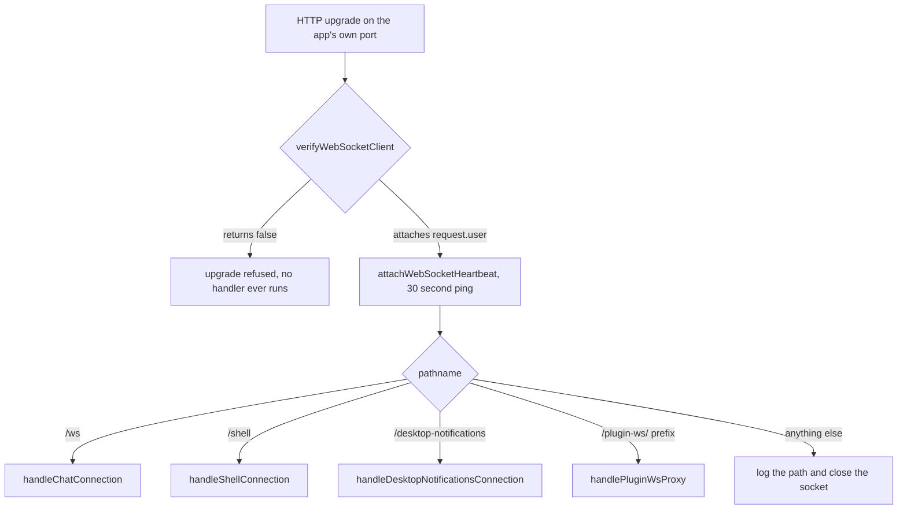
```mermaid
flowchart TD
  UP["HTTP upgrade on the app's own port"] --> V{"verifyWebSocketClient"}
  V -->|"returns false"| X1["upgrade refused, no handler ever runs"]
  V -->|"attaches request.user"| HB["attachWebSocketHeartbeat, 30 second ping"]
  HB --> R{"pathname"}
  R -->|"/ws"| CH["handleChatConnection"]
  R -->|"/shell"| SH["handleShellConnection"]
  R -->|"/desktop-notifications"| DN["handleDesktopNotificationsConnection"]
  R -->|"/plugin-ws/ prefix"| PP["handlePluginWsProxy"]
  R -->|"anything else"| X2["log the path and close the socket"]
```

`createWebSocketServer` (`websocket-server.service.ts:83`) builds the server over the
existing HTTP server (`:87`) and passes `verifyWebSocketClient` as `verifyClient`
(`:89-91`). The `connection` handler attaches the heartbeat *first* (`:95`), then routes:
`/shell` (`:101`), `/ws` (`:106`) and `/desktop-notifications` (`:111`) are exact matches,
`/plugin-ws/` is the one prefix match (`:116`), and anything else is logged and closed
(`:121-122`).

Two things that are easy to assume and wrong:

- **`/plugin-ws` has no in-repo client.** The route exists for plugin-authored frontend
  code. Nothing under `src/` opens it.
- **The `/desktop-notifications` client is the Electron *main* process**, not a renderer.
  It uses the Node `ws` package and authenticates with an `Authorization` header
  (`electron/desktopNotifications.js:202`, headers built at `:280-290`) — something a
  browser `WebSocket` cannot do, which is the whole reason the browser paths use a query
  parameter instead.

governs: /home/lyphe/.claude/claudecodeui_lyphe/electron/desktopNotifications.js

## MAN-297 — Authentication at the upgrade
section: 01-websocket-transport/005 Authentication at the upgrade

**RULE: `verifyClient` runs before the `connection` event, so an unauthenticated socket
never reaches a route handler. Failure is an upgrade rejection, not a close frame.**

`verifyWebSocketClient` (`websocket-auth.service.ts:18`) logs the attempt with the token
redacted (`:25-29`, added by `14ddbc7c`) and then splits:

| Mode | What it does |
| --- | --- |
| Platform (`isPlatform`) | Calls `authenticateWebSocket(null)`, which returns the first user in the database, and **ignores tokens entirely** (`:32-42`) |
| OSS | Takes the JWT from the `token` query parameter, falling back to `Authorization: Bearer` (`:45-48`), and verifies it plus the user row (`auth.middleware.ts:118-155`) |

On success the user is attached as `request.user` and the upgrade proceeds; on failure the
function returns `false` and the client sees a failed handshake.

The two modes return *different user shapes* — platform returns `{ id, userId, username }`,
OSS returns `{ userId, username }` with no `id` — which is why the chat handler reads the
id through `readRequestUserId` (`chat-websocket.service.ts:89-106`) instead of touching
`user.id` directly.

Only `/ws` and `/desktop-notifications` read `request.user` at all. `/shell` and
`/plugin-ws` just needed the connection to be authenticated.

## MAN-299 — The client's single socket
section: 01-websocket-transport/006 The client's single socket

**RULE: `WebSocketProvider` is mounted once by `App` and owns the only chat socket. Features
call `subscribe(listener)`; they never construct a `WebSocket`.**

`buildWebSocketUrl` (`WebSocketContext.tsx:36-45`) is the whole URL story: same host as the
page, `wss:` when the page is `https:`, `/ws` with no token in platform mode, `/ws?token=`
in OSS mode. An expired token is caught here — `expireAuthSession()` runs and the function
returns `null`, so no socket is created at all.

**The listener registry is a ref-held `Set`, dispatched synchronously** (`:56`, `:61-69`),
not React state. The declaration says why:

> events are dispatched synchronously to every listener, so rapid back-to-back frames
> cannot be coalesced or dropped. Frames are deliberately not copied into React state; each
> listener updates only the state owned by the feature that handles it.
> — `WebSocketContext.tsx:16-20`

Put frames in state instead and two frames arriving in the same tick collapse into one
render carrying only the later one. A listener that throws is caught individually
(`:63-67`) so it cannot take the others down with it.

There are seventeen `useWebSocket()` call sites. Seven of them are rowed below, and two of those
immediately hand `subscribe` to the hook that does the real work:

| Call site | Handler | Frames it acts on | State it owns |
| --- | --- | --- | --- |
| `ChatInterface.tsx:72` | `useChatRealtimeHandlers` | every provider `kind`, `chat_subscribed`, `history_truncated`, `protocol_error`, `websocket_reconnected` | session store, processing state, pending permissions, token budget |
| `ProjectWorkspaceRoute.tsx:32` | `useProjectsState` | `session_upserted`, `loading_progress`, `websocket_reconnected`, plus a sessionId-keyed "attention" marker for background sessions | project list, sidebar rows, session aliasing, selection |
| `TaskMasterContext.tsx:102` | itself | `taskmaster-project-updated`, `taskmaster-tasks-updated` (`type`-keyed) | task board data |
| `RunnerFeed.tsx` | itself | `runner_state`, `websocket_reconnected` | none of its own — it publishes the retained runner topics into the live bus |
| `ArcFeed.tsx` | itself | `arc_state`, `websocket_reconnected` | none of its own — it publishes the retained `arc:*` topic into the live bus ([plan-runner.md](../plan-runner.md) §"The arc deck") |
| `SoulLaunchFeed.tsx` | itself | `soul_launch_state`, `websocket_reconnected` | none of its own — it publishes the retained `souls:*` topic into the live bus ([dispatch-souls.md](../dispatch-souls.md)) |
| `UniverseFeed.tsx` | itself | `universe_activity`, `universe_map`, `websocket_reconnected` | none of its own — it publishes the retained `universe:*` digest into the live bus, and `useUniverseStream` reads the same frames for the tab's canvas (`src/modules/universe/`) |

The call sites the table does not row — `SessionProtectionContext.tsx`, `useSessionPresence.ts`,
`useRestartOnInstalledCli.ts`, `useGitDelegation.ts`, `useUniverseStream.ts`, `useSimpleChatList.ts`,
`useSimpleChatRemove.ts` and the kanban panel's three (`useKanbanMetis.ts`, `useKanbanLanes.ts`,
`KanbanCardDrawer.tsx`) — take `subscribe` or `sendMessage` straight into their own hooks rather than
owning a slice of the frame vocabulary; re-grep before quoting the number, because it grows with
every such arc.

Ownership is deliberately disjoint: the chat handler returns early on `session_upserted` and
`loading_progress` (`useChatRealtimeHandlers.ts:175-178`), and returns immediately on any
frame with no `kind` at all (`:96-98`), which is how the Task Master frames pass it by.

## MAN-300 — The chat protocol going up
section: 01-websocket-transport/007 The chat protocol going up

**RULE: seven `type` values, dispatched by one switch (`chat-websocket.service.ts:649-671`).
Anything else is answered with `protocol_error` / `UNKNOWN_MESSAGE_TYPE`; anything that
throws is answered with `INTERNAL_ERROR`.**

| `type` | Payload | What the server does |
| --- | --- | --- |
| `chat.send` | `sessionId`, `content`, `options` | Resolves the session row, registers the run, dispatches to the provider runtime (`:146-158`) |
| `chat.edit-send` | as above plus `anchorId` | Announces `history_truncated`, rewinds or resumes the provider transcript at the anchor, then dispatches (`:314-408`) |
| `chat.abort` | `sessionId` | Aborts the runtime and emits the terminal `complete` on its behalf (`:415-438`) |
| `chat.subscribe` | `sessions: [{ sessionId, lastSeq }]` | Acks with `chat_subscribed`, attaches this socket to a running run, replays what was missed (`:448-504`) |
| `chat.permission-response` | `requestId`, `allow`, `updatedInput?`, `message?`, `rememberEntry?` | Resolves one pending tool approval (`:511-522`) |
| `chat.presence` | `sessionId`, `visible` | Records which session this socket is showing, for the notification channels' watched-session check (`:538-544`) |
| `chat.ping` | — | Answers `pong`. The browser's liveness probe; `WebSocketContext.tsx` swallows the answer, so no feature ever sees it |

Five of the first six are built in exactly two client files: the composer builds sends, aborts and
permission answers (`useChatComposerState.ts:877`, `:1187`, `:1229`), and
`chat.subscribe` is built in `useChatSessionState.ts:811` and
`ChatInterface.tsx:330`. `chat.presence` has a third home of its own,
`src/modules/chat/hooks/useSessionPresence.ts`, called once from `ChatInterface.tsx`, which
passes the session only while the chat tab is the one showing (a hidden chat behind Files,
Shell or Git reports `null`): it announces at mount, on every session or connection change,
on `websocket_reconnected`, on `visibilitychange` and every 30 s while the tab is visible, and
announces `sessionId: null` on the way out — which is how an event about a session you are
already watching goes unpushed
([notifications.md](../notifications.md) §"What gets pushed, and how loud", *Not while you are
watching*).

governs: /home/lyphe/.claude/claudecodeui_lyphe/src/modules/chat/hooks/useSessionPresence.ts

## MAN-301 — The client is not trusted past the session id
section: 01-websocket-transport/007 The chat protocol going up/008 The client is not trusted past the session id

`resolveSendTarget` (`:170-200`) is the shared front half of `chat.send` and
`chat.edit-send`. It reads the row from `sessionsDb` and takes provider, project path and
provider-native id from there:

> the session row and provider come from the database, never from the client.
> — `chat-websocket.service.ts:167-168`

A send for a session with no row is refused with `SESSION_NOT_FOUND` and told to create it
over REST first (`:184-189`) — that is the entry point in
[conversation handoff](./03-conversation-handoff.md).

Attachments get the same treatment. `filterAttachmentsToUploadStore` (`:34-56`) resolves
every path against the global upload store (`~/.cloudcli/assets`, where
`POST /api/assets/images` writes) and keeps it only if it is a **direct child** of that
directory: relative paths are anchored there, absolute paths must already be inside it, and
traversal or subdirectories are dropped with a warning. Survivors are deduped by path and
re-split into `attachments` / `images` / `files` before the runtime sees them (`:253-276`).
The rejected shapes are covered by `tests/chat-attachment-filter.test.ts`.

## MAN-305 — Protocol errors have their own kind
section: 01-websocket-transport/007 The chat protocol going up/009 Protocol errors have their own kind

`sendProtocolError` (`:121-134`) emits `kind: 'protocol_error'` rather than a provider
`error`, and the reason is worth keeping:

> so the frontend can distinguish "your request was invalid" from "the model run produced
> an error" without inspecting text.
> — `chat-websocket.service.ts:117-119`

Every code that exists, with the line that emits it:

| Code | Line | Meaning |
| --- | --- | --- |
| `SESSION_ID_REQUIRED` | `:178`, `:422` | The frame carried no usable `sessionId` |
| `SESSION_NOT_FOUND` | `:186` | No row in `sessions` — create it over REST first |
| `UNSUPPORTED_PROVIDER` | `:195` | The session's provider has no registered runtime |
| `RUN_IN_PROGRESS` | `:232` | `startRun` refused: this session already has a running run |
| `ANCHOR_REQUIRED` | `:328` | `chat.edit-send` without an `anchorId` |
| `EDIT_NOT_SUPPORTED` | `:338` | The provider cannot re-run from a point |
| `ANCHOR_NOT_FOUND` | `:345` | The anchor is no longer in the transcript |
| `ANCHOR_LOOKUP_FAILED` | `:351` | Reading the transcript threw |
| `EDIT_REWIND_FAILED` | `:400` | The rewind itself failed; the run is ended too |
| `NO_ACTIVE_RUN` | `:428` | `chat.abort` for a session with nothing running |
| `UNKNOWN_MESSAGE_TYPE` | `:669` | Unrecognised `type` |
| `INTERNAL_ERROR` | `:675` | Anything thrown out of a handler |

On the client, `protocol_error` both surfaces an error row and clears the spinner
(`useChatRealtimeHandlers.ts:157-173`) — correct precisely because no `complete` will
follow a request that never became a run.

**Three inbound frames fail silently by design.** `chat.permission-response` returns without
an answer when `requestId` is missing or empty (`:516-518`), `chat.subscribe` with no
`sessions` array does nothing at all (`:456`), and `chat.presence` never answers at all — a
missing or non-string `sessionId` is recorded as "watching nothing" rather than refused
(`:538-544`). No ack, no error, in all three.

## MAN-306 — The chat protocol coming down
section: 01-websocket-transport/010 The chat protocol coming down

**RULE: every frame the chat gateway sends carries a `kind`, drawn from one of two unions
in `server/shared/types.ts`.**

**`MessageKind` (`:178-193`) — produced by provider runtimes:** `text`, `tool_use`,
`tool_result`, `thinking`, `stream_delta`, `stream_end`, `error`, `complete`, `status`,
`permission_request`, `permission_resolved`, `permission_cancelled`, `session_created`,
`history_truncated`, `task_notification`.

**`GatewayEventKind` (`server/shared/types.ts`) — produced by the gateway, no provider involved:**
`chat_subscribed`, `session_upserted`, `loading_progress`, `runner_state`, `soul_launch_state`,
`arc_state`, `kanban_metis_state`, `kanban_event`, `universe_activity`, `universe_map`, `protocol_error`.
`kanban_metis_state` is `server/modules/kanban-metis`'s own frame — a board's live Metis
sessions, pushed on change the same way `soul_launch_state` is (`kanban-metis.module.ts`'s
polled lane) — and it has no row in the consumption table below for the same reason
`kanban_event` does not: neither name is in `useChatRealtimeHandlers.ts`'s excused
`case` group at `:191-195`. Both still carry no `sessionId` of their own, but neither reaches
the transcript: the append path admits a row only when the frame carries a run's `seq`
(`useChatRealtimeHandlers.ts:253`), and a gateway-produced kind never does.

`ServerEventKind` is their union, and its doc comment claims every server-to-client
frame carries a `kind` from it. That is true of everything the *chat gateway* sends and not
quite true of the socket as a whole — see the Task Master exception below.

Two kinds in those unions never appear where you would look for them:

- **`session_created` never reaches a browser.** `ChatSessionWriter` intercepts it, records
  the provider-native id and returns before the frame is ever sequenced
  (`chat-session-writer.service.ts:98-109`).
- **`websocket_reconnected` is never sent by the server.** It is injected client-side when
  the socket re-opens (`WebSocketContext.tsx:89-92`) and is documented as synthetic in
  `src/shared/types.ts:197-203`.

| Kind | Origin | Consumed by |
| --- | --- | --- |
| `text`, `thinking`, `tool_use`, `tool_result`, `task_notification` | Provider runtime | `useChatRealtimeHandlers` → session store (`:224-233`) |
| `stream_delta`, `stream_end` | Provider runtime | `useChatRealtimeHandlers`, flushed on a 100 ms timer (`:189-221`) |
| `status` | Provider runtime | Activity indicator; `text === 'token_budget'` updates the context counter, and only for the viewed session (`:329-343`) |
| `error` | Provider runtime | A message row. **Not** terminal |
| `complete` | Runtime, or synthesised by the registry | Terminal: clears processing state and triggers a REST tail refresh (`:237-279`) |
| `permission_request`, `permission_resolved`, `permission_cancelled` | Provider runtime | The permission banner and its pending list (`:285-328`) |
| `history_truncated` | `chat-websocket.service.ts:388-393` | `sessionStore.truncateAt` (`:116-124`) |
| `chat_subscribed` | `chat-websocket.service.ts:485-492` | Authoritative processing state plus pending permissions (`:126-155`) |
| `protocol_error` | `chat-websocket.service.ts:127` | Error row, spinner cleared |
| `session_upserted` | `session-upsert-broadcast.service.ts:81-105` | `useProjectsState` — sidebar rows and alias folding |
| `loading_progress` | `projects-with-sessions-fetch.service.ts:164-175` | `useProjectsState` — project scan progress (`:720-736`) |
| `runner_state` | `plan-runner/runner-watcher.service.ts` | The plan runner's live runs, pushed on change. Not consumed by the chat handler, which returns early on it |
| `soul_launch_state` | `dispatch-souls/dispatch-souls.module.ts` | The launcher souls a session started by hand, pushed on change. `SoulLaunchFeed` publishes it into the live bus; the chat handler returns early on it too, in the same `case` group |
| `universe_map` | `universe/universe.module.ts` | The estate map was rebuilt because a tracked repo's `.git` HEAD moved; carries the `mapId` `GET /api/universe/map` now serves. Consumed by `useUniverseStream.ts:122` and `UniverseFeed.tsx:77`, which announce it through `setKnownMapId` and refetch on the strength of it; the announcement never redefines the gate, so the rows admitted below are still keyed to the map the client holds. Excused from the chat handler beside `runner_state`/`soul_launch_state` (`useChatRealtimeHandlers.ts:191-195`) |
| `universe_activity` | `universe/universe-activity.service.ts` | What the estate is doing now: the journald and transcript taps' rows, coalesced per node and sent at most ten times a second. Sent only when there is a row, so a quiet estate keeps silence on the wire. Consumed by `useUniverseStream.ts:126`, which keeps the canvas's ring of rows and the chrome's 1 Hz summary, and by `UniverseFeed.tsx:60-67`, which accumulates the same rows into the `universe:*` bus digest. Excused from the chat handler with `universe_map`, which it must be — at ten frames a second the fall-through would fill an open transcript with stray rows |

governs: /home/lyphe/.claude/claudecodeui_lyphe/server/shared/types.ts, /home/lyphe/.claude/claudecodeui_lyphe/src/shared/types.ts

## MAN-307 — The one exception
section: 01-websocket-transport/010 The chat protocol coming down/011 The one exception

Task Master broadcasts are `type`-keyed, not `kind`-keyed
(`taskmaster.routes.ts:39-50`): `taskmaster-project-updated` and `taskmaster-tasks-updated`,
consumed by `TaskMasterContext` (`:315`, `:328`). They ride the same `/ws` socket, and the
chat handler ignores them only because it bails on frames with no `kind`.

They are broadcast over `connectedClients` rather than the raw `wss.clients` set, and the
comment above them explains why that distinction is not cosmetic:

> Broadcasting over the raw `wss.clients` set instead delivered them to every `/shell`,
> `/plugin-ws` and `/desktop-notifications` socket as well, where they were parsed and
> dropped — and, on `/plugin-ws`, handed to third-party plugin frontends that have no
> business seeing them.
> — `taskmaster.routes.ts:32-37`

## MAN-308 — The happy path
section: 01-websocket-transport/012 The happy path

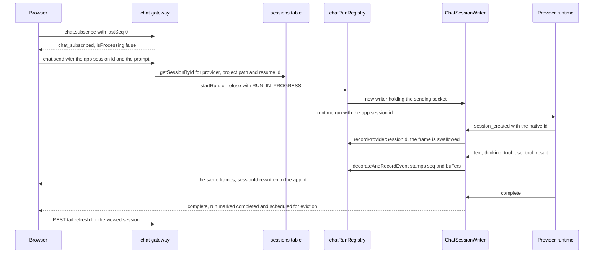
```mermaid
sequenceDiagram
  participant B as Browser
  participant GW as chat gateway
  participant DB as sessions table
  participant REG as chatRunRegistry
  participant W as ChatSessionWriter
  participant RT as Provider runtime

  B->>GW: chat.subscribe with lastSeq 0
  GW-->>B: chat_subscribed, isProcessing false
  B->>GW: chat.send with the app session id and the prompt
  GW->>DB: getSessionById for provider, project path and resume id
  GW->>REG: startRun, or refuse with RUN_IN_PROGRESS
  REG->>W: new writer holding the sending socket
  GW->>RT: runtime.run with the app session id
  RT->>W: session_created with the native id
  W->>REG: recordProviderSessionId, the frame is swallowed
  RT->>W: text, thinking, tool_use, tool_result
  W->>REG: decorateAndRecordEvent stamps seq and buffers
  W-->>B: the same frames, sessionId rewritten to the app id
  RT->>W: complete
  W-->>B: complete, run marked completed and scheduled for eviction
  B->>GW: REST tail refresh for the viewed session
```

Note what the browser never sees: the provider-native id, and any frame that skipped
`decorateAndRecordEvent`. The writer refuses to forward anything that is not a `kind`-keyed
object at all (`chat-session-writer.service.ts:86-93`).

## MAN-309 — The run registry
section: 01-websocket-transport/013 The run registry

**RULE: `chatRunRegistry` is the single in-memory answer to "is anything running for this
session", keyed by app session id, and at most one run per session can be running.**

`startRun` (`chat-run-registry.service.ts:167-210`) returns `null` when the session already
has a running run, which is exactly how `RUN_IN_PROGRESS` happens. A `ChatRun` holds the app
session id, the provider-native id once known, a status, a `lastSeq` counter, an event
buffer and its writer.

Every outbound event passes through `decorateAndRecordEvent` (`:84-116`), which does four
things in order:

1. Drops a second `complete` for an already-completed run (`:89-91`).
2. Assigns the next `seq` and rewrites `sessionId` to the **app** session id (`:93-99`).
3. On `complete`, sets `actualSessionId` to the app id too, flips the run to `completed` and
   schedules eviction (`:101-108`).
4. Pushes the event into the replay buffer, trimming the oldest past the cap (`:110-113`).

| Constant | Value | Why |
| --- | --- | --- |
| `COMPLETED_RUN_RETENTION_MS` (`:43`) | 5 minutes | A finished run stays addressable while a sleeping tab catches up. Eviction is a single `setTimeout`, `unref`'d so it never holds the process open (`:62-72`) |
| `MAX_BUFFERED_EVENTS_PER_RUN` (`:51`) | 5000 events | Past this the oldest events are dropped; a client whose `lastSeq` predates the buffer silently gets a short replay and relies on the REST history refresh instead |

`replayEvents` (`:265-272`) filters the buffer by `seq > afterSeq` and nothing else — it does
**not** check run status. The "completed runs are not replayed" rule lives in the caller, in
`handleChatSubscribe`.

## MAN-310 — Exactly one `complete`
section: 01-websocket-transport/013 The run registry/014 Exactly one `complete`

Three things cooperate:

- The abort path emits `complete` itself (`chat-websocket.service.ts:434-437`), because
  runtimes skip their own for a run they were killed out of.
- If the killed runtime emits one anyway, the registry drops it — first one wins.
- `completeRunIfCurrent` (`:296-302`) is the safety net in `dispatchRun`'s `finally`
  (`chat-websocket.service.ts:293-300`). It is scoped to one specific run object, so a
  runtime promise that settles *after* a queued message already started the session's next
  run cannot terminate that new run. The session-keyed `completeRun` (`:279-286`) would.
  This is pinned by *a finished run's safety net cannot complete the session's next run*
  in `tests/chat-run-registry.test.ts`.

Note that `error` is **not** terminal — providers emit it for mid-run stderr as well, which
is why the client treats it as a plain row (`useChatRealtimeHandlers.ts:281-283`).

## MAN-311 — The gateway writer
section: 01-websocket-transport/015 The gateway writer

**RULE: runtimes are handed a `ChatSessionWriter`, never a socket. It holds a *set* of
sockets, and everything written to it is translated before it goes anywhere.**

`ChatSessionWriter` (`chat-session-writer.service.ts:46`) deliberately mirrors
`WebSocketWriter`'s surface (`send`, `setSessionId`, `getSessionId`, `updateWebSocket`,
`userId`, `isWebSocketWriter`) so runtime adapters needed no changes. What differs:

- `send` swallows `session_created` and turns it into a provider-id mapping (`:98-109`);
  everything else is decorated, then forwarded (`:111-114`).
- `updateWebSocket` **adds** a socket instead of replacing the current one (`:139-141`).
  That is what `chatRunRegistry.attachConnection` (`:249-257`) calls. It used to replace,
  and the fix (`48c8f647`) is covered by *attachConnection adds a socket without cutting off
  the ones already watching*:

  > A session can legitimately be open in more than one place — a second browser tab, a
  > phone alongside a laptop, the desktop app beside the web app… Holding a single
  > connection here meant the newest subscriber took the stream away from everyone before
  > it, so a second tab silently froze mid-run.
  > — `chat-session-writer.service.ts:55-64`

- Dead sockets are collected **lazily, on send**: `forward` (`:160-174`) drops any
  connection whose `readyState` is not open as it iterates. Nothing sweeps on close, and
  nothing needs to.

A run started with `connection: null` — a scheduled message firing with no browser attached
(`chat-run-registry.service.ts:171-177`, `runDetachedChatTurn` at
`chat-websocket.service.ts:550-581`) — still records everything into the buffer, so whoever
subscribes later replays it from `seq` 1.

## MAN-312 — Drop, reconnect, replay
section: 01-websocket-transport/016 Drop, reconnect, replay

**RULE: catching up is always `chat.subscribe` with your highest `seq`. The ack comes first
and is authoritative; the replay comes after it, and only for a run that is still running.**

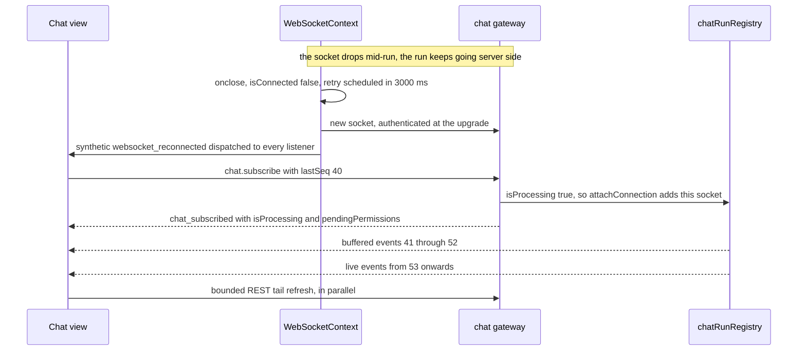
```mermaid
sequenceDiagram
  participant B as Chat view
  participant P as WebSocketContext
  participant GW as chat gateway
  participant REG as chatRunRegistry

  Note over P,GW: the socket drops mid-run, the run keeps going server side
  P->>P: onclose, isConnected false, retry scheduled in 3000 ms
  P->>GW: new socket, authenticated at the upgrade
  P->>B: synthetic websocket_reconnected dispatched to every listener
  B->>GW: chat.subscribe with lastSeq 40
  GW->>REG: isProcessing true, so attachConnection adds this socket
  GW-->>B: chat_subscribed with isProcessing and pendingPermissions
  REG-->>B: buffered events 41 through 52
  REG-->>B: live events from 53 onwards
  B->>GW: bounded REST tail refresh, in parallel
```

`handleChatSubscribe` (`:448-504`) walks each requested session and, in this order: reads
the run and `isProcessing`; attaches this socket if the run is live (`:477-479`); collects
pending approvals; sends the ack (`:485-492`); and only then replays (`:498-502`). The two
orderings that carry weight:

- **Ack before replay**, so the client has authoritative processing state before any event
  arrives.
- **Completed runs are never replayed**, even when the client's `lastSeq` is 0:

  > Completed runs are fully persisted to the provider transcript and served over REST —
  > replaying them (e.g. after a page reload where the client's lastSeq is 0) would
  > duplicate messages the history fetch already returned.
  > — `chat-websocket.service.ts:494-497`

The client's side of the contract is one line: every sequenced frame updates `lastSeqRef`
(`useChatRealtimeHandlers.ts:104-109`), and every `chat.subscribe` reads it back.

**Two `chat.subscribe` frames go out on a reconnect, and that is expected.** One comes from
the effect in `useChatSessionState.ts:664-675`, which depends on the `ws` identity — and
`ws` is a memoised snapshot that changes whenever `isConnected` flips. The other comes from
`ChatInterface.handleWebSocketReconnect` (`:263-274`), which awaits a bounded REST tail
refresh *before* subscribing. The interleaving is not pinned by any test; it is safe rather
than ordered, because both frames carry the current `lastSeq` and the second one therefore
asks for whatever the first did not already deliver.

## MAN-313 — What survives a drop
section: 01-websocket-transport/016 Drop, reconnect, replay/017 What survives a drop

| | Lost | Recovered |
| --- | --- | --- |
| The provider run | — | Keeps running server-side, with no audience if need be |
| Events during the gap | Not delivered live | Replayed from the buffer, if the run is still running and `lastSeq` is still inside the buffer |
| Events pushed out of the 5000-event buffer | Not replayed | The REST tail refresh after `complete` |
| A frame the client sent while closed | Dropped, with a console warning | Nothing re-sends it |
| Sidebar deltas during the gap | Not delivered | `useProjectsState` refreshes the project list on `websocket_reconnected` (`:709-718`) |

That table is about the *socket* dropping. A Claude run also survives the API **process** being
replaced, and recovers differently: it is rebuilt on boot as a fresh registry run, which makes
the reconnecting client's remembered cursor a previous run's — see
[02-realtime-stream.md](./02-realtime-stream.md) §"One run, end to end". `handleChatSubscribe`
catches that one case on the way in: a requested `lastSeq` above the run's own `lastSeq` is
treated as 0, so the new run replays from its start instead of replaying nothing.

## MAN-314 — Connection lifecycle in the browser
section: 01-websocket-transport/018 Connection lifecycle in the browser

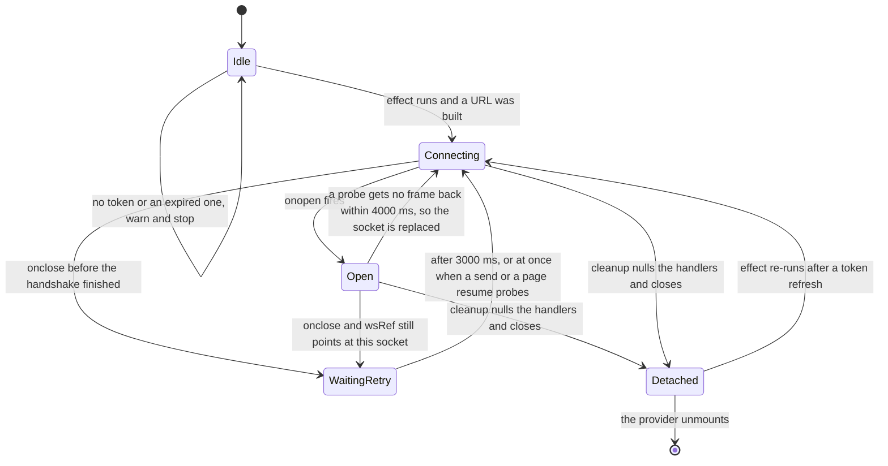
```mermaid
stateDiagram-v2
  [*] --> Idle
  Idle --> Connecting: effect runs and a URL was built
  Idle --> Idle: no token or an expired one, warn and stop
  Connecting --> Open: onopen fires
  Connecting --> WaitingRetry: onclose before the handshake finished
  Open --> WaitingRetry: onclose and wsRef still points at this socket
  WaitingRetry --> Connecting: after 3000 ms, or at once when a send or a page resume probes
  Open --> Connecting: a probe gets no frame back within 4000 ms, so the socket is replaced
  Open --> Detached: cleanup nulls the handlers and closes
  Connecting --> Detached: cleanup nulls the handlers and closes
  Detached --> Connecting: effect re-runs after a token refresh
  Detached --> [*]: the provider unmounts
```

The retry is a flat 3 second timer with no backoff, cut short by a probe. On
re-open, `websocket_reconnected` is dispatched only if this socket had connected at least
once before (`:89-93`), so a first connection does not look like a recovery.

Four guards do real work here, and each of them exists because of a specific failure:

| Guard | Line | Prevents |
| --- | --- | --- |
| `if (wsRef.current !== websocket) return` in `onclose` | `:106-108` | A deliberately-closed old socket scheduling a retry that fights the socket that replaced it |
| Handlers nulled before `close()` in cleanup | `:151-155` | The same race from the other side — an old-token socket firing `onclose` after the refreshed effect already started |
| `unmountedRef.current = false` at the top of the effect | `:136` | Every re-run (a token refresh, say) short-circuiting inside `connect` and leaving the socket permanently dead (`f082cdc6`) |
| Storing the socket in `wsRef` while still `CONNECTING` | `:83-85` | A token refresh being unable to close a socket whose handshake has not completed |

`sendMessage` sends at once only over a socket it trusts: `OPEN`, not suspect, nothing already
waiting, and a frame from the server within the last 25 s — 3 s for a user's frame, since a
socket can also die while the page is on screen and a send into it is lost for good. Anything else joins an outbox (in
order, 50 frames at most) and the socket is proven first — a `chat.ping`, and any frame back
inside 4 s flushes the outbox; silence replaces the socket, and the new socket's `onopen` flushes
it. The case this exists for is the half-open socket a phone leaves after sleeping or changing
networks: `readyState` still reads `OPEN`, the browser sees no `onclose` for minutes, and a send
used to vanish until the page was reloaded. The page going hidden or the network going offline
marks the socket suspect; the page coming back (`visibilitychange`, `pageshow`) or the network
returning (`online`) probes it straight away, so a dead socket is replaced — and its reconnect
catch-up runs — before the next send needs it. The outbox only delivers what never left; state is
still re-established with `chat.subscribe`, never by replaying sends.

Three rules keep a wait from turning into a second fault. **A user's frame gives up after 30 s**
(`chat.send`, `chat.edit-send`, `chat.abort`, `chat.permission-response`, each carrying its session —
the permission answer carries one only for this): it is removed and answered with a synthetic
`protocol_error` / `NOT_DELIVERED`, so the chat shows why and stops its spinner. While a send waits,
its spinner is held: the running-sessions poll would otherwise clear it after 10 s, since the server
cannot list a run it was never told about, and a second press would then become a second
`chat.send` the server refuses with `RUN_IN_PROGRESS` instead of taking the composer's queue path
(`hasQueuedSend`, read by `SessionProtectionContext.tsx`). **A queued `chat.subscribe` is never
flushed with a stale cursor**: a replacement socket drops it before `websocket_reconnected`, when
every subscriber asks again with its current cursor; a probe answered on the same socket drops it
too and dispatches `websocket_reconnected` itself. A replayed window would otherwise double streamed
text, which has no id to dedupe it by. An identical subscribe is never queued twice. The probe's 4 s
budget is spent on the send path as well, so a live link whose round trip nears it loses its socket
on a press. **Stop pressed over a send still in the outbox takes the send back**: both frames are
dropped and the chat is told the message never left, rather than delivering it and aborting the run
it starts. **A full outbox drops its oldest background frame** (presence,
subscribe) before any user frame, with a console warning. The probe also swallows an older server's
`UNKNOWN_MESSAGE_TYPE` refusal of `chat.ping`, which carries no session and would otherwise be pinned
on the conversation on screen.

## MAN-315 — Fan-out: who receives what
section: 01-websocket-transport/019 Fan-out: who receives what

**RULE: `connectedClients` is every open `/ws` socket in the process. A run's writer holds
only the sockets watching that run. Nothing else broadcasts.**

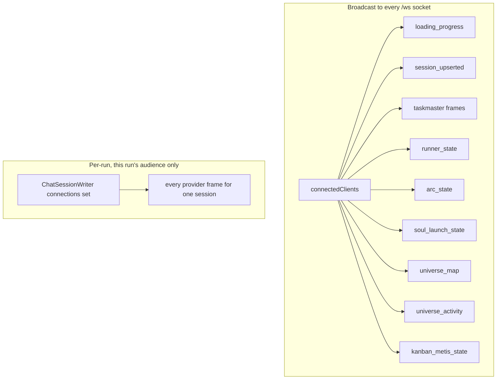
```mermaid
flowchart TD
  subgraph Broadcast["Broadcast to every /ws socket"]
    SET["connectedClients"]
    SET --> E1["loading_progress"]
    SET --> E2["session_upserted"]
    SET --> E3["taskmaster frames"]
    SET --> E4["runner_state"]
    SET --> E10["arc_state"]
    SET --> E6["soul_launch_state"]
    SET --> E7["universe_map"]
    SET --> E8["universe_activity"]
    SET --> E9["kanban_metis_state"]
  end
  subgraph PerRun["Per-run, this run's audience only"]
    W["ChatSessionWriter connections set"]
    W --> E5["every provider frame for one session"]
  end
```

There are eight broadcasters over that set: `loading_progress`, `session_upserted`, the Task Master
frames, and FIVE STATE LANES — the plan-runner watcher (`server/modules/plan-runner/`) over the
runner's state directory, the plan-runner's own arc deck lane
(`server/modules/plan-runner/arc-lane.ts`) over `~/.claude/state/arcs/`, the launcher-souls lane
(`server/modules/dispatch-souls/`) over `~/.claude/state/dispatch-souls/`, a board's own Metis
sessions (`server/modules/kanban-metis/`) over `~/.claude/state/kanban-metis/`, and the universe lane
(`server/modules/universe/`), which watches the registered repos' `.git` HEADs and reads two live
feeds of the estate, the systemd journal and the Claude transcripts. The first four poll every two
seconds and put a frame on the wire only when the picture actually changed — a live→stale flip
included, since that is a change in the snapshot like any other. The dedup records a picture as
sent only AFTER the send returns, so a broadcast that throws part-way is re-sent on the next tick
instead of being suppressed as unchanged — the frame carries the whole picture, so a client
receiving it twice receives it once. All of them reach `connectedClients` through the websocket
module's own barrel, never a deep import.

That loop is written once, in `server/shared/polled-lane.service.ts` (`createPolledLane`); each lane
supplies only its own `snapshot` and `frame`. The universe lane is the one broadcaster over
`connectedClients` that runs through NEITHER that shape NOR a single kind — it sends `universe_map`
and `universe_activity`, and the reason differs for each.

`universe_map` is the HEAD watcher. Reconciling a HEAD change means shelling a crawler child and
awaiting it, and `createPolledLane`'s contract is a `snapshot()` that is cheap and never throws — a
snapshot that can launch a subprocess would fire on a cadence nobody chose and let crawls stack. So
`universe.module.ts` writes its own thirty-second interval, reads every registered repo's `.git/HEAD`
directly off disk (never a `git rev-parse` subprocess), and broadcasts only when a rebuilt map
actually lands.

`universe_activity` is the estate's traffic, coalesced. Two taps produce it, and neither broadcasts:
the journal tap (`universe-journal.tap.ts`) follows one `journalctl -f -o json` child over every unit
the registry names and resolves each line to a star, and the transcript tap (`universe-transcript.tap.ts`
with the tail in `universe-transcript-tail.ts`) follows every Claude `*.jsonl` under `~/.claude/projects`
and resolves each admitted tool use to a star, live and with no replay. Both push into one window keyed
by node, kind and source (`universe-activity.service.ts`), and a hundred-millisecond interval drains it —
one frame per drain, and NOTHING at all when the window is empty. That window is why this frame is not a
`createPolledLane` either: what it carries is the rows that arrived since the last frame, a delta rather
than a picture of state that persists between ticks, so there is nothing cheap or meaningful to compare
against a previous snapshot — an empty window is silence, not an unchanged picture, and a lane that sent
it anyway would be ten frames a second saying nothing.

Reasoning that belongs to polling-rather-than-watching for the other four lanes lives at
`polled-lane.service.ts`, not in any lane. The launcher lane's own half — what it reads off a launch
directory, how it classifies a soul and which provider its pin paints — is
[dispatch-souls.md](../dispatch-souls.md). A board's own Metis lane has no write-up of its own yet.

A socket joins `connectedClients` when `handleChatConnection` runs
(`chat-websocket.service.ts:589`) and leaves on close (`:632`) — closing a tab removes a
listener and nothing more; the run keeps going. Broadcast consumers filter by session id
themselves, which is why the sidebar can react to sessions the user is not looking at.

governs: /home/lyphe/.claude/claudecodeui_lyphe/server/modules/plan-runner/arc-lane.ts, /home/lyphe/.claude/claudecodeui_lyphe/server/shared/polled-lane.service.ts

## MAN-316 — Heartbeat
section: 01-websocket-transport/020 Heartbeat

**RULE: the server pings every open socket every 30 seconds and terminates one that missed
the previous ping. It exists for infrastructure, not for the app.**

`attachWebSocketHeartbeat` (`websocket-server.service.ts:23-77`) is attached to every
connection on every path before routing. Each tick: if the socket is not open, do nothing;
if the previous ping was never answered with a `pong`, stop the timer and `terminate()`;
otherwise mark it not-alive and ping. So detection costs **two intervals** — up to about 60
seconds — not one. Both branches are covered in
`tests/websocket-heartbeat.service.test.ts:50` and `:64`.

`terminate()` emits `close`, which is what lets the client's own 3-second retry take over.
The commit that added this (`2edfef2e`) names the actual motivation: reverse proxies drop
websockets that look idle, and a chat socket waiting on a long model turn looks exactly
like that.

## MAN-317 — The `/shell` socket
section: 01-websocket-transport/021 The `/shell` socket

`handleShellConnection` (`shell-websocket.service.ts`) carries PTY sessions and has its
own, entirely separate, `type`-keyed protocol: `init`, `input` and `resize`. No `kind`, no
`seq`, no run registry.

The parts worth knowing:

- **PTYs outlive their socket too.** `ptySessionsMap` holds them, and a disconnect in the
  socket's `close` handler starts a 30 minute `PTY_SESSION_TIMEOUT` before the process is
  killed. A reconnect within that window reattaches.
- **A plain-shell command owns its own slot.** The key is
  `<projectPath>_<sessionId|default>` plus, for a plain-shell `initialCommand`,
  `_cmd_<first 16 hex chars of SHA-256(initialCommand)>`. The digest covers the whole string, so
  two commands never share a slot and a reattach lands only on a PTY running the same command.
- **Output is buffered per session, capped at 5000 chunks** (`session.buffer` in `onData`), and
  replayed to a returning client (the `existingSession` branch of `init`) so a reconnect shows
  recent terminal output instead of a blank screen.
- **A stale close cannot detach a live PTY** (the `session.ws !== ws` guard in `close`) — mobile
  networks deliver an old socket's `close` after its replacement has already attached. Covered
  by *a stale socket close cannot detach the socket that replaced it*.
- **Provider auth URLs are detected in the output stream** and forwarded as
  `type: 'auth_url'`, deduplicated per connection (`announcedAuthUrls`).

The client is `useShellConnection.ts:127` via `getShellWebSocketUrl`
(`src/modules/shell/utils/socket.ts:39-53`), which builds the URL the same way the chat one
does — no token in platform mode, `?token=` in OSS.

governs: /home/lyphe/.claude/claudecodeui_lyphe/src/modules/shell/utils/socket.ts

## MAN-318 — The plugin proxy and desktop notifications
section: 01-websocket-transport/022 The plugin proxy and desktop notifications

**`/plugin-ws/:pluginName`** (`plugin-websocket-proxy.service.ts`) is pure passthrough. The
name is validated against `/[^a-zA-Z0-9_-]/` and refused with close code 4400 (`:11-14`); an
unknown or stopped plugin is 4404 (`:17-20`); otherwise it opens
`ws://127.0.0.1:<port>/ws` against the plugin's own process (`:23`) and forwards frames both
ways preserving `isBinary` (`:29-39`). Closes are mirrored in both directions (`:41-51`) and
an upstream error closes the client with 4502 (`:53-58`). No `kind`, no `seq`, no
interpretation.

**`/desktop-notifications`** (`desktop-notifications-websocket.service.ts:42`) is how the
Electron main process registers a device. A connection with no authenticated user is closed
with 1008 (`:47-50`); the client then sends one `register` frame carrying `deviceId`
(`:65-99`), gets `registered` back, and `notification_ack` frames are accepted and ignored
(`:61-63`). The socket-to-device registry itself lives in
`server/modules/notifications/services/desktop-notification-clients.service.ts`. What the server
sends down that socket — the notification payload, and the web push and ntfy channels beside it —
is in [notifications.md](../notifications.md).

governs: /home/lyphe/.claude/claudecodeui_lyphe/server/modules/notifications/services/desktop-notification-clients.service.ts

## MAN-319 — Gotchas and why the code looks like this
section: 01-websocket-transport/023 Gotchas and why the code looks like this

| The odd thing | Why |
| --- | --- |
| `kind` down, `type` up — and Task Master both ways | Task Master's broadcasts predate the unified envelope and were never migrated. A handler keying off the wrong field silently sees nothing at all |
| `error` does not end a run | Providers emit it for mid-run stderr. Treating it as terminal clears the spinner while frames keep arriving |
| `session_created` is in `MessageKind` but no client can receive it | Runtimes still emit it; the writer turns it into the provider-id mapping and returns. If you are looking for the frontend handler, there isn't one |
| `attachConnection` adds instead of replacing | It used to replace, so opening a session in a second tab froze the first one mid-answer (`48c8f647`) |
| Dead sockets are swept in `forward`, not on close | A refreshed tab abandons its old socket; sweeping on the next send is enough and costs nothing extra |
| `completeRunIfCurrent` next to `completeRun` | A queued message can start the session's next run before the previous runtime promise settles; the session-keyed helper would then kill the *new* run |
| Completed runs do not replay | The transcript comes from REST after a reload. "Messages missing after reload" is therefore a history-fetch bug, not a replay bug |
| `replayEvents` ignores run status | The completed-run rule is enforced by `handleChatSubscribe`, not by the registry. Calling `replayEvents` from somewhere new re-opens the duplicate-message bug |
| Two `chat.subscribe` frames per reconnect | One from the `ws`-identity effect, one from the reconnect handler after its REST refresh. Both carry the current `lastSeq`, so the second asks only for what the first missed — which holds only because the outbox drops subscribes queued before the new socket opened |
| An outbox, no backoff | A frame sent over a closed or unproven socket waits and goes out once the socket answers or is replaced — a user's frame for 30 s at most, with its spinner held; a dead server is retried flat every 3 seconds forever, and the outbox holds 50 frames, shedding background ones first |
| An expired token produces no socket *and no retry* | `buildWebSocketUrl` returns `null` before a `WebSocket` exists, so there is no `onclose` to schedule anything. Recovery waits on the auth state changing |
| Heartbeat detection takes two intervals | The tick that finds `isAlive === false` is the one *after* the unanswered ping — so up to ~60 s, not 30 |
| Platform mode ignores tokens entirely | `verifyWebSocketClient:32`. This working copy's `.env` sets no `VITE_IS_PLATFORM`, so `/ws` here demands a JWT at the upgrade (401 without one), as CI does |
| `ws` in the context value is a snapshot | `value` memoises `ws: wsRef.current` at render time, so it can be stale between renders. Use `sendMessage` and `subscribe`; treat `ws` as a connectedness signal only |
| `/plugin-ws` has no in-repo caller | It is a third-party extension point, which is exactly why broadcasting over `wss.clients` was a real leak and not a tidiness complaint |

## MAN-320 — Where to look when something breaks
section: 01-websocket-transport/024 Where to look when something breaks

| Symptom | Start here |
| --- | --- |
| The socket never opens | `buildWebSocketUrl` (`WebSocketContext.tsx:36`) — platform mode? expired token? |
| Connects, then immediately closes | `verifyWebSocketClient:18` and the attempt log at `:29` |
| Reconnect loop, or two sockets fighting | The `onclose` identity check (`WebSocketContext.tsx:106`) |
| Socket dies permanently right after login | The `unmountedRef` reset (`:136`) |
| Frames stop after a mid-run page refresh | `handleChatSubscribe:448` and `attachConnection:249` |
| A second tab freezes mid-run | `ChatSessionWriter`'s connections set (`chat-session-writer.service.ts:65`) |
| Duplicate messages after a reload | The completed-run replay guard (`chat-websocket.service.ts:494`) |
| The spinner never clears | The terminal `complete` — `completeRun:279`, `completeRunIfCurrent:296` |
| A run is terminated early, or two runs appear | `completeRunIfCurrent:296` and the queued-message race |
| "Session not found" on send | The session was never created over REST — [conversation handoff](./03-conversation-handoff.md) |
| A plugin frontend receiving chat frames | Something is broadcasting over `wss.clients` instead of `connectedClients` |

## MAN-321 — If you change this, check that
section: 01-websocket-transport/025 If you change this, check that

| If you touch | Also check |
| --- | --- |
| The pathname routing block | Every path still gets the heartbeat first, and the unknown-path branch still closes rather than leaking a live socket |
| `verifyWebSocketClient` | Both user shapes still work — `readRequestUserId` in the chat handler and `readRequestUserId` in the notifications handler read different fields |
| `decorateAndRecordEvent` | The exactly-one-`complete` contract, `seq` monotonicity, and the buffer trim — `tests/chat-run-registry.test.ts` covers all three |
| `ChatSessionWriter.send` or `forward` | That no frame can escape without `sessionId` remapped and a `seq`, and that a closed socket is still dropped rather than throwing |
| `attachConnection` | It must keep *adding*; the second-tab test is the regression guard |
| `handleChatSubscribe` | Ack-before-replay ordering, the completed-run rule, and the client's `lastSeqRef` semantics in `useChatRealtimeHandlers.ts:104-109` |
| The `protocol_error` codes | The client's `protocol_error` branch clears the spinner on the assumption that no `complete` follows — that must stay true of every new code |
| `filterAttachmentsToUploadStore` | `tests/chat-attachment-filter.test.ts`, and that the re-split into `images` / `files` still happens *after* filtering |
| Anything broadcasting to clients | Use `connectedClients`, never `wss.clients`, or the frames reach `/shell`, `/plugin-ws` and `/desktop-notifications` too |
| The reconnect timing or the `ws` memo | Both `chat.subscribe` senders — `useChatSessionState.ts:664` and `ChatInterface.tsx:263` — and whether either now fires with a stale `lastSeq` |
| `attachWebSocketHeartbeat` | `tests/websocket-heartbeat.service.test.ts`, and that the interval is still shorter than the shortest proxy idle timeout in front of the app |

Related: [the realtime stream](./02-realtime-stream.md) for what the frames become,
[conversation handoff](./03-conversation-handoff.md) for the ids they carry,
[the index](./README.md) for the rest of the set.

## MAN-322 — The realtime stream
section: 02-realtime-stream/000

*One frame's journey from a provider CLI to a rendered row, and the buffer that keeps a
fast reply from re-rendering the transcript on every token. The socket itself is
[the websocket layer](./01-websocket-transport.md); which session id a frame carries is
[conversation handoff](./03-conversation-handoff.md); how a tool frame becomes a card is
[tool views](./06-tool-view.md).*

## MAN-323 — In one paragraph
section: 02-realtime-stream/001 In one paragraph

Four provider CLIs speak four dialects. Each provider's runtime translates its output
into one shape — `NormalizedMessage`, discriminated by a `kind` field — and hands it to a
gateway writer that rewrites the session id, stamps a per-run `seq`, buffers it for
replay, and fans it out to every socket watching that run. On the client there is exactly
one listener for all of it: `useChatRealtimeHandlers` switches on `kind` and, for almost
every kind, appends the frame to the viewed session's slot in `useSessionStore`. The one
exception is `stream_delta`. Deltas do not reach the store directly; they pile up in a
ref and a 100 ms timer publishes the whole accumulated string into a single synthetic row
with a well-known id, so a reply that streams for thirty seconds is one row whose content
grows rather than a thousand rows. Everything a newcomer finds confusing here comes from
that one exception and from the fact that **only two of the four providers ever send a
`stream_delta` at all.**

## MAN-324 — Mental model
section: 02-realtime-stream/002 Mental model

Eight rules. If you can apply these, you can predict what the code does without reading
it.

1. **Every server-to-client frame carries a `kind`, and one function reads it.**
   `src/modules/chat/hooks/useChatRealtimeHandlers.ts` is the only place in chat that
   touches a raw frame. It does not branch on provider, does not navigate, and does not
   translate session ids — the backend has already done all three. A frame with no `kind`
   is dropped on the first line, which is what makes Task Master's `type`-keyed
   broadcasts invisible to chat. The box-wide lanes are the other case: `runner_state`,
   `soul_launch_state`, `universe_map` and `universe_activity` HAVE a kind and carry no session
   id of their own, so they are returned early by name — one shared `case` group — the same way
   `session_upserted` and `loading_progress` are. Each is a picture of the whole box owned by a
   reader outside the transcript, republished into the live bus by its own feed. Each RETURNs
   rather than breaking, to say so and to stay off the provider path below — no stream buffering,
   no store append, no UI side effect
   ([01-websocket-transport.md](./01-websocket-transport.md) §"Fan-out: who receives what").
   **That `case` group names the lanes; it is not what stops them.** What stops them is the
   stamp: a row joins the transcript only if a numeric `seq` says the RUN wrote it, and no
   sessionless lane frame carries one (`writtenByRun` at `:253`). A lane that is not in the
   group — `arc_state`, `kanban_event`, `kanban_metis_state` — is stopped by the stamp all the
   same, which is the point: the group lagged the lanes it was meant to fence, and the frame
   that slipped past it landed in the viewed transcript with no `id`, where the store's
   `removeOptimisticUserEchoes` read `id.startsWith` off `undefined` and threw inside the
   websocket listener — losing that frame and every frame after it, and freezing the open chat
   until the page was reloaded (`sessionMessageReconciliation.ts:111` is the guard that makes
   the merge total).
2. **The default action is "append to the store" — for a frame the run stamped.** Read the
   switch as a filter, not a dispatcher: gateway kinds and the two streaming kinds are handled
   specially, five kinds are control events that are deliberately *not* stored, and everything
   else with a numeric `seq` — `text`, `tool_use`, `tool_result`, `thinking`, `error`,
   `task_notification` — just becomes a row. A frame with no `seq` belongs to no run and stops
   here.
3. **A streaming reply is one row, not many.** `updateStreaming` writes a row with the id
   `__streaming_<sessionId>` and replaces it in place on every flush. The transcript's
   row count stays flat while the text grows. `finalizeStreaming` rewrites that same array
   slot — new id, `kind: 'text'`, `role: 'assistant'` — so React reconciles instead of
   remounting.
4. **Whether you see deltas at all depends on the provider.** Cursor and OpenCode stream;
   Claude and Codex do not. Claude's live prose arrives as complete `text` rows, one per
   assistant message. Code that assumes "assistant reply implies `stream_delta`" is wrong
   for half the providers, and the half it is wrong for is the default one.
5. **`complete` is the only terminal event. `error` is just a row.** Providers emit
   `error` for mid-run stderr and keep running. Clearing the busy state on `error` leaves
   a live run writing into a UI that believes it is idle.
6. **Busy state is not derived from messages.** It lives in a separate per-session map in
   `src/shared/hooks/useSessionProtection.ts`. The spinner, the abort button and the
   status text all read that map; the transcript reads the store. The two are only
   coupled by the handler writing to both.
7. **Live rows and persisted rows never mix in storage, only in projection.** The store
   keeps `realtimeMessages` and `serverMessages` in separate arrays and computes `merged`
   from them. `complete` triggers a REST refresh of the persisted tail; the live copy of
   the reply survives until the persisted copy demonstrably supersedes it. Details in
   [the message store](./04-message-store-and-lazy-loading.md).
8. **The delta buffer belongs to the chat pane, not to a session.** There is one
   `accumulatedStreamRef` and one `streamTimerRef` for the whole `ChatInterface`. Two
   sessions streaming at once share them. This is a real limitation, not a subtlety —
   see [Cross-session behaviour](#cross-session-behaviour).

governs: /home/lyphe/.claude/claudecodeui_lyphe/src/modules/chat/hooks/useChatRealtimeHandlers.ts, /home/lyphe/.claude/claudecodeui_lyphe/src/shared/hooks/useSessionProtection.ts

## MAN-325 — The pieces
section: 02-realtime-stream/003 The pieces

| File | Role |
| --- | --- |
| `src/shared/context/WebSocketContext.tsx` | The one socket. Parses each frame and calls every registered listener synchronously. Synthesises the client-only `websocket_reconnected` frame on a re-open, and retries a dropped socket after 3 s. |
| `src/modules/chat/hooks/useChatRealtimeHandlers.ts` | The whole client-side protocol. One switch on `kind`; the streaming buffer; the `seq` bookkeeping. |
| `src/modules/chat/ChatInterface.tsx` | Owns the four refs the handler mutates — `accumulatedStreamRef`, `streamTimerRef`, `lastSeqRef`, `statusCheckSentAtRef` — and clears the first two on unmount. |
| `src/modules/chat/hooks/useSessionStore.ts` | Per-session slots. `appendRealtime`, `updateStreaming`, `finalizeStreaming`, `truncateAt`, and the merge of live and persisted rows. |
| `src/modules/chat/hooks/useChatMessages.ts` | `normalizedToChatMessages` — the projection from store records to UI objects. Pairs `tool_use` with `tool_result`, folds subagent rows into their container, and memoises through a `WeakMap`. |
| `src/modules/chat/hooks/useChatSessionState.ts` | Sends `chat.subscribe` on session open and on reconnect, owns `requestLatestMessages` and `resetStreamingState`, and memoises `chatMessages`. |
| `src/modules/chat/hooks/useChatComposerState.ts` | The outbound side: `chat.send`, `chat.edit-send`, `chat.abort`, `chat.permission-response`, plus the optimistic user echo. |
| `src/modules/chat/hooks/useSessionPresence.ts` | Sends `chat.presence`: which session this tab is showing, restated on reconnect, on `visibilitychange` and every 30 s, and cleared on the way out — so the notification channels skip a session you are watching. |
| `src/shared/hooks/useSessionProtection.ts` | The per-session activity map that the indicator and the abort button derive from. |
| `src/modules/chat/transcript/StreamingMarkdown.tsx` | Renders an assistant reply, streaming or finished, as a settled half plus a pending half. |
| `src/modules/chat/utils/streamingMarkdown.ts` | `splitStreamingMarkdown` — where it is safe to cut a partially-written markdown document in two. |
| `src/shared/types.ts` | `ServerEvent` at `:204`, the client's view of a frame. Every field the handler reads is optional here. |
| `server/modules/websocket/services/chat-websocket.service.ts` | Handles `chat.send`, `chat.edit-send`, `chat.abort`, `chat.subscribe`, `chat.permission-response`, `chat.presence`. Registers the run, then hands the turn to the provider runtime. |
| `server/modules/websocket/services/chat-run-registry.service.ts` | One entry per app session. `decorateAndRecordEvent` at `:94` is the choke point: session-id rewrite, `seq` assignment, replay buffering, terminal-`complete` de-duplication, and the `lastEventAt` stamp that makes a run's silence measurable from outside (`:107`). |
| `server/modules/websocket/services/chat-session-writer.service.ts` | The object provider runtimes think is their socket. Swallows `session_created`; `forward` at `:160` fans out to every watching connection and collects dead ones. |
| `server/shared/utils.ts` | `createNormalizedMessage` at `:348` and `createCompleteMessage` — the envelope every provider event is built with. **Not** `message-unification.ts`; that file exports only `prepareTranscriptMessages`, which runs on REST history reads and never on the live path. |
| `server/shared/types.ts` | `MessageKind` at `:178` — the fifteen kinds a provider can emit. `GatewayEventKind` at `:204` — the four the gateway adds. |
| `server/modules/providers/list/*/` | Per provider, a `*-runtime.provider.js` that drives the CLI or SDK and a `*-sessions.provider.ts` whose `normalizeMessage` converts one raw event into `NormalizedMessage[]`. |

Tests worth knowing about: `streamingMarkdown.test.ts` and
`streamingMarkdownRenderEquivalence.test.tsx` pin the split; `messageStreamEnd.test.tsx`
pins the DOM-identity rule; `tokenBudgetSessionScope.test.tsx` pins the token-counter
scoping; `liveSubagentGrouping.test.ts` pins the subagent fold;
`sessionStoreTruncate.test.tsx` pins `truncateAt`. All in `src/modules/chat/tests/`.

governs: /home/lyphe/.claude/claudecodeui_lyphe/server/modules/websocket/services/chat-run-registry.service.ts, /home/lyphe/.claude/claudecodeui_lyphe/server/modules/websocket/services/chat-session-writer.service.ts, /home/lyphe/.claude/claudecodeui_lyphe/server/modules/websocket/services/chat-websocket.service.ts, /home/lyphe/.claude/claudecodeui_lyphe/server/shared/types.ts, /home/lyphe/.claude/claudecodeui_lyphe/server/shared/utils.ts, /home/lyphe/.claude/claudecodeui_lyphe/src/modules/chat/ChatInterface.tsx, /home/lyphe/.claude/claudecodeui_lyphe/src/modules/chat/hooks/useChatComposerState.ts, /home/lyphe/.claude/claudecodeui_lyphe/src/modules/chat/hooks/useChatMessages.ts, /home/lyphe/.claude/claudecodeui_lyphe/src/modules/chat/hooks/useChatRealtimeHandlers.ts, /home/lyphe/.claude/claudecodeui_lyphe/src/modules/chat/hooks/useChatSessionState.ts, /home/lyphe/.claude/claudecodeui_lyphe/src/modules/chat/hooks/useSessionPresence.ts, /home/lyphe/.claude/claudecodeui_lyphe/src/modules/chat/hooks/useSessionStore.ts, /home/lyphe/.claude/claudecodeui_lyphe/src/modules/chat/transcript/StreamingMarkdown.tsx, /home/lyphe/.claude/claudecodeui_lyphe/src/modules/chat/utils/streamingMarkdown.ts, /home/lyphe/.claude/claudecodeui_lyphe/src/shared/context/WebSocketContext.tsx, /home/lyphe/.claude/claudecodeui_lyphe/src/shared/hooks/useSessionProtection.ts, /home/lyphe/.claude/claudecodeui_lyphe/src/shared/types.ts

## MAN-326 — One run, end to end
section: 02-realtime-stream/004 One run, end to end

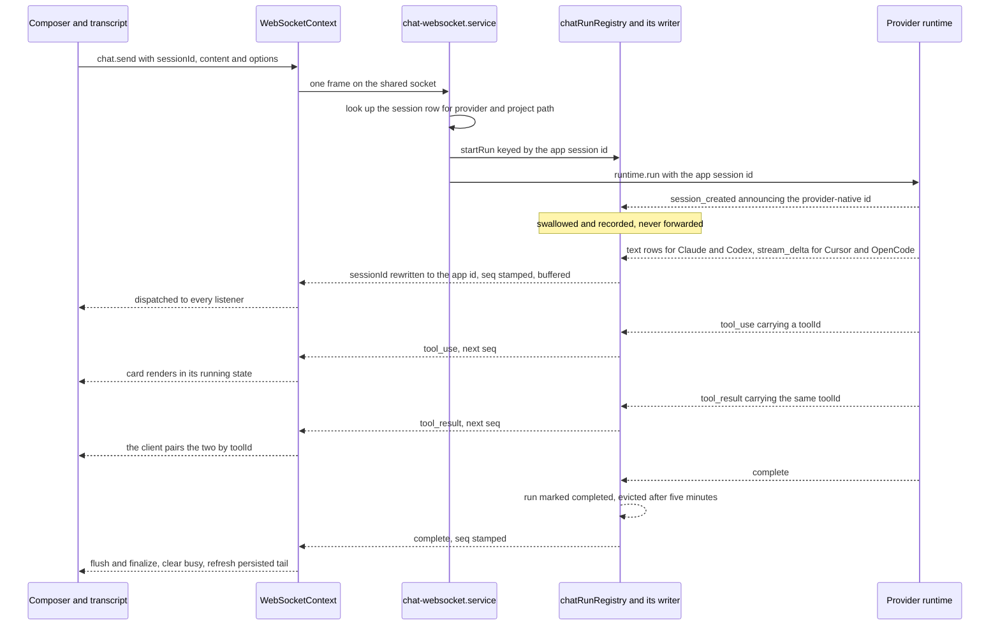
```mermaid
sequenceDiagram
    participant UI as Composer and transcript
    participant WSC as WebSocketContext
    participant GW as chat-websocket.service
    participant REG as chatRunRegistry and its writer
    participant CLI as Provider runtime

    UI->>WSC: chat.send with sessionId, content and options
    WSC->>GW: one frame on the shared socket
    GW->>GW: look up the session row for provider and project path
    GW->>REG: startRun keyed by the app session id
    GW->>CLI: runtime.run with the app session id
    CLI-->>REG: session_created announcing the provider-native id
    Note over REG: swallowed and recorded, never forwarded
    CLI-->>REG: text rows for Claude and Codex, stream_delta for Cursor and OpenCode
    REG-->>WSC: sessionId rewritten to the app id, seq stamped, buffered
    WSC-->>UI: dispatched to every listener
    CLI-->>REG: tool_use carrying a toolId
    REG-->>WSC: tool_use, next seq
    WSC-->>UI: card renders in its running state
    CLI-->>REG: tool_result carrying the same toolId
    REG-->>WSC: tool_result, next seq
    WSC-->>UI: the client pairs the two by toolId
    CLI-->>REG: complete
    REG-->>REG: run marked completed, evicted after five minutes
    REG-->>WSC: complete, seq stamped
    WSC-->>UI: flush and finalize, clear busy, refresh persisted tail
```

Four things in that picture are easy to get backwards:

- **The client never sees the provider's session id.** `session_created` is consumed by
  the writer, turned into a database mapping, and dropped. Every other frame has its
  `sessionId` overwritten with the app id.
- **`tool_use` and `tool_result` are paired on the client, not the server.** Claude's
  runtime emits them as separate frames, often far apart. OpenCode is the exception: it
  can attach a result inline on the `tool_use` frame, so the projection checks
  `msg.toolResult` first and only then consults its map of `toolId` to result row.
- **The run outlives the socket.** It is keyed by app session id in the registry, keeps
  its last 5000 events for replay, and stays available for five minutes after finishing.
  A reconnecting client sends `lastSeq` and gets only what it missed — and only if the
  run is still running, because a completed run is already on disk and served over REST.
- **A Claude run is a turn, not a process.** `runtime.run` for the Claude provider pushes the
  message into the CLI already running for that conversation and settles when THAT turn's
  `result` lands, matched by the uuid stamped on the user message; the process stays up for
  the next message and closes only after two hours without one, never while a background
  task or watcher is running in it (`chat-process.ts`). A model, effort or permission-mode
  change is applied to the running query, and so is a GROWN allowed-tool list; a changed
  working directory, MCP configuration, an edited message (`resumeAnchorId`), a conversation
  restarted from scratch, any change to the disallowed list or a tool REMOVED from the allowed
  list (both are launch arguments the CLI resolves before ever asking the callback), and the
  installed CLI version itself (a process runs the build it was started with) retire the
  process — interrupt first, then end-of-input — and spawns a fresh one. The launch profile
  travels in the host meta, so a re-adopted process is diffed against what it was really
  launched with; the version [comes from the host's own journal](../cli-version.md), because
  only that process can say what it is on. A turn already in flight is never retired for a
  version: it keeps the build it started on, and the banner above its transcript says so.
- **A Claude run can outlive the API process too, and then `seq` restarts at 1.** The CLI
  lives in a tmux server rather than in the API's cgroup, and the API re-adopts it on boot
  with a *fresh* registry run — so a client that reconnects across a restart holds a cursor
  from the previous run, numbered above anything the new one has issued. `chat.subscribe`
  detects exactly that (`lastSeq > run.lastSeq`) and replays the run from the start rather
  than replaying nothing. The check is one-sided on purpose: a cursor *below* the run's seq
  is left to the REST history refetch, which is what a reconnecting client does anyway. The
  mechanism behind the survival is
  [`server/modules/providers/README.md`](../../server/modules/providers/README.md)
  §"The exception: `list/claude/session-host/`".

## MAN-327 — What each provider actually emits
section: 02-realtime-stream/005 What each provider actually emits

The unified `kind` vocabulary is a superset. No provider emits all of it, and the
differences are the single biggest source of "but it works on Claude" confusion. This
table is about **what arrives over the socket during a run** — a provider marked "history
only" produces that kind when its transcript is read back over REST, which is why a
reload can make the transcript look completely different from what streamed.

| Kind | Claude | Codex | Cursor | OpenCode |
| --- | --- | --- | --- | --- |
| `text` | yes, whole assistant messages | yes | history only | history only |
| `stream_delta` | **no** | **no** | yes, one per assistant chunk | yes, from `text` parts |
| `stream_end` | **no** | **no** | **never** | yes, from `step_finish` |
| `thinking` | yes | yes | history only | yes, from `reasoning` parts |
| `tool_use` | yes | yes | history only | yes |
| `tool_result` | yes, a separate frame | yes, a separate frame | history only | **never** — attached to the `tool_use` frame instead |
| `error` | yes | yes | yes, from stderr and spawn failures | yes |
| `status` with `text: 'token_budget'` | yes | yes | no | yes, once at process exit |
| `permission_request` / `permission_resolved` / `permission_cancelled` | yes, the only provider | no | no | no |
| `complete` | yes, exactly one | yes | yes | yes |

Two entries deserve the emphasis:

**Claude does not stream deltas today.** `claude-sessions.provider.ts:684` does contain a
branch that turns `content_block_delta` into a `stream_delta`, which is why the opposite
is widely believed. That branch is unreachable: `mapCliOptionsToSDK` in
`claude-runtime.provider.js` builds its options object from scratch and never sets
`includePartialMessages`, which the SDK defaults to false — and even with it enabled the
SDK wraps partial events as `{ type: 'stream_event', event: … }`, a shape the branch does
not match. What arrives live is one complete `text` row per assistant message, so a long
Claude reply appears in whole paragraphs, not character by character.

**Cursor emits `stream_delta` and never `stream_end`.** There is no `stream_end` anywhere
under `list/cursor/`. On Cursor the streaming placeholder is only ever finalised by the
defensive flush inside the `complete` branch. That is not a bug, but it means any change
that makes finalisation depend on `stream_end` breaks Cursor silently.

`task_notification` is in the kind union but has no live producer. It reaches the
transcript two other ways: `codex-sessions.provider.ts` builds it when reading history,
and the client synthesises it locally in `useChatSessionState.ts` when converting a UI
message back into a store record.

## MAN-328 — The client reducer
section: 02-realtime-stream/006 The client reducer

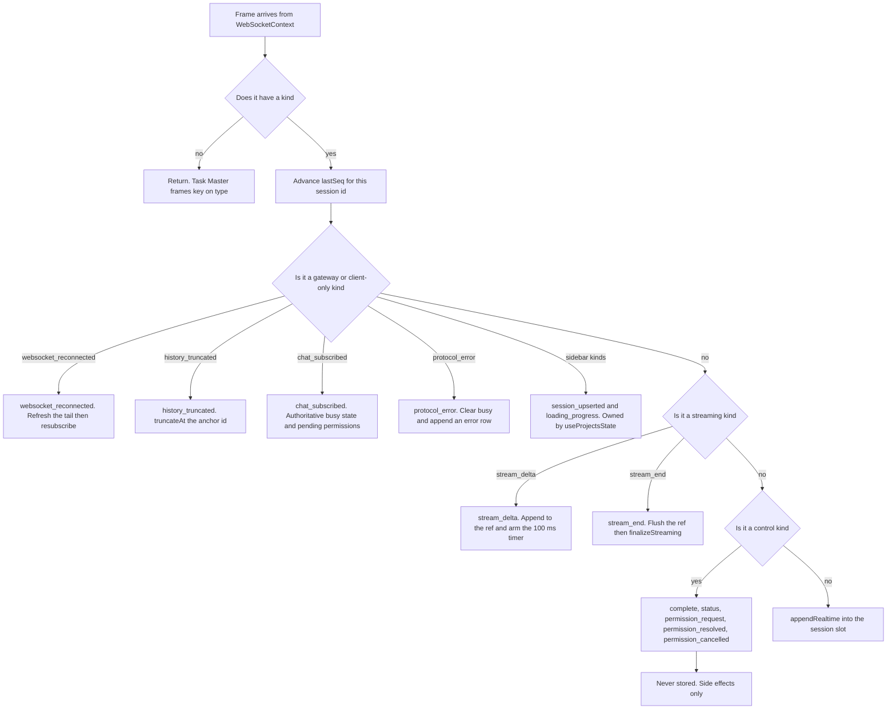
```mermaid
flowchart TD
    F["Frame arrives from WebSocketContext"]
    K{"Does it have a kind"}
    DROP["Return. Task Master frames key on type"]
    SEQ["Advance lastSeq for this session id"]
    G{"Is it a gateway or client-only kind"}
    RC["websocket_reconnected. Refresh the tail then resubscribe"]
    HT["history_truncated. truncateAt the anchor id"]
    CS["chat_subscribed. Authoritative busy state and pending permissions"]
    PE["protocol_error. Clear busy and append an error row"]
    IG["session_upserted and loading_progress. Owned by useProjectsState"]
    S{"Is it a streaming kind"}
    SD["stream_delta. Append to the ref and arm the 100 ms timer"]
    SE["stream_end. Flush the ref then finalizeStreaming"]
    P{"Is it a control kind"}
    CTRL["complete, status, permission_request, permission_resolved, permission_cancelled"]
    ST["Never stored. Side effects only"]
    APP["appendRealtime into the session slot"]

    F --> K
    K -- no --> DROP
    K -- yes --> SEQ
    SEQ --> G
    G -- websocket_reconnected --> RC
    G -- history_truncated --> HT
    G -- chat_subscribed --> CS
    G -- protocol_error --> PE
    G -- sidebar kinds --> IG
    G -- no --> S
    S -- stream_delta --> SD
    S -- stream_end --> SE
    S -- no --> P
    P -- yes --> CTRL
    P -- no --> APP
    CTRL --> ST
```

The `shouldPersist` test is literally five inequalities, and the list is worth memorising
because looking for these kinds in the transcript array is futile: **`complete`,
`status`, `permission_request`, `permission_resolved` and `permission_cancelled` are
never stored.** They exist to move the busy map, the token counter and the permission
list.

`lastSeqRef` is advanced for every frame that carries a numeric `seq`, and only ever
forward. It is read when a `chat.subscribe` is sent — on session open and on reconnect —
so the server replays exactly the gap. There is no reordering buffer: frames are applied
in arrival order, which is safe because one TCP connection preserves order and replay is
emitted in buffer order.

## MAN-329 — Text streaming
section: 02-realtime-stream/007 Text streaming

A provider that streams emits deltas far faster than a transcript can usefully re-render.
The handler's answer is a leading-edge-armed, trailing-edge-fired timer:

- The **first** delta appends to `accumulatedStreamRef` and arms a 100 ms `setTimeout`.
- Every delta inside that window only appends to the ref. The timer is not re-armed and
  not extended.
- When it fires, it clears itself and calls `updateStreaming(sid, wholeAccumulatedText)`.
  The next delta arms a fresh timer.

So the store is written at most ten times a second, and each write carries the entire
reply so far — not the increment. That is the detail that makes the rest of the design
make sense: the row is idempotent, so a missed flush costs nothing, and
`finalizeStreaming` has nothing to concatenate.

Two flushes are defensive rather than routine. `stream_end` clears the timer, flushes if
the ref is non-empty, finalises and resets the ref. The `complete` branch does the same
thing again, which is what carries Cursor — where `stream_end` never arrives — and any
provider whose run dies mid-reply.

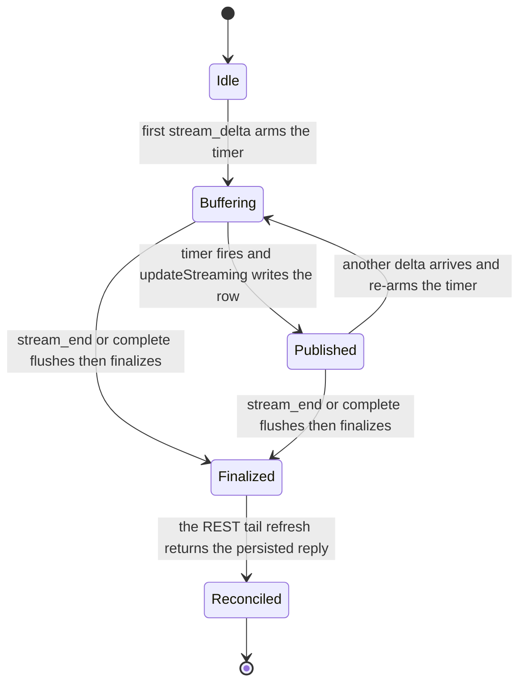
```mermaid
stateDiagram-v2
    [*] --> Idle
    Idle --> Buffering: first stream_delta arms the timer
    Buffering --> Published: timer fires and updateStreaming writes the row
    Published --> Buffering: another delta arrives and re-arms the timer
    Buffering --> Finalized: stream_end or complete flushes then finalizes
    Published --> Finalized: stream_end or complete flushes then finalizes
    Finalized --> Reconciled: the REST tail refresh returns the persisted reply
    Reconciled --> [*]
```

`Finalized` and `Reconciled` are different rows in the same array position at different
times. Finalising swaps the synthetic `__streaming_` id for a unique
`text_<timestamp>_<random>` one and flips `kind` to `text`; the persisted reply that
arrives moments later has yet another id. The store collapses the pair —
`pruneRealtimeSupersededByServer` drops the live row when the same assistant text is
already in the persisted turn, and `dedupeAdjacentAssistantEchoes` catches whatever slips
past into `merged`. Without both, every completed reply would briefly appear twice.

## MAN-330 — Incremental markdown rendering
section: 02-realtime-stream/008 Incremental markdown rendering

Republishing the whole reply ten times a second means re-parsing the whole reply ten
times a second — O(length) per tick, O(length²) over a reply. `StreamingMarkdown` fixes
that by cutting the text into a **settled** prefix and a **pending** tail at a safe block
boundary and rendering them as two memoised `<MarkdownBody>` siblings. The settled half's
props change only when a block completes, so a tick re-parses one block.

The whole thing rests on one property, and the source states it precisely:

> Correctness rests on markdown blocks being independent across a blank line: rendering
> `settled` and `pending` as two documents must equal rendering their concatenation. That
> does NOT hold inside a fenced code block, a display-math block, a list, a blockquote, a
> table, an indented code block, or across a link-reference/footnote definition and its
> usage — the boundary search skips all of them.
> — `src/modules/chat/utils/streamingMarkdown.ts:12-17`

`splitStreamingMarkdown` walks the lines tracking the open code fence and `$$` math
state, and considers only blank lines that are outside both. A blank line is rejected as
a boundary if the nearest non-blank line on **either** side matches
`CONTEXT_SENSITIVE_LINE` — a list item, an indented continuation, a blockquote, a table
row, or a link-reference definition. The **last** surviving candidate wins, so the
settled half is as long as it can safely be.

Four surprises, all of them intended:

- **Settled blocks can un-settle.** The boundary is recomputed from scratch each tick, so
  a paragraph that was settled goes back to pending as soon as a list or a table starts
  after it. `streamingMarkdown.test.ts` has a monotonicity test, but it uses
  paragraphs-only content; monotonicity is not a general guarantee, and retraction is
  what keeps the two halves equal to the unsplit document. Measured at about a third of
  realistic replies, once each.
- **A block that crosses the boundary loses transient in-block state.** It changes parent,
  so its DOM is recreated: a code block's "Copied" tick and any text selection inside it
  are gone. Do not park state in a streamed block. The sharpest instance is a live
  `widget` fence, where what is recreated is a whole sandboxed document rather than a
  tick: a retraction over an already-live widget unmounts it, flashes its raw source back
  into the transcript for a tick, and reloads it when the reply ends. That is measured,
  not inferred, and nothing in the widget module can prevent it — the cure, if it is ever
  wanted, is to keep a block in ONE slot across the boundary, which is this component's
  shape to change. The cost is highest for the fence's DocSpace body shape, where the
  reload is a navigation of a frame the reader can type into, so what a retraction discards
  there is an unsaved edit rather than a tick. In practice a reply is done writing a fence
  before a reader has reached it, and the streaming gate keeps the frame from mounting at
  all until the fence is closed. See [live widgets](./07-live-widgets.md) §"The fence" and
  §"The DocSpace kind".
- **The same component renders finished replies**, with `isStreaming: false` and no split.
  That is deliberate. `MessageComponent` used to swap `<StreamingMarkdown>` for
  `<Markdown>` at that position, and React treats a different element type in the same
  position as a different component — so every reply threw away its DOM the moment it
  completed, destroying a selection the user had started. `messageStreamEnd.test.tsx`
  asserts on node identity, not HTML, because identity is what the browser keys a
  selection to.
- **The `streaming` flag decides more than the widget fence.** `StreamingMarkdown`
  renders the pending half as `<MarkdownBody streaming>`, and `MarkdownBodyRenderer`
  reads that one flag to pick which react-markdown component map to hand down: the plain
  map, which is today's markup element for element, or the shape map. So a half-arrived
  table, list, blockquote or paragraph cannot be read as a rendered shape, and that rule has
  exactly ONE enforcement site instead of one per shape — which also means a shape
  appears at the moment the split boundary settles over it, and disappears again for a
  tick whenever the boundary retracts, the same way a widget fence does. The same flag
  keeps `remarkShapeGroups` out of the pending half's remark plugins, because grouping
  rearranges sibling blocks and a half-arrived fence would join a tab group and leave it
  again on the next delta. Fences and inline marks cross the map rather than obey it —
  fences take the flag as a prop through `CodeBlock`, and file chips, colour swatches and
  keycaps draw on both halves. That, and the probes that hold each half, is
  [rendered shapes](./08-rendered-shapes.md) §"Streaming".

governs: /home/lyphe/.claude/claudecodeui_lyphe/src/modules/chat/utils/streamingMarkdown.ts

## MAN-331 — Run lifecycle and busy state
section: 02-realtime-stream/009 Run lifecycle and busy state

The activity indicator, the abort button and the status text all derive from one
`Map<sessionId, SessionActivity>` in `useSessionProtection`. Nothing in the transcript
feeds it. It is written in exactly four places:

| Event | Effect on the map |
| --- | --- |
| The composer sends | `markSessionProcessing(sessionId, { statusText: null, canInterrupt: true })`, before the frame goes out |
| `chat_subscribed` with `isProcessing` | Marks processing — this is the authoritative answer after a reload |
| `chat_subscribed` idle | Deletes the entry, **unless** a newer local request started after the subscribe was sent. That guard is `ifStartedBefore`, compared against `startedAt` |
| `complete` or `protocol_error` | Deletes the entry |

The `complete` branch runs in a fixed order: flush and finalise streaming text, delete the
busy entry, clear pending permissions for the viewed session, then branch on outcome.

| Outcome | Signal | What the client does |
| --- | --- | --- |
| Aborted | `msg.aborted` | Nothing further. Clearing the entry was the whole job |
| Failed | `msg.success === false` | No sound, no title indicator |
| Succeeded | neither | Title indicator plus completion sound |

Then, **for the viewed session only**, `requestLatestMessages` re-reads the persisted
tail. A background session that finishes keeps its live rows until it is opened.

Abort is a server-side transaction. `chat.abort` requires a run in `running` status —
otherwise the server answers `protocol_error` with code `NO_ACTIVE_RUN` — then stops the
runtime and calls `completeRun` with `aborted: true`. For Claude, stopping is an interrupt the CLI
answers within `INTERRUPT_GRACE_MS` (5 s), and **Stop ends the reply, not the work the reply
started**. The interrupt ends only the turn: what follows it depends on what the process still has
running. With nothing in flight, end-of-input as before. With background work in flight — a
backgrounded subagent or Bash job, a watcher, a scheduled wake-up — the process is left alive and
idle as the session's live process, so that work's completion still wakes the agent and lands in
the chat as it would after a normal turn, and the operator's next message joins the same process;
the idle closer ends it once nothing is running. One follow-up ends that work early: a message that
changes a launch argument (model, cwd, allowed tools, the CLI's own version) respawns the process,
and a respawn retires the one holding the work — end-of-input, which is what takes it down
(`addSession` logs it). A CLI that does not answer in time, or whose
interrupt fails, is killed through the query's `AbortController` (SIGTERM, then SIGKILL — via its
keepalive host when it has one), and that is the only path a Stop is allowed to take background
work down with it, so Stop always completes the run. The killed process usually emits its
own `complete` a moment later; `decorateAndRecordEvent` drops it, because a run already
marked completed cannot complete twice. The partial reply that streamed before the abort
stays in the transcript as an ordinary assistant row.

`error` is not part of any of this:

> 'error' is an informational message row, not a terminal event — providers emit it for
> mid-run stderr output too. Run teardown is always signalled by the unified 'complete'
> that follows.
> — `useChatRealtimeHandlers.ts:281-283`

The token counter deserves one line here because it travels as a `status` frame:
`status` with `text === 'token_budget'` sets the counter, **but only when the frame's
session is the one on screen** — otherwise a second session running in the background
would overwrite the number the user is looking at. `tokenBudgetSessionScope.test.tsx`
pins both directions. The counter shows context-window occupancy, not the turn's bill;
feeding it a summed `result.usage` is what made it bounce before commit `ab13376d`.

The other arm of the `status` branch — the one that writes `statusText` and `canInterrupt`
into the activity map — **has no producer today.** All three `status` emitters send
`text: 'token_budget'` — one apiece in `claude-runtime.provider.js`,
`codex-runtime.provider.js` and `opencode-runtime.provider.js`, which
`grep -rn "text: 'token_budget'" server/modules/providers/list/` finds in full (line
numbers are not pinned here: the Claude one has already moved once). The arm is live code
kept for a provider that reports progress text; do not delete it expecting nothing to
change, and do not assume the status text you see in the UI came from it.

## MAN-332 — Permission requests
section: 02-realtime-stream/010 Permission requests

Claude is the only provider with interactive tool approvals. Asking a human is one function,
`promptForToolDecision` in `claude-runtime.provider.js`: it emits `permission_request` with a
`requestId`, raises the `permission.required` notification that can carry the question to a
phone ([../notifications.md](../notifications.md) §"Answering from the phone"), and blocks
until the client answers with `chat.permission-response`. When an answer arrives it emits
`permission_resolved` with the same id; if the run ends or the request times out it emits
`permission_cancelled` instead. The distinction matters because the answer itself travels only
on the inbound socket: without the outbound `permission_resolved`, the `permission_request`
sitting in the replay buffer had nothing to retract it, so a mid-run page refresh resurrected an
already-answered prompt — and a second tab kept it forever. `permissionPromptReplay.test.tsx`
pins the replayed request-then-resolution netting out to nothing.

**Two callers ask, and exactly one of them asks per mode.** `canUseTool` is the ordinary door.
But the SDK resolves approval at the permission-mode step and never calls `canUseTool` in
`bypassPermissions`, `auto` or `dontAsk`. On its own that means an `AskUserQuestion` or
`ExitPlanMode` in those modes is auto-approved and the model acts on an answer it generated
itself, with nobody asked — so the runtime also registers a **`PreToolUse` hook** matching
`AskUserQuestion|ExitPlanMode`, which runs *before* the mode check and calls the same
`promptForToolDecision`, returning the decision as `hookSpecificOutput.permissionDecision`.
The hook reads `sdkOptions.permissionMode` at call time — a live settings change is seen — and
stands aside in every other mode, because there `canUseTool` is already asking and answering in
both would put one question on the wire twice. The CLI's own **`Notification` hook** announces a
permission prompt of its own accord: it arms a six-second timer on a pending tool ask and notifies
under `notification_type: 'permission_prompt'` when that fires, and the runtime keeps that one type
off the wire for the same reason — `promptForToolDecision` has already raised it, carrying the
question text and the answer buttons, so a push from the hook would ask the human twice and say
less the second time. That type has a second, broader producer inside the CLI, where a dialog
announced under no type of its own defaults to it: the guard filters the type's **dominant
producer**, not the last word on the type, and a dialog family that ever reaches a human through no
other door has to be re-read against it. The matcher declares `timeout: 86_400` — the
SDK reads that field in **seconds**, so a day, which is what keeps the SDK from killing a hook
that is deliberately waiting on a person. The wait itself has no timeout for an interactive tool,
through either caller; an ordinary tool's wait is `CLAUDE_TOOL_APPROVAL_TIMEOUT_MS` and the
runtime denies the tool when it runs out.

The client keeps the pending list in `ChatInterface` state, not in the store — permission
kinds are among the five that are never persisted as rows. The rules:

- A request plays a notification sound, **except** for `ExitPlanMode` / `exit_plan_mode`,
  which are not actionable prompts.
- The list is only maintained for the **viewed** session. A request for a background
  session still marks that session processing and still plays the sound, but does not
  enter the list.
- Duplicate `requestId`s are ignored, because `chat_subscribed` also carries the full
  pending set and can race with a live `permission_request`.
- `permission_resolved` and `permission_cancelled` remove their `requestId` from the
  list, whichever tab or replay delivered the request.
- `chat_subscribed` replaces the list wholesale, and plays the sound only on the
  transition from "no actionable requests" to "some".
- `complete` empties the list for the viewed session.

## MAN-333 — Cross-session behaviour
section: 02-realtime-stream/011 Cross-session behaviour

The store is session-keyed and correct for any number of sessions. The streaming buffer is
not, and this is the sharpest edge in the subsystem.

`accumulatedStreamRef` and `streamTimerRef` are single refs on `ChatInterface`. When a
delta arrives:

- It is appended to that one ref, **whatever session it belongs to.**
- The timer, if not already armed, is armed with a closure over *that* frame's session id.
  The flush writes the ref's entire contents to *that* session.
- Additionally, if the frame's session is **not** the one on screen, the raw delta is
  appended to that session's slot as its own row.

So two sessions streaming at once share one buffer, and the background session's prose can
be published into the foreground session's placeholder. Nothing repairs this except a
session switch, which calls `resetStreamingState` and clears both refs. The background
session, meanwhile, accumulates one store row per delta rather than one coalesced row;
those rows only disappear on a server refresh whose persisted assistant text matches them
exactly, and they count against the 500-row realtime cap.

Everything else is per-session and behaves: `lastSeqRef` and `statusCheckSentAtRef` are
`Map`s keyed by session id, the busy map is keyed by session id, the token counter is
scoped to the viewed session, and `appendRealtime` targets the frame's own slot regardless
of what is on screen.

The multi-*client* story is the opposite — deliberately shared. A run's writer holds every
subscribed connection, so a second tab or a phone gets the same live stream, and
`history_truncated` reaches all of them so an edit made in one tab does not leave the
question rendered twice in another.

## MAN-334 — Gotchas and why the code looks like this
section: 02-realtime-stream/012 Gotchas and why the code looks like this

- **`createNormalizedMessage` lives in `server/shared/utils.ts`, not
  `message-unification.ts`.** That filename is the most misleading in the subsystem:
  `message-unification.ts` exports exactly one function, `prepareTranscriptMessages`, and
  it runs on REST history reads for Claude and Codex only. No live frame passes through
  it.
- **`__streaming_<sessionId>` is a real id that appears in the store.** It is matched by
  name in `pruneRealtimeSupersededByServer`. Code that assumes every row id came from a
  provider will trip over it.
- **`finalizeStreaming` mutates the array slot in place.** It does not remove and append.
  The id changes underneath the same position, on purpose, so React reconciles the
  existing DOM and a text selection survives the end of the reply.
- **A streaming reply does not re-trigger auto-scroll.** The follow effect depends on
  `chatMessages.length`, and an in-place rewrite does not change it. Within one streamed
  block the browser pins the pane; the next row that arrives re-follows. See
  [scrolling](./05-scrolling.md).
- **The 100 ms flush publishes the whole reply, not the delta.** Anyone optimising this
  into an incremental append has to also handle the case where a flush is skipped, which
  is exactly what the current design makes impossible to get wrong.
- **`error` does not end a run and does not clear the spinner. `protocol_error` does
  both.** A protocol error means the frame was rejected before a run existed —
  `SESSION_NOT_FOUND`, `UNSUPPORTED_PROVIDER`, `RUN_IN_PROGRESS`, `NO_ACTIVE_RUN` — so no
  `complete` will follow and nothing else would ever clear the busy state.
- **Only `protocol_error` synthesises a message row on the client.** Every other row
  originates from a provider or from the local optimistic echo.
- **Realtime rows are capped at 500 per session** (`MAX_REALTIME_MESSAGES`), oldest
  dropped. A tool-heavy run can exceed that; the persisted transcript is the fallback.
- **The server's replay buffer is 5000 events per run, retained 5 minutes after
  completion**, and completed runs are deliberately *not* replayed on subscribe — they
  are already served by the history endpoint, and replaying them would duplicate rows.
- **Subagent rows must be skipped in the second projection pass.** They are folded into
  their `Task` container in the first pass by `parentToolUseId`; dropping the
  `if (msg.parentToolUseId) continue` guard renders every subagent tool twice.
- **A `tool_result` whose `tool_use` is not in the loaded window renders nothing.** That
  is intentional: it is almost always a pair split across a pagination boundary, and
  rendering the raw content produced an unstyled dump that "fixed itself" on the next
  page load.
- **The projection cache is keyed on more than the source record.** A `tool_use` record is
  unchanged when its result arrives, and unchanged when its subagent timeline grows, so
  `CachedMessageProjection` stores `toolResultSource` and `subagentActivitySource`
  alongside the projected messages and requires both to match for a cache hit.
- **When a mid-run refresh attaches a partial server subagent timeline, the longer of the
  two lists wins.** Otherwise a refresh mid-run would visibly shorten a panel.
- **Never split streaming markdown inside a fence, list, table, blockquote or math
  block.** Extend `CONTEXT_SENSITIVE_LINE`; do not relax it. The equivalence property is
  the only thing making the two-half render legal.
- **`stream_end` from a background session is close to a no-op.** `finalizeStreaming`
  looks for `__streaming_<sid>` in that session's slot, and nothing put one there.
- **Frames without `kind` are dropped before anything else happens.** If events are
  clearly arriving and nothing renders, check that first.

governs: /home/lyphe/.claude/claudecodeui_lyphe/server/shared/utils.ts

## MAN-335 — If you change this, check that
section: 02-realtime-stream/013 If you change this, check that

| If you touch | Also check |
| --- | --- |
| The 100 ms flush interval or the timer arming | `StreamingMarkdown`'s whole reason for existing is that interval. Slower means fewer re-parses but visibly chunkier text; faster means the split has to earn more. |
| `updateStreaming` or the `__streaming_` id | `pruneRealtimeSupersededByServer` matches that id by name, and `dedupeAdjacentAssistantEchoes` special-cases a `stream_delta` row followed by an identical assistant `text` row. |
| `finalizeStreaming` | It must keep the array position and must not append. `messageStreamEnd.test.tsx` covers the DOM-identity half; the duplicate-bubble half is covered by the store's dedupe. |
| The `shouldPersist` filter | Adding a kind to it makes that kind renderable, which means `normalizedToChatMessages` needs a case for it or it silently disappears. |
| Anything in `splitStreamingMarkdown` | `streamingMarkdown.test.ts` for the boundary rules and `streamingMarkdownRenderEquivalence.test.tsx` for split-equals-unsplit on every prefix. Both must pass on the fenced and list fixtures. |
| A provider's `normalizeMessage` | The kind table above. Adding `stream_delta` to a provider that had none makes the shared buffer and the missing `stream_end` suddenly matter for it. |
| `decorateAndRecordEvent` or `seq` assignment | Reconnect replay is `seq > lastSeq` with no gap detection, and `lastSeqRef` only moves forward. Any non-monotonic `seq` silently loses events. |
| The `status` branch | Both arms. The `token_budget` arm is scoped to the viewed session on purpose, and the other arm currently has no producer — a new producer will start writing status text into the activity map for the first time. |
| Session-switch cleanup in `useChatSessionState` | `resetStreamingState` is the only thing that unwinds a shared buffer mid-stream. Removing that call re-introduces cross-session text bleed. |

Related: [the websocket layer](./01-websocket-transport.md) for the transport and the replay
contract, [the message store](./04-message-store-and-lazy-loading.md) for what happens to
a row after `appendRealtime`, [tool views](./06-tool-view.md) for how a paired
`tool_use` becomes a card, and [the index](./README.md) for the rest of the set.

## MAN-336 — In one paragraph
section: 03-conversation-handoff/000 In one paragraph

A conversation has two identities. The **app session id** is a `randomUUID()` the server
mints over REST before the first websocket frame is sent; the URL, the message store and
every wire frame use it, and it never changes. The **provider session id** is the CLI's or
SDK's own id for the same conversation — a Claude transcript uuid, a Codex thread id — and
it is a server-side mapping detail stored in a nullable column on the same database row.
So "the handoff" is not about ids at all. It is about ownership, and a conversation changes
hands in four places: a draft becomes a persisted row, a live run's frames become a
transcript on disk, the filesystem watcher's provisional sidebar row is merged into the app
row, and an edit moves the conversation onto a different provider transcript. The transport
underneath is [the websocket layer](./01-websocket-transport.md); how frames become
rendered messages is [the realtime stream](./02-realtime-stream.md).

## MAN-337 — Mental model
section: 03-conversation-handoff/001 Mental model

1. **The app session id exists before the first frame and never changes.**
   `sessionsService.createAppSession` mints it inside `POST /api/providers/sessions`, and
   the composer will not send until it has one. Predict from this: no code re-keys a
   message, migrates a store slot, or navigates mid-run.
2. **A provider id never reaches the browser on a chat frame.**
   `chatRunRegistry.decorateAndRecordEvent` overwrites `sessionId` (and `actualSessionId`
   on `complete`) with the app id on every outbound event. Exactly two paths leak it on
   purpose: the `session_upserted` delta carries `providerSessionId` so the sidebar can
   collapse an aliased row, and `GET /api/providers/sessions/:id/provider-id` serves the
   sidebar's "copy session id" action.
3. **`session_created` is swallowed server-side.** `ChatSessionWriter.send` intercepts it,
   records the mapping and returns before the event is ever sequenced. It is a valid
   `MessageKind` and all four runtimes emit it — Claude only when there was nothing to
   resume — but no client has ever received one.
4. **A run is keyed by the app session id, at most one at a time, and its audience is a
   set of sockets that may be empty.** `chatRunRegistry.startRun` returns `null` when the
   session is already running, which becomes `RUN_IN_PROGRESS`. The audience is the socket
   that sent `chat.send` plus every socket that sent `chat.subscribe` *while that run was
   running*. `runDetachedChatTurn` starts a run with no socket at all.
   A run also carries `cliVersion`: the CLI version its own process announced in the SDK's
   init message, stamped at the top of the runtime's message loop on every turn, resumed
   ones included, and served by `GET /api/cli-version` ([cli-version.md](../cli-version.md)).
5. **The persisted transcript wins; live rows are an overlay.** Every `complete` for the
   viewed session schedules a bounded REST tail refresh, and the overlay is pruned against
   whatever comes back. Predict from this: any live row that is also on disk disappears
   within one refresh, and any row that is not on disk yet survives.
6. **Switching sessions moves a pointer.** Per-session state lives in `useSessionStore`
   slots keyed by session id. `setActiveSession` only changes which slot re-renders, so a
   background run keeps filling its own slot and nothing is unsubscribed.
7. **Nothing is ever deleted from a provider transcript.** An edit either resumes the
   transcript partway (Claude) or branches it on disk (Codex). An abandoned Codex thread
   stays on disk and is recorded in `superseded_provider_sessions` so the indexer will not
   offer it back.
8. **`history_truncated` only cuts, and only where the anchor is already loaded.**
   `sessionStore.truncateAt` returns without doing anything when no cached server row
   carries that `transcriptAnchorId`, so a client that has not paged back far enough is
   corrected by the REST refresh instead.

## MAN-338 — The pieces
section: 03-conversation-handoff/002 The pieces

| File | Role |
| --- | --- |
| `server/modules/providers/provider.routes.ts` | `POST /sessions` mints the app id; `GET /sessions/:id/messages`, `/sessions/:id/provider-id`, `/sessions/running`, `POST /sessions/:id/fork` |
| `server/modules/providers/services/sessions.service.ts` | `createAppSession`, `resolveProviderSessionId`, `resolveEditAnchor`, `providerRewindsForEdit`, `rewindSessionForEdit`, `forkSessionById`, `fetchHistory`, `listRunningSessions` |
| `server/modules/database/repositories/sessions.db.ts` | The one row that holds both ids, and every mutation of the mapping |
| `server/modules/websocket/services/chat-session-writer.service.ts` | `ChatSessionWriter`: swallows `session_created`, captures the native id, fans out to every attached socket |
| `server/modules/websocket/services/chat-run-registry.service.ts` | `startRun`, `attachConnection`, `replayEvents`, `completeRun`, `completeRunIfCurrent`; internally `decorateAndRecordEvent` and `recordProviderSessionId` |
| `server/modules/websocket/services/chat-websocket.service.ts` | `handleChatSend`, `handleChatEditSend`, `handleChatSubscribe`, `handleChatAbort`, `dispatchRun`, `runDetachedChatTurn` |
| `server/modules/websocket/services/session-upsert-broadcast.service.ts` | `buildSessionUpsertedEvent` — the single builder of the sidebar delta |
| `server/modules/providers/services/sessions-watcher.service.ts` | Watches provider directories, debounces, broadcasts upserts in batches |
| `server/modules/providers/services/session-synchronizer.service.ts` | Shared full scan, per-file indexing, `pruneOrphanedSessions` |
| `server/modules/providers/list/claude/claude-sessions.provider.ts` | `resolveEditAnchor` — walks `parentUuid` back to the previous assistant row |
| `server/modules/providers/list/codex/codex-sessions.provider.ts` | `resolveEditAnchor` and `rewindSession` — forks the thread and repoints the session row |
| `server/modules/providers/list/claude/claude-fork.provider.ts`, `.../codex/codex-fork.provider.ts` | Branch a conversation into an independent one |
| `src/modules/chat/hooks/useChatComposerState.ts` | Allocates the session on the first send; builds `chat.send` and `chat.edit-send` |
| `src/modules/chat/ChatInterface.tsx` | `handleSessionEstablished`, `handleWebSocketReconnect`, `handleForkFromMessage`, `lastSeqRef`, `statusCheckSentAtRef` |
| `src/modules/chat/hooks/useChatSessionState.ts` | Subscribe-on-open, load-on-switch, the refresh coordinator, the New Session reset |
| `src/modules/chat/hooks/useChatRealtimeHandlers.ts` | Routes frames into the store and the busy map |
| `src/modules/chat/hooks/useSessionStore.ts` | Per-session slots, `appendRealtime`, `truncateAt`, `refreshLatestFromServer` |
| `src/modules/chat/utils/sessionMessageReconciliation.ts` | `removeOptimisticUserEchoes` — retires local echoes against persisted rows |
| `src/modules/chat/utils/messageHistoryRefreshCoordinator.ts` | Coalesces refresh signals; keeps hidden sessions dirty |
| `src/modules/chat/utils/messageKeys.ts` | `getIntrinsicMessageKey` — stable React keys across re-fetches |
| `src/shared/context/SessionProtectionContext.tsx`, `src/shared/hooks/useSessionProtection.ts` | The busy map: which sessions are producing a response |
| `src/modules/project-workspace/hooks/useProjectsState.ts` | `registerOptimisticSession`, `upsertSessionIntoProject`, `handleNewSession` |

governs: /home/lyphe/.claude/claudecodeui_lyphe/server/modules/database/repositories/sessions.db.ts, /home/lyphe/.claude/claudecodeui_lyphe/server/modules/providers/list/claude/claude-fork.provider.ts, /home/lyphe/.claude/claudecodeui_lyphe/server/modules/providers/list/claude/claude-sessions.provider.ts, /home/lyphe/.claude/claudecodeui_lyphe/server/modules/providers/list/codex/codex-sessions.provider.ts, /home/lyphe/.claude/claudecodeui_lyphe/server/modules/providers/provider.routes.ts, /home/lyphe/.claude/claudecodeui_lyphe/server/modules/providers/services/sessions.service.ts, /home/lyphe/.claude/claudecodeui_lyphe/server/modules/providers/services/sessions-watcher.service.ts, /home/lyphe/.claude/claudecodeui_lyphe/server/modules/providers/services/session-synchronizer.service.ts, /home/lyphe/.claude/claudecodeui_lyphe/server/modules/websocket/services/chat-run-registry.service.ts, /home/lyphe/.claude/claudecodeui_lyphe/server/modules/websocket/services/chat-session-writer.service.ts, /home/lyphe/.claude/claudecodeui_lyphe/server/modules/websocket/services/chat-websocket.service.ts, /home/lyphe/.claude/claudecodeui_lyphe/server/modules/websocket/services/session-upsert-broadcast.service.ts, /home/lyphe/.claude/claudecodeui_lyphe/src/modules/chat/ChatInterface.tsx, /home/lyphe/.claude/claudecodeui_lyphe/src/modules/chat/hooks/useChatComposerState.ts, /home/lyphe/.claude/claudecodeui_lyphe/src/modules/chat/hooks/useChatRealtimeHandlers.ts, /home/lyphe/.claude/claudecodeui_lyphe/src/modules/chat/hooks/useChatSessionState.ts, /home/lyphe/.claude/claudecodeui_lyphe/src/modules/chat/hooks/useSessionStore.ts, /home/lyphe/.claude/claudecodeui_lyphe/src/modules/chat/utils/messageHistoryRefreshCoordinator.ts, /home/lyphe/.claude/claudecodeui_lyphe/src/modules/chat/utils/messageKeys.ts, /home/lyphe/.claude/claudecodeui_lyphe/src/modules/chat/utils/sessionMessageReconciliation.ts, /home/lyphe/.claude/claudecodeui_lyphe/src/modules/project-workspace/hooks/useProjectsState.ts, /home/lyphe/.claude/claudecodeui_lyphe/src/shared/context/SessionProtectionContext.tsx, /home/lyphe/.claude/claudecodeui_lyphe/src/shared/hooks/useSessionProtection.ts

## MAN-339 — The two ids and where they meet
section: 03-conversation-handoff/003 The two ids and where they meet

**RULE: one row owns both ids. The app id is the key; the provider id is a nullable column
on it.**

| | App session id | Provider session id |
| --- | --- | --- |
| Minted by | `sessionsService.createAppSession` with `randomUUID()` | The provider CLI or SDK, mid-run |
| When | Before the first `chat.send` | The first time the runtime announces one |
| Column | `sessions.session_id` | `sessions.provider_session_id`, NULL until then |
| In the URL, the store, the frames | Yes | Never |
| Used to | Address runs, slots, permissions, aborts | Resume the provider, find the transcript on disk |

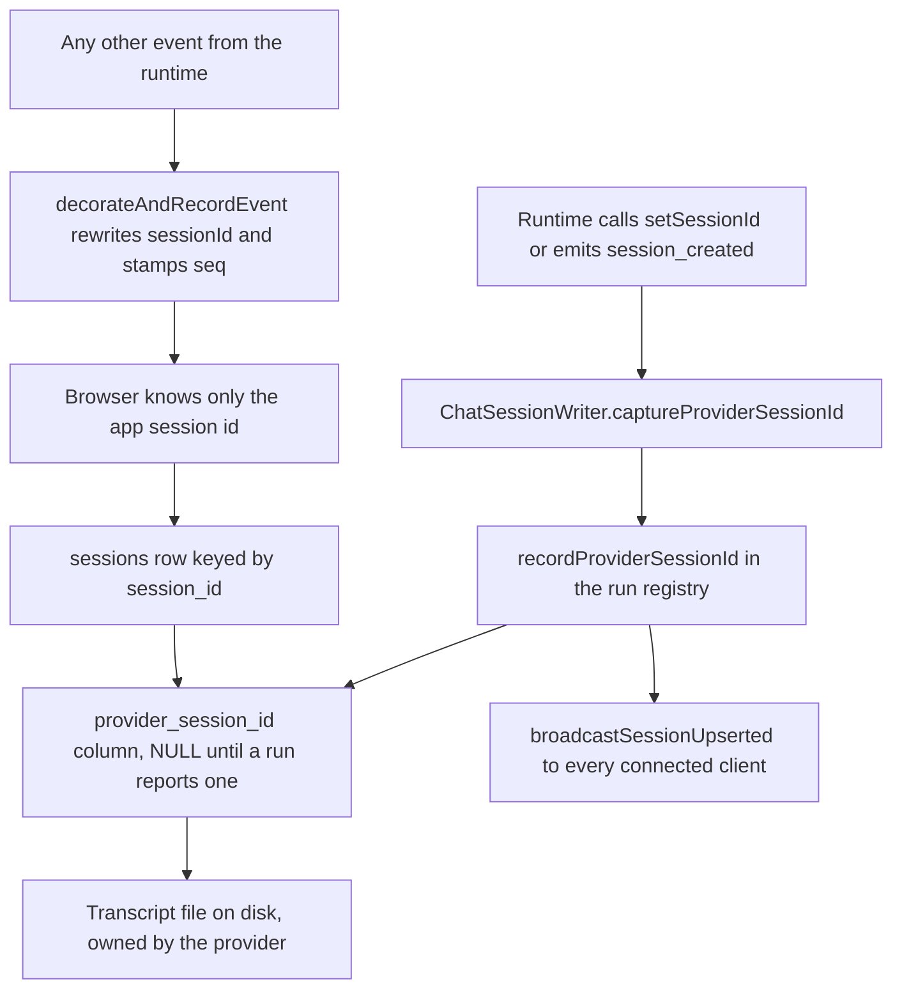
```mermaid
flowchart TD
  A["Browser knows only the app session id"] --> B["sessions row keyed by session_id"]
  B --> C["provider_session_id column, NULL until a run reports one"]
  C --> D["Transcript file on disk, owned by the provider"]
  E["Runtime calls setSessionId or emits session_created"] --> F["ChatSessionWriter.captureProviderSessionId"]
  F --> G["recordProviderSessionId in the run registry"]
  G --> C
  G --> H["broadcastSessionUpserted to every connected client"]
  I["Any other event from the runtime"] --> J["decorateAndRecordEvent rewrites sessionId and stamps seq"]
  J --> A
```

Two capture paths exist because runtimes differ. All four runtimes call
`writer.setSessionId(...)` the moment they read an id off their stream; Claude additionally
emits `session_created`, but only when there was nothing to resume. Both land in
`ChatSessionWriter.captureProviderSessionId`, which forwards to the registry's
`recordProviderSessionId`.

**Capture is not "first one wins".** Repeating the id already held is a no-op in both
functions. A *different* id replaces the mapping, and that is deliberate: a Claude edit of
the very first prompt runs with `resumeFromScratch`, the SDK announces a brand-new native
id, and the row has to follow it.

Reading in the other direction, runtimes receive the **app** id and translate it themselves.
`provider-runtime.service.ts` injects `context.resolveProviderSessionId`, which is
`sessionsService.resolveProviderSessionId`:

- a row with a mapping returns its `provider_session_id`;
- a row without one returns `null`, which every runtime reads as "start fresh";
- an id with no row at all is returned unchanged, on the assumption that a direct API caller
  passed a provider-native id the watcher has not indexed yet.

Going the other way — a provider or disk-discovered id in, the app id out — is
`sessionsDb.resolveAppSessionId`, which checks the current provider mapping, then
`superseded_provider_sessions` (so an id an edit moved on from still resolves), then a plain app id,
and returns the input unchanged rather than `null` when no row carries it at all. It exists for
callers outside the sessions service that hold a provider-spelled id and must show it beside an app
session without ever letting a provider id itself reach the browser: the plan-runner lane's
`launched_by_session` ([plan-runner.md](../plan-runner.md) §files) and the memory lane's `sessionId`
([memory-intake.md](../memory-intake.md) §"Where the shapes live").

## MAN-340 — What `session_created` used to do
section: 03-conversation-handoff/003 The two ids and where they meet/004 What `session_created` used to do

It used to be the handoff. The frontend held a placeholder id, sent the first message, and
re-keyed everything when the provider announced its real id. Commit `f5eac2ec` ("unify
session gateway with stable IDs and a single WS protocol") deleted that: *"The frontend
previously juggled placeholder IDs, provider-native IDs, and session_created handoffs, which
caused race conditions and provider-specific branching."* What survives is the swallow in
`ChatSessionWriter.send` and a no-op `case 'session_created'` in `normalizedToChatMessages`
(`src/modules/chat/hooks/useChatMessages.ts`), kept because the kind is still in the union.

governs: /home/lyphe/.claude/claudecodeui_lyphe/src/modules/chat/hooks/useChatMessages.ts

## MAN-341 — The provider id column's lifecycle
section: 03-conversation-handoff/003 The two ids and where they meet/005 The provider id column's lifecycle

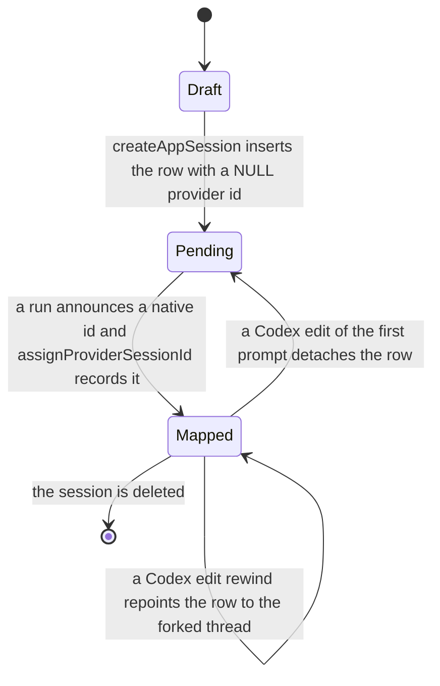
```mermaid
stateDiagram-v2
  [*] --> Draft
  Draft --> Pending : createAppSession inserts the row with a NULL provider id
  Pending --> Mapped : a run announces a native id and assignProviderSessionId records it
  Mapped --> Mapped : a Codex edit rewind repoints the row to the forked thread
  Mapped --> Pending : a Codex edit of the first prompt detaches the row
  Mapped --> [*] : the session is deleted
```

`Draft` is a UI state only — no row exists yet. In `Pending`,
`GET /api/providers/sessions/:id/messages` returns an empty page by design, because
`sessionsService.fetchHistory` short-circuits on a NULL `provider_session_id`. So during the
very first turn the transcript on screen is entirely realtime rows.

Only a provider that rewinds by branching reaches `Pending` again:
`CodexSessionsProvider.rewindSession` calls `markProviderSessionSuperseded` and then
`detachProviderSession` when nothing survives the cut. Claude never detaches — it re-runs
with `resumeFromScratch` and the row is remapped when the SDK announces its new id.

## MAN-342 — Starting a new conversation
section: 03-conversation-handoff/006 Starting a new conversation

**RULE: the id is allocated over REST before the first frame, so the sidebar row, the URL
and the run agree from message one.**

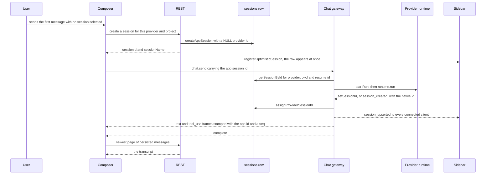
```mermaid
sequenceDiagram
  participant U as User
  participant C as Composer
  participant API as REST
  participant DB as sessions row
  participant GW as Chat gateway
  participant P as Provider runtime
  participant SB as Sidebar

  U->>C: sends the first message with no session selected
  C->>API: create a session for this provider and project
  API->>DB: createAppSession with a NULL provider id
  API-->>C: sessionId and sessionName
  C->>SB: registerOptimisticSession, the row appears at once
  C->>GW: chat.send carrying the app session id
  GW->>DB: getSessionById for provider, cwd and resume id
  GW->>P: startRun, then runtime.run
  P-->>GW: setSessionId, or session_created, with the native id
  GW->>DB: assignProviderSessionId
  GW-->>SB: session_upserted to every connected client
  GW-->>C: text and tool_use frames stamped with the app id and a seq
  GW-->>C: complete
  C->>API: newest page of persisted messages
  API-->>C: the transcript
```

Three details worth pinning:

- **The name.** `buildCloudCliSessionName(initialMessage)` derives a four-word title from
  the first message, so the sidebar row is never blank. The composer keeps its own summary
  and uses it if the server returns an empty string.
- **The optimistic row.** `registerOptimisticSession` builds a local `SessionUpsertedEvent`
  and runs it through `upsertSessionIntoProject`, the same reducer the wire event uses. It
  deliberately carries no `providerSessionId` — there is nothing truthful to put there yet.
- **The real row.** The first *server* `session_upserted` arrives mid-run, from
  `recordProviderSessionId`. The reducer matches it to the optimistic row by alias id,
  updates in place, and refuses to blank a title it already has.
- **This describes the project tree.** The flat simple chat list is a second front door onto
  the same `POST /api/providers/sessions` (see [simple-chat-list.md](../simple-chat-list.md))
  and has no optimistic row at all: `useSimpleChatList` only reloads once the server's own
  `session_upserted` reaches it, debounced 500 ms.

Navigation happens once. `ChatInterface.handleSessionEstablished` sets `currentSessionId`,
calls `onSessionEstablished` (which registers the optimistic row) and then
`onNavigateToSession`, which is `ProjectMainRegion.handleNavigateToSession` doing
`navigate('/session/:id')`. The only other navigate in this area is the alias fix-up
described under [transcripts on disk](#transcripts-on-disk), and it fires only when the URL
holds a provider-native id.

## MAN-343 — Switching sessions in the UI
section: 03-conversation-handoff/007 Switching sessions in the UI

**RULE: a switch changes a pointer. It clears no slot and unsubscribes from nothing.**

| On switching to session B | What happens |
| --- | --- |
| `useSessionStore` | `setActiveSession(B)` moves `activeSessionIdRef`. A's slot stays in the map with its `serverMessages`, `realtimeMessages` and pagination |
| Re-render | `notify(sessionId)` bumps the tick only when the written session is the active one, so A's background frames cost no renders |
| Live subscription | The `chat.subscribe` effect in `useChatSessionState.ts` fires for B with B's `lastSeq`. A is never unsubscribed — there is no `chat.unsubscribe` frame, and the only server-side audience state is each run's connection set |
| History | If B's slot has a `fetchedAt` and the session key matches, nothing is refetched; only `isStale` (`STALE_THRESHOLD_MS = 30_000`) may trigger a bounded tail refresh. Otherwise `fetchFromServer` loads the newest `SESSION_MESSAGES_PAGE_SIZE = 20` rows |
| Scroll and pagination | Reset in the same load effect and by the scroll effects; see [scrolling](./05-scrolling.md) |
| Streaming buffer | `resetStreamingState()` clears `streamTimerRef` and `accumulatedStreamRef`. These are per-`ChatInterface`, not per-slot |

A background run therefore keeps accumulating. Frames for A arrive on the same socket,
`useChatRealtimeHandlers` reads `msg.sessionId`, and `sessionStore.appendRealtime(A, msg)`
writes into A's slot, capped at `MAX_REALTIME_MESSAGES = 500`. Switching back renders what
was collected. The store lives as long as `ChatInterface` is mounted, which is the whole
time a project is selected: `WorkspaceMain` hides the chat tab with a `hidden` class instead
of unmounting it.

"New Session" is not a switch. `handleNewSession` selects the project, clears
`selectedSession`, navigates to `/` and increments `newSessionTrigger`, which drives a
dedicated reset effect in `useChatSessionState.ts`. The counter exists because the click
must still do something when the app is already in that exact visible state.

## MAN-344 — Session protection: the busy map
section: 03-conversation-handoff/008 Session protection: the busy map

**RULE: `useSessionProtection` answers one question — which sessions are producing a
response right now.** It no longer protects list refreshes.

The name is historical. It used to suppress project-list refreshes during a run, because the
server pushed whole-project snapshots that could clobber the view. That is gone: the backend
pushes per-session `session_upserted` deltas, and both producers say so in comments —
*"an upsert of one session can never clobber unrelated client state, so the frontend needs no
'suppress updates while a run is active' protection logic"* (`sessions-watcher.service.ts`)
and *"no 'suppress updates while a run is active' protection is needed anymore"*
(`useProjectsState.ts`).

What remains is a `Map<sessionId, SessionActivity>` of `{ statusText, canInterrupt, startedAt }`:

| Written by | When |
| --- | --- |
| `markSessionProcessing` | The composer, just before `chat.send`; a `chat_subscribed` ack with `isProcessing: true`; a `status` frame carrying text; a `permission_request` |
| `markSessionIdle` | `complete`; `protocol_error`; a `chat_subscribed` ack with `isProcessing: false` |
| `syncProcessingSessions` | Every 5 s, and when the tab becomes visible again, from `GET /api/providers/sessions/running`, which returns `chatRunRegistry.listRunningRuns()` beside `subagentSessionIds` — the conversations a subagent is still running in, live run or not — and `awaitingInputSessionIds`, the conversations a question is waiting in, live run or not |

Two guards make it stable:

- **Stale idle acks.** `markSessionIdle(id, { ifStartedBefore })` keeps an entry whose
  `startedAt` is at or after the moment that session's `chat.subscribe` was sent
  (`statusCheckSentAtRef`). Without it, an ack describing the previous state clears a send
  that started while the subscribe was in flight.
- **A 10 s local grace.** `syncProcessingSessions` keeps entries the server did not report
  if they are younger than `LOCAL_ACTIVITY_GRACE_MS = 10_000`, so the poll cannot race a
  send that has not reached the registry yet.

Consumers: `useProcessingSessions` (chat — the activity line and the abort button),
`useBusySessionIdSet` (sidebar — membership only, derived by `useSessionIdSet` from a sorted
membership key so its `Set` identity survives the several-times-a-second `statusText` rewrites),
`useAwaitingInputSessionIdSet` (sidebar — the sessions a Claude question or permission prompt is
waiting in, taken from the payload's `awaitingInputSessionIds` and from any run whose own item
carries `awaitingInput`; a row draws a yellow dot in place of its spinner, and on its own when its
turn has already ended — a question outlives the turn that asked it; same membership-key identity),
`useSubagentRunningSessionIdSet` (sidebar — the sessions named by the
payload's `subagentSessionIds`; a row draws a purple dot BESIDE its spinner or yellow dot, and on
its own when its turn has already ended, which is the ordinary case; same membership-key identity),
and `isSessionProcessing` (`useProjectsState`,
to decide whether a `session_upserted` for the viewed session should force a reload).

Both the purple dot and the yellow dot are marks on the response that are not about a live run,
which is why each is a top-level list rather than a field on each item. A backgrounded `Agent` call
outlives the turn that launched it, so the chat it belongs to has left `sessions` by the time the
dot matters; and a question outlives its turn the same way — the agent's completion wakes the CLI
for a continuation turn no run is registered for, and the `AskUserQuestion` it asks is pending on
screen while the registry has forgotten the session. A mark read off the runs alone cannot light for
either. What the server answers for the subagent side, and what it costs to answer, is
`session-subagent-runs.service.ts`'s own subject; the awaiting side is the approval map itself,
asked through `listPendingSessions` — see `permissions.listPendingSessions` in the provider runtime
and `sessionsService.listAwaitingInputSessionIds`.

## MAN-345 — Reconciling live events with the persisted transcript
section: 03-conversation-handoff/009 Reconciling live events with the persisted transcript

**RULE: live rows are provisional. Persisted rows win, and every terminal event schedules a
bounded re-read.**

A slot holds `serverMessages` (REST) and `realtimeMessages` (socket) separately and derives
`merged` from both, recomputing only when either array changes by reference
(`recomputeMergedIfNeeded`). Three mechanisms decide what survives, and a fourth decides what
React sees:

| Layer | Where | Key |
| --- | --- | --- |
| The same row from both sources | `computeMerged`, `pruneRealtimeSupersededByServer` (`useSessionStore.ts`) | `NormalizedMessage.id`, plus `toolId` for tool calls and same-turn text matching for assistant replies |
| The user's optimistic echo | `removeOptimisticUserEchoes` (`sessionMessageReconciliation.ts`) | An id starting with `local_`, then trimmed text plus image and file counts, within 5 min (30 s when there is no text) and no more than 10 s before the local timestamp, one-to-one against unclaimed server rows |
| Assistant text echoed twice | `dedupeAdjacentAssistantEchoes` (`useSessionStore.ts`) | Adjacent assistant rows with identical trimmed content; a `stream_delta` placeholder collapses into the persisted `text` row |
| React keys | `getIntrinsicMessageKey` (`messageKeys.ts`), disambiguated by `messageKeyMap` in `ChatMessagesPane.tsx` | First of `id`, `messageId`, `toolId`, `toolCallId`, `blobId`, `rowid`, `sequence`; otherwise `type` plus timestamp plus `toolName` plus the first 48 characters, then suffixed by occurrence index on collision |

`getIntrinsicMessageKey` is a *render* key, not a store key. A refresh replaces source
objects with equivalent new ones, so object identity is not durable across pagination or
hydration.

The refresh is coordinated, never fired directly:

- `useChatRealtimeHandlers` calls `requestLatestMessages(sid, isActive)` on `complete`, and
  only when `sid` is the viewed session.
- `ChatInterface.handleWebSocketReconnect` awaits `requestLatestMessages` **before**
  re-sending `chat.subscribe`, so replay lands on top of a fresh transcript.
- `useProjectsState` bumps `externalMessageUpdate` when a `session_upserted` names the viewed
  session and it is *not* processing. That is the "changed on disk from somewhere else"
  signal, and the effect that consumes it also skips while the session is processing.

All three go through `createMessageHistoryRefreshCoordinator`: one in-flight request per
session, at most one trailing request, and a session that cannot refresh right now (chat tab
hidden, or no longer the viewed session) stays marked dirty until `flushPending` runs on
activation. The fetch itself is `refreshLatestSlotFromServer`, which pulls the newest 20 rows
and stitches them onto the cached suffix, bridging with extra requests for turns bigger than
one page. See [the message store](./04-message-store-and-lazy-loading.md).

## MAN-346 — Editing an already-sent message
section: 03-conversation-handoff/010 Editing an already-sent message

**RULE: an edit is a new run plus a broadcast instruction to forget rows — never a delete.**

`chat.edit-send` is its own frame so `chat.send` keeps its "the client cannot influence the
shape of the conversation" property, and so the edit gets its own refusals:
`ANCHOR_REQUIRED`, `ANCHOR_NOT_FOUND`, `ANCHOR_LOOKUP_FAILED`, `EDIT_NOT_SUPPORTED`,
`EDIT_REWIND_FAILED`. The anchor is the row's `transcriptAnchorId` — the provider's own row
id, today Claude's message uuid and Codex's enclosing turn id.

`handleChatEditSend` resolves the anchor to `resumeThroughId`, the last row to **keep**;
`null` means the edited message was the first prompt. Then it branches on
`sessionsService.providerRewindsForEdit`, which is simply whether that provider implements
`rewindSession`:

| Provider shape | Chosen because | What the run receives |
| --- | --- | --- |
| Resume partway (Claude) | The SDK has `resumeSessionAt` | `resumeAnchorId` and `resumeFromScratch` run options; nothing on disk is rewritten |
| Rewind first (Codex) | A thread only grows; `thread/fork` is the only cut | No extra options. The row is repointed to the forked thread, then run as an ordinary resume |

Both paths emit `history_truncated` through `run.writer` *before* the rewind, inside
`dispatchRun`'s `beforeRun` hook. That hook runs only after `startRun` admitted the run, so
a send that will be refused with `RUN_IN_PROGRESS` can never rewind anything. The kind is a
normal `MessageKind`, so the frame is sequenced and buffered like any provider event even
though the gateway, not a provider, produced it.

On the client, `sessionStore.truncateAt(sessionId, anchorId)`:

1. Finds the cached server row whose `transcriptAnchorId` matches, and returns untouched if
   there is none.
2. Drops that row and everything after it.
3. Clears `realtimeMessages` — except the newest row tagged `replacesAnchorId === anchorId`,
   which is the optimistic echo of the message the user just sent.
4. Stamps that survivor with `replacesAfterRowCount = cutIndex`.
5. Resets `total` and `offset` to the surviving length, so the pager cannot request pages
   that no longer exist.

`replacesAfterRowCount` then feeds two things: `removeOptimisticUserEchoes`, which only lets
server rows at or after that index retire the echo, and `readSortTime`, which floors a
`replacesAnchorId` row at the newest server timestamp so it stays last.

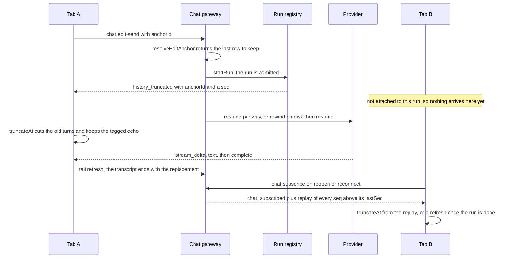
```mermaid
sequenceDiagram
  participant TA as Tab A
  participant GW as Chat gateway
  participant RG as Run registry
  participant PR as Provider
  participant TB as Tab B

  TA->>GW: chat.edit-send with anchorId
  GW->>GW: resolveEditAnchor returns the last row to keep
  GW->>RG: startRun, the run is admitted
  RG-->>TA: history_truncated with anchorId and a seq
  Note over TB: not attached to this run, so nothing arrives here yet
  GW->>PR: resume partway, or rewind on disk then resume
  TA->>TA: truncateAt cuts the old turns and keeps the tagged echo
  PR-->>TA: stream_delta, text, then complete
  TA->>GW: tail refresh, the transcript ends with the replacement
  TB->>GW: chat.subscribe on reopen or reconnect
  GW-->>TB: chat_subscribed plus replay of every seq above its lastSeq
  TB->>TB: truncateAt from the replay, or a refresh once the run is done
```

No test file pins this: this project keeps none. The behavior above is verified by running it —
send a real `chat.edit-send` on each provider shape and read `history_truncated`, the transcript
and the tagged echo off the live app.

## MAN-347 — Multi-tab and multi-client
section: 03-conversation-handoff/011 Multi-tab and multi-client

**RULE: a socket is in a run's audience only if it started the run or subscribed while the
run was running.**

`ChatSessionWriter` holds a `Set` of connections and forwards to all of them, deleting any it
finds closed during `forward()`. `chatRunRegistry.attachConnection` calls the writer's
`updateWebSocket`, which *adds* rather than replaces — the method keeps that name only so the
gateway writer stays a drop-in for `WebSocketWriter`, whose version does replace.
`handleChatSubscribe` calls it only when the run is still running.

| Tab B's situation when tab A sends | What tab B observes |
| --- | --- |
| Had the session open, subscribed before the run started | No live frames. The busy dot appears within 5 s from the running-sessions poll. The transcript catches up after the run, when a `session_upserted` for an idle session bumps `externalMessageUpdate` |
| Opens or refreshes the session mid-run | `chat.subscribe` attaches it, `chat_subscribed.isProcessing` is true, replay delivers every `seq > lastSeq`, and everything after that is live |
| Socket drops and reconnects mid-run | Tail refresh first, then subscribe: attach plus replay |
| Was the tab that got refreshed | Its abandoned socket is dropped from the set on the next `forward()` |

Replay is not loss-free, and the code does not pretend it is. `seq` restarts at 1 for each
run, but the client's `lastSeqRef` is a per-session high-water mark that is never reset. A
client that saw run 1 reach seq 40 and subscribes during run 2 replays nothing for run 2's
first 40 events. It self-heals because both subscribe paths are paired with a REST refresh:
on reconnect before subscribing, on `complete` after. Completed runs are deliberately never
replayed even though they stay buffered for `COMPLETED_RUN_RETENTION_MS` (5 minutes) — after
a reload `lastSeq` is 0, and replaying them would duplicate what the history fetch just
returned. The buffer is also capped at `MAX_BUFFERED_EVENTS_PER_RUN` (5000), oldest first,
with the same REST refresh as the fallback.

## MAN-348 — Transcripts on disk
section: 03-conversation-handoff/012 Transcripts on disk

**RULE: the watcher discovers conversations independently of the app, and its rows are keyed
by the provider id until the app claims them.**

`sessions-watcher.service.ts` watches four provider directories with chokidar in polling mode
(`usePolling`, a 6 s interval, `depth: 6`, `ignoreInitial`), keeps only `*.jsonl` files —
`opencode.db` for OpenCode — and calls `sessionSynchronizerService.synchronizeProviderFile`.
Indexed ids are queued and flushed with a 500 ms debounce and a 2 s maximum wait
(`PROJECTS_UPDATE_DEBOUNCE_MS`, `PROJECTS_UPDATE_MAX_WAIT_MS`), then handed to
`broadcastSessionUpsertedBatch`, which walks the client set once for the whole batch.

How rows are claimed:

- A session created outside the app gets a row where `session_id === provider_session_id`
  (`sessionsDb.createSession`).
- A session created *by* the app is looked up by `provider_session_id` on re-index, so the
  app's row is updated in place instead of being duplicated.
- When the race is lost anyway, `assignProviderSessionId` merges inside one transaction: it
  deletes the watcher's duplicate row and fills in `jsonl_path` and `custom_name` from it
  wherever the app row has none. The sidebar can never observe both rows.
- OpenCode avoids the race up front: its synchronizer falls back to
  `findLatestPendingAppSession` to claim the newest app row for that project still missing a
  provider id.
- Not every transcript on disk reaches this pipeline at all. A Claude transcript whose `cwd`
  resolves under `~/.claude/kanban-metis/<boardId>/` is refused before any row is created — it
  belongs to a Metis session the Kanban board's own driver launched and reads by session id
  directly, never through this app's session list. See
  [providers/README.md](../../server/modules/providers/README.md)'s Claude scan-roots row.

`session-synchronizer.service.ts` adds two guarantees beyond indexing. Concurrent callers
share one scan (opening the UI fires `/api/projects` and `/api/projects/archived` at once),
and `pruneOrphanedSessions` deletes rows whose transcript is gone — but only when the
containing directory still exists, so an unmounted home cannot wipe the index, and only when
no provider sync failed in that pass.

The sidebar's `session_upserted` reducer in `useProjectsState.ts` then does five things:

1. Matches an existing row by alias id (`sessionId`, `providerSessionId`, `session.id`) and
   drops any other row sharing an alias, so a merged conversation collapses to one entry.
2. Refuses to blank a summary it already has.
3. Creates the project entry from the delta's `project` payload when the client has never
   seen that project.
4. Bumps `externalMessageUpdate` when the delta names the viewed session and that session is
   not processing; otherwise marks the row for attention.
5. Navigates to `/session/:appId` when the URL still holds the provider-native alias.

## MAN-349 — Forking and resuming
section: 03-conversation-handoff/013 Forking and resuming

**RULE: a fork is a new app session id over a copied provider transcript. The source is never
touched.**

`sessionsService.forkSessionById` requires the source to have both a `provider_session_id`
and a `jsonl_path` — a session that never ran has nothing to copy — delegates to the
provider's fork adapter, then writes the new row with `sessionsDb.createForkedSession`. That
insert records `provider_session_id`, `jsonl_path` and `forked_from_session_id` immediately,
and first deletes any row the watcher already made for the new file. The source's `model` and
`effort` are copied, because a fork that silently dropped to the catalog default would answer
differently from the conversation it branched from. Finally it broadcasts `session_upserted`,
which is why neither caller — `ChatInterface.handleForkFromMessage` and the sidebar's
`forkSession` — refetches anything before navigating.

| | `claude-fork.provider.ts` | `codex-fork.provider.ts` |
| --- | --- | --- |
| Mechanism | SDK `forkSession`, which remaps every uuid and rewrites the `parentUuid` chain | JSON-RPC `thread/fork` on `codex app-server`, writing a rollout with a `forked_from_id` |
| Cut granularity | A row — `upToMessageId` can stop at the prompt itself | A turn — forking from a message keeps the answer it got |
| Where the copy lands | Beside the source transcript | Today's date directory, at the path the server reports |
| Verification | `stat`s the file before a row claims it exists | Trusts the path the server already confirmed |
| Title | Passed to the SDK | Not forwarded; the name lives in this app's row |

Resuming needs no special path. Opening an old session and sending is an ordinary
`chat.send`: the gateway reads provider, `cwd` and `provider_session_id` from the row, the
runtime resolves the native id through `resolveProviderSessionId`, and the SDK resumes. A
`null` there means "start a new provider session", which is the same code path a brand-new
conversation takes.

The client drives one of those resumes itself. When a live run's `cliVersion` differs from the
CLI installed on the machine, a banner above the transcript offers to restart it, and
`useRestartOnInstalledCli` (chat module) sends `chat.abort`, waits for THAT run's terminal
`complete` on the wire, then sends `Continue from where you stopped.` through the composer's
ordinary submit. Nothing here is a handoff: same app session id, same row, no fork and no new
transcript — only a new process, which stamps its own `cliVersion` at the top of its message
loop. It waits for the `complete` rather than for the busy map because the map is rewritten
every 5 s from the server's own list, and because a send made while the flag is up is not a
send at all: `handleSubmit` persists it as a queued draft for the server's 30 s dispatcher to
pick up. The client half is at [cli-version.md](../cli-version.md).

## MAN-350 — Gotchas and why the code looks like this
section: 03-conversation-handoff/014 Gotchas and why the code looks like this

| The odd thing | Why |
| --- | --- |
| `session_created` is a valid kind no client ever receives | It used to drive the id handoff. `f5eac2ec` replaced placeholder ids with an app-allocated id; runtimes still emit the event, so it survives purely as the mapping trigger |
| No `PENDING_SESSION_ID` anywhere | The busy map used to key an in-flight first message under a placeholder and migrate it on `session_created`. Ids are concrete before the first send now, so the placeholder was deleted |
| "Session protection" protects nothing anymore | Sidebar updates became per-session deltas; a keyed upsert cannot clobber unrelated state, so the suppression it existed for was removed and only the busy map remains |
| `history_truncated` goes out *before* the rewind | A Codex rewind spawns `codex app-server` and waits on a JSON-RPC handshake — close to a second with the just-edited message still on screen. A failed rewind still ends the run, and the terminal `complete` makes every client re-read the transcript (`bf14f8f2`) |
| The optimistic echo carries `replacesAnchorId` | Otherwise `truncateAt` deletes the message the user just sent, and it only reappears when the run finishes (`a75841de`) |
| …and `replacesAfterRowCount` | A Codex fork re-stamps every surviving turn with the time of the copy, so an *earlier* turn saying the same thing ("yes", "continue", the typo being corrected) landed inside the echo's dedupe window and claimed it (`724f43c5`) |
| `truncateAt` keeps only the *newest* tagged replacement | A refused send leaves its echo behind; a retried edit would otherwise show both attempts |
| The rewind runs inside `dispatchRun`'s `beforeRun` | It used to run before the run was admitted, so an edit refused with `RUN_IN_PROGRESS` had already moved the conversation onto a branch without telling the client |
| `repointSessionToProviderSession` exists next to `assignProviderSessionId` | `assign` keeps the existing `jsonl_path` on purpose; reusing it for a rewind left the session claiming the new thread while still reading the old transcript |
| `superseded_provider_sessions` | The pre-edit Codex rollout stays on disk but is nobody's conversation. Without the record a rescan hands it back — and for a disk-discovered session, whose app id *is* its thread id, that reinstates the version the user edited away. It also lets "delete permanently" reach transcripts the row no longer points at |
| `completeRunIfCurrent` vs `completeRun` | A queued message can start the session's next run before the previous runtime promise settles; the session-keyed helper would then kill the *new* run. `dispatchRun`'s `finally` uses the run-scoped one |
| `updateWebSocket` adds instead of replacing | It used to replace, so opening a session in a second tab froze the first mid-answer (`48c8f647`) |
| Dead sockets are collected in `forward()`, not on close | A refreshed tab leaves its old connection behind; sweeping on send is enough and costs nothing extra |
| The sidebar refuses an empty summary in an upsert | A fresh session momentarily broadcasts a blank `custom_name` before the indexer fills it in, which flashed the row back to the placeholder title |
| History is empty for a session that has never run | `fetchHistory` short-circuits on a NULL `provider_session_id`, so during the very first turn the transcript you see is entirely realtime rows |
| A run can exist with no sockets at all | `runDetachedChatTurn` fires from a timer for scheduled messages. Everything still flows through the registry, so whoever opens the session mid-run replays it from seq 1 |

## MAN-351 — If you change this, check that
section: 03-conversation-handoff/015 If you change this, check that

| If you touch | Also check |
| --- | --- |
| `ChatSessionWriter.send` | That `session_created` is swallowed and persisted as the provider-id mapping, and that no frame can escape without `sessionId` remapped and a `seq` |
| `decorateAndRecordEvent` | The exactly-one-`complete` contract, `replayEvents` ordering, and `MAX_BUFFERED_EVENTS_PER_RUN` truncation |
| `captureProviderSessionId` or `recordProviderSessionId` | That a *different* announced id still remaps the row — Claude's `resumeFromScratch` path depends on it |
| `sessionsDb.assignProviderSessionId` | That a *different* announced id still remaps the row, plus `repointSessionToProviderSession` and `detachProviderSession`, which must stay distinct |
| `handleChatSubscribe` | The client's `lastSeqRef` semantics, the "completed runs are not replayed" rule, and the reconnect ordering in `ChatInterface.handleWebSocketReconnect` |
| `truncateAt` | `removeOptimisticUserEchoes` (`replacesAfterRowCount`) and `readSortTime` (`replacesAnchorId`) |
| `handleChatEditSend` | Both provider shapes — `resolveEditAnchor` for Claude, `rewindSession` for Codex — and that a refused run never rewinds |
| `session-upsert-broadcast.service.ts` | The sidebar reducer's alias dedupe and empty-summary guard in `useProjectsState.ts`. It is the only builder; keep it that way |
| The busy map's shape | `useSessionIdSet`'s membership-key memo, which every sidebar mark reads its set through (sidebar re-render cost), and the 5 s running-sessions reconciliation |
| `useSessionStore` slot fields | [the message store doc](./04-message-store-and-lazy-loading.md), `recomputeMergedIfNeeded`'s reference-equality cache, and the pagination helpers |
| Anything that would make a session id mutable | Nothing should need this. A mutable id breaks slots, `lastSeqRef`, the busy map, the run registry key and the URL at once |

## MAN-352 — In one paragraph
section: 04-message-store-and-lazy-loading/000 In one paragraph

Every transcript this tab has opened lives in one `Map<sessionId, SessionSlot>` inside
`useSessionStore` — a single instance, created by `ChatInterface` and alive for as long as the
workspace is. A slot holds two arrays — `serverMessages` (what REST returned) and
`realtimeMessages` (what the socket delivered since) — plus a cached `merged` array that is
what actually renders. History is paginated from the *newest* row backwards: opening a session
fetches the last 20 rows, scrolling up prepends 20 more. On the server those pages are sliced
out of a full-transcript cache keyed by the transcript file's `stat`, so a multi-megabyte
JSONL is parsed once, not once per page. On the client every rendered row is wrapped in a
`LazyMessageRow` that keeps a fixed-height placeholder in the DOM and mounts its expensive
markdown/tool subtree only inside a band around the viewport. That last part is why "Load all"
on a 29k-row session costs ~112 MB instead of ~1 GB.

## MAN-353 — Mental model
section: 04-message-store-and-lazy-loading/001 Mental model

1. **The store is a ref, not React state.** `storeRef` is a plain `Map` mutated in place.
   Re-renders happen only because `notify(sessionId)` bumps a counter — and only when
   `sessionId` matches `activeSessionIdRef`. A background session can absorb a thousand
   frames without rendering anything.
2. **`merged` is derived, cached, and invalidated by reference.** `recomputeMergedIfNeeded`
   compares `serverMessages`/`realtimeMessages` against `_lastServerRef`/`_lastRealtimeRef`.
   Every mutator therefore replaces arrays instead of mutating them; a `push` would silently
   skip the recompute.
3. **Pagination counts backwards from the end.** `offset: 0` is the newest page. `offset: N`
   means "the page ending N rows before the end". `hasMore` means *older* rows exist. Both
   `sliceTailPage` on the server and every helper in `sessionMessagePagination.ts` obey this.
4. **`slot.offset` is "how many persisted rows I hold", not "how far into the list I am".**
   After a successful page it equals `serverMessages.length`. `fetchFromServer` stores
   `requestedOffset + page.length`, and since every one of its call sites requests
   `offset: 0`, that is the same number. It is exactly the tail offset the next older page
   needs, which is why `fetchMore` requests `slot.offset` and nothing has to translate.
5. **Server history and live frames are different shapes of the same conversation.**
   `prepareTranscriptMessages` runs on REST reads only, so the transcript mid-run does not
   match the transcript after a refresh. Reconciliation, not equality, is the contract — see
   [the realtime stream](./02-realtime-stream.md).
6. **The render list is narrowed three times, and none of them is virtualization.**
   `visibleMessages` is a tail slice of `chatMessages` (100 rows by default); each surviving
   row mounts its content only near the viewport; and each *mounted* row still skips layout
   and paint off-screen via `content-visibility: auto`. Every row keeps a DOM node throughout.
7. **A row's wrapper element never unmounts.** It carries `data-message-timestamp` whenever
   the row has a timestamp, so a search jump can find and scroll to a row whose content is
   still a placeholder. Scroll *anchor restore* is different — it selects `.chat-message`,
   which lives inside the mounted content, so it can only ever anchor on a mounted row. That
   is safe: `captureScrollRestoreState` takes the first such row at or below the container's
   top edge, and rows at the viewport edge are inside the mounted band by definition.
8. **No message is persisted client-side.** No localStorage, no IndexedDB for transcripts
   (composer drafts, in `src/shared/chatDrafts.ts`, and slash-command history, through
   `chatStorage.ts`'s `safeLocalStorage`, are the only chat state that touches localStorage).
   The provider's transcript file is the source of truth and a reload re-fetches the tail page.

governs: /home/lyphe/.claude/claudecodeui_lyphe/src/shared/chatDrafts.ts

## MAN-354 — The pieces
section: 04-message-store-and-lazy-loading/002 The pieces

| File | Role |
| --- | --- |
| `src/modules/chat/hooks/useSessionStore.ts` | The `Map<sessionId, SessionSlot>`, the merge, and every mutator. |
| `src/modules/chat/utils/sessionMessagePagination.ts` | Pure page-stitching helpers: overlap detection, bridge planning, prepend merge. |
| `src/modules/chat/utils/sessionMessageReconciliation.ts` | `removeOptimisticUserEchoes` — retires a locally-appended user row once its persisted copy arrives. |
| `src/modules/chat/hooks/useChatMessages.ts` | `normalizedToChatMessages` — `NormalizedMessage[]` to `ChatMessage[]`, with a `WeakMap` projection cache. |
| `src/modules/chat/hooks/useChatSessionState.ts` | The view layer: decides when to fetch, owns the render window, scroll restore and "load all". |
| `src/modules/chat/utils/messageHistoryRefreshCoordinator.ts` | Coalesces automatic tail refreshes; keeps hidden sessions dirty instead of fetching. |
| `src/modules/chat/utils/searchTargetLocator.ts` | `findSearchTargetIndex` and `resolveSearchWindowSize` — resolves a sidebar hit against the loaded list, then says how wide the window must be. |
| `src/modules/chat/transcript/ChatMessagesPane.tsx` | Renders `visibleMessages`, wraps each row in `LazyMessageRow`. |
| `src/modules/chat/transcript/LazyMessageRow.tsx` | Placeholder-or-content per row; remembers the height it last measured. |
| `src/modules/chat/hooks/useLazyRowObserver.ts` | One shared `IntersectionObserver` per pane, rooted at the scroll container. |
| `src/modules/chat/transcript/LoadAllMessagesOverlay.tsx` | The "Load all (N)" pill shown at the top of a partially-loaded transcript. |
| `src/modules/chat/transcript/ChatExportMenu.tsx` | Calls `onLoadFullTranscript` before building a file. |
| `server/modules/providers/provider.routes.ts` | `GET /api/providers/sessions/:sessionId/messages` — parses `limit`/`offset`. |
| `server/modules/providers/services/sessions.service.ts` | `fetchHistory` — cache lookup, tail slice, stamps the app session id on every row. |
| `server/modules/providers/services/session-history-cache.service.ts` | Full-transcript LRU validated by `stat`. |
| `server/shared/message-unification.ts` | `prepareTranscriptMessages` — reduces a Claude or Codex transcript to renderable rows before it is paged. |
| `server/shared/utils.ts` | `sliceTailPage` — the one definition of what a page is. |

governs: /home/lyphe/.claude/claudecodeui_lyphe/server/modules/providers/provider.routes.ts, /home/lyphe/.claude/claudecodeui_lyphe/server/modules/providers/services/session-history-cache.service.ts, /home/lyphe/.claude/claudecodeui_lyphe/server/modules/providers/services/sessions.service.ts, /home/lyphe/.claude/claudecodeui_lyphe/server/shared/message-unification.ts, /home/lyphe/.claude/claudecodeui_lyphe/server/shared/utils.ts, /home/lyphe/.claude/claudecodeui_lyphe/src/modules/chat/hooks/useChatMessages.ts, /home/lyphe/.claude/claudecodeui_lyphe/src/modules/chat/hooks/useChatSessionState.ts, /home/lyphe/.claude/claudecodeui_lyphe/src/modules/chat/hooks/useLazyRowObserver.ts, /home/lyphe/.claude/claudecodeui_lyphe/src/modules/chat/hooks/useSessionStore.ts, /home/lyphe/.claude/claudecodeui_lyphe/src/modules/chat/transcript/ChatExportMenu.tsx, /home/lyphe/.claude/claudecodeui_lyphe/src/modules/chat/transcript/ChatMessagesPane.tsx, /home/lyphe/.claude/claudecodeui_lyphe/src/modules/chat/transcript/LazyMessageRow.tsx, /home/lyphe/.claude/claudecodeui_lyphe/src/modules/chat/transcript/LoadAllMessagesOverlay.tsx, /home/lyphe/.claude/claudecodeui_lyphe/src/modules/chat/utils/messageHistoryRefreshCoordinator.ts, /home/lyphe/.claude/claudecodeui_lyphe/src/modules/chat/utils/searchTargetLocator.ts, /home/lyphe/.claude/claudecodeui_lyphe/src/modules/chat/utils/sessionMessagePagination.ts, /home/lyphe/.claude/claudecodeui_lyphe/src/modules/chat/utils/sessionMessageReconciliation.ts

## MAN-355 — The numbers
section: 04-message-store-and-lazy-loading/003 The numbers

Every tunable in this subsystem, with the file that owns it. Nothing here is configurable at
runtime.

| Constant | Value | Where | What it bounds |
| --- | --- | --- | --- |
| `SESSION_MESSAGES_PAGE_SIZE` | 20 | `src/modules/chat/utils/sessionMessagePagination.ts` | One history page: the session-open fetch, each scroll-up fetch, each tail refresh, each later bridge chunk, and the step the render window grows by on a prepend. |
| `INITIAL_VISIBLE_MESSAGES` | 100 | `src/modules/chat/hooks/useChatSessionState.ts` | The initial render window — a tail slice of the projected list. |
| `SEARCH_TARGET_CONTEXT_MESSAGES` | 20 | `src/modules/chat/hooks/useChatSessionState.ts` | Rows kept after a search hit when the window is widened to reach it. |
| `STALE_THRESHOLD_MS` | 30_000 | `src/modules/chat/hooks/useSessionStore.ts` | How old `fetchedAt` may get before re-activating a session refreshes it. |
| `SESSION_HISTORY_REQUEST_TIMEOUT_MS` | 30_000 | `src/modules/chat/hooks/useSessionStore.ts` | `AbortSignal.timeout` on every history request. Same number as the staleness threshold, different job. |
| `MAX_REALTIME_MESSAGES` | 500 | `src/modules/chat/hooks/useSessionStore.ts` | `realtimeMessages` per slot; the front is dropped. |
| `INITIAL_MOUNTED_TAIL_ROWS` | 30 | `src/modules/chat/transcript/ChatMessagesPane.tsx` | Newest rendered rows that mount content on the first commit. |
| `LAZY_ROW_VIEWPORT_MARGIN_PX` | 1200 | `src/modules/chat/hooks/useLazyRowObserver.ts` | How far outside the scroll container a row stays mounted. |
| `ESTIMATED_ROW_HEIGHT_PX` | 100 | `src/modules/chat/transcript/LazyMessageRow.tsx` | Placeholder height for a row that has never been measured. |
| `MAX_CACHED_TRANSCRIPT_FILE_BYTES` | 256 MB | `server/modules/providers/services/session-history-cache.service.ts` | Source-file bytes held by the server's full-transcript cache. |
| `MAX_CACHE_ENTRIES` | 8 | `server/modules/providers/services/session-history-cache.service.ts` | Sessions held by that cache. |

---

governs: /home/lyphe/.claude/claudecodeui_lyphe/server/modules/providers/services/session-history-cache.service.ts, /home/lyphe/.claude/claudecodeui_lyphe/src/modules/chat/hooks/useChatSessionState.ts, /home/lyphe/.claude/claudecodeui_lyphe/src/modules/chat/hooks/useLazyRowObserver.ts, /home/lyphe/.claude/claudecodeui_lyphe/src/modules/chat/hooks/useSessionStore.ts, /home/lyphe/.claude/claudecodeui_lyphe/src/modules/chat/transcript/ChatMessagesPane.tsx, /home/lyphe/.claude/claudecodeui_lyphe/src/modules/chat/transcript/LazyMessageRow.tsx, /home/lyphe/.claude/claudecodeui_lyphe/src/modules/chat/utils/sessionMessagePagination.ts

## MAN-356 — The slot
section: 04-message-store-and-lazy-loading/004 The slot

**RULE: one slot per session, created on first touch, never removed.**

`createEmptySlot` in `src/modules/chat/hooks/useSessionStore.ts` builds it; `getSlot` creates
one lazily. A slot's arrays can be emptied — `truncateAt` does exactly that — but the entry
itself is never deleted from the `Map`. Switching sessions only moves `activeSessionIdRef`.
Old slots stay warm, which is why returning to a session is instant, and why
`setActiveSession(null)` — what a hidden Chat tab does — lets frames accumulate with zero
renders.

| Field | Meaning |
| --- | --- |
| `serverMessages` | The contiguous persisted suffix currently held, oldest first. |
| `realtimeMessages` | Rows that arrived over the socket and are not yet known to be on disk. Capped at `MAX_REALTIME_MESSAGES = 500`, oldest dropped. |
| `merged` | The render list. Recomputed only by `recomputeMergedIfNeeded`. |
| `_lastServerRef` / `_lastRealtimeRef` | The two array identities `merged` was computed from. The dirty flag. |
| `_historyMutationQueue` | A promise chain serializing history reads for this session. |
| `status` | `idle \| loading \| streaming \| error`. |
| `fetchedAt` | `Date.now()` of the last successful page. Drives `isStale` at `STALE_THRESHOLD_MS = 30_000`. |
| `total` | Rows the server says the transcript has. |
| `hasMore` | Older rows exist beyond `serverMessages[0]`. |
| `offset` | Persisted rows held (`requestedOffset + page.length`) — the tail offset the next older page asks for. |
| `tokenUsage` | Last usage payload seen on a history page. `undefined` means "never reported"; `null` means "reported as none". |

`status` has exactly one writer: `fetchFromServer` sets `loading` before it queues, then
`idle` or `error` when it settles (also `idle` when `canRequest` refuses). Nothing else in the
store touches it. `'streaming'` is declared in the `SessionStatus` union but no code path
assigns it — streaming is visible through the `__streaming_<sessionId>` row instead, and busy
state lives in the processing map described in [the realtime stream](./02-realtime-stream.md).

governs: /home/lyphe/.claude/claudecodeui_lyphe/src/modules/chat/hooks/useSessionStore.ts

## MAN-357 — The merge
section: 04-message-store-and-lazy-loading/004 The slot/005 The merge

**RULE: `merged` is `serverMessages` plus whatever realtime rows the server does not already
own, interleaved by timestamp.**

`computeMerged` runs, in this order: `removeOptimisticUserEchoes` (retire live rows the
persisted page now covers), then drop realtime rows whose `id` is already in `serverMessages`,
then concatenate and sort by timestamp. Whatever comes out goes through
`dedupeAdjacentAssistantEchoes`, which collapses a finalized stream row sitting next to its
persisted twin. When one side is empty — or when nothing survives the first two steps — the
other side is returned deduped, without a sort.

Two subtleties are load-bearing:

- `readSortTime` floors the sort time of any row carrying `replacesAnchorId` to the newest
  server timestamp. Codex rewinds by copying the kept history into a new transcript, which
  re-stamps every surviving turn with the copy's clock — without the floor, the message the
  user just typed sorts to the *top* of the conversation.
- `pruneRealtimeSupersededByServer` runs after every *tail* fetch — `fetchFromServer` and
  `refreshLatestSlotFromServer`, but not the older-page prepend in `fetchMore`, which cannot
  bring back rows a live frame might duplicate. It is deliberately conservative:
  it drops a realtime row only when the persisted transcript demonstrably owns it (same id,
  same `toolId`, or the same assistant text *inside the same user turn*, matched by
  `getUserTurnOrdinalBefore` + `findServerTurnRangeByOrdinal`). Rows not yet indexed stay, so
  the pane never flashes the empty state right after `complete`.

## MAN-358 — The store API
section: 04-message-store-and-lazy-loading/004 The slot/006 The store API

**RULE: every write ends with `recomputeMergedIfNeeded(slot)` followed by
`notify(sessionId)`.** `fetchMore` and `refreshLatestFromServer` are the exception: they
notify only when something actually changed, so a refused or no-op refresh renders nothing.

These eleven names are the whole surface `useSessionStore` returns. There is no other way in.

| Call | What it does | Called from |
| --- | --- | --- |
| `fetchFromServer(sessionId, {limit, offset, canRequest})` | Replaces `serverMessages` with one page. `limit: null` means the whole transcript. Sets `total`/`hasMore`/`offset`/`fetchedAt`, prunes realtime. | Session open, "Load all", search jump, `loadFullTranscript`. |
| `fetchMore(sessionId, {limit, canRequest})` | Fetches the page at `slot.offset` and prepends it via `mergeOlderServerPage`. Returns `{slot, prependedCount}`. | `loadOlderMessages` on scroll-to-top. |
| `refreshLatestFromServer(sessionId, {limit, canRequest})` | Re-fetches the newest page and stitches it onto the cached suffix without refetching the transcript. Returns `{slot, applied, changed, deferred}`. | Only `latestRefreshExecutorRef`, i.e. everything routed through `requestLatestMessages`: `complete`, websocket reconnect, external update, stale re-activation. |
| `appendRealtime(sessionId, msg)` | Pushes one row onto `realtimeMessages`, re-stamping `sessionId` if the frame disagreed, or REPLACES the row already held under the same id — a `chat.subscribe` replays the running turn's buffer, and a reconnect during a second run replays it from the start (the server's cursor rule), so appending would draw every replayed row older than the loaded history page once per replay. The same rule lets Codex's progressive items (one `itemId`, successive states) update one card. Trims to `MAX_REALTIME_MESSAGES`. | `useChatRealtimeHandlers`, from its catch-all branch, plus three explicit calls. See the note below the table. |
| `updateStreaming(sessionId, accumulatedText, provider)` | Creates or rewrites the row with id `__streaming_<sessionId>` and `kind: 'stream_delta'`. | The 100 ms stream flush timer, and the final flush on `stream_end` and on `complete` when text is still buffered. |
| `finalizeStreaming(sessionId)` | Rewrites that row to `kind: 'text'`, `role: 'assistant'` with a fresh random id. No-op if there is no placeholder. | `stream_end`, and `complete` when a buffer is still pending. |
| `truncateAt(sessionId, anchorId)` | Cuts `serverMessages` at the row whose `transcriptAnchorId` matches, clears `realtimeMessages` except the newest row tagged `replacesAnchorId === anchorId`, and stamps that survivor with `replacesAfterRowCount = cutIndex`. Sets `total` and `offset` to the surviving row count. | The `history_truncated` frame. |
| `setActiveSession(sessionId \| null)` | *(no slot write)* Points `activeSessionIdRef`. Only the pointed-at session can trigger a render. | `useChatSessionState`, on session change and tab activation. |
| `isStale(sessionId)` | *(read)* `Date.now() - fetchedAt > STALE_THRESHOLD_MS`, `true` for an unknown session. | Re-activation check. |
| `getMessages(sessionId)` | *(read)* Returns `slot.merged` or a shared `EMPTY`. | The render path. |
| `getSessionSlot(sessionId)` | *(read)* Returns the slot for status/pagination reads. Does **not** create one. | Session-open hydration check, refresh gating. |

`fetchFromServer`, `fetchMore` and `refreshLatestFromServer` all run inside
`enqueueHistoryMutation`, which chains them on `slot._historyMutationQueue`, so an older-page
request computes its offset *after* any in-flight tail refresh has landed. Every request
carries `AbortSignal.timeout(SESSION_HISTORY_REQUEST_TIMEOUT_MS)`.

**Which frames reach `appendRealtime`.** `useChatRealtimeHandlers` dispatches in three stages,
and only the last one appends. Stage one handles and returns on the control frames
(`websocket_reconnected`, `history_truncated`, `chat_subscribed`, `session_upserted`,
`loading_progress`) and on `protocol_error`, which appends a synthetic `error` row of its own.
Stage two handles and returns on `stream_delta` and `stream_end`; `stream_delta` also appends
the raw frame, but *only* for a session that is not the one being viewed, so switching to it
later shows the partial reply. Stage three appends everything left that carries a numeric `seq` — the run's own stamp — except
`complete`, `status`, `permission_request`, `permission_resolved` and `permission_cancelled`. A
frame with no `seq` belongs to no run and is dropped here instead, which is what keeps a
box-wide lane frame that reaches this far out of the transcript. Separately,
`useChatSessionState` appends the optimistic user echo from `addMessage` and from the
`pendingUserMessage` flush.

---

## MAN-359 — How a view gets its list
section: 04-message-store-and-lazy-loading/007 How a view gets its list

**RULE: the component never touches the store; `useChatSessionState` does, and it re-derives
on every notify.**

Three steps, and nothing else stands between the store and the screen:

| Step | Value | Rule |
| --- | --- | --- |
| Read | `sessionStore.getMessages(activeSessionId)` | `NormalizedMessage[]`, or a stable empty array while no session is selected. |
| Project | `normalizedToChatMessages(...)` | Store records to render-only `ChatMessage[]`. A `pendingUserMessage` is shown on its own only while the projection is still empty (a brand-new session). |
| Window | `chatMessages.slice(-visibleMessageCount)` | The tail slice, `INITIAL_VISIBLE_MESSAGES = 100` by default. `Infinity` after "Load all". |

`normalizedToChatMessages` (in `src/modules/chat/hooks/useChatMessages.ts` — the file is named
for a hook it no longer contains) converts store records into render-only `ChatMessage`s: it
attaches `tool_result` rows to their `tool_use` by `toolId`, folds rows carrying
`parentToolUseId` into their spawning tool call's subagent timeline and token reading
(`subagentUsage`; see the tool view's "What an agent has spent"), and parses
`<task-notification>` blocks — and folds each live `task_notification` row onto the `Agent` call
its `toolId` names, so a backgrounded agent's row learns it finished on the live path. It keeps a `WeakMap`
projection cache keyed by the source record, invalidated when the row's `toolResultSource`, its
newest folded subagent row, or the notification that finishes it (`finishSource`) changes — so a
re-derive during streaming rebuilds one row, not the whole list.

governs: /home/lyphe/.claude/claudecodeui_lyphe/src/modules/chat/hooks/useChatMessages.ts

## MAN-360 — What triggers a fetch
section: 04-message-store-and-lazy-loading/007 How a view gets its list/008 What triggers a fetch

**RULE: ten triggers, one gate. Every one of them hands the store a `canRequest` predicate,
and a hidden tab fails it — except export, which is allowed to finish.**

| Trigger | Call | Notes |
| --- | --- | --- |
| Session selected (not already hydrated) | `fetchFromServer(limit: SESSION_MESSAGES_PAGE_SIZE, offset: 0)` | Guarded by `lastLoadedSessionKeyRef` = `sessionId:projectId` plus `slot.fetchedAt`, so tab switches do not refetch. |
| Session re-activated and stale | `requestLatestMessages` | Only when `isStale`. |
| `complete` frame for the viewed session | `requestLatestMessages` | In `useChatRealtimeHandlers`. |
| `websocket_reconnected` | `requestLatestMessages`, awaited, then `chat.subscribe` | `ChatInterface.tsx` `handleWebSocketReconnect`. |
| `externalMessageUpdate` bumped by the sidebar | `requestLatestMessages` | Skipped while the session is processing. |
| Scroll within one screen (`clientHeight`) of the top | `fetchMore` | No lock: loads run one at a time behind `isLoadingMoreRef`, and the run ends once a screen of history sits above the view or a page brings nothing back. |
| The transcript does not fill the viewport | `fetchMore` via `fillViewportWithHistory` | `ChatMessagesPane` asks after every commit. While `scrollHeight` is within `VIEWPORT_FILL_MARGIN_PX = 200` of the viewport, it widens the render window if the slot holds older rows, else fetches the next older page. One attempt per `session:length:window`, so a page that brings nothing back is not retried. Exists because a 20-row page with "Show work" (or thinking, or the compaction summary) off can leave one reply and nothing to scroll. |
| "Load all" clicked | `fetchFromServer(limit: null)` | Also sets `visibleMessageCount = Infinity`. |
| Search jump, unless the transcript is already fully loaded | `fetchFromServer(limit: null)` | Fetches everything; widens the window only as far as the hit needs. |
| Export | `loadFullTranscript` → `fetchFromServer(limit: null)` | Does not touch the render window. |

Each of these passes a `canRequest` predicate, and all but one are
`isActive && activeSessionId === sessionId`; `loadFullTranscript` (export) checks only the
session, because export is a deliberate user action that must finish even if the tab loses
focus mid-request. What a refusal does depends on the call:

- `refreshLatestFromServer` returns `deferred: true`. `latestRefreshExecutorRef` reports that
  to `messageHistoryRefreshCoordinator`, which keeps the session marked dirty; activation
  flushes exactly one request. That is what stops a background tab from issuing history reads.
- `fetchFromServer` returns `null` with the slot left at `status: 'idle'`. The search-jump
  effect recognises that `null` and re-arms itself for when the tab comes back.
- `fetchMore` returns `prependedCount: 0` and the pager simply does not advance.

---

## MAN-361 — Pagination: the tail-page model
section: 04-message-store-and-lazy-loading/009 Pagination: the tail-page model

**RULE: page 0 is the newest page, and every later page is older. There is no "page 1 is the
oldest" anywhere in this system.**

`sliceTailPage` in `server/shared/utils.ts` is the whole definition. It cuts a window out of an
already-ordered array with two numbers: `end = max(0, items.length - offset)` and
`start = max(0, end - limit)`. The page is `items.slice(start, end)`, and `hasMore` is
`start > 0` — "older rows remain". A `null` limit returns `items.slice(0, end)` with
`hasMore: false`, so "everything before the page I already have" stays expressible.

`server/shared/tests/slice-tail-page.test.ts` pins the corners on a five-item list: `offset 0`
returns the most recent page, increasing offsets walk backwards, the oldest page reports
`hasMore: false`, `limit: null` returns everything, offsets past the start return an empty
page, and `limit: 0` returns nothing but still reports `hasMore: true`.

Why this way round: a chat opens at the bottom. If pages were counted from the start, opening
a 5000-row session would have to know its length before it could ask for the last 20 rows, and
every appended turn would shift every page boundary. With tail pages, `offset: 0` is always
"what the user is about to look at", and appends only affect the page nobody has scrolled to.

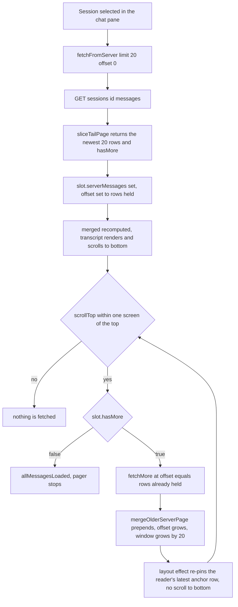
```mermaid
flowchart TD
  A["Session selected in the chat pane"] --> B["fetchFromServer limit 20 offset 0"]
  B --> C["GET sessions id messages"]
  C --> D["sliceTailPage returns the newest 20 rows and hasMore"]
  D --> E["slot.serverMessages set, offset set to rows held"]
  E --> F["merged recomputed, transcript renders and scrolls to bottom"]
  F --> G{"scrollTop within one screen of the top"}
  G -->|"no"| Z["nothing is fetched"]
  G -->|"yes"| H{"slot.hasMore"}
  H -->|"false"| K["allMessagesLoaded, pager stops"]
  H -->|"true"| I["fetchMore at offset equals rows already held"]
  I --> J["mergeOlderServerPage prepends, offset grows, window grows by 20"]
  J --> L["layout effect re-pins the reader's latest anchor row, no scroll to bottom"]
  L --> G
```

governs: /home/lyphe/.claude/claudecodeui_lyphe/server/shared/utils.ts

## MAN-362 — Prepending an older page
section: 04-message-store-and-lazy-loading/009 Pagination: the tail-page model/010 Prepending an older page

**RULE: the store hands back a count, and the view restores scroll from a node it captured
before the fetch. Neither side measures the other.**

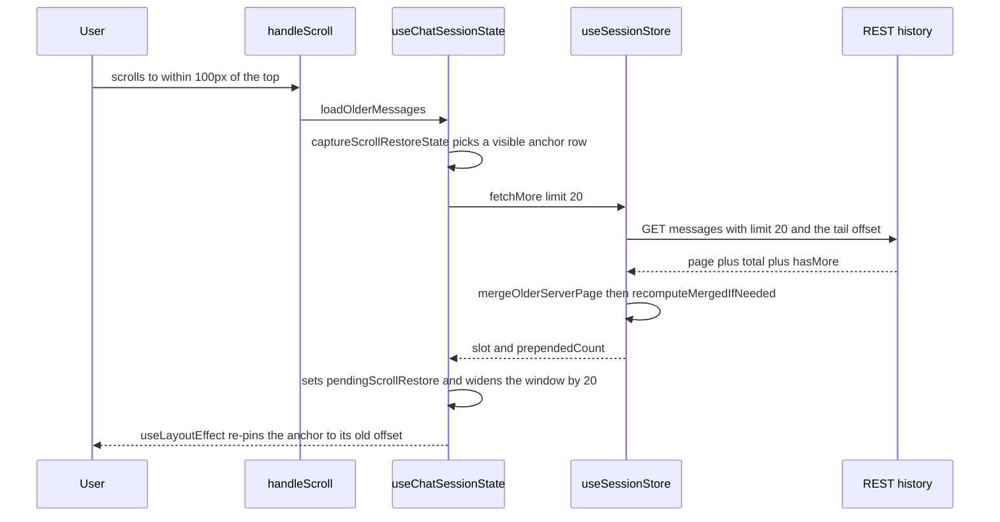
```mermaid
sequenceDiagram
  participant U as User
  participant SC as handleScroll
  participant VS as useChatSessionState
  participant ST as useSessionStore
  participant API as REST history

  U->>SC: scrolls to within 100px of the top
  SC->>VS: loadOlderMessages
  VS->>VS: captureScrollRestoreState picks a visible anchor row
  VS->>ST: fetchMore limit 20
  ST->>API: GET messages with limit 20 and the tail offset
  API-->>ST: page plus total plus hasMore
  ST->>ST: mergeOlderServerPage then recomputeMergedIfNeeded
  ST-->>VS: slot and prependedCount
  VS->>VS: sets pendingScrollRestore and widens the window by 20
  VS-->>U: useLayoutEffect re-pins the anchor to its old offset
```

`captureScrollRestoreState` records the first `.chat-message` whose bottom is at or below the
container top, plus its offset from the top. After the commit, the layout effect either
re-pins that anchor (`anchor.isConnected`) or falls back to a `scrollHeight` delta. See
[scrolling](./05-scrolling.md) for the full arbitration.

## MAN-363 — When the tail moves under you
section: 04-message-store-and-lazy-loading/009 Pagination: the tail-page model/011 When the tail moves under you

**RULE: two pages are only ever concatenated after a shared row has been found. No proof, no
concatenation — the cache is kept as it was.**

A tail-relative offset is only valid while `total` is stable, and a running turn appends rows
between the request and the response. All the proving is done by pure helpers in
`src/modules/chat/utils/sessionMessagePagination.ts`, so it is testable without a store.

| Helper | Question it answers |
| --- | --- |
| `messagesRepresentSamePersistedRow` | "Are these the same disk row?" Same `id` wins outright. Otherwise `provider`, `kind`, `timestamp` and `role` must all match, and then the first discriminator the pair has: `toolId`, else `rowid`, else `sequence`, else the full content tuple (`content`, `text`, `toolName`, `commandName`, `parentToolUseId`, serialized `toolInput`). The fallback exists because Codex mints fresh ids on every read. |
| `findLatestPageOverlapLength` | "How many rows of the cached suffix does this fresh tail page repeat?" Tries the longest candidate overlap first and returns the first length that matches row-for-row, or 0. |
| `mergeLatestServerPage` | Drops that overlapping suffix from the cache and appends the fresh page, so already-loaded older rows survive. **With overlap 0 it returns the cached array untouched** — that is the guard that keeps a disjoint window from being glued on. |
| `mergeOlderServerPage` | Mirror image: matches the *older* page's tail against the cache's *head*, prepends only the non-overlapping prefix, and reports `prependedCount`. |
| `planLatestPageBridge` | "The fresh tail page shares no row with my cache — what do I fetch next?" Offset is always `latestMessages.length + bridgeRowsFetched`. The first chunk's limit is `max(1, (nextTotal - previousTotal) - latestMessages.length - bridgeRowsFetched + 1)` — the rows the tail page did not carry, plus one to overlap on, never less than 1. Every later chunk asks for `SESSION_MESSAGES_PAGE_SIZE`. Returns `null` — meaning "no bridge needed or possible" — when either side is empty or an overlap already exists. |
| `hasReachedCachedTailTimeBoundary` | "Stop bridging." True once the fetched window's oldest row is at or older than the cached tail's newest row, because from there backwards no overlap can appear. |
| `resolveLatestPagePagination` | Settles pagination after a stitch. It returns both `offset` (the merged length) and `hasMore`, though the store reads only `hasMore` and assigns the offset itself. `hasMore` is the oldest fetched page's `hasMore` when the cache was empty, and `previousHasMore && oldestFetchedPageHasMore` otherwise — so a cache that had already reached the start of history stays at the start. |

`refreshLatestSlotFromServer` in `useSessionStore.ts` drives that loop, and it has three
shortcuts before any bridging happens: a page with `hasMore: false` is the authoritative whole
transcript and replaces the cache outright (this is also how a provider-side truncation gets
cleaned up), an empty cache simply takes the page, and a page that already overlaps needs no
bridge. Bridging aborts and keeps the cached suffix when `total` changes mid-loop
(`History changed while bridging`), or when a bridge chunk overlaps the window it should sit
before, or fails to chronologically precede it (`History shifted while bridging`).

`fetchMore` has the mirror defence: if the older page it just fetched overlaps the cache,
reports a different `total`, or does not chronologically precede the rows it would be
prepended to, it runs one bounded tail refresh and retries the older page once with the
corrected offset. Two attempts, then it gives up and prepends nothing.

---

governs: /home/lyphe/.claude/claudecodeui_lyphe/src/modules/chat/utils/sessionMessagePagination.ts

## MAN-364 — Server-side history
section: 04-message-store-and-lazy-loading/012 Server-side history

**RULE: one page request costs one `stat`, not one transcript parse.**

`sessionsService.fetchHistory` resolves the session row, returns an empty result when
`provider_session_id` is not set yet (first message still streaming), then asks
`sessionHistoryCache.getFullHistory` for the complete normalized transcript and slices the
requested page out of it with the same `sliceTailPage` the providers use. When the cache
returns `null` — an ineligible provider, or a transcript file that cannot be `stat`ed — the
provider's own `fetchHistory` is called with the requested `limit`/`offset` instead, and it
slices with that same helper. Either way the caller cannot tell which path served the page.

| Aspect | Behaviour |
| --- | --- |
| Key | App session id. |
| Validity | `transcriptPath` + `mtimeMs` + `size` from one `fsp.stat` per request. A mismatch re-parses. |
| Eligible providers | Claude and Codex only — they parse `session.jsonl_path` itself. Cursor (`store.db`) and OpenCode (shared SQLite) pass `transcriptPath: null` and bypass the cache, because the JSONL's stat says nothing about their history. |
| Budget | `MAX_CACHED_TRANSCRIPT_FILE_BYTES = 256 MB` of source-file bytes and `MAX_CACHE_ENTRIES = 8`, LRU by re-insertion. The newest entry is never evicted. |
| Concurrency | `pendingLoads` — concurrent requests for one session share a single parse. |
| Invalidation | None, by design. Anything that changes history (a turn, an edit, a rewind, a fork) touches the file, so the next `stat` misses. |

`sessions.service.test.ts` → *"history pages are sliced from the cached full transcript and see
appended rows"* is the test that pins this: page, append a row, re-read, and the newest page
reflects the append while an older page still honours the tail-offset contract.

Every returned row is re-stamped with the app session id before it leaves `fetchHistory`, so
the browser never sees a provider-native id.

Note what a page contains: every provider reduces its transcript to renderable rows **before**
slicing, so `total` counts renderable rows and a page of N rows is N rows the user sees.
Standalone `tool_result` rows are already gone — Claude and Codex drop them in
`prepareTranscriptMessages` (which also unifies ask-tool calls, collapses consecutive checklist
snapshots and caps tool output), Cursor filters `kind === 'tool_result'` itself, and OpenCode's
normalizer never emits one. This does not hold for live frames — see
[the realtime stream](./02-realtime-stream.md).

---

## MAN-365 — Row-level laziness
section: 04-message-store-and-lazy-loading/013 Row-level laziness

**RULE: the wrapper element is permanent; only its children come and go.**

`ChatMessagesPane.tsx` creates one observer with `useLazyRowObserver(scrollContainerRef)` and
wraps every rendered row — a `MessageComponent` or a `ToolGroupContainer` — in a
`LazyMessageRow`.

Three constants shape it, all listed under [the numbers](#the-numbers). Two details about them
are easy to get wrong. `INITIAL_MOUNTED_TAIL_ROWS` is counted over the *grouped* list, so a
collapsed tool group of nine calls spends one of the thirty. And `LAZY_ROW_VIEWPORT_MARGIN_PX`
is a `rootMargin` of `1200px 0px` on the scroll container, so the band is 1200 px above *and*
below the visible area, not 1200 px total.

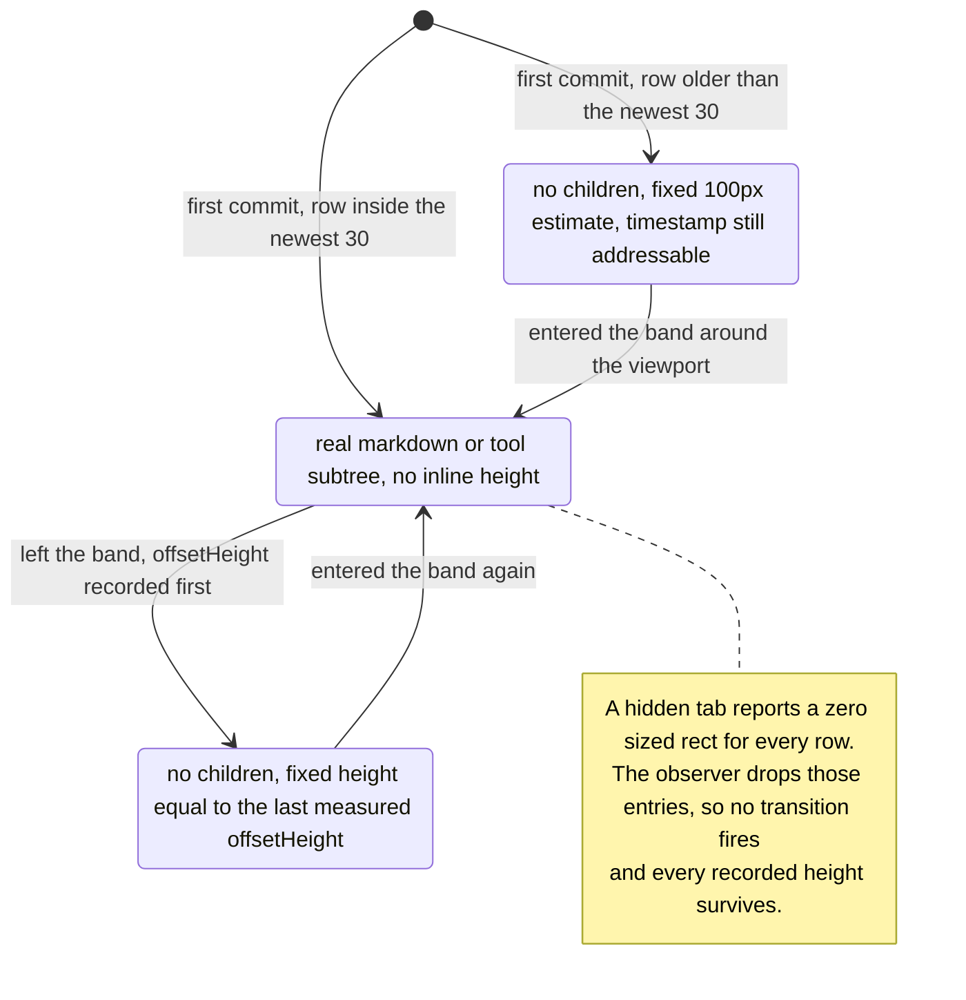
```mermaid
stateDiagram-v2
    [*] --> Placeholder: first commit, row older than the newest 30
    [*] --> Mounted: first commit, row inside the newest 30
    Placeholder: no children, fixed 100px estimate, timestamp still addressable
    MeasuredPlaceholder: no children, fixed height equal to the last measured offsetHeight
    Mounted: real markdown or tool subtree, no inline height
    Placeholder --> Mounted: entered the band around the viewport
    Mounted --> MeasuredPlaceholder: left the band, offsetHeight recorded first
    MeasuredPlaceholder --> Mounted: entered the band again
    note right of Mounted
      A hidden tab reports a zero sized rect for every row.
      The observer drops those entries, so no transition fires
      and every recorded height survives.
    end note
```

Three details make this safe rather than jumpy:

- **Measure on the way out, not the way in.** `handleNearViewportChange` reads
  `elementRef.current.offsetHeight` while the content is still in the DOM, then flips to the
  placeholder. The placeholder occupies exactly the space the content did, so scrolling back
  through seen content changes no scroll geometry at all. A measurement of 0 is discarded, so
  a row that unmounts while it has no box keeps whatever height it had before.
- **The tail starts mounted.** `initiallyNearViewport` is
  `index >= rowCount - INITIAL_MOUNTED_TAIL_ROWS`, so the initial scroll-to-bottom measures
  real heights instead of estimates.
- **Zero-sized rects are ignored.** A hidden Chat tab (`display: none`) makes the observer
  report every row as non-intersecting with a `0×0` rect. The observer callback skips those
  entries entirely, so a row keeps both its mounted state and its recorded height; acting on
  them would re-measure the whole transcript on the next activation.

`useLazyRowObserver` returns `null` when `IntersectionObserver` is undefined (jsdom), and
`LazyMessageRow` treats `lazyRows === null` as "always mounted" — the pre-existing behaviour,
so component tests are unaffected.

`src/modules/chat/tests/lazyMessageRow.test.tsx` covers exactly these four behaviours:
*"starts far rows as an addressable placeholder instead of mounting content"*, *"unmounts to a
placeholder of the measured height and remounts when near again"*, *"ignores the zero-rect
non-intersections a hidden tab reports"*, and *"keeps every row mounted where
IntersectionObserver does not exist"*.

This layers on top of CSS containment, not instead of it: `.chat-message` in `src/index.css`
carries `contain: layout style paint` and `content-visibility: auto` with
`contain-intrinsic-size: auto 180px` — 240px for assistant rows, 96px for user, tool and error
rows — which lets a *mounted* off-screen row skip layout, paint and style. Note that
`.chat-message` is on the row's content, not on `LazyMessageRow`'s wrapper: an unmounted row
is a bare sized `div`, so it costs nothing to skip either way.

---

governs: /home/lyphe/.claude/claudecodeui_lyphe/src/index.css

## MAN-366 — The escape hatch
section: 04-message-store-and-lazy-loading/014 The escape hatch

**RULE: the store can always be forced to hold the whole transcript; the DOM does not have to
follow.**

`LoadAllMessagesOverlay.tsx` renders a sticky pill at the top of the pane, labelled
"Load all (N)" from `totalMessages`. The component is pure display; the visibility rules live
in `useChatSessionState`. It appears when `handleScroll` first sees `scrollTop < 100` with
`hasMoreMessages` still true and the transcript not yet fully loaded. It then fades out on a
2500 ms CSS animation matched by a 2500 ms timer that clears the flag — the animation is
suppressed while the load is actually running, so the spinner does not fade out from under
the user — and once the load finishes it swaps to a confirmation tick for another 2500 ms.

Three callers need the full array, and they differ only in what they do to the render window:

| Consumer | Path | Window |
| --- | --- | --- |
| "Load all" click | `loadAllMessages` → `fetchFromServer(limit: null)` | `visibleMessageCount = Infinity` — the user asked to see it. |
| Search jump | the search effect → `fetchFromServer(limit: null)` | Grown to at least `resolveSearchWindowSize` = `length - targetIndex + SEARCH_TARGET_CONTEXT_MESSAGES`; never shrunk, because the window is a `Math.max` against what was already showing. |
| Export | `loadFullTranscript` → `fetchFromServer(limit: null)` | Untouched. Export reads the returned array, never the DOM. |

Search needs it because a hit resolved by the sidebar may live in a page that was never
fetched, and `findSearchTargetIndex` resolves against the loaded transcript rather than the
DOM. Export needs it because otherwise exporting a long conversation silently produced a file
containing only its last page.

There is a fourth way the window grows, and it fetches nothing. Once `hasMoreMessages` is
false but the projected list is still longer than `visibleMessageCount`, `ChatMessagesPane`
shows a "showing last N" line with a "load earlier" link. It calls `loadEarlierMessages`,
which adds 100 to `visibleMessageCount`. That is the only widener that is not paired with a
fetch, because by then the store already holds everything.

## MAN-367 — Why the transcript is not virtualized
section: 04-message-store-and-lazy-loading/015 Why the transcript is not virtualized

**RULE: the transcript is bounded by cheaper mechanisms than windowing, and the scroll code
depends on rows staying in the DOM. Do not reach for a virtualizer without redoing both.**

This was assessed in full in `docs/architecture/virtualized-lists-assessment.md`, last
revised in `8622d228` (`git show 8622d228:docs/architecture/virtualized-lists-assessment.md`)
and superseded by this document. Its verdict was *no for the sidebar, not yet for the chat*.
The reasoning worth keeping:

1. **The list is already bounded twice** — a 100-row tail window plus
   `content-visibility: auto`, which is the browser's native version of what windowing buys.
   Now three times, with `LazyMessageRow`.
2. **The scroll machinery reads the DOM.** Anchor restore does
   `querySelectorAll('.chat-message')` + `getBoundingClientRect`, then checks
   `anchor.isConnected` and falls back to a `scrollHeight` delta. A virtualizer unmounts that
   node by design and turns `scrollHeight` into a synthetic spacer. Search jumps do the same
   through `[data-message-timestamp]`.
3. **Ctrl+F and cross-message selection would narrow to the viewport.** `content-visibility`
   subtrees are reachable by find-in-page in Chromium, Firefox and Safari; unmounted DOM is
   not. The assessment was careful about the size of this loss: the reachable range would go
   from the ~100-message window to roughly the viewport, not from "the whole transcript".
   `LazyMessageRow` pays a smaller version of the same price, and only for rows more than
   `LAZY_ROW_VIEWPORT_MARGIN_PX` away.
4. **The keys are not ready.** `getIntrinsicMessageKey` falls back to a
   `type-timestamp-toolName-content` hash for most rows, and the collision disambiguator
   counts occurrences over *this render's window* — so a prepend can change a row's key. A
   virtualizer's `getItemKey` needs keys that survive that.
5. **The one unbounded path was measured and did not justify it.** On the largest real
   transcript available (942 renderable messages, 13 MB of JSONL), "Load all" cost ≈1.3 s
   above idle baseline with no freeze. A 2000-row cap would never engage; a cap low enough to
   fire would truncate real conversations. And the search jump widens the same window without
   any cap, which it cannot be given, because the target must be inside the window for the
   jump to resolve.
6. **No virtualization library is installed**, even transitively — every candidate is a new
   dependency, and the assessment's capability claims about them were explicitly unverified.

The recorded conclusion was to attack per-row cost instead. `f537a3a9`
(*"perf(chat): mount transcript rows lazily so huge sessions stay light"*) is that work: with
a 29k-row fixture loaded in full, the tab holds ~112 MB with a few dozen mounted rows instead
of ~1 GB with seven thousand.

---

## MAN-368 — Gotchas and why the code looks like this
section: 04-message-store-and-lazy-loading/016 Gotchas and why the code looks like this

- **`useChatMessages.ts` contains no hook.** Its only export is `normalizedToChatMessages`.
  The hook that gets a view its list is `useChatSessionState`.
- **`tokenUsage` starts as `undefined`, not `null`.** Initialising it to `null` made "this
  provider reports no usage" indistinguishable from "no page has reported yet", so every
  history refresh overwrote the value fetched from the token-usage endpoint with a zero.
  Consumers check `!== undefined` before writing.
- **Realtime rows are not cleared on refresh, only pruned.** JSONL indexing lags `complete`.
  Clearing outright made the pane flash the empty "Continue your conversation" state.
- **`truncateAt` keeps exactly one replacement echo — the last.** A send that was refused
  leaves its echo behind, so a second attempt at the same message would otherwise survive the
  cut alongside the abandoned first and show the user both.
- **`replacesAfterRowCount` exists because a rewind re-stamps timestamps.**
  `removeOptimisticUserEchoes` starts scanning at that index, so an earlier turn with the same
  words ("yes", "continue", the typo being corrected) cannot retire the message the user just
  sent. `truncateAt` is the only place that knows how much history survived, so it stamps it.
- **`stream_delta` is handled twice.** For the viewed session the text is accumulated in a ref
  and flushed through `updateStreaming` every 100 ms; for a *non-viewed* session the raw frame
  is also `appendRealtime`d, so switching to it later shows the partial reply.
- **A dropped realtime row is silent.** `MAX_REALTIME_MESSAGES = 500` trims from the front. On
  a very long run the earliest live rows disappear from `realtimeMessages` — they come back
  from the tail refresh that follows `complete`.
- **`slot.offset` can exceed `slot.total`.** The pagination test *"offset counts loaded
  persisted rows even when renderable total excludes tool results"* pins this: offset counts
  rows held, `total` counts what a provider reported, and the two are not always the same
  number.
- **The bridge exists because one turn can add more than a page.** Add 20+ rows in a single
  turn and the fresh 20-row tail page shares no row with the cached suffix, so there is
  nothing to stitch it to. `planLatestPageBridge` closes the gap: `nextTotal - previousTotal`
  says how many rows appeared, so the first chunk asks for exactly the ones the tail page did
  not carry, plus one row to overlap on. That prediction is only a lower bound: the test's own
  worked example has Claude reporting 15 additions to `total` for a turn that put 25 rows into
  the merged window. So when the first chunk still does not overlap, later chunks step
  20 at a time, and `hasReachedCachedTailTimeBoundary` stops the walk once the fetched rows
  reach back to or past the cached tail's newest timestamp (a rewritten transcript would
  otherwise be walked to its start). The test *"tool-result totals walk bounded bridge chunks
  until a contiguous anchor"* is that whole sequence.
- **Upward paging is bounded by distance, not by a latch.** A latch that waits for the reader
  to move away from the top strands them there whenever a page adds little on screen ("Show
  work" off). Paging runs only within a screen of the top, and every prepend moves the reader
  down by what it added.
- **Hidden tabs never fetch.** `canRequest` returns false, the coordinator marks the session
  dirty, and activation flushes exactly one request (`6e8d4087`). An initial page load
  supersedes a pending refresh for an unhydrated slot via `discardPending`.
- **The history cache has no invalidation API on purpose.** Every mutation path already
  touches the transcript file, so the `stat` comparison covers all of them; an explicit hook
  would be one more thing to forget to call.
- **The store keys sessions directly, with no alias table.** The app session id is allocated by
  `POST /api/providers/sessions` before the first send — see
  [conversation handoff](./03-conversation-handoff.md) — so nothing downstream re-keys a slot.
- **A fold the reader set by hand cannot live inside the row.** The row's whole subtree
  unmounts once it leaves the 1200 px band, so `useState` holding an open-or-closed flag is
  forgotten the moment the reader scrolls past it and comes back — and the row returns shorter
  than the placeholder that stood in for it. Anything the reader toggled therefore lives in a
  module-level store outside the component, and there are three: `CollapsibleUserText`'s
  `openedTurns` Set, keyed by the turn's anchor id; `transcript/shapes/collapseState.ts`'s
  Map, keyed by a hash of the block's own text rather than by a message id — one reply carries
  three different ids before it settles, synthetic then finalised then persisted ([the realtime
  stream](./02-realtime-stream.md) §"Text streaming"), while the text the reader folded does not
  change at all; and `transcript/shapes/TabbedCode.tsx`'s `chosenTabs` Map, which remembers the
  tab a code group last showed under the same content-addressed key as its fold.
  All three are written only by a click, so they grow with human effort rather than with
  transcript length and none needs eviction.
- **The observer's `root` is captured on the first `observe`, not on every render.**
  `useLazyRowObserver` builds the `IntersectionObserver` lazily inside `observe` and keeps it
  until the hook unmounts, and it returns an identity-stable `{ observe }` object. Without
  that stability every row's observe effect would re-run on every render, re-registering a
  few thousand elements per commit. The consequence to know: swapping the scroll container
  element under a live pane would leave the observer rooted at the old one.
- **A refused `fetchFromServer` and a failed one look different on purpose.** A refusal
  returns `null` with `status: 'idle'`; a failure returns the slot with `status: 'error'`.
  The search-jump effect keys off the `null` to re-arm itself for the next activation, which
  it must not do for a genuine network error.

## MAN-369 — If you change this, check that
section: 04-message-store-and-lazy-loading/017 If you change this, check that

| If you touch | Also check |
| --- | --- |
| `sliceTailPage` | All four provider `fetchHistory` implementations, `sessionsService.fetchHistory`, and every client helper in `sessionMessagePagination.ts` — they all assume tail-relative offsets. |
| `SESSION_MESSAGES_PAGE_SIZE` | It is five things at once: the session-open limit, `fetchMore`'s limit, `latestRefreshExecutorRef`'s tail-refresh limit, `planLatestPageBridge`'s later-chunk limit, and the window growth in `loadOlderMessages`. Change it and re-read the bridge tests, whose fixtures are built around 20. |
| `computeMerged` / `dedupeAdjacentAssistantEchoes` | `sessionStoreTruncate.test.tsx` and `sessionMessageReconciliation.test.ts`; the edit/replacement ordering is asserted there. |
| Any mutator | It must assign a **new** `serverMessages`/`realtimeMessages` array rather than mutating one in place, or `recomputeMergedIfNeeded` sees unchanged references and skips the recompute. |
| `normalizedToChatMessages` | The `WeakMap` projection cache invalidation keys, and `useChatMessages.test.ts` which pins object reuse across prepends and streaming. |
| `LazyMessageRow` / `useLazyRowObserver` | Search jumps, which address rows by `data-message-timestamp` on the permanent wrapper; scroll anchor restore, which selects `.chat-message` inside the *mounted* content ([scrolling](./05-scrolling.md)); and the three module-level stores that exist only because a row's subtree unmounts — `CollapsibleUserText`, `transcript/shapes/collapseState.ts` and `TabbedCode`'s `chosenTabs`. |
| `INITIAL_MOUNTED_TAIL_ROWS` | The initial scroll-to-bottom, which relies on the newest rows having real measured heights. |
| The history cache's key or validity check | `sessions.service.test.ts` and the Cursor/OpenCode bypass — their history does not live in `jsonl_path`. |
| `prepareTranscriptMessages` | The live-vs-history divergence documented in [the realtime stream](./02-realtime-stream.md) and the tool grouping in [the tool view](./06-tool-view.md). |
| `truncateAt` or `replacesAnchorId` | `history_truncated` emission order in the gateway ([websocket transport](./01-websocket-transport.md)) and `removeOptimisticUserEchoes`. |
| `visibleMessageCount` or who writes it | All four writers: `INITIAL_VISIBLE_MESSAGES` on session change, `+SESSION_MESSAGES_PAGE_SIZE` on prepend, `Infinity` on "Load all", `Math.max` with `resolveSearchWindowSize` on a search jump, plus `loadEarlierMessages` stepping 100. A shrink anywhere can scroll the transcript out from under the user. |
| `messagesRepresentSamePersistedRow` | Every other helper in `sessionMessagePagination.ts` — all overlap detection funnels through it, so loosening it silently glues unrelated pages together and tightening it turns every refresh into a full bridge walk. |

## MAN-370 — Scrolling
section: 05-scrolling/000

*Where the transcript sits, who is allowed to move it, and the rules that stop the app from
fighting the user. Paging and row mounting are covered in
[the message store and lazy loading](./04-message-store-and-lazy-loading.md).*

## MAN-371 — In one paragraph
section: 05-scrolling/001 In one paragraph

The transcript is one scrolling `div`, and five separate pieces of code write its
`scrollTop`. There is no scroll controller and no state machine: the writers are
coordinated by a handful of refs that each one checks before acting. The shared truth is
`isUserScrolledUp` — `false` means "the user is parked at the bottom, keep them there",
`true` means "the user is reading, do not move them" — and it is recomputed only from
`scroll`, `wheel` and `touchmove`, never from a height change. Every deferred automatic
scroll re-reads that intent through `isUserScrolledUpRef` at the moment it fires, because
the value it was armed with may be seconds stale. Everything else — the settle after
opening a session, the position restore after older history is prepended, the jump to a
search hit — stakes a temporary claim in a ref that tells the other writers to stand down
until it is finished. The test file says it plainly: *"The transcript's scroll position is
written from five places coordinated by refs and timers rather than by one owner"*
(`src/modules/chat/tests/transcriptScrollOwnership.test.tsx`).

## MAN-372 — Mental model
section: 05-scrolling/002 Mental model

1. **One element owns the transcript position.** The `div.chat-messages-pane` rendered by
   `src/modules/chat/transcript/ChatMessagesPane.tsx`. A few rows contain their own capped
   scrollers (bash output, file lists, question panels) — those never move the transcript,
   and their native `scroll` events do not bubble, so they never reach `handleScroll`.
2. **The pane component holds no scroll state.** It takes `scrollContainerRef`, `onWheel`
   and `onTouchMove` as props. Every write to `scrollTop`, every threshold and every claim
   ref lives in `src/modules/chat/hooks/useChatSessionState.ts`. If you are reading
   `ChatMessagesPane.tsx` looking for scroll logic, you are in the wrong file.
3. **`isUserScrolledUp` is the only shared decision, and it has exactly three readers.**
   The append-follow effect, the tab-reactivation branch of the `useLayoutEffect`, and the
   jump-to-bottom button in `ChatInterface.tsx`. Predict from it: if the flag is `true`,
   no automatic scroll happens, and the round arrow button is on screen.
4. **The flag is only recomputed from an input event.** `handleScroll` runs on `scroll`,
   `wheel` and `touchmove`, and applies one test — `scrollHeight - scrollTop - clientHeight
   < 50`. Content that grows *below* the fold does not move `scrollTop`, emits no event, and
   therefore leaves the flag stale.
5. **A deferred scroll must re-read intent at fire time.** `isUserScrolledUpRef` mirrors
   the state so a timer armed 50 ms or 200 ms ago can ask whether the user has scrolled
   away since. Adding a timed scroll without that check reintroduces the bug
   `transcriptScrollOwnership.test.tsx` exists to catch.
6. **The follow effect re-runs on three things, not one.** Its deps are
   `chatMessages.length`, `isUserScrolledUp` and `isLoadingMoreMessages`. So a new *row*
   re-follows; a streamed rewrite of an existing row does not; and the flag flipping back
   to `false` also arms a scroll, which is what snaps you the last few pixels when you
   scroll back down.
7. **A claim ref suppresses the other writers.** `pendingInitialScrollRef`,
   `pendingScrollRestoreRef`, `searchScrollActiveRef`, plus one latch at the top of the
   list, `wasNearTopRef`. A session change clears or re-arms all four in one effect, and
   drops `liveScrollStateRef` with them.
8. **Row geometry does not change behind the user's back.** Lazy rows keep their measured
   height when their content unmounts, React keys are derived from intrinsic message fields
   rather than object identity, and rows are never render-skipped, so a mounted row reports
   its real height from its first frame.

governs: /home/lyphe/.claude/claudecodeui_lyphe/src/modules/chat/hooks/useChatSessionState.ts, /home/lyphe/.claude/claudecodeui_lyphe/src/modules/chat/transcript/ChatMessagesPane.tsx

## MAN-373 — The pieces
section: 05-scrolling/003 The pieces

| File | Role |
| --- | --- |
| `src/modules/chat/hooks/useChatSessionState.ts` | Owns the scroll position. All five writers, `isNearBottom`, `handleScroll`, every claim ref, the search jump. |
| `src/modules/chat/transcript/ChatMessagesPane.tsx` | Renders the one scrolling element, binds the ref and the wheel/touch handlers it is handed, mounts the newest `INITIAL_MOUNTED_TAIL_ROWS` rows eagerly. |
| `src/modules/chat/ChatInterface.tsx` | Wires the hook to the pane, passes `handleScroll` as `onWheel`/`onTouchMove`, renders the jump-to-bottom button. |
| `src/modules/chat/hooks/useChatComposerState.ts` | `handleSubmit` clears `isUserScrolledUp` and scrolls to the bottom at +100 ms. |
| `src/modules/chat/transcript/LoadAllMessagesOverlay.tsx` | The "load all" pill that appears when the user reaches the top. |
| `src/modules/chat/transcript/LazyMessageRow.tsx` | Swaps a row's content for a placeholder of the same measured height, keeping an addressable wrapper. |
| `src/modules/chat/hooks/useLazyRowObserver.ts` | One `IntersectionObserver` per pane, rooted at the scroll container, `LAZY_ROW_VIEWPORT_MARGIN_PX = 1200`. |
| `src/modules/chat/utils/searchTargetLocator.ts` | `findSearchTargetIndex` resolves a sidebar hit against loaded data; `resolveSearchWindowSize` sizes the render window. |
| `src/modules/chat/utils/messageKeys.ts` | `getIntrinsicMessageKey` — stable render keys, so a prepend does not remount the rows below it. |
| `src/index.css` | `.chat-messages-pane` / `.chat-message` containment, mobile `touch-action`, document-level overscroll containment, `.search-highlight-flash`. |
| `src/modules/project-workspace/hooks/useVisualViewportKeyboardOffset.ts` | Publishes `--keyboard-height` so the shell shrinks above the iOS keyboard. |
| `src/shared/ui/ScrollArea.tsx` | **Not used by chat.** Every caller is a pane outside the transcript — `FileTree.tsx`, `SidebarContent.tsx`, `MemoryIntakePanel.tsx` and the Runner tab's `RunnerPanel.tsx`. Grep before trusting that list to be complete; the rule is the exclusion, not the roll call. |
| `src/modules/chat/tests/transcriptScrollOwnership.test.tsx` | Pins the two ownership bugs — the deferred scroll and the cross-session search jump. |
| `src/modules/chat/tests/lazyMessageRow.test.tsx` | Pins placeholder height and the hidden-tab zero-rect case. |
| `src/modules/chat/tests/searchTargetLocator.test.ts` | Pins snippet-first resolution, the timestamp fallback and the window size. |

governs: /home/lyphe/.claude/claudecodeui_lyphe/src/index.css, /home/lyphe/.claude/claudecodeui_lyphe/src/modules/chat/ChatInterface.tsx, /home/lyphe/.claude/claudecodeui_lyphe/src/modules/chat/hooks/useChatComposerState.ts, /home/lyphe/.claude/claudecodeui_lyphe/src/modules/chat/hooks/useChatSessionState.ts, /home/lyphe/.claude/claudecodeui_lyphe/src/modules/chat/hooks/useLazyRowObserver.ts, /home/lyphe/.claude/claudecodeui_lyphe/src/modules/chat/transcript/ChatMessagesPane.tsx, /home/lyphe/.claude/claudecodeui_lyphe/src/modules/chat/transcript/LazyMessageRow.tsx, /home/lyphe/.claude/claudecodeui_lyphe/src/modules/chat/transcript/LoadAllMessagesOverlay.tsx, /home/lyphe/.claude/claudecodeui_lyphe/src/modules/chat/utils/messageKeys.ts, /home/lyphe/.claude/claudecodeui_lyphe/src/modules/chat/utils/searchTargetLocator.ts, /home/lyphe/.claude/claudecodeui_lyphe/src/modules/project-workspace/hooks/useVisualViewportKeyboardOffset.ts, /home/lyphe/.claude/claudecodeui_lyphe/src/shared/ui/ScrollArea.tsx

## MAN-374 — Who writes `scrollTop`
section: 05-scrolling/003 The pieces/004 Who writes `scrollTop`

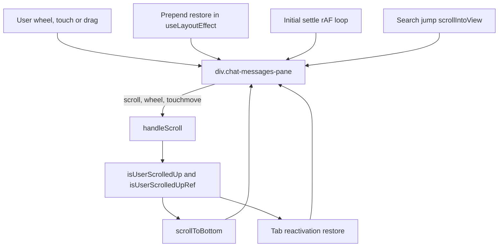
```mermaid
flowchart TD
  U["User wheel, touch or drag"] --> PANE["div.chat-messages-pane"]
  W1["scrollToBottom"] --> PANE
  W2["Prepend restore in useLayoutEffect"] --> PANE
  W3["Tab reactivation restore"] --> PANE
  W4["Initial settle rAF loop"] --> PANE
  W5["Search jump scrollIntoView"] --> PANE
  PANE -->|"scroll, wheel, touchmove"| HS["handleScroll"]
  HS --> FLAG["isUserScrolledUp and isUserScrolledUpRef"]
  FLAG --> W1
  FLAG --> W3
```

All five are in `useChatSessionState.ts`. A repo-wide grep for `scrollTop =`, `scrollTop +=`,
`scrollIntoView` and `scrollTo(` finds no other transcript writer — the remaining hits are the
composer's textarea highlight overlay and its own dropdown, the command menu, the sidebar's mobile
rename input, the mobile terminal's momentum scroller, and the file manager's preview pane, which
reveals a targeted line by writing two NAMED scrollers of its own rather than reaching for
`scrollIntoView` — the same discipline this page holds the transcript to, argued out for that pane
in [the file manager](../file-manager.md) §"The rules that bite".

## MAN-375 — The single scroll container
section: 05-scrolling/005 The single scroll container

**RULE: one element scrolls the transcript, and the component that renders it holds no
scroll state.**

`ChatMessagesPane` renders a positioned wrapper (`relative flex min-h-0 flex-1 flex-col`)
holding a single `div` with `ref={scrollContainerRef}`, `onWheel={onWheel}`,
`onTouchMove={onTouchMove}` and the classes
`chat-messages-pane relative min-h-0 flex-1 overflow-y-auto overflow-x-hidden`, then a
`max-w-[54.25rem]` inner column of rows. The wrapper exists only so the loading wheel can sit
over the scroller rather than inside it; the scroller keeps the full height. The export menu inside it is
`sticky right-4 top-3`, which is why it stays put while the list moves. The pane is
`memo`ised, and neither it, `MessageComponent`, nor any tool view reads or writes a scroll
offset.

**`flex-1` is the whole height rule: every `flex-none` sibling above the pane is height the
conversation loses.** Exactly one thing stands there — the CLI-version banner
([../cli-version.md](../cli-version.md)) — and by operator ruling 2026-09-09 nothing else may,
not a card, not a strip, not a chip. The plan-runner lane provoked it and keeps the reasoning
([../plan-runner.md](../plan-runner.md) §"The runner card"); what matters here is that the rule is
MEASURED and not merely written down. `.verify/phase-25.mjs`
reads the pane's height against its chat root, minus the composer below and the banner above, and
fails a new region above the transcript whatever that region is named.

Three row-level scrollers do exist — `BashCommandDisplay.tsx` (`max-h-80 overflow-auto`),
`FileListContent.tsx` and `AskUserQuestionPanel.tsx` (`max-h-48 overflow-y-auto`). They are
harmless: a native `scroll` event does not bubble, so the pane's `scroll` listener never
sees them. Their `wheel` and `touchmove` events *do* bubble into `handleScroll`, which
reads the pane's own `scrollTop`/`scrollHeight` and so simply re-measures the unchanged
transcript.

`src/shared/ui/ScrollArea.tsx` is a different component with a nested inner scroller and
`touchAction: 'pan-y'`. Chat does not use it. If you are debugging chat scrolling,
`ScrollArea` is a dead end.

**Why `onWheel` and `onTouchMove` sit next to a real `scroll` listener.** They look
redundant. The comment on the `ChatMessagesPane` call site in `ChatInterface.tsx` records
why they are not: a first page is `SESSION_MESSAGES_PAGE_SIZE = 20` rows, tool results fold
into their calls, and the "load earlier" link is hidden while more pages exist — so a short
transcript is often **not scrollable at all and never emits `scroll`**. Wheel and touch are
then the only way for the user to reach the top pager or the "load all" overlay.

governs: /home/lyphe/.claude/claudecodeui_lyphe/src/shared/ui/ScrollArea.tsx, /home/lyphe/.claude/claudecodeui_lyphe/.verify/phase-25.mjs

## MAN-376 — Staying at the bottom
section: 05-scrolling/006 Staying at the bottom

**RULE: the user is "at the bottom" when fewer than 50 px of content sit below the fold.**

`useChatSessionState.ts` → `isNearBottom` returns
`scrollHeight - scrollTop - clientHeight < 50`, and `false` when there is no container.
`handleScroll` calls it on every `scroll`, `wheel` and `touchmove` (after bailing out when
the Chat tab is inactive), writes `setIsUserScrolledUp(!nearBottom)`, and records the
current `{height, top}` into `scrollPositionRef` for the tab-reactivation restore. A
separate effect mirrors the state into `isUserScrolledUpRef` — an effect rather than an
assignment beside each setter, because `setIsUserScrolledUp` is also returned from the hook
and called by the composer.

**RULE: an append only scrolls when the user has not scrolled away, and it re-checks
before it moves.**

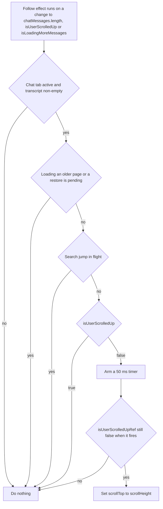
```mermaid
flowchart TD
  A["Follow effect runs on a change to chatMessages.length, isUserScrolledUp or isLoadingMoreMessages"] --> B{"Chat tab active and transcript non-empty"}
  B -->|"no"| Z["Do nothing"]
  B -->|"yes"| D{"Loading an older page or a restore is pending"}
  D -->|"yes"| Z
  D -->|"no"| E{"Search jump in flight"}
  E -->|"yes"| Z
  E -->|"no"| F{"isUserScrolledUp"}
  F -->|"true"| Z
  F -->|"false"| G["Arm a 50 ms timer"]
  G --> H{"isUserScrolledUpRef still false when it fires"}
  H -->|"no"| Z
  H -->|"yes"| I["Set scrollTop to scrollHeight"]
```

That is the whole auto-follow. Note what re-runs it. A new **row** re-follows; the 100 ms
streaming flushes that rewrite an existing row in place do not (see the gotchas). And
because `isUserScrolledUp` is a dependency, dropping back inside the 50 px band arms one
more scroll that finishes the trip to the bottom.

## MAN-377 — Follow and detached
section: 05-scrolling/006 Staying at the bottom/007 Follow and detached

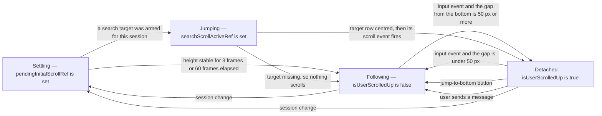
```mermaid
flowchart LR
  S["Settling — pendingInitialScrollRef is set"] -->|"height stable for 3 frames or 60 frames elapsed"| F["Following — isUserScrolledUp is false"]
  S -->|"a search target was armed for this session"| J["Jumping — searchScrollActiveRef is set"]
  F -->|"input event and the gap from the bottom is 50 px or more"| D["Detached — isUserScrolledUp is true"]
  D -->|"input event and the gap is under 50 px"| F
  D -->|"jump-to-bottom button"| F
  D -->|"user sends a message"| F
  J -->|"target row centred, then its scroll event fires"| D
  J -->|"target missing, so nothing scrolls"| F
  F -->|"session change"| S
  D -->|"session change"| S
```

`Settling` and `Jumping` are claims held in refs, not values of the flag. Note the last
`Jumping` edge: when a jump resolves to nothing, `searchScrollActiveRef` clears but the
initial settle has already been consumed, so the transcript stays wherever it rendered with
the flag still `false`.

## MAN-378 — Scrolling up mid-stream, and getting back
section: 05-scrolling/006 Staying at the bottom/008 Scrolling up mid-stream, and getting back

**RULE: the only ways back are explicit — scroll down, press the button, or send a
message.**

While `isUserScrolledUp` is true, `ChatInterface.tsx` renders one round `ArrowDownIcon`
button floating just above the composer, gated on `isUserScrolledUp && chatMessages.length > 0`.
There is **no unread count and no new-message indicator**; the button is the whole
affordance.

Its handler is `scrollToBottomAndReset`, not `scrollToBottom`. The difference matters: when
`allMessagesLoaded` is set (the user pulled the whole transcript in), it also drops
`visibleMessageCount` back to `INITIAL_VISIBLE_MESSAGES = 100` and clears
`allMessagesLoaded`. Jumping to the bottom throws away the widened render window on
purpose — the window only existed to reach something far up.

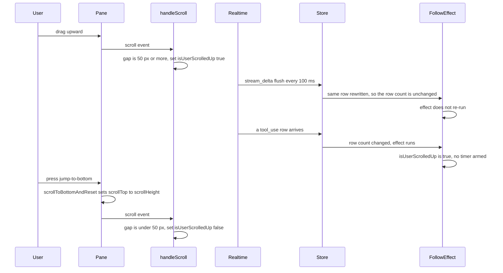
```mermaid
sequenceDiagram
    participant U as User
    participant P as Pane
    participant H as handleScroll
    participant W as Realtime
    participant S as Store
    participant E as FollowEffect

    U->>P: drag upward
    P->>H: scroll event
    H->>H: gap is 50 px or more, set isUserScrolledUp true
    W->>S: stream_delta flush every 100 ms
    S->>E: same row rewritten, so the row count is unchanged
    E->>E: effect does not re-run
    W->>S: a tool_use row arrives
    S->>E: row count changed, effect runs
    E->>E: isUserScrolledUp is true, no timer armed
    U->>P: press jump-to-bottom
    P->>P: scrollToBottomAndReset sets scrollTop to scrollHeight
    P->>H: scroll event
    H->>H: gap is under 50 px, set isUserScrolledUp false
```

## MAN-379 — Deferred scrolls re-check intent
section: 05-scrolling/009 Deferred scrolls re-check intent

**RULE: a scroll armed on a timer must re-read `isUserScrolledUpRef` before it moves
anything.**

| Where | Delay | Re-checks? |
| --- | --- | --- |
| Append follow effect (`useChatSessionState.ts`) | 50 ms | yes — `if (!isUserScrolledUpRef.current)` |
| External-update refresh (same file, the `externalMessageUpdate` effect) | 200 ms | yes — same guard, and only armed when `isNearBottom()` held before the refetch |
| Composer send (`useChatComposerState.ts` → `handleSubmit`) | 100 ms | **no** — it sets the flag false itself, then calls `scrollToBottom()` unconditionally |

The first two used to fire unconditionally. Commit `a1a42774` describes the failure:
scrolling up inside the delay was silently undone, and because a programmatic scroll itself
emits a `scroll` event, the resulting `handleScroll` reset `isUserScrolledUp` to false and
hid the jump-to-bottom button too. The user was returned to the bottom *and* lost the
control that would have explained why.

`transcriptScrollOwnership.test.tsx` pins both directions on fake timers, driving the real
hook against a hand-built container (jsdom has no layout, so `scrollHeight`/`clientHeight`
are stubbed and `scrollTop` writes are recorded):

- *"does not yank the view back down when the user scrolls up inside the delay"* — appends
  a row, flips the flag, advances 200 ms, asserts **zero** writes.
- *"still sticks to the bottom when the user has not scrolled away"* — same setup without
  the flip, asserts a write of `scrollHeight`.

The test stubs `requestAnimationFrame` to a no-op on purpose: the initial-settle loop is a
separate writer that would otherwise satisfy an assertion meant for the timer.

The composer send is deliberately unguarded — the user pressed Enter, so the intent is
fresh. The cost is that scrolling up within 100 ms of sending is undone.

## MAN-380 — Reaching the top: the pager, the lock and the overlay
section: 05-scrolling/010 Reaching the top: the pager, the lock and the overlay

**RULE: older history is requested a screen before the top, so it is in place before the
reader arrives. The load-all overlay still marks arriving at the top 100 px.**

The second half of `handleScroll` computes `scrolledNearTop = container.scrollTop < 100` for
the overlay latch, and requests the next page whenever `scrollTop < clientHeight`.

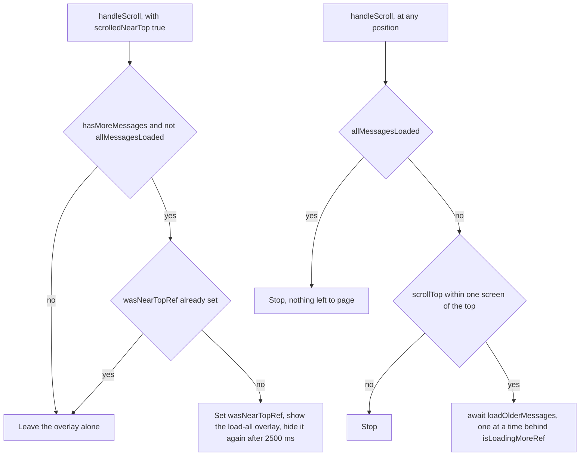
```mermaid
flowchart TD
  A["handleScroll, with scrolledNearTop true"] --> B{"hasMoreMessages and not allMessagesLoaded"}
  B -->|"no"| C["Leave the overlay alone"]
  B -->|"yes"| D{"wasNearTopRef already set"}
  D -->|"yes"| C
  D -->|"no"| E["Set wasNearTopRef, show the load-all overlay, hide it again after 2500 ms"]
  P["handleScroll, at any position"] --> F{"allMessagesLoaded"}
  F -->|"yes"| G["Stop, nothing left to page"]
  F -->|"no"| H{"scrollTop within one screen of the top"}
  H -->|"no"| I["Stop"]
  H -->|"yes"| J["await loadOlderMessages, one at a time behind isLoadingMoreRef"]
```

- **`wasNearTopRef`** debounces the overlay so it appears once when the user arrives at the
  top, not on every scroll event there. It is cleared as soon as `scrolledNearTop` goes
  false. The 2500 ms hide timer in the hook is matched by the overlay's own
  `loadAllOverlayAutoFade 2500ms` animation in `LoadAllMessagesOverlay.tsx`, so the pill
  fades out exactly as the state clears.
- **Paging is bounded by distance, not by a latch.** With "Show work" (or another transcript switch) off a page can add
  almost nothing on screen, so a latch that waits for the reader to move away from the top
  would strand them there. The run only happens within a screen of the top, each prepend
  moves `scrollTop` down by what it added, and a page that brings nothing back ends it. A
  restore's own `scroll` event can chain the next page; that is intended, and it stops once a
  screen of history sits above the view.

`loadAllMessages` (the overlay's button) takes a different path: it fetches the whole
transcript with `limit: null`, sets `visibleMessageCount` to `Infinity`, captures a scroll
anchor first, and shows a green "all loaded" pill for 2500 ms.

## MAN-381 — Restoring position after a prepend
section: 05-scrolling/011 Restoring position after a prepend

**RULE: prepending rows must not move content under the user's eyes. Position is restored
from an anchor element, not from a scroll offset.**

`loadOlderMessages` calls `captureScrollRestoreState(container)` *before* the fetch. That
records four things: `scrollHeight`, `scrollTop`, an anchor element, and that anchor's
offset from the container's top edge. The anchor is the first `.chat-message` whose
`getBoundingClientRect().bottom` is at or past the container's top edge — in plain terms,
the topmost row that is not entirely scrolled off.

The captured state is parked in `pendingScrollRestoreRef` **before** the fetch, stamped with
`armedOldest` (the oldest rendered message), so the commit that adds the rows is the one
restored even when the store renders them before the `await` returns. A `useLayoutEffect` —
before paint — drains it on the first commit whose oldest rendered message differs, and it
restores to **`liveScrollStateRef`**, which `handleScroll` refreshes on every scroll event, not
to the fetch-time capture, because that capture would undo every wheel step taken while the
page is in flight and snap the reader back down the chat. A load that prepends
nothing clears the armed restore in its `finally`, and `visibleMessageCount` is in the effect's
dependencies because a prepend can reach the screen by widening the window alone. After a
prepend `visibleMessageCount` grows by `SESSION_MESSAGES_PAGE_SIZE`. The correction:

| Case | Correction |
| --- | --- |
| Anchor still in the DOM (`anchor.isConnected`) and its offset was recorded | `scrollTop += newAnchorOffset - oldAnchorOffset` |
| No anchor, or it is gone | `scrollTop = oldTop + max(newScrollHeight - oldHeight, 0)` |

The anchor path is the accurate one; the height-delta path is the fallback. What keeps the
anchor alive across the prepend is **stable keys**: `ChatMessagesPane` builds a
`messageKeyMap` each render from `getIntrinsicMessageKey`, disambiguated by occurrence index
on collision. Its comment states the reason — a server refresh replaces source records with
equivalent new objects, so object identity is not a durable React key across pagination or
hydration. The key falls back through `id`, `messageId`, `toolId`, `toolCallId`, `blobId`,
`rowid`, `sequence`, and only then to a timestamp-plus-content-prefix string.

The same mechanism is reused by `loadAllMessages`. While `pendingScrollRestoreRef` is set,
the append-follow effect declines outright — a prepend must never be mistaken for an
append — and the restore branch of the `useLayoutEffect` returns early, so a pending restore
also beats the tab-reactivation restore in the same commit.

## MAN-382 — Opening a session, switching, and coming back
section: 05-scrolling/012 Opening a session, switching, and coming back

**RULE: each programmatic scroll stakes a claim, and every other writer checks it.**

| Trigger | Mechanism | Claim ref |
| --- | --- | --- |
| Opening a session | rAF settle loop | `pendingInitialScrollRef` |
| Returning to the Chat tab | `useLayoutEffect` reactivation branch | — |
| Older page prepended | `useLayoutEffect` restore branch | `pendingScrollRestoreRef` |
| Short screen filled while at the bottom | rAF settle loop, re-armed | `pendingInitialScrollRef` |
| Sidebar search hit | `scrollIntoView` retry chain | `searchScrollActiveRef` |
| Expanding a tool view | nothing — pure layout change | — |

## MAN-383 — Opening a session
section: 05-scrolling/012 Opening a session, switching, and coming back/013 Opening a session

A single `scrollToBottom()` at +200 ms used to be enough. It is not: markdown blocks, code
highlighting and images finish rendering after that window, `scrollHeight` grows, and
nothing re-anchors — the tab opens visually "scrolled way up" with the newest assistant
message off screen. The current effect runs a `requestAnimationFrame` loop that sets
`scrollTop = scrollHeight` **every frame**, counting frames and consecutive stable heights;
it stops at **3 consecutive stable frames or 60 frames (~1 s)**, whichever comes first, and
then clears `pendingInitialScrollRef`. It is a layout effect whose first step runs before
paint, so an opened chat never paints at its oldest rows and then jumps; an empty list does
not disarm it, because on a switch the list is empty for one render before the loading flag
is set. While it runs, the scroll-up pager stands down — the settle loop owns the scroll.

**The chat appears whole.** From the session-change effect until the settle loop finishes,
`isOpeningSession` is true: `ChatMessagesPane` keeps the row column laid out but at
`opacity-0` (so the loop measures real heights and pins the bottom unseen) and draws a loading
wheel over the scroller. The wheel's CSS holds it back 150 ms (`chat-loading-appear`), so a
quick switch to an already-loaded chat never flashes it; the column then fades in over 150 ms,
already at the bottom. The state also clears when the chat turns out empty (a hydrated or
freshly loaded slot with no rows), when the load fails, when a search jump takes over the
settle, and after `OPENING_REVEAL_CAP_MS = 8000` as a guard against a load that never ends. The loop is cancelled by the effect's own cleanup
calling `cancelAnimationFrame`; the session-change effect *re-arms*
`pendingInitialScrollRef` to `true` rather than clearing it.

It is helped by `INITIAL_MOUNTED_TAIL_ROWS = 30` in `ChatMessagesPane.tsx`: the newest 30
rows mount with real content on the first commit, so the loop measures real heights at the
bottom rather than placeholder estimates.

The loop declines entirely if `searchScrollActiveRef` is set — a session opened from a
search hit is not supposed to land at the bottom.

**Filling a short screen.** A 20-row page with "Show work", thinking or the compaction summary off can leave one
reply and nothing to scroll, so `fillViewportWithHistory` (asked by `ChatMessagesPane` after
every commit; see [the message store](./04-message-store-and-lazy-loading.md)) loads older
history until the transcript overflows by 200 px. While the reader has not scrolled up it
passes `pinToBottom`, and `loadOlderMessages` **re-arms `pendingInitialScrollRef`** instead
of setting `pendingScrollRestoreRef`: the older page lands above and the settle loop keeps
the newest reply in view. An anchor restore there would pin a row near the top and let the
tail drift off screen as the prepended rows change the heights below it. `visibleMessageCount` is
in the loop's dependencies so a fill that only widens the window re-runs it too.

## MAN-384 — Switching sessions
section: 05-scrolling/012 Opening a session, switching, and coming back/014 Switching sessions

The session-change effect (keyed on `selectedProject?.projectId` and `selectedSession?.id`)
clears the pending search timer, clears `searchScrollActiveRef` and `searchTarget`, nulls
`pendingScrollRestoreRef` and `liveScrollStateRef`, clears `wasNearTopRef`, re-arms
`pendingInitialScrollRef`, resets `visibleMessageCount` to `INITIAL_VISIBLE_MESSAGES`, and
sets `isUserScrolledUp` to false. Its comment records that ordering is load-bearing: the
effect that reads `__searchTargetSnippet` off the newly selected session runs *after* this
one, so a session opened *from* a search result re-arms immediately.

## MAN-385 — Returning to the Chat tab
section: 05-scrolling/012 Opening a session, switching, and coming back/015 Returning to the Chat tab

The chat tree stays mounted behind Tailwind's `hidden` (`display: none`) when another
workspace tab is active (`WorkspaceMain.tsx`, which also passes `isActive`). An effect with
no dependency array records `{height, top}` into `scrollPositionRef` after every render
while the tab is active, and the `useLayoutEffect` reactivation branch — recognised through
`wasChatActiveRef` — restores `scrollPositionRef.current.top` when detached, or
`container.scrollHeight` when following. Hidden tabs must not reset pagination or scroll:
`handleScroll`, the restore branch and the settle loop all bail out on `!isActive`.

## MAN-386 — Jumping to a search hit
section: 05-scrolling/016 Jumping to a search hit

**RULE: resolve the target in the data first; only then look for its row, and only ever by
exact timestamp until the final try.**

The sidebar (`Sidebar.tsx`, `onConversationResultClick`) puts `__searchTargetSnippet` and
`__searchTargetTimestamp` on the selected session object. The jump then:

1. Sets `searchScrollActiveRef` — the initial settle and the append-follow both stand down.
   The arming effect requires a non-empty snippet string; without one there is no jump.
2. Fetches the **entire** transcript into the store (`limit: null`) so an old hit is
   reachable, without rendering all of it.
3. Resolves the index against the loaded data, not the DOM:
   `searchTargetLocator.ts` → `findSearchTargetIndex`. The snippet is authoritative —
   normalised, ellipsis-stripped, lower-cased, `MIN_SNIPPET_LENGTH = 10`,
   `MAX_SNIPPET_LENGTH = 80`, matched against `displayText`, `content`, string `toolInput`
   and string tool-result content. **Only if the snippet misses** does the timestamp take
   over, and it returns the *nearest* message by time, not an exact match. `-1` — and
   therefore no scroll at all — happens only when the snippet misses *and* there is no
   finite timestamp. `searchTargetLocator.test.ts` pins both halves: *"a snippet that
   matches nothing reports a miss instead of guessing"* and *"the timestamp is only a
   fallback when the snippet misses"*.
4. Widens the render window with
   `resolveSearchWindowSize(count, index, SEARCH_TARGET_CONTEXT_MESSAGES = 20)`, applied as
   `Math.max(previous, required)` so the window never shrinks. `visibleMessages` is a tail
   slice, so covering index N means rendering everything after it.
5. Waits 150 ms for React to commit, then looks the row up by `data-message-timestamp` and
   calls `scrollIntoView({ block: 'center', behavior: 'smooth' })` plus a
   `search-highlight-flash` class removed after 4000 ms.

**The retry budget.** `SEARCH_SCROLL_RETRIES = 20` is the starting value of `retriesLeft`,
and there is a leading `setTimeout` before the first attempt, so the chain is **21 attempts
spaced `SEARCH_SCROLL_RETRY_DELAY_MS = 150` apart — about 3.15 s in total**. The budget is
that long because widening the window can commit thousands of rows that each run the
markdown pipeline.

**Why `allowNearest` exists.** `findRenderedMessageElement` is called with
`allowNearest = (retriesLeft === 0)`, so every attempt but the last accepts an **exact**
timestamp match only. The final attempt relaxes to nearest-by-time because a hit on the
second or later call inside a collapsed tool group has no row of its own:
`groupConsecutiveTools` stamps the group item with the **first** message's timestamp
(`toolGrouping.ts`), so the group row is the nearest match, never an exact one.

## MAN-387 — Expanding a tool view
section: 05-scrolling/016 Jumping to a search hit/017 Expanding a tool view

Nothing scrolls. There is no `scrollIntoView` anywhere under
`src/modules/chat/transcript/` or the tool renderers. Expansion is a layout change the
browser's own scroll anchoring absorbs; if the row later unmounts, `LazyMessageRow` records
the expanded height first.

## MAN-388 — Lazy rows and height stability
section: 05-scrolling/018 Lazy rows and height stability

**RULE: unmounting a row's content must not change the scroll geometry.**

`LazyMessageRow` wraps every transcript row in a permanent lightweight `div` carrying
`data-message-timestamp`. The expensive subtree mounts only while the row is within
`LAZY_ROW_VIEWPORT_MARGIN_PX = 1200` of the viewport, tracked by one shared
`IntersectionObserver` per pane rooted at the scroll container (`useLazyRowObserver.ts`).
One exception: a row the run is blocked on — a tool call the permission layer reports as
`waiting` — is `pinned` and stays mounted at any distance, because it holds the live answer
panel, whose half-made choices live in component state and would not survive the swap.

Three details exist purely to protect the scroll position:

1. **Measure before unmount.** `handleNearViewportChange` reads `offsetHeight` *while the
   content is still in the DOM*, then renders the placeholder at exactly that height. A row
   you have already seen costs nothing in geometry to scroll back through.
2. **The wrapper stays addressable.** The search jump queries `[data-message-timestamp]`,
   which the wrapper carries whether or not its content is mounted. **This does not extend
   to the prepend anchor:** `captureScrollRestoreState` queries `.chat-message`, and that
   class is on `MessageComponent` / `ToolGroupContainer`, *inside* the wrapper's children —
   so the anchor scan only ever picks a currently mounted row. It works in practice because
   the rows around the viewport are exactly the mounted ones.
3. **Zero-sized rects are ignored.** A hidden Chat tab (`display: none`) reports
   `isIntersecting: false` with a `0x0` rect. Treating that as "scrolled away" would wipe
   every row's mounted state and its measured height. `lazyMessageRow.test.tsx` pins this
   as *"ignores the zero-rect non-intersections a hidden tab reports"*.

Rows never yet measured fall back to `ESTIMATED_ROW_HEIGHT_PX = 100` and rely on the
browser's own scroll anchoring while they settle.

CSS contains each row but never skips rendering one (`src/index.css`):

```css
.chat-messages-pane { contain: layout style paint; }
.chat-message { contain: layout style paint; }
```

**RULE: no `content-visibility` on transcript rows.** A render-skipped row reports a stand-in
height until the browser draws it, a frame or more later. Every geometry reader here reads a
row on its first frame — the settle loop's stable-height check, the fill's does-it-fill-the-
screen check, `LazyMessageRow`'s measured height — so a stand-in there ends the settle loop
early, triggers an unneeded fill, and dips a remounted row, which pulls the rows below it into
and out of the band. Off-screen cost is `LazyMessageRow`'s job alone.

The repo **never sets `overflow-anchor`**, so the browser default (`auto`) stays in effect
for everything the JS does not explicitly restore — which is what absorbs a tool card
expanding or a code block finishing highlighting.

governs: /home/lyphe/.claude/claudecodeui_lyphe/src/index.css

## MAN-389 — Mobile, keyboard and CSS
section: 05-scrolling/019 Mobile, keyboard and CSS

**RULE: the document never scrolls; only the pane does.**

| Rule | File | Why |
| --- | --- | --- |
| `html, body { overflow: hidden; overscroll-behavior-y: contain; }` | `src/index.css` | The shell is a `fixed inset-0` container, so the document never needs to scroll. Clipping it removes the phantom full-height scrollbar and disables mobile pull-to-refresh. |
| `* { touch-action: manipulation; }` under `max-width: 768px` | `src/index.css` | Kills the 300 ms tap delay — and would kill scrolling, which is why the next two rules exist. |
| `.overflow-y-auto { touch-action: pan-y; -webkit-overflow-scrolling: touch; }` | `src/index.css` | Re-asserts vertical panning and momentum for the pane. |
| `.chat-message { touch-action: pan-y; }` | `src/index.css` | Same, for the rows themselves. |
| `--keyboard-height` from `visualViewport.resize` | `useVisualViewportKeyboardOffset.ts` | `ProjectWorkspaceShell.tsx` applies it as `style={{ bottom: 'var(--keyboard-height, 0px)' }}`, so the fixed shell shrinks above the iOS keyboard instead of being covered by it. |
| `@media (prefers-reduced-motion: reduce) { scroll-behavior: auto !important; }` | `src/index.css` | The only `scroll-behavior` declaration in the repo. Nothing sets `smooth` in CSS. |

`scrollToBottom` is an instant `scrollTop = scrollHeight` assignment. The only smooth scroll
in the transcript is the search jump's explicit `behavior: 'smooth'`.

The pane's bottom padding switches between `pb-12 sm:pb-14` and `pb-3 sm:pb-4` depending on
`hasActivityIndicator` — the composer's floating activity/stop tab overlaps the pane, so the
padding reserves space for it. That toggle changes the pane's usable height without emitting
a scroll event.

governs: /home/lyphe/.claude/claudecodeui_lyphe/src/index.css

## MAN-390 — Gotchas and why the code looks like this
section: 05-scrolling/020 Gotchas and why the code looks like this

- **Streaming text does not re-follow, but the first flush does.** `updateStreaming` in
  `useSessionStore.ts` writes a row with the well-known id `__streaming_<sessionId>`. The
  first flush appends it, so `chatMessages.length` changes once and the follow effect runs.
  Every flush after that replaces the same array slot, so the length is unchanged and the
  effect stays quiet. Within one streamed block the pane is held by the browser, not by this
  code.
- **`stream_end` does not re-follow either.** `finalizeStreaming` rewrites the same slot in
  place, changing only the id, `kind` and `role`; both `stream_delta` and an assistant
  `text` map to exactly one row in `normalizedToChatMessages`. The length never moves, so
  the effect does not re-run. What re-follows is the *next* row — a tool call, or the next
  streamed block, which allocates a fresh `__streaming_` id.
- **`isUserScrolledUp` can be stale.** It is only recomputed from `scroll`, `wheel` and
  `touchmove`. Content growing below the fold does not move `scrollTop`, so no event fires,
  the flag stays `false`, and the jump-to-bottom button stays hidden even though the newest
  content is off screen. Same for the keyboard opening and for the activity indicator's
  padding toggle.
- **A programmatic scroll emits a `scroll` event.** Every `scrollTop` write feeds back
  through `handleScroll` and rewrites the flag. That is why the deferred writers guard
  themselves — an unguarded write both moves the user *and* erases the evidence that they
  had scrolled away.
- **The pager cannot drain a long session in one gesture.** The restore after a prepend
  lands the reader near the top by design, but the zone is `scrollTop < clientHeight` and each
  prepend moves the reader down by what it added, so the chain stops once a screen of history
  is above them. It only runs long when the pages are mostly hidden work, which is the case
  it exists for.
- **`loadEarlierMessages` has no scroll restore.** It just does
  `setVisibleMessageCount(prev + 100)` on already-loaded messages, so `chatMessages.length`
  never changes and neither the follow effect nor the restore `useLayoutEffect` runs. Only
  the browser's native scroll anchoring holds the position there. `loadOlderMessages` and
  `loadAllMessages` both capture an anchor; this one does not.
- **A search jump left armed across a session change was visibly wrong twice.** The new
  session opened part-way up (the initial settle declines while a jump is pending), and then
  once the retries ran out and `allowNearest` engaged, it scrolled to an unrelated message
  in the *new* session and flashed the highlight on it.
  `transcriptScrollOwnership.test.tsx` → *"does not follow the user into the next session"*
  drives exactly that: it plants a session-B row in the container, lets the jump start
  retrying against session A, switches sessions, advances past the whole retry budget, and
  asserts zero `scrollIntoView` calls and zero `.search-highlight-flash` elements.
- **The nearest-row fallback is not laziness.** It was removed from the early attempts
  (commit `0a19ad8a`) because an uncommitted window made it scroll to an arbitrary message —
  the exact failure the rewrite was meant to remove. It survives on the final attempt only,
  because that is what maps a hit inside a collapsed tool group onto its group row.
- **The initial scroll is a loop, not a timeout.** One `scrollToBottom()` at +200 ms lost
  the race against late markdown, highlighting and image layout. The rAF loop with a
  3-stable-frame / 60-frame cap is the fix.
- **Lazy rows exist for memory, and pay for it in scroll correctness.** Commit `f537a3a9`:
  "Load all" on a long session used to commit thousands of markdown/tool subtrees at once and
  grow the tab toward a gigabyte. With the 29k-row fixture the tab now holds ~112 MB with a
  few dozen mounted rows instead of ~1 GB with seven thousand. Every geometry guarantee in
  `LazyMessageRow` — measure-before-unmount, permanent wrapper, zero-rect filter — exists to
  make that trade invisible.
- **`content-visibility: auto` is overridden for exports.**
  `src/modules/chat/export/buildTranscriptHtml.tsx` emits
  `.chat-message { content-visibility: visible !important; contain-intrinsic-size: auto !important; }`
  with the comment "off-screen skipping is a scrolling optimisation; in a printed document it
  leaves blank pages."
- **Where `IntersectionObserver` does not exist (jsdom), every row stays mounted.**
  `useLazyRowObserver` returns `null` and `LazyMessageRow` treats that as "always mounted".
  Tests that need the lazy path install a stub observer and drive it by hand.

governs: /home/lyphe/.claude/claudecodeui_lyphe/src/modules/chat/export/buildTranscriptHtml.tsx

## MAN-391 — If you change this, check that
section: 05-scrolling/021 If you change this, check that

| If you touch | Also check |
| --- | --- |
| The 50 px threshold in `isNearBottom` | The follow effect, the tab-reactivation branch and the jump-to-bottom button all read the same flag. |
| The one-screen (`clientHeight`) pager zone | Each prepend must still move the reader down by what it added (the anchor restore), or paging runs away. |
| `chatMessages` shape or identity | The follow effect and the restore/reactivation `useLayoutEffect` are both keyed on `chatMessages.length`; in-place row rewrites are invisible to both. |
| Anything that adds a deferred scroll | It must re-read `isUserScrolledUpRef` at fire time, or `transcriptScrollOwnership.test.tsx` should fail. |
| `getIntrinsicMessageKey` or the key map in `ChatMessagesPane` | The prepend restore needs the anchor element to survive; unstable keys remount rows and drop it to the height-delta fallback. |
| `LazyMessageRow` placeholder height, the `.chat-message` class placement, or the 1200 px observer margin | Prepend anchor scan, search-jump row lookup, and `lazyMessageRow.test.tsx`. |
| `SEARCH_SCROLL_RETRIES`, the retry delay, or `findRenderedMessageElement` | The cross-session cancellation test and `searchTargetLocator.test.ts`; `allowNearest` must stay on the final attempt only. |
| `.chat-message` containment or `content-visibility` | The export override in `buildTranscriptHtml.tsx` mirrors these declarations. |
| Session load or pagination in `useChatSessionState.ts` | `pendingScrollRestoreRef`, `liveScrollStateRef`, `pendingInitialScrollRef`, `searchScrollActiveRef` and `wasNearTopRef` are all handled by the session-change effect — see [the message store](./04-message-store-and-lazy-loading.md). |
| Composer send or the activity indicator | `handleSubmit` forces `isUserScrolledUp` false and scrolls unconditionally at +100 ms; the indicator changes the pane's padding without a scroll event. |
| Tool card expand/collapse | Nothing scrolls today — see [tool views](./06-tool-view.md). Adding a `scrollIntoView` there adds a sixth writer with no claim ref. |

Related: [the realtime stream](./02-realtime-stream.md) for how rows arrive.

## MAN-392 — In one paragraph
section: 06-tool-view/000 In one paragraph

A provider says a tool ran by sending a `tool_use` frame and, later, a `tool_result` frame.
This subsystem turns that pair into one card in the transcript: a command row, a diff, a
checklist, a file list, a subagent timeline. What a tool looks like is not a conditional in
a component. It is one entry in a registry keyed by the tool's name, and `ToolRenderer`
switches on that entry. The hard parts are not the drawing. They are pairing a call with a
result that arrives seconds later, deciding what to show in between, collapsing runs of the
same tool into one row, and nesting a running subagent's calls inside the row that spawned
it.

Read [the realtime stream](./02-realtime-stream.md) first for how the frames arrive, and
[the message store](./04-message-store-and-lazy-loading.md) for what `merged` means.

## MAN-393 — Mental model
section: 06-tool-view/001 Mental model

1. **One call is one row.** `normalizedToChatMessages` folds a `tool_result` onto its
   `tool_use` by `toolId` before any component runs. A standalone result renders as its own
   row only when it has no `toolId` at all; a result whose `toolId` matches nothing loaded
   is dropped, not drawn.
2. **The tool's name is the only lookup key, and the lookup is exact.**
   `getToolConfig(name)` returns `TOOL_CONFIGS[name]` or `TOOL_CONFIGS.Default`. So an
   unmapped tool always renders as a closed collapsible whose title is a summary of its
   input, and `mcp__github__create_pr` never matches anything but `Default`.
3. **`ToolRenderer` draws one side of one row per call, at most twice.** `mode="input"`
   reads `config.input`, `mode="result"` reads `config.result`. `MessageComponent` makes
   both calls; `SubagentPanel` makes only the `mode="input"` one.
4. **Status is a pure function of two values.** `deriveToolStatus(toolResult,
   reportedStatus)` checks the provider-reported lifecycle first, then falls back to the
   presence of a result. It is computed only on `mode === 'input'`, so a result section
   never carries a badge.
5. **A failed result never reaches `config.result`.** `MessageComponent` routes `isError`
   to `ToolErrorDisplay`. The one exception is `Bash`, whose failure is already inside its
   command card.
6. **Anything that is not a plain tool row is decided before `ToolRenderer` sees it.**
   `groupConsecutiveTools` turns runs into `ToolGroupItem`s in the message array — never an
   `AskUserQuestion` row, which stands alone because it may carry the live answer panel and a
   collapsed group would hide the only way to answer;
   `MessageComponent` routes `isSubagentContainer` to `SubagentPanel`. `ToolRenderer` does
   not know either exists.
7. **`Bash` is one card, not two.** Its input render owns the command and the output, and
   `MessageComponent` suppresses the separate result section for it by name.
8. **Every collapsed surface reads `useIsExportingTranscript()` — except
   `ToolErrorDisplay`.** An exported document has nothing to click, so a section that
   ignores the flag exports empty. `ToolErrorDisplay` ignores it, which is why an exported
   failure shows only its truncated one-line preview.

## MAN-394 — The pieces
section: 06-tool-view/002 The pieces

| File | Role |
| --- | --- |
| `src/modules/chat/tools/configs/toolConfigs.ts` | `TOOL_CONFIGS` registry, the `ToolDisplayConfig` type, `getToolConfig`, `shouldHideToolResult`, `formatToolDisplayName`, `UNIFIED_TOOL_LABELS` |
| `src/modules/chat/tools/ToolRenderer.tsx` | The router. Config in, component out. Also `getToolCategory`, `deriveToolStatus`, `CLAUDE_DENIAL_MESSAGES` |
| `src/modules/chat/tools/OneLineDisplay.tsx` | Compact single-row pattern, four layouts |
| `src/modules/chat/tools/CollapsibleDisplay.tsx` | Expandable pattern. Owns the category border colour and the `raw params` sub-toggle |
| `src/modules/chat/tools/CollapsibleSection.tsx` | The header (the whole header is the toggle) and sticky behaviour every expandable tool shares |
| `src/modules/chat/tools/BashCommandDisplay.tsx` | Bash's whole card: description as the headline (command as fallback), spinner, line count; clicking the row opens the command and output |
| `src/modules/chat/tools/ToolStatusBadge.tsx` | `STATUS_CONFIG`, one pill per `ToolStatus` |
| `src/modules/chat/tools/ToolErrorDisplay.tsx` | Collapsed red row for a failed result |
| `src/modules/chat/tools/ToolDiffViewer.tsx` | Inline added and removed lines for Edit, Write, ApplyPatch |
| `src/modules/chat/tools/DiffStatsBadge.tsx` | The `+12 -3` counts on a diff header and on a collapsed group |
| `src/modules/chat/tools/SubagentPanel.tsx` | The whole row for a call that spawned an agent, on the tool-row frame |
| `src/modules/chat/tools/SubagentNote.tsx` | One prose or reasoning entry from an agent's own narration. Extracted out of `SubagentPanel.tsx` so it can be shared, verbatim, with the gutter's read-on-demand transcript view (§Subagents) |
| `src/modules/chat/tools/PlanDisplay.tsx` | ExitPlanMode card with the inline Build and Revise buttons |
| `src/modules/chat/tools/ContentRenderers/` | The bodies a collapsible can contain |
| `src/modules/chat/tools/InteractiveRenderers/AskUserQuestionPanel.tsx` | Keyboard-driven answer picker for an `AskUserQuestion` prompt |
| `src/modules/chat/transcript/MessageComponent.tsx` | Draws one transcript row. Decides container versus tool versus error |
| `src/modules/chat/transcript/ToolGroupContainer.tsx` | The collapsed `Read x4` row and its expanded children |
| `src/modules/chat/transcript/ThinkingRow.tsx` | A thinking block as a tool row: brain, `Thinking /`, the first line truncated, copy on hover (always shown on touch); the row toggles the full text |
| `src/modules/chat/utils/workVisibility.ts` | `isHiddenWork`: which messages "Show work" off hides, and which it never hides |
| `src/modules/chat/transcript/TypingIndicator.tsx` | The three-dot "still working" mark drawn while the work is hidden |
| `src/modules/chat/utils/toolGrouping.ts` | `groupConsecutiveTools`, `isToolGroupItem`, `buildGroupPreview` |
| `src/modules/chat/hooks/useChatMessages.ts` | `normalizedToChatMessages`: result pairing, live subagent folding, the projection cache |
| `src/modules/chat/context/TranscriptRenderContext.ts` | The "we are rendering a document" flag |
| `src/modules/chat/context/PermissionContext.tsx` | Carries the pending prompts and the callback that answers them |

governs: /home/lyphe/.claude/claudecodeui_lyphe/src/modules/chat/context/PermissionContext.tsx, /home/lyphe/.claude/claudecodeui_lyphe/src/modules/chat/context/TranscriptRenderContext.ts, /home/lyphe/.claude/claudecodeui_lyphe/src/modules/chat/hooks/useChatMessages.ts, /home/lyphe/.claude/claudecodeui_lyphe/src/modules/chat/tools/BashCommandDisplay.tsx, /home/lyphe/.claude/claudecodeui_lyphe/src/modules/chat/tools/CollapsibleDisplay.tsx, /home/lyphe/.claude/claudecodeui_lyphe/src/modules/chat/tools/CollapsibleSection.tsx, /home/lyphe/.claude/claudecodeui_lyphe/src/modules/chat/tools/configs/toolConfigs.ts, /home/lyphe/.claude/claudecodeui_lyphe/src/modules/chat/tools/DiffStatsBadge.tsx, /home/lyphe/.claude/claudecodeui_lyphe/src/modules/chat/tools/InteractiveRenderers/AskUserQuestionPanel.tsx, /home/lyphe/.claude/claudecodeui_lyphe/src/modules/chat/tools/OneLineDisplay.tsx, /home/lyphe/.claude/claudecodeui_lyphe/src/modules/chat/tools/PlanDisplay.tsx, /home/lyphe/.claude/claudecodeui_lyphe/src/modules/chat/tools/SubagentNote.tsx, /home/lyphe/.claude/claudecodeui_lyphe/src/modules/chat/tools/SubagentPanel.tsx, /home/lyphe/.claude/claudecodeui_lyphe/src/modules/chat/tools/ToolDiffViewer.tsx, /home/lyphe/.claude/claudecodeui_lyphe/src/modules/chat/tools/ToolErrorDisplay.tsx, /home/lyphe/.claude/claudecodeui_lyphe/src/modules/chat/tools/ToolRenderer.tsx, /home/lyphe/.claude/claudecodeui_lyphe/src/modules/chat/tools/ToolStatusBadge.tsx, /home/lyphe/.claude/claudecodeui_lyphe/src/modules/chat/transcript/MessageComponent.tsx, /home/lyphe/.claude/claudecodeui_lyphe/src/modules/chat/transcript/ThinkingRow.tsx, /home/lyphe/.claude/claudecodeui_lyphe/src/modules/chat/transcript/ToolGroupContainer.tsx, /home/lyphe/.claude/claudecodeui_lyphe/src/modules/chat/transcript/TypingIndicator.tsx, /home/lyphe/.claude/claudecodeui_lyphe/src/modules/chat/utils/toolGrouping.ts, /home/lyphe/.claude/claudecodeui_lyphe/src/modules/chat/utils/workVisibility.ts

## MAN-395 — From frame to card
section: 06-tool-view/003 From frame to card

**RULE: the config decides the component. The renderer only dispatches.**

```mermaid
flowchart TD
  A["tool_use row in the store"] --> B["normalizedToChatMessages"]
  B --> C["ChatMessage with isToolUse and a folded toolResult"]
  C --> D{"isSubagentContainer"}
  D -->|"yes"| E["SubagentPanel"]
  D -->|"no"| F["ToolRenderer"]
  E -->|"one call per timeline entry of kind tool"| F
  F --> G["getToolConfig by tool name"]
  G --> H{"toolName is Bash and mode is input"}
  H -->|"yes"| I["BashCommandDisplay"]
  H -->|"no"| J{"config type for this mode"}
  J -->|"one-line"| K["OneLineDisplay"]
  J -->|"collapsible"| L["CollapsibleDisplay plus a content renderer"]
  J -->|"plan"| M["PlanDisplay"]
  J -->|"hidden or special or missing"| N["nothing"]
```

Three lookups happen before the switch, all inside `ToolRenderer`:

- `getToolConfig(toolName)` picks the entry. Lookups always use the provider's real tool
  name, never the display name.
- `formatToolDisplayName(toolName)` produces the header text. `UNIFIED_TOOL_LABELS` maps
  `TodoWrite` and `TodoRead` to `Checklist` and `AskUserQuestion` to `Question`; otherwise
  `mcp__<server>__<tool>` becomes `<tool> (<server>)`; otherwise the name passes through.
- `parseToolPayload(payload)` (`src/modules/chat/utils/messageTransforms.ts`) parses the
  payload for the current mode. `normalizedToChatMessages` serializes `toolInput` to a JSON
  string on every row, so every `getValue`, `title` and `getContentProps` receives a parsed
  object — or the original string, when it is not JSON.

governs: /home/lyphe/.claude/claudecodeui_lyphe/src/modules/chat/utils/messageTransforms.ts

## MAN-396 — The config shape
section: 06-tool-view/003 From frame to card/004 The config shape

`config.input` — how the call renders.

| Field | Type | Meaning |
| --- | --- | --- |
| `type` | `'one-line' \| 'collapsible' \| 'plan' \| 'hidden'` | Picks the base pattern. `hidden` is declared but no entry uses it; it falls through the switch and renders nothing |
| `label` | `string` | Text before the separator. Defaults to the display name |
| `icon` | `string` | The row's mark, drawn by `ToolRowIcon` before the label: `terminal`, `file`, `pencil`, `search`, `globe`; anything else draws a wrench |
| `style` | `string` | `'terminal'` switches `OneLineDisplay` to the dark command pill |
| `getValue` | `(input) => string` | The main text of a one-line row |
| `getSecondary` | `(input) => string \| undefined` | Italic trailing text, such as Grep's `in <path>` |
| `action` | `'copy' \| 'open-file' \| 'jump-to-results' \| 'none'` | What a click does, and which of the last three layouts renders |
| `wrapText` | `boolean` | Wrap instead of truncate the value |
| `colorScheme` | `{primary, secondary, background, icon}` | Tailwind classes. `icon` is also read by `ToolGroupContainer` for the collapsed group row |
| `title` | `string \| (input) => string` | Header of a collapsible or plan card |
| `defaultOpen` | `boolean` | Initial open state. Forced open while exporting |
| `contentType` | `'diff' \| 'markdown' \| 'file-list' \| 'todo-list' \| 'text' \| 'task' \| 'question-answer'` | Which content renderer fills a collapsible body |
| `getContentProps` | `(input, helpers) => object` | Props for that renderer. `helpers` carries `{selectedProject, createDiff, onFileOpen}` |
| `actionButton` | `'file-button' \| 'none'` | Never read. Edit, Write and ApplyPatch set it to `'none'`; nothing sets `'file-button'` |

`config.result` — how a successful result renders. **Its unions are not the same as
`input`'s.** `type` drops `'hidden'` and adds `'special'`. `contentType` drops `'diff'` and
adds `'success-message'`. `getContentProps` and `title` take the result object and receive
no `helpers`.

| Field | Type | Meaning |
| --- | --- | --- |
| `hidden` | `boolean` | Never show the result. Set by `Read`, `ExitPlanMode`, `exit_plan_mode` |
| `hideOnSuccess` | `boolean` | Show failures only. Set by Bash, PowerShell, Edit, Write, ApplyPatch, TodoWrite, TaskCreate, TaskUpdate, Agent, AskUserQuestion |
| `type` | `'one-line' \| 'collapsible' \| 'plan' \| 'special'` | `'special'` matches no branch. Bash and PowerShell use it to mean "there is no separate result card" |
| `contentType` | `'markdown' \| 'file-list' \| 'todo-list' \| 'text' \| 'success-message' \| 'task' \| 'question-answer'` | No `'diff'` — a result has nothing to diff against |
| `getMessage` | `(result) => string` | Text for `'success-message'`. No entry sets either |

`shouldHideToolResult(toolName, toolResult)` is the gate. It returns `false` when the
config has no `result` block, then `false` again when `toolResult.isError` — so a `hidden`
or `hideOnSuccess` config can never swallow a failure — then `true` for `hidden`, then
`true` for `hideOnSuccess` once a result exists.

## MAN-397 — The one-line layouts
section: 06-tool-view/003 From frame to card/005 The one-line layouts

Every tool row reads in one order — icon, label, facts about the call (a group's `xN`, an
edit's `+12 -3`), `/`, what it acted on, then the copy button and line count, with the
outcome pill always rightmost. There is no caret, no coloured stripe and no mark beside the pill: the whole row
is the toggle, and the pill's words carry the state. `OneLineDisplay` fills the value slot
by `action`, and a row whose result is drawn nowhere else (`shouldHideToolResult`, e.g. a
Read's file text) opens that result when clicked:

| Condition | Renders |
| --- | --- |
| `action === 'open-file'` | The basename as a button that calls `onFileOpen(getValue(input))` |
| `action === 'jump-to-results'` | The value, plus — once `toolResult` exists — a down-arrow link to `#tool-result-<toolId>`, the id `MessageComponent` puts on the result wrapper |
| otherwise | Label, separator, value, optional secondary. A copy button when `action` is `copy` |

All of them sit in the shared tool-row frame (`toolRow.ts`), the same 32px row as a Bash
run, an Edit card and a collapsed group. `action: 'copy'` is not a layout of its own — it
only adds the hover copy button.

## MAN-398 — The collapsible pattern
section: 06-tool-view/003 From frame to card/006 The collapsible pattern

`CollapsibleDisplay` wraps `CollapsibleSection` — a `Collapsible` whose header goes sticky
while open. On a call it is `framed`: the shared tool-row frame, header at row height. On a
result it sits inside a `border-l-2` coloured by `getToolCategory(toolName)`:

| Category | Tools | Border |
| --- | --- | --- |
| `edit` | Edit, Write, ApplyPatch | amber |
| `search` | Grep, Glob | muted |
| `bash` | Bash | green |
| `todo` | TodoWrite, TodoRead | violet |
| `task` | TaskCreate, TaskUpdate, TaskList, TaskGet | violet |
| `agent` | Task | purple |
| `plan` | exit_plan_mode, ExitPlanMode | indigo |
| `question` | AskUserQuestion | blue |
| `default` | everything else, including `Agent` | plain border |

`CollapsibleDisplay` also owns the `raw params` sub-toggle, shown when the user has enabled
`showRawParameters` and only on `mode === 'input'`. Header badges are assembled in
`ToolRenderer`: diff stats first, then the status pill.

## MAN-399 — Worked example: adding a tool
section: 06-tool-view/003 From frame to card/007 Worked example: adding a tool

One registry entry, plus one line if it needs its own border colour.

```ts
// 1. src/modules/chat/tools/configs/toolConfigs.ts — key it by the exact name the
//    provider emits.
NotebookEdit: {
  input: {
    type: 'collapsible',
    title: (input) => input.notebook_path?.split('/').pop() || 'notebook',
    defaultOpen: false,
    contentType: 'diff',
    getContentProps: (input) => ({
      oldContent: '',
      newContent: input.new_source ?? '',
      filePath: input.notebook_path,
      badge: 'Cell',
      badgeColor: 'green',
    }),
  },
  result: { hideOnSuccess: true },  // failures still render, via ToolErrorDisplay
},

// 2. src/modules/chat/tools/ToolRenderer.tsx → getToolCategory
if (['Edit', 'Write', 'ApplyPatch', 'NotebookEdit'].includes(toolName)) return 'edit';
```

The row then gets, for free: a `Running` badge until its result lands, a `+N -M` badge from
the session's cached diff calculator, collapsing into a `NotebookEdit x4` group whose
preview names the first two notebooks and whose header totals their diffs, correct
rendering inside a subagent timeline, and inclusion in the HTML export with the section
forced open.

governs: /home/lyphe/.claude/claudecodeui_lyphe/src/modules/chat/tools/configs/toolConfigs.ts, /home/lyphe/.claude/claudecodeui_lyphe/src/modules/chat/tools/ToolRenderer.tsx

## MAN-400 — Status
section: 06-tool-view/008 Status

**RULE: the provider's reported lifecycle wins; otherwise the presence of a result decides.**

```mermaid
flowchart TD
  A["deriveToolStatus"] --> B{"reportedStatus is in_progress"}
  B -->|"yes"| R["running"]
  B -->|"no"| C{"reportedStatus is failed"}
  C -->|"yes"| E["error"]
  C -->|"no"| D{"toolResult is missing"}
  D -->|"yes"| R
  D -->|"no"| F{"toolResult isError"}
  F -->|"no"| G["completed"]
  F -->|"yes"| H{"content contains a denial phrase"}
  H -->|"yes"| I["denied"]
  H -->|"no"| E
```

The order matters. `in_progress` reads as running even when a partial result has already
arrived, which is how a Codex command streams its output into a row that still says
running. `failed` reads as error even when no result ever arrives.

`reportedStatus` is `message.toolStatus`, which is `NormalizedMessage.status`. Only the
Codex provider sets it — on `command_execution`, `file_change` and `mcp_tool_call`. Claude
rows never carry one, so their status is always inferred.

| Status | Badge | Shown when |
| --- | --- | --- |
| `running` | blue `Running` | Codex reported `in_progress`, or there is no result yet |
| `completed` | none | A result with no `isError`. `STATUS_CONFIG` has a green `Completed` pill, but every caller passes `undefined` for this status, so it never renders |
| `error` | red `Error` | Codex reported `failed`, or the result has `isError` |
| `denied` | orange `Denied` | `isError` and the lowercased, trimmed content **contains** one of `CLAUDE_DENIAL_MESSAGES`: `user denied tool use`, `tool disallowed by settings`, `permission request timed out`, `permission request cancelled` |

The four phrases are the deny messages the Claude runtime returns in
`claude-runtime.provider.js`. Three of them — timed out, cancelled, and the default
`User denied tool use` — come from `promptForToolDecision`, the one function that asks a human,
so they read the same whether `canUseTool` or the `PreToolUse` hook did the asking
([02-realtime-stream.md](02-realtime-stream.md) §"Permission requests"). `Tool disallowed by
settings` comes from `canUseTool`'s own pre-check, above the prompt. They are capitalized at the
source, so the check lowercases, and it is a substring test rather than equality so it survives
the SDK wrapping the message in error text. A deny carrying a different message does not match —
the runtime returns the client's `decision.message` verbatim when one is supplied — so a custom
deny reason lands on `error`, not `denied`.

Two rows spell "running" their own way. `BashCommandDisplay` draws a spinning ring and
suppresses the pill; `PlanDisplay` shimmers its title while `mode === 'input' &&
!toolResult`. Nothing times a call out: a `tool_use` whose result never arrives stays
`Running` until a REST history refresh re-pairs it from the transcript file.

## MAN-401 — Pairing a call with its result
section: 06-tool-view/009 Pairing a call with its result

**RULE: pairing happens once, in the projection, keyed by `toolId`.**

`normalizedToChatMessages` (`src/modules/chat/hooks/useChatMessages.ts`) makes two passes
over the store's `merged` array.

The first pass builds `toolResultMap: Map<toolId, NormalizedMessage>` from every
`tool_result` row and `toolUseIds: Set<toolId>` from every `tool_use` row. The second
attaches `msg.toolResult || toolResultMap.get(msg.toolId)` to each call and runs the
content through `formatToolResultContent`, which unwraps a
`<tool_use_error>…</tool_use_error>` envelope.

A standalone `tool_result` row is then skipped twice over. If its id is in `toolUseIds` the
call already carries it. **If it has any `toolId` at all it is skipped anyway** — an
unmatched id almost always means the `tool_use` sits on a history page that is not loaded
yet, and drawing the raw content would produce an unstyled dump that "fixes itself" when
the older page arrives. Only a result with no `toolId` and non-empty content renders on its
own.

Projections are cached in a `WeakMap` keyed by the source `NormalizedMessage`. The entry
stores `toolResultSource` and `subagentActivitySource` alongside the produced messages, so
a row is rebuilt when its result lands or its subagent timeline grows, even though the
`tool_use` record itself never changed.

**What renders in between.** The input card appears the moment the call arrives, and it is
not frozen: the status badge changes, Bash grows an expandable output section, and a
`jump-to-results` row grows its down-arrow link. All three appear only once `toolResult` is
non-null.

governs: /home/lyphe/.claude/claudecodeui_lyphe/src/modules/chat/hooks/useChatMessages.ts

## MAN-402 — Grouping consecutive calls
section: 06-tool-view/010 Grouping consecutive calls

**RULE: two or more consecutive calls to the same tool collapse into one row. A call that
spawned an agent never joins one.**

```mermaid
flowchart TD
  A["merged NormalizedMessage list"] --> B{"row has parentToolUseId"}
  B -->|"yes"| C["fold into the spawning row's timeline and skip the row"]
  B -->|"no"| D["project to ChatMessage"]
  D --> E["groupConsecutiveTools"]
  E --> F{"run of two or more with the same toolName and no container"}
  F -->|"yes"| G["ToolGroupItem carrying a preview"]
  F -->|"no"| H["plain rows"]
  G --> I["ToolGroupContainer"]
  H --> J{"isSubagentContainer"}
  J -->|"yes"| K["SubagentPanel"]
  J -->|"no"| L["MessageComponent tool row"]
  I -->|"when expanded or exporting"| L
```

`groupConsecutiveTools(messages, showThinking = true)` walks the list once. A message is
groupable when `isToolUse && toolName && !isSubagentContainer`. A run extends while the
next message is groupable and has the same `toolName`. A message that renders nothing —
reasoning while `showThinking` is off — is skipped rather than treated as a break, because
Codex interleaves hidden reasoning between consecutive tool calls. Those skipped rows are
consumed: they do not reappear in the returned list. `TOOL_GROUP_THRESHOLD` is 2, so a run
of one is pushed through unchanged. The group carries the run's **first** timestamp, which
is the `data-message-timestamp` the transcript search jump matches on.

The preview is built during grouping, not during render, by `buildGroupPreview`. The first
`PREVIEWED_TOOL_COUNT = 2` messages are named by `getToolInputPreview`, which prefers the
config's `getValue` then its `title` — except a `style: 'terminal'` tool, named first by its
`getSecondary` (the description), so a Bash run reads by what it did, and a file
(`action: 'open-file'`) is named by its basename as its own row names it; empties are
filtered out. The remainder is
`messages.length - named.length`, so **the names printed plus the remainder always equal
the `x{n}` badge**. That is the invariant
`src/modules/chat/tests/toolGrouping.test.ts` is built around: a run of two where one input
yields no text reads `/a.ts, +1 more`, and a run of five that names nothing reads
`+5 more`.

`ToolGroupContainer` builds the collapsed button from the same config the cards use:
`config.icon` drawn by `ToolRowIcon` in `config.colorScheme.icon`, `config.label` or
the tool name, the `x{n}` badge, the summed `+N -M` (via `useGroupDiffStats`, for a run
whose config has `contentType: 'diff'`), the preview, and the outcome on the right — the
same order as a single row. Expanding it renders the run's real
`MessageComponent` rows.

## MAN-403 — Show work
section: 06-tool-view/011 Show work

**RULE: "Show work" off hides the agent's work, never anything the person has to act on.**

Settings → Appearance → "Show work" (`uiPreferences.showWork`, default **off**, stored in
`auth.db` like "Show thinking" below it). Off, `ChatMessagesPane`
filters `visibleMessages` through `isHiddenWork` (`utils/workVisibility.ts`) **before**
`groupConsecutiveTools`, so a hidden run never leaves an empty `x{n}` row behind. Hidden:
every tool call, a standalone tool result (`type: 'tool'`, `isOrphanToolResult`), a task
result, and a task notice (`isTaskNotification`, the dot-and-description line). Kept:
`AskUserQuestion` and `ExitPlanMode` (the person answers or builds from them) and any call
whose permission state reads `waiting` — the person has to see what they are allowing.
Thinking stays under its own toggle; an export is a full record and ignores both.

With the work hidden, a turn could look hung, so while `isProcessing` the pane appends
`TypingIndicator` to the open Claude turn (or opens one after the operator's bubble): three
dots, CSS-only, timed from the LottieFiles "Chat typing indicator" file — a 1.83s loop, each
dot 178ms after the last, a dip-hop-overshoot, ink at 30% rising to 65% at the top of the
hop. Its keyframes are `chat-typing-hop` in `src/index.css`. With "Show work" on, the
indicator is not drawn: the rows themselves show the turn moving.

"Show compaction summary" (`uiPreferences.showCompactSummary`, default **on**) sits between
the two and filters in the same pass: off, a row flagged `isCompactSummary` (the summary
Claude writes after a compaction, which the Claude provider emits as an assistant row) is
dropped. After a manual `/compact` the command and its "Compacted" line stay; an automatic
compaction writes no such line, so with the switch off it leaves no row at all.

governs: /home/lyphe/.claude/claudecodeui_lyphe/src/index.css

## MAN-404 — Subagents
section: 06-tool-view/012 Subagents

**RULE: a row is a subagent container when the backend attached agent metadata to it, or
its tool name is `Task` or `Agent`.**

`normalizedToChatMessages` sets `isSubagentContainer` from
`Boolean(msg.subagent) || toolName === 'Task' || toolName === 'Agent'`. The name check
covers a live spawn whose metadata has not been indexed yet. `MessageComponent` then hands
the whole row to `SubagentPanel` and never calls `ToolRenderer` for it.

The panel is a tool row (`toolRow.ts`'s frame, no caret, no stripe): the mark of the provider the
agent ran on (`subagentMarkProvider` — DeepSeek's whale when the agent's own model is a DeepSeek
one, else the session's provider; the robot only when none is known; Claude's
`ClaudeCodeMark` mascot rather than the starburst, as every chat and subagent row draws it, through
`LLMProviderLogo`'s `claudeMark="mascot"`), the agent type, `/`, the
description, the nickname, then its figures (`N tools`, tokens, finish time — hidden when the row
itself is under 480px, a container query in `index.css`, so a phone or a narrow chat column keeps
the description and the outcome) and the outcome pill — `Finished`, `Failed` or
`Stopped`, or a spinner and `running` while it works. The model behind the mark is
`ChatMessage.subagentModel`: the history record's `subagent.model`, else the newest model the
agent's live turns named (`useChatMessages` folds it from the rows streamed with its
`parentToolUseId`), so a DeepSeek agent wears the whale while it runs, not only after a reload. While open it
shows the model, the task prompt, the timeline, and the agent's markdown result. A timeline
entry of `kind: 'tool'` goes through `ToolRenderer` with `mode="input"` — the same router
the main thread uses — so a subagent's shell command looks identical to the parent's.
Entries of kind `text` and `thinking` render as notes.

Two caps matter. `INITIALLY_RENDERED_ACTIVITIES = 25` bounds how many entries mount, and
the "show N more" button raises the limit by four times that. Separately,
`subagent.activityCount` minus the received length renders as "N earlier steps are not
included", because the backend truncates long timelines for transport; that line appears
only once nothing is left to expand locally.

**Live nesting.** A running subagent's rows arrive stamped with `parentToolUseId` — Claude's
`parent_tool_use_id`, preserved by `transformMessage` in `claude-runtime.provider.js`, which
maps the SDK's other snake-case field the same way: `tool_use_result` becomes `toolUseResult`,
so a backgrounded agent's launch receipt carries its `isAsync` flag on the live path and not
only after a reload (before 2026-09-10 it did not, and no live background agent was ever
pinned). Each live tool result is capped by `capToolResult`, as history's are. The
first pass of `normalizedToChatMessages` folds them into a per-parent `SubagentActivity[]`. The
same pass collects every live `task_notification` row by the `toolId` it carries — the runtime
provider forwards the SDK's `system/task_notification` event as that row, because the
`<task-notification>` user turn the transcript records never streams (measured 2026-09-10) — and
folds it onto that container: `subagent.status` from its status, `toolResultAt` from the row's own
time (the launch receipt's stamp is the launch, not the finish). So a backgrounded agent is released
from the pin the moment it ends, without a reload; the projection cache treats that row as a third
dependency of the container (`finishSource`). The runtime sends that row whenever the event
arrives, turn complete or not — an agent usually outlives the turn that launched it, and the
first cut, inside the `!turnCompleteSent` guard, dropped the row for exactly that case (Athena,
2026-09-10: four background completions in the journal, no row for any). On the history path the
`<task-notification>` turn's own time is carried onto the result as `toolResult.timestamp`, so a
reopened conversation names when the agent finished. Those turns are matched by `<tool-use-id>`
or, when a turn names none (a stop, a resume), by `<task-id>` — which is the agent id. Most
backgrounded agents get no such turn at all (one that ends while a turn is running is delivered
to the model in-context and never written; measured: 13 background launches, one notification
turn), so for them the finish is the last record of the agent's own transcript once it has
reached its closing reply (`finishedAt` in `readClaudeSubagentTranscript`). A launch receipt
alone carries no time.

| Folded row | Becomes |
| --- | --- |
| `tool_use` | A `kind: 'tool'` entry, indexed by `toolId` so its result can attach later |
| `tool_result` | `toolResult` on the already-indexed entry. Never a new entry, and dropped entirely if its call was not seen |
| `thinking`, or `text` with `role: 'assistant'` | A note entry, unless its content is blank |
| `text` with any other role | Nothing. A user-role row there is the echoed task prompt, which the card already shows |
| any row carrying `usage` + `usageMessageId` | The container's live token reading: `contextTokens` from the newest row, one request per distinct id. Never the reply count — a live row's usage is the snapshot taken when the row was cut, a few tokens into the reply (measured: 69 live against 3,298 on the transcript for one run) |
| anything else | Nothing |

**What an agent has spent.** Every assistant row the Claude provider normalizes carries `usage`
(`{ contextTokens, outputTokens }`, reduced from the Anthropic payload by `readClaudeMessageUsage`
in `claude-sessions.provider.ts`) and the API message id as `usageMessageId`. `contextTokens` is
that request's whole window — input, both cache kinds and the reply — which is the sum Claude Code
reports as an agent's `totalTokens` (equal on every real `Agent` result measured 2026-09-10). The
history reader folds a subagent's transcript into `subagent.usage` (`SubagentUsage`: context as of
the latest request, the reply summed over distinct message ids — a streamed message is several
records whose count grows, so the last per id wins — and the request count). The projection
COMBINES every reading there is into `ChatMessage.subagentUsage` (`combineSubagentUsage`): context
and request count are monotonic within a run, so the largest of the server's, the live fold's and
the finish total is the newest, and the written total is the server's or nothing. It is never a
choice between readings: neither is a prefix of the other, so picking one (by request count, say)
freezes the figure at its page-load value while the server is ahead and hides the written total
once the live fold is. The finish total exists
because the closing reply never streams as a subagent row and the live fold stops one request
short: `toolUseResult.totalTokens` on the `Agent` result first (exact), else `tokens` on the live
`task_notification` row — the notification's count, which the CLI takes before the closing
reply's request is in and which is therefore one request short itself (measured: 39,735 against
the result's 39,913). A foreground agent has both; a backgrounded one only the notification, its
launch receipt carrying no total. The notification's status is three-valued — `completed`,
`failed`, `stopped` — and `stopped` (the reader's Stop, an interrupt) is painted amber, never as a
failure; on the live path the fold applies only to the `Agent` container itself, because a
resumed agent notifies under the `SendMessage` call that resumed it. `readSubagentSummary` carries it and `describeSubagentUsage`
prints it (`36K tokens · 3.3K out`; a live reading has no `out`), on the pinned row's second
line and the agent card's header.

**A chat's pinned rows come from the whole history.** They are drawn in the strip above the chat box
whenever the desktop chat gutters are NOT showing, and in the chat gutter's Subagents widget
(`SubagentWidgetBody.tsx` for the list and `SubagentWidgetClearCompleted.tsx` in its header) while they
are — the same rows from the same derivation, so either surface keeps an agent in view while it runs
and after it finishes, until the reader dismisses it.
The rows are derived by `src/modules/chat/hooks/usePinnedSubagentRows.ts`, which `PinnedSubagents.tsx`
is only the drawing and the memo boundary for. `ChatInterface` also publishes that same derivation's
inputs — tagged with the open chat's own session id — through
`src/modules/chat/subagents/subagentSource.ts`, a module-scope store built because the session state
those rows come from is a `useRef` private to `ChatInterface` and nothing outside it can otherwise
ask for them; a reader names a session id and gets `null` for any other chat. The same module holds
a claim counter (`useClaimSubagentStrip` / `useSubagentStripClaimed`): while any outside reader —
the gutter's Subagents widget — holds the claim, `ChatInterface` stops rendering `PinnedSubagents`
at all rather than draw the same rows twice. A page loads history from the tail, twenty rows at a
time, so the rows a page holds cannot be its source: an agent launched early in a long turn would
leave the strip once the main thread had done twenty rows of work since. Every latest page
(offset 0) therefore carries `agents`
— the conversation's running and recently finished containers read from the full cached history
(`collectSessionAgents` in `server/modules/providers/services/session-agents.service.ts`), compacted
to what the strip reads: the launch description and type, the receipt's `isAsync`/`totalTokens`,
the finish time, `subagent` with its usage, and a timeline that keeps every entry's kind and tool
name (the tool count) but content only on the newest tool call and prose (the latest-activity line).
The store holds it per slot (`getAgents`); `useChatSessionState` hands the strip the loaded
containers plus any listed agent the loaded rows do not hold, projecting those together with the
live rows that concern agents (their own streamed rows and finish rows) so they fold live exactly
like a loaded container.

**A pin is not always an `Agent` tool call.** The pinned rows hold TWO KINDS OF ROW, sorted into one list
— running first by oldest launch, then finished by newest finish — because the reader is asking it
one question, *what is working for me right now*, and the answer would be a lie if half of it were
somewhere else. The second kind is a LAUNCHER SOUL: a soul a session started by hand as a detached
`plan-runner soul` child, which streams nothing into this transcript at all. Both kinds are drawn
alike: `LLMProviderLogo` centred on the row's height beside its two lines — an `Agent` subagent on
the provider it ran on (`subagentMarkProvider`, the same reading the transcript row takes; the robot
only when none is known), a soul
on the endpoint paying for it (the DeepSeek whale, or Claude's mascot). No coloured left rule; the
status column carries the state.

That row is a JOIN, and it is the reason the two halves are in different modules. **Ownership comes
from this transcript**: the launcher's receipt, `SOUL LAUNCHED launch=<id> …`, read off the result of
the `Bash` call that produced it — never off prose, a pasted transcript or a `grep`, because a tool
result that dumped another conversation carries that conversation's receipts (measured: one session
anchoring seven ids it never launched). The same test is applied twice, by
`src/modules/chat/utils/soulLaunchAnchors.ts` over the loaded rows and by `collectSessionSoulLaunches`
over the WHOLE history, for the same tail-window reason `agents` exists; the ids ride a latest page as
`soulLaunches` and merge. **Liveness comes from the dispatch-souls lane**, polled server-side and
pushed as `soul_launch_state` — an id the lane does not answer for draws nothing at all.

The soul row's own contract — what a launch directory holds, how a soul's state and provider are
decided, the six-hour lane window, and why a soul needs none of the four-hour "still believed
running" discount an agent does — is [dispatch-souls.md](../dispatch-souls.md). Dismissals are shared:
one `localStorage` list for both kinds (`pinnedDismissals.ts`), because a pin's id is unique on its own
and the reader's act is the same either way. The list is read through a module-scope store
(`useDismissedPins()` / `dismissPin()`, over `useSyncExternalStore`) rather than a private `useState`,
so every copy of the rows — the strip and the gutter widget alike, whichever has the claim above —
drops a dismissed row in the same frame; a `storage` listener folds in another tab's dismissal too.

**Clear completed** is the widget's alone (`subagents/SubagentWidgetClearCompleted.tsx`), and it is worn
in the widget's HEADER rather than above its list: it acts on the list rather than on a row, so it
belongs where the list's title is, and it gets there through the frame's one generic slot —
`GutterWidgetFrame`'s `headerAction`, drawn between the collapse toggle and the fullscreen switch, a
node the frame knows nothing about (`ChatGutterLayout`'s widget table names the component as
`HeaderAction`). It is a SIBLING of the toggle and never a child of it, since the header is itself a
`<button>` and the drag handle: a control inside it could not be pressed without folding the card,
and nothing has to stop a press from travelling, because the click and the drag both belong to that
other button and this one is outside it. It is a 28px `CheckCheck` button whose accessible name and
hover title are `gutters.subagents.clearCompleted` — at the gutter's narrowest drawn column, 306px
measured, the title has 124px of box and the word would spend most of it — and it shows in BOTH
folds, because it reports a fact about the chat rather than about the fold. It is drawn only while a
row has actually finished — an offer to clear nothing is a control a reader has to press to learn it
does nothing — reading the same rows through `useSubagentWidgetRows` that the body beneath it draws;
that second reading costs no fetch, since the hook is a subscription to two stores the chat already
published, and both readers drop a cleared row in the same frame. It dismisses every row
`rowRunning()` reports as done and never a running one, through `dismissMany` → `dismissPins(ids)`:
ONE storage write and ONE publish for the whole list, where dismissing eight rows one at a time would
repaint every copy of them eight times. The strip keeps only the per-row X — it holds a window of
rows and has no room for chrome, and the widget is where a reader goes to tidy up.

**Click to read, live.** Both row components take `onOpen`/`openLabel`: the row's root is a
keyboard-and-mouse button, its dismiss control calls `event.stopPropagation()` so a click on the X
cannot also open the row, and the row's key handler ignores keys whose target is not the row itself,
so Enter on the X dismisses. Both surfaces supply
them, addressing a row through `subagents/subagentRow.ts` (`rowId`/`rowRunning`/`rowLabel`), and both
open `subagents/SubagentTranscriptView.tsx` tagged with the chat it was opened in, so a chat switch can
never leave another conversation's transcript on screen. `src/modules/chat/subagents/SubagentWidgetBody.tsx`
— which draws the same rows from the same derivation through `useSubagentWidgetRows` (`hooks/useSubagentWidgetRows.ts`),
layering `usePinnedSubagentRows` over `useSubagentSource` — swaps its own body for the view;
`PinnedSubagents.tsx`, having no room, opens it in a `Dialog` over the chat. Closing any `Dialog` with
Escape never stops the running turn: the shared `Dialog` marks the key from a window capture listener,
which runs before `ChatInterface`'s document-level stop-on-Escape. The view reads the subagent's own file on
disk — never `ChatMessage.subagentActivity`, which the history path caps at 200 entries from the head
and a launcher soul carries none of at all — through `useSubagentTranscript`
(`hooks/useSubagentTranscript.ts`), which re-reads it every two seconds while the row is running or
the server reports the file still growing (`inFlight`), and stops re-reading once it is finished. An
`Agent` row resolves through `GET
/api/providers/sessions/:sessionId/subagents/:toolUseId/transcript`; a soul row through `GET
/api/dispatch-souls/launches/:launchId/transcript` ([dispatch-souls.md](../dispatch-souls.md)
§"The routes and the frame"); and the view's third target kind, a board's Metis, through `GET
/api/kanban-metis/sessions/:sessionId/transcript` — opened from outside this module entirely, by
the kanban module's `KanbanMetisConversation.tsx` (mounted beside the fleet list by
`KanbanMetisPanel.tsx` once a row is opened) with `sessionId` null, since a board's Metis belongs to
no chat ([kanban.md](../kanban.md) §"The pilot panel"). Only the newest 100 entries draw at first, with a "show earlier" step
of 100 more, because a single entry can expand into a diff and mounting all 1000 the server may hold
at once would be a thousand tool renderers the moment the row opens. The entries reuse the same
drawing the panel uses: `tools/SubagentNote.tsx` for prose and reasoning, `ToolRenderer` in
`mode="input"` for everything else.

**How history reads an agent's end.** From the agent's own transcript, last record first: Claude
Code's interruption marker (`[Request interrupted by user…]`, a user record) means `stopped`; a
synthetic API-error reply (`isApiErrorMessage`, a rate limit or an overload, which ends on
`stop_sequence` and would otherwise read as a closing reply) means `failed`; a closing reply
(`end_turn`, `stop_sequence` or `max_tokens`) means `completed`; anything else within four hours of
the file's last write is still running. A `<task-notification>` turn in the parent transcript, when
there is one, overrides all of these. A BACKGROUNDED agent's finish time is that last record's,
when no notification gives one; a foreground agent's is its own `tool_result` row's stamp in the
parent, which is the better source and the one used.

**The same rule, one strip away.** The sidebar's chat rows carry a purple dot for a conversation
with an agent still running — the mark the strip draws per agent, drawn per chat. It has to come
from the server for the ordinary case, not the edge one: a backgrounded agent outlives the turn
that launched it, so the chat it belongs to is usually not open and its transcript is loaded
nowhere. `hasRunningSubagent` (same file as `collectSessionAgents`) is that answer, asked through
the same container selection and the same four-hour window, and it rides the existing five-second
running-sessions poll as a top-level `subagentSessionIds` rather than a second poller. One case
separates the two readings, and it is the resume: the strip times a row from
`subagent.resume.at ?? message.timestamp` (`usePinnedSubagentRows`'s `startedAtMs`), while
`collectSessionAgents` times it from the original launch, so a resume landing more than four hours
after that launch leaves the row pinned as running in its own chat while the dot stays dark. What
the endpoint does to keep the answer cheap — the candidate window, the sidechain freshness gate,
and the history cache it shares with the chat's own reads — is documented in
`server/modules/providers/services/session-subagent-runs.service.ts`.

Those sidechain files are also why the full-history cache takes a second freshness value. It is
keyed on the parent transcript's stat, and an agent writes its own file continuously while the
parent is quiet — so the cached parse would hold a running agent's timeline, tokens and status
still, and a backgrounded agent that ended during a quiet stretch would read `running` until the
main thread wrote again. `readSubagentStamp` (the newest write across the session's sidechains,
with their count) rides into the cache key as `readCompanionStamp`; a sidechain write costs one
re-parse, measured at 189 ms against 7 ms for a hit.

Every folded row is skipped by the second pass, so it never renders top-level. When a
history load later attaches the server-indexed `subagentTools`, **the longer of the two
lists wins** — a mid-run refresh can attach a partial server timeline while newer live rows
keep streaming. The projection cache's second key, `subagentActivitySource`, holds the
newest row folded into that container, so a growing timeline invalidates the cached card.

`src/modules/chat/tests/liveSubagentGrouping.test.ts` pins all four behaviours.

governs: /home/lyphe/.claude/claudecodeui_lyphe/server/modules/providers/services/session-agents.service.ts, /home/lyphe/.claude/claudecodeui_lyphe/server/modules/providers/services/session-subagent-runs.service.ts, /home/lyphe/.claude/claudecodeui_lyphe/src/modules/chat/hooks/usePinnedSubagentRows.ts, /home/lyphe/.claude/claudecodeui_lyphe/src/modules/chat/subagents/subagentSource.ts, /home/lyphe/.claude/claudecodeui_lyphe/src/modules/chat/subagents/SubagentWidgetBody.tsx, /home/lyphe/.claude/claudecodeui_lyphe/src/modules/chat/utils/soulLaunchAnchors.ts

## MAN-405 — Errors
section: 06-tool-view/013 Errors

**RULE: a failed result is rendered by `MessageComponent`, not by `ToolRenderer`.**

The result section of `MessageComponent` reads, in order:

- skip entirely when there is no `toolResult`;
- skip when the tool is `Bash` — its output, success or failure, is already inside
  `BashCommandDisplay`, which turns its border and output text red on `isError`;
- skip when `shouldHideToolResult(toolName, toolResult)` says so;
- when `toolResult.isError`, render `ToolErrorDisplay`;
- otherwise render `ToolRenderer` with `mode="result"`.

Both of the last two branches sit inside a wrapper carrying
`id="tool-result-<toolId>"`, which is what the `jump-to-results` arrow links to.

Errors sit outside the router because `config.result` describes a *successful* payload —
Grep's `Found 3 files`, read off the result's `toolUseResult`; TodoRead's parsed array; the
`Default` entry's MCP block unwrapping. Feeding an error string to those shapers produces
`Found 0 files` on a call that crashed. `ToolErrorDisplay` ignores the config entirely and
renders one uniform collapsed red row: a truncated one-line preview that expands to the
full text as markdown.

Errors deliberately do **not** auto-expand. The red border and the `Error` badge already
signal the failure, and a stack trace should not push the rest of the transcript off screen.

## MAN-406 — Interactive tool views
section: 06-tool-view/014 Interactive tool views

**RULE: a permission prompt picks its panel by tool name, and the answer travels back as a
`chat.permission-response` frame carrying `requestId`.**

```mermaid
sequenceDiagram
  participant SRV as Server
  participant RT as useChatRealtimeHandlers
  participant ST as pendingPermissionRequests state
  participant UI as Panel
  participant CS as handlePermissionDecision
  SRV->>RT: permission_request frame
  RT->>ST: append the request, deduped by requestId
  ST->>UI: toolName and input, through PermissionContext
  UI->>CS: allow, updatedInput, message, rememberEntry
  CS->>SRV: one chat.permission-response per requestId
  CS->>ST: prune those requestIds
  SRV->>RT: permission_resolved per answered requestId
  Note over RT: prunes other tabs and mid-run refresh replays
  SRV->>RT: tool_use and tool_result for the approved call
```

The list is a `useState` in `useChatProviderState.ts`. `useChatRealtimeHandlers` appends to
it on a `permission_request` frame, and only when the frame's session is the one on screen.
`handlePermissionDecision` in `useChatComposerState.ts` accepts one id or many, sends one
`chat.permission-response` frame per id carrying `allow`, `updatedInput`, `message` and
`rememberEntry`, then optimistically prunes those ids from the list. `ChatInterface.tsx`
publishes the list and the callback as `permissionContextValue` on `PermissionContext`; the
context is a plain carrier and `usePermission()` returns `null` outside the provider. The
optimistic prune only covers the answering tab; the server's `permission_resolved` frame
does the same removal everywhere else — other tabs, and the replay a refreshed tab
receives mid-run. A `permission_cancelled` frame removes a prompt with no decision at all.

Three prompts, two placements:

| Prompt | Panel | How it is chosen |
| --- | --- | --- |
| `ExitPlanMode` or `exit_plan_mode` | `PlanDisplay`, inline in the transcript | `PlanDisplay` calls `usePermission()` and searches the pending list itself, by tool name. `PermissionRequestsBanner` filters those two names out so the prompt is not offered twice |
| `AskUserQuestion` | `AskUserQuestionPanel`, inline in the transcript, inside the question's own tool card | `QuestionAnswerContent` calls `usePermission()` and takes the pending request whose `permissionKey` equals the row's — the identity the permission layer uses for every row — and shows the answers this conversation sent — kept in a module map by session and row identity, so a lazily remounted card still shows them — until the server folds them in on the next history load. That memory is consulted only AFTER the pending search: a new request with a different id gets its panel on a fresh card even when the question is byte-identical to one already answered, and a request replayed under the SAME id (a decision whose socket frame was dropped, re-sent on reconnect) is offered again by the card that answered it. `PermissionRequestsBanner` filters the name out so the question is asked once |
| anything else | The generic `Confirmation` banner | Fallback in `PermissionRequestsBanner` |

`PlanDisplay` shows its footer only while a plan request is pending, and sends
`{allow: true}` for Build and `{allow: false, message: 'User asked to revise the plan'}`
for Revise.

The generic banner offers three actions. **Deny** sends `{allow: false, message: 'User
denied tool use'}`. **Allow once** sends `{allow: true}`. **Allow & remember** computes a
permission entry with `buildClaudeToolPermissionEntry`, appends it to the stored
`allowedTools` — only when the provider is `claude`; the button is disabled outright when
no entry can be derived — and then answers *every* pending request that computes the same
entry in one call. That batch is why `handlePermissionDecision` takes an array of ids.

`AskUserQuestionPanel` is a keyboard-first stepper: number keys pick options, `0` toggles a
free-text "Other", `Enter` advances or submits on the last question, `Escape` skips — from a
window-level capture listener that acts only when the key was pressed inside the panel: it marks
the event so `ChatInterface`'s document-level abort gate, gated on `defaultPrevented`, leaves the
run alive, and skips unless the focus was in the panel's own "Other" field, where Escape is
"back out of this field" and nothing more. Elsewhere on the page Escape keeps its app-wide
meaning. On mount the panel takes focus unless a text field holds a draft, so a person mid-sentence
in the composer keeps it, while an empty composer (the usual state after sending) yields to the
shortcuts the panel's chips advertise. It
always answers `allow: true`; the content of the answer rides in
`updatedInput: {...input, answers: {[question]: 'a, b'}}`, and skipping sends
`answers: {}`. On a later history load the server folds those answers back into the tool
input (`unifyAskCall` in `server/shared/message-unification.ts`), which is why
`AskUserQuestion`'s config reads `input.answers` and its title can say
`Approach — Rewrite it`.

governs: /home/lyphe/.claude/claudecodeui_lyphe/server/shared/message-unification.ts

## MAN-407 — Content renderers
section: 06-tool-view/015 Content renderers

Every `contentType` maps to exactly one component, chosen by the `switch` inside
`ToolRenderer`'s collapsible branch. They are stateless renderers of already-shaped props;
the shaping lives in the config's `getContentProps`.

| `contentType` | Component | Reached by | Notes |
| --- | --- | --- | --- |
| `diff` | `ToolDiffViewer.tsx` | Edit, Write, ApplyPatch inputs | Memoizes `createDiff(old, new)`. Renders nothing at all when no `createDiff` is passed |
| `markdown` | `ContentRenderers/MarkdownContent.tsx` | Agent input, Task input and result | A thin wrapper over the transcript `Markdown` |
| `file-list` | `ContentRenderers/FileListContent.tsx` | Grep and Glob results | Comma-separated basenames, click to open, capped at `max-h-48` |
| `todo-list` | `ContentRenderers/TodoListContent.tsx` → `TodoList.tsx` → `Queue.tsx` | TodoWrite input, TodoRead result | `TodoListContent` keeps only values with string `content` and `status`; `TodoList` normalizes the status and renders a `Queue` |
| `task` | `ContentRenderers/TaskListContent.tsx` | TaskList and TaskGet results | Regex-parses `#15. [in_progress] Subject` lines out of plain text into rows |
| `question-answer` | `ContentRenderers/QuestionAnswerContent.tsx` | AskUserQuestion input | The only stateful renderer — it expands one question at a time. Guards every field, because transcript payloads are runtime data |
| `text` | `ContentRenderers/TextContent.tsx` | Default, exec, WebSearch, WebFetch | `format` is `'plain' \| 'json' \| 'code'`; no config sets `'json'` |
| `success-message` | inline SVG in `ToolRenderer` | nothing | The branch exists; no config sets the type or `getMessage` |

`ExitPlanMode` and `exit_plan_mode` declare `contentType: 'markdown'`, but they never reach
this switch: `type: 'plan'` returns earlier, and `PlanDisplay` reads `contentProps.content`
directly.

`DiffStatsBadge.tsx` is not a content renderer. It is a header badge, rendered in two
places: the collapsible header of each diff tool, and the collapsed group row via
`useGroupDiffStats`. Both compute it through `createDiff`, the session's cached calculator
from `createCachedDiffCalculator`, so the badge cannot disagree with the diff the user sees
on expand. It omits a side with no lines, so a new file reads `+40` rather than `+40 -0`,
and it renders nothing when both are zero.

## MAN-408 — Rendering into an exported document
section: 06-tool-view/016 Rendering into an exported document

**RULE: `TranscriptRenderContext` exists to reach leaves that memoized components sit
between.**

It carries one boolean, `isExporting`, defaulting to `false`, read through
`useIsExportingTranscript()`. It is provided in exactly one place,
`src/modules/chat/export/TranscriptExportDocument.tsx`, which mounts the *real* transcript
components under `renderToStaticMarkup` so an exported file cannot drift from the UI.

Seven places read it, none of them a direct child of the provider. Six are components:
`CollapsibleSection` opens every tool section, `SubagentPanel` opens the timeline and lifts
the 25-entry cap, `ToolGroupContainer` expands the group, `BashCommandDisplay` opens its
output, `CollapsibleUserText` unfolds a long operator turn, and `MessageComponent` drops the
copy and speak controls and opens reasoning. The seventh is a module,
`transcript/shapes/useShapeCollapse.ts` — the one door every rendered markdown shape goes through,
and the only thing under `shapes/` that reads the context at all. It exports **two** hooks over one
read of the flag. `useShapeCollapse(collapseKey)` is for a shape that folds: it returns
`collapsed: false` with `interactive: false` and `enter: false` while exporting, so a shape neither
folds, draws a chevron nor plays its entrance in an exported document.
`useShapeInteractive()` is that second answer alone —
*may I draw a control at all?* — for a shape body carrying controls but no fold state of its own,
which today is `DataTable`'s copy-as-CSV action and its sort headers, `DiffBlock`'s copy action, and
`TabbedCode`'s tab strip. With no strip, an exported tab group draws every fence stacked, so the
export keeps the languages the reader never clicked. `CodeFence` asks it too, about what it may
MOUNT rather than draw: in an export a mermaid fence is its source, never `MermaidDiagram` (see
[rendered shapes](./08-rendered-shapes.md) §"Collapse and export"). Keeping both in one module is
the point: a shape that remembers the rule for itself is a chance to ship one that exports empty,
and the next shape gets the rule for free by calling whichever of the two fits. The `interactive`
half is not cosmetic — an export inlines the app's stylesheets (`export/buildTranscriptHtml.tsx`),
so a control left in one *looks* alive, paints its own hover, and does nothing when clicked.
Prop-drilling instead would mean threading a flag through `ChatMessagesPane`,
`LazyMessageRow`, `MessageComponent`, `ToolRenderer` and `CollapsibleDisplay` — every one
memoized, and four with no other reason to know exports exist.

governs: /home/lyphe/.claude/claudecodeui_lyphe/src/modules/chat/export/TranscriptExportDocument.tsx

## MAN-409 — Gotchas and why the code looks like this
section: 06-tool-view/017 Gotchas and why the code looks like this

- **The group preview is computed during grouping and not cached, on purpose.** Grouping
  re-runs on every 100 ms stream tick because `visibleMessages` is a fresh array. Measured
  at 0.18 ms per tick over a 100-message window, a seventh of the store's own per-tick
  merge. The obvious cache is unsound: a run's preview depends on the second message *and*
  the run length, so keying on first-message identity pins `/a.ts, /b.ts` while the badge
  climbs to `x5`. `ToolGroupContainer` is memoized anyway but cannot bail during streaming
  for the same reason (commit `2a11562f`).
- **`extraCount` subtracts the previews that produced text, not the two slots the line
  reserves.** The alternative was tried and reverted. Counting slots makes a group of three
  whose first preview is empty render `/b.ts, +1 more` beside an `x3` badge — the line and
  the badge disagreeing about how many calls there were. Subtracting named previews keeps
  `named + extraCount === messages.length` for every input (commit `52be4a60`).
- **`toolInput` is a JSON string on every `ChatMessage`.** `ToolRenderer` parsed it inline
  and the new group header did not, so per-card diff stats rendered and the group total
  silently did not — while its test, which passed an object literal, went green. Both now
  go through `parseToolPayload`, and the fixtures build the string shape the app produces
  (commit `1236ded9`).
- **Subagent routing is in `MessageComponent`, not `ToolRenderer`.** `SubagentPanel`
  imports `ToolRenderer`; if `ToolRenderer` also chose the panel, the two would import each
  other. `tools/index.ts` exists for the same reason: it still re-exports `ToolRenderer`
  for `MessageComponent`, but `ToolRenderer` now imports each sibling by direct path
  instead of back through the barrel, and the `ContentRenderers/` and
  `InteractiveRenderers/` barrels that made the cycle possible are gone.
- **`SubagentPanel` does not use the shared `Collapsible`.** That primitive keeps children
  mounted while closed; for an agent that ran a hundred tools that is a hundred tool
  renderers behind a collapsed header. The timeline mounts only while open, in pages of 25
  (commit `7113270e`).
- **A soul pin that does not appear has THREE possible causes, and only one of them is a bug.**
  The row is a join, so it is drawn only when the id was anchored in this transcript AND the lane
  carries that launch. Walk it in that order: is there a `SOUL LAUNCHED` line in a `Bash` *result*
  whose command segment opens with `plan-runner soul` (a quoted receipt, or one printed by a
  `grep`, deliberately anchors nothing); does
  `GET /api/dispatch-souls/launches` list the id; and has it been more than six hours since that
  launch ended, which drops it from the lane while the receipt stays in the transcript forever.
  A dismissal is the fourth and it is per browser — `localStorage`, key
  `cloudcli.pinned-agents.dismissed`.
- **The soul entries in the pinned rows are not memoized, and that is not an oversight.** Their
  windows are measured against a clock read at RENDER time, so a memo keyed on that clock would
  either recompute every render anyway or key on a stale reading. The derivation
  (`src/modules/chat/hooks/usePinnedSubagentRows.ts`) is called by both surfaces that draw it —
  the strip and the gutter's Subagents widget — and `PinnedSubagents.tsx` is the strip's memo
  boundary. The one timer it does hold fires at the next row's own
  expiry: without it a finished row sat on screen until some unrelated repaint, up to four hours
  past its window — and it still only helps while the tab is awake.
- **A running subagent's rows used to render as the session's own calls** and jump inside
  the panel only after a refresh. They are now folded live by `parentToolUseId`, with the
  longer of the live and server timelines winning a mid-run history refresh (commit
  `21a3489f`). Two separate guards drop the echoed task prompt: the server refuses to send
  it at all (`isSubagentPromptEcho` in `claude-runtime.provider.js`), and the client's fold
  keeps only `thinking` and assistant-role `text`, because in a subagent's transcript the
  user-role rows are its tool results and that same prompt. `liveSubagentGrouping.test.ts`
  pins the client half.
- **The `Task` and `Agent` registry entries are almost unreachable.** Any row with those
  names is forced to `isSubagentContainer`, so `MessageComponent` sends it to
  `SubagentPanel` and `groupConsecutiveTools` refuses to group it. The entries only matter
  when a subagent's own timeline contains a nested `Task`, which `SubagentPanel` renders
  through `ToolRenderer`. The comment on `Agent` claiming the config feeds tool grouping is
  wrong.
- **The `Default` config summarizes the call from its own input**, probing
  `DESCRIPTIVE_INPUT_KEYS` most-specific-first. Before that, every unmapped tool rendered
  `<name> / Parameters`, and a grouped run of them collapsed into
  `Parameters, Parameters, +1 more`.
- **`Bash` is the one tool name the renderer branches on for layout.** Its command and
  output are one card, so the input render owns both and `MessageComponent` suppresses the
  separate result section. Its `result.type: 'special'` matches no branch, which is the
  intended outcome. `PowerShell` carries the same config but goes through
  `OneLineDisplay`'s terminal variant, because only `Bash` is special-cased. `ToolRenderer`
  has one other tool-name branch: Edit, Write and ApplyPatch get a clickable title that
  opens the file with the diff.
- **A Bash command row never auto-opens on screen.** The auto-open effect in
  `BashCommandDisplay` fires only when `defaultOpen` is true, and its only caller —
  `ToolRenderer` — hard-codes `defaultOpen={false}` so failures do not expand either. That
  leaves `isExporting` as the only thing that opens the output, which is also why the
  component reads the flag directly: `renderToStaticMarkup` runs no effects, so Bash output
  was missing from exports entirely (commit `e35476fd`).
- **Collapsed rows avoid `<code>` and `<pre>` tags.** A global `.chat-message code` rule
  forces `white-space: pre-wrap !important`, which defeats `truncate` and renders a
  collapsed multi-line command in full. `BashCommandDisplay` and `ToolErrorDisplay` both
  carry that comment.
- **`ToolErrorDisplay` is the one collapsed surface that ignores `isExporting`.** An
  exported failure therefore shows its truncated one-line preview and not the full text.
- **`PlanDisplay` matches a pending request by tool name only.** Nothing ties the request
  to the card's own `toolId`, so while a plan prompt is pending, every `ExitPlanMode` card
  in the transcript shows the Build and Revise footer, including older ones.
- **Checklists and questions are labelled by surface, not by tool, and the rewrites happen
  in two different places.** `prepareTranscriptMessages`
  (`server/shared/message-unification.ts`) rewrites Claude's `TaskCreate`, `TaskUpdate`,
  `TaskList` and `TaskGet` onto `TodoWrite`, and Codex's `request_user_input` onto
  `AskUserQuestion` — but only for REST history. Codex's `update_plan` is renamed to
  `TodoWrite` inside the Codex provider itself, live as well as on history. The canonical
  names are Claude's, so `UNIFIED_TOOL_LABELS` relabels the result `Checklist` and
  `Question` (commit `2bec6a5c`).
- **Live and history render the same conversation differently, but not in the way the
  duplicate result rows suggest.** Results fold onto their calls in the client either way.
  What changes on a refresh is server-side: `prepareTranscriptMessages` drops the now
  redundant standalone result rows from the payload, replays the incremental task calls
  into one checklist snapshot, discards consecutive snapshots that did not change, folds
  answers into `AskUserQuestion`, and caps oversized tool output. So mid-run you see a
  column of violet `Task / subject` one-liners; after a refresh they are one `Checklist`
  card.
- **Some declared things are never read.** `input.actionButton`, `input.type: 'hidden'`,
  `result.contentType: 'success-message'` and `result.getMessage`, `TextContent`'s
  `format: 'json'`, `OneLineDisplay`'s `resultId` prop — the anchor is built from `toolId`
  inside the component — `CollapsibleDisplay`'s `action` prop, and `PlanDisplay`'s `toolId`
  and `toolName` props. Do not copy them into a new config expecting behaviour.
- **`src/modules/chat/tools/README.md` is a stale draft.** It describes a `components/`
  directory that does not exist and a `success-message` result for TodoWrite that is now
  `hideOnSuccess`, and it predates `question-answer`, the `denied` status, subagents and
  permissions. Verify against the code, not against it.

governs: /home/lyphe/.claude/claudecodeui_lyphe/server/shared/message-unification.ts, /home/lyphe/.claude/claudecodeui_lyphe/src/modules/chat/hooks/usePinnedSubagentRows.ts

## MAN-410 — If you change this, check that
section: 06-tool-view/018 If you change this, check that

| If you touch | Also check |
| --- | --- |
| `TOOL_CONFIGS` entry shape | `ToolRenderer`'s three `type` branches and its `contentType` switch; the `input` and `result` unions differ, so a field valid on one may not be on the other; `ToolGroupContainer` reads `label`, `colorScheme` and `contentType` off the same config |
| `getToolConfig` fallback | `toolGrouping.ts` → `getToolInputPreview` calls it for the collapsed line, so an unmapped tool must still name what it did |
| The soul-launch ownership rule (the receipt regex, the marker, the chain-segment test) | It is written TWICE and the two trees cannot import each other: `src/modules/chat/utils/soulLaunchAnchors.ts` and `server/modules/providers/services/session-soul-launches.service.ts`. Loosen one alone and one half pins souls the other will not. The line itself is the launcher's — `~/.claude/hooks/GOTCHAS.md` #36 |
| Anything the pinned rows render | Both row components, not one: `PinnedAgentRow.tsx` and `SoulLaunchPinRow.tsx` are deliberately the same shape, and `usePinnedSubagentRows.ts` feeds TWO surfaces — the strip above the composer when the desktop chat gutters are not showing, and the gutter's Subagents widget (`SubagentWidgetBody.tsx`) while they are — so a change to the centred mark, the two-line layout or the status column that lands in only one component, or in only one surface, makes the same rows read as two different lists |
| The click-to-open affordance (`onOpen`/`openLabel`) | Both row components again: their keyboard handling and their dismiss button's `stopPropagation()` must stay identical, since both surfaces (`SubagentWidgetBody.tsx` and `PinnedSubagents.tsx`) supply the props and a divergence breaks one kind of row on both |
| `deriveToolStatus` | `ToolStatusBadge`'s `STATUS_CONFIG` needs a key for every `ToolStatus`; `BashCommandDisplay` and `OneLineDisplay` both special-case `running`; every caller filters out `completed` |
| `CLAUDE_DENIAL_MESSAGES` | The exact strings the Claude runtime adapter emits. The test is `includes` on lowercased content, so a rewording silently downgrades `denied` to `error` |
| Result pairing in `normalizedToChatMessages` | The `WeakMap` projection cache keys `toolResultSource` and `subagentActivitySource`, and `src/modules/chat/tests/useChatMessages.test.ts` |
| `groupConsecutiveTools` | `src/modules/chat/tests/toolGrouping.test.ts`; `ChatMessagesPane`'s key map, which assigns keys per group member; and `useChatSessionState`'s search jump, which matches a group by its first timestamp |
| `parentToolUseId` handling | `liveSubagentGrouping.test.ts`, and `isSubagentPromptEcho` in `claude-runtime.provider.js` — the two must agree on which rows are echoes |
| Anything with `useState` open or closed state | Add a `useIsExportingTranscript()` read, or it exports as an empty section; `src/modules/chat/tests/transcriptExport.test.tsx` asserts this. Under `transcript/shapes/` call `useShapeCollapse` instead — it is that read plus the content-addressed fold memory, and a second spelling of either there is exactly what the hook exists to prevent |
| Any new control inside a shape — a button, a copy action, a sortable header | It must not be drawn in an export, where nothing can handle a click: gate it on `useShapeInteractive()` from `transcript/shapes/useShapeCollapse.ts`, the same module `useShapeCollapse` lives in, rather than on a fresh `useIsExportingTranscript()` read beside it. `ShapeFrame` already refuses to draw its own toggle there; a control that does not refuse with it makes the refusal decoration |
| `PermissionPanelProps` | `AskUserQuestionPanel`, `QuestionAnswerContent` (which renders it while the request is pending), and `handlePermissionDecision` in `useChatComposerState.ts`, which is what sends the frame |
| `toolInput` serialization in the projection | Every `getValue`, `title` and `getContentProps` in the registry, plus the `parseToolPayload` call sites in `ToolRenderer` and `ToolGroupContainer` |
| Server-side tool renaming | `UNIFIED_TOOL_LABELS`, `getToolCategory` and the `TOOL_CONFIGS` keys all match on the post-rewrite name, and the Codex provider renames some tools that `prepareTranscriptMessages` does not |

governs: /home/lyphe/.claude/claudecodeui_lyphe/server/modules/providers/services/session-soul-launches.service.ts, /home/lyphe/.claude/claudecodeui_lyphe/src/modules/chat/utils/soulLaunchAnchors.ts

## MAN-411 — In one paragraph
section: 07-live-widgets/000 In one paragraph

A fenced code block whose info string is exactly `widget` renders in the chat as a live,
sandboxed HTML widget instead of as highlighted source. The fence body is model output, so it is
treated as untrusted from end to end: it never becomes raw HTML in the page, it is placed in a
whole document of its own, and that document is loaded into an iframe with an opaque origin and a
Content-Security-Policy that refuses every way of reaching the network but one — the frame may
still navigate itself away, which **The CSP** below documents as measured, along with why nothing
shipped in a browser closes it. What the widget gets in exchange is a
small message protocol — the app's design tokens copied in as values, a theme that follows the
page, an iframe that grows and shrinks with its content, and a `live.subscribe(topic, fn)` door
onto named topics. The widget names topics; it never names URLs.

The same fence has two other body shapes, and both are REFERENCES rather than documents: JSON
naming a DocSpace block, which embeds that block from ArchPulse live and editable, and JSON naming
a URL, which draws any page at all in a frame. They are not variations on the HTML widget — the
first is untrusted output that must reach nothing, the other two are real pages on origins that
are never this app's — and `classifyWidgetBody` is the one place the three are told apart. Every
one of them is drawn inside the transcript's ordinary shape card, which carries a fullscreen
switch that hands the frame the whole viewport without reloading it.

Read [the realtime stream](./02-realtime-stream.md) for how a reply arrives, and
[tool views](./06-tool-view.md) for the other way a block of model output becomes UI.

## MAN-412 — Mental model
section: 07-live-widgets/001 Mental model

1. **The opt-in is the info string `widget`, and nothing else.** An `html` fence is still a code
   block. There is no attribute, no comment marker and no heuristic — one exact word.
2. **Two fences make the fence.** `sandbox="allow-scripts"` on the iframe keeps the widget off
   the app's origin; `WIDGET_CSP` inside the document closes its reach outward. Neither is
   sufficient alone: a sandboxed frame can still reach the network perfectly well, and a CSP
   alone would leave the widget same-origin with the page. Both, always — and even both together
   leave the frame able to navigate ITSELF, so the fence is a boundary with a named gap rather
   than a sealed box. **The CSP** below measures exactly where it runs.
3. **The first render is always the source.** `WidgetFrame` renders a `<pre>` until an effect has
   run. `renderToStaticMarkup` runs no effects, so the HTML transcript export
   (`buildTranscriptHtml`) can never carry a live frame into a saved file.
4. **A fence still being written is source too.** The pending half of a streaming reply is marked
   through `MarkdownStreamingContext`, so a widget appears at the moment its fence closes rather
   than being restarted on every delta.
5. **The document is built once per fence body.** A theme change is a message into the living
   frame, never a new `srcDoc` — rebuilding would reload every widget and discard its state.
6. **The host trusts a message only from that frame's `contentWindow`, and only while the frame
   still holds our document.** Identity, not origin: every sandboxed document shares the opaque
   origin `null`, so comparing origins would admit all of them. But identity alone is not enough
   either — a `contentWindow` survives the frame navigating itself away — so a second `load` on
   the element revokes the frame permanently, in both directions. **The document** below measures
   that, and why it is never re-armed. Shape is validated too, and the height a frame reports is
   clamped.
7. **Tokens are copied, not shared.** The frame cannot resolve `var(--canvas)` against the page's
   stylesheets, so the names are the contract and the values are read live and sent across.
8. **A widget names TOPICS, never endpoints.** The host owns the vocabulary; `topics.ts` is the
   only place a topic shape is admitted, and it is an allowlist of anchored patterns rather than
   a prefix test. **The live bus** below says why the difference is not stylistic.
9. **The bus knows no producer.** It retains values, dispatches them and admits topics — that is
   all it does. What fills it is a FEED, a headless component owned by the module whose data it
   carries, and the first is `RunnerFeed` in `src/modules/plan-runner/`.
10. **Three body shapes, one fence.** The info string says *widget*; the BODY says which kind. Raw
    HTML is the default and everything above describes it — an opaque-origin frame carrying a
    document this app composed inline. A body that parses as JSON naming a DocSpace block instead
    renders as a `src` frame on ArchPulse's OWN origin; a body naming a URL renders as a `src`
    frame on whatever origin that is. They are not variations on one frame: the first is untrusted
    output that must be able to reach nothing, the other two are real pages that must be able to
    reach themselves. **The DocSpace kind** and **The embed kind** below are the whole of it, and
    `isForeignOrigin` is the line all three are on the right side of.
11. **The reader can always make the frame bigger.** A declared height is a guess and a reported
    one is a request; either can be wrong, and the answer to both is the same switch. Fullscreen is
    a CLASS CHANGE on the card that is already there — never a move in the React tree, because
    reparenting an iframe reloads it and would throw away a part-typed edit. **Fullscreen** below.

## MAN-413 — The pieces
section: 07-live-widgets/002 The pieces

| File | Role |
| --- | --- |
| `src/modules/widgets/index.ts` | The barrel. Exports `WidgetFrame` and nothing else |
| `src/modules/widgets/WidgetFrame.tsx` | `WidgetFrame` — the `<pre>`/iframe decision, and the optional `frame` a caller hands it — and the private `WidgetFrameLive`, which only ever renders in a browser |
| `src/modules/widgets/buildWidgetDocument.ts` | `WIDGET_CSP` and `buildWidgetDocument` — the whole HTML document a widget lives in |
| `src/modules/widgets/widgetBridgeScript.ts` | `WIDGET_BRIDGE_SCRIPT` — the in-frame script that becomes `window.live` |
| `src/modules/widgets/readVerveTokens.ts` | `WIDGET_TOKEN_NAMES` (the contract) and `readVerveTokens` (the live read) |
| `src/modules/widgets/hooks/useWidgetHost.ts` | `useWidgetHost` — the page's half: one message listener, the height, the theme post, and the `load` counter that revokes a frame which navigated itself away |
| `src/modules/widgets/hooks/useWidgetBridge.ts` | `useWidgetBridge` — one frame's subscriptions: the two refusals, the per-frame cap, and the unmount sweep |
| `src/modules/widgets/classifyWidgetBody.ts` | `DOCSPACE_ID_RE` and `classifyWidgetBody` — which KIND a settled fence body is. The raw path is the default |
| `src/modules/widgets/EmbedUrlFrame.tsx` | `EMBED_SANDBOX`, `EMBED_MIN_HEIGHT` / `EMBED_MAX_HEIGHT` / `EMBED_DEFAULT_HEIGHT` and `EmbedUrlFrame` — the third frame: any address, the origin gate, a DECLARED height, and no protocol at all |
| `src/modules/chat/embeds/collectEmbedTargets.ts` | `collectEmbedTargets` — every embed a chat has declared, read out of its own messages through the one classifier |
| `src/modules/chat/embeds/embedSource.ts` | `publishEmbedSource`, `useChatEmbedTargets`, `useEmbedWidgetState` — the chat's list, published for the widget that draws it, and whether it has arrived at all |
| `src/modules/chat/embeds/EmbedWidgetBody.tsx` | `EmbedWidgetBody` — the gutter widget: the follow latch, the one-row dropdown (house presets, the chat's addresses, `Type an address…`), the way out, and `EmbedUrlFrame` filling the card |
| `src/modules/chat-gutters/GutterWidgetFrame.tsx` | The gutter card, and its `fullscreen` / `onToggleFullscreen` / `flush` / `headerAction` props |
| `src/modules/widgets/embedUrl.ts` | `isLoopbackHost` and `resolveEmbedUrl` — a loopback address moved onto the host that reached this page, because an `src` is resolved by the reader's browser |
| `src/modules/widgets/docspaceOrigin.ts` | `DOCSPACE_EMBED_DEFAULT_PORT`, `resolveDocSpaceOrigin`, `docspaceEmbedUrl`, `docspaceStudioUrl`, and `isForeignOrigin` — the gate on `allow-same-origin` |
| `src/modules/widgets/DocSpaceFrame.tsx` | `DOCSPACE_SANDBOX`, `DOCSPACE_READY_TIMEOUT_MS` and `DocSpaceFrame` — the second frame: a `src` on ArchPulse's origin, the latched theme, the ready timer, and the `framed` prop that drops its own border where a card already draws one |
| `src/modules/widgets/WidgetErrorCard.tsx` | `WidgetErrorCard` — the two-sentence card shown where a widget was asked for and cannot be drawn |
| `src/modules/live-bus/topics.ts` | `LIVE_TOPIC_ALLOWLIST`, `isAllowedTopic`, `RUNNER_ALL_TOPIC`, `SOULS_ALL_TOPIC`, `UNIVERSE_ALL_TOPIC`, `runnerTopic` — the whole vocabulary |
| `src/modules/live-bus/context/LiveBusContext.tsx` | `LiveBusProvider` and `useLiveBus` — the retained values, the listener registry, `publish`/`subscribe`/`get` |
| `src/modules/live-bus/hooks/useLiveTopic.ts` | `useLiveTopic` — the module's ONE render trigger, for a React component reading a topic |
| `src/modules/live-bus/index.ts` | The barrel. The provider, the bus hook, `useLiveTopic`, and the vocabulary |
| `src/modules/chat/transcript/shapes/code/index.tsx` | `CodeBlock` — the `code` override's routing decision, and the widget branch inside it, which hands `EmbedFrame` down as `WidgetFrame`'s `frame` |
| `src/modules/chat/transcript/shapes/code/EmbedFrame.tsx` | `EmbedFrame` — the card a LIVE embed wears: the one `ShapeFrame` header every shape draws (flush), the way out (`Open in ArchPulse` for a block, `Open page` for an embed), and the fullscreen switch. It imports nothing from this module |
| `src/modules/chat/transcript/shapes/ShapeFrame.tsx` | The card itself, and its `fullscreen` prop — the fixed panel at `z-[45]`, the flex chain that lets a frame fill it, the forced-open fold and the `data-owns-escape` claim |
| `src/modules/chat/transcript/shapes/markdownStreaming.ts` | `MarkdownStreamingContext`, in its own module. `CodeBlock` is the last consumer left in the tree |
| `src/modules/chat/transcript/Markdown.tsx` | Provides that context around its `ReactMarkdown`, and names `CodeBlock` as the `code` override in both component maps |
| `src/modules/chat/transcript/StreamingMarkdown.tsx` | Marks the pending half streaming; the settled half is untouched |
| `src/shared/types.ts` | `WidgetFrameMessage`, `WidgetHostMessage`, `WidgetHostHandlers`, `DocSpaceBlockRef`, `EmbedUrlRef`, `WidgetBodyShape`, `WidgetEmbed`, `WidgetEmbedFramer`, `LiveTopic`, `LiveValue`, `LiveBus`, under `LIVE WIDGETS` |
| `.verify/phase-22.mjs` | The fence probe: the sandbox, the opaque origin, the CSP refusal, height, theme, streaming, export, and the revoke rule from both sides |
| `.verify/phase-24.mjs` | The bus probe: a stage written to disk read back inside a sandboxed widget, both refusals, the cap, the unmount sweep, the REST seed and the retirement |
| `.verify/phase-28.mjs` | The kind probe: the exact sandbox, the foreign origin, the error card, the raw path left alone, the streaming gate, the exports, and that a theme flip never rewrites `src` |
| `.verify/phase-29.mjs` | The end-to-end probe, and the only one in this repo that needs ArchPulse up: a real block embedded, edited from inside the frame, that edit read back in ArchPulse's own studio, plus the theme flip on a LIVING frame, the height, and the not-found card |

governs: /home/lyphe/.claude/claudecodeui_lyphe/src/modules/chat/embeds/collectEmbedTargets.ts, /home/lyphe/.claude/claudecodeui_lyphe/src/modules/chat/embeds/embedSource.ts, /home/lyphe/.claude/claudecodeui_lyphe/src/modules/chat/embeds/EmbedWidgetBody.tsx, /home/lyphe/.claude/claudecodeui_lyphe/src/modules/chat-gutters/GutterWidgetFrame.tsx, /home/lyphe/.claude/claudecodeui_lyphe/src/modules/chat/transcript/Markdown.tsx, /home/lyphe/.claude/claudecodeui_lyphe/src/modules/chat/transcript/shapes/code/EmbedFrame.tsx, /home/lyphe/.claude/claudecodeui_lyphe/src/modules/chat/transcript/shapes/code/index.tsx, /home/lyphe/.claude/claudecodeui_lyphe/src/modules/chat/transcript/shapes/markdownStreaming.ts, /home/lyphe/.claude/claudecodeui_lyphe/src/modules/chat/transcript/shapes/ShapeFrame.tsx, /home/lyphe/.claude/claudecodeui_lyphe/src/modules/chat/transcript/StreamingMarkdown.tsx, /home/lyphe/.claude/claudecodeui_lyphe/src/modules/live-bus/context/LiveBusContext.tsx, /home/lyphe/.claude/claudecodeui_lyphe/src/modules/live-bus/hooks/useLiveTopic.ts, /home/lyphe/.claude/claudecodeui_lyphe/src/modules/live-bus/index.ts, /home/lyphe/.claude/claudecodeui_lyphe/src/modules/live-bus/topics.ts, /home/lyphe/.claude/claudecodeui_lyphe/src/modules/widgets/buildWidgetDocument.ts, /home/lyphe/.claude/claudecodeui_lyphe/src/modules/widgets/classifyWidgetBody.ts, /home/lyphe/.claude/claudecodeui_lyphe/src/modules/widgets/DocSpaceFrame.tsx, /home/lyphe/.claude/claudecodeui_lyphe/src/modules/widgets/docspaceOrigin.ts, /home/lyphe/.claude/claudecodeui_lyphe/src/modules/widgets/EmbedUrlFrame.tsx, /home/lyphe/.claude/claudecodeui_lyphe/src/modules/widgets/embedUrl.ts, /home/lyphe/.claude/claudecodeui_lyphe/src/modules/widgets/hooks/useWidgetBridge.ts, /home/lyphe/.claude/claudecodeui_lyphe/src/modules/widgets/hooks/useWidgetHost.ts, /home/lyphe/.claude/claudecodeui_lyphe/src/modules/widgets/index.ts, /home/lyphe/.claude/claudecodeui_lyphe/src/modules/widgets/readVerveTokens.ts, /home/lyphe/.claude/claudecodeui_lyphe/src/modules/widgets/widgetBridgeScript.ts, /home/lyphe/.claude/claudecodeui_lyphe/src/modules/widgets/WidgetErrorCard.tsx, /home/lyphe/.claude/claudecodeui_lyphe/src/modules/widgets/WidgetFrame.tsx, /home/lyphe/.claude/claudecodeui_lyphe/src/shared/types.ts, /home/lyphe/.claude/claudecodeui_lyphe/.verify/phase-22.mjs, /home/lyphe/.claude/claudecodeui_lyphe/.verify/phase-24.mjs, /home/lyphe/.claude/claudecodeui_lyphe/.verify/phase-28.mjs, /home/lyphe/.claude/claudecodeui_lyphe/.verify/phase-29.mjs

## MAN-414 — The fence
section: 07-live-widgets/003 The fence

`CodeBlock`, the `code` override in `shapes/code/index.tsx`, reads the info string off the
`language-*` class react-markdown puts on the `code` element. The widget branch matches the WHOLE
word, not the `\w+` capture the label and the highlighter use: `\w` stops at a hyphen, so a
`widget-config` fence would otherwise read as `widget` and mount a live scripted frame for an
ordinary documentation label. It is the first language decision `CodeBlock` makes — mermaid,
`stats` and `diff` are `CodeFence`'s to decide, after it:

````
```widget
<div style="padding:16px;background:var(--surface);color:var(--ink)">hello</div>
```
````

renders `<WidgetFrame code={raw} streaming={streaming} frame={(embed, live) => <EmbedFrame {...embed} code={raw}>{live}</EmbedFrame>} />`.
`streaming` comes from
`MarkdownStreamingContext`, a context defaulting to `false` which `MarkdownBodyRenderer` provides
around its `ReactMarkdown`. It sits in a module of its own, `shapes/markdownStreaming.ts`, for a
mechanical reason: `Markdown.tsx` imports `CodeBlock` and `CodeBlock` reads the context, so
leaving the context in `Markdown.tsx` would be an import cycle. `CodeBlock` is also its ONLY
consumer — the streaming fallback for every other element is decided once, upstream, by which
component map `MarkdownBodyRenderer` hands `ReactMarkdown`, so nothing downstream has a streaming
rule left to forget. The fence shapes are where the flag travels one step further: `CodeBlock`
passes it to `CodeFence` (`shapes/code/CodeFence.tsx`) as a plain prop, and `CodeFence` returns the
ordinary highlighted block for any streaming fence before it tries a single shape — mermaid
included, so a half-arrived diagram is never handed to the parser. Only `StreamingMarkdown` sets it, and only on the pending half —
`splitStreamingMarkdown` keeps an open fence and everything after it in `pending`, and a finished
message never carries the flag at all.

The consequence worth holding on to: a widget fence renders as source in three situations — while
the reply is still being written, in an exported document, and for one tick whenever the streaming
split boundary RETRACTS back over an already-live widget — and as a live frame everywhere else.

**`frame` dresses the live frame, and it is a function rather than a wrapper.** Both live kinds —
the HTML widget and the DocSpace block — are handed to a caller's `frame` together with a
`WidgetEmbed` saying which kind it is and, for a DocSpace block, the studio link that block's own
`docspaceStudioUrl` resolves. The chat passes `EmbedFrame`, so an embed wears the same titled card
the rest of the transcript wears. It is a function because a wrapper the CALLER drew would sit
in front of this file's two gates: the export runs no effects, and a streaming fence's body is a
fragment still growing on every delta. `frame` is therefore called from BEHIND both of them, and
the `<pre>` and the error card are never passed to it at all — an exported or still-streaming fence
stays raw source with no header over it, which is also what the invalid body draws. The element the
framer is given is the same keyed one it would have been without a framer: `key={code}` stays on
the inner `<DocSpaceFrame>`/`<WidgetFrameLive>`, because that key is what makes the host's revoke
rule sound (below), and a key belongs to the element whose load count it resets rather than to
whatever wraps it.

That third one is worth stating plainly, because it is a restart and not a repaint.
`StreamingMarkdown` renders two fixed sibling slots, settled and pending, and recomputes the
boundary on every delta; an already-settled block returns to the pending half whenever the text
after it makes the old split unsafe, which its own doc comment measures at about a third of
replies, once. A block crossing between the two slots changes parent, so React unmounts the
`WidgetFrame` and mounts a fresh one — the widget reloads and loses whatever state it had built.
Measured, not inferred: driving a real retraction over a live widget leaves zero iframes and one
`<pre>`. No state local to `WidgetFrame` can survive it, so gating the frame on a latched fence
body rather than on the `streaming` flag does not help; that was tried, and it only moved the
restart. Curing it means keeping the block in ONE slot across the boundary, which is a change to
`StreamingMarkdown`'s shape, not to anything in this module.

## MAN-415 — The document
section: 07-live-widgets/004 The document

`buildWidgetDocument({ body, dark, tokens })` returns a complete HTML document, in this order:
doctype, `<html>` (carrying `class="dark"` when the page is dark), charset and viewport metas,
the CSP meta, a `<style>` block, the bridge script, then `<body>` holding the fence body verbatim.

**The sandbox.** `WidgetFrame` renders the iframe with `sandbox="allow-scripts"` and no other
token, plus `referrerPolicy="no-referrer"` and no `src`. The document arrives through `srcDoc`.
`allow-same-origin` is never added — the login JWT lives in `localStorage` under `auth-token`
(`src/shared/authToken.ts`), and a same-origin frame could read it. Nor `allow-forms`,
`allow-popups`, `allow-top-navigation` or `allow-modals`. The server sets no CSP and no frame
headers of its own, so this attribute is the whole fence on that side. Note what withholding
`allow-top-navigation` does and does not buy: it stops the widget navigating the TAB, not the
widget navigating its own frame, which a sandboxed context may always do.

**Self-navigation, and why the host stops talking.** Because a widget can always navigate its own
frame, `contentWindow` identity is not by itself proof that the widget document is still there —
the window object is REUSED across a navigation. Without more, a widget could subscribe to a
topic, move the frame to a page it controls, and go on receiving everything the host pushes,
because `postMessage` to an opaque origin must use `'*'` and so has no origin to refuse. So
`useWidgetHost` counts `load` events on the element: the first is our `srcDoc`, and any later one
revokes the frame permanently — nothing is posted into it again, and nothing from it is listened
to again. The revocation is never lifted, because a navigated document can forge a `ready` as
easily as ours can send one; arming on `ready` would hand the channel straight back. This does not
make a hostile widget safe — one that navigates away carries whatever it already had in the URL it
leaves by, and no shipped control closes that — it closes the CONTINUING channel, which is the
part that is closable.

That count is only trustworthy because the element loads exactly one document in its life, and
that is structural rather than conventional: `WidgetFrame` keys `WidgetFrameLive` on the fence
body, so a CHANGED body arrives as a new element instead of as a fresh `srcDoc` on the old one.
The distinction matters because an in-place `srcDoc` reassignment fires a second `load` that is
indistinguishable from a navigation — measured: one load at mount, a second on reassignment. Were
the two conflated, an ordinary body change would revoke a healthy widget permanently and in
silence: no error, no console line, just a widget that never sees another theme flip or another
datum, since revocation is never lifted. Gate 9c holds the key in place by rebuilding a widget's
body and requiring the host to still answer it. Do not remove the key without removing the
counter; each is the other's premise.

**The CSP.** `WIDGET_CSP` is `default-src 'none'` with `script-src` and `style-src` opened to
`'unsafe-inline'` (the widget's own markup is inline by definition), `img-src` and `font-src`
limited to `data:`, and `connect-src`, `form-action` and `base-uri` at `'none'`. The meta stands
before every style and script and above all before the body: a policy declared after the content
it governs arrives too late to govern it.

Where that policy actually runs was measured, not reasoned about — twelve egress vectors driven
through a real frame carrying exactly it:

| Refused | Escapes |
| --- | --- |
| `fetch`, `XMLHttpRequest`, `WebSocket`, `EventSource`, `sendBeacon`, ``, `<script>`, `<link rel=stylesheet>`, a nested `<iframe>`, a form submit, `window.open` | `location.href = …` — the frame navigating ITSELF, the request carrying whatever the widget wrote into the URL |

The exception is the platform, not a gap to patch in `WIDGET_CSP`. `connect-src` never governed
navigation; `navigate-to` was never shipped, and Chromium answers it `Unrecognized
Content-Security-Policy directive`; `frame-src` governs neither document's self-navigation, on
the parent or inside the frame; and sandboxing has never prevented a context navigating itself.
Adding a directive in the belief that it closes this makes the docs wrong again — measure first.

Two things bound the damage. The frame holds nothing of ours to spend — opaque origin, no
storage, no parent DOM — so a widget can leak only what the host POSTED to it, which is what
makes the topic allowlist the real control on exfiltration rather than a formality — see **The
live bus**. And a nested frame is refused, so the exit cannot be taken quietly: the widget has
to navigate itself away to use it, and a widget that vanishes is one the reader watches vanish.

**The tokens.** `readVerveTokens()` resolves every name in `WIDGET_TOKEN_NAMES` against
`document.documentElement` and omits any that resolve to nothing, so a widget's own
`var(--x, fallback)` still gets its fallback. The values are interpolated into the `<style>`
block only, declared on `:root`, alongside a reset that gives the body `var(--canvas)`,
`var(--ink)`, `var(--font-body)` and `display:flow-root` — the last so a first or last child's
margin stays inside the body box the bridge measures, instead of collapsing through it into a
few pixels the frame cannot show. The fence body is never interpolated into a script, an
attribute or the CSP.

**The theme.** The document's opening theme is read off the `dark` class on `<html>` at build
time, the same instant and the same source the tokens come from. Every change after that is a
`theme` message: `useWidgetHost` posts one when the frame says `ready` and again whenever
`useTheme().isDarkMode` changes, and the bridge toggles the `dark` class and calls
`style.setProperty` for each token on the frame's own document element.

That repost reads the tokens off `<html>` inside an ordinary effect, so it depends on the page
having switched already. ThemeProvider (`src/shared/context/ThemeContext.tsx`) guarantees it by
putting `dark` on `<html>` in a LAYOUT effect, which runs before every ordinary (passive) effect of
the same update. A plain effect there would run after the widget host's, because React runs a
child's effects before its parent's, and every live flip would send the new `dark` flag with the
old theme's colours — measured on the living frame: 89 of 89 colour readings stale after a flip
to dark with the plain effect, 0 with the layout effect (`/tmp/widget-theme-probe.mjs` shape: flip
through the app's own switch, no reload, diff against a fresh dark load). Any other reader of the
computed tokens gets the same guarantee only from an ordinary effect; one in its own layout effect,
or at render time, would still read the old theme.

governs: /home/lyphe/.claude/claudecodeui_lyphe/src/shared/authToken.ts, /home/lyphe/.claude/claudecodeui_lyphe/src/shared/context/ThemeContext.tsx

## MAN-416 — The bridge protocol
section: 07-live-widgets/005 The bridge protocol

Both directions use `postMessage` with a target origin of `'*'`, because an opaque origin has no
name to address. Safety comes from identity instead: the frame acts only on messages whose
`event.source` is `window.parent`, and the host only on messages whose `event.source` is that
frame's `contentWindow`.

## MAN-417 — Frame → host (`WidgetFrameMessage`)
section: 07-live-widgets/005 The bridge protocol/006 Frame → host (`WidgetFrameMessage`)

| `type` | Payload | Meaning |
| --- | --- | --- |
| `ready` | — | The bridge has parsed. The host answers with the current theme. |
| `resize` | `height` | The body's measured height, coalesced through `requestAnimationFrame`. Clamped by the host to `[24, 2000]`; a non-finite value is refused outright. |
| `subscribe` | `topic` | Sent on the FIRST subscriber of a topic. Answered by the live bus: data, or one of the two refusals. |
| `unsubscribe` | `topic` | Sent when the LAST subscriber of a topic leaves. |

## MAN-418 — Host → frame (`WidgetHostMessage`)
section: 07-live-widgets/005 The bridge protocol/007 Host → frame (`WidgetHostMessage`)

| `type` | Payload | Meaning |
| --- | --- | --- |
| `theme` | `dark`, `tokens` | Applied in place — the `dark` class plus one `setProperty` per token. Never a new document. |
| `error` | `topic`, `reason` | `topic not allowed` or `too many subscriptions`. A refusal, deliberately, rather than a silence a widget could not tell from a slow producer. |
| `data` | `topic`, `payload`, `at` | The retained value and every change after it, unwrapped from the bus's `LiveValue` into this shape. |

Inside the frame this surfaces as `window.live`: `live.subscribe(topic, fn, onError)` returning an
unsubscribe function, `live.theme` holding the last `{ dark, tokens }`, and `live.onTheme(fn)`.

**There are two retentions, and their lifetimes differ on purpose.** Inside the frame, the bridge
script keeps a topic's last message only while that topic has a live subscription: a `data` or
`error` for a topic no callback holds is dropped rather than stored, because only the last
unsubscribe of a topic clears its entry and a topic never subscribed has no unsubscribe coming — so
an in-frame replay can never predate the subscription it answers. On the page, the bus retains a
topic's value whether or not anyone is listening, which is the entire point: it is what lets a
widget mounted ten minutes into a run start with a picture instead of a blank box.

## MAN-419 — The DocSpace kind
section: 07-live-widgets/008 The DocSpace kind

The second body shape. A `widget` fence whose body is exactly JSON of this shape embeds one
DocSpace block from ArchPulse, live and editable in place:

```json
{ "kind": "docspace", "pageId": "<id>", "blockId": "<id>" }
```

`classifyWidgetBody` decides, and it decides conservatively. A body that does not start with `{`,
one that fails to parse, and one whose `kind` is anything else are all `html` — so **the raw path
is the default and nothing that renders today can change**. A body that merely CONTAINS the word
docspace is HTML too; the test is the parsed `kind` field, never a substring. Only a body that
says `kind: "docspace"` and then names ids that cannot be embedded is `invalid`, and that one
draws `WidgetErrorCard` rather than falling back, because a block of JSON painted at the reader
with no explanation is worse than a sentence saying what is wrong. Both ids must match
`DOCSPACE_ID_RE`, an allowlist of letters, digits, dot, underscore, colon and hyphen that may not
LEAD with a dot — which refuses `../x` and `a/b` without either being named as a special case.
`DOCSPACE_ID_RE` is deliberately the same pattern as `LINK_ID_RE` in ArchPulse's own
`src/data/links.ts` — the one its embed route exports as `EMBED_ID_RE` and its deep links are
held to — so an id one side accepts is an id the other accepts.

**The origin is the invariant, and it is not the same invariant as the HTML widget's.**
`resolveDocSpaceOrigin` returns `VITE_DOCSPACE_EMBED_ORIGIN` when it is set AND is an absolute
`http:`/`https:` URL, and otherwise the page's own hostname on port 8005 — right on the LAN and
over Tailscale alike, because both services live on one box and whatever name reached CloudCLI
reaches ArchPulse. The scheme is checked THERE rather than at the origin gate below, because a
scheme with no host (`javascript:`, `data:`, `blob:`) has the opaque origin `"null"`, which is
truthfully not this app's origin and so passes a foreign-ness test while being exactly the URL
that should never reach a frame. A value that fails the check falls back to the default and is
`console.warn`ed naming the value: a silently ignored setting is its own bug, because the timeout
card would then name the DERIVED origin — a host the operator never typed — and point the
investigation away from the setting that was dropped. Whatever it returns, `isForeignOrigin` is
consulted BEFORE the iframe is rendered: if the resolved URL lands
on this app's own origin, `DocSpaceFrame` draws the error card and no frame at all. Origins are
compared, never hostnames — CloudCLI and ArchPulse share a hostname here and differ only by port,
so a hostname test would refuse the normal case. A URL that will not parse is treated as NOT
foreign, so an address nobody can reason about is never embedded.

That gate is what makes `DOCSPACE_SANDBOX` safe. It is `allow-scripts allow-same-origin
allow-forms`, and the extra two tokens next to the HTML widget's lone `allow-scripts` are not a
relaxation of the same rule — they answer a different question. `allow-same-origin` does not give
the frame OUR origin; it lets the frame keep the origin of the document it loads, which for a
DocSpace page is `http://<host>:8005`. The block needs it to reach its own API and save what the
reader typed; forced onto an opaque origin the embed would be a picture of a block. What must
hold is only that the origin is not CloudCLI's, because CloudCLI's login JWT sits in
`localStorage['auth-token']` (`src/shared/authToken.ts`) and a frame on this origin reads it as
easily as the page does. **Never proxy port 8005 through this app's Express or Vite** to reach a
phone: proxying is precisely how the frame becomes same-origin. The phone reaches ArchPulse
directly. `allow-forms` is there because a block's inputs are how it is edited; nothing else is
granted, and the absence of `allow-modals` is why the embed answers a delete with its own inline
confirm strip rather than a browser dialog, which a frame without that token answers `false` in
silence.

**The frame also carries `allow="fullscreen"`, a Permissions-Policy grant and not a fourth
SANDBOX token.** A canvas block's own Full Screen control calls the browser's Fullscreen API from
inside this document; without the grant the call is refused and `useElementFullscreen` falls back
to its CSS overlay instead, same as any other host that withholds it
(`~/.claude/ArchPulse/README.md` §"Embedding one block"). Gate 1 of
`.verify/probe-docspace-canvas.mjs` reads `allow` off the rendered element alongside the three
sandbox tokens, so a change that drops either reddens the same gate.

**A canvas block opens in READ in this frame** — pan locked, its Read/Edit switch the way into
Edit. The mode is the block's own default on every surface, so nothing here asks whether it is
framed; the hooks that mode rides on are the README's (§"Embedding one block"), not this file's,
and `.verify/probe-docspace-canvas.mjs` reads them from inside the frame.

**A frame that never answers is a fault the reader cannot see**, so `DocSpaceFrame` arms a timer
for `DOCSPACE_READY_TIMEOUT_MS` at mount and replaces the iframe with `WidgetErrorCard` naming the
origin if no `ready` arrives. The timer is cleared two ways — by the `ready` the host accepts, and
by the effect's cleanup on unmount, which is what stops it setting state on a component that is
gone. ArchPulse down, restarted mid-read, or simply not at the resolved origin all land there
instead of on an iframe that looks identical to one still loading.

**The theme travels as a message, never as a `src`.** The URL's `?theme=` describes the FIRST
paint only: `DocSpaceFrame` latches the mount-time value in a ref and memoises the URL on the ids
alone, so a flip cannot rewrite `src`. It must not, because a new `src` is a navigation — the
frame reloads and whatever the reader had typed into the block is gone. Later flips reach the
document through the host's ordinary `theme` post; the embed reads `dark` and ignores `tokens`,
since it has a stylesheet of its own.

What crosses this frame's boundary is deliberately thin. The embed posts `ready` and `resize`, and
that is all: `DocSpaceFrame` passes no `onSubscribe`/`onUnsubscribe`, so a `subscribe` from it is
answered `topic not allowed` exactly as it is for any widget with no bridge. **No topics reach a
DocSpace block** — it has its own server to ask.

**A framed block offers the way out to the studio.** `docspaceStudioUrl(pageId, blockId)` returns
`<origin>/#page=<pageId>&block=<blockId>` on the origin `resolveDocSpaceOrigin` already resolved —
ArchPulse's own studio deep link, which is why the link and the frame beside it can never point at
two different hosts. `WidgetFrame` builds it from the SAME classified, id-checked ref the frame was
built from, and only for a LIVE block: `EmbedFrame` draws it as an `a[data-docspace-open]` with
`target="_blank"` and `rel="noopener noreferrer"`, so the studio opens in a new tab on ArchPulse's
origin and receives neither this window's handle nor this page's referrer. It points at the studio
and never at the embed route; port 8005 is never proxied through this app. The HTML widget has no
such link and gets no action at all — `openUrl` is `null` there, because a widget is model output
this app composed rather than a page another service owns. (An embed's `openUrl` is its own address;
see the next section, where the link is not a convenience but the reader's only recourse.)

**A framed block drops its OWN border, and nothing else.** `DocSpaceFrame` and `WidgetFrameLive`
each draw their own `my-3 rounded-xl border` wrapper when they stand alone, because a border on the
iframe itself would be taken out of the height the embed reported (border-box sizing) and leave a
two-pixel scrollbar. Inside a card that border is the card's, so `WidgetFrame` passes
`framed={Boolean(frame)}` and the wrapper keeps only the clipping and the fill. The sandbox, the
`src`, the ready timer and `key={code}` are unchanged either way.

**The embed probes are not the unframed path.** `phase-22`, `phase-28` and `phase-29` mount through
`MarkdownBody`, the app's own transcript renderer, so `CodeBlock` hands them `EmbedFrame` exactly as
a real reply would, and their shots (2026-09-15) carry the card header. The unframed branch —
`WidgetFrame` called with no `frame` at all — is therefore a real path with no probe on it yet; it
stays for any caller that renders this component directly, outside markdown.

**Folding a framed embed is safe.** The card's `CollapsibleContent` is a `grid-rows-[0fr]` track
and never an unmount, so shutting a DocSpace card leaves its iframe connected with its `src`
untouched: no reload, and nothing the reader typed into the block is discarded.

**"Editable in place" is a claim about two surfaces, and it is measured as one.**
`.verify/phase-29.mjs` stands a real page up in the DocSpace store, embeds one of its blocks in a
transcript here, edits it from inside the frame, and watches that edit arrive in a SECOND browser
showing the same block in ArchPulse's own studio — the round trip, rather than either end of it.
It is the one probe in this repo that needs `archpulse.service` up; the gates it reads, the
title-prefixed fixture it creates and deletes, and what an ArchPulse restart mid-run looks like are
in [verification.md](../verification.md) §"The browser harness" and §"What bites people". The other
half of this contract — the embed route, the block types that behave differently there, the
`resize` height being the body's border box rather than the document's `scrollHeight` — is
`~/.claude/ArchPulse/README.md` §"Embedding one block", which points back here for this half.

governs: /home/lyphe/.claude/claudecodeui_lyphe/src/shared/authToken.ts, /home/lyphe/.claude/claudecodeui_lyphe/.verify/phase-29.mjs, /home/lyphe/.claude/claudecodeui_lyphe/.verify/probe-docspace-canvas.mjs

## MAN-420 — The embed kind
section: 07-live-widgets/009 The embed kind

The third body shape, and the one the app knows least about. A `widget` fence whose body is JSON of
this shape draws that address in a frame inside the card:

```json
{ "kind": "embed", "url": "http://10.0.0.5:8005/", "title": "ArchPulse — DocSpace hub", "height": 420 }
```

`url` is the only required field. `title` becomes the card's heading and the frame's accessible
name — worth setting, because "Embed" tells a reader nothing and only the writer knows the page is
a Grafana panel. `height` is the drawn height in CSS pixels: default `EMBED_DEFAULT_HEIGHT` (420),
clamped between `EMBED_MIN_HEIGHT` (120) and `EMBED_MAX_HEIGHT` (2000). A `height` that is not a
finite positive number is DROPPED rather than refused — a cosmetic mistake should not cost the
reader the page — while a `url` that is not an absolute `http:`/`https:` address, or is longer
than 2048 characters, makes the whole body `invalid` and draws `WidgetErrorCard`. The scheme is
checked by PARSING (`new URL`), never by matching a prefix, because `javascript:`, `data:` and
`blob:` are exactly what must never reach an `src` and a prefix test is defeated by case and
whitespace. That parse needs no `window`, which is what lets `classifyWidgetBody` keep running
inside the HTML transcript export where there is none.

**A loopback address is corrected, not warned about.** An `src` is resolved by the READER'S
browser. A model writing a reply runs on this box, where `http://127.0.0.1:8005` is ArchPulse; the
same string in a frame on a phone over the VPN is the PHONE'S port 8005, which is nothing, and it
fails in the one mode nothing here can detect. `resolveEmbedUrl` (`embedUrl.ts`) therefore moves a
loopback host onto whatever hostname reached this page — the same trick `resolveDocSpaceOrigin`
plays, for the same reason — leaving the scheme, port, path and query alone. The one exception is a
reader who is themself on loopback, where the address already means what it says. A non-loopback
host is never second-guessed. The address the model SHOULD write is `CLOUDCLI_PUBLIC_HOST`, when
the operator has set one — the surface prompt names it verbatim (`use this host's address <host>
for anything running here`); unset, the prompt instead tells the model to use whatever LAN or VPN
address (or hostname) this host is reached on, since none is named. Either way the rewrite above is
the net under that, not a substitute for it.

**The origin gate is the DocSpace kind's, unchanged.** `EMBED_SANDBOX` is the same
`allow-scripts allow-same-origin allow-forms`, for the same reason and under the same condition:
the frame keeps the origin of the document it loads, which is safe exactly while that document is
not CloudCLI's — a same-origin frame reads `localStorage['auth-token']`. `isForeignOrigin` is
consulted in `EmbedUrlFrame` before the iframe is rendered, and an address on this app's own origin
draws an error card and no frame. It is asked THERE and not in the classifier because it is the one
question that needs the live page to answer it. `allow-popups` and `allow-top-navigation` are
withheld: an embed may not spray windows over the operator's browser, and may not steer the tab it
sits in away from the chat. The one grant made through `allow` is `fullscreen`, so an embedded
video's own control keeps working — a different mechanism from the card's switch, which never
touches the frame. The same grant reaches a whole ArchPulse page framed here: its canvas blocks
open in **Read**, pan locked, and the `fullscreen` grant is what lets one of their Full Screen
controls call the real API rather than fall back to the CSS overlay (§"The DocSpace kind";
`~/.claude/ArchPulse/README.md` §"Embedding one block" for the block).

**The height is DECLARED, not reported, and it has to be.** A page that never heard of this app
will never post `resize`, so `useWidgetHost`'s protocol has nothing to say here and the frame would
otherwise sit at the host's 24-pixel floor, reading as a thin empty line rather than as a fault.
The fence body carries the number instead. This is also why the kind mounts no host at all: there
is no `ready` to wait for, no theme to post, and no topic to answer.

**Two silent failures, one answer.** An address that refuses to be framed — `X-Frame-Options`,
`frame-ancestors`, which is most of the public web — still fires `load` on the element, and the
document is cross-origin, so nothing in this page can tell a refusal from a blank page from a
perfectly rendered one. A `http://` address inside a page served over `https://` is blocked by the
browser before the element sees anything, for the same undetectable-from-here reason. So there is
deliberately NO ready timeout on this kind: a timer would be a coin toss dressed as a diagnosis.
What the card carries instead is the address itself as an `a[data-embed-open]` `Open page` link,
which is why `openUrl` on this kind is not a convenience — it is the reader's only recourse when
the frame shows nothing.

`EmbedUrlFrame` is keyed on the fence body by `WidgetFrame`, exactly like its two neighbours, so a
changed address arrives as a NEW element rather than as a reassigned `src`: the frame navigates
once in its life and a re-render can never throw away what the reader did inside it.

## MAN-421 — The Embed widget
section: 07-live-widgets/010 The Embed widget

The same address, in the gutter beside the transcript rather than inline in it — the fourth chat
gutter widget, next to Runs, Memory and Subagents.

**Why a widget and not only a card.** An inline card is part of the reply: it scrolls away with the
message that declared it, and it is as wide as the transcript column. A page the reader is *working
against* — a board they are moving cards on, a dashboard they are watching while the model talks —
wants to stay put and to be as big as they like. So the same declaration feeds both: the card is the
receipt in the conversation, the widget is the place the page lives.

**The chat publishes, the widget reads.** `ChatInterface` derives the addresses with
`collectEmbedTargets` over its own messages and publishes them through `embeds/embedSource.ts`,
tagged with its app session id; `EmbedWidgetBody` asks for one id and is handed nothing for any
other. It is the same shape, in the same place, as the Subagents widget's `subagentSource` — and for
the same reason: the messages live in a `useRef` store private to `ChatInterface`.

**The derivation is over the MESSAGES, never the DOM.** The obvious channel — have the inline card
register itself as it mounts — is wrong: the transcript unmounts rows that scroll far from the
viewport, so the widget's list would grow and shrink with the reader's scrollbar and a fence nobody
had scrolled to would not exist. Fences are found by the SAME parser that renders them —
`unified` + `remark-parse` + `remark-gfm`, reading `code` nodes whose `lang` is exactly `widget` —
behind a cheap pre-filter that must stay LOOSER than the parser (backtick or tilde, spaces or tabs
allowed before the word, because CommonMark trims the info string — a tighter hint drops a
declaration the transcript draws, in silence). A second parser — a line-anchored regex, say — can
only agree with the first by accident: it misses a fence in a list item, a blockquote or an indented
block, which then draws its card and never reaches the widget. Each body then goes through
`classifyWidgetBody` — the one classifier — so the widget can never list an address the card would
have refused. Only the model's own replies declare, and that is asked of `isProseReply`
(`chat/utils/toolGrouping.ts`), the app's one answer to "is this the model's reply": a user's paste, a
tool's output, a thinking row, a task notification and the synthetic placeholder never steer the
frame. Addresses collapse on the URL and stand where they were LAST named, so re-declaring one brings
it back to the front; the list is capped at 12. Each message's addresses are cached by its text, so a
streaming turn re-parses only the reply being written — parsing every fence-bearing reply on every
100ms flush cost 66ms for a 300-message chat.

**The newest declaration wins, and a reader's choice survives until there is a newer one.** A widget
that ignored new declarations would make the fence useless; one that discarded the reader's pick on
every render would snatch a page away mid-read. The follow is latched: a CHANGE in the newest
address adopts it, and until then whatever the reader chose stands. A newly named address also
OPENS the widget, once — and the trigger is precise because each looser one fought the reader: the
NEWEST address changing (a count grows when older history loads), within ONE chat (the layout stays
mounted across a switch, and comparing two chats re-opened a widget the reader had shut, writing it
open to the server), after that chat's list has ARRIVED (`useEmbedWidgetState().known` — the arriving
chat publishes a commit after the layout re-renders, and without it a whole history reads as new).

**It is also a generic viewer, and it opens on a dropdown.** The row is a dropdown that is there
before any chat has said anything: the house's own services first — ArchPulse, whose address comes
from `resolveDocSpaceOrigin` (the same answer the DocSpace embed uses, so it is the page's own
Tailscale host, or `VITE_DOCSPACE_EMBED_ORIGIN` when set) — then every address this chat declared,
deduplicated on the URL with the chat's entry winning (it carries the model's title), then a last
entry, `Type an address…`, that swaps the row to a field. A typed value is validated by building the
fence body it is equivalent to and handing it to the same classifier; a value with no scheme is
retried once as `http://`, because someone typing `myhost:8005` means a host. The row is ONE row
with two modes because two rows of chrome took 92px of a 242px card, measured, in a 300px column.

**A flush card takes the column's spare height.** `GutterWidgetFrame` grew two props for this:
`flush`, which gives a body that is itself a frame the card's whole inside (no padding, no scroll
area — a live iframe scrolls itself), and the `flex-1` that goes with it, because a frame asking for
`height: 100%` has no intrinsic height to grow its card with and sat at the 9rem floor with the page
peeking through a slot. It KEEPS a floor while it grows — a taller one, 16rem or 45% of the column —
because growth and a floor do not conflict and dropping the floor (`min-h-0`) let a taller neighbour
crush the card to 2px, header and switches clipped out of reach, with nothing left to reopen it
(Athena's review, memory 658 / embed 2 in a 700px column). The other three widgets stay
content-sized.

## MAN-422 — Fullscreen
section: 07-live-widgets/011 Fullscreen

Every LIVE embed — an HTML widget, a DocSpace block and a URL embed alike — wears a switch in its
card header that gives it the whole viewport, and so does every chat gutter widget. `Escape` leaves.

**It is a class change, never a move.** React reparenting an iframe destroys and recreates the
element: a fullscreen toggle that lifted the frame into an overlay would reload the widget, drop a
DocSpace edit in progress and restart a video. So nothing moves in the tree — `ShapeFrame`'s root
becomes `fixed inset-0 z-[45]`, opaque and square-cornered (`tailwind-merge` replaces the card's
`my-3 rounded-xl bg-card/50` rather than piling on), and the boxes between that root and the frame
become a flex column so the body can be told to fill what is left under the header. The chain is
root → `Collapsible` → `CollapsibleContent` (whose own inner `overflow-hidden` div is reached with
`[&>div]:h-full`, the one box the file cannot otherwise name) → the body → the frame's wrapper →
the iframe at `height: 100%`. A break anywhere in it leaves the frame at its old height in a
screen-sized box. `.verify` measured the round trip: the same DOM node before, during and after,
and the declared height restored on exit.

**The flag is `WidgetFrame`'s and the chrome is the card's**, because only `WidgetFrame` knows which
live element exists and only the card draws a box. Both halves travel in the `WidgetEmbed` handed to
the framer (`fullscreen`, `onToggleFullscreen`), so a caller that draws no frame never offers the
switch and an unframed embed's `fullscreen` is false forever — the right answer for a box nobody
drew.

**The layer is `z-[45]`, under the dialogs on purpose.** Over everything the workspace draws (sticky
rows at z-10/20, the app switcher's layer at z-40) and UNDER `Dialog`'s z-50. Fullscreen is a mode
the reader sits in with the app live around it, so a dialog opened from it — the command palette, a
confirm — must come up in front of it; on a layer above the dialogs the palette opens invisibly
behind the card and keeps the keyboard, so every keystroke lands in a list the reader cannot see.

**A fullscreen card is open and claims Escape.** The fold is forced open while it is up — a
full-screen card showing only its own header is a screen of nothing — and the chevron is not drawn
at all rather than drawn dead; the fold MEMORY is untouched, so leaving fullscreen returns the card
to exactly the state it was left in. The root carries `data-owns-escape` (`shared/ui/overlayEscape`)
while it is up, and `WidgetFrame`'s own listener takes the key in the capture phase and stops it
there, so the transcript's turn-abort Escape behind the card never fires. A modal DIALOG is the
exception, because it is not behind — and so is any panel that owns the key (`OWNS_ESCAPE`): the
widget's own dropdown, the composer's menu. The listener asks `otherOverlayHoldsEscape()` and stands
down, so the press closes what is in front and leaves the card fullscreen. It cannot win that by `stopPropagation` — the
dialog listens on the same window capture stage, and stopping propagation there does not stop a
second listener on the same node, so without the stand-down one press closes the dialog AND leaves
fullscreen.
The listener exists only while fullscreen is on.

**The gutter widgets answer to the same rule, in their own file.** `GutterWidgetFrame` takes
`fullscreen` and `onToggleFullscreen`; `ChatGutterLayout` holds WHICH widget has the screen (one
value, so two fullscreen WIDGETS cannot happen — though a transcript card and a widget can both be
fullscreen at once, two identical panels on one layer that one Escape leaves together) and owns the
Escape listener, with the same dialog stand-down, and drops it when the region narrows past the
gutters' threshold. The switch is a second control, so it
is a second button beside the header's toggle rather than inside it — a button within a button is
invalid markup — and the header row therefore holds every control at once: the toggle, the frame's
switch, and one node the widget itself supplies through `headerAction` (the Subagents widget's
"Clear completed" is the only one; [06-tool-view.md](06-tool-view.md) §Subagents). Each is a sibling
of the toggle, so a press meant for one of them folds nothing and drags nothing.

A retraction is the one thing that ends fullscreen without the reader: a fence that flashes back to
the streaming half unmounts `WidgetFrame` entirely, and the card comes back as a card. That is the
same restart the widget itself suffers there, and curing it is `StreamingMarkdown`'s shape to change.

## MAN-423 — The live bus
section: 07-live-widgets/012 The live bus

`LiveBusProvider` (mounted once by `App`) holds one retained value per topic and dispatches
publishes synchronously to whoever subscribed. `useWidgetBridge` is the widget module's door onto
it; `useLiveTopic` is the door for an ordinary React component, and the Runner tab is its first
caller in the app — the panel and the tab's own gate both read `runner:*` through `useRunnerRuns`
([plan-runner.md](../plan-runner.md) §"The Runner tab"), never through a fetch of their own.

**The bus knows no producer.** It imports no transport, calls no endpoint and names no frame kind.
What fills it is a FEED — a headless component owned by the module whose data it carries, which
subscribes to whatever it likes and calls `publish`. The first is `RunnerFeed` in
`src/modules/plan-runner/`, documented in [plan-runner.md](../plan-runner.md) under *Consumers*.
Three more have followed and all three kept the shape: `ArcFeed`, beside `RunnerFeed` in that same
module, publishes the arc deck's own `arc:*` ([plan-runner.md](../plan-runner.md) §"The arc deck");
`SoulLaunchFeed` in `src/modules/dispatch-souls/` ([dispatch-souls.md](../dispatch-souls.md)); and
`UniverseFeed` in `src/modules/universe/`, which publishes a once-a-second digest rather than the raw
activity stream ([plan-runner.md](../plan-runner.md) §"The feed"). A further lane (git delegation,
Task Master) lands the same way — a sibling `*Feed.tsx`, usually in ITS own module, though `ArcFeed`
is the exception: the arc deck reads the runner's own state directory rather than owning one of its
own, so its feed never became a second job for `RunnerFeed`. Every feed lands as a component, never
as a line in `live-bus/`. That rule is what keeps this file from acquiring a switch over frame kinds
it has no business knowing, and it is why the bus can be read without knowing anything about the
runner.

**The vocabulary is an allowlist, and the shapes are anchored.** `LIVE_TOPIC_ALLOWLIST` holds four
patterns today — `runner:*` (every run as one array), `runner:<run_id>` with the route's own
character class and its 120-character ceiling, `souls:*` (every launcher soul), and `universe:*`
(the estate's activity as one digest, never its rows) — and `isAllowedTopic` is the single question
every other file asks. A `startsWith('runner:')` test would admit `runner:../../etc/passwd`, a topic
carrying a URL, and a topic 40 kB long, each of which reads as a runner topic to a prefix and as
nonsense to everything downstream. Adding a lane means adding a pattern here and nowhere else.

**Retained, and replayed synchronously.** `subscribe(topic, listener)` on an allowed topic replays
the retained value before it returns, so a subscriber never has to reason about whether it arrived
before or after its producer: either the value is handed to it on the way in, or there is none to
hand. On a topic outside the allowlist it replays nothing and returns a no-op — the registration is
not held at all, and the refusal a widget actually sees is the bridge's `topic not allowed`.

**Publish is a function call, not a render.** `publish(topic, payload, at = Date.now())` sets the
retained value and notifies that topic's listeners, in the same tick. On a disallowed topic it
retains nothing and notifies nobody, and it says so once: the bus `console.warn`s the first time it
refuses a given topic, naming it and pointing at `topics.ts`. Dropping it stays the behaviour — a
producer must not be able to invent a topic — but the drop is not silent, because only a feed can
reach it (the bridge refuses a widget's topic before the bus ever sees it), so it is always a
producer bug, and a subject that goes on existing while its own topic never carries anything is
otherwise a debugging trap with no cause attached to it anywhere.
A publish whose JSON matches the retained JSON is a COMPLETE no-op — nobody is notified, and
the entry keeps both its identity and its `at`. Identity, because `useLiveTopic` reads the bus as an
external store and React compares snapshots by reference, so a fresh object holding the same data
would re-render every subscriber on every poll tick. And `at`, because it means the instant the
value became true rather than the last instant something confirmed it, which is what makes a feed's
"only overwrite when newer" guard mean anything.

**The registry is refs, not React state**, for the reason the socket's own listener set is
(`WebSocketContext.tsx`, quoted in `LiveBusContext.tsx`): two publishes in one tick would otherwise
collapse into a single render carrying only the later one — which for a runner frame plus a
retirement means the retirement lands and the picture explaining it does not. The one render
trigger in the module is `useLiveTopic`, which subscribes through `useSyncExternalStore`, the same
idiom `useCliVersion` and the git-panel run store already use.

**The bridge is per frame, and it is swept.** `useWidgetBridge` holds a `Map<topic, unsubscribe>`
for one frame. It refuses a topic off the allowlist before it consults anything else, refuses the
seventeenth topic with `too many subscriptions` (`MAX_TOPICS_PER_FRAME`, sixteen — a blast-radius
number, not a performance one), forwards each `LiveValue` down as `{ type: 'data', topic, payload,
at }`, and drops every subscription it holds when the frame unmounts. That sweep is not tidiness:
nothing inside a widget hears about being unmounted, so it can never send the `unsubscribe` that
would clean up after it, and without the sweep every widget ever rendered in a session leaves its
listeners in the bus for every later publish to walk.

## MAN-424 — Gotchas
section: 07-live-widgets/013 Gotchas

- **A `blob:` or `data:` URL is not a shortcut for `srcDoc`.** A blob URL shares the parent's
  origin once the frame is same-origin, and a `data:` document does not carry the CSP meta the
  same way. The document goes in through `srcDoc`.
- **`rehype-raw` and `dangerouslySetInnerHTML` are not the simpler version of this.** Raw HTML in
  the transcript runs no script and leaks into every message; the sandboxed iframe is the door.
- **The height is the height, not a `min-height`.** A widget that shrinks must shrink the element
  around it, which a minimum would prevent.
- **`loading="lazy"` is deliberately absent.** A lazy frame subscribes late.
- **An embed that renders nothing is indistinguishable from one that rendered.** `X-Frame-Options`,
  `frame-ancestors` and mixed-content blocking all fire `load` on the element and leave a
  cross-origin document nothing here can read. Do not add a timeout to guess at it — the `Open page`
  link is the honest answer. See §"The embed kind".
- **The token list is not sized to what a widget happens to use.** It is also the payload of the
  `theme` message, so trimming it silently narrows what a widget can restyle itself with.
- **Any sandboxed frame on this page raises one `SecurityError: Failed to read the 'serviceWorker'
  property from 'Navigator'`.** It is the app's own registration guard — `'serviceWorker' in
  navigator` is true in a sandboxed context while reading the property throws — in `index.html`
  and `src/main.tsx`. It reproduces with an empty `srcdoc` carrying none of this code, so it is
  not the widget document's doing; the widget fence is simply the first thing in the app to
  create a sandboxed frame. `.verify/phase-22.mjs` filters it by message and says so.
- **`MermaidDiagram` reads `useTheme()` unconditionally, and the HTML export provides no
  `ThemeProvider`.** That is why `WidgetFrame` keeps every context read inside `WidgetFrameLive`,
  behind the mount gate, rather than following mermaid's shape exactly. The transcript export
  never mounts `MermaidDiagram`: `CodeFence` draws a mermaid fence's source there instead (see
  [rendered shapes](./08-rendered-shapes.md) §"Collapse and export").

governs: /home/lyphe/.claude/claudecodeui_lyphe/src/main.tsx, /home/lyphe/.claude/claudecodeui_lyphe/.verify/phase-22.mjs

## MAN-425 — If you change this, check that
section: 07-live-widgets/014 If you change this, check that

| If you touch | Also check |
| --- | --- |
| The `sandbox` attribute | Nothing but `allow-scripts` is on it. `.verify/phase-22.mjs` reads the attribute as a string and asserts the frame's origin is opaque and `localStorage` throws |
| `WIDGET_CSP` | `connect-src 'none'` survives, `img-src`/`font-src` stay at `data:`, and the meta is still emitted before the style, the script and the body. If you added a directive meaning to close frame self-navigation, re-measure the twelve vectors before believing it — the last three candidates all looked right and changed nothing |
| `buildWidgetDocument` | The fence body still reaches only the `<body>` element, and token values still come from `getComputedStyle` |
| `WIDGET_TOKEN_NAMES` | Every name is still declared in `src/shared/ui/verve/tokens.css`, and the `theme` message carries the same list |
| The theme path | A flip still posts `theme` and does NOT rebuild `srcDoc`; the memo in `WidgetFrameLive` is keyed on `code` alone. Gate 10 of the probe leaves a sentinel on the frame's `window` and requires it to survive a flip, so adding anything theme-shaped to that memo key reddens it |
| The height clamp | A widget still SHRINKS, not just grows — gate 4 drives one widget each way, because a `min-height` (or a monotonic `setHeight`) passes every growth assertion alone |
| `useWidgetHost`'s listener | The `event.source` identity check, the shape validation, and the `[24, 2000]` clamp on a finite number |
| `WidgetFrame`'s mount gate | `buildTranscriptHtml` still exports a `<pre>` and no `<iframe>` — gate 9 of the probe |
| The streaming context | `StreamingMarkdown` still marks only the pending half, `MarkdownBody` keeps its memo, and `CodeBlock` is still the only thing that reads the context — a second reader is a second place the streaming rule can be forgotten |
| The widget branch in `CodeBlock` (`shapes/code/index.tsx`) | The opt-in is still the WHOLE info-string word `widget`. Gate 7 drives both an `html` fence and a `widget-config` one, each with a positive control — "zero iframes" is also what a container that rendered nothing reports |
| `postToFrame` or the revoke rule | The host still stops posting after a second `load` on the element. Gate 9b navigates a widget to `about:blank`, forges the `ready` a real widget sends, and requires silence — a frame that navigated away keeps its `contentWindow`, so identity alone would go on admitting it |
| `LIVE_TOPIC_ALLOWLIST` | Every pattern is still ANCHORED and still bounded. Gates 4 and 5 of `.verify/phase-24.mjs` drive a bare bad topic and a URL-shaped one; a prefix test passes neither |
| `MAX_TOPICS_PER_FRAME` | The refusal is still an ANSWER, not a silence — gate 6 reads the reason out of the seventeenth topic's `onError` inside the frame |
| `useWidgetBridge`'s cleanup | Gate 8 drops the WIDGETS while the bus and the feed stay mounted and publishing, and requires every subscription they held to have been released — counted at the bus through a wrapper over `subscribe`, which a leaked listener never calls back. Not console silence: a listener left behind posts into a dead `contentWindow`, and `postToFrame`'s `?.` makes that raise nothing at all |
| `publish`'s equal-value skip | It must remain a COMPLETE no-op. Replace the retained entry on an equal reading and `useLiveTopic` re-renders forever, because its snapshot is compared by reference |
| The feed's retirement or its seed guard | Gate 9 drives the REST seed into a fresh bus and gate 10 ends a run and requires it to leave `runner:*`. Both live in `RunnerFeed.tsx`, never in `live-bus/` |
| `DOCSPACE_SANDBOX` | It still carries EXACTLY `allow-scripts allow-same-origin allow-forms` and the frame still has no inline document. Gate 1 of `.verify/phase-28.mjs` compares the attribute with `===`, never `includes`, so a quietly added `allow-popups` or `allow-top-navigation` reddens it |
| `DocSpaceFrame`'s `allow` attribute | It still reads `fullscreen` — a canvas block's own Full Screen control needs it to reach the real Fullscreen API rather than its CSS-overlay fallback. Gate 1 of `.verify/probe-docspace-canvas.mjs` checks it alongside `DOCSPACE_SANDBOX` on the same rendered iframe |
| `isForeignOrigin` | It still compares ORIGINS (not hostnames — the two services differ only by port here), still treats an unparseable URL as not-foreign, and is still consulted BEFORE the iframe renders. It is the only thing standing between a same-origin `VITE_DOCSPACE_EMBED_ORIGIN` and `localStorage['auth-token']`; gate 2 of the probe asserts the rendered frame's origin is not the page's |
| The `src` memo in `DocSpaceFrame` | It is keyed on the ids ALONE and the theme is still read from a ref latched at mount. Adding anything theme-shaped to that key turns every flip into a reload that discards the reader's unsaved edit — gate 8 of `phase-28.mjs` flips the theme and requires `src` to come back byte-identical, with the flip itself asserted so the gate cannot pass by not happening. Gate 3 of `phase-29.mjs` flips it again on a frame holding a REAL block, where a reload is a fault the reader would see and not only an attribute that changed |
| `EMBED_SANDBOX` or the embed's URL validation | The sandbox is still EXACTLY `allow-scripts allow-same-origin allow-forms` (no `allow-popups`, no `allow-top-navigation`), the scheme is still checked by PARSING rather than by a prefix, and `isForeignOrigin` still runs before the iframe renders. The same-origin refusal is what keeps `allow-same-origin` away from `localStorage['auth-token']` |
| The embed's declared height | The clamp is still applied and the `EMBED_*` constants are still the only spelling of it. The kind mounts no `useWidgetHost`, so nothing else can correct a wrong number — only the reader, through fullscreen |
| `ShapeFrame`'s `fullscreen` prop | The flex chain is unbroken (root → `Collapsible` → `CollapsibleContent` + its inner `[&>div]` → body → wrapper → iframe at `height: 100%`), the fold is still forced open with the MEMORY untouched, and the root still carries `data-owns-escape` while it is up. A break in the chain leaves the frame at its card height inside a screen-sized box |
| The fullscreen layer or the flush floor | The card still sits at `z-[45]`, under `Dialog`'s z-50 — raise it and a dialog opened from fullscreen comes up behind it holding the keyboard. The flush gutter card still has a floor under its `flex-1` — drop it and a tall neighbour crushes the Embed widget to 2px with no control left to reopen it |
| `WidgetFrame`'s fullscreen state | It is still a class change and never a move: the live element must keep its position in the React tree across the toggle, or the iframe reloads and a part-typed DocSpace edit is gone. Toggle it and assert the SAME DOM node before and after |
| The `key` on `WidgetFrameLive` OR on `DocSpaceFrame` | BOTH forks carry `key={code}` and both rest on the same premise — the revoke rule, not a reconciliation nicety. Without it a changed fence body is applied to the SAME element: `srcDoc` reassigned in place for an HTML widget, a new `src` for a DocSpace block. Either fires a second `load`, which the host cannot tell from the frame navigating itself away, and it silently revokes a healthy frame forever. Gate 9c rebuilds a body and requires `live.theme` to be set inside the new document — the sentinel half of that gate passes either way, because an in-place swap is also a new document, so `live.theme` is the read that matters |

governs: /home/lyphe/.claude/claudecodeui_lyphe/src/shared/ui/verve/tokens.css, /home/lyphe/.claude/claudecodeui_lyphe/.verify/phase-22.mjs, /home/lyphe/.claude/claudecodeui_lyphe/.verify/phase-24.mjs, /home/lyphe/.claude/claudecodeui_lyphe/.verify/phase-28.mjs, /home/lyphe/.claude/claudecodeui_lyphe/.verify/probe-docspace-canvas.mjs

## MAN-426 — In one paragraph
section: 08-rendered-shapes/000 In one paragraph

A settled assistant reply's ordinary markdown renders as a component instead of as plain markup
whenever it matches a shape exactly: a GFM (GitHub Flavored Markdown) table becomes a sortable table
with a copy-as-CSV action, a task list gains a progress bar, a `> [!NOTE]` alert becomes a toned
callout, a `VERDICT: FAIL — B:1 H:0 M:2 L:0` line becomes a verdict banner, a `stats` fence becomes
stat tiles, a `diff` fence is coloured by line, a run of fences in different languages becomes one
tab strip, a heading folds its section, a line ending in a colon becomes the title of the list or
table written under it, and `src/parser.ts:42` in a sentence becomes a chip that opens
the Files tab at line 42. Nothing is inferred and no model is consulted: every trigger is a pure,
whole-text grammar behind one import path, `shapes/detect.ts`, and a block that misses its trigger by one
character renders byte for byte as it did before this feature existed. The shapes are the element
overrides react-markdown already calls, so there is no second parser, no raw HTML and no new
dependency. Two rules carry the design — **decide from `node`, render from `children`**, and **a shape
may never render less than the markdown it replaced** — and the rest of this document is their
consequences.

Every path below is under `src/modules/chat/transcript/` unless it says otherwise. Read
[the realtime stream](./02-realtime-stream.md) §"Incremental markdown rendering" for the settled and
pending halves every streaming rule here leans on, and [live widgets](./07-live-widgets.md) for the
one fence this feature routes around.

## MAN-427 — Mental model
section: 08-rendered-shapes/001 Mental model

1. **The trigger is the author's markdown, exactly, and it is written to REJECT.** Headers must be
   exactly `Option | Pros | Cons`; an alert marker must be alone on its line; a verdict must be the
   whole paragraph; a time must open every item of a timeline. A shape that misses costs the reader
   nothing. A shape that fires on prose takes the words the author wrote and lays them out as
   something they never wrote.
2. **A miss is today's markup.** Every element has a `Plain*` component — the pre-feature markup,
   moved out of `Markdown.tsx` class for class — and an element that has a shape has a `Shape*`
   twin whose every declining branch returns that `Plain*`. `.verify/probe-shapes-baseline.mjs`
   holds a document made entirely of near misses to a DOM captured from the pre-move renderer.
3. **Two component maps and one ternary.** `PLAIN_COMPONENTS` in `Markdown.tsx` is today's DOM,
   apart from the inline marks — file chips (with the preview under a picture's or a PDF's chip),
   colour swatches and keycaps — which it draws too
   (see **Streaming**).
   `SHAPE_COMPONENTS` spreads it and replaces exactly eight entries — `table td ul ol li blockquote p
   div` — with their `Shape*` twins. `MarkdownBodyRenderer` hands a streaming body the plain map and
   a settled body the shape map, and the same flag keeps `remarkShapeGroups` out of the plugins.
   That ternary is the streaming rule's only enforcement site. No shape reads a streaming flag.
4. **Decide from `node`, render from `children`.** Every override receives both: `node`, the
   original hast (HTML abstract syntax tree) element with its whole subtree, and `children`, the
   same content already rendered with every `**bold**`, `` `code` `` and link intact. The readers in
   `shapes/hast.ts` return TEXT, and text decides which shape and drives the sort key, the CSV and
   the counts. What the reader sees comes from `children`: `DataTable` permutes the rendered rows,
   `TaskProgress` and `Callout` draw the rendered body, and `CheckResults`, `Timeline` and the alert
   branch lift one leading token off the first text node and render everything after it.
5. **A shape that must redraw from text declines when there is markup to lose.** `DecisionMatrix`,
   `BeforeAfter`, `FactCard` and `VerdictBanner` draw from parsed text, so each is reached only when
   `hasInlineFormatting` (and, for facts, `readFactPairs`) finds no mark the redraw would drop — the
   `**Label:**` bold that defines a fact pair and the bold a model wraps a verdict in are redrawn,
   so they do not count. A decision matrix with a `code` span in a cell stays a readable table
   instead of becoming lossy cards.
6. **Every block shape wears one frame.** (The inline marks — chip, swatch, keycaps — carry
   `data-shape` and no frame.) `ShapeFrame` is the shared `Collapsible` plus the markers the probes
   measure (`data-shape` / `data-collapsed` / `data-text-scale` on the root, plus `data-vv-enter` on
   the root ONLY on a card the reader has not watched arrive, `data-shape-toggle` on
   the trigger, `data-shape-header` / `data-shape-icon` / `data-shape-title` / `data-shape-actions` /
   `data-shape-body` on the regions below it), the content-addressed fold memory, an actions slot,
   and the header's own anatomy — an icon and a tone, both keyed off `kind` (a closed `ShapeKind`
   union, not a bare `string`) through the file-local `SHAPE_KINDS` registry, overridable per call
   site by the `tone`/`icon` props for the three kinds whose meaning only the caller knows
   (`Callout`'s alert kind, `VerdictBanner`'s verdict, `CheckResults`' fail count). `accent` is not a
   sixth tone but the ABSENCE of one — the structural wash a card of pure structure wears — and it is
   the only value that writes no `data-tone`; that attribute sits on the header row, never the root,
   so a `Badge` or a `Chip` in the body keeps its own tone instead of inheriting the frame's. Every
   header and body size is `em`, off the named scale `tailwind.config.js`'s `fontSize` declares
   (§"Header, type and motion"), so a frame follows the chat text size the reader set rather than a fixed px.
   Its title can also arrive from above: `LeadIn` hands a lead-in paragraph's own rendered words down
   through `LeadInTitleContext`, and the frame draws those instead of its `title` prop. Two
   collapsibles do not wear it: a heading section, whose heading is its own toggle, and long output,
   whose control sits under the block.
7. **A fold is remembered by content, not by message id.** A module-level map keyed on
   `shapeKey(kind, payload)` survives the row unmounting as it scrolls away. Absent means expanded,
   always — nothing ever opens folded on its own. **An entrance is remembered by content the same
   way.** A module-level `Set<string>`, keyed on the same `shapeKey` and living beside the fold map,
   records which cards have already risen: present means the reader has seen this card, so
   `LazyMessageRow` unmounting a row as it scrolls away and a streaming retraction remounting a
   settled block never replay a rise the reader already watched (§"Header, type and motion").
8. **An export is whole.** Inside `renderToStaticMarkup` no effect runs and nothing can be clicked,
   so every shape draws its full content on the first synchronous render and draws no control. One
   module under `shapes/` reads the export context: `useShapeCollapse.ts`.
9. **The shapes compose the shared library; they never re-spell it.** `Banner`, `Chip`, `Badge`,
   `Meter`, `Card`, `Tabs` and `Collapsible` from `@/shared/ui`; colour only from Verve tokens or the
   `data-tone` vocabulary (`neutral info positive warn danger`). The timeline and the stat tile are
   the two drawings the shared library does not have. They stay in `shapes/`, painted from tokens,
   because only the chat module uses them — the day a second module wants one, it moves to
   `src/shared/ui/`.

governs: /home/lyphe/.claude/claudecodeui_lyphe/.verify/probe-shapes-baseline.mjs

## MAN-428 — The pieces
section: 08-rendered-shapes/002 The pieces

| File | Role |
| --- | --- |
| `Markdown.tsx` | `PLAIN_COMPONENTS`, `SHAPE_COMPONENTS`, and `MarkdownBodyRenderer` — the ternary between them, `remarkShapeGroups` added only when not streaming, and the `MarkdownStreamingContext` provider. `MarkdownBody`, `Markdown` and `TRANSCRIPT_PROSE` are its exports |
| `markdownCards.css` | The element cards a markdown surface opts into by carrying `MARKDOWN_CARDS_CLASS` (`src/shared/constants.ts`, `'chat-md-cards'`). Imported by `Markdown.tsx` as a side effect; see §"Element cards" |
| `shapes/shapeMotion.css` | The transcript's entrances: `[data-vv-enter]` plays `animate-shape-rise` once, and the rows, items and tiles inside it follow on `animate-shape-item` with a per-position stagger. FRAMES ONLY — a plain list, a quotation and the footnotes carry no key and render identically streaming or settled, so only a `ShapeFrame` root ever carries the marker. Imported by `Markdown.tsx` as a side effect, directly after `markdownCards.css`; see §"Header, type and motion" |
| `StreamingMarkdown.tsx` | Renders a reply as a settled `<MarkdownBody>` and a pending `<MarkdownBody streaming>` |
| `shapes/detect.ts` | Every trigger, behind the one import path every consumer uses: `classifyTable`, `soleNumericColumn`, `parseNumber`, `parseStatsFence`, `deltaTone`, `parseAlertKind`, `parseVerdict`, `isLeadInText`/`LEAD_IN_MAX_CHARS`, `isTimeToken`/`timeTokenLength`, `checkGlyph`/`checkGlyphLength`, `parseFileRef`, `FILE_REF_SCAN`, `KNOWN_EXTENSIONS`, `KNOWN_DOTFILES`, `IMAGE_EXTENSIONS`/`previewKindOf`, `parseHexColor`, `parseKeyCombo`, `splitDiffLine`, `LONG_OUTPUT_LINES`, `LONG_OUTPUT_PREVIEW_LINES`. A barrel with no logic of its own — a new trigger goes in its family's module and gets its name added here |
| `shapes/detect/` | The grammars, one pure module per family: `tables`, `fences`, `prose`, `listMarks`, `fileRefs`, `inlineMarks` (which name lives where is the barrel's header). None imports anything, a sibling included, so `tsx` loads the barrel with no browser |
| `shapes/hast.ts` | `HastNode` and the text readers: `textOf`, `readTable`, `readListItems`, `readFactPairs`, `readCodeChildren`, `hasInlineFormatting` |
| `shapes/tableData.ts` | What happens after a table trigger fires: `tableRung` (the ladder `ShapeTable` switches on and `LeadIn` asks about the table under a line), `tablePayload`, `dataTableKind`, `compareCells`, `sortedOrder`, `toCsv`, `barPercents` |
| `shapes/listItems.ts` | `renderedListItems` and `liftLeadingToken` — pairs rendered `li`s with parsed items, and lifts a glyph, a time or an alert marker out of the first text node. Also the list ladder: `listRung`, plus the `listItemNodes`/`ownCheckbox` pair it reads the items with, shared with `ShapeList` so the rung and the count cannot disagree |
| `shapes/listNesting.ts` | `InsideListContext` — a list inside a list is always plain |
| `shapes/chipContext.ts` | `ChipsSuppressedContext` — true inside a link, a section heading and a sortable header, where a chip would be a button inside a control |
| `shapes/collapseState.ts` | `shapeKey` (djb2, forced unsigned), `isCollapsed`, `setCollapsed`, `clearCollapsed` — the page-lifetime fold map — plus `hasEntered`, `markEntered`, the page-lifetime entrance memory beside it, keyed the same way |
| `shapes/useShapeCollapse.ts` | `useShapeCollapse` (fold state, key migration, export override, and `enter` — whether THIS mount may play its entrance) and `useShapeInteractive` (may a control be drawn at all) |
| `shapes/markdownStreaming.ts` | `MarkdownStreamingContext`, in its own module to avoid an import cycle. Its one consumer is `CodeBlock` |
| `shapes/remarkShapeGroups.ts` | The one remark plugin, three passes over the root's children: fence runs into `tabbed-code`, a title paragraph and the list or table under it into `lead-in`, headings and their bodies into `section` wrappers |
| `shapes/leadInContext.ts` | `LeadInTitle` (`{ title, hasLink }`) and `LeadInTitleContext` — the line above a block, travelling from `LeadIn`, which provides the paragraph's own rendered children AND whether they hold a link, to `ShapeFrame`, which shows them in place of its `title` prop, folds from its chevron alone when `hasLink` is true, and re-provides `null` around its own body so no nested frame can inherit the title |
| `shapes/LeadIn.tsx` | `LeadIn` — the `lead-in` wrapper: asks `tableRung`/`listRung` whether the block below frames itself, hands the words down through `LeadInTitleContext` when it does, frames the list itself when it does not, and leaves a table that draws no frame exactly as it was |
| `shapes/ShapeFrame.tsx` | `ShapeFrame` — the header bar, fold and markers every framed shape wears. `kind` is a closed `ShapeKind` union; its default icon and tone come from the file-local `SHAPE_KINDS` registry, overridable by the `tone`/`icon` props for the three kinds whose meaning only the caller knows. `title` is a `ReactNode` (a lead-in title is the author's own rendered paragraph), `prose` keeps `not-prose` off a frame that holds plain prose, `flush` drops the body's inset for a frame whose own content reaches its own edge, and the title span carries `data-shape-title` inside `ChipsSuppressedContext` while the body carries `data-shape-body`. Every header and body size is `em`, off the named scale `tailwind.config.js`'s `fontSize` declares (§"Header, type and motion"). A title holding a link folds from the chevron alone, the same answer `ShapeSection` gives a heading with a link in it |
| `shapes/elements/index.ts` | The barrel `Markdown.tsx` imports every element override through |
| `shapes/elements/table.tsx` | `PlainTable`, `PlainTableHead`, `PlainTableRow`, `PlainTableHeaderCell`, `PlainTableCell`, and `ShapeTable` — the table branch, which draws the rung `tableRung` hands it rather than deciding again. `ShapeTableCell` is an alias of `PlainTableCell` |
| `shapes/elements/list.tsx` | `PlainList`, `PlainListItem`, and `ShapeList` — the list branch, which switches on `listRung` and keeps the rungs themselves in `shapes/listItems.ts` where `LeadIn` can ask the same question. `ShapeListItem` is an alias of `PlainListItem` |
| `shapes/elements/blockquote.tsx` | `PlainBlockquote` and `ShapeBlockquote` — the alert branch |
| `shapes/elements/paragraph.tsx` | `PlainParagraph` and `ShapeParagraph` — the verdict and fact ladder |
| `shapes/elements/plain.tsx` | `PlainRule`, `PlainHeading` (forwards hast properties, so GFM's `sr-only` footnote label stays hidden), `PlainDiv`, and `ShapeDiv`, which routes the three plugin wrappers |
| `shapes/elements/inlineText.tsx` | `renderInline` — the one seam where a block's rendered inline content gets file chips |
| `shapes/code/index.tsx` | `CodeBlock` (the `code` override's dispatcher: inline or block, then the widget branch) and `CodePre` |
| `shapes/code/EmbedFrame.tsx` | `EmbedFrame` — the card a LIVE embed wears: the one `ShapeFrame` header every shape draws, `flush` so the iframe reaches the card's own edge, plus an `a[data-docspace-open]` action carrying a DocSpace block's studio deep link. `CodeBlock` hands it to `WidgetFrame` as its `frame`, and `WidgetFrame` calls it only behind its mount and streaming gates; it imports nothing from `@/modules/widgets` and classifies no body. See [live widgets](./07-live-widgets.md) §"The DocSpace kind" |
| `shapes/code/CodeFence.tsx` | The fence precedence, and `FenceBlock`, today's highlighted block. Injects the `cc-syntax-theme` style at module scope |
| `shapes/code/InlineCode.tsx` | Today's inline code span, or a colour swatch, keycaps or a file chip |
| `shapes/MarkdownLink.tsx` | The `a` override. Asks `parseFileRef` under its loose link policy and forwards the `:line` |
| `shapes/InlineMarks.tsx` | `FileChip`, `ColorSwatch`, `KeyCaps`, and `linkifyChildren`, the prose scan |
| `shapes/useFilePreview.ts` | `useFilePreview` — a file chip's preview: reads a picture's or a PDF's bytes through the workspace's `readFileReference` palette op, shared within the reply, and keeps its fold in the shapes' own fold memory. Nothing while loading, when unreadable or mistyped, in an export, where chips are suppressed, in a reply still streaming, or for a PDF unless `navigator.pdfViewerEnabled` is true and the pointer is fine (a phone gets none). An SVG is shown from a `data:` URL, never a `blob:` one a new tab would run in this origin |
| `shapes/previewScope.ts` | `PreviewScopeContext` — the row a preview belongs to: `MessageComponent` provides a tool row's `toolId`, or a finished reply's trimmed text hashed with its turn anchor — the last tool call before it in its turn, else the prompt, read by `ChatMessagesPane` from the full message order (never an id, which changes as a reply finalises, and never the rows on screen, which "Show work" changes), `false` while a reply streams, and `null` — this mount alone — where neither exists |
| `shapes/FilePreview.tsx` | `FilePreviewFrame` — the preview under a chip: the picture (a click opens `ImageLightbox`, square as well) or the PDF in an `iframe` at most 32rem or 60vh tall, in a square-cornered hairline frame with nothing drawn over it, so a screenshot's corners and edges all show. The chip beside it carries the open-in-Files button. A loaded preview fires `TRANSCRIPT_GREW_EVENT` (`transcript/transcriptGrew.ts`), which `useChatSessionState` answers by re-pinning a chat left at its bottom |
| `shapes/MarkdownImage.tsx` | `MarkdownImage`, the `img` override in both maps: a relative `src` with a picture's extension is drawn as that file's chip (labelled with the alt text), which previews it; any other `src` is react-markdown's own `` with the props it was given |
| `shapes/DataTable.tsx` | Every table that is not a matrix or a before/after pair: three-state sort, CSV copy, and a `Meter` bar down the one numeric column |
| `shapes/DecisionMatrix.tsx` | `Option \| Pros \| Cons [\| Verdict]` as one `Card` per option, verdict as a `Badge` toned by its glyph |
| `shapes/BeforeAfter.tsx` | `Before \| After` (optionally after a label column) as a pair of `Card`s per row |
| `shapes/Callout.tsx` | An alert as a `Banner`, toned from its kind, titled with the kind's translated word |
| `shapes/TaskProgress.tsx` | A `Meter` over the task list, which is drawn unchanged beneath it |
| `shapes/CheckResults.tsx` | Pass and fail counts as toned `Chip`s, each row toned by the glyph its author wrote |
| `shapes/Timeline.tsx` | A rail with one dot per entry, the author's time lifted out verbatim as the entry's label |
| `shapes/FactCard.tsx` | `**Label:** value` pairs as a `<dl>` grid |
| `shapes/VerdictBanner.tsx` | A `Banner` carrying the verdict word, and four `Chip`s for the counts |
| `shapes/StatTiles.tsx` | One `Card` tile per `stats` line, the delta toned by its sign |
| `shapes/DiffBlock.tsx` | A `diff` fence line by line, each line's `data-tone` from `splitDiffLine`, with a `+n −n` summary |
| `shapes/LongOutput.tsx` | Clamps a fence over 25 lines to 12 under a fade, with a "Show all N lines" control |
| `shapes/TabbedCode.tsx` | A plugin `tabbed-code` group as the shared `Tabs` over the rendered fences |
| `shapes/ShapeSection.tsx` | A plugin `section` wrapper: the heading's words become its fold button. `SECTION_FLOW` restates Typography's positional margins |
| `src/modules/markdown-preview/MermaidDiagram.tsx` | Draws a `mermaid` fence, shared with the PRD editor. Its failure line reads `common.shapes.diagramFailed` |
| `src/modules/command-palette/context/PaletteOpsContext.tsx` | `openFileReference(path, line?)` — the door a chip and a file link open through. The rest of the chain is [file-manager.md](../file-manager.md) |
| `server/modules/providers/list/claude/surface-signal.ts` | `SURFACE_PROMPT_APPEND` — `WIDGET_SIGNAL` then `MARKDOWN_SIGNAL`, the four conventions a model is told about |
| `src/modules/i18n/locales/<locale>/chat.json` | Every shape string, under `shapes`, in all eleven locales |
| `.verify/lib/mountReact.mjs` | Mounts a second React root over the running page from the dev server's own modules |
| `.verify/lib/shapes-fixture.mjs` | `mountShapes` / `unmountShapes` — `ThemeProvider > LiveBusProvider > [toggle, div#probe-shapes-body > MarkdownBody]` |
| `.verify/probe-shapes-detect.mjs` | Every grammar in `detect.ts`, positive and near-miss cases, through `tsx` with no browser |
| `.verify/probe-shapes-baseline.mjs` | The no-swallow proof: a near-miss document byte-compared with `.verify/artifacts/shapes-elements-baseline.html`, plus a streaming pass that asserts the plain map |
| `.verify/probe-shapes-tables.mjs` | The table branch: shapes, the two declines, sort, CSV, bars, export |
| `.verify/probe-shapes-lists.mjs` | The alert branch and the list ladder, their near misses, nesting, and the `breaks` form |
| `.verify/probe-shapes-prose.mjs` | The paragraph ladder, its declines, the streaming and `breaks` forms, and the 390 px layout |
| `.verify/probe-shapes-fences.mjs` | The fence precedence: tiles, diff, long output, mermaid, the widget's own `data-shape="widget"` in that same order (it wears the card header now, so it is no longer left off the precedence list), streaming, export |
| `.verify/probe-shapes-groups.mjs` | `remarkShapeGroups`: tab groups, sections, their near misses, the layout gate, export, streaming |
| `.verify/probe-shapes-inline.mjs` | Chips, swatches and keycaps, where a chip must not go, the click chain, the streaming scan's cost |
| `.verify/probe-shapes-lineopen.mjs` | A line number from `openFileReference` to a marked row on the reader's screen |
| `.verify/probe-markdown-cards.mjs` | The element cards: what a `chat-md-cards` surface paints, what it must not (a `.not-prose` list, a margin), the dark repaint, and the proof the class changes no DOM |
| `.verify/phase-32.mjs` | The gallery: all nineteen kinds in one reply, through the fixture and the real transcript, the diagram drawn live and the export whole |
| `.verify/phase-33.mjs` | The carded gallery: every element card and all twenty kinds in ONE document, shown whole at the transcript's own measured width — 836 px at a 1440 px viewport and 358 px at 390 — in both themes, with the paint read off the theme's own references. It is a `phase-` and not a `probe-` script so `all.mjs` runs it, and the card laws live in the standing gate rather than in a by-hand probe |
| `.verify/phase-34.mjs` | The falsifiable probe for the rendered-markdown verve: lead-in frames, header wash, the text scale, framed embeds, and the entrance — a first settled mount carries `data-vv-enter` and plays the rise, a later mount of the same content carries neither, and reduced motion draws no rule at all |

What each probe asserts, and which of its gates redden on which defect, is
[verification.md](../verification.md) §"The browser harness".

governs: /home/lyphe/.claude/claudecodeui_lyphe/server/modules/providers/list/claude/surface-signal.ts, /home/lyphe/.claude/claudecodeui_lyphe/src/modules/command-palette/context/PaletteOpsContext.tsx, /home/lyphe/.claude/claudecodeui_lyphe/src/modules/markdown-preview/MermaidDiagram.tsx, /home/lyphe/.claude/claudecodeui_lyphe/src/shared/constants.ts, /home/lyphe/.claude/claudecodeui_lyphe/.verify/artifacts/shapes-elements-baseline.html, /home/lyphe/.claude/claudecodeui_lyphe/.verify/lib/mountReact.mjs, /home/lyphe/.claude/claudecodeui_lyphe/.verify/lib/shapes-fixture.mjs, /home/lyphe/.claude/claudecodeui_lyphe/.verify/phase-32.mjs, /home/lyphe/.claude/claudecodeui_lyphe/.verify/phase-33.mjs, /home/lyphe/.claude/claudecodeui_lyphe/.verify/phase-34.mjs, /home/lyphe/.claude/claudecodeui_lyphe/.verify/probe-markdown-cards.mjs, /home/lyphe/.claude/claudecodeui_lyphe/.verify/probe-shapes-baseline.mjs, /home/lyphe/.claude/claudecodeui_lyphe/.verify/probe-shapes-detect.mjs, /home/lyphe/.claude/claudecodeui_lyphe/.verify/probe-shapes-fences.mjs, /home/lyphe/.claude/claudecodeui_lyphe/.verify/probe-shapes-groups.mjs, /home/lyphe/.claude/claudecodeui_lyphe/.verify/probe-shapes-inline.mjs, /home/lyphe/.claude/claudecodeui_lyphe/.verify/probe-shapes-lineopen.mjs, /home/lyphe/.claude/claudecodeui_lyphe/.verify/probe-shapes-lists.mjs, /home/lyphe/.claude/claudecodeui_lyphe/.verify/probe-shapes-prose.mjs, /home/lyphe/.claude/claudecodeui_lyphe/.verify/probe-shapes-tables.mjs

## MAN-429 — The triggers
section: 08-rendered-shapes/003 The triggers

One table, and `detect.ts` is its only implementation. Each row is tried top to bottom; the first
rung that matches wins, and a block no rung matches takes the fallback.

| Element | Order tried | Fallback |
| --- | --- | --- |
| `table` | decision matrix → before/after → data bars → sortable table | today's bordered table |
| `ul` / `ol` | task list → check results → timeline | today's list |
| `p` | verdict → fact card | today's paragraph, with file chips |
| `blockquote` | alert | today's bordered blockquote |
| fence | widget → mermaid → `stats` → `diff` → long output | today's highlighted block |
| inline code | hex colour → key combo → file reference | today's inline code span |
| root blocks (plugin) | tabbed code, then lead-ins, then heading sections | the blocks as written |

What "matches" means, rung by rung:

- **Tables** need a header row and rows of equal length (`readTable`); anything else is today's
  table. A decision matrix's headers, trimmed and case-folded, are exactly `option pros cons` or
  `option pros cons verdict`. Before/after is exactly `before after`, or three headers ending in
  them. Data bars need two or more body rows and exactly ONE column after the first whose every
  cell passes `parseNumber` — two numeric columns is a data table, not a chart. The matrix and the
  pair decline to today's table when `hasInlineFormatting` finds any mark in the table. **Every
  other table becomes `DataTable`**, `data-shape="table"` or `"data-bars"`: the sortable table is a
  rung, not the fallback, and it needs no decline because it draws the rendered rows.
- **Lists** run no rung at all when they sit inside another list or have no items. A task list
  needs a checkbox of the item's OWN on every item — one borrowed from a sub-list does not count.
  Check results need a leading `✓`/`✅` or `✗`/`❌` followed by a space on every item, and at least
  two items. A timeline needs a clock time (`4:12 PM`, `14:05`, `09:30:11`), an ISO date with an
  optional time, or a month-day (`Sep 10`) opening every item, again at least two. A list of
  `**Label:** value` bullets is a list: the author wrote bullets, and a grid in their place takes the
  bullets away, shrinks the labels to captions and drops their colons.
  Task list precedes check results on purpose: a task list whose items also carry glyphs keeps its
  checkboxes. An ordered list keeps the author's first number (`listStart` in `shapes/listItems.ts`)
  in today's list and in every shape, so a numbered sequence split by a code block continues at 2
  after the fence instead of starting again at 1.
- **Paragraphs**: a verdict is the WHOLE text matching `^VERDICT:\s+(PASS|FAIL)` with an optional
  `— B:n H:n M:n L:n` (em dash, en dash or hyphen), uppercase. The line may be wrapped in bold or
  italic, because the banner is itself the emphasis; a link or code span declines it. A fact card
  is two or more `**Label:** value` pairs, each label opening its own line, nothing else in the
  paragraph.
- **Alerts** are GitHub's syntax: a first line that is exactly `[!NOTE]`, `[!TIP]`, `[!IMPORTANT]`,
  `[!WARNING]` or `[!CAUTION]`, case-insensitive. Trailing words on that line make it a quotation. A
  quote holding the marker and no body stays a quotation, marker and all. Tones: note and important
  `info`, tip `positive`, warning `warn`, caution `danger`.
- **Fences**: the widget branch is decided first, in `CodeBlock`, on the exact info-string word
  `widget`. Everything else goes to `CodeFence`. `mermaid` matches the leading `\w+` of the info
  string, so `mermaid-v2` draws a diagram too. A `stats` fence becomes tiles only if EVERY non-blank
  line is `label | value` or `label | value | delta` (one trailing empty cell forgiven, a leading one
  not); one malformed line and the whole fence stays a code block. Any `diff` fence is coloured. A
  fence of more than `LONG_OUTPUT_LINES` (25) lines is clamped.
- **Inline code** is tried against its whole text: `#fff`, `#ffffff` or `#ffffffff` gets a swatch;
  two or more keys joined by `+` with at least one modifier becomes keycaps (`a + b` is arithmetic);
  a strict file reference becomes a chip. A reference `previewKindOf` names a picture (an extension
  in `IMAGE_EXTENSIONS`) or a PDF also shows that file under the chip, in a code span and in prose
  alike, and once the preview has loaded a click on the chip folds and unfolds it instead of opening
  the file — a small button beside the chip opens it, folded or not. The bytes are read
  through the `readFileReference` palette op, which `WorkspaceMain` registers on the same resolver
  a chip click opens through — minus its filename-only guess, so a picture is never a same-named file
  from elsewhere. Reads are shared per project, path and row (`PreviewScopeContext`: a tool row's id,
  or a reply's text with its turn anchor); a row with neither is read and not kept: a remount of the same reply reuses its read, a later reply naming an overwritten
  screenshot reads it again. A found-nothing read is not kept; at most 64 reads and 150 MB are held,
  a read counting its declared size from its headers on. A file over 25 MB is refused on its
  `Content-Length` — which the content route sends, streaming exactly that many bytes — or, where a
  proxy stripped the header, part-way through its body. A markdown image, ``, with a RELATIVE `src` and a picture's extension is
  drawn the same way; one with a scheme, `//`, or a leading `/` stays react-markdown's own `` —
  `/favicon.ico`, served by the app, is pinned in the baseline document. A heading and a plain table
  header suppress chips and pictures, streaming or settled. The prose scan refuses a run that is
  only the front of a longer name (`src/logo.png.bak`, `src/a.ts.map`).
- **File references** have one grammar and two policies. `parseFileRef` with its defaults is the
  strict prose grammar: at least one `/`, a final segment that is either a name with an extension or
  a DOTFILE (whose whole name sits in the extension slot, `src/.env`), and either a `:line[:col]`
  suffix or a name on the list its slot is vouched by — `KNOWN_EXTENSIONS` for the first shape,
  `KNOWN_DOTFILES` for the second. So `src/.env` and `/etc/nginx/nginx.conf` chip; `src/.ts` stays
  plain (`ts` names no dotfile) while `src/.ts:12` chips; a segment of only dots (`src/..ts`) is
  never a file, and a bare `.env` has no separator and stays plain. An ABSOLUTE path is a path like
  any other: the scanner allows the leading `/`, and what keeps that out of a URL is its lookbehind,
  which refuses a match opening right after a letter, a `/` or a `:`. `FILE_REF_SCAN` is meant to be the
  same grammar as a global scanner for plain text, and it never matches inside a URL. **Today the two
  disagree on one case**: a path holding `//` — `src//a.ts:3`. `parseFileRef` accepts it, so written
  as a whole inline code span it becomes a chip; the scanner refuses it, because each of its segments
  must be non-empty, so the same text in a sentence stays plain. Measured on 2026-09-13. Making them
  agree is a change to `detect/fileRefs.ts`. `MarkdownLink` calls
  `parseFileRef` with both options false, which is the looser reading an author-declared link has
  always had here. A chip is drawn only from strings: a path inside `**bold**` or a link stays text.
- **The plugin** walks root children only, so nothing inside a list item or a blockquote is
  grouped. Tabbed code is a maximal run of two or more adjacent fences, every one with a language,
  not all the same language, and none of them `widget`, `mermaid`, `stats` or `diff`. A lead-in is a
  paragraph whose NEXT sibling is a list or a table and which is a title rather than a sentence:
  `isLeadInText` in `shapes/detect/prose.ts` takes it when the line is at most
  `LEAD_IN_MAX_CHARS` (120) characters, holds no line break, and either ends in a colon or is one
  wholly bold run — `**Summary**`, colon or not. Its body has to be a single `strong` node and
  nothing else but a lone `:` after it, so `**Important** and the rest` stays a sentence. A heading
  section runs from a heading to the next heading of equal or lower depth, deeper headings nesting
  inside; a heading with no body stays bare, and a `---` ending a section stays outside it. The
  lead-in pass runs between the other two, because `groupSections` nests a section's body one level
  down and a pass after it would never see a pair written under a heading.

**What the model is told.** `SURFACE_PROMPT_APPEND` reaches every Claude turn sent through
CloudCLI's chat (see [chat-contracts.md](../chat-contracts.md) §"7. A widget fence is the opt-in,
and only on this surface" for where it is set, and why only there). Its
`MARKDOWN_SIGNAL` names only the four conventions a model would not write unprompted — the `stats`
fence, the `VERDICT:` line with its counts, `path/to/file.ext:line`, and `mermaid` — and says in one
clause that ordinary markdown already renders richly. It is paid for on every turn, so the trigger
table stays here and in `detect.ts`, never in the prompt.

## MAN-430 — Collapse and export
section: 08-rendered-shapes/004 Collapse and export

**The key.** `shapeKey(kind, payload)` hashes a shape's WHOLE text, and every kind names which text:

| Kind | `payload` |
| --- | --- |
| `table`, `data-bars`, `decision-matrix`, `before-after` | headers joined by `\|`, then each row, one per line (`tablePayload`) |
| `callout` | the kind word, a newline, the quote's whole text |
| `tasks`, `checks`, `timeline` | the item texts joined by newlines |
| `facts` | the paragraph's pairs, one `Label: value` per line |
| `verdict` | the whole trimmed paragraph |
| `stats`, `diff`, `output`, `diagram` | the fence body verbatim |
| `tabbed-code` | every fence's language and body, joined |
| `section` | the heading text, a newline, the body's whole text |

The `section` row is why the key is content and not title. This app's replies repeat "Findings" and
"Summary" within one message; keyed on the heading alone, folding one would fold all of them. Two
blocks whose whole text matches DO share a key and fold together — the one aliasing the design
accepts. A 32-bit collision between different payloads would show a block folded that nobody folded,
which is why `isCollapsed` defaults to expanded: the failure is a block the reader can re-open, never
content that disappears.

**The map grows only by clicks.** A new entry is written only by a toggle, so no eviction exists.
`setCollapsed` has one other caller, and it adds nothing: when a mounted block's key changes under
it — the settled half of a streaming reply keeps growing, and a section's key includes its body —
`useShapeCollapse` MOVES a fold onto the new key during render and `clearCollapsed`s the old one, so
a folded block does not spring open on the next delta and the map still holds one entry per folded
block.

**Three memories are not folds.** `LongOutput` starts clamped, so its map entry records the reader's
"Show all": `true` there means released, and a collision can only ever show a block whole.
`TabbedCode` keeps a second module-level map of the tab each group last showed, keyed like its fold.
`collapseState.ts` keeps a third itself, beside its own fold map: a `Set<string>` recording which
cards have already risen, so `hasEntered`/`markEntered` answer whether THIS mount may play the
entrance `ShapeFrame` draws through `data-vv-enter` — present means seen, and a card `LazyMessageRow`
remounts, or a settled block a streaming retraction rebuilds, never replays a rise the reader already
watched.

**The export rule.** `buildTranscriptHtml` renders through `renderToStaticMarkup`, where
`useIsExportingTranscript()` is true and no effect ever runs. `useShapeCollapse` then answers
`collapsed: false, interactive: false`, and `useShapeInteractive` answers `false`:

- `ShapeFrame` draws its title with no toggle, and its body whole, and plays no entrance: `enter` is
  captured only while `interactive` is true, so an exported document never carries `data-vv-enter`.
- `ShapeSection` draws the heading untouched and its body open, even if it was folded on screen.
- `LongOutput` draws every line with no fade and no control.
- `TabbedCode` stacks every fence, each under its own label.
- `DataTable` and `DiffBlock` draw no sort, CSV or copy control; the table, its rows and its bars
  stay.

The saved file inlines the app's stylesheets, so a control drawn into it would paint its hover and
do nothing. See [tool views](./06-tool-view.md) §"Rendering into an exported document" for the rule
this follows. `mermaid` is the one exception: an export draws the fence's SOURCE, as the ordinary
highlighted block inside the same `diagram` frame. A static render runs no effect for mermaid to
draw in, and no `ThemeProvider` sits above `MermaidDiagram`'s `useTheme()`, which throws outside
one. `CodeFence` makes that choice from `useShapeInteractive`, so the diagram component is never
mounted into an export.

## MAN-431 — Streaming
section: 08-rendered-shapes/005 Streaming

`StreamingMarkdown` splits a reply into a settled half and a pending half on every delta. The
pending half is `<MarkdownBody streaming>`, and `MarkdownBodyRenderer` gives it `PLAIN_COMPONENTS`
and no `remarkShapeGroups`. So the still-growing text is today's markup by construction, apart from
the inline marks below: a
half-arrived table is never a card grid, a half-arrived fence never joins a tab group, and a verdict
cannot become a banner halfway through arriving. `probe-shapes-baseline.mjs` asserts that over a
document holding a table and all six heading levels, because no phase after the move edits the
plain map.

Fences get the flag one step further. `CodeBlock` is the only reader of `MarkdownStreamingContext`
left in the tree, because it must pass `streaming` to `WidgetFrame`. It hands the same flag to
`CodeFence` as a plain prop, and `CodeFence` returns today's highlighted block for a streaming fence
before it tries a single shape — mermaid included, so the diagram parser never runs on half a
diagram every 100 ms.

**The inline marks run on the streaming half too.** That is a divergence from the plan, which said
the streaming half never runs the scan. Two routes carry them there. `renderInline` is called by
`PlainParagraph`, `PlainListItem` and `PlainTableCell`, which are in both maps, so moving the call
into the `Shape*` twins would have reopened modules other phases own. And the `code` entry of both
maps is `CodeBlock`, which sends every inline code span to `InlineCode`, so a streaming span also
becomes a colour swatch, keycaps or a file chip — except in a heading or a table header, which
suppress chips and pictures whether streaming or settled. The cost is one regex pass over the rendered text per render,
which `probe-shapes-inline.mjs` holds under 4 ms for 42,000 characters holding 400 references
(measured at 0.4 ms on 2026-09-11), and a reference then looks
the same on both sides of the settle boundary. The reasoning lives in `elements/inlineText.tsx`.

**A block that crosses the boundary remounts.** The split can retract, putting a settled block back
in the pending half, which is a different parent (see [live widgets](./07-live-widgets.md)
§"The fence" for the measured restart). A shape there drops to plain markup until it settles again,
then mounts fresh and re-reads its fold from the map, so the fold returns when its payload is
unchanged.

## MAN-432 — Element cards
section: 08-rendered-shapes/006 Element cards

The shapes decide what a block *becomes*; the cards decide how the markdown that stays today's
markup is *painted*. On a carded surface a list is a framed, filled, rounded box; an ordered list
lifts its numbers into pills in its own gutter; and a nested list keeps its parent's frame and
loses its own. A quotation takes a wash and a rounded corner; a rule becomes a hairline that fades
out at both ends; a visible `h1` or `h2` is underlined and `h3`–`h6` are not; the footnotes block is
a card with its own list unpainted inside it; a footnote reference is a small tinted chip; an inline
image is framed and rounded; struck-through words take the muted ink; display maths scrolls sideways
on a wash of its own; and an item that opens with a bold label — `**Root cause:** the parser …` —
draws that label as the card's own title, its own line with the item's words beneath it; and a table
outside a shape — the streaming half, where nothing has settled into `DataTable` yet — takes the
carded body size over `PlainTable`'s own smaller default. Seventeen rules, R1–R17, all of them in
`src/modules/chat/transcript/markdownCards.css`.

**Colour inside a card is the accent's pair, and only the pair.** A card's marks are the accent INK
(`text-accent-ink` — the bullet, every `::marker`, the number pill's numeral, the title, the footnote
chip) and its washes are the accent FILL at low alpha (`bg-primary/…` — the pill, the quotation, the
chip behind that reference). That is the same pair the shapes draw between a green word and a green
shape ([verve/README.md](../../src/shared/ui/verve/README.md) rule 3), and the frame itself stays the
neutral hairline it was: Verve spends the accent sparingly, so a card is not a green box, it is a
neutral box whose marks are green. Two rules spend no accent at all — R14 inks a struck word the
muted foreground and R15 washes display maths in `bg-muted/50` — because those are the two marks a
shape renders for itself as well, and a card has no business tinting the inside of a callout. Both
are scoped `:not(.not-prose *)` like the rest of the paint, so inside a shape's own frame they do
not apply at all.

**The title's trigger is the bold lead-in, because CSS cannot read a colon.** A browser has no way to
match text inside a text node, so `li > strong:first-child` and the loose list's
`li > div:first-child > strong:first-child` are what a title is keyed on — the renderer spells a loose
item's paragraph as a `div`, not a `p`. The cost is named rather than hidden: the trigger is **any**
bold lead-in, colon or not, so `- **Important** and then the rest` is titled as well, and so is an
item that is bold from end to end. A label with a body, a bold word at the head of a sentence and a
wholly bold item are the same element with the same element siblings — the only difference is a text
node, and no selector reads one of those, nor a colon inside one.

**The line ABOVE a list or a table is read by the plugin, not by CSS.** Same reason, opposite
conclusion: `groupLeadIns` has the paragraph's siblings, so it can read the colon the selector
cannot and group the pair before either element renders. The paragraph's own rendered children —
bold, code span and colon intact — become the frame's title, and a list that draws no frame of its
own is framed by `LeadIn` under that title. That frame is built `prose`, so `not-prose` stays off it
and the cards' rules DO reach the list inside: R2–R5 still keep the gutter, the marker and the number
pills, and R16 still draws a `**Label:**` item's label as a title. The one rule that stops at the
frame is R1, its border and its fill — the frame itself is the card, and painting the list again
would nest border in border.

**Paint is opted into by the wrapper.** `Plain*` renders every markdown surface and only the wrapper
knows which surface it is, so the opt-in is one class there — `MARKDOWN_CARDS_CLASS` in
`src/shared/constants.ts`, spelled `'chat-md-cards'` — and the paint is a stylesheet scoped to that
class, side-effect imported by `Markdown.tsx`. It changes no DOM: the class rides the wrapper and
nothing under it moves, so **a miss is today's markup** still holds byte for byte and
`probe-shapes-baseline.mjs` is untouched by the cards. Four call sites in three files carry it —
`MessageComponent`'s two bodies (the assistant reply, the tool-use text), `ThinkingRow`'s body, and
`MarkdownContent`, which is every tool markdown body. A user message bubble and a tool error
deliberately do not.

**Three layers, in this order.** Tailwind Typography paints from the prose container; the `Plain*`
component's own class string paints next; on a carded surface `markdownCards.css` paints last. It
wins by selector specificity, never `!important`: it overrides `PlainList`'s padding (`pl-5`), its
list style (`list-decimal`) and its marker colour (`marker:text-current`), and `PlainRule`'s
`border-t`. For headings, quotes, footnotes, images and maths it only adds paint.

**The exclusion is `.not-prose`, and never `[data-shape]`.** Every block shape's frame wears
`not-prose` (`shapes/ShapeFrame.tsx`), so a list inside a callout or a task list keeps the pixels it
had. A heading section wears `data-shape="section"` and no `not-prose`, deliberately — a list under
a heading keeps its card — and an exclusion written on `[data-shape]` would silently un-card every
one of them. The one exception names a single kind and one rule: R1, the list card, also refuses
`[data-shape="list"] *`, because a list under a lead-in line is already inside a frame that IS its
card and painting it again would nest border in border. It is spelled as a literal kind, never as a
bare `[data-shape]`, so `ShapeSection`'s lists keep their cards.

**No card inside a card.** The frame's own predicate refuses `li *`, `blockquote *`,
`section.footnotes *`, `[data-shape="list"] *` and anything carrying a checkbox, so a list inside a
list item, a list inside a quote, the footnotes' own list, a list the lead-in already framed and a
task list are never framed twice.

**No rule sets a margin.** Typography's positional spacing and `SECTION_FLOW` stay the only spacing
rules here; a badge or a pill is placed inside the box its list already owns.

**A numbered badge uses the browser's own counter.** `content: counter(list-item)` honours
`<ol start="3">`, so a numbered sequence split by a code block continues at 2 after the fence
instead of starting again at 1. A custom `counter-reset` is what would restart it.

**Streaming.** The cards paint the streaming half too, because the markup is identical on both sides
of the settle boundary: a list crossing it shows as two cards until it settles, and a checks or
timeline list still streaming is carded until it settles into its shape.

**Export.** `collectDocumentStyles` in `buildTranscriptHtml.tsx` reads the running document's own
stylesheets, so an exported transcript carries `markdownCards.css` with it.

governs: /home/lyphe/.claude/claudecodeui_lyphe/src/modules/chat/transcript/markdownCards.css, /home/lyphe/.claude/claudecodeui_lyphe/src/shared/constants.ts

## MAN-433 — Header, type and motion
section: 08-rendered-shapes/007 Header, type and motion

**The header is one component, and every block shape that draws one wears it** (the two
collapsibles that draw their own are named in §"Mental model" rule 6). `ShapeFrame`
(`shapes/ShapeFrame.tsx`) draws the bar above a shape's body — the fold's chevron, the kind's icon,
the title, then an optional actions slot. `kind` is a closed `ShapeKind` union, spelled as a string
literal at every call site, so a kind a shape draws with no line in the file-local `SHAPE_KINDS`
registry is a type error rather than a silent default. The registry gives each kind its
`{ icon, tone }`: seventeen kinds are in it, the fourteen structural ones wear `accent`, and only the
three whose meaning is a verdict take a tone — `callout` (`info`), `checks` and `verdict`
(`positive`) — each overridable per call site by the `tone`/`icon` props, which is what `Callout` (its
alert kind), `VerdictBanner` (its verdict) and `CheckResults` (its fail count) do. **`accent` is not
a sixth tone but the ABSENCE of one** — the structural wash a card of pure structure wears — and it
is the only value that writes no `data-tone`. That attribute sits on the header ROW and never on the
root, so a `Badge` or a `Chip` in the body keeps its own tone instead of inheriting the frame's. The
title's words reach the frame two ways: the caller's `title` prop, or a lead-in paragraph's own
rendered children through `LeadInTitleContext` — and when those children hold a link, the chevron
alone becomes the button and the words are drawn beside it, because an anchor inside a button is two
controls in one. The chevron, the icon and the body are all sized in `em`, never px or rem: they
follow the chat text size the reader set, which is the one thing the prose around a frame already
does.

**Every size inside a rendered shape or a carded surface is `em`, off five names**
`tailwind.config.js`'s `fontSize` declares: `md-body` (`1em` — every shape's body AND its own title;
a header is never smaller than what it heads), `md-meta` (`0.875em` — a shape's actions slot, a
numbered badge, a footnote chip), `md-code` (`0.875em` — `DiffBlock`'s own line font, its first
caller), `md-stat` (`1.75em` — a stat tile's figure, and nothing else), and `chat-tool`
(`calc(var(--chat-font-size, 1rem) * 0.875)` — the base size of a tool's own markdown body, the same
ratio `prose-sm` drew at the default 16px, now following the setting instead of a fixed px).
**Why `em`.** The anchor is the reader's own size: `ChatMessagesPane.tsx` sets `--chat-font-size` on
`.chat-messages-pane`, and `TRANSCRIPT_PROSE` (`Markdown.tsx`) applies it to the prose container as
`text-[length:var(--chat-font-size,1rem)]`. A relative unit is what lets one scale ride that
setting, and it reaches a frame even though the frame wears `not-prose`: Typography's element rules
stop at that class, but font-size still inherits, so `1em` inside a frame IS the chat size. **The
compounding rule** follows from the unit — an `md-*` size goes on a text leaf, or on a frame's header
and body wrappers, and never on a container that holds another sized element, where it would
multiply. `ShapeFrame` writes `data-text-scale="flow"` on every frame's root so a probe can confirm
the scale is in force. `MarkdownContent.tsx` (every tool markdown body — see
[tool views](./06-tool-view.md) §"Content renderers") carries `text-chat-tool` beside its existing
`prose-sm`, and `markdownCards.css`'s R5, R11, R12 and R17 (§"Element cards") spell `md-meta` and
`md-body` where they spelled `text-xs`/`text-sm` before.

**A `@/shared/ui` library piece a shape composes follows the same scale, through two custom
properties rather than a `text-md-*` class.** `tokens.css`'s `[data-text-scale="flow"]` rule sets
`--vv-text-body: 1em` and `--vv-text-meta: .875em` on the frame's own root — the one element that
carries `data-text-scale="flow"` — and `Badge`, `Chip`, `Meter`, `Banner` and `Tabs`' (both its
filled and underline registers) `font-size` in `verve/controls.css` and `verve/feedback.css` read
`var(--vv-text-meta, <its old px>)` or, for `Banner`, `var(--vv-text-body, <its old px>)`, rather
than the literal alone. A
`Chip` or a `Badge` a shape composes therefore follows the reader's chat text size like the rest of
the frame; the same component built bare — Settings' own `Badge`, say — finds no custom property on
any ancestor and keeps the px it always had. `phase-34.mjs`'s `T4` reads the framed case and `T6`
pins eight bare library class strings' literal size as a ratchet, so a later change to one of those
literals is a deliberate, measured one. The library's own side of the contract is
[verve/README.md](../../src/shared/ui/verve/README.md) rule 7.

**`cn()` has to be told the five names are sizes, not colours.** `tailwind-merge` reads an unknown
`text-<name>` utility as a text COLOUR by default, so an unextended merger answers `cn('text-md-body',
'text-foreground')` with the colour alone: the class list still builds and no type error says so, the
element just quietly stops following the reader's chat text size. `src/shared/utils.ts` builds `cn`'s
merger through `extendTailwindMerge` rather than importing `twMerge` directly, registering `md-body`,
`md-meta`, `md-code`, `md-stat` and `chat-tool` under the `font-size` class group so a later
`text-md-body` really does replace an earlier one. See that file's own header comment for the failure
this avoids.

**Motion is frames only, and an entrance is remembered by content the way a fold is.** The
transcript's entrances are one stylesheet, `shapes/shapeMotion.css`, side-effect imported by
`Markdown.tsx` directly after `markdownCards.css`, and every rule in it sits inside ONE
`@media screen and (prefers-reduced-motion: no-preference)` block. Its trigger is the library marker
`data-vv-enter`, which `ShapeFrame` writes on a root only while the entrance memory says the reader
has never watched this card arrive — `hasEntered`/`markEntered` in `shapes/collapseState.ts`, a
page-lifetime `Set<string>` beside the fold map and keyed the same content-addressed way
(§"Collapse and export"). A mount is not an arrival: `LazyMessageRow` unmounts a row as it scrolls
away and a streaming retraction remounts a settled block, so without that memory every scroll back
would replay every card. Three rules carry it. `M1` — the frame itself rises once on
`animate-shape-rise`, Tailwind's `vv-rise var(--dur-move) var(--ease-enter) both` with its fill mode
overridden to `backwards`. `M2` — the rows, the loose list items and the stat tiles inside it follow
on `animate-shape-item`, Tailwind's `vv-pagein 240ms var(--ease-enter) backwards`, and `M2b` gives
the second position a 30 ms step and each one after it another, so a table's rows cascade rather than
land together — the rule's own list is `tbody > tr`, a loose `li`, `[data-stat-tile]` and `.vv-card`,
and the stagger stops growing at 150 ms so the tail never runs past 390 ms. The
meter's grow-in is the library's own and lives in `tokens.css` beside its other keyframes:
`@keyframes vv-meter-grow` is a `from` frame only, because a meter's end state is its inline
`transform: scaleX(p)` and a `to` frame with a fill would pin every bar at full width, and its rule
`[data-vv-enter] .vv-meter__fill` sits inside the same reduced-motion query. Only `opacity` and
`transform` animate, and the budget is bounded: a frame ends at 350 ms, a meter at 350 ms, and the
last staggered item at 150 + 240 = 390 ms.

**Three answers the design turns on.** *Frames only, never an element card* — a plain list, a
quotation and the footnotes render identically in the streaming and the settled half and carry no
key, so an entrance on one would play while it streams and again when it settles, while a frame
exists only in the settled half; a streaming body draws no frame at all, so it carries no marker and
nothing to animate. *An export plays nothing*: `enter` is captured only while `interactive` is true,
so the static render carries no `data-vv-enter` and draws no animation (§"Collapse and export" holds
the whole export contract). *Reduced motion draws no rule at all* — the stylesheet and the meter's
rule beside it are both inside the query, so the card is simply there.

governs: /home/lyphe/.claude/claudecodeui_lyphe/src/shared/utils.ts

## MAN-434 — Gotchas
section: 08-rendered-shapes/008 Gotchas

- **The baseline artifact exists only in this working tree.** `.verify/` is git-ignored, and
  `.verify/artifacts/shapes-elements-baseline.html` is pinned to the PRE-MOVE renderer. A DOM
  change means the change is wrong, not the artifact: re-capturing from the current tree compares
  the new DOM with itself and can never fail again. How it was captured, and the only legitimate way
  to re-establish it, is in [verification.md](../verification.md).
- **`FILE_REF_SCAN` carries the `g` flag.** Use it only with `match`, `matchAll`, `replace` or
  `split`. `test` and `exec` keep `lastIndex` between calls, so a second identical `test` answers
  `false`, and a scan built on them drops every other hit without a sound.
- **A chip is a `<button>`, so four places suppress it.** `MarkdownLink`, `ShapeSection`'s heading,
  `DataTable`'s header row and `ShapeFrame`'s title row provide `ChipsSuppressedContext`, and
  `FileChip` then draws the plain text or code span it was handed. The title row is the fourth
  because a lead-in title is rendered markdown sitting inside the fold toggle; the frame provides
  the suppression around the whole span rather than letting a chip appear in one. Anything else that
  puts rendered markdown inside a control needs to provide it too, or one click fires two actions.
- **A section wrapper moves every block Typography positions.** Tailwind Typography spaces a reply
  with `> :first-child`, `h2 + *` and `hr + *`, and a wrapper changes all of those positions.
  `SECTION_FLOW` in `ShapeSection.tsx` restates each rule where the wrapper moved it, and the groups
  probe holds every block of a sectioned reply within half a pixel of the unsectioned one. A new
  prose rule that reads position needs a line there.
- **User messages render with `remark-breaks`.** A newline arrives as a `<br>` plus a separate
  `"\n"` text node. `liftLeadingToken` drops the break an alert marker leaves behind, and
  `readFactPairs` treats a `<br>` as the separator between pairs. A new rung that reads lines must
  handle both forms; the lists and prose probes mount the `breaks` form for this.
- **Adjacent lists with the same marker and a blank line between them are ONE loose list**
  (CommonMark §5.3). A document that means two lists must switch between `-`, `*` and `+`. This bit
  the first draft of the lists probe, which saw one fifteen-item plain list and no shapes.
- **A nested list is always plain.** `InsideListContext` is set around everything `ShapeList`
  renders, so a sub-list of tasks under a task list stays an indented list, never a second card
  inside a bullet.

governs: /home/lyphe/.claude/claudecodeui_lyphe/.verify/artifacts/shapes-elements-baseline.html

## MAN-435 — If you change this, check that
section: 08-rendered-shapes/009 If you change this, check that

| If you touch | Also check |
| --- | --- |
| Any grammar under `shapes/detect/` | `probe-shapes-detect.mjs` carries a positive AND a near-miss case for it, and the element's own browser probe still passes. A rule that accepts more is a rule that fires on someone's prose |
| `PLAIN_COMPONENTS` or any `Plain*` component | `probe-shapes-baseline.mjs` still prints `BASELINE: DOM identical`, and its streaming pass still finds no `data-shape`. Never re-capture the artifact to make it pass |
| `SHAPE_COMPONENTS` | It still spreads the plain map and replaces only elements that have a `Shape*` twin. An element with no shape (`thead`, `tr`, `th`, `hr`, `h1`–`h6`) names its `Plain*` in both maps |
| The streaming ternary, or where `remarkShapeGroups` is added | The prose, fences and groups probes' streaming mounts still draw no shape and no group. It is the one site the streaming rule is enforced |
| `hasInlineFormatting` or `readFactPairs` | The tables probe's marked-up matrix still declines, and the prose probe's fact declines — marks in a value, and labels that are links or code spans — still keep their span and `href`. These are what stop a shape rendering less than the markdown |
| `DataTable`'s sort | It still permutes the RENDERED `tr` elements keyed by original index. The tables probe reads whole `(label, note, count, rank)` tuples with their `code` and `strong` inside, stability in both directions, the third click, the CSV order, and each bar travelling with its row |
| A `shapeKey` payload | Two kinds never share a payload shape, and `section` still includes the body — the groups probe folds two "Findings" sections apart |
| `isCollapsed`'s default | It stays expanded. A default of folded turns a 32-bit collision into content that disappears |
| `useShapeCollapse` or `useShapeInteractive` | The tables, fences and groups probes' export mounts still draw every shape whole with zero controls, and a fold still survives its row remounting |
| `data-vv-enter`, `shapeMotion.css`'s selectors, or `hasEntered`/`markEntered` | `phase-34.mjs`'s `M` gates: a first settled mount carries the marker and plays the rise, a later mount of the same content carries neither, and reduced motion draws no rule at all |
| `LeadIn`, `LeadInTitleContext`, or the rung predicates it asks (`tableRung`/`listRung`) | `phase-34.mjs`'s `L` gates: three list frames titled from their own line, a table no rung claimed left with its paragraph above it, and a link inside a lead-in title still folding from the chevron alone. `LeadIn` asks the SAME predicates the ladders use, so a rung answered two ways loses a paragraph or gives a table a second frame |
| `EmbedFrame`, or `WidgetFrame`'s `frame` prop | `phase-34.mjs`'s `E` gates: a settled widget and a DocSpace fence wear the card header, an export and a streaming fence draw their raw source and no frame, and the DocSpace action points at the studio ([live widgets](./07-live-widgets.md) §"The DocSpace kind") |
| `ShapeFrame`'s markers | Every probe finds shapes by `data-shape`, `data-collapsed` and `data-shape-toggle`; a title and a body are read by `data-shape-title` and `data-shape-body`, a header by `data-shape-header`, its icon by `data-shape-icon`, its actions by `data-shape-actions`, and the scale itself by `data-text-scale`. Rename one and gates that never read this source go quiet |
| A new `ShapeKind`, or a kind's icon/tone in `SHAPE_KINDS` | Adding a kind with no `SHAPE_KINDS` entry is a type error at the call site, but the icon's existence in the installed `lucide-react` is not type-checked — confirm the import resolves before shipping |
| A new named size in `tailwind.config.js`'s `fontSize`, or the `chat-tool` ratio | `src/shared/utils.ts`'s `extendTailwindMerge` list names every `text-<name>` this app spends as a font size; a size added there and not to that list is read as a text COLOUR by `cn()`'s merger and silently stops following the reader's setting (§"Header, type and motion") |
| A new `font-size` in `verve/controls.css` or `verve/feedback.css` | If a shape may compose that piece inside its frame, wrap the literal in `var(--vv-text-meta, <literal>)` or `var(--vv-text-body, <literal>)`, the way `Badge`, `Chip`, `Meter` and `Banner` already do; left a bare literal, it silently ignores `data-text-scale="flow"` and the reader's chat text size (§"Header, type and motion") |
| `isLeadInText` or the lead-in pass's target test | `probe-shapes-detect.mjs` carries the grammar's six cases, and `phase-33.mjs`'s gallery declares the `list` kind the pass produces. A rule that accepts more titles a paragraph the author wrote as a sentence |
| The `[data-shape="list"]` exclusion in `markdownCards.css` | `probe-markdown-cards.mjs`'s plain-card lists stay plain, and `phase-33.mjs` finds a card under every heading — the exclusion must name one kind and never `[data-shape]` bare |
| `SECTION_FLOW` | The groups probe's layout gate: every block within half a pixel of its unsectioned position, the opening heading flush, the reply's height unchanged |
| `NEVER_TABBED` in `remarkShapeGroups` | A widget in a run of fences still mounts its live frame, and a `diff` beside a code fence stays its own shape — both are groups probe near misses |
| `CodeFence`'s order, its streaming return, or its export branch | The fences probe: both mermaid fences wear `data-shape="diagram"`, a malformed `stats` fence keeps every line, and the streaming mount draws no shape and no svg. The groups probe's export mount: the mermaid fence comes out as its source inside its `diagram` frame. `useShapeInteractive` stays above the streaming return, so every render calls the same hooks |
| `MermaidDiagram`'s render id | The gallery, `phase-32.mjs`, knows a diagram drew only by the `mermaid-` prefix on the svg id `MermaidDiagram` gives each render. Change the prefix and its four live-diagram lines redden with the diagram on screen |
| `LONG_OUTPUT_LINES` or `LONG_OUTPUT_PREVIEW_LINES` | The fences probe's 25-line fence stays whole and its 26-line fence clamps, and `probe-shapes-detect.mjs` pins the pair at 25 and 12 |
| `parseFileRef`, `FILE_REF_SCAN` or `MarkdownLink`'s policy | The inline probe: no chip in a URL, time, version or npm scope; every link that opened in the Files tab still does; the scan's cost ceiling. The whole-text parser and the scanner are built from the same fragments and are meant to agree; today they differ on one case only, a path holding `//` (see **The triggers**), so a change to either must say which way that case goes — and an absolute path and a dotfile are cases they now AGREE on, which is what a change must not undo |
| `ChipsSuppressedContext` or where it is provided | The inline probe's backticked path in a link, a section heading and a sortable header stays today's code span, and React logs no nested-control warning |
| `openFileReference`'s signature, or the file-manager chain behind it | `probe-shapes-lineopen.mjs` end to end, and the inline probe's click that must land on the target row |
| `surface-signal.ts` | `WIDGET_SIGNAL`'s bytes are another session's and move unchanged, and `MARKDOWN_SIGNAL` names only conventions `detect.ts` really implements. It costs tokens on every turn |
| A shape string | It exists under `shapes` in all eleven `chat.json` files. `MermaidDiagram`'s string is `common.shapes.diagramFailed`, because that component is shared with the PRD editor |
| Where `Timeline` or `StatTiles` live | They move to `src/shared/ui/` only when a second module uses one, and never into `src/shared/ui/verve/`, which holds stylesheets and nothing else |
| `markdownCards.css`, or the scope class its selectors spell | `probe-markdown-cards.mjs`: G2 reads the frame, G4 the badges and G7 the `.not-prose` exclusion back off the document, G1 proves the class moved no DOM and G15 that no margin moved. That probe spells `chat-md-cards` as a literal it cannot be told to rename, so renaming the class reddens it until the file is edited too |
| `PlainList`'s or `PlainRule`'s class string | On a carded surface `markdownCards.css` overrides it by specificity, so run `probe-markdown-cards.mjs` as well as `probe-shapes-baseline.mjs`: the baseline compares the class string on a body that carries no cards, and cannot see the carded surface losing it |

governs: /home/lyphe/.claude/claudecodeui_lyphe/src/shared/utils.ts

## MAN-436 — In one paragraph
section: 09-universe/000 In one paragraph

Four repositories are crawled into one map — every tracked file a *star*, every directory and repo a *body*, the
estate a galaxy around the sun at `/home/me/.claude` — and that map is drawn as a live sky in a tab of its
own. Two taps read what the estate is *doing*: the systemd journal and the Claude transcripts, whose rows
resolve onto map stars and reach the canvas over one websocket frame kind, while the map arrives over a second
frame kind and over REST. Nothing on the sky is invented — an edit flares its star, an execution sends a comet
along edges the graph really has, and a quiet estate is a dark sky. **The map's schema has one home**, the
module docstring of `scripts/universe/build.py` (lines 1-95, the code that writes it); this document points at
it rather than restating it. See [07-live-widgets.md](./07-live-widgets.md) for the bus a digest rides, and
[02-realtime-stream.md](./02-realtime-stream.md) for the transport.

## MAN-437 — Mental model
section: 09-universe/001 Mental model

1. **One registry entry is the whole of adding a repo.** `state/universe/repos.json` names every galaxy, and
   nothing is ever written into a repo it names (`scripts/universe/registry.py:1-22`).
2. **A map is stale exactly when the heads it was built from have moved** — which is why the watcher reads
   `.git/HEAD` rather than asking the lane for its own `mapId`
   (`server/modules/universe/universe-heads.service.ts:6-20`).
3. **Two taps, one window.** Both push raw rows into ONE coalescer that drains at most one frame per 100 ms and
   sends nothing when the estate is quiet (`server/modules/universe/universe-activity.service.ts:3-15,35-36`).

governs: /home/lyphe/.claude/claudecodeui_lyphe/server/modules/universe/universe-activity.service.ts, /home/lyphe/.claude/claudecodeui_lyphe/server/modules/universe/universe-heads.service.ts

## MAN-438 — The pieces
section: 09-universe/002 The pieces

| File | Role |
| --- | --- |
| `scripts/universe-crawl:2`, `scripts/universe/{registry,gitcrawl,blobs,nodes,build,merge,resolve}.py`, `edges/`, `routedump.py` | The crawler: the registry and its entry shape, git facts per repo, the line cache, the node list, the four resolvers, the three derived lanes and their caps, one live app's route table, and the build — **the map schema's one home** (`build.py:1-103`) |
| `server/modules/universe/universe-journal.tap.ts`, `universe-transcript.{tap,tail}.ts` | Tap 1: `journalctl -f -o json` per unit, resolved to a star (`:116-257`); tap 2: the byte-offset tail (`tail:1-17`), and what a tool call means (`tap:9-29`) |
| `server/modules/universe/universe.module.ts`, `{universe-activity,universe-map,universe-route-match,universe-state,universe-registry}.service.ts`, `universe.routes.ts` | The lane: held map, route, HEADS watcher, taps, broadcast (`:48-148`); The throttle, the held map, route matching, the layout, the registry read (`activity:39-99`); `GET /api/universe/map`, and deliberately no rebuild endpoint (`routes:5-13`) |
| `src/modules/universe/{UniverseFeed,UniversePanel,UniverseCanvas}.tsx`, `hooks/`, `utils/`, `src/shared/types.ts:425-506`, `src/modules/live-bus/topics.ts:19-37,56` | The live-bus door (`Feed:9-38`); the tab and its chrome (`Panel:19-43`); the sky — five stacked canvases and the cadence that repaints them, per its own header (`Canvas:43-78`); the hooks and the engine; the four universe types and `universe:*` in the bus allowlist; the frame's own cost, published every frame at `window.__universePerf` for a probe to read (`utils/universePerf.ts:1-51`) |

governs: /home/lyphe/.claude/claudecodeui_lyphe/server/modules/universe/universe-journal.tap.ts, /home/lyphe/.claude/claudecodeui_lyphe/server/modules/universe/universe.module.ts, /home/lyphe/.claude/claudecodeui_lyphe/src/modules/live-bus/topics.ts, /home/lyphe/.claude/claudecodeui_lyphe/src/shared/types.ts

## MAN-439 — The crawler
section: 09-universe/003 The crawler

`scripts/universe-crawl build --full` crawls with each repo's own interpreter and nothing else
(`scripts/universe/cli.py:48-59`). A repo whose HEAD matches the one `index.json` already holds is skipped whole
and its file on disk reused, and a poll that changes nothing writes nothing at all — which is what makes the
files' mtimes a trustworthy trigger (`scripts/universe/build.py:220-236,282-289`). The server runs the crawl as
one CHILD at a time and reads the new `mapId` off the crawler's own summary line rather than off disk
(`server/modules/universe/universe-crawl.service.ts:1-41,86-98`). The map lands at `$UNIVERSE_STATE_DIR/map/`
(default `~/.claude/state/universe/map/`): one `<repo-id>.json` per galaxy, `index.json`, the `merged.json` the
fork reads, and the line cache at `<state>/lines.json` (`build.py:111-113`, `scripts/universe/blobs.py:1-18`).

**The registry** (`registry.py:1-22`) is the only place a galaxy is named, and its entry is the whole of what
"deploying a project to the universe" means: `id`, `path`, `role` (`sun` or `galaxy`), `units` (the systemd
units whose journal lines belong to it), `entry_file` (the star a journal line pulses when nothing else
matches), `apps` (uvicorn apps in the repo), and `pg` and `mcp` (endpoint names). Adding a galaxy is that one
entry and nothing else — no change in the repo it names. Beside it, `systems.json` names the INTEGRATION
FOLDERS — `{repo, dirs}` with segment-exact globs, seeded as `backend-repo`'s `extractors/*` and
`outbound/*` (`registry.py`, `SYSTEMS_SEED`) — and the crawler marks a matching directory node `system`
(`resolve.system_dirs`): the folder it was, with its files and history, only marked, so the sky can draw
a repo's named third-party integrations large and apart. Nothing is invented; a first design that added synthetic
platform nodes was struck by the operator (2026-09-17). `load()` sorts entries LONGEST PATH FIRST once
(`registry.py:169`) and `repo_for_path` takes the first prefix hit at a path-component boundary
(`:187`). The ordering IS the rule, which is why it ships as data in `index.json`'s `resolve` array
(`build.py:31-35`) and the server walks that array rather than re-sorting it
(`server/modules/universe/universe-map.service.ts:169-181`).

governs: /home/lyphe/.claude/claudecodeui_lyphe/server/modules/universe/universe-crawl.service.ts, /home/lyphe/.claude/claudecodeui_lyphe/server/modules/universe/universe-map.service.ts

## MAN-440 — The four lanes, and their caps
section: 09-universe/003 The crawler/004 The four lanes, and their caps

**Tree is structural, not derived** — one edge per node to its parent, built with the node list itself
(`scripts/universe/nodes.py:9-20`), so it needs no cap: a tree has one parent per node. The other three are
derived from the repo on disk, each best-effort, each carrying its budget in a named constant:

| Lane | What it is | Cap |
| --- | --- | --- |
| `import` | A **safe assumption**, never an observation: a specifier resolving to no tracked file yields no edge, and exact spellings outrank guesses | `MAX_IMPORT_EDGES = 6` per importer (`edges/import_lane.py:37`) |
| `cochange` | Stars that move in the same commits; commits over 50 files are dropped whole | `MAX_COMMIT_FILES = 50`, `MIN_COCHANGE_WEIGHT = 2`, `MAX_COCHANGE_EDGES = 8` per star (`edges/cochange_lane.py:22-23,33`) |
| `endpoint` | A `data-sql` star, or a route handler whose own text touches SQL, pointing at the repo's FIRST `pg` node | one target, weight 1; a repo naming no `pg` gets no edges (`resolve.py:170-200`) |

The co-change cap applies to the SHARED pair set — a pair survives only where BOTH ends keep it — because
capping each end alone would leave the renderer drawing a half-edge (`edges/cochange_lane.py:9-15`). All four
reach the client as weighted graph links (`src/modules/universe/utils/universeGraph.ts:115,165-168`); the
`edges` tweak chooses which are drawn, and every derived kind is dashed where the tree is solid
(`utils/universeGraphPasses.ts:143,163,177,188`). **The four resolvers** (`resolve.py:1-30`) are how a repo names
what its stars talk to: the route table, read only from inside the live app — `routedump` imports it in a
subprocess with a 45-second bound and a `killpg` on timeout (`routedump.py:1-40`) — a `.py` star, named by the
literal it hands `logging.getLogger` AND by its dotted module path (`:16-29`), and a table as a `CREATE TABLE`
in a `.sql` star (`:47-60`). An app that will not import contributes no routes and one warning, and the map is
still written (`:112-143`) — nothing here is a gate.

governs: /home/lyphe/.claude/claudecodeui_lyphe/src/modules/universe/utils/universeGraph.ts

## MAN-441 — Tap 1 — the journal
section: 09-universe/005 The two taps/006 Tap 1 — the journal

One `journalctl -f -o json -n 0` child follows every unit the registry names
(`server/modules/universe/universe-journal.tap.ts:10-17,183-229`). `-n 0` is the whole of "live": a tap that
replayed history would flood the canvas with months of access logs on the tab's first paint (`:13-15`). Each
line resolves in a fixed order — an HTTP access line to the route it matched, then a Python logger line to that
logger's star, and otherwise to the unit's own `entry_file` (`:129-144`). The matcher prefers the route with the
most literal segments, so a summary request pulses the file that declares it and not the one declaring `/{id}`,
and candidates are filtered to the unit's OWN repo first, because two repos both serve `GET /health`
(`universe-route-match.ts:50-81`, `:119-127`). **It drops** the query string (`:50-54`), any line from a unit no
repo claims, and any line that is neither shape — those last still pulse the entry file, since a line nobody
could identify is still a line from that unit.

governs: /home/lyphe/.claude/claudecodeui_lyphe/server/modules/universe/universe-journal.tap.ts

## MAN-442 — Tap 2 — the transcripts
section: 09-universe/005 The two taps/007 Tap 2 — the transcripts

A live byte-offset tail over `~/.claude/projects/**/*.jsonl`, which hands over complete lines and knows nothing
about what is written in them (`universe-transcript-tail.ts:1-17`). Offsets are in memory and never on disk,
deliberately: shared with the durable cursors next door, they would replay months of history on first paint
(`:12-16,180-187`). A 15 s walk finds files it has never seen; a 400 ms poll reads the HOT set — the files
written to inside a two-minute window — because the corpus is over four thousand files and statting all of them
four times a second is a core burnt to learn nothing (`:20-32,218-240`).

The meaning is the tap's (`universe-transcript.tap.ts:9-17`). `ADMITTED_TOOLS` (`:26`) admits
`Edit|Write|MultiEdit|NotebookEdit`, which name a file and become an **edit**, and `Skill|Agent|Task`, which
name a tracked definition and become an **execution**; a tool named `mcp__<server>__<tool>` is admitted by the
SHAPE of its name and becomes an execution against that server's endpoint (`:28-29,67-96`). **It drops `Read`
and `Bash`** — thousands a day, which would bury the edits that mean something, because a read is not an edit
and a shell command is not a file (`:12-16,74-75`).

## MAN-443 — The two frames
section: 09-universe/008 The two frames

Both go out over `connectedClients` — every open `/ws` socket (`universe.module.ts:61-66`) — and both are
excused from the chat reducer below.

**`universe_map`** is announced by the HEADS watcher, and that shape is the design
(`universe.module.ts:92-114`). Every 30 s the lane reads each repo's HEAD, and the comparison is against the MAP
— the heads it was built from — not against the last thing the timer happened to see (`:24,77-91`). So a boot a
minute old judges exactly as one up for a month, and a HEAD move landing mid-crawl is a retry rather than a loss
(`:92-101`). The reading is two small file reads — `.git/HEAD` names a ref, the ref holds the sha, with
`packed-refs` and worktree `commondir` covered (`universe-heads.service.ts:6-20,80-95`) — not four `git
rev-parse` subprocesses on the event loop that carries every chat socket. The frame carries the **held** map's
`mapId`, not the crawl's answer, because the held map is what the next `GET` will serve
(`universe.module.ts:108-113`).

It is not polled out of the `mapId` for the same reason it reads HEAD and not the map: the `mapId` is this
lane's own OUTPUT, derived from those heads, so a tick would be asking the effect — and the first tick after a
commit would report no change, because only the crawl that same tick kicked off can move it
(`universe.module.ts:82-91`). Watching `.git/HEAD` watches the cause (`universe-heads.service.ts:6-8`). And it
is the one frame a crawl can be silent about: a rebuild that changes nothing writes nothing, so nothing is
announced (`build.py:282-285`).

**`universe_activity`** is written by the coalescer and nothing else (`universe-activity.service.ts:3-15`). Both
taps push raw rows into one `Map` keyed `${node}|${kind}|${source}`; once per 100 ms tick it is drained into ONE
frame, capped at 200 rows, with the rows above the cap COUNTED into `dropped` rather than quietly left out — a
burst is visibly lossy instead of appearing complete (`:44-65`). **This lane does not poll at all**: it is push,
and an empty window broadcasts nothing, because the honest picture of a quiet estate is no picture, and an empty
frame ten times a second is 864,000 writes a day that say only "still nothing" (`:9-13,48-51`). It is
deliberately not a `createPolledLane`, whose contract is a picture that changed and which would therefore have
to send a heartbeat (`universe.module.ts:52-58`).

## MAN-444 — Two rules for the word "touch"
section: 09-universe/009 Two rules for the word "touch"

The map holds ONE cross-repo edge, named for what it measures (`scripts/universe/edges/attention_lane.py:1-12`).
The freshness hook records a sha at every `Read` and for every path token a `Bash` command named, so a session's
state file is a list of paths it *looked at* — reads and shell mentions included. `attention` therefore counts
the sessions that touched two repos, and it is **not an edit edge** — nothing on screen may call it one
(`:47-90`). It is repo-level, its weight is a count of distinct sessions, and its source `/tmp` is wiped by a
reboot — absent state becomes a named `warnings` entry, not an empty measurement (`:19,78-90`).

The live lane's edit rule is deliberately narrower: only `Edit`, `Write`, `MultiEdit` and `NotebookEdit` make a
flare (`universe-transcript.tap.ts:26,93-95`). They are different rules because they answer different questions
— attention is where a session's focus went, and a read is exactly that; the sky is a picture of the estate
changing, and thousands of reads a day would bury the edits that mean something. The narrower rule is what earns
the word "edit" in the UI; the wider one is why the edge is called `attention`.

## MAN-445 — The client
section: 09-universe/010 The client

**The map store** (`src/modules/universe/hooks/useUniverseMap.ts:6-37`) fetches `merged.json` through
`api.universe.map` (`src/shared/api.ts:697-698`) and holds it at MODULE level, because the map is 1.4 MB and the
workspace remounts a tab's panel on every tab change. One identity rule guards every reader: `getKnownMapId()`
answers with the map the client HOLDS, never with the id a `universe_map` frame announced, because an
announcement says a crawl landed somewhere and not that this client has it (`:83-95`). The announcement opens a
fetch and the fetch landing opens the gate, so one request is ever in the air (`:96-131`).

**The activity reaches the client in two shapes** (`UniverseFeed.tsx:9-38`). The digest — how many edits and
executions the last window held — is published onto `universe:*` at most once a second, because the bus retains
one value per topic and compares every publish by `JSON.stringify`, so a lane carrying raw rows would stringify
the whole payload ten times a second whether or not anything was listening (`:20-28`,
`src/modules/live-bus/context/LiveBusContext.tsx:28,99-109`). A quiet second publishes nothing — the same rule
the server's coalescer keeps. The raw rows go, unreduced, straight to the canvas through `subscribeRows`: a
function call, React never consulted (`hooks/useUniverseStream.ts:14-27,130-135`); the ring behind it is capped
at 200 rows (`:31`). Both readers ask that same freshness rule, so the canvas and the digest can never disagree
about whether a frame from a retired map is real (`utils/universeFrames.ts:3-23`).

**What a frame draws.** A star's radius is `2.4 + min(sqrt(max(lines, 1)), 120) / 9`
(`utils/universeBirth.ts:57`) and its brightness is git recency — full inside `recencyBrightDays`, easing to
0.18 by a fixed 180 days (`utils/universeTokens.ts`, `brightnessFor` and `bandedBrightness`); its colour is its temperature, the design
export's own ramp from orange through warm white to blue keyed on its size with a stable per-star jitter
(`baseColorOf`, `universeTokens.ts`) — never its kind. A folder is its repo's pastel mixed halfway to warm white,
a repo warm white, the sun cream with a cool glow, and every glow below the sun is the repo's pastel (one of
the export's seven, by the repo's ordinal, `node.cluster`); an endpoint and an integration folder keep a
token each. Restored at the operator's word, 2026-09-17. **The sky is dark whatever the app's theme is** —
there is no white space, so there is no light sky. `UniversePanel` wraps the canvas and everything that sits ON
the sky (the counts, the controls, the selection) in a `.dark` element, and `readUniverseTokens(scope)` reads
the palette once off the canvas inside it, where every token resolves to its dark value; it is held for the
life of the page and nothing watches for a theme. The live activity feed is that wrapper's SIBLING, outside
it, so it alone follows the app's theme. An **edit is a flare** decaying
linearly to exactly zero in 2400 ms — not the export's asymptotic glow (`utils/universePulses.ts:7-28`) — and an
**execution is a pulse** routed on the real graph: from the star it resolved to, to that star's endpoint when
the graph carries an endpoint edge, and otherwise to its parent body, so an execution is one leg and never a
round trip (`:20-27`, `utils/universeComets.ts:9-15`). The starfield behind it is decoration, not a reading
(`utils/universeStarfield.ts:1-12`).

**The frame is drawn on five layers, and not every one every time.** `UniverseCanvas.tsx` renders `sky`,
`stars`, `gl`, `live` and `input` — the layer the pointer reads, carrying
the pre-stack className and aria-label unchanged (`Canvas:43-78,540-568`). `utils/universeLayers.ts` owns the
five bitmaps and their one clear; `utils/universeRenderer.ts` exports the three draws cut at that same seam —
`drawSky`, `drawStars`, `drawLive`; and `utils/universeRepaint.ts` decides which of `sky`/`stars` a frame owes
— the camera moved, an intro, a dirty flag, or else a fixed still cadence (stars every 6th frame coarse, 3rd
under zoom 1, 2nd above it; sky every 4th) — while `live` repaints every frame, because the comets, the flares
and the labels are what move (`utils/universeRepaint.ts:12-20`). `utils/universeLoop.ts` says so in its own
header: a row keeps the loop at sixty for the live layer's sake, never as licence to redraw the star layer,
which is this cadence's to bound (`:15-19`). A star's glow, core, flare halo/ring and doppler swing are pure
functions of the node alone in `utils/universeStarGeometry.ts`, with no `ctx` and no frame, so the 2D star
layer and the GPU layer below read the same shape and cannot drift.

**The `gl` layer draws the stars when the `renderer` tweak reads `webgl` and this page has WebGL to give
it.** `utils/universeStarsGL.ts`'s `createStarsGL` links one program over the `gl` canvas and answers `null`
for a page with no WebGL or a program that will not link; `UniverseCanvas.tsx`'s frame loop decides, once a
frame, whether `drawStars` is handed that layer or `null`, and the same decision — not the tweak, read a
second time — is what `perfSample.renderer` reports, so a page with no WebGL always reads `canvas` however
the tweak is set. With a layer, every star whose glow and disc fit under the device's own point-size ceiling
(`gl.ALIASED_POINT_SIZE_RANGE`) is one typed-array buffer, one upload and two `drawArrays` calls — the glow
half additive, the disc half not — and a star too wide for a point (the sun, on most devices) comes back from
that draw as a "leftover" for `drawLeftovers` in `utils/universeRenderer.ts` to paint on the 2D `stars` layer
at the very same numbers, exported from `universeStarsGL.ts` rather than copied: `CORE_IRIS_RADII`,
`CORE_IRIS_ALPHA`, `KIND_DIM`, `discAlphaOf`. Both paths also gate a file's glow on the identical expression —
`node.r * GLOW_MULT[kind] * z` against `GLOW_MIN_PX` — so a star near that threshold cannot fall on one side
of the gate in one layer and the other side in the other. The panel's `renderer` control lives in the Look
group beside the tweaks that change what the sky looks like, though it is the one entry there that instead
changes only what the sky costs to draw (`UniverseTweaksPanel.tsx`'s `WORDS.renderer`).

**The loop has four answers** (`utils/universeLoop.ts:3-8`): 60 fps while the estate is alive, a slow tick once
nothing has happened for 20 s, nothing at all while the tab is hidden, and a single frame for a visitor who
asked for less motion (`:108,132-139,158-168`). All four answer *when* a frame is owed and none of them what
that frame repaints: the fast path is held for the live layer, whose comets, flares and labels move every
frame, and the star layer keeps to a cadence of its own ([the frame's cost](#what-a-frame-costs) below). The
window measures IDLENESS, not presence, so a page left open overnight ticks rather than burning a core on a sky
nobody is watching. `mode()` answers which of the four
the frame now drawing was scheduled on, not the one queued next (`:71-74,114-119,171-174`) — the field
`utils/universePerf.ts` publishes alongside `stepMs` and `drawMs` on `window.__universePerf` every frame, and
what `node scripts/universe-fps-probe.mjs <app-url> <token>` reads to print one line of cost per camera state.

**The chrome reads the map and that 1 Hz snapshot.** The strip holds six readings — repos, stars, lines, edges,
when it was built, and the events-per-second rate — and no control, because a chip there would be the second
control that drifts (`UniverseStatsStrip.tsx:6-18,96-101`). The feed shows the newest 50 rows, newest first; one
row is one AGGREGATE, so `×12` beside a path is twelve raw events in one frame and not twelve rows
(`UniverseActivityFeed.tsx:9-25`). The selection panel describes one node read top to bottom — where, what, how
big, how alive, what it touches — and only from what the map carries (`UniverseSelectionPanel.tsx:9-27`). The
panel's four fetch states are a spinner, an empty state, an amber banner leaving the sky as it was, and the map
itself (`UniversePanel.tsx:39-43,97-128`).

**The chat reducer returns early on these frames**
(`src/modules/chat/hooks/useChatRealtimeHandlers.ts:181-195`). Four kinds — `runner_state`, `soul_launch_state`,
`universe_map` and `universe_activity` — carry no `sessionId`. The early return is a naming, not the fence: what
actually keeps a frame out of the open transcript is that the append below admits a row only when it carries a
run's numeric `seq` (`:253`), and no box-wide lane frame ever does. For this pair the second kind is still worth
naming: it arrives up to ten times a second for as long as anything in the estate is busy.

**The Tweaks dialog** (`UniverseTweaksPanel.tsx:9-27`) is the ONE control surface — a gear beside Recenter,
opening a dialog with exactly one control per tunable, so no tunable has a second control anywhere to drift. A
number's range comes from `TWEAK_RANGES`, the table the parser clamps against, so a control and its clamp cannot
disagree; what the panel owns is each tweak's word, its sentence and its group — Motion, Look, Decoration, Data
(`utils/universeTweaks.ts:87-98`). The defaults live at `utils/universeTweaks.ts:70-77` — `doppler`, `wobble`,
`lensing`, `transits` and `depthOfField` among them — and every write is `parseTweaks`-validated, because
localStorage is a text file a person can hand-edit (`:126-149`). What persists is the DIFF from those defaults,
in `localStorage['universe.tweaks.v1']` and never on the server — a sky left alone stores an empty object, the
key removed rather than filled (`hooks/useUniverseTweaks.ts:11-27,39-63`, `utils/universeTweaks.ts:21,155-161`).
Those decorative passes were never deleted: each defaults to zero, and a zero or `false` skips its pass WHOLE,
so the default frame pays for none of them (`utils/universeTweaks.ts:15-17,70-77`,
`utils/universeLayout.ts:14-19`, `utils/universeRenderer.ts:53-57,130-131,166,171`).

**Each galaxy sits in a nebula of its own colour** (`utils/universeNebula.ts`), the first thing the star layer
draws inside the world transform, so it is under every edge, glow and star. The haze is the repo's own SHAPE,
not a disc: every repo, the sun, and every folder under them down to depth 3 — never an endpoint — lays one
soft, lobed puff over the room it holds
(`reach`, centred on the room's live centre carried onto the body's drawn position), so colour thickens where
folders crowd and thins where the repo does. The hue is the repo's palette slot, inherited down the tree —
`NEBULA_PALETTE` in `utils/universeTokens.ts`, the seven repo pastels slot for slot with the chroma put back,
because a pastel at a few percent of alpha is grey. The sun wears the slot after the last repo's, by design:
it is a repo like any other. Seven slots cycle, so an eighth repo shares a hue with the first. Two rules carry it. It is NEVER additive: every puff is
`source-over` at a low alpha, so overlapping haze converges on the hue and cannot sum to white — the flat
additive wash the clouds once tried turned the fitted view 70% white, and the nebula's measured share of
near-white pixels is the SAME with it on as with it off. And the parallax is two depths, not a second
camera: each body is stamped twice, a wide faint puff on a far sheet whose points are pulled toward the
view's centre (`FAR_DEPTH`) and a tighter one in the galaxy's own plane, so the two part as the camera pans.
Nothing is baked per galaxy — the bodies orbit, and a haze painted once would drift off its stars — only the
puff sprites are cached, by colour and variant. `nebula` is the tweak (0–1, default 0.7); zero skips the pass
whole.

governs: /home/lyphe/.claude/claudecodeui_lyphe/scripts/universe-fps-probe.mjs, /home/lyphe/.claude/claudecodeui_lyphe/src/modules/chat/hooks/useChatRealtimeHandlers.ts, /home/lyphe/.claude/claudecodeui_lyphe/src/modules/live-bus/context/LiveBusContext.tsx, /home/lyphe/.claude/claudecodeui_lyphe/src/modules/universe/hooks/useUniverseMap.ts, /home/lyphe/.claude/claudecodeui_lyphe/src/shared/api.ts

## MAN-446 — What a frame costs
section: 09-universe/011 What a frame costs

**The sky never cooled, and the cause was a tug-of-war rather than a missing decay.** `stepLayout` ran the
whole-graph relaxation on every frame for the life of a page, and by frame 600 it still cost ~30 ms a frame
over the merged map's 10,100 nodes — nearly all of it recomputing the answer it already had. The
temperature's floor is held while the graph is still moving, and "still moving" is the relaxation's own step:
with the orbit off the sky cools, the peak step falling under `SETTLED_SPEED` by frame 300, and a frame drops
from 32 ms to 5.5 ms. At the default orbit it never does — the springs in `relax` chase their rest lengths
while the kinematic orbit moves every node every frame, the two fight, and the floor is held for ever
(`utils/universeForces.ts`'s header is the measured account, and says why the cure is a cadence rather than a
lower floor). The line everything below is measured against, verbatim from
`state/universe/proof/perf-baseline.txt`:

```text
fit=8.4/26.8/30.5/61.4 package=5.5/30.0/131.8/20.7 folder=2.2/27.2/13.0/419.2 folder+dof=1.6/28.9/15.8/587.5 renderer=canvas painted=2652
```

Its fields are `fps/stepMs/drawMs/otherMs` per camera state, `other` being the frame's time outside the two
passes the instrument times (`frameMs − stepMs − drawMs`): at fit the baseline was paying 26.8 ms of layout a
frame it did not need, and at folder 419.2 ms the instrument attributes to neither pass.

**The simulation is bounded by its cadence.** At the floor `relax` runs one frame in `RELAX_EVERY`, and every
frame while the sky is hot — settling, a drag, a gravity change; while the sky is coarse the call is skipped
whole, never handed a zero that would read to `advanceTemperature` as a settled sky and end the relaxation for
good. `applyGravity` returns the moment the tweak already matches `graph.gv`, so a page that never touches the
gravity control walks the links once, at birth (`utils/universeForces.ts`,
`utils/universeGraph.ts:234,288-297`).

**Every subtree is given the room it needs, and the sources stand outside the repos.** The export placed
children on a ring that shrank by 0.55 per depth whatever hung beneath them, and on the merged map sibling
subtrees drew their clouds through each other: measured after settling, 84% of the stars had a star from
another folder as their nearest neighbour. `utils/universeBirth.ts` now measures every node's `reach` from
the leaves up — a body's files pack an inner disc by area, its child bodies the annulus outside it, and the
room is the disc enclosing all of that, whose centre need not be the body (with the body pinned at the
centre a chain of single-child folders doubled per level and put cloudcli's room at 8,100 units; the enclosing
disc puts it at 2,400 at the first packing, 1,505 at the tighter one shipped). Each child is born at the
distance its tree spring rests at, the repos ring the sun by their rooms (largest first, at the top), the
endpoints ring the repos at the bearing of the repo that named them. An integration folder (`system`) is a
body like any other but drawn at 1.8× its size in the warn ink, given 1.35× its room, and
packed AFTER its plain siblings — and a folder that holds integrations (`extractors/`) is packed after ITS
siblings — so the estate's reach into its platforms takes the outer belt of the repo, an area of its own
(`universeBirth.ts`, `SYSTEM_R`, `SYSTEM_BELT`, `SYSTEM_ROOM`); its name fades in from zoom 0.22, absent at the fitted view and whole before a plain directory's, and the names are placed largest first with any that would print over one already placed left off (`universeRenderer.ts`, `SYSTEM_LABEL_FROM`). A cross link moves only its star end, so five
hundred capped links cannot tow a database off its ring, and an endpoint is drawn at a radius that grows with
the log of the stars reaching it (`universeGraph.ts`, `SOURCE_R_BASE`). The sky's radius is the outermost ring
and its margin (9,200 units on the merged map, against 1,670), so
`MIN_ZOOM` is 0.01 and `fitZoom` no longer carries the export's `0.85 / scale` cap, which framed the sun's
neighbourhood alone. Two forces keep it that way: a cross link's pull is capped (`CROSS_CAP`), so an import
is a lean and not a tow out of the folder, and sibling subtrees repel by their reach (`SIBLING_K`), a lean that keeps
the birth placement honest rather than a guarantee. The packing was tightened once at the operator's word (2026-09-17, "too spread out"): measured after 600
settled frames at 16 ms steps, 2,079 stars whose nearest star has a different parent (from 8,145; the looser
packing gave 1,240) and 7 pairs closer than the sum of their radii (from 256); the layout bench 0.4 ms at fit
and 3-4 ms at folder zoom 1.8. The
settled speed floor under the default orbit rises with the sky's size (2.6 at 1,670 units to 3.5-4.0 at 9,200) — the ellipse
breathing against the spring rests, bounded by the relax cadence as before (`universeForces.ts` header).

**Distance is a tweak, applied as one rigid scale.** The `distance` slider (0.3-1.5, default 1) multiplies every
resting and drawn position, spring rest, held ring, room measure and cloud extent about the sun in one call
(`applyDistance`, `universeGraph.ts`), so the sky closes in on Claude at any zoom — including the fitted view,
where the relaxation never runs — with nothing left to fight, and the canvas rebakes the clouds for the new
`fr`. Every link's rest scales, the cross links' included; the repulsion cell and a star's drawn radius do not,
so closer means a little more crowded, and at 0.3 the dense folders merge into knots — the deliberate
"star size is not distance". The number input commits on Enter or blur, so a change is one snap and the camera
eases to the new fit. Operator's word, 2026-09-17.

**Only code is drawn by default.** The `files` tweak (`code`) keeps every star but the `source` kind — config,
docs, data, assets, 27% of the map — out of the active list, the hit test, the clouds' bake, the edges and the
flares (`hiddenKind`, `universeTweaks.ts`; `graph.codeOnly`, written by the regimes). The map is unchanged: the
stats strip still counts them, and switching the tweak to `all` draws them on the next frame and rebakes the
clouds. Operator's word, 2026-09-17.

**The viewport has one home, and the camera is an argument.** `utils/universeView.ts` owns the `Viewport`
type, `SCREEN_PAD` and `viewportBounds`; `stepLayout(graph, now, tweaks, view)` and
`updateRegimes(graph, view)` take it, so a caller that forgets it is refused by the typechecker where a
zero-initialised graph field would have drawn nothing, silently. From that viewport `utils/universeRegimes.ts`
answers the frame's two questions: `coarse`, under which every star is sub-pixel and the files leave both the
simulation and the drawing, and `act`, the list every display pass walks. A star off `act` is off *this
frame's* display and not out of the model — the relaxation is whole-graph by physics, so an unwatched star
keeps moving, and the frame its parent is marked again it is drawn where the physics put it.

**A pass that redraws at sixty makes everything under it redraw too.** That is why the sky is five canvases
and not one — React renders the five elements in JSX, and no file under `utils/` creates one — and why each
layer got a cadence: `utils/universeRepaint.ts` decides what a frame owes, the sky on a movement or every
fourth frame, the star layer on a movement, an intro, a dirty mark or a focus fade and otherwise by regime,
and the live layer every frame, because the comets, the flares and the labels are what move. With the camera
still, a settled sky repaints its star layer every second or third frame instead of sixty times a second, and
the picture is the same one.

**What a star looks like has one home.** `utils/universeStarGeometry.ts` holds the glow, the core, the flare's
halo and the doppler swing as pure functions — no `ctx`, no frame — so the 2D passes and the layer below read
the same shape and cannot drift; the flare itself is drawn once, on the live layer, because a flare is a thing
that moves (`utils/universeStarlight.ts`'s `drawFlares`).

**The stars themselves go to the GPU when the page has one.** `utils/universeStarsGL.ts` packs the small
lights into one interleaved buffer, uploads it once and reads it with two draws, the glow additive and the
core not; a star whose point would exceed the device's own `ALIASED_POINT_SIZE_RANGE` — the sun on most
devices, a galaxy's glow — comes back as a leftover the 2D star layer paints, at numbers both paths read from
`utils/universeStarGeometry.ts`. The owner decides the path once a frame
(`tweaks.renderer === 'webgl' ? starsGL : null`) and hands the renderer a layer or nothing, so no draw pass
reads the tweak; the same decision is what `perfSample.renderer` reports, which is why a probe's
`renderer=webgl` is a fact about the page it ran on and not about the panel's setting. The control is one
`Select` beside the other Look tweaks, defaulting to `webgl` (`utils/universeTweaks.ts:76,97`).

**Before and after**, one line per run, quoted from the proof file beside it:

| Run | The line |
| --- | --- |
| Phase 1, baseline — `perf-baseline.txt` | `fit=8.4/26.8/30.5/61.4 package=5.5/30.0/131.8/20.7 folder=2.2/27.2/13.0/419.2 folder+dof=1.6/28.9/15.8/587.5 renderer=canvas painted=2652` |
| Phase 3, regimes and the cadence — `perf-phase3.txt` | `fit=28.9/0.4/4.2/30.0 package=5.4/8.8/156.5/18.8 folder=1.7/6.0/12.4/574.9 folder+dof=1.7/6.7/14.1/564.1 renderer=canvas painted=2244` |
| Phase 4, the layer stack — `perf-phase4.txt` | `fit=49.4/0.4/6.7/13.1 package=15.5/6.9/49.5/8.1 folder=3.3/5.7/7.6/292.6 folder+dof=3.4/6.5/9.6/276.0 renderer=canvas painted=2105` |
| Phase 5, the GPU star layer — `perf-final.txt` | `fit=48.6/0.7/6.9/13.0 package=16.5/8.8/6.9/44.8 folder=3.2/6.9/6.0/301.7 folder+dof=3.2/6.9/8.3/300.6 renderer=webgl painted=1450` |

**Re-measure it in one line**, with the app up on its dev port and a token from the same origin:

```bash
T=$(node scripts/universe-token.mjs); node scripts/universe-fps-probe.mjs http://127.0.0.1:5183 "$T" --out /tmp/perf.txt
```

governs: /home/lyphe/.claude/claudecodeui_lyphe/scripts/universe-fps-probe.mjs, /home/lyphe/.claude/claudecodeui_lyphe/scripts/universe-token.mjs

## MAN-447 — What is not a source here
section: 09-universe/012 What is not a source here

- **Hook executions.** Transcripts do not record hook runs and nothing in this lane reads one — the tap's
  admitted set is `universe-transcript.tap.ts:26`, and the lane's only hook-derived input is the freshness state
  the `attention` lane reads (`scripts/universe/edges/attention_lane.py:47`).
- **`pg_stat_user_tables` counters.** Table names come from `CREATE TABLE` in the repos' own `.sql` stars
  (`scripts/universe/resolve.py:47-60,158-167`), never from a live counter: the pooler refused the credential,
  and nothing may depend on it.
- **`inotify`, or any per-file watcher on a repo.** Ruled out — commit time is when human edits land, which is
  why the map is triggered by a HEAD read (`universe-heads.service.ts:6-20`) and the transcript tail WALKS its
  corpus rather than calling `fs.watch` (`universe-transcript-tail.ts:36-39`).
- **The live apps' `/openapi.json`.** The route table comes from importing the app in a bounded subprocess,
  because the assembled paths exist only inside its `APIRouter(prefix=…)` constructors
  (`scripts/universe/routedump.py:1-12`).
- **An SSE transport per app.** Every unit's requests already arrive as journal lines
  (`universe-journal.tap.ts:35`), so a second transport would double-count them.
- **`Read` and `Bash` tool calls.** Dropped by the transcript tap on purpose: thousands a day, and neither is an
  edit (`universe-transcript.tap.ts:12-16`).

## MAN-448 — If you change this, check that
section: 09-universe/013 If you change this, check that

| If you touch | Also check |
| --- | --- |
| The registry's entry shape | The crawler's docstring, the server's tolerant reader (`universe-registry.service.ts:7-20`) and the seed all agree, and nothing has grown a path into `/opt/web-app` or `/opt/backend-repo` |
| The edge caps | The four constants are still named in `edges/`, and co-change is still capped on the SHARED pair set |
| `ADMITTED_TOOLS` | `Read` and `Bash` are still out, and a new tool is added in that one array rather than in the resolver |
| `reconcile`, the coalescer, `TWEAK_RANGES` | The comparison is still against the held map's heads; a quiet estate still sends nothing and the cap still counts the rows it drops; every key of `UniverseTweaks` is still in the range table, and a zero still skips its pass whole |
| The GPU glow/disc gate in `universeStarsGL.ts`, or `CORE_IRIS_RADII`/`CORE_IRIS_ALPHA`/`KIND_DIM`/`discAlphaOf` | The gate still reads the same expression `drawGlow` uses (`node.r * GLOW_MULT[kind] * z` against `GLOW_MIN_PX`), and those four stay exported from `universeStarsGL.ts` and read — not copied — by `drawLeftovers` in `universeRenderer.ts`, so a star too wide for a GPU point draws at the same numbers as one that fit |
| `useChatRealtimeHandlers`'s early return | The four kinds still RETURN and do not break — a `break` would run the switch's per-kind UI side effects meant for provider frames, though the `seq` stamp gate (`:253`) would still keep the row itself out of the transcript |

## MAN-449 — Chat runtime architecture
section: README/000

*How a message gets from the composer to a provider CLI and back onto the screen.*

Nine documents covering the websocket transport, the realtime stream, conversation
handoff, the message store and lazy loading, scrolling, tool views, live widgets, the
rendered markdown shapes, and the estate's own live map.

These subsystems are hard to read from the source alone, because in every case the
behaviour lives in the *interaction between files* rather than in any one of them. Each
document opens with a mental model you can hold in your head, then the pieces, then the
detail, and closes with the gotchas and a coupling table.

**On citations.** Claims are anchored to a file path plus a symbol name. Line numbers are
deliberately not used — they go stale, symbol names do not. If a symbol has moved, grep
for it.

---

## MAN-450 — The one-page picture
section: README/001 The one-page picture

```mermaid
flowchart LR
  CO["Composer"] -->|"POST /api/providers/sessions"| API["Session REST"]
  CO -->|"chat.send"| GW["/ws gateway"]
  GW --> RUN["chatRunRegistry"]
  RUN --> RT["Provider runtime"]
  RT --> DISK["Provider transcript on disk"]
  RT -->|"normalized events"| RUN
  RUN -->|"seq stamped, id remapped"| WS["WebSocketContext"]
  WS --> STORE["useSessionStore"]
  DISK -->|"GET session messages"| STORE
  STORE --> VIEW["Transcript rows and tool cards"]
```

The shape worth memorising: **two paths carry the same conversation.** Live events come
down the websocket; persisted messages come up over REST. The store keeps them in
separate arrays and merges them for rendering. Most confusing behaviour in this area is
one of those two paths disagreeing with the other.

---

## MAN-451 — Reading order
section: README/002 Reading order

| # | Document | Why it comes here |
| --- | --- | --- |
| 1 | [WebSocket transport](./01-websocket-transport.md) | The pipe everything rides on. Read first — the frame tables below are its vocabulary. |
| 2 | [The realtime stream](./02-realtime-stream.md) | One run's full journey, from provider output to a rendered reply. The heart of the system. |
| 3 | [Conversation handoff](./03-conversation-handoff.md) | Which ids exist, and the four points where a conversation changes hands. Answers "why does this conversation have two ids". |
| 4 | [The message store and lazy loading](./04-message-store-and-lazy-loading.md) | Where messages live in the client, and how a huge transcript loads without freezing the tab. |
| 5 | [Scrolling](./05-scrolling.md) | Where the view sits, and why five different pieces of code move it. |
| 6 | [Tool views](./06-tool-view.md) | How a tool call becomes UI. Needs the message model from 2 and 4. |
| 7 | [Live widgets](./07-live-widgets.md) | How a `widget` fence becomes a live frame — two of them, chosen by the body: a sandboxed HTML document, or one DocSpace block embedded from ArchPulse's own origin. Late, because it needs the streaming markdown pipeline from 2 — and the transport from 1 once a widget can subscribe to live data. |
| 8 | [Rendered shapes](./08-rendered-shapes.md) | How ordinary markdown in a settled reply becomes a component — a sortable table, a callout, a verdict banner, a file chip — and why a block that misses its trigger renders exactly as it always did. After 7, because both share the `code` override's dispatcher, and it needs the streaming split from 2. |
| 9 | [Project Universe](./09-universe.md) | How four repositories become one map and how the estate's real journal and transcript activity is drawn on it — the crawler and its registry, the two taps, the two websocket frames, and the tab. Last, because it adds two frame kinds to 1's tables and a second consumer to the stream in 2, and its map is the only thing here that is not about a conversation. |

**In a hurry?** Read 1 and 2.
**Debugging something a user can see?** Start at 5 or 6.
**Chasing a duplicated or vanishing message?** Start at 3, then 4.

---

## MAN-452 — The protocol, in two tables
section: README/003 The protocol, in two tables

This is the shared vocabulary every document uses. Both unions are declared in
`server/shared/types.ts`.

governs: /home/lyphe/.claude/claudecodeui_lyphe/server/shared/types.ts

## MAN-453 — Server → client: the `kind` on every frame
section: README/003 The protocol, in two tables/004 Server → client: the `kind` on every frame

`ServerEventKind` = `MessageKind` (emitted by provider runtimes) + `GatewayEventKind`
(added by the gateway). The frontend needs exactly one switch over it.

| `kind` | Source | Meaning |
| --- | --- | --- |
| `text` | provider | A block of assistant prose. |
| `thinking` | provider | Reasoning content, shown only when the thinking toggle is on. |
| `tool_use` | provider | A tool call, with its input. |
| `tool_result` | provider | That call's result, matched back by `toolId`. |
| `stream_delta` | provider | An incremental chunk of assistant text. |
| `stream_end` | provider | The end of a streamed block. |
| `status` | provider | Progress text, and the token-budget payload. |
| `permission_request` | provider | A tool is asking for approval. |
| `permission_resolved` | provider | A client answered that request. Retracts it from replays and other tabs. |
| `permission_cancelled` | provider | That request is no longer live (timeout, abort, withdrawal). |
| `error` | provider | An informational failure row. **Not terminal.** |
| `complete` | provider | The one terminal event of a run. Exactly one per run, always. |
| `session_created` | provider | The runtime announcing its native id. **Swallowed server-side; no client ever sees it.** |
| `history_truncated` | gateway | Rows at and after an anchor were superseded by an edit. Declared in `MessageKind`, but emitted by `chat-websocket.service.ts`, not by any runtime. |
| `task_notification` | provider | A background task finished. |
| `chat_subscribed` | gateway | Ack for `chat.subscribe`: authoritative processing state plus pending permissions. |
| `session_upserted` | gateway | Sidebar delta. Owned by the projects state, not by chat. |
| `loading_progress` | gateway | Project scan progress. |
| `runner_state` | gateway | The plan runner's runs, pushed on change. |
| `soul_launch_state` | gateway | The launcher souls a session started by hand, pushed on change. Feeds the soul pins in the strip above the composer when the desktop chat gutters are not showing, and in the gutter's Subagents widget while they are ([dispatch-souls.md](../dispatch-souls.md)). |
| `universe_map` | gateway | The estate map was rebuilt because a tracked repo's HEAD moved; carries the `mapId` a client refetches `GET /api/universe/map` for. Excused from the chat reducer beside `runner_state`/`soul_launch_state`. |
| `universe_activity` | gateway | Coalesced estate activity — journal lines and Claude transcript edits resolved onto map stars. At most ten frames a second, and none at all while the estate is quiet; carries the held `mapId`, a `rows` array and a `dropped` count. Excused from the chat reducer. See [01-websocket-transport.md](./01-websocket-transport.md) §"Fan-out: who receives what". |
| `protocol_error` | gateway | The request was rejected or never started. No `complete` follows. |

One more kind never crosses the wire: **`websocket_reconnected`** is synthesized inside
`src/shared/context/WebSocketContext.tsx` when the socket re-opens, so features can catch
up on what they missed.

governs: /home/lyphe/.claude/claudecodeui_lyphe/src/shared/context/WebSocketContext.tsx

## MAN-454 — Client → server: the `type` on every frame
section: README/003 The protocol, in two tables/005 Client → server: the `type` on every frame

Handled by `server/modules/websocket/services/chat-websocket.service.ts`.

| `type` | Meaning |
| --- | --- |
| `chat.send` | Start a run for a session. |
| `chat.edit-send` | Replace an already-sent message and re-run from that anchor. |
| `chat.abort` | Stop the running run. |
| `chat.subscribe` | Watch one or more sessions, replaying from `lastSeq`. |
| `chat.permission-response` | Answer a `permission_request`. |
| `chat.presence` | Which session this socket is watching, and whether its tab is visible. |

Note the asymmetry, which trips people up: **server frames are discriminated by `kind`,
client frames by `type`.**

---

governs: /home/lyphe/.claude/claudecodeui_lyphe/server/modules/websocket/services/chat-websocket.service.ts

## MAN-455 — Glossary
section: README/006 Glossary

Terms that mean something specific here and are easy to guess wrong.

| Term | Meaning |
| --- | --- |
| **App session id** | The stable id the URL, the store and every wire frame use. Minted **server-side** by `sessionsService.createAppSession` (`randomUUID()`) under `POST /api/providers/sessions`, before the first frame is sent. Never changes. |
| **Provider session id** | The id the provider CLI knows the conversation by. A backend mapping detail; the browser never learns it from a chat frame. |
| **Run** | One provider execution for one session, from `chat.send` to the terminal `complete`. Owned by `chatRunRegistry`, not by a socket — it survives disconnects and can start with no viewer at all. |
| **`seq`** | Per-run monotonic sequence number assigned server-side. A reconnecting client sends the highest it saw back as `lastSeq` to replay exactly what it missed. |
| **Replay buffer** | The run's recent events, capped per run and retained for a few minutes after it completes. A client whose `lastSeq` predates the buffer falls back to a REST history refresh. |
| **Gateway writer** | `ChatSessionWriter`, handed to provider runtimes in place of a raw socket writer. Swallows `session_created` and fans out to every socket watching the run. |
| **`serverMessages`** | Rows fetched from the persisted transcript over REST. |
| **`realtimeMessages`** | Rows that arrived over the websocket and are not yet known to be persisted. |
| **`merged`** | The projection of those two that the transcript actually renders. |
| **Slot** | One session's entry in `useSessionStore`: its message arrays plus pagination and status. Keyed by app session id, never cleared on a session switch. |
| **Tail-offset paging** | The history endpoint's `offset` counts **backwards from the newest message**. `offset: 0` is the newest page. |
| **Render window** | `visibleMessageCount` — how many fetched messages React renders. Distinct from paging, and from DOM mounting. |
| **Lazy row** | A transcript row whose content mounts only near the viewport. Its wrapper div and its measured height always stay in the DOM. |
| **Tool group** | Two or more *consecutive* calls to the *same* tool, collapsed into one summary row. |
| **Subagent container** | A tool card holding a child agent's own timeline of tool calls and prose. |

---

## MAN-456 — Cross-cutting invariants
section: README/007 Cross-cutting invariants

Five rules that hold across the whole subsystem. Breaking one causes bugs that look
unrelated to the change that caused them.

1. **The browser never learns a provider session id from a chat frame.** Every outbound
   event has its `sessionId` rewritten to the app id.
2. **Exactly one `complete` per run**, whatever happened — success, failure or abort.
   `error` is not terminal and does not end a run.
3. **A run belongs to the server, not to a socket.** It survives disconnects, serves
   several viewers at once, and may begin with no viewer at all. A Claude run survives the
   server *process* too — re-adopted on boot as a new run, with `seq` starting over.
4. **Live and persisted rows stay in separate arrays.** Merging them eagerly reintroduces
   duplicate rows and a transcript that flashes empty.
5. **The persisted transcript is the source of truth.** Realtime rows are an overlay,
   pruned against REST whenever a run completes.

---

## MAN-457 — Symptom lookup
section: README/008 Symptom lookup

| Symptom | Start here |
| --- | --- |
| Message appears twice, or vanishes on refresh | [3](./03-conversation-handoff.md), then [4](./04-message-store-and-lazy-loading.md) |
| Spinner never stops | [2](./02-realtime-stream.md) — look for the terminal `complete` |
| A second tab froze mid-run | [1](./01-websocket-transport.md) — writer fan-out and replay |
| Transcript opens part-way up, or jumps while reading | [5](./05-scrolling.md) |
| Old messages never load, or loading is slow | [4](./04-message-store-and-lazy-loading.md) |
| A tool renders wrong, or a group collapses oddly | [6](./06-tool-view.md) |
| Markdown in a reply drew as a card, banner or chip it should not have — or lost words doing it | [8](./08-rendered-shapes.md) — the trigger table, then `detect.ts` |
| Nothing arrives at all after a network blip | [1](./01-websocket-transport.md) — reconnect and `lastSeq` |
| A live session reads as idle, or replays itself, right after the API restarted | [2](./02-realtime-stream.md) — a re-adopted run's fresh `seq`, and [hosting.md](../hosting.md) |

---

## MAN-458 — Related module docs
section: README/009 Related module docs

These stay authoritative for their own module's API surface; the documents above explain
how the pieces fit together.

- `server/modules/websocket/README.md` — the gateway's service map.
- `server/modules/providers/README.md` — the provider abstraction.
- `src/modules/chat/tools/README.md` — the tool config registry, from the module's side.
