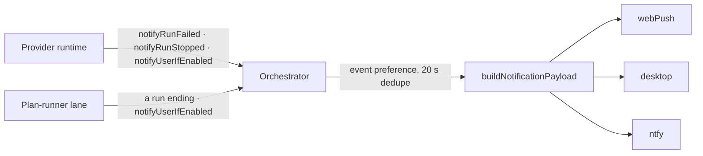

# Notifications

*How CloudCLI tells you something happened while you are not looking — and how that reaches
your phone through ntfy.*

When a run needs you (a tool waits for approval, Claude asks a question), finishes, crashes, or
runs into something only you can clear — a rate limit, an expired sign-in, an API that kept
refusing — the server raises a **notification event** and fans it out to every channel you have
switched on:
browser web push, the desktop app, and **ntfy** — a phone push through an
[ntfy](https://ntfy.sh) server. ntfy needs no open browser tab and no CloudCLI app on the phone;
it needs the ntfy app subscribed to your topic.

This page is the one home for the notification system's documentation. How to prove a change to
it on this box is in [verification.md](verification.md) §"The ntfy probes".

## Quickstart: your phone, in five minutes

1. On the phone, install the ntfy app and subscribe to a topic name nobody will guess. On the
   public `ntfy.sh` server the topic name is the only thing protecting your pushes (see
   §"Gotchas").
2. Give CloudCLI the same topic in **Settings → Notifications → Phone push (ntfy)**: type the
   topic, check the CloudCLI URL the card prefills from the address you are on — it has to be
   the address the *phone* can reach, this host's Tailscale address on port 5183 (see
   [hosting.md](hosting.md) §"What runs"), not `localhost` — and press Save. Then press **Send
   test**; a "CloudCLI test" push on the phone means it works. The card shows the topic back
   only masked, and its token field is blank for "keep the stored one" — typing in it replaces
   the token, emptying it after typing clears it.
3. Or do the same over the API, with a CloudCLI login token:

   ```bash
   curl -s http://127.0.0.1:3011/api/auth/login -H 'content-type: application/json' \
     -d '{"username":"<you>","password":"<password>"}'      # answers {"token":"…"}
   TOKEN=<that token>

   curl -s -X PUT http://127.0.0.1:3011/api/notifications/ntfy \
     -H "Authorization: Bearer $TOKEN" -H 'content-type: application/json' \
     -d '{"topic":"<your-topic>","appUrl":"http://10.0.0.5:5183"}'
   ```

   `appUrl` is where a tapped push opens CloudCLI, and the test push is one more call:

   ```bash
   curl -s -X POST http://127.0.0.1:3011/api/notifications/ntfy/test -H "Authorization: Bearer $TOKEN"
   ```

   `{"ok":true,"status":200,"error":null}` and a "CloudCLI test" push on the phone mean it works.

## How an event travels



`notifyUserIfEnabled` in `server/modules/notifications/services/notification-orchestrator.service.js`
owns the fan-out:

1. **Event preference.** The event's `kind` maps to one switch in the user's notification
   preferences (`KIND_TO_PREF_KEY`): `action_required` → `events.actionRequired`, `stop` →
   `events.stop`, `error` → `events.error`, `limit` → `events.limits`, `background` →
   `events.background`. A kind with no switch (`info`) always passes. The first four default to on;
   `background` (a wait or a subagent finishing after the turn ended) defaults to off, because one
   session's pipeline raises it on every return and it was 64 of 91 phone pushes in four hours, and `events.limits` counts as on unless it is
   stored as `false`, so a preferences save that omits it cannot turn it off.
2. **Dedupe.** The same event key inside 20 seconds is dropped (`isDuplicate`).
3. **Wording.** `buildNotificationPayload` resolves the session's display name and takes the title
   and body from `buildNotificationText` — see §"The wording". Every channel sends those same two
   strings.
4. **Fan-out.** Each channel is asked `isEnabled(preferences, userId)`, and each enabled channel's
   `send` is started without being awaited. A rejection is logged and the next channel is
   unaffected.

The events raised today:

| Code | Kind | Raised by |
| --- | --- | --- |
| `permission.required` | `action_required` | The Claude runtime, when a tool waits for approval. Its `meta` carries the `promptKey` (the ask's identity, which outlives the process that raised it), the `requestId` and the raw `toolInput`, which is what lets the push carry answer buttons (§"Answering from the phone") and what keeps a re-issue from pushing again (§"One question, one push") |
| `agent.notification` | `action_required` | The Claude runtime's Notification hook, for every type but `permission_prompt` — that type's dominant producer is the six-second pending-ask timer behind the prompt `permission.required` has already pushed, with the question and its answer buttons on it |
| `run.stopped` | `stop` | All four runtimes (Claude, Codex, Cursor, OpenCode) when a run ends |
| `run.background_completed` | `background` | The Claude runtime, when background work finishes after its turn |
| `run.failed` | `error` | All four runtimes, when a run crashes; and the Claude runtime again for a `result` message that carries an error |
| `run.limit` | `error` | The Claude runtime, when a run ends on its max-turns or max-budget ceiling |
| `api.error` | `error` | The Claude runtime, when the assistant reports a request it could not make — after the SDK has spent its retries |
| `login.expired` | `error` | The Claude runtime, when the credentials rather than the request are the problem |
| `session.stuck` | `error` | The stall watchdog, when a run still in flight has emitted nothing for the stall threshold — no runtime raises it |
| `runner.finished` | `stop` | The plan-runner lane, when a plan run ends with every phase shipped — see [plan-runner.md](plan-runner.md) §"Pushes on an ending" |
| `runner.blocked` | `error` | The plan-runner lane, when a plan run ends with phases blocked or left: `all-blocked`, `halted`, `budget`, `flag-off`, or a `complete` that left phases |
| `limit.reached` · `limit.reset` · `limit.warning` · `limit.overage` · `limit.out_of_credits` | `limit` | The Claude runtime, reading the SDK's `rate_limit_event` |
| `push.enabled` | `info` | The settings service, when a browser saves a push subscription |

**A failed result raises one event, not two.** A `result` message with `is_error` goes out as
`run.failed` (or `run.limit`), and the Claude runtime suppresses the `run.stopped` /
`run.background_completed` it would otherwise have sent beside it: "finished" is not true of a
turn that crashed.

**A silent run is noticed from outside, because no runtime reports its own hang.**
`session.stuck` comes from the stall watchdog (`websocket/services/run-stall-watchdog.service.ts`),
started once after `listen`: every 15 seconds it reads the run registry and announces any run
still in flight whose last event is older than the threshold. The threshold is `run_stall_ms` in
`app_config` when that is a positive number, else the `CLOUDCLI_STALL_MS` environment variable,
else 15 minutes — read fresh on every sweep, so changing the row takes effect on the next tick
rather than at the next boot. The registry only records when each run last produced an event;
what has already been announced is the watchdog's own memory, which is what makes one stall one
push — a second push needs events to resume and then stop again. Two runs are never announced: a
run whose session has a tool approval still pending (that silence is the run waiting for you, and
the approval push already went out), and a run that has ended.

### Where the Claude runtime's error and limit signals come from

`claude-runtime-signals.ts`, beside the provider. The runtime hands it every SDK message it
receives, and what comes back through one `emit` callback is a notification event's `kind`,
`code`, `meta`, `severity` and `dedupeKey` — the module never imports the orchestrator. What it
reads, and the rules that keep one piece of bad news to one push:

| The SDK says | It emits |
| --- | --- |
| `rate_limit_event`, `status: 'allowed_warning'` | `limit.warning`, carrying the window's true reading (`meta.pct`). Two steps per window, 80% and 95%: a reading inside a step already announced is silent, whichever session reads it — the steps are remembered against the window's own `resetsAt` — within a minute's slack, so a reset time that drifts a second is the same window — so a limit is one buzz for the account and not one per running chat. An event that names no `resetsAt` says nothing about which window it read, so it neither forgets the steps nor the window's name; only a warning older than an hour is forgotten that way |
| `rate_limit_event`, `status: 'rejected'` | `limit.reached`, once per rejection — a window that moves its `resetsAt` counts as a new one |
| `rate_limit_event`, `status: 'allowed'` after a rejection | `limit.reset`. The warning steps are NOT forgotten here: an ordinary reading from one session would otherwise let every other session re-announce the same threshold. A new `resetsAt` — a new window — is what forgets them |
| `isUsingOverage` / `overageDisabledReason: 'out_of_credits'` | `limit.overage` / `limit.out_of_credits`, once each until the field says it stopped. Out of credits is one flag for the whole account, shared by both roads — a `rate_limit_event`'s `overageDisabledReason` and an assistant `billing_error` — so one emptied wallet is one push however many sessions and window types hit it. Only overage actually being available again re-arms it (no disabled reason, or `isUsingOverage`): another reason does not, because `org_level_disabled` rides on every event this account sends, full wallet or empty |
| `system` / `api_retry` | nothing. The attempt is *recorded*, so the `api.error` that follows can say "overloaded after 3 retries" instead of one push per retry |
| `assistant` with an `error` | `api.error`; `authentication_failed` and `oauth_org_not_allowed` become `login.expired` instead, `billing_error` becomes `limit.out_of_credits`, and `max_output_tokens` is the model's business and says nothing |
| `auth_status` with an error, or mid-sign-in | `login.expired`, once per run |
| `result` that is not `success` | `run.limit` for a max-turns or max-budget ceiling, else `run.failed` — whose body is the cause, with the CLI's own `[ede_diagnostic]` instrumentation line stripped out |

Two memories, different in lifetime. **Per run**: the last retry, and whether this run has
already said "sign in again". **Per account, one record per rate-limit window, on disk**
(`claude-limit-memory.ts`, `~/.cloudcli/limit-memory.json`): limits are account-wide, so a second
session must not re-announce what the first one did. The record is keyed by the live login's email,
so a switched-to account warns for its own windows, and it lives on disk because the dev server
hands over to a new process on every save under `server/` — held in the heap, every handover
forgot what was sent and re-sent it (2026-09-17: "Weekly limit at 76%" three times in 17 minutes).
A reset needs a timer that outlives the run that armed it; timers are not stored, so a rejection
announced by a replaced process re-arms its timer on the next rejected reading. That timer is capped at a day out —
further than that, the reset is left to the next `allowed` event — and it fires through the
`emit` of whichever run armed it, hours after that run ended, which is why the runtime hands the
detector a user id captured at spawn instead of a live socket. A run the server itself ended
(a Stop makes the CLI answer with `error_during_execution`) is skipped whole: a crash alarm is
the last thing that turn deserves.

## The ntfy channel

### Settings, and where they live

Each user has one row in `notification_channel_endpoints`, with channel `ntfy` and endpoint
`default`. The row's `enabled` column is the channel's one on/off switch. Its metadata holds the
server URL, topic, token and long-run threshold (`ntfy-config.service.ts`). The tap-through URL
is one per instance, not one per user: `app_config` key `public_app_url`. No environment
variable configures ntfy.

The screen for all of it is **Settings → Notifications → Phone push (ntfy)**
(`src/modules/settings/NtfySettingsCard.tsx` over `useNtfySettings.ts`). It saves a patch, not
the form: only fields the user actually changed are sent, which is what lets a card that can
never see the stored token leave it alone. Which *kinds* reach any channel is the same screen's
"Event Types" checkboxes — Action required, Run stopped, Run failed, Usage limits, Background agents
finished — which write `events.actionRequired`, `events.stop`, `events.error`, `events.limits` and
`events.background`.

| Field | Default | Accepted |
| --- | --- | --- |
| `serverUrl` | `https://ntfy.sh` | An http(s) URL; trailing slashes are stripped; `''` resets to the default |
| `topic` | none — the first save must carry one | Letters, digits, `-` and `_`, 1–64 characters |
| `token` | none | Printable ASCII without spaces, up to 512; sent as `Authorization: Bearer`; `''` or `null` clears it |
| `longRunMinutes` | `5` | A whole number from 0 to 1440 |
| `enabled` | `true` on the first save | A boolean |
| `appUrl` (instance-wide) | none | An http(s) URL; `''` or `null` forgets it |

### Routes

The four settings routes sit under `/api/notifications`, behind the normal login
(`authenticateToken`), in `server/modules/notifications/notifications.routes.ts`. One more
route, `POST /api/ntfy/act`, is public: the phone's answer buttons call it (§"Answering from the
phone").

| Route | What it does |
| --- | --- |
| `GET /ntfy` | Answers the masked view: `configured`, `enabled`, `serverUrl`, `topicMasked`, `hasToken`, `longRunMinutes`, `appUrl`. |
| `PUT /ntfy` | Merges the body over what is stored. An absent field keeps its value, so a form that never shows the token cannot erase it. A field of the wrong type or an invalid value is a 400, and nothing is written: the user's row and the app URL both validate before either one writes. Answers the masked view. |
| `DELETE /ntfy` | Forgets the user's ntfy row. The instance-wide app URL stays. |
| `POST /ntfy/test` | Sends "CloudCLI test" to the stored topic and answers the publisher's result, `{ ok, status, error }`, verbatim. 404 when no topic is stored. It ignores `enabled`. |

The generic `GET /endpoints?channel=ntfy` listing masks an ntfy row the same way.

### What gets pushed, and how loud

| Event | ntfy priority | Tag (ntfy draws it as an emoji) |
| --- | --- | --- |
| `runner.finished` | 3 | `white_check_mark` |
| `runner.blocked` | 4 | `warning` |
| `action_required` | 4 (high) | `question` |
| `error` | 4 | `rotating_light` |
| `limit.reached`, `limit.out_of_credits` | 4 | `no_entry` |
| `limit.reset` | 3 | `white_check_mark` |
| Any other `limit.*` | 3 | `warning` |
| `stop` | 2 (low) | `white_check_mark` |
| Anything else | 3 (default) | `bell` |

A tap opens `<appUrl>/session/<sessionId>`, or `<appUrl>/` when the event has no session. With
no app URL stored, the push carries no link.

**A finished run is pushed only when it ran long.** `run.stopped` goes to ntfy only when the
event's `meta.durationMs` is at least `longRunMinutes`; an event without a duration is never
pushed, because "it finished" without "how long" is noise. All four runtimes pass a duration:
Claude reports the SDK's own `duration_ms` for a turn that ended on a `result`, and Codex, Cursor
and OpenCode measure the wall clock from the moment they spawned the run. The one path that
passes none is a Claude run that ends without a `result`, so that finished run reaches web push
and the desktop app but not ntfy. `run.background_completed` is gated by `events.background`, off by default.

**Not while you are watching.** An event about a session one of your browser tabs has on screen
is not pushed. The channel asks `isSessionWatched(userId, sessionId)`
(`session-presence.service.ts`), which answers yes when a tab of the same user has reported that
session, visible, within the last 90 seconds. A tab reports over its chat websocket with a
`chat.presence` frame, which the gateway records against the connection it arrived on and
forgets when that socket closes. The chat sends it from `useSessionPresence.ts` — at mount, on
every session or connection change, on a socket swapped by a token refresh, on
`visibilitychange`, and every 30 s while the tab is visible, so a window left open on a session
keeps counting as watched. "On screen" means the chat tab itself: a session whose chat is hidden
behind the Files, Shell or Git tab reports nothing, so its approval prompt still reaches the
phone. Presence is per socket, not per account: a phone with the session closed still gets the
push a watching laptop does not.

The same store now answers a second, user-agnostic question too — is *any* tab watching this
session right now, whoever it belongs to — through the sibling `isSessionOnScreen(sessionId)`.
It is how the sidebar decides not to raise an unread dot for a run that finished while its own
chat was already open; see [server/modules/providers/README.md](../server/modules/providers/README.md)
and [server/modules/websocket/README.md](../server/modules/websocket/README.md).

**Bursts.** Eight codes can arrive in bursts: `api.error`, `run.failed`, `session.stuck`,
`limit.warning`, `limit.reached`, `limit.overage`, `agent.notification` and `run.stopped`. The
channel collapses them per user, provider, code and session — and, for a limit push, per window,
since its title names the window (`ntfy-flood-control.service.ts`). The first push of a burst goes out at once, never held back on a timer; repeats inside the next minute
are counted instead of sent. If the minute ends with repeats counted, one summary follows —
`<latest title> ×<total>` / `<repeats> more in the last minute` — at priority 3 with the `bell`
tag, whatever the originals' priority, and only if ntfy is still on. The windows live in server
memory, so a restart forgets an open one.

### Answering from the phone

Questions and plan approvals raise `permission.required` in **every** permission mode, the
bypassing ones included — see
[architecture/02-realtime-stream.md](architecture/02-realtime-stream.md) §"Permission requests"
for the two callers that ask. That is what makes an unattended run answerable from a phone rather
than silently auto-answered.

A permission request can be answered from the push itself. The push carries ntfy `http` buttons,
and a tap makes the phone send `POST <appUrl>/api/ntfy/act?t=<token>`:

| Request | Buttons | What a tap does |
| --- | --- | --- |
| `AskUserQuestion` with one single-select question of 1–3 options | One per option, labelled with it | Answers with that option, exactly as the in-app question panel does |
| `AskUserQuestion` of any other shape | None | Answer it in the app |
| `ExitPlanMode` | Approve · Revise | Approves the plan, or declines it with "User asked to revise the plan" |
| Any other tool | Approve · Deny | Allows the tool, or denies it with "User denied tool use" |

Buttons need a `meta.promptKey` (the ask's identity) and a `meta.toolInput` on the
`permission.required` event, and a stored app URL. They are built for every such event, whether
or not that event's own push goes out (§"One question, one push"). The Claude runtime puts both on the event — the
prompt key it is waiting on, and the tool's raw input — so on a configured instance a permission
push carries buttons; a producer that names only a `meta.requestId` still gets buttons, keyed that
one ask at a time. With no app URL stored there is nowhere for a button to POST, and the push goes
out with none. Which buttons a tool gets, and what each one means, is
`ntfy-action-decisions.service.ts`; the token service below knows nothing about tools.

**The token** (`ntfy-action-token.service.ts`) is
`<base64url JSON payload>.<base64url HMAC-SHA256 of that segment>`. The payload names the prompt,
the user, the one decision its button stands for, an expiry and a random nonce, so a Deny token
cannot be edited into Approve without breaking the signature. The key is
`app_config.ntfy_action_secret`, created on first use like `jwt_secret`. A token works once, and
spending it retires its sibling buttons: the prompt is forgotten as the token is spent — before
the runtime is told, so a failure there cannot leave a reusable token. A question's or plan's
buttons stay good for 4 hours, and the runtime waits for those indefinitely. Any other tool's
buttons stay good for 5 minutes, but the Claude runtime waits only 55 seconds for an approval
(`CLAUDE_TOOL_APPROVAL_TIMEOUT_MS`) and then denies the tool itself: a tap after that is too
late, and the route cannot tell (§"Gotchas"). Spent tokens live in server memory; a registered
prompt is re-registered by whichever successor re-issues it (§"One question, one push"), so a
restart (a dev handover included) no longer voids the buttons of a question that is still parked.
Rotating the signing secret does — every outstanding button dies with it.

**The route** (`ntfy-action.routes.ts`) answers in plain text:

| Status | Body | Meaning |
| --- | --- | --- |
| 200 | `Answered: <button label>` | The decision was handed to the runtime, which may no longer be waiting (§"Gotchas") |
| 400 | `missing token` · `malformed token` · `malformed payload` · `unknown option` | Not a token this server minted |
| 401 | `bad signature` · `expired` · `unknown decision` | Forged, altered or out of time |
| 410 | `already answered` · `no longer pending` | Spent, or its prompt is gone (answered by a sibling, timed out, or the session's approval was settled before this server took the question over) |
| 429 | `too many attempts` | 20 GUESSED tokens from one client inside a minute — a signed token is never refused this way |
| 500 | `could not answer` | The runtime threw while taking the decision; the token is spent anyway |

`server/index.ts` mounts it under its own public prefix, not beneath the login-protected
`/api/notifications`: the ntfy app has no CloudCLI login, so the token is the whole credential and
there is no JWT path. Each tap logs one `[ntfy] action <status> <detail>` line, never the token.

The 429 counts **guesses only** — tokens refused at or before the signature check, which is all
`consumeActionToken` reports as `forged`. A token the signature vouches for is answered on its
merits however much noise its client has made, spent and expired ones included, because twenty
guesses buy nothing against HMAC-SHA256 while a counter placed in front of the signature would let
any stranger on the tailnet refuse the phone's real button for a minute. Presenting a signed token
also *clears* that client's record: it has proved it holds one of ours, and it could earn uncounted
410s by replaying it all day regardless.

The client is the socket's address and nothing a caller can choose. `X-Forwarded-For` is not read:
the API binds loopback only, so every request — the phone's through the Vite proxy included —
arrives from `127.0.0.1`, and any finer answer could come only from a header the caller writes,
which would sell an unlimited budget for the price of rotating it. So all callers share one budget.
That is safe precisely because of the rule above, and it is why the checks in `.verify/ntfy` hand
the budget back (one signed token) instead of trying to claim an address of their own.

### One question, one push

A question parks the CLI, and the process that pushed it does not survive to see the answer. The
dev server boots a fresh process behind the running one on every save under `server/`, and each
successor re-adopts the session hosts: the replayed `can_use_tool` request makes the runtime ask
again, so `promptForToolDecision` runs a second, third, twelfth time for the SAME question — new
request id, and, before this, a fresh push each time. Measured 2026-09-22: one AskUserQuestion at
17:51:32, 23 handovers in seven minutes while builders saved server files, and 12 identical pushes
on the phone, one per handover.

Two halves make one push:

- **The prompt key** (`promptKeyFor` in `claude-runtime.provider.js`) is the ask's own identity:
  the tool use id the CLI stamped on the call, which the replayed request carries unchanged. The
  re-issue keeps its own `requestId` — the in-app `permission_request` frame is a new ask for the
  panel — but carries the same key, and the notification's `dedupeKey` is built on the key.
- **The memory of the push** (`ntfy-pushed-prompts.service.ts`) is a record on disk at
  `~/.cloudcli/ntfy-pushed-prompts.json`, keyed by the prompt key and forgotten after the
  question's own window (4 hours — the same window its buttons live for). The channel checks it
  before publishing and writes it only once a publish has been ACCEPTED, so a predecessor killed
  between its question and its push leaves no record and the successor still pushes: a question
  that was never announced is always announced once. Two servers on one box share the file, so a
  write takes an exclusive lock and a lost read-modify-write is what that lock exists to stop.
  Failing to take the lock in a second abandons that one record rather than waiting — the cost of
  a missing record is one push too many, and the cost of blocking is a stalled fan-out.

The whole point of the ordering is the failure it rules out. A record written at emit time would
turn a predecessor's death mid-publish into a question nobody is ever told about. What it leaves
open is the mirror window — a predecessor killed after ntfy accepted the push but before the
record lands — and there the successor pushes a second time. At-least-once, chosen knowingly: a
rare double on a save storm beats a question that is never announced.

The buttons survive the relay too. The push a predecessor sent carries a token naming the
prompt key, and a successor re-registers that prompt on every re-issue — the registration happens
while the buttons are built, ahead of EVERY skip the channel can make (the already-pushed check,
the watched-session skip and the short-run one alike) — so a tap on the one push that went out
still finds the question, which the successor is asking under a request id of its own.
`resolveToolApproval` looks the key up when no request id matches.

That ordering is load-bearing, not incidental. The watched-session skip is the one that shows why:
a question pushed while the chat tab was hidden, then brought on screen, then handed over, would
have had its re-issue dropped by the presence check before anything re-registered it — and the tap
that came an hour later, on a phone that still showed the push, would answer nothing (410).

### How a push is published

`publishNtfy` in `ntfy-publish.service.ts` is the only code that talks to an ntfy server:

- **The topic travels in the JSON body**, POSTed to the server's base URL — never as
  `<server>/<topic>`. A URL ends up in fetch errors, proxy logs and this server's own logs; a body
  does not.
- **It is bounded.** A five-second timeout; the title is cut at 200 characters, the message at
  2,000, and at most three action buttons are sent, each label cut at 30 (ntfy refuses a fourth).
- **It never throws.** It resolves with `{ ok, status, error }`. A failure logs one
  `[ntfy] publish failed <status> <error>` line in which the topic, the access token, and every
  action button's URL and act token have been scrubbed out — and any `act?t=…` shape that survived
  replaced by `[tap url redacted]`, a marker carrying no `act?t=` of its own so a scrubbed line can
  never read as a leak — before the text is cut to 200 characters, so a cut can never leave half a
  secret behind. An ntfy server that quotes a refused message back, whole or truncated, cannot put
  a live approval token in the journal.
- **Nothing upstream waits on it.** The channel's `send` never rejects and its `isEnabled` never
  throws — they log `[ntfy] send skipped` and `[ntfy] enablement check failed` instead — so a dead
  ntfy server costs the push and nothing else.

### The topic and token are credentials

They are stored only in the endpoint row's metadata. A client sees `topicMasked` (the first two
and last two characters; four or fewer show as `••••`) and `hasToken`, never the values — through
`GET /ntfy` and through the generic `GET /endpoints?channel=ntfy` alike. A validation error never
quotes them, and the publisher scrubs them, and the act tokens beside them, from every error it
reports.

## The wording

`buildNotificationText(event)` in
`server/modules/notifications/services/notification-copy.service.ts` words every notification
for every channel. To change what a code says, change it there and nowhere else; the function is
also exported from the module's `index.ts` for any caller that has to show an event's wording.

- The title is the code's headline followed by ` · <session name>` when a name is known. The
  `limit.*` codes are the exception: a limit belongs to the account, not the session that read it,
  so they carry no session name, and the ones that read a window name it in the title —
  `5-hour limit at 82%`, `Weekly limit reached`, `Fable limit reset`. The Fable weekly window
  arrives as `rateLimitType: 'seven_day_overage_included'` (the Claude CLI's own label table names
  it "Fable limit"); a window the table does not know reads "Usage". An
  unknown code reads "CloudCLI" / "You have a new notification".
- The body is cut at 1,000 characters: web push refuses a payload over about 4 KB, and the
  orchestrator settles that refusal silently.
- A tool approval's body is the thing being approved: the Bash command, the path for a file tool,
  otherwise the tool input as JSON (cut at 300 characters). A question lists its options numbered
  from 1 in their own order. A plan ready for approval carries its first 600 characters.

## Gotchas

- **On the public `ntfy.sh`, the topic is the password.** Anyone who knows it can read every push
  and send fake ones. Use a long random name, or a server of your own that enforces access tokens.
- **ntfy settings belong to the login that saved them.** A chat event is pushed with the user id of
  the socket that started the run (every keepalive host records it: `userId` in
  `~/.cloudcli/sessions/<session>-<host>.json`), and the channel reads only that user's row. This box
  has two accounts: `scott` (id 2), the one the operator's browser is signed in as, and `verve`
  (id 1), the dev account `.verify/lib/ntfy.mjs` signs in as. A topic saved through the probe CLI or
  a curl logged in as `verve` never hears the operator's chats. Measured 2026-09-12: the phone topic
  sat on `verve` for four hours and not one chat event reached it. Save it from Settings in the
  operator's own browser, or check `select user_id from notification_channel_endpoints where
  channel='ntfy'` against the hosts' `userId`.
- **The switch is the endpoint row, never `preferences.channels.ntfy`.** The generic endpoint
  routes write a `channels.<name>` copy into preferences, and the client's settings normalizer
  writes `false` back for a channel it does not know, so the channel reads the row instead. Turn
  ntfy off with the card's **Enabled** switch and Save (that is `PUT /ntfy` with
  `{"enabled": false}`), or the generic `PATCH /endpoints/ntfy/default`.
- **`POST /endpoints/current` does not validate ntfy settings.** It stores any metadata for any
  channel, skipping every check `PUT /ntfy` makes. Configure ntfy through `PUT /ntfy`. The read
  path does not trust it: `getNtfyConfig` and `maskNtfyMetadata` accept only a topic, server URL
  and access token of the shapes `PUT /ntfy` would have stored, so metadata written around it reads
  as an unconfigured channel (`configured: false`, `topicMasked: null`, `hasToken: false`, the
  default server) instead of publishing to a topic nobody validated.
- **Only the journal says a push failed.** Read it with
  `journalctl -u cloudcli-server-dev --no-pager | grep '\[ntfy\]'`. The test route is the one place
  a failure is answered to the caller.
- **The app URL is shared.** Every user's tap-through uses `public_app_url`, so one user's
  `PUT /ntfy` carrying `appUrl` changes it for all of them.
- **Setting `API_KEY` breaks answering from the phone.** `app.use('/api', validateApiKey)` covers
  `/api/ntfy/act` too, and the phone sends no `x-api-key`, so every tap gets a 401
  `Invalid API key`. `API_KEY` is unset on this box.
- **Behind Vite, every phone has the same address.** A tap on `http://10.0.0.5:5183` reaches
  the API through the Vite proxy, which adds no `X-Forwarded-For` (it is not configured with
  `xfwd`), and the API binds `127.0.0.1` only — so the route sees one address for every caller and
  they share one guess budget. That cannot cost a phone its answer (a signed token is never refused
  by the counter, and answering clears the record), and the header is deliberately ignored, so no
  caller can win a private budget by rotating one. Putting a real reverse proxy in front would be
  the only way to tell clients apart honestly, and would need `trust proxy` set to mean anything.
- **`200 Answered:` means the decision reached the runtime, not that the tool was allowed.**
  `resolveToolApproval` returns nothing — it offers the decision to every provider, and one no
  longer waiting ignores it. A prompt the runtime has stopped waiting on is retired as it settles
  (`forgetPendingAction`, called from `promptForToolDecision` for every outcome: answered, denied,
  aborted or timed out), so a late tap meets `410 no longer pending` rather than a button that
  reports success and changes nothing. What a 200 still cannot promise is what the tool then did
  with the decision — a `deny` is a `deny`, and the phone asked for it.
