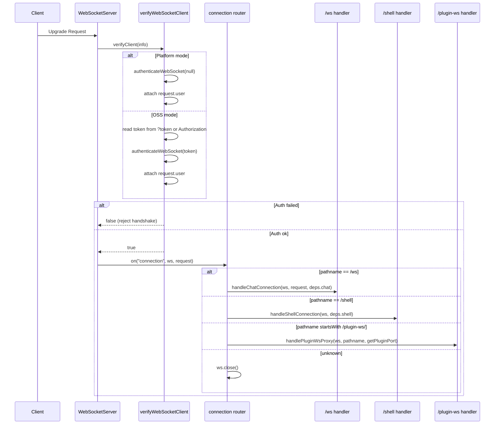
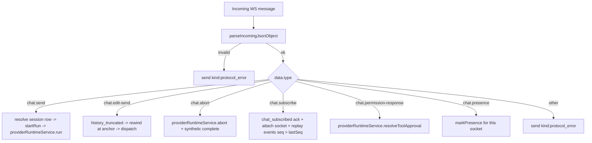
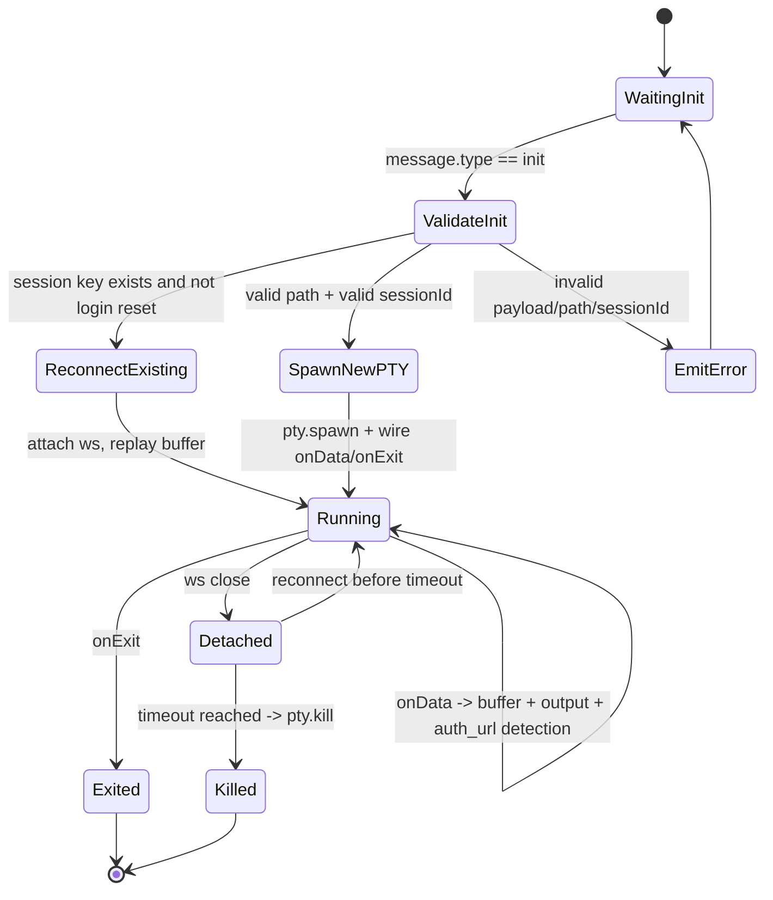
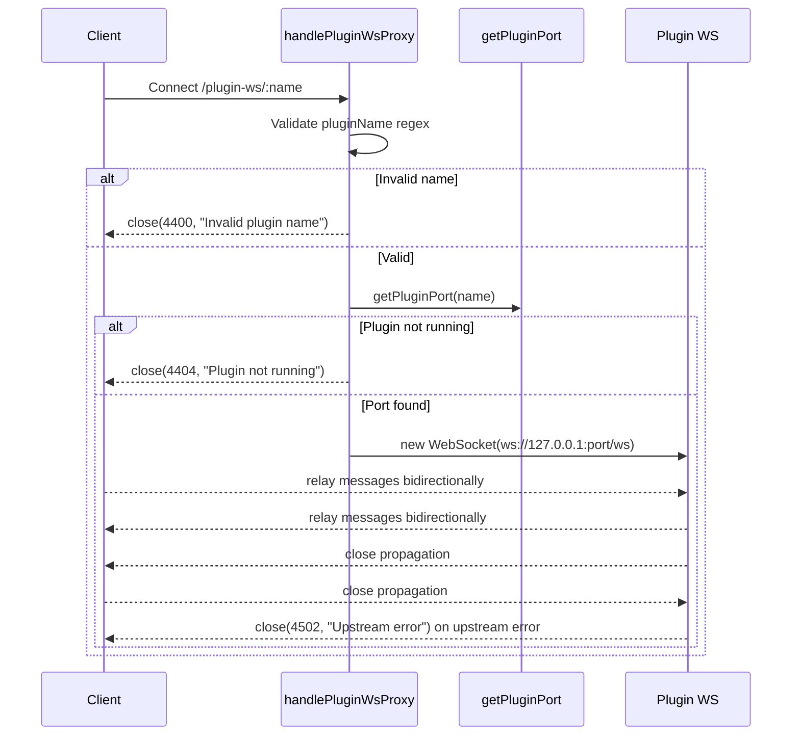

<!-- docstore export; edit rows with docstore write, never this file -->

## MAN-727 — websocket

The server-side WebSocket gateway: chat streaming on `/ws`, interactive terminals on `/shell` and plugin passthrough on `/plugin-ws/:pluginName` — small services behind a barrel index, exporting the shared ws server, the client registry and the session_upserted broadcasters.

governs: /home/lyphe/.claude/claudecodeui_lyphe/server/modules/websocket/

## MAN-709 — WebSocket Module
section: README/000

This module owns the server-side WebSocket gateway used by:

1. Chat streaming (`/ws`)
2. Interactive terminal sessions (`/shell`)
3. Plugin WebSocket passthrough (`/plugin-ws/:pluginName`)

It is intentionally structured as **small services** plus a **barrel export** in `index.ts`.

## MAN-710 — Public API
section: README/001 Public API

`server/modules/websocket/index.ts` exports:

1. `createWebSocketServer(server, dependencies)`
Creates and wires the shared `ws` server.
2. `connectedClients` and `WS_OPEN_STATE`
Shared chat client registry and open-state constant used by other modules.
3. `chatRunRegistry`
Live-run registry; the providers module's `sessionsService` reads it for `listRunningSessions`.
4. `broadcastSessionUpserted` and `broadcastSessionUpsertedBatch`
The `session_upserted` delta builders; the providers module's sessions watcher fans its re-indexed rows out through them.
5. `runDetachedChatTurn` (and the `ProviderRuntimeGateway` type)
Runs one chat turn with no socket attached. Two consumers: the scheduled-messages module drives it from a timer, and keepalive re-adoption (`session-host/readopt.ts`) composes it on boot to give each CLI that outlived the API its run back (`beforeRun` exists for that caller — it settles a run whose turn already finished before the provider is asked for anything). Both compose it rather than re-implementing the dispatch, which is what keeps the session row lookup, the busy check and the run-completion safety net in one place.
6. `startRunStallWatchdog()`
Starts the sweep that turns a silent run into one `session.stuck` notification, and returns the function that stops it. Called once by `server/index.ts` inside the `listen` callback and stopped on shutdown, for the same reason the plan runner is: the notification is about runs this process is only now able to host. It lives in this module because the registry it reads owns runs — no provider knows it exists. What counts as silence, and which runs are deliberately never announced, is [docs/MANUAL.md (notifications)](../../../docs/MANUAL.md) §"A silent run is noticed from outside".

governs: /home/lyphe/.claude/claudecodeui_lyphe/server/index.ts, /home/lyphe/.claude/claudecodeui_lyphe/server/modules/websocket/index.ts

## MAN-711 — Why Dependency Injection Is Used
section: README/002 Why Dependency Injection Is Used

The module receives runtime-specific functions from `server/index.ts` instead of importing legacy runtime files directly.

Benefits:

1. Keeps module boundaries clean (`server/modules/*` architecture rule).
2. Makes each service easier to test in isolation.
3. Keeps WebSocket transport concerns separate from provider runtime concerns.

governs: /home/lyphe/.claude/claudecodeui_lyphe/server/index.ts

## MAN-712 — Service Map
section: README/003 Service Map

| File | Responsibility |
|---|---|
| `services/websocket-server.service.ts` | Creates `WebSocketServer`, binds `verifyClient`, routes connection by pathname |
| `services/websocket-auth.service.ts` | Authenticates upgrade requests and attaches `request.user` |
| `services/chat-websocket.service.ts` | Handles the `/ws` chat protocol (`chat.send` / `chat.edit-send` / `chat.abort` / `chat.subscribe` / `chat.permission-response` / `chat.presence` / `chat.ping`). A visible `chat.presence` also marks that session read when it was unread, and broadcasts `session_upserted` only when a row changed |
| `services/chat-run-registry.service.ts` | Tracks live provider runs per app session id: seq numbering, event replay buffer, provider-id mapping, completion state, and `lastEventAt` — the silence clock every recorded event resets. On the terminal `complete` it stamps `last_completed_at` once per run end (and `last_read_at` with it when the chat is on screen), then broadcasts `session_upserted` — except for a re-adopted run whose last turn end its host journal shows was already recorded (`completeRunIfCurrent(..., { alreadyRecorded: true })`, decided in `session-host/readopt.ts`), which closes without stamping |
| `services/chat-session-writer.service.ts` | Gateway writer handed to provider runtimes: remaps provider session ids to app ids, swallows `session_created`, assigns `seq` |
| `services/run-stall-watchdog.service.ts` | Polls the registry's running runs and announces one that has gone quiet past the threshold. A poller rather than a timer per run, so a run that ended cannot leak one |
| `services/shell-websocket.service.ts` | Handles `/shell` PTY lifecycle, reconnect buffering, auth URL detection |
| `services/plugin-websocket-proxy.service.ts` | Bridges client socket to plugin socket |
| `services/websocket-writer.service.ts` | Adapts raw WebSocket to writer interface (`send`, `setSessionId`, `getSessionId`) for non-chat writer consumers |
| `services/websocket-state.service.ts` | Holds shared chat client set and open-state constant |

governs: /home/lyphe/.claude/claudecodeui_lyphe/server/modules/websocket/services/chat-run-registry.service.ts, /home/lyphe/.claude/claudecodeui_lyphe/server/modules/websocket/services/chat-session-writer.service.ts, /home/lyphe/.claude/claudecodeui_lyphe/server/modules/websocket/services/chat-websocket.service.ts, /home/lyphe/.claude/claudecodeui_lyphe/server/modules/websocket/services/plugin-websocket-proxy.service.ts, /home/lyphe/.claude/claudecodeui_lyphe/server/modules/websocket/services/run-stall-watchdog.service.ts, /home/lyphe/.claude/claudecodeui_lyphe/server/modules/websocket/services/shell-websocket.service.ts, /home/lyphe/.claude/claudecodeui_lyphe/server/modules/websocket/services/websocket-auth.service.ts, /home/lyphe/.claude/claudecodeui_lyphe/server/modules/websocket/services/websocket-server.service.ts, /home/lyphe/.claude/claudecodeui_lyphe/server/modules/websocket/services/websocket-state.service.ts, /home/lyphe/.claude/claudecodeui_lyphe/server/modules/websocket/services/websocket-writer.service.ts

## MAN-713 — High-Level Architecture
section: README/004 High-Level Architecture

```mermaid
flowchart LR
  A[HTTP Server] --> B[createWebSocketServer]
  B --> C[verifyWebSocketClient]
  B --> D{Pathname}
  D -->|/ws| E[handleChatConnection]
  D -->|/shell| F[handleShellConnection]
  D -->|/plugin-ws/:name| G[handlePluginWsProxy]
  D -->|other| H[close()]

  E --> I[connectedClients Set]
  E --> J[chatRunRegistry + ChatSessionWriter]
  F --> K[ptySessionsMap]
  G --> L[Upstream Plugin ws://127.0.0.1:port/ws]

  I --> M[projects.service loading_progress]
  I --> N[sessions-watcher.service session_upserted]
```

## MAN-714 — Connection Handshake + Routing
section: README/005 Connection Handshake + Routing



## MAN-715 — `/ws` Chat Flow
section: README/006 `/ws` Chat Flow

When a chat socket connects:

1. Add socket to `connectedClients`.
2. Parse each incoming message with `parseIncomingJsonObject`.
3. Dispatch by `data.type` (seven message types, none provider-specific).
4. On close, remove socket from `connectedClients` and drop this socket's presence record.

## MAN-716 — Session identity model
section: README/006 `/ws` Chat Flow/007 Session identity model

The frontend only ever knows the **app session id** (allocated by
`POST /api/providers/sessions` or discovered via the session index). The
provider-native id (JSONL file name, CLI resume id) stays inside the backend:

1. `chat.send` resolves the app id to `{ provider, project_path }` from the sessions DB and passes the **app session id** to the provider runtime.
2. The provider runtime resolves the provider-native id from the sessions DB itself (`sessionsService.resolveProviderSessionId`) at the exact points its CLI/SDK needs it (resume flags, provider-owned databases). Runtimes key their process maps by the app session id, so abort and pending-approval lookups use app ids too.
3. The `ChatSessionWriter` remaps every outbound event back to the app id, and turns `session_created` announcements into a DB mapping update instead of forwarding them.

## MAN-717 — Chat Message Dispatch
section: README/006 `/ws` Chat Flow/008 Chat Message Dispatch



## MAN-718 — Chat Notes
section: README/006 `/ws` Chat Flow/009 Chat Notes

1. **Unified envelope**: every server-to-client frame carries a `kind` — either a provider `NormalizedMessage` kind or a gateway kind (`chat_subscribed`, `session_upserted`, `loading_progress`, `protocol_error`). There is no second `type`-based protocol.
2. **Unified terminal lifecycle**: every provider run ends with exactly one `complete` message built by `createCompleteMessage()` (`server/shared/utils.ts`): `{ kind: "complete", sessionId, actualSessionId, exitCode, success, aborted }`. The chat handler emits a synthetic `complete` for runs that crash or get aborted, and the run registry drops duplicate completes.
3. **Per-run event log**: every live event gets a monotonically increasing `seq`. `chat.subscribe { sessions: [{ sessionId, lastSeq }] }` re-attaches the live stream to the requesting socket (any provider, not just Claude) and replays events with `seq > lastSeq`. If the buffer no longer covers `lastSeq`, the client refreshes over REST.
4. `chat_subscribed` includes `isProcessing` (replaces `check-session-status`) and `pendingPermissions` (replaces `get-pending-permissions`).

governs: /home/lyphe/.claude/claudecodeui_lyphe/server/shared/utils.ts

## MAN-719 — `/shell` Terminal Flow
section: README/010 `/shell` Terminal Flow

The shell handler manages persistent PTY sessions keyed by:

`<projectPath>_<sessionIdOrDefault>[_cmd_<hash>]`

`<hash>` is the first 16 hex characters of SHA-256 over the whole `initialCommand`; the suffix is present only for a plain-shell command.
Two different commands never share a key, so a reconnect only reattaches to a PTY running the same command.

## MAN-720 — Shell Lifecycle
section: README/010 `/shell` Terminal Flow/011 Shell Lifecycle



## MAN-721 — Shell Behaviors in Detail
section: README/010 `/shell` Terminal Flow/012 Shell Behaviors in Detail

1. `init`:
Reads `projectPath`, `sessionId`, `provider`, `hasSession`, `initialCommand`, `isPlainShell`.
2. Login reset:
For login-like commands, existing keyed PTY session is killed and recreated.
3. Validation:
Path must exist and be a directory; `sessionId` must match safe pattern.
4. Command build:
Provider-specific command construction with resume semantics.
5. PTY output buffering:
Stores up to 5000 chunks for replay on reconnect.
6. URL detection:
Strips ANSI, accumulates text buffer, extracts URLs, emits `auth_url` once per normalized URL, supports `autoOpen`.
7. Close behavior:
Socket disconnect does not instantly kill PTY; session is kept alive and terminated on timeout.

## MAN-722 — `/plugin-ws/:pluginName` Proxy Flow
section: README/013 `/plugin-ws/:pluginName` Proxy Flow



## MAN-723 — Shared Client Registry and Broadcasts
section: README/014 Shared Client Registry and Broadcasts

Only chat sockets (`/ws`) are tracked in `connectedClients`.

That shared set is consumed by:

1. `modules/projects/services/projects-with-sessions-fetch.service.ts`
Broadcasts `kind: loading_progress` while project snapshots are being built.
2. `modules/providers/services/sessions-watcher.service.ts`
Broadcasts per-session `kind: session_upserted` deltas when provider session artifacts change (no full project snapshots).
3. `modules/dispatcher/dispatcher.module.ts`
Broadcasts `kind: dispatcher_state` when the plan store's document changes, reaching this set through `modules/websocket/index.js` rather than a deep import.
4. `modules/dispatch-souls/dispatch-souls.module.ts`
Broadcasts `kind: soul_launch_state` when a hand-launched soul's directory changes, the same `modules/websocket/index.js` way.
5. `modules/universe/universe.module.ts`
Broadcasts `kind: universe_map` when a tracked repo's HEAD moves, and `kind: universe_activity` — the coalesced journal-and-transcript feed, at most ten frames a second and none while the estate is quiet — from the two taps in the same module ([docs/architecture/MANUAL.md (01-websocket-transport)](../../../docs/architecture/MANUAL.md) §"Fan-out: who receives what").
6. `modules/kanban-metis/kanban-metis.module.ts`
Broadcasts `kind: kanban_metis_state` when a board's live Metis sessions change, on the same `createPolledLane` shape as items 3 and 4.

7. `modules/websocket/services/chat-run-registry.service.ts`
Broadcasts per-session `kind: session_upserted` when a run ends — once per run,
from the terminal `complete` — so the sidebar re-reads the row whose
`last_completed_at` (and `last_read_at`, when the chat was on screen) it just
stamped. The chat websocket broadcasts the same delta from its `chat.presence`
handler when a visible report marks an unread session read; an already-read
session broadcasts nothing, so a tab's 30 s heartbeat writes and sends nothing.

`markReadIfCompleted` in `chat-websocket.service.ts` reads `last_completed_at`
and `last_read_at` through the one unread expression
(`SESSION_UNREAD_SQL`), never by re-deriving the comparison here.

This design centralizes cross-module realtime fanout without requiring route-local references to WebSocket internals.

## MAN-724 — Writer Adapter (`WebSocketWriter`)
section: README/015 Writer Adapter (`WebSocketWriter`)

`WebSocketWriter` normalizes chat transport behavior to match existing writer-style interfaces used elsewhere.

Methods:

1. `send(data)`
JSON-serializes and sends only if socket is open.
2. `setSessionId(sessionId)` / `getSessionId()`
Supports provider session bookkeeping and resume flows.
3. `updateWebSocket(newRawWs)`
Allows active session stream redirection on reconnect.

## MAN-725 — Error Handling and Close Codes
section: README/016 Error Handling and Close Codes

Current explicit close codes in this module:

1. `4400`: Invalid plugin name
2. `4404`: Plugin not running
3. `4502`: Upstream plugin WebSocket error

Other errors:

1. Chat handler catches and emits `{ kind: "protocol_error", code, error }`.
2. Shell handler catches and writes terminal-visible error output.
3. Unknown websocket paths are closed immediately.

## MAN-726 — Extending This Module
section: README/017 Extending This Module

To add a new websocket route:

1. Add a new handler service under `services/`.
2. Extend `WebSocketServerDependencies` in `websocket-server.service.ts` if needed.
3. Add a new pathname branch in the router.
4. Wire dependency injection from `server/index.ts`.
5. Keep `index.ts` as barrel-only export surface.

governs: /home/lyphe/.claude/claudecodeui_lyphe/server/index.ts
